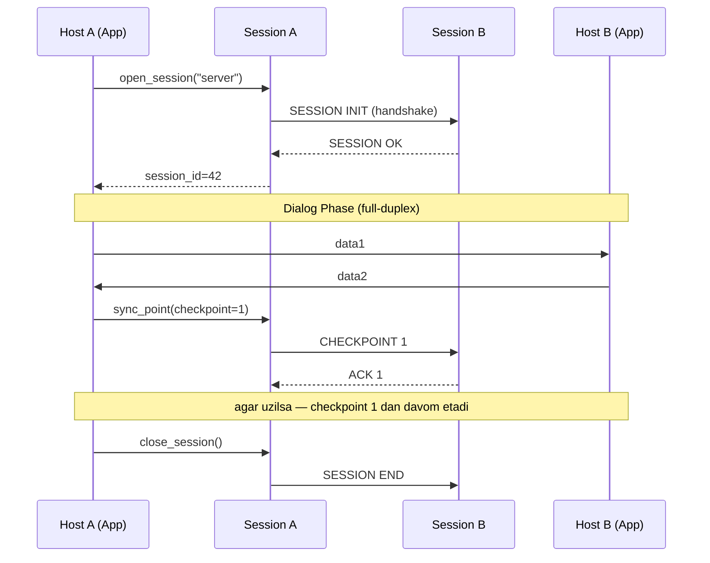
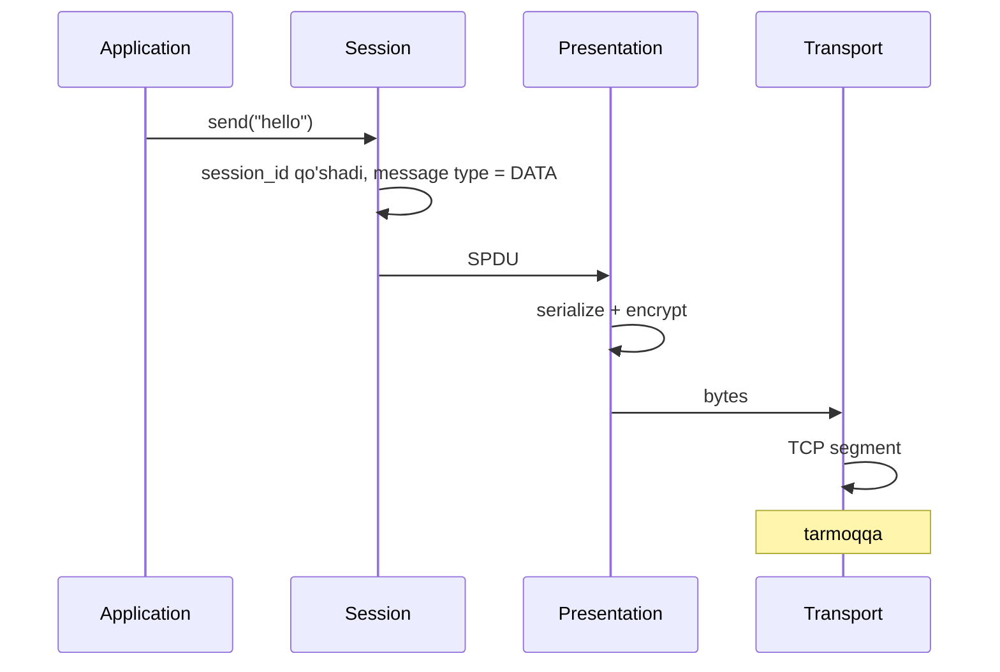

# Layer 5: Session

## 1. Qisqacha tushuncha (TL;DR)

Session layer — bu OSI modelining "muloqotni boshqaruvchi" qatlami. Uning vazifasi — ikki application o'rtasida **logical conversation** (mantiqiy suhbat) ochish, boshqarish va yopish. U dialog control (kim qachon gapiradi), synchronization (checkpoint qo'yish) va recovery (uzilgan session ni tiklash) bilan shug'ullanadi. Misol protokollar: NetBIOS, RPC, SOCKS, NFS, PPTP. Muhim eslatma: TCP/IP modelida bu qatlam **alohida emas** — uning vazifalari Transport va Application layer larga bo'lib yuborilgan, shuning uchun amaliyotda kamroq tilga olinadi.

## 2. Asosiy vazifalari

- **Session establishment va termination:** ikki end-system o'rtasida mantiqiy suhbatni ochish, davom ettirish va tugatish. Bu Transport layer connection dan farqli — bitta session ichida bir nechta TCP connection bo'lishi mumkin.
- **Dialog control:** kim qachon yuboradi — full-duplex (ikkala tomon parallel), half-duplex (navbat bilan) yoki simplex (faqat bir yo'nalish).
- **Synchronization (checkpoint):** uzun data uzatishda "sync point" qo'yish. Agar muvaffaqiyatsizlik bo'lsa, hammasini emas, oxirgi checkpoint dan boshlab qayta yuborish.
- **Recovery va session resumption:** tarmoq uzilsa session ni saqlab qolish va keyin tiklash imkoniyatini berish. Misol: TLS session resumption, SSH ServerAliveInterval.
- **Authentication va authorization (ba'zan):** session ochilganda kim ekanligini tekshirish (NetBIOS session da nom registration).

## 3. Vizual sxema



## 4. Protocol Data Unit (PDU)

Session layerda PDU **SPDU** (Session Protocol Data Unit) yoki oddiygina **session message** deb ataladi. Lekin amalda Layer 5 ga aniq mos keladigan standart PDU formati yo'q — har protokol o'zicha:
- NetBIOS — `NetBIOS session message`
- RPC — `RPC call` / `RPC reply`
- SOCKS — `SOCKS request` / `SOCKS reply`

PDU odatda quyidagilarni o'z ichiga oladi: session ID, message type (open/data/sync/close), va payload.

## 5. Asosiy protokollar

### 5.1 RPC (Remote Procedure Call) — RFC 5531 (ONC RPC), MS-RPC

RPC — bu remote machine dagi funksiyani **xuddi local funksiya kabi** chaqirish. Stub kod RPC message yasaydi, parametr larni serialize qiladi (Layer 6), tarmoqdan o'tkazadi va javobni qaytaradi.

**ONC RPC (Sun RPC) message format:**
```
+-------------------+
|   XID (4 byte)    |  transaction ID
+-------------------+
|  Msg Type (CALL=0)|
+-------------------+
|   RPC Version     |
+-------------------+
|  Program Number   |
+-------------------+
|  Version Number   |
+-------------------+
|  Procedure Number |
+-------------------+
|  Credentials      |
+-------------------+
|  Verifier         |
+-------------------+
|  Arguments...     |  (XDR encoded)
+-------------------+
```

Modern RPC misollar: **gRPC** (Google), **Thrift** (Facebook), **Cap'n Proto**, **JSON-RPC**.

### 5.2 NetBIOS — RFC 1001/1002

Eski IBM/Microsoft tarmoq protokoli. Local tarmoqda machine name (`\\COMPUTER1`) bilan ishlash uchun.

Uch xizmat:
- **NetBIOS Name Service** (UDP 137) — name registration/resolution.
- **NetBIOS Datagram Service** (UDP 138) — connectionless.
- **NetBIOS Session Service** (TCP 139) — connection-oriented session.

Bugun katta tizimlarda kamroq, lekin SMB/CIFS (Windows file sharing) uning ustida ishlaydi.

### 5.3 SOCKS — RFC 1928 (v5)

Application va server o'rtasida proxy. Session layer da ishlaydi — TCP yoki UDP traffic ni tunnel qiladi, lekin application protokol detail iga aralashmaydi (HTTP proxy dan farqli).

```
Client → SOCKS5 Proxy → Real Server

Client SOCKS5 ga aytadi: "men 1.2.3.4:443 ga ulanmoqchiman"
Proxy ulaydi va keyin transparent tunnel qiladi.
```

Tor browser ham SOCKS5 ni ishlatadi.

### 5.4 NFS (Network File System) — RFC 7530 (v4)

Remote filesystem ni local kabi mount qilish. Sun RPC ustida quriladi. Session — bu open file handle, lock, va state.

NFSv4 da ataylab "stateful session" — client va server file lock, open state ni saqlaydi.

### 5.5 PPTP / L2TP — VPN tunneling

VPN texnologiyalari session ochib, tunnel ichida yana bir tarmoq stack ni ishlatadi. PPTP (eskirgan), L2TP+IPsec, SSTP — barchasi session establishment va dialog control bilan shug'ullanadi.

### 5.6 HTTP cookies va web sessions (de-facto Layer 5)

HTTP o'zi **stateless** — har request mustaqil. Lekin amaliyotda "session" kerak (login holati). Buni cookie va session ID bilan qiladi:

```
1. POST /login → Set-Cookie: session_id=abc123
2. GET /profile (Cookie: session_id=abc123) → server tanidi
```

Bu **OSI nazariyasi bo'yicha L5 emas** (chunki application layer da implementatsiya qilingan), lekin **logical session** funksiyasini bajaradi. Modern alternativa — JWT (JSON Web Token).

## 6. Encapsulation/Decapsulation jarayoni



Real TCP/IP da: Session layer alohida bo'lmaganligi uchun Application kod (NFS client, gRPC stub) o'zi session state ni Application layer da boshqaradi.

## 7. Real hayot misoli — SSH session

Sen `ssh user@server` deb yozasan:

1. **TCP connection** (port 22) — Layer 4.
2. **TLS-like handshake** — Layer 6 (key exchange, encryption).
3. **SSH session ochiladi** — bu Layer 5:
   - Authentication (password yoki key).
   - **Channel** ochiladi — bu session ichidagi alohida "stream":
     - `session` channel — interactive shell uchun.
     - `direct-tcpip` channel — port forwarding uchun.
     - `x11` channel — X11 forwarding.
   - Bitta SSH session ichida **bir nechta channel** parallel ishlashi mumkin (multiplexing).
4. **Dialog:** sen yozgan komandalar va server javoblari shu channel orqali full-duplex.
5. **Keep-alive:** `ServerAliveInterval` — session uzilmasligi uchun davriy ping.
6. **Session termination:** `exit` → channel close → session close → TCP FIN.

```bash
ssh -vvv user@server
# debug1: Authentication succeeded (publickey).
# debug1: channel 0: new [client-session]
# debug1: Entering interactive session.
```

## 8. FAQ

**S:** TCP connection bilan session bir xilmi?
**J:** Yo'q. **TCP connection** — Transport layer da, bitta src:port ↔ dst:port juftligi. **Session** — Layer 5 da, mantiqiy suhbat. Bitta session ichida ko'p TCP connection bo'lishi mumkin (FTP — control + data, HTTP/1.1 — bir necha parallel TCP). Yoki bitta TCP ichida ko'p session (SSH multiplex).

**S:** Nega TCP/IP da Session layer alohida emas?
**J:** TCP/IP modeli amaliy yondashuv — kerak bo'lsa session ni Application kod o'zi yoki kutubxona (gRPC, SSH) hal qiladi. OSI 1980-larda dizayn qilinganda har vazifa alohida layer da bo'lishi nazariy chiroyli ko'rinardi, lekin amalda tarqaldi.

**S:** Cookie haqiqatan ham Layer 5 mi?
**J:** Texnik jihatdan yo'q — cookie HTTP header (Layer 7). Lekin u **session funksiyasini** bajaradi (state ni connection lar orasida saqlash). Shuning uchun "Layer 5 ekvivalenti" deb ataladi.

**S:** WebSocket session protokolimi?
**J:** WebSocket Layer 7 da, lekin uning doimiy full-duplex tabiati Layer 5 dialog control xususiyatlarini ham namoyon qiladi. Modern web da "session" odatda WebSocket yoki HTTP cookie + token bilan amalga oshiriladi.

**S:** Half-duplex va full-duplex farqi nima?
**J:** **Full-duplex** — ikkala tomon **bir vaqtda** yuborishi mumkin (telefon suhbati). **Half-duplex** — navbat bilan (walkie-talkie: "over"). **Simplex** — faqat bir yo'nalish (radio eshittirish). TCP — full-duplex.

**S:** Synchronization checkpoint nima uchun kerak?
**J:** Tasavvur qil — 100 GB faylni uzatyapsan, 90 GB da uzilib qoldi. Checkpoint sayasida 0 dan emas, oxirgi check (masalan, 80 GB) dan davom etasan. Modern HTTP da `Range: bytes=80000000-` header bilan resume qilamiz.

## 9. Troubleshooting

```bash
# Hozirgi session lar (Linux)
who                       # login bo'lgan foydalanuvchilar
w                         # ko'proq detail
last                      # tarixiy login lar
ss -tnp                   # active TCP connection lar (state bilan)

# SSH session debug
ssh -vvv user@host        # verbose debug
ssh -o ServerAliveInterval=30 user@host
ssh -M -S /tmp/ssh-sock user@host    # master/multiplex mode

# SSH session muxlator (control)
ssh -O check user@host
ssh -O exit user@host

# RPC service larni ko'rish (Linux)
rpcinfo -p localhost
rpcinfo -p remote-host

# NFS session
showmount -e nfs-server
mount -t nfs nfs-server:/export /mnt
nfsstat -c                # client stat

# SOCKS proxy test
curl --socks5 localhost:1080 https://example.com
ssh -D 1080 user@host    # SOCKS proxy yaratish

# Web session debug
curl -c cookies.txt -b cookies.txt https://example.com/login -d "user=a&pass=b"
curl -b cookies.txt https://example.com/profile

# Tarmoqdagi session lar
sudo netstat -anp | grep ESTABLISHED
sudo ss -anp state established
```

**Tipik muammo:** "SSH session uzilib qoladi 5 minutda."
1. NAT timeout — keepalive yo'q. `ServerAliveInterval=30` qo'sh.
2. Server `ClientAliveInterval` ni tekshir (`/etc/ssh/sshd_config`).
3. `tmux` yoki `screen` ishlat — session client ga bog'liq bo'lmaydi.

## 10. Cross-references

- Yuqori layer: [./06-presentation.md](./06-presentation.md)
- Quyi layer: [./04-transport.md](./04-transport.md)
- Tegishli deep-dive lar:
  - [../deep-dives/tls-ssl.md](../deep-dives/tls-ssl.md) — TLS session resumption
  - [../deep-dives/http-evolution.md](../deep-dives/http-evolution.md) — HTTP cookie va session
- Glossary: [../00-foundations/glossary.md](../00-foundations/glossary.md)

## 11. Manbalar

- **Kitob:** Kurose & Ross, Computer Networking: A Top-Down Approach, 6-nashr, Bob 2.
- **Tanenbaum:** Computer Networks, 5th edition — OSI Layer 5 batafsil.
- **RFC:**
  - [RFC 5531 — ONC RPC v2](https://datatracker.ietf.org/doc/html/rfc5531)
  - [RFC 1001/1002 — NetBIOS](https://datatracker.ietf.org/doc/html/rfc1001)
  - [RFC 1928 — SOCKS v5](https://datatracker.ietf.org/doc/html/rfc1928)
  - [RFC 7530 — NFSv4](https://datatracker.ietf.org/doc/html/rfc7530)
  - [RFC 4254 — SSH Connection Protocol (channel)](https://datatracker.ietf.org/doc/html/rfc4254)
- **Web manbalar:**
  - [Cloudflare — OSI Model Layer 5](https://www.cloudflare.com/learning/ddos/glossary/open-systems-interconnection-model-osi/)
  - [gRPC concepts](https://grpc.io/docs/what-is-grpc/core-concepts/)
