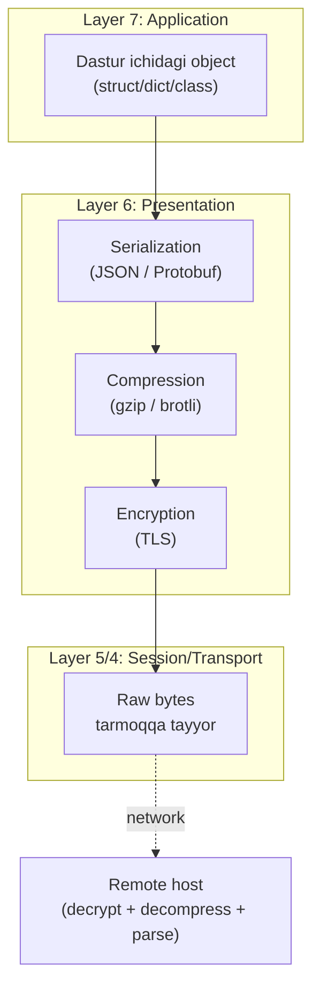
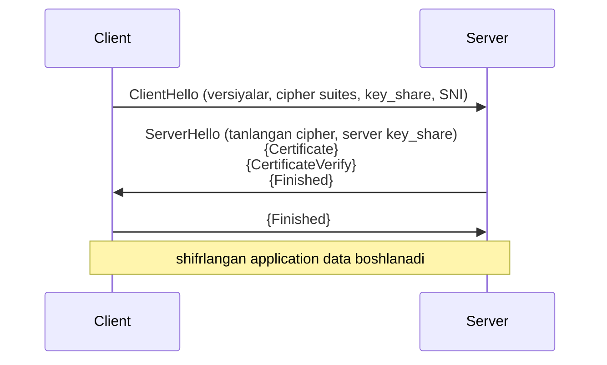
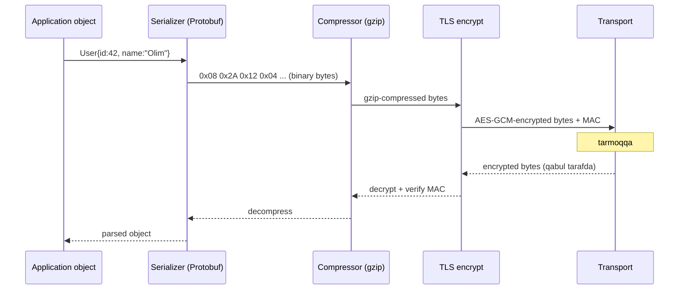

# Layer 6: Presentation

## 1. Qisqacha tushuncha (TL;DR)

Presentation layer — bu OSI modelining "tarjimon" qatlami. Uning asosiy vazifasi — application layerdan kelgan data ni tarmoq orqali yuborishga mos formatga o'tkazish va qabul tarafda teskari ishlash. Bu yerda **encoding** (UTF-8, ASCII), **serialization** (JSON, Protobuf), **compression** (gzip, brotli) va **encryption** (TLS) sodir bo'ladi. Amalda TCP/IP stack da bu qatlam alohida emas — uning vazifalari Layer 7 ichida yoki TLS kabi alohida kutubxonalarda bajariladi, ammo OSI nazariyasida muhim o'rin tutadi.

## 2. Asosiy vazifalari

- **Data translation (encoding):** har xil sistemalar (Linux/Windows, ARM/x86) o'rtasida bytelar ma'nosi bir xil tushunilishini ta'minlaydi. ASCII, UTF-8, UTF-16, EBCDIC orasidagi farqlarni hal qiladi.
- **Serialization / deserialization:** dastur ichidagi struct/object ni tarmoqdan o'tadigan byte stream ga aylantirish va qaytarish (JSON, XML, Protobuf, MessagePack).
- **Compression:** data hajmini kichraytirish — gzip, brotli, zstd. Bu bandwidth tejaydi va response time ni kamaytiradi.
- **Encryption / decryption:** confidentiality va integrity uchun data ni shifrlash (TLS/SSL). Bu OSI da L6 ga tegishli, lekin amalda L4-L7 chegarasida ishlaydi.
- **Byte order normalization:** turli CPU architecturalari (big-endian / little-endian) o'rtasida bir xil "network byte order" (big-endian) ni qo'llash.

## 3. Vizual sxema



## 4. Protocol Data Unit (PDU)

Presentation layerda alohida nomlangan PDU yo'q — u Application layer message ini transformatsiya qiladi. Lekin amaliy sub-protokollarda o'z PDU lari bor:
- **TLS Record** — TLS ning PDU si (max 16 KB).
- **gRPC frame** — Protobuf message ni HTTP/2 frame ichiga o'rab.
- Compressed `gzip` block — compressed stream chunk.

Encapsulation jarayonida: dastur ichidagi struct → serialized bytes → (optional) compressed bytes → (optional) encrypted bytes → Transport layerga.

## 5. Asosiy protokollar va texnologiyalar

### 5.1 Character encoding

| Encoding | Bayt/char | Diapazon | Misol |
|----------|-----------|----------|-------|
| **ASCII** | 1 byte (7 bit) | 0-127 | `A` = `0x41` |
| **UTF-8** | 1-4 byte | Unicode (1.1M+) | `O` = `0x4F`, `O'` = `0xCB 0xBB`, `😀` = `0xF0 0x9F 0x98 0x80` |
| **UTF-16** | 2 yoki 4 byte | Unicode | Windows internal, JavaScript string |
| **EBCDIC** | 1 byte | IBM mainframe | legacy bank tizimlari |

**UTF-8 ning afzalligi:** ASCII bilan compatible (ASCII matn — valid UTF-8), self-synchronizing (har byte ning yuqori bitlari role ni ko'rsatadi), variable-length.

### 5.2 Data serialization formatlari

**JSON (RFC 8259) — text-based:**
```json
{"id": 42, "name": "Olim", "active": true}
```
Afzalligi: human-readable, hamma joyda support. Kamchiligi: katta hajm, parse sekin.

**XML — text-based:**
```xml
<user><id>42</id><name>Olim</name></user>
```
Verbose, lekin schema (XSD) qo'llab-quvvatlaydi.

**Protocol Buffers (Protobuf) — binary:**
```protobuf
message User {
  int32 id = 1;
  string name = 2;
  bool active = 3;
}
```
Wire format (binary):
```
 0                   1                   2
 0 1 2 3 4 5 6 7 8 9 0 1 2 3 4 5 6 7 8 9 0 1
+-+-+-+-+-+-+-+-+-+-+-+-+-+-+-+-+-+-+-+-+-+-+
| Tag (field# << 3 | wire_type) | Value...  |
+-+-+-+-+-+-+-+-+-+-+-+-+-+-+-+-+-+-+-+-+-+-+
```
JSON ga nisbatan 3-10x kichikroq, parse 5-100x tezroq. gRPC ning asosi.

**MessagePack** — binary, JSON-compatible schema, IoT da ko'p.

### 5.3 Compression algoritmlari

| Algoritm | Tezlik | Compression ratio | Qachon ishlatiladi |
|----------|--------|-------------------|--------------------|
| **gzip** (DEFLATE) | tez | yaxshi | HTTP `Content-Encoding: gzip`, eng keng tarqalgan |
| **brotli** | sekinroq encode | gzip ga nisbatan ~20% yaxshi | HTTP/2-3, Google web |
| **zstd** | juda tez | yaxshi | Facebook, modern tarmoq, Linux kernel |
| **deflate** | tez | gzip kabi | eskirgan, raw stream |

HTTP da client `Accept-Encoding: gzip, br, zstd` yuboradi, server eng yaxshisini tanlaydi.

### 5.4 TLS (Transport Layer Security) — RFC 8446 (v1.3)

TLS — bu eng muhim Presentation layer protokoli. U **encryption + integrity + authentication** beradi.

**TLS Record format:**
```
 0                   1                   2                   3
 0 1 2 3 4 5 6 7 8 9 0 1 2 3 4 5 6 7 8 9 0 1 2 3 4 5 6 7 8 9 0 1
+-+-+-+-+-+-+-+-+-+-+-+-+-+-+-+-+-+-+-+-+-+-+-+-+-+-+-+-+-+-+-+-+
| Content Type  |        Version (TLS 1.2 = 0x0303)             |
+-+-+-+-+-+-+-+-+-+-+-+-+-+-+-+-+-+-+-+-+-+-+-+-+-+-+-+-+-+-+-+-+
|             Length            |  Encrypted Payload ...        |
+-+-+-+-+-+-+-+-+-+-+-+-+-+-+-+-+-+-+-+-+-+-+-+-+-+-+-+-+-+-+-+-+
|                ... payload + MAC + Padding ...                 |
+-+-+-+-+-+-+-+-+-+-+-+-+-+-+-+-+-+-+-+-+-+-+-+-+-+-+-+-+-+-+-+-+
```

`Content Type`: 22 = Handshake, 23 = Application Data, 21 = Alert, 20 = Change Cipher Spec.

**TLS 1.3 handshake (1-RTT):**


TLS 1.2 ga nisbatan TLS 1.3 — 1-RTT (oldin 2-RTT edi), eskirgan cipher lar olib tashlangan, 0-RTT resumption mavjud. Batafsil — [tls-ssl.md](../deep-dives/tls-ssl.md).

### 5.5 Byte order — big-endian vs little-endian

```
32-bit son: 0x12345678 ni 4 byte da saqlash:

Big-endian (network byte order):
+----+----+----+----+
| 12 | 34 | 56 | 78 |
+----+----+----+----+
addr: 0    1    2    3

Little-endian (x86, ARM default):
+----+----+----+----+
| 78 | 56 | 34 | 12 |
+----+----+----+----+
```

Tarmoqqa yuborilayotgan har bir multi-byte raqam **network byte order** (big-endian) da bo'lishi kerak. C da `htonl()`, `htons()` funksiyalari shu uchun. Go da `binary.BigEndian.PutUint32()`.

## 6. Encapsulation/Decapsulation jarayoni



## 7. Real hayot misoli — gRPC request

Sen Go service da `userClient.GetUser(ctx, &UserRequest{Id: 42})` deb yozasan:

1. **Application layer:** `UserRequest{Id: 42}` Go struct.
2. **Presentation — serialization:** Protobuf encoder → `0x08 0x2A` (field 1, varint 42). 2 byte!
3. **Presentation — framing:** HTTP/2 frame header qo'shiladi (5 byte) + gRPC header (5 byte: compression flag + length).
4. **Presentation — TLS encryption:** TLS 1.3 record da AES-GCM bilan shifrlanadi.
5. **Transport (TCP):** segment lar.
6. **Network/Data Link/Physical:** packetlar tarmoqqa.

JSON bilan solishtirsak: `{"id":42}` = 9 byte. Protobuf — 2 byte. 4.5x kichikroq.

```bash
# tshark bilan TLS handshake ni ko'rish
sudo tshark -i any -Y "tls.handshake" -O tls
```

## 8. FAQ

**S:** Presentation layer alohida ishlaydigan dasturmi?
**J:** Yo'q. TCP/IP stack da bu layer alohida emas. Vazifalari application kod ichida (`json.Marshal()`, `gzip.Writer`) yoki kutubxona (OpenSSL, BoringSSL) sifatida bajariladi. OSI modelida konseptual ravishda mavjud.

**S:** TLS Layer 4 mi yoki Layer 6 mi?
**J:** Nomi "Transport Layer Security" — lekin u TCP **ustida** ishlaydi va data ni shifrlaydi/format qiladi. OSI model ga moslab — Layer 6 (Presentation) ga to'g'ri keladi. Amalda L4-L7 chegarasida.

**S:** UTF-8 va Unicode bir xilmi?
**J:** Yo'q. **Unicode** — bu character set (har bir belgiga raqam: `A` = U+0041, `O'` = U+040E). **UTF-8** — bu Unicode raqamini bytega aylantirish usuli (encoding). UTF-16, UTF-32 ham boshqa encoding lar.

**S:** JSON dan Protobuf ga o'tish qachon foydali?
**J:** Yuqori QPS (request/sec), katta payload, mobile bandwidth muhim, microservice ichidagi muloqot. Public API da JSON oson va debug uchun yaxshi.

**S:** HTTPS da compression xavfli emasmi (CRIME, BREACH)?
**J:** Ha, TLS-level compression CRIME hujumiga olib kelgan. TLS 1.3 da compression butunlay olib tashlangan. Faqat HTTP-level (gzip, brotli) ishlatiladi va u ham secret data uchun ehtiyot bilan.

## 9. Troubleshooting

```bash
# TLS sertifikat tekshirish
openssl s_client -connect google.com:443 -servername google.com -showcerts
openssl x509 -in cert.pem -text -noout

# TLS versiyasi va cipher
openssl s_client -connect example.com:443 -tls1_3
nmap --script ssl-enum-ciphers -p 443 example.com

# HTTP compression tekshirish
curl -H "Accept-Encoding: gzip" -I https://example.com
curl --compressed -v https://example.com

# Encoding muammolari
file -i somefile.txt          # encoding aniqlash
iconv -f WINDOWS-1251 -t UTF-8 input.txt > output.txt
hexdump -C file.bin | head    # raw byte ko'rish

# JSON validate va format
echo '{"id":42}' | jq .
curl -s https://api.example.com/users | jq '.users[0]'

# Protobuf decode (schema kerak)
protoc --decode_raw < message.bin

# TLS traffic ushlash (key kerak decrypt uchun)
sudo tshark -i any -f "port 443" -o tls.keylog_file:/tmp/sslkeys.log
SSLKEYLOGFILE=/tmp/sslkeys.log curl https://example.com

# Byte order tekshirish (Linux)
lscpu | grep "Byte Order"
```

**Tipik muammo:** "API qaytayotgan matn `??????` bo'lib ko'ringani."
1. `Content-Type` header ni tekshir — `charset=UTF-8` bormi?
2. `file -i` bilan haqiqiy encoding ni aniqla.
3. Client va server bir xil encoding ishlatyaptimi?

## 10. Cross-references

- Yuqori layer: [./07-application.md](./07-application.md)
- Quyi layer: [./05-session.md](./05-session.md)
- Tegishli deep-dive lar:
  - [../deep-dives/tls-ssl.md](../deep-dives/tls-ssl.md) — TLS 1.2 / 1.3 chuqur
- Glossary: [../00-foundations/glossary.md](../00-foundations/glossary.md)

## 11. Manbalar

- **Kitob:** Kurose & Ross, Computer Networking: A Top-Down Approach, 6-nashr, Bob 2 va 8 (Security).
- **RFC:**
  - [RFC 8446 — TLS 1.3](https://datatracker.ietf.org/doc/html/rfc8446)
  - [RFC 8259 — JSON](https://datatracker.ietf.org/doc/html/rfc8259)
  - [RFC 1951 — DEFLATE](https://datatracker.ietf.org/doc/html/rfc1951)
  - [RFC 1952 — gzip](https://datatracker.ietf.org/doc/html/rfc1952)
  - [RFC 7932 — Brotli](https://datatracker.ietf.org/doc/html/rfc7932)
  - [RFC 3629 — UTF-8](https://datatracker.ietf.org/doc/html/rfc3629)
- **Web manbalar:**
  - [The Illustrated TLS 1.3 Connection](https://tls13.xargs.org/)
  - [Cloudflare TLS handshake](https://www.cloudflare.com/learning/ssl/what-happens-in-a-tls-handshake/)
  - [Protocol Buffers Encoding](https://protobuf.dev/programming-guides/encoding/)
