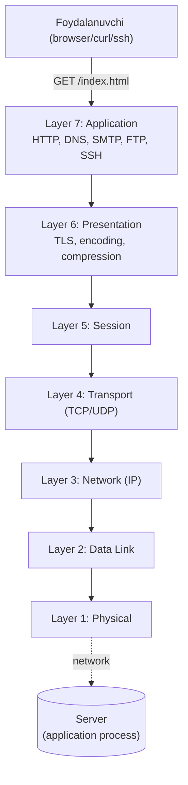
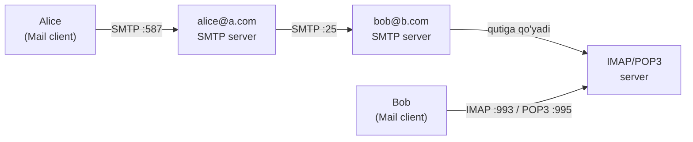
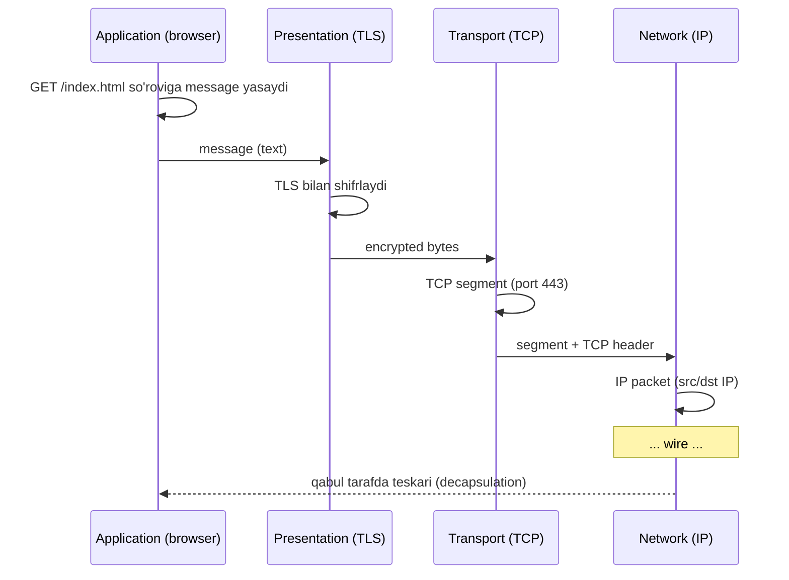

# Layer 7: Application

## 1. Qisqacha tushuncha (TL;DR)

Application layer — bu OSI modelining eng yuqori qatlami bo'lib, foydalanuvchi va dasturlar bevosita "ko'rib turadigan" qatlam. Bu yerda HTTP, FTP, SMTP, DNS, SSH kabi protokollar ishlaydi. Application layerda data **message** deb nomlanadi va bu qatlam quyi qatlamlardan (asosan Transport layerdan) foydalanib, foydalanuvchi uchun ma'noli xizmatlar (web sahifa yuklash, email yuborish, fayl uzatish) ko'rsatadi. Muhim nuqta: bu qatlam **end-system** (host) larda ishlaydi — router yoki switch da emas.

## 2. Asosiy vazifalari

- **Network xizmatlarini foydalanuvchiga taqdim etish:** browser, email client, SSH client kabi dasturlarga interface beradi. Foydalanuvchi `https://google.com` yozsa — bu qatlam HTTP request yasaydi.
- **Application protocol semantikasini belgilash:** message turlari (request/response), syntax (qaysi field qayerda), semantics (har bir field ma'nosi) va vaqt qoidalari (kim qachon yuboradi).
- **Resource identification:** URL, URI, email manzil, hostname kabi name space larni boshqarish va ularni quyi qatlam manzillariga (IP, port) tarjima qilish.
- **Format/syntax muzokarasi:** content-type, encoding, language ni client va server o'rtasida kelishish (masalan, HTTP `Accept`, `Content-Type` header lar orqali).
- **Authentication va session management:** kim ekanligini tekshirish, login holatini saqlash (cookie, token, SSH key).

## 3. Vizual sxema



## 4. Protocol Data Unit (PDU)

Application layerda PDU **message** (xabar) deb nomlanadi. Misollar:
- HTTP — `HTTP request` / `HTTP response` message
- DNS — `DNS query` / `DNS response` message
- SMTP — `SMTP command/reply` message

Message yuqori dasturdan kelgan xom data ni o'z formatiga (text yoki binary) o'rab, application header qo'shadi. Keyin bu message Transport layerga (TCP yoki UDP) `socket` orqali topshiriladi. Transport layer uni `segment` (TCP) yoki `datagram` (UDP) ga o'raydi.

## 5. Asosiy protokollar

### 5.1 HTTP (HyperText Transfer Protocol) — RFC 9110, 9112, 9113, 9114

Web ning yuragi. Client (browser) server dan resource (HTML, image, JSON) so'raydi.

**HTTP Request strukturasi (text-based, ASCII):**
```
 0                   1                   2                   3
 0 1 2 3 4 5 6 7 8 9 0 1 2 3 4 5 6 7 8 9 0 1 2 3 4 5 6 7 8 9 0 1
+-+-+-+-+-+-+-+-+-+-+-+-+-+-+-+-+-+-+-+-+-+-+-+-+-+-+-+-+-+-+-+-+
|  Method (GET/POST/...)  SP  Request-URI  SP  HTTP-Version CRLF |
+-+-+-+-+-+-+-+-+-+-+-+-+-+-+-+-+-+-+-+-+-+-+-+-+-+-+-+-+-+-+-+-+
|  Header-Name: Header-Value CRLF                                |
|  ... (yana header lar) ...                                     |
+-+-+-+-+-+-+-+-+-+-+-+-+-+-+-+-+-+-+-+-+-+-+-+-+-+-+-+-+-+-+-+-+
|  CRLF (bo'sh qator — header tugadi)                            |
+-+-+-+-+-+-+-+-+-+-+-+-+-+-+-+-+-+-+-+-+-+-+-+-+-+-+-+-+-+-+-+-+
|  Message-Body (optional, POST/PUT uchun)                       |
+-+-+-+-+-+-+-+-+-+-+-+-+-+-+-+-+-+-+-+-+-+-+-+-+-+-+-+-+-+-+-+-+
```

**Real misol — `curl -v https://example.com`:**
```
> GET / HTTP/1.1
> Host: example.com
> User-Agent: curl/8.5.0
> Accept: */*
>
< HTTP/1.1 200 OK
< Content-Type: text/html; charset=UTF-8
< Content-Length: 1256
< Date: Mon, 05 May 2026 10:23:45 GMT
< Server: nginx/1.25
<
<!doctype html><html>...
```

**Versiyalari (qisqacha — to'liq batafsil [http-evolution.md](../deep-dives/http-evolution.md)):**
- **HTTP/1.0** — har request uchun yangi TCP connection.
- **HTTP/1.1** — persistent connection, pipelining, `Host` header (virtual hosting).
- **HTTP/2** — binary framing, multiplexing (bitta TCP connection ustida ko'p stream), HPACK header compression.
- **HTTP/3** — UDP ustida QUIC transport, TLS 1.3 integratsiyalashgan, head-of-line blocking yo'q. RFC 9114 (June 2022). 2026 yilda 95%+ browser qo'llab-quvvatlaydi, top 10M sayt larning ~34% ishlatadi.

### 5.2 DNS (Domain Name System) — RFC 1034, 1035

Hostname ni IP ga tarjima qiladi. Asosan UDP/53 (kichik query), kerak bo'lsa TCP/53 (zone transfer, katta response). Batafsil — [dns-resolution.md](../deep-dives/dns-resolution.md).

**DNS Message format:**
```
+---------------------+
|        Header       |  12 byte (ID, flags, count lar)
+---------------------+
|       Question      |  qaysi nom so'ralayapti
+---------------------+
|        Answer       |  RR (Resource Record) lar
+---------------------+
|      Authority      |  authoritative server lar
+---------------------+
|      Additional     |  qo'shimcha RR
+---------------------+
```

`dig +short google.com` → `142.250.74.110`

### 5.3 FTP (File Transfer Protocol) — RFC 959

Fayl uzatish uchun ikki TCP connection ishlatadi:
- **Control connection** (port 21) — komandalar (USER, PASS, RETR, STOR).
- **Data connection** (port 20 yoki dynamic) — haqiqiy fayl content.

**Active mode:** server client ga data connection ochadi (firewall muammosi).
**Passive mode (PASV):** client server ga data connection ochadi (modern, NAT-friendly).

Bugungi kunda FTP zaiflashgan (clear text), o'rniga **SFTP** (SSH ustida) yoki **FTPS** (TLS ustida) ishlatiladi.

### 5.4 SMTP / IMAP / POP3 — Email pipeline



- **SMTP (RFC 5321)** — yuborish (port 25 server-to-server, 587 submission with TLS).
- **IMAP (RFC 9051)** — server da xat saqlash, ko'p qurilmadan kirish.
- **POP3 (RFC 1939)** — xatni yuklab olib, server dan o'chirish.

### 5.5 SSH (Secure Shell) — RFC 4251-4254

Remote shell access, fayl uzatish (SCP, SFTP), port forwarding.

**Handshake bosqichlari:**
1. TCP connection (port 22).
2. Version exchange (`SSH-2.0-OpenSSH_9.6`).
3. Algorithm negotiation (key exchange, cipher, MAC).
4. Diffie-Hellman key exchange — shared secret.
5. Server authentication (host key).
6. Client authentication (password, public key).
7. Channel ochiladi — har channel alohida service (shell, SFTP, port-forward).

### 5.6 Modern protokollar (qisqacha)

- **WebSocket (RFC 6455)** — HTTP `Upgrade` orqali full-duplex doimiy connection. Real-time chat, online game.
- **gRPC** — Google ning RPC framework i, HTTP/2 ustida, Protobuf serialization, bi-directional streaming.
- **MQTT (ISO 20922)** — IoT uchun lightweight publish/subscribe, TCP yoki TLS ustida, port 1883/8883. Sensor → broker → ko'p subscriber.
- **GraphQL** — HTTP ustida query language, REST ga alternativa.

## 6. Encapsulation/Decapsulation jarayoni



## 7. Real hayot misoli — `https://google.com` ga kirish

1. **DNS resolution:** browser → OS → resolver → root → .com → google.com NS → `142.250.74.110`. UDP/53.
2. **TCP handshake:** SYN → SYN-ACK → ACK (port 443).
3. **TLS handshake:** ClientHello → ServerHello + Certificate → key exchange → Finished. (TLS 1.3 da 1-RTT).
4. **HTTP request:** `GET / HTTP/2\r\nHost: google.com\r\n...`.
5. **HTTP response:** `HTTP/2 200 OK` + HTML body (gzip yoki brotli compressed).
6. Browser HTML ni parse qiladi, ichidagi ``, `<script>`, `<link>` lar uchun yana request lar yuboradi (HTTP/2 da multiplex bilan parallel).
7. JavaScript ishga tushadi, `fetch('/api/...')` lar yana request yasaydi.

## 8. FAQ

**S:** HTTP va HTTPS o'rtasidagi farq nima — boshqa protokolmi?
**J:** Yo'q, ikkalasi ham HTTP. HTTPS — bu HTTP + TLS. Ya'ni HTTP message TLS bilan shifrlanib, keyin TCP ga beriladi. Port 80 (HTTP) o'rniga 443 (HTTPS).

**S:** Nega DNS UDP ishlatadi, TCP emas?
**J:** DNS query/response juda kichik (odatda <512 byte) va tez bo'lishi kerak. TCP handshake (3 packet) overhead beradi. UDP da bitta query/response — 2 ta packet. Lekin response katta bo'lsa (DNSSEC, zone transfer) TCP/53 ishlatiladi.

**S:** HTTP stateless degani nima?
**J:** Server har request ni mustaqil ko'radi — oldin nima bo'lganini eslamaydi. State kerak bo'lsa cookie, session token, JWT bilan client o'zi olib yuradi.

**S:** WebSocket va HTTP/2 multiplexing bir xilmi?
**J:** Yo'q. HTTP/2 multiplex — bu ko'p **request/response** stream. WebSocket — bu **simmetrik full-duplex** kanal: server xohlagan vaqt client ga push qila oladi (request kutmasdan).

**S:** Application layer da har doim TCP ishlatiladimi?
**J:** Yo'q. DNS asosan UDP, VoIP/RTP UDP, DHCP UDP, SNMP UDP. TCP — reliability kerak bo'lganda. HTTP/3 esa UDP ustidagi QUIC ni ishlatadi.

**S:** Port 80 va 443 ni kim belgilaydi?
**J:** IANA (Internet Assigned Numbers Authority) — `www.iana.org/assignments/service-names-port-numbers`. 0-1023 — well-known portlar.

## 9. Troubleshooting

```bash
# DNS muammomi?
dig google.com
nslookup google.com 8.8.8.8
host google.com

# HTTP javob beryaptimi?
curl -v https://google.com
curl -I https://google.com          # faqat header
curl --http2 -v https://google.com  # HTTP/2 ni majburlash
curl --http3 -v https://google.com  # HTTP/3 (curl QUIC support kerak)

# TLS sertifikat ko'rish
openssl s_client -connect google.com:443 -servername google.com
openssl s_client -connect google.com:443 -tls1_3

# Port ochiqmi?
nc -zv google.com 443
telnet smtp.gmail.com 587

# Application traffic ni ushlash
sudo tshark -i any -f "port 443" -Y "http2"
sudo tcpdump -A -s0 -i any port 80    # HTTP plain text

# Email server tekshirish
nc smtp.gmail.com 587
EHLO test.com

# SSH debug
ssh -vvv user@host

# Listening application lar
sudo ss -tlnp        # TCP listen
sudo lsof -i :443    # 443 ni kim ishlatyapti
```

**Tipik muammo:** "Sayt ochilmayapti."
1. `ping 8.8.8.8` — internet bormi?
2. `dig google.com` — DNS ishlayaptimi?
3. `curl -v https://google.com` — HTTPS qayerda to'xtaydi?
4. `traceroute google.com` — qayerda qotyapti?

## 10. Cross-references

- Quyi layer: [./06-presentation.md](./06-presentation.md)
- Yuqori layer: yo'q (eng yuqori)
- Tegishli deep-dive lar:
  - [../deep-dives/http-evolution.md](../deep-dives/http-evolution.md) — HTTP/1.0 → HTTP/3
  - [../deep-dives/dns-resolution.md](../deep-dives/dns-resolution.md) — DNS chuqur
  - [../deep-dives/tls-ssl.md](../deep-dives/tls-ssl.md) — TLS handshake
- Glossary: [../00-foundations/glossary.md](../00-foundations/glossary.md)

## 11. Manbalar

- **Kitob:** Kurose & Ross, Computer Networking: A Top-Down Approach, 6-nashr, Bob 2 (Application Layer), 107-200 b.
- **RFC:**
  - [RFC 9110 — HTTP Semantics](https://datatracker.ietf.org/doc/html/rfc9110)
  - [RFC 9112 — HTTP/1.1](https://datatracker.ietf.org/doc/html/rfc9112)
  - [RFC 9113 — HTTP/2](https://datatracker.ietf.org/doc/html/rfc9113)
  - [RFC 9114 — HTTP/3](https://datatracker.ietf.org/doc/html/rfc9114)
  - [RFC 1034/1035 — DNS](https://datatracker.ietf.org/doc/html/rfc1035)
  - [RFC 5321 — SMTP](https://datatracker.ietf.org/doc/html/rfc5321)
  - [RFC 959 — FTP](https://datatracker.ietf.org/doc/html/rfc959)
  - [RFC 4251 — SSH](https://datatracker.ietf.org/doc/html/rfc4251)
- **Web manbalar:**
  - [HTTP/3 explained](https://http.dev/3)
  - [Cloudflare HTTP/3 docs](https://developers.cloudflare.com/speed/optimization/protocol/http3/)
  - [MDN — HTTP overview](https://developer.mozilla.org/en-US/docs/Web/HTTP/Overview)
  - [HTTP/3 Wikipedia](https://en.wikipedia.org/wiki/HTTP/3)
