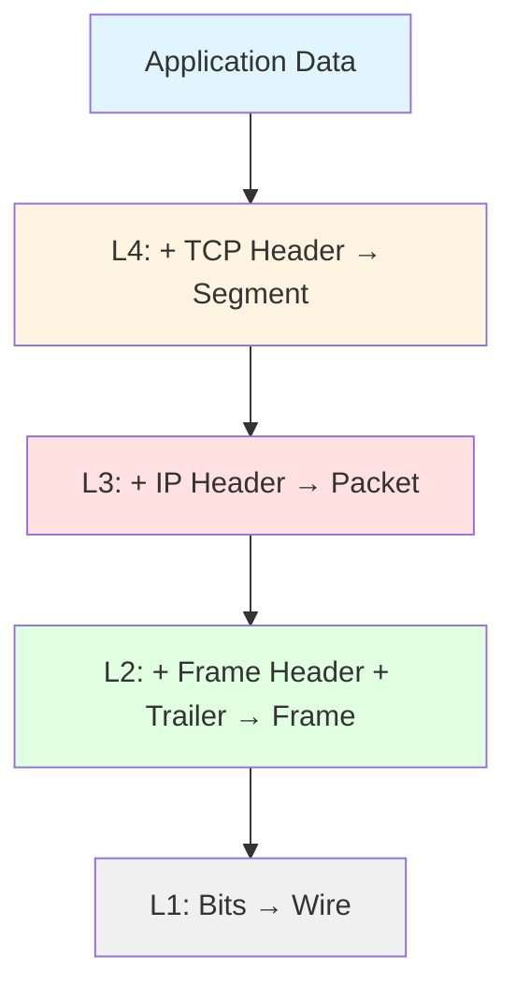

# OSI (Open Systems Interconnection) Model

OSI model — bu ISO (International Organization for Standardization) tomonidan 1984-yilda rasmiy joriy etilgan **7 layerli kontseptual model**. G'oya 1969-yilda paydo bo'lgan, lekin amalda qo'llanishi 15 yil kutilgan.

OSI model **Internetda ishlatilmaydi** — Internet TCP/IP modelida ishlaydi. Lekin OSI model **o'rganish va networkni tushuntirish uchun standart**: networking sohasidagi har qanday kitob, kurs, sertifikat (CCNA, Network+) OSI dan boshlaydi.

---

## Nima uchun OSI hali ham muhim?

1. **Universal til:** Network engineerlar bir-biri bilan "Layer 3 da muammo bor" deb gaplashadi — bu OSI tilidir.
2. **Troubleshooting metodologiyasi:** "Bottom-up" yoki "Top-down" troubleshooting — OSI layerlarini bir-biriga eliminatsiya qilish orqali muammoni topish.
3. **Vendor neytral:** Cisco, Juniper, MikroTik, hech bir vendor o'zining modelini majburlamaydi — hammasi OSI ga ishora qiladi.
4. **Education first:** TCP/IP ni tushunish uchun OSI ni bilish shart.

---

## 7 ta layer — qisqa

```
┌─────────────────────────────────────────────────────────────┐
│  7. Application   │  Foydalanuvchi ko'radigan protokollar    │
│  6. Presentation  │  Encoding, encryption, compression       │
│  5. Session       │  Session boshqarish, dialog              │
│  4. Transport     │  TCP/UDP — segment, port                 │
│  3. Network       │  IP — packet, routing, addressing        │
│  2. Data Link     │  MAC — frame, switch, ARP                │
│  1. Physical      │  Bit, kabel, optika, wifi                │
└─────────────────────────────────────────────────────────────┘
```

| # | Layer | PDU | Misol protokollar |
|---|-------|-----|--------------------|
| 7 | Application | Data / Message | HTTP, FTP, SMTP, DNS, SSH, telnet |
| 6 | Presentation | Data | TLS/SSL, JPEG, MPEG, ASCII, Unicode |
| 5 | Session | Data | NetBIOS, RPC, SQL session, SOCKS |
| 4 | Transport | Segment (TCP) / Datagram (UDP) | TCP, UDP, SCTP |
| 3 | Network | Packet | IP, ICMP, IGMP, IPsec, OSPF, BGP |
| 2 | Data Link | Frame | Ethernet, PPP, ARP, HDLC, Wi-Fi (802.11) |
| 1 | Physical | Bit | Kabel, optika, radio, RJ-45, fiber |

---

## Layerlarni eslab qolish

### Pastdan tepaga (1 → 7):
**P**lease **D**o **N**ot **T**hrow **S**ausage **P**izza **A**way
(Physical, Data Link, Network, Transport, Session, Presentation, Application)

### Tepadan pastga (7 → 1) — Top-Down:
**A**ll **P**eople **S**eem **T**o **N**eed **D**ata **P**rocessing
(Application, Presentation, Session, Transport, Network, Data Link, Physical)

---

## Layer guruhlari

```
┌──────────────────────┐
│ 7. Application       │  ◄── Host layers
│ 6. Presentation      │      (OS / dasturda implementatsiya)
│ 5. Session           │
├──────────────────────┤
│ 4. Transport         │  ◄── Tarmoq bilan ishlaydigan layerlar
│ 3. Network           │
│ 2. Data Link         │
│ 1. Physical          │
└──────────────────────┘
```

- **L5–L7 (Host layers):** Operatsion sistema yoki dastur ichida ishlaydi. Bular network kabel haqida hech narsa bilmaydi.
- **L1–L4 (Network layers):** Tarmoq qurilmalari (router, switch) shu layerlar bilan ishlaydi.

---

## Encapsulation jarayoni

Application data networkga chiqishidan oldin har layerda **header** qo'shiladi:



Qabul tarafda esa **decapsulation** — har layerda header olib tashlanadi va data yuqoriga uzatiladi.

To'liq tushuntirish: [00-foundations/osi-vs-tcpip.md](../00-foundations/osi-vs-tcpip.md).

---

## Layerlarni o'qish tartibi

Kitob nomi **"Top-Down"** bo'lgani sababli, biz ham 7-layerdan boshlaymiz (foydalanuvchiga yaqin) va 1-layergacha tushamiz:

1. [Layer 7: Application](07-application.md)
2. [Layer 6: Presentation](06-presentation.md)
3. [Layer 5: Session](05-session.md)
4. [Layer 4: Transport](04-transport.md) ⭐ (TCP/UDP — eng muhim)
5. [Layer 3: Network](03-network.md) ⭐ (IP, routing — eng muhim)
6. [Layer 2: Data Link](02-data-link.md) ⭐ (Ethernet, MAC, ARP)
7. [Layer 1: Physical](01-physical.md)

⭐ = interview va kunlik ishda eng ko'p uchraydigan layerlar.

---

## OSI vs TCP/IP

```
   OSI                    TCP/IP
┌──────────────┐      ┌──────────────────────┐
│ 7. Application│      │                      │
│ 6. Presentation│ ──►  │ 4. Application       │
│ 5. Session   │      │                      │
├──────────────┤      ├──────────────────────┤
│ 4. Transport │ ──►  │ 3. Transport         │
├──────────────┤      ├──────────────────────┤
│ 3. Network   │ ──►  │ 2. Internet          │
├──────────────┤      ├──────────────────────┤
│ 2. Data Link │      │                      │
│ 1. Physical  │ ──►  │ 1. Network Access    │
└──────────────┘      └──────────────────────┘
```

To'liq taqqoslash: [00-foundations/osi-vs-tcpip.md](../00-foundations/osi-vs-tcpip.md).
