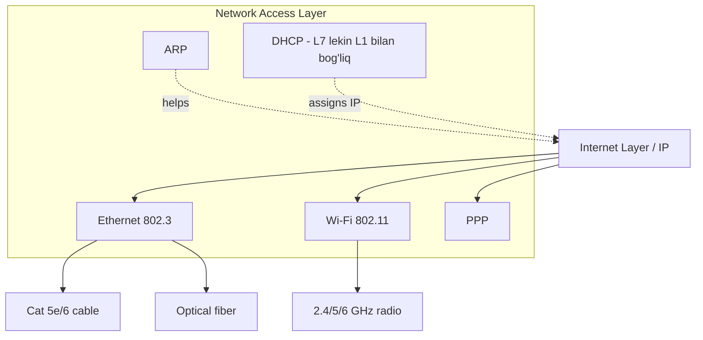
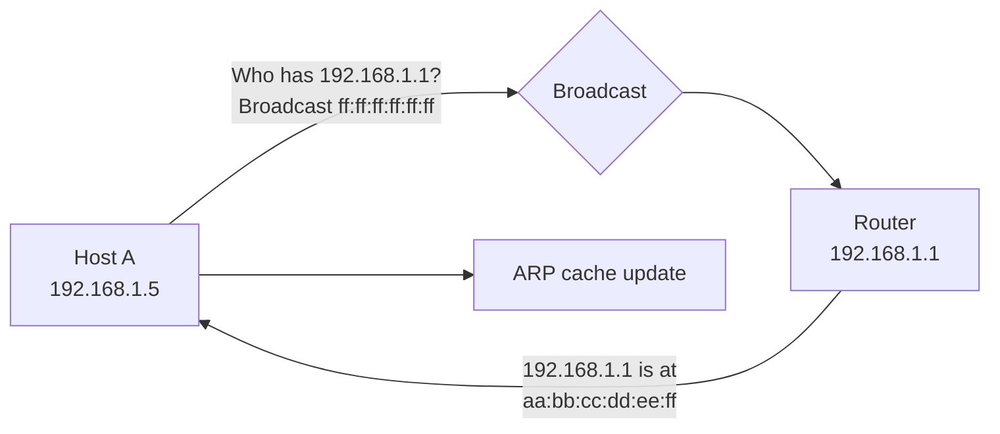
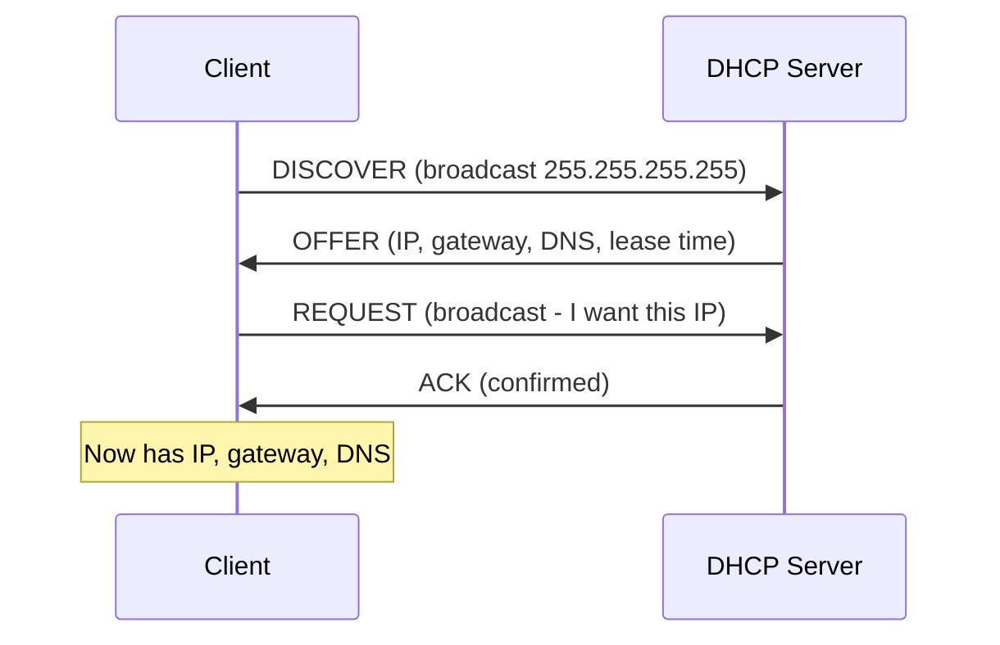
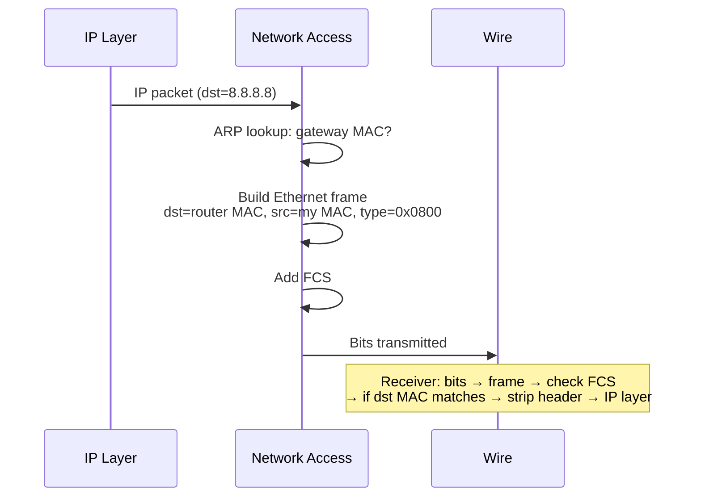

# TCP/IP Layer 1: Network Access Layer

## 1. Qisqacha tushuncha (TL;DR)

Network Access Layer (yana **Link Layer** yoki **Network Interface Layer** deb ham ataladi) — TCP/IP modelining eng quyi darajasi. U OSI modelining **Physical** (L1) va **Data Link** (L2) layerlarini birlashtiradi. TCP/IP RFC 1122 maxsus ravishda bu darajaga "kam e'tibor" beradi: **TCP/IP ning falsafasi — IP har qanday underlying network ustida ishlay olsin** (Ethernet, Wi-Fi, PPP, FDDI, hatto carrier pigeon — RFC 1149 ham bor!). Asosiy protokollar: **Ethernet (IEEE 802.3)**, **Wi-Fi (IEEE 802.11)**, **ARP**, **PPP**, **DHCP**.

## 2. Asosiy vazifalari

- **Frame larni fizik mediyada uzatish** — kabel (copper, fiber), radio signal (Wi-Fi), bo'ylab bit larning yuborilishi.
- **MAC addressing** — har network interface ning unique 48-bit hardware identifier i.
- **Frame formation** — IP packet ni link-specific frame ichiga o'rab, header (preamble, MAC) va trailer (FCS) qo'shish.
- **Media Access Control** — bitta link da bir nechta host bo'lsa kim qachon yuborishini boshqarish (CSMA/CD Ethernet, CSMA/CA Wi-Fi).
- **Address resolution** — IP address ni MAC address ga aylantirish (ARP IPv4, NDP IPv6).
- **Local network configuration** — DHCP orqali IP, gateway, DNS olish.

## 3. Vizual sxema



## 4. Protocol Data Unit (PDU)

Bu darajada PDU **frame** deb ataladi (Ethernet frame, Wi-Fi frame, PPP frame). Frame ichida:
- **Header** — destination MAC, source MAC, EtherType
- **Payload** — IP packet (yoki ARP message, yoki boshqa)
- **Trailer / FCS** (Frame Check Sequence) — CRC32 checksum

OSI L1 da PDU **bit** — fizik signal sifatida medium ga o'tkazilgan ma'lumot.

## 5. Asosiy protokollar

### 5.1 Ethernet — IEEE 802.3

Bugungi LAN ning de-facto standarti. Speed: 10 Mbps → 100 Mbps → 1 Gbps → 10/40/100/400 Gbps.

**Ethernet II frame format:**
```
+----------+----------+----------+----------+----------+----------+
| Preamble | Dest MAC | Src MAC  |EtherType |  Payload |   FCS    |
| 7 byte   | 6 byte   | 6 byte   | 2 byte   |46-1500 B | 4 byte   |
+----------+----------+----------+----------+----------+----------+
+ SFD 1 byte
```

- **Preamble + SFD** — synchronization (10101010..., 8 byte total)
- **MAC addresses** — 48 bit (e.g., `aa:bb:cc:dd:ee:ff`)
- **EtherType** — 0x0800=IPv4, 0x86DD=IPv6, 0x0806=ARP, 0x8100=VLAN
- **Payload** — minimum 46 byte (kerak bo'lsa padded), maximum 1500 byte (default MTU)
- **FCS** — CRC32, frame integrity tekshiruvi

**Real misol:**
```bash
$ ip link show eth0
2: eth0: <BROADCAST,MULTICAST,UP,LOWER_UP> mtu 1500 qdisc fq_codel
    link/ether aa:bb:cc:11:22:33 brd ff:ff:ff:ff:ff:ff
```

### 5.2 Wi-Fi — IEEE 802.11

Wireless LAN. Versiyalar: 802.11b/g/n (2.4 GHz), 802.11a/n/ac (5 GHz), 802.11ax/Wi-Fi 6E (6 GHz), 802.11be/Wi-Fi 7.

**Asosiy farqlari Ethernet dan:**
- **CSMA/CA** (Collision Avoidance) — collision detection radio da imkonsiz
- **RTS/CTS** — hidden node muammosini hal qiladi
- **3 ta MAC address** frame da (BSSID, source, destination) — access point orqali
- **Encryption:** WPA2 (AES-CCMP), WPA3 (SAE)

```bash
$ iw dev wlan0 link
Connected to aa:bb:cc:dd:ee:ff (on wlan0)
        SSID: HomeWiFi
        freq: 5240
        signal: -45 dBm
        tx bitrate: 866.7 MBit/s
```

### 5.3 ARP — Address Resolution Protocol (RFC 826)

IPv4 address → MAC address mapping. Faqat local network da ishlaydi (broadcast).



**ARP request (broadcast):** "Who has 192.168.1.1? Tell 192.168.1.5"
**ARP reply (unicast):** "192.168.1.1 is at aa:bb:cc:dd:ee:ff"

```bash
$ ip neigh
192.168.1.1 dev wlan0 lladdr aa:bb:cc:dd:ee:ff REACHABLE
192.168.1.10 dev wlan0 lladdr 11:22:33:44:55:66 STALE

$ sudo tcpdump -e -i wlan0 arp
12:34:56 aa:bb:cc:11:22:33 > ff:ff:ff:ff:ff:ff, ARP, Request who-has 192.168.1.1
12:34:56 dd:ee:ff:11:22:33 > aa:bb:cc:11:22:33, ARP, Reply 192.168.1.1 is-at dd:ee:ff:11:22:33
```

IPv6 da ARP o'rniga **NDP** (Neighbor Discovery Protocol, RFC 4861) — ICMPv6 ustida ishlaydi.

### 5.4 PPP — Point-to-Point Protocol (RFC 1661)

Ikki nuqtali (point-to-point) link uchun. Tarixiy — dial-up modem; bugun — DSL (PPPoE), 4G/5G modem, VPN tunnel (PPTP, L2TP).

PPP component lari:
- **LCP** — Link Control Protocol (link sozlash)
- **NCP** — Network Control Protocol (IP konfigurasiyasi)
- **CHAP/PAP** — autentifikatsiya

### 5.5 DHCP — Dynamic Host Configuration Protocol (RFC 2131)

Texnik jihatdan Application layer protokoli (UDP/67-server, UDP/68-client), lekin Network Access bilan chambarchas bog'liq — host network ga ulanganda eng birinchi ishlatadigan protokol.

**DORA jarayoni:**



DHCP orqali keladigan ma'lumotlar:
- IP address
- Subnet mask
- Default gateway
- DNS server lar
- Lease time (odatda 1-24 soat)

```bash
$ sudo dhclient -v eth0
$ cat /var/lib/dhcp/dhclient.leases
```

IPv6 da **SLAAC** (Stateless Address Autoconfiguration, RFC 4862) yoki DHCPv6.

### 5.6 VLAN — IEEE 802.1Q

Ethernet frame ga 4 byte tag qo'shish orqali bitta fizik switch ni ko'p logical network ga ajratish. Tag format: TPID (0x8100) + PCP + DEI + VLAN ID (12 bit, 4096 VLAN).

## 6. Encapsulation/Decapsulation jarayoni



Har link da yangi L2 header qo'shiladi (eski olib tashlanadi). IP header esa hop dan hop ga o'zgarmaydi.

## 7. Real hayot misoli

Notebook yangi Wi-Fi ga ulanganda step-by-step:

1. **Wi-Fi association** (802.11): probe → authentication → association → 4-way handshake (WPA2/WPA3 keys)
2. **DHCP DORA**: laptop DHCPDISCOVER yuboradi (broadcast) → router DHCPOFFER (192.168.1.5) → DHCPREQUEST → DHCPACK
3. **ARP** — router MAC ni topish: "Who has 192.168.1.1?"
4. **DNS query**: `dig google.com` → router (UDP/53)
5. **TCP handshake** Google ga: SYN packet → router → ISP → ... → Google


Har hop da **L2 header almashinadi** (notebook MAC → router MAC; router MAC → ISP gateway MAC), lekin **IP header o'zgarmaydi**.

## 8. Tez-tez beriladigan savollar (FAQ)

**S:** TCP/IP nima uchun OSI L1 va L2 ni birlashtirgan?
**J:** TCP/IP qachon yaratilganda (1970s-80s) maqsad — IP har qanday underlying network ustida ishlasin edi (Ethernet, Token Ring, ARCnet, satellite link, dial-up). Detallarini standartlashtirmaslik flexibility berdi. RFC 1122 deydi: "everything below IP is the Network Access Layer".

**S:** MAC address qayerdan keladi va o'zgartirsa bo'ladimi?
**J:** Vendor (NIC manufacturer) tomonidan firmware da yozilgan. Birinchi 3 byte — **OUI** (Organizationally Unique Identifier — Apple, Intel, etc.). Linux da `ip link set dev eth0 address aa:bb:cc:11:22:33` orqali o'zgartirsa bo'ladi (MAC spoofing).

**S:** Switch va Router farqi nimada?
**J:** **Switch** — L2 device, MAC address asosida frame larni forward qiladi. **Router** — L3 device, IP address asosida packet larni forward qiladi va broadcast domain ni ajratadi.

**S:** ARP va RARP nima farqi?
**J:** **ARP** — IP → MAC. **RARP** (Reverse ARP) — MAC → IP, eski (diskless workstation lar uchun edi), bugun BOOTP/DHCP almashtirgan.

**S:** Wi-Fi nima uchun Ethernet dan sekinroq?
**J:** Half-duplex (radio bir yo'nalishda), CSMA/CA overhead, retransmission interference da, distance/signal degradation. Wi-Fi 6/7 bu farqni juda qisqartirgan, lekin to'liq simli Ethernet sifatini bermaydi.

## 9. Troubleshooting

```bash
# Link layer
ip link                     # interface state (UP/DOWN)
ip link set eth0 up
ethtool eth0                # speed, duplex
mii-tool eth0               # legacy

# MAC address
ip link show eth0 | grep ether
cat /sys/class/net/eth0/address

# ARP
ip neigh                    # ARP/NDP cache
arp -a
ip neigh flush all          # clear ARP cache
sudo tcpdump -e -i eth0 arp

# Wi-Fi
iw dev wlan0 link
iw dev wlan0 scan
iwconfig

# DHCP
sudo dhclient -v -r eth0    # release
sudo dhclient -v eth0       # renew
journalctl -u NetworkManager

# Bridge / VLAN
bridge link
ip link add link eth0 name eth0.10 type vlan id 10
```

Real misol: "Internet ishlamayapti". Boshlash:
1. `ip a` — interface UP mi, IP olganmi?
2. `ip r` — default gateway bormi?
3. `ip neigh` — gateway MAC topilganmi?
4. `ping <gateway>` — local link ishlayaptimi?
5. `ping 8.8.8.8` — Internet ishlayaptimi?
6. `dig google.com` — DNS ishlayaptimi?

## 10. Cross-references

- ⬆ Yuqori layer: [02-internet.md](./02-internet.md)
- 🔄 OSI ekvivalenti: [../osi/01-physical.md](../osi/01-physical.md), [../osi/02-data-link.md](../osi/02-data-link.md)
- 🎯 Tegishli mavzular: [../osi/02-data-link.md](../osi/02-data-link.md) (Ethernet, ARP), [../osi/01-physical.md](../osi/01-physical.md) (Wi-Fi, kabel)
- 📖 Glossary: [../00-foundations/glossary.md](../00-foundations/glossary.md)

## 11. Manbalar

- **Kitob:** Kurose & Ross, 7th ed., Bob 5 (Link Layer) + Bob 6 (Wireless and Mobile Networks)
- **RFC 1122** — Requirements for Internet Hosts (Network Access boundary)
- **RFC 826** — Address Resolution Protocol
- **RFC 2131** — Dynamic Host Configuration Protocol
- **RFC 1661** — Point-to-Point Protocol
- **RFC 4861** — Neighbor Discovery for IPv6
- **IEEE 802.3** — Ethernet
- **IEEE 802.11** — Wi-Fi (latest: 802.11be / Wi-Fi 7, 2024)
- **Linux man pages:** `ip(8)`, `ethtool(8)`, `iw(8)`, `dhclient(8)`
- **Cloudflare Learning Center:** https://www.cloudflare.com/learning/network-layer/
