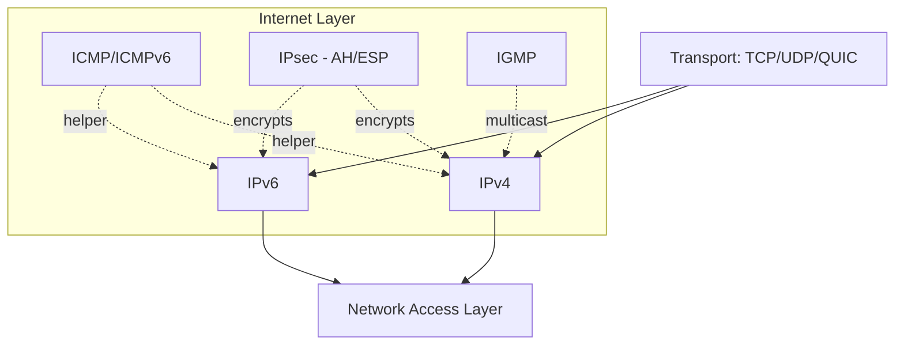
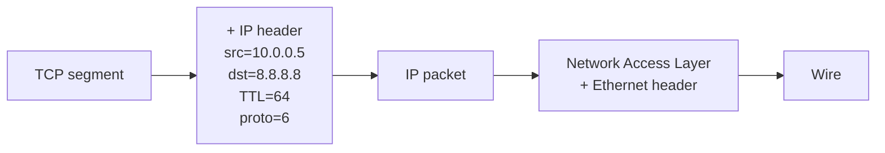

# TCP/IP Layer 2: Internet Layer

## 1. Qisqacha tushuncha (TL;DR)

Internet Layer — TCP/IP modelining yuragi. Uning vazifasi — **packet**larni manba host dan maqsad host gacha **routing** orqali yetkazib berishdir, hatto bular dunyoning teskari tomonlarida bo'lsa ham. Bu darajada **IP** (Internet Protocol — RFC 791 IPv4, RFC 8200 IPv6), **ICMP** (RFC 792), **IPsec** (RFC 4301), va **IGMP** (RFC 3376) ishlaydi. IP — best-effort, connectionless protokol: u packet ning manzilga yetib borishini, tartibini yoki dublikat bo'lmasligini kafolatlamaydi — bularning hammasi yuqori layer (TCP) zimmasida.

## 2. Asosiy vazifalari

- **Logical addressing:** har host ga global IP address berish (IPv4 — 32-bit, IPv6 — 128-bit).
- **Routing:** packet ni source dan destination ga eng yaxshi yo'l bilan yetkazish (BGP, OSPF, RIP).
- **Forwarding:** har router ning input interface dan output interface ga packet ni o'tkazishi.
- **Fragmentation va reassembly:** MTU dan katta packetlarni bo'laklarga bo'lish (IPv4) yoki Path MTU Discovery (IPv6).
- **Error reporting va diagnostics:** ICMP orqali "destination unreachable", "TTL exceeded" xabarlari.
- **Multicast group management:** IGMP orqali host larning multicast group larga qo'shilishi/chiqishi.

## 3. Vizual sxema



## 4. Protocol Data Unit (PDU)

Internet layer da PDU **packet** yoki **datagram** deb ataladi (TCP/IP terminologiyasida ikkalasi ham qo'llaniladi). Transport layer dan kelgan segment IP header (IPv4 — 20 byte, IPv6 — 40 byte) bilan o'raladi. Encapsulation jarayonida agar packet hajmi link MTU dan katta bo'lsa, IPv4 da fragmentation bo'ladi; IPv6 da fragmentation faqat source host da, router da emas.

## 5. Asosiy protokollar

### 5.1 IPv4 — RFC 791

32-bit address space (~4.3 milliard manzil — to'lib bo'lgan, IANA 2011-yilda tugatgan). Header — 20 byte (options yo'q):

```
 0                   1                   2                   3
 0 1 2 3 4 5 6 7 8 9 0 1 2 3 4 5 6 7 8 9 0 1 2 3 4 5 6 7 8 9 0 1
+-+-+-+-+-+-+-+-+-+-+-+-+-+-+-+-+-+-+-+-+-+-+-+-+-+-+-+-+-+-+-+-+
|Version|  IHL  |Type of Service|          Total Length         |
+-+-+-+-+-+-+-+-+-+-+-+-+-+-+-+-+-+-+-+-+-+-+-+-+-+-+-+-+-+-+-+-+
|         Identification        |Flags|      Fragment Offset    |
+-+-+-+-+-+-+-+-+-+-+-+-+-+-+-+-+-+-+-+-+-+-+-+-+-+-+-+-+-+-+-+-+
|  Time to Live |    Protocol   |         Header Checksum       |
+-+-+-+-+-+-+-+-+-+-+-+-+-+-+-+-+-+-+-+-+-+-+-+-+-+-+-+-+-+-+-+-+
|                       Source Address                          |
+-+-+-+-+-+-+-+-+-+-+-+-+-+-+-+-+-+-+-+-+-+-+-+-+-+-+-+-+-+-+-+-+
|                    Destination Address                        |
+-+-+-+-+-+-+-+-+-+-+-+-+-+-+-+-+-+-+-+-+-+-+-+-+-+-+-+-+-+-+-+-+
|                    Options (variable)                         |
+-+-+-+-+-+-+-+-+-+-+-+-+-+-+-+-+-+-+-+-+-+-+-+-+-+-+-+-+-+-+-+-+
|                              Data                             |
+-+-+-+-+-+-+-+-+-+-+-+-+-+-+-+-+-+-+-+-+-+-+-+-+-+-+-+-+-+-+-+-+
```

**Asosiy maydonlar:**
- **Version (4 bit)** = 4
- **IHL** — header length 32-bit so'zlarda (5 = 20 byte)
- **TTL** — har router 1 ga kamaytiradi, 0 bo'lsa packet drop, ICMP "TTL exceeded" yuboriladi
- **Protocol** — 1=ICMP, 6=TCP, 17=UDP, 47=GRE, 50=ESP, 89=OSPF
- **Header Checksum** — faqat header (data emas)
- **Source/Destination Address** — 32-bit har biri

### 5.2 IPv6 — RFC 8200

128-bit address space (~3.4 × 10^38). Header soddalashtirilgan — 40 byte fixed:

```
 0                   1                   2                   3
 0 1 2 3 4 5 6 7 8 9 0 1 2 3 4 5 6 7 8 9 0 1 2 3 4 5 6 7 8 9 0 1
+-+-+-+-+-+-+-+-+-+-+-+-+-+-+-+-+-+-+-+-+-+-+-+-+-+-+-+-+-+-+-+-+
|Version| Traffic Class |           Flow Label                  |
+-+-+-+-+-+-+-+-+-+-+-+-+-+-+-+-+-+-+-+-+-+-+-+-+-+-+-+-+-+-+-+-+
|         Payload Length        |  Next Header  |   Hop Limit   |
+-+-+-+-+-+-+-+-+-+-+-+-+-+-+-+-+-+-+-+-+-+-+-+-+-+-+-+-+-+-+-+-+
|                                                               |
+                                                               +
|                                                               |
+                       Source Address (128 bit)                +
|                                                               |
+                                                               +
|                                                               |
+-+-+-+-+-+-+-+-+-+-+-+-+-+-+-+-+-+-+-+-+-+-+-+-+-+-+-+-+-+-+-+-+
|                                                               |
+                                                               +
|                                                               |
+                    Destination Address (128 bit)              +
|                                                               |
+                                                               +
|                                                               |
+-+-+-+-+-+-+-+-+-+-+-+-+-+-+-+-+-+-+-+-+-+-+-+-+-+-+-+-+-+-+-+-+
```

**IPv4 bilan farqlari:**
- Header checksum yo'q (Transport layer checksum yetarli)
- Fragmentation — faqat source host da (router emas)
- Built-in IPsec support
- Auto-configuration (SLAAC, RFC 4862)

**IPv6 deployment 2026:**
- 2026-yil mart oyida birinchi marta Google traffic ning **50.1%** IPv6 orqali kelgan (RFC milestone)
- Frantsiyada — 86% adoption
- Cloudflare Radar — HTTP requestlarning 40.1% IPv6
- APNIC — 43.13% network IPv6-capable

### 5.3 Fragmentation va Path MTU Discovery

**IPv4 fragmentation:**
- Agar packet > MTU bo'lsa, router uni bo'laklarga bo'ladi
- DF (Don't Fragment) flag o'rnatilgan bo'lsa — drop + ICMP "Fragmentation Needed"
- Receiver Identification + Fragment Offset asosida assemble qiladi

**Path MTU Discovery (PMTUD, RFC 1191):**
- Source DF=1 bilan packet yuboradi
- Router MTU dan katta bo'lsa ICMP yuboradi
- Source kichikroq packet yuboradi


**Real test:**
```bash
ping -c 4 -M do -s 1472 google.com  # 1472 + 28 (IP+ICMP) = 1500 (Ethernet MTU)
ping -c 4 -M do -s 1473 google.com  # fail bo'ladi
```

### 5.4 ICMP — RFC 792 (IPv4), RFC 4443 (ICMPv6)

Network diagnostic va error reporting. Asosiy types:

| Type | Nomi | Foydalanish |
|------|------|-------------|
| 0 | Echo Reply | `ping` javobi |
| 3 | Destination Unreachable | host/network/port yo'q |
| 5 | Redirect | yaxshiroq route mavjud |
| 8 | Echo Request | `ping` so'rovi |
| 11 | Time Exceeded | TTL=0, `traceroute` ishlatadi |

```
$ traceroute -n google.com
 1  192.168.1.1   1.234 ms
 2  10.0.0.1      5.678 ms
 3  142.250.74.110  20.345 ms
```

`traceroute` ishlash printsipi: TTL=1, 2, 3... bilan packet yuboradi, har router ICMP "TTL exceeded" qaytaradi.


### 5.5 IPsec — RFC 4301

Network-layer security framework. Ikki rejim:
- **Transport mode** — payload shifrlanadi, IP header ochiq
- **Tunnel mode** — butun IP packet shifrlanadi, yangi IP header qo'shiladi (VPN uchun)

Ikki protokol:
- **AH (Authentication Header, RFC 4302)** — integrity + authentication, encryption yo'q
- **ESP (Encapsulating Security Payload, RFC 4303)** — integrity + authentication + encryption

Key exchange — **IKEv2** (RFC 7296). Site-to-site VPN, remote-access VPN.

### 5.6 IGMP — RFC 3376

Internet Group Management Protocol — host larning multicast group ga (224.0.0.0/4) qo'shilishi/chiqishini boshqaradi. Local network da faqat (router-host orasida). IPTV, video streaming, service discovery (mDNS) uchun.

## 6. Encapsulation/Decapsulation jarayoni



Har router da:
1. Frame ni decapsulate qilib IP packet ni ajratib oladi
2. TTL−1, agar 0 bo'lsa drop
3. Routing table ga qarab next hop ni topadi
4. ARP yoki NDP bilan next hop MAC address ni topadi
5. Yangi Ethernet frame da packet ni jo'natadi (IP header o'zgarmaydi, faqat link header)


## 7. Real hayot misoli

`ping 8.8.8.8` Toshkentdan Google DNS gacha:

1. **Source** (192.168.1.5) ICMP Echo Request hosil qiladi
2. **Routing table** ga qaraydi: `default via 192.168.1.1 dev wlan0`
3. **ARP** orqali router MAC ni topadi
4. Packet router ga uzatiladi → ISP router → backbone → Google
5. **Har hop** TTL ni 1 ga kamaytiradi (boshlang'ich 64)
6. Google packet ga Echo Reply javob qaytaradi
7. RTT ~30-50 ms (Toshkent — Frankfurt — Google)

```bash
$ traceroute -n 8.8.8.8
 1  192.168.1.1     1.2 ms
 2  10.50.0.1       8.5 ms     # ISP gateway
 3  213.230.x.x     12.3 ms    # ISP backbone
 ...
 8  142.250.74.110  45.7 ms    # Google
```

## 8. Tez-tez beriladigan savollar (FAQ)

**S:** Nima uchun IP "best-effort"?
**J:** Soddalik. IP packet yetkazib berishni kafolatlamaydi — bu murakkablikni endpoint larga (TCP) o'tkazadi. Bu **end-to-end principle** — Internet ning asosiy falsafiy printsiplaridan biri.

**S:** Nima uchun IPv6 deployment shu qadar sekin?
**J:** Backward incompatibility — IPv4 va IPv6 to'g'ridan-to'g'ri muloqot qila olmaydi. NAT IPv4 muammosini "yashirgan". Lekin 2026 yilda 50% milestone — endi IPv6 majburiy bo'lib bormoqda.

**S:** TTL nima uchun kerak?
**J:** Routing loop dan himoya. Agar router lar configuratsiyasida xato bo'lsa, packet abadiy aylanavergan bo'lar edi. TTL har hop da kamayadi — eng ko'pi 255 hop, real Internet da odatda 30-50.

**S:** ICMP ni firewall da bloklash zararli emasmi?
**J:** Ha, ko'p hollarda zararli. PMTUD ICMP "Fragmentation Needed" ga tayanadi. Agar bloklasak — black hole MTU muammosi paydo bo'ladi (packetlar yo'qoladi, sababini topish qiyin).

**S:** Public IP va Private IP farqi?
**J:** Private IP (RFC 1918): `10.0.0.0/8`, `172.16.0.0/12`, `192.168.0.0/16` — Internet da rout qilinmaydi, NAT orqali public IP ga aylanadi. Public IP — Internet da global unique.

## 9. Troubleshooting

```bash
# Address va interfaces
ip a                        # all addresses
ip -6 a                     # only IPv6
ip link                     # link state

# Routing
ip r                        # IPv4 routes
ip -6 r                     # IPv6 routes
ip route get 8.8.8.8        # which route to specific host

# Connectivity
ping -c 4 8.8.8.8
ping -6 -c 4 2001:4860:4860::8888  # Google DNS IPv6
traceroute -n google.com
tracepath google.com         # PMTUD aware

# MTU testing
ping -M do -s 1472 google.com    # don't fragment, 1472 byte payload

# Neighbor (ARP/NDP)
ip neigh                    # ARP/IPv6 NDP table
arp -a                      # ARP only
```

Real misol: "Ping ishlamayapti, lekin web ishlayapti" — ICMP firewall da bloklangan, lekin TCP/443 ochiq.

## 10. Cross-references

- ⬆ Yuqori layer: [03-transport.md](./03-transport.md)
- ⬇ Quyi layer: [01-network-access.md](./01-network-access.md)
- 🔄 OSI ekvivalenti: [../osi/03-network.md](../osi/03-network.md)
- 🎯 Deep-dives: [../deep-dives/routing-protocols.md](../deep-dives/routing-protocols.md), [../deep-dives/nat-and-firewall.md](../deep-dives/nat-and-firewall.md), [../deep-dives/subnetting-cidr.md](../deep-dives/subnetting-cidr.md)
- 📖 Glossary: [../00-foundations/glossary.md](../00-foundations/glossary.md)

## 11. Manbalar

- **Kitob:** Kurose & Ross, 7th ed., Bob 4 (Network Layer), 337-480 sahifa
- **RFC 791** — Internet Protocol (IPv4)
- **RFC 8200** — Internet Protocol, Version 6 (IPv6)
- **RFC 792** — ICMP
- **RFC 4443** — ICMPv6
- **RFC 4301** — Security Architecture for the Internet Protocol (IPsec)
- **RFC 3376** — IGMPv3
- **RFC 1918** — Private Address Space
- **Google IPv6 Statistics:** https://www.google.com/intl/en/ipv6/statistics.html — 50%+ adoption (Mart 2026)
- **APNIC IPv6 measurements:** https://stats.labs.apnic.net/ipv6
- **Internet Society Pulse:** https://pulse.internetsociety.org/
