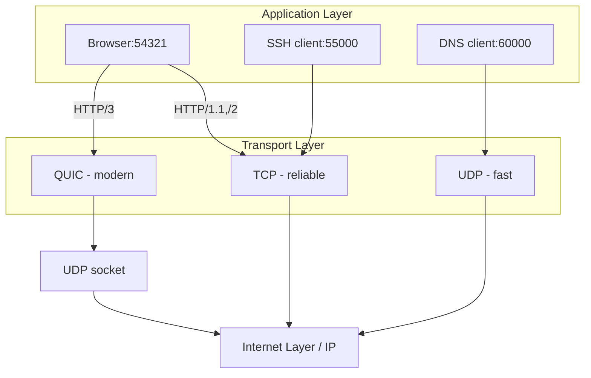
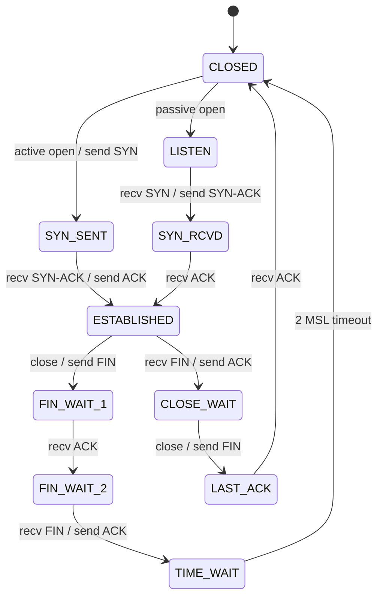
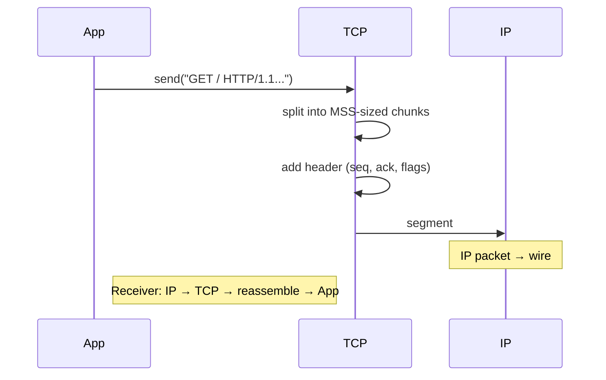

# TCP/IP Layer 3: Transport Layer

## 1. Qisqacha tushuncha (TL;DR)

Transport layer — Internet stack ning markaziy qismi: u Application layer process larining bir-biri bilan **logical connection** o'rnatishini ta'minlaydi. TCP/IP da uchta asosiy transport protokoli bor: **TCP** (reliable, connection-oriented — RFC 9293), **UDP** (unreliable, connectionless — RFC 768) va **QUIC** (modern, UDP ustida — RFC 9000). Multiplexing/demultiplexing **port number** orqali amalga oshadi: bitta IP address da minglab process lar parallel ishlay oladi.

## 2. Asosiy vazifalari

- **Multiplexing/demultiplexing:** source/destination port orqali to'g'ri process ga segment yetkazib berish.
- **Reliable delivery (TCP/QUIC):** sequence number, ACK, retransmission orqali ma'lumot yo'qolmasligini ta'minlash.
- **Flow control:** receiver window (rwnd) orqali tez yuboruvchi sekin qabul qiluvchini bo'kdirmasligi.
- **Congestion control:** network ichidagi yo'qotishlarni sezib, yuborish tezligini moslash (Cubic, BBR).
- **Connection management:** three-way handshake (TCP), 1-RTT handshake (QUIC), four-way termination.
- **Error detection:** checksum (TCP/UDP/QUIC) — corrupt segment larni aniqlash.

## 3. Vizual sxema



## 4. Protocol Data Unit (PDU)

- **TCP** — PDU **segment** deyiladi.
- **UDP** — PDU **datagram** deyiladi.
- **QUIC** — PDU **packet** deyiladi (UDP datagram ichida QUIC packets ko'p bo'lishi mumkin — multiplexing).

Application layerdan kelgan message Transport layer da header (TCP — 20+ byte, UDP — 8 byte) bilan o'raladi va Internet layerga uzatiladi.

## 5. Asosiy protokollar

### 5.1 TCP (Transmission Control Protocol) — RFC 9293

Connection-oriented, reliable, byte-stream protokol. **Three-way handshake**: SYN → SYN-ACK → ACK.

**TCP header (20 byte minimum, options bilan 60 byte gacha):**
```
 0                   1                   2                   3
 0 1 2 3 4 5 6 7 8 9 0 1 2 3 4 5 6 7 8 9 0 1 2 3 4 5 6 7 8 9 0 1
+-+-+-+-+-+-+-+-+-+-+-+-+-+-+-+-+-+-+-+-+-+-+-+-+-+-+-+-+-+-+-+-+
|          Source Port          |       Destination Port        |
+-+-+-+-+-+-+-+-+-+-+-+-+-+-+-+-+-+-+-+-+-+-+-+-+-+-+-+-+-+-+-+-+
|                        Sequence Number                        |
+-+-+-+-+-+-+-+-+-+-+-+-+-+-+-+-+-+-+-+-+-+-+-+-+-+-+-+-+-+-+-+-+
|                    Acknowledgment Number                      |
+-+-+-+-+-+-+-+-+-+-+-+-+-+-+-+-+-+-+-+-+-+-+-+-+-+-+-+-+-+-+-+-+
| Off |Reservd|U|A|P|R|S|F|         Window Size           |
+-+-+-+-+-+-+-+-+-+-+-+-+-+-+-+-+-+-+-+-+-+-+-+-+-+-+-+-+-+-+-+-+
|           Checksum            |        Urgent Pointer         |
+-+-+-+-+-+-+-+-+-+-+-+-+-+-+-+-+-+-+-+-+-+-+-+-+-+-+-+-+-+-+-+-+
|                    Options (variable)                         |
+-+-+-+-+-+-+-+-+-+-+-+-+-+-+-+-+-+-+-+-+-+-+-+-+-+-+-+-+-+-+-+-+
|                            Data                               |
+-+-+-+-+-+-+-+-+-+-+-+-+-+-+-+-+-+-+-+-+-+-+-+-+-+-+-+-+-+-+-+-+
```

**TCP flags:**
- **SYN** — synchronize, connection boshlash
- **ACK** — acknowledgment, qabul qilingan byte ni tasdiqlash
- **FIN** — finish, connection tugatish
- **RST** — reset, ulanishni majburan uzish
- **PSH** — push, buffer ni darhol application ga yuborish
- **URG** — urgent, urgent pointer faollashtirilgan

**TCP States diagram (RFC 9293):**



**Sliding window va congestion control:**
- **cwnd** (congestion window) — network ga necha byte yuborish mumkinligi
- **rwnd** (receive window) — receiver buffer i
- Effective window = min(cwnd, rwnd)

**Congestion control algoritmlari:**
- **Tahoe** (1988) — slow start + AIMD, packet loss da cwnd = 1
- **Reno** (1990) — fast retransmit + fast recovery
- **Cubic** (default Linux) — cubic function, high-bandwidth networks uchun
- **BBR** (Google, 2016) — bandwidth + RTT measurement, loss-based emas

**Real misol — `tcpdump`:**
```
$ sudo tcpdump -tttt -n -i any port 443
2026-05-05 10:23:45.123 IP 192.168.1.5.54321 > 142.250.74.110.443: Flags [S], seq 1234567890, win 64240
2026-05-05 10:23:45.145 IP 142.250.74.110.443 > 192.168.1.5.54321: Flags [S.], seq 9876543210, ack 1234567891, win 65535
2026-05-05 10:23:45.146 IP 192.168.1.5.54321 > 142.250.74.110.443: Flags [.], ack 1, win 502
```

### 5.2 UDP (User Datagram Protocol) — RFC 768

Connectionless, unreliable, message-oriented. Header — atigi 8 byte:

```
 0                   1                   2                   3
 0 1 2 3 4 5 6 7 8 9 0 1 2 3 4 5 6 7 8 9 0 1 2 3 4 5 6 7 8 9 0 1
+-+-+-+-+-+-+-+-+-+-+-+-+-+-+-+-+-+-+-+-+-+-+-+-+-+-+-+-+-+-+-+-+
|          Source Port          |       Destination Port        |
+-+-+-+-+-+-+-+-+-+-+-+-+-+-+-+-+-+-+-+-+-+-+-+-+-+-+-+-+-+-+-+-+
|             Length            |           Checksum            |
+-+-+-+-+-+-+-+-+-+-+-+-+-+-+-+-+-+-+-+-+-+-+-+-+-+-+-+-+-+-+-+-+
|                          Data                                 |
+-+-+-+-+-+-+-+-+-+-+-+-+-+-+-+-+-+-+-+-+-+-+-+-+-+-+-+-+-+-+-+-+
```

**Foydalanish:** DNS, DHCP, SNMP, NTP, VoIP, online gaming, video streaming (RTP). Latency muhim, kichik yo'qotishlarga toqat qilish mumkin bo'lgan ilovalar.

### 5.3 QUIC (Quick UDP Internet Connections) — RFC 9000

Google da Jim Roskind tomonidan boshlangan, IETF tomonidan standartlashtirilgan. **UDP/443 ustida ishlaydi**, lekin TCP+TLS+HTTP/2 funksiyalarini birlashtiradi.

**Asosiy ustunliklari:**
- **0-RTT yoki 1-RTT handshake** (TCP+TLS — 2-3 RTT)
- **No head-of-line blocking** (har stream mustaqil)
- **Connection migration** — IP o'zgarsa ham (Wi-Fi → 4G), connection saqlanadi (Connection ID orqali)
- **Built-in TLS 1.3** — har bir packet shifrlangan
- **User-space implementation** — kernel ni o'zgartirmasdan yangilanadi


QUIC = HTTP/3 ning transport asosi. 2026 yilda HTTP/3 global adoption ~21-35%.

### 5.4 Multiplexing/Demultiplexing

OS har segment ni **5-tuple** orqali process ga yo'naltiradi:
```
(protocol, src_ip, src_port, dst_ip, dst_port)
```

**Real misol:**
```bash
$ ss -tnlp
LISTEN  0  128  0.0.0.0:22       0.0.0.0:*  users:(("sshd",pid=1234))
LISTEN  0  511  0.0.0.0:80       0.0.0.0:*  users:(("nginx",pid=5678))
LISTEN  0  511  0.0.0.0:443      0.0.0.0:*  users:(("nginx",pid=5678))
```

## 6. Encapsulation/Decapsulation jarayoni



## 7. Real hayot misoli

`https://www.google.com` ga kirganda Transport layer:

1. **DNS query** UDP/53 da: 28-byte datagram, javob ~80 byte.
2. **TCP handshake** TCP/443 ga: SYN → SYN-ACK → ACK (3 ta packet, 1 RTT).
3. **TLS 1.3 handshake** — TCP segment lari ichida, yana 1 RTT.
4. **HTTP request** PSH+ACK flag bilan yuboriladi.
5. **Data transfer** — sliding window orqali parallel segment lar.
6. **Connection close** — FIN → ACK → FIN → ACK (yoki bir tomonlama RST).

Agar HTTP/3 bo'lsa: faqat **UDP/443** ishlatiladi, QUIC bitta packet ichida handshake + first request ni birlashtiradi (0-RTT bilan).

## 8. Tez-tez beriladigan savollar (FAQ)

**S:** TCP va UDP qaysi biri tezroq?
**J:** UDP — handshake yo'q, retransmission yo'q, congestion control yo'q. Lekin "tezlik" ko'p faktorga bog'liq. Reliable transfer kerak bo'lsa, UDP ustida o'z reliability ni quryapsan, demak natijada TCP dan tez bo'lmasligi mumkin.

**S:** TIME_WAIT state nima va nima uchun shu qadar ko'p TIME_WAIT connection ko'rinadi?
**J:** Connection close bo'lgandan keyin TCP 2*MSL (~60 sec) kutadi — adashgan packet lar kelmasligi uchun. High-traffic server da minglab TIME_WAIT bo'lishi normal. `net.ipv4.tcp_tw_reuse=1` sysctl bilan ham boshqarsa bo'ladi.

**S:** Why QUIC chose UDP and not a brand new protocol?
**J:** Internet middleware (NAT, firewall) faqat TCP/UDP ni biladi. Yangi IP protocol (raqam) middleware lar tomonidan bloklanadi. UDP esa hamma joyda ochiq — shuning uchun QUIC UDP ustida.

**S:** TCP MSS va MTU farqi?
**J:** **MTU** — link layer maxsimum (Ethernet — 1500 byte). **MSS** — TCP payload max (= MTU − IP header − TCP header = 1500 − 20 − 20 = 1460 byte odatda).

**S:** Retransmission qachon yuz beradi?
**J:** Ikki sabab: (1) **Timeout** (RTO) — ACK kelmasa; (2) **Triple duplicate ACK** — 3 ta bir xil ACK kelsa, fast retransmit.

## 9. Troubleshooting

```bash
# Listening sockets
ss -tnlp                    # TCP listening
ss -unlp                    # UDP listening
ss -tan state established   # active connections

# Packet capture
sudo tcpdump -tttt -n -i any port 443
sudo tcpdump -i any 'tcp[tcpflags] & (tcp-syn|tcp-fin) != 0'

# Connection statistics
ss -s                       # summary
netstat -s | grep -i retrans  # retransmission stats
cat /proc/net/netstat

# RTT measurement
ping -c 5 google.com
mtr google.com              # continuous RTT + loss

# QUIC test
curl --http3 -v https://cloudflare.com
```

Common issues:
- **High retransmission rate** → network packet loss
- **Many TIME_WAIT** → short-lived connections (use connection pooling)
- **CLOSE_WAIT stuck** → application doesn't call `close()`
- **TCP RST** — firewall yoki application crash


## 10. Cross-references

- ⬆ Yuqori layer: [04-application.md](./04-application.md)
- ⬇ Quyi layer: [02-internet.md](./02-internet.md)
- 🔄 OSI ekvivalenti: [../osi/04-transport.md](../osi/04-transport.md)
- 🎯 Deep-dives: [../deep-dives/tcp-handshake.md](../deep-dives/tcp-handshake.md), [../deep-dives/http-evolution.md](../deep-dives/http-evolution.md)
- 📖 Glossary: [../00-foundations/glossary.md](../00-foundations/glossary.md)

## 11. Manbalar

- **Kitob:** Kurose & Ross, 7th ed., Bob 3 (Transport Layer), 215-336 sahifa
- **RFC 9293** — Transmission Control Protocol (2022, RFC 793 ni almashtirgan)
- **RFC 768** — User Datagram Protocol
- **RFC 9000** — QUIC: A UDP-Based Multiplexed and Secure Transport
- **RFC 9002** — QUIC Loss Detection and Congestion Control
- **RFC 5681** — TCP Congestion Control
- **Cloudflare blog** — HTTP/3 va QUIC adoption: ~21-35% global (2026)
- **Linux man pages:** `tcp(7)`, `udp(7)`, `socket(7)`
