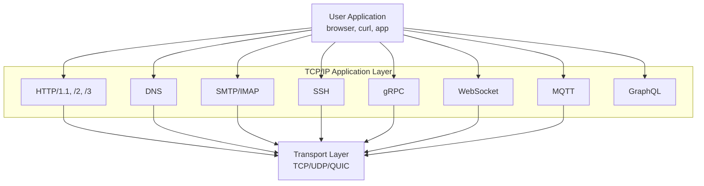
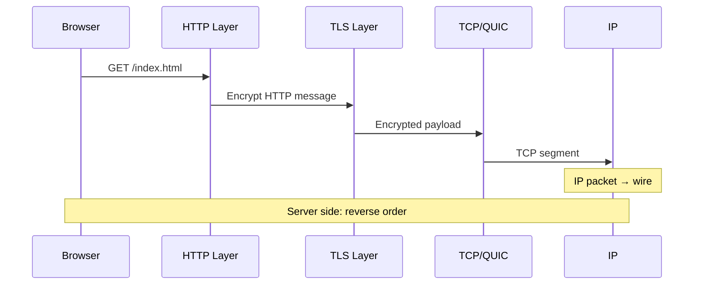

# TCP/IP Layer 4: Application Layer

## 1. Qisqacha tushuncha (TL;DR)

TCP/IP modelining Application Layer — bu OSI modelining 5-, 6- va 7-layerlarini birlashtirgan amaliy darajadir. Bu yerda **HTTP**, **DNS**, **SMTP**, **SSH**, **gRPC**, **WebSocket**, **MQTT** kabi protokollar ishlaydi. TCP/IP RFC 1122 standartida bu darajalar bir-biriga shu qadar yaqin va amalda ajratish qiyin bo'lganligi uchun bitta layer sifatida belgilangan: aksariyat Internet ilovalari session, presentation va application funksiyalarini bitta protokol ichida amalga oshiradi (masalan, HTTP — application; TLS — encryption; JSON — data format).

## 2. Asosiy vazifalari

- **End-user services:** foydalanuvchi yoki dastur uchun bevosita interfeys taqdim etish — web browsing, email, file transfer, remote shell.
- **Data formatting va encoding:** JSON, XML, Protobuf, MIME types — payload formatini standartlashtirish.
- **Session management:** cookies, JWT tokens, session IDs orqali holatni saqlash (HTTP stateless bo'lgani uchun).
- **Security/encryption integration:** TLS 1.3 orqali ulanishni shifrlash, autentifikatsiya (OAuth, SAML).
- **Naming va discovery:** DNS orqali human-readable nom (`google.com`) ni IP address ga aylantirish.
- **Application-level routing:** HTTP `Host` header, gRPC service name asosida marshrutlash.

## 3. Vizual sxema



## 4. Protocol Data Unit (PDU)

Application layerda PDU **message** deb ataladi. HTTP da bu **HTTP request/response message**, DNS da — **DNS query/response**, SMTP da — **email message**. Encapsulation jarayonida message Transport layerga uzatiladi va u yerda **segment** (TCP) yoki **datagram** (UDP) ichiga qo'yiladi. Diqqat: bitta application message ko'p TCP segmentlarga bo'linib ketishi mumkin (HTTP body 1 MB bo'lsa, MTU 1500 byte bo'lsa, ~700 ta segment hosil bo'ladi).

## 5. Asosiy protokollar

### 5.1 HTTP (HyperText Transfer Protocol)

Web ning asosiy protokoli, RFC 9110 (HTTP semantics).

**HTTP versiyalari:**
- **HTTP/1.1** (RFC 9112) — text-based, port 80, head-of-line blocking
- **HTTP/2** (RFC 9113) — binary framing, multiplexing, server push, port 443
- **HTTP/3** (RFC 9114) — QUIC ustida (UDP), no head-of-line blocking, 0-RTT

2026-yil holatiga ko'ra HTTP/3 global adoption ~21-35%, top 10M saytlarning 34% qo'llab-quvvatlaydi. Browser larning 95%+ HTTP/3 ni qo'llaydi.

**HTTP/1.1 request misoli:**
```
GET /index.html HTTP/1.1
Host: www.example.com
User-Agent: curl/8.5.0
Accept: */*

```

Real komanda: `curl -v https://www.google.com`

### 5.2 DNS (Domain Name System)

RFC 1034/1035, port 53 (UDP, ba'zan TCP). Domain → IP mapping. Hierarchical: root → TLD → authoritative server. Modern: **DoH** (DNS over HTTPS, RFC 8484), **DoT** (DNS over TLS, RFC 7858) — privacy uchun.

```
$ dig +short google.com
142.250.74.110
```

Batafsil: `../deep-dives/dns-resolution.md`

### 5.3 SMTP / IMAP / POP3

- **SMTP** (RFC 5321) — port 25/587/465, email yuborish.
- **IMAP** (RFC 9051) — port 143/993, server da emaillarni boshqarish.
- **POP3** (RFC 1939) — port 110/995, eski, faqat download.

### 5.4 SSH (Secure Shell)

RFC 4251, port 22. Encrypted remote shell, file transfer (SCP/SFTP), tunneling. Public-key authentication.

```
$ ssh -i ~/.ssh/id_ed25519 user@server.example.com
```

### 5.5 FTP (File Transfer Protocol)

RFC 959, port 20 (data) + 21 (control). Eski, plaintext. Bugungi kunda **SFTP** (SSH ustida) yoki **HTTPS** orqali file transfer afzal.

### 5.6 gRPC

Google RPC framework. **HTTP/2 + Protocol Buffers** (binary serialization). Streaming (unary, server-streaming, client-streaming, bidirectional). Microservices arxitekturasida dominant. Port — odatda 50051.

### 5.7 WebSocket

RFC 6455. HTTP `Upgrade` orqali boshlanadi, keyin **full-duplex** binary/text channel. Real-time chat, gaming, live updates uchun. Port 80/443 (`ws://`, `wss://`).

```
GET /chat HTTP/1.1
Host: server.example.com
Upgrade: websocket
Connection: Upgrade
Sec-WebSocket-Key: dGhlIHNhbXBsZSBub25jZQ==
```

### 5.8 MQTT (Message Queuing Telemetry Transport)

OASIS standart, port 1883 (8883 — TLS). Lightweight publish/subscribe. **IoT** uchun mo'ljallangan (sensor lar, smart home). Broker-based: client publish topic, boshqa client subscribe.

### 5.9 GraphQL

Facebook tomonidan ishlab chiqilgan query language. HTTP POST orqali ishlaydi (odatda `/graphql` endpoint). Client kerakli ma'lumotlarni aniq so'raydi — REST dagi over-fetching/under-fetching muammolarini hal qiladi.

## 6. Encapsulation/Decapsulation jarayoni



Browser HTTP request hosil qiladi → TLS bilan shifrlanadi → TCP segment → IP packet → Ethernet frame → wire. Server tarafda decapsulation teskari yo'nalishda ishlaydi.

## 7. Real hayot misoli

`https://www.google.com` ga browserda kirganda Application layer faoliyati:

1. **DNS query**: browser `www.google.com` ni IP ga aylantirish uchun resolver ga UDP/53 da query yuboradi.
2. **TLS 1.3 handshake**: TCP ulanishi o'rnatilgandan so'ng (yoki QUIC bo'lsa, bittada) certificate validation va session keys exchange.
3. **HTTP/2 yoki /3 request**: `GET / HTTP/2` headers + cookies (agar bo'lsa).
4. **Response**: HTML body + `Content-Type: text/html` + `Set-Cookie: NID=...`.
5. **Sub-resources**: HTML ichidagi ``, `<script>`, `<link>` lar uchun parallel HTTP requests (HTTP/2 multiplexing bilan bitta connection da).

Wireshark da `tcp.port == 443 and tls` filter ishlatib ko'rish mumkin.

## 8. Tez-tez beriladigan savollar (FAQ)

**S:** Nima uchun TCP/IP da OSI ning 5, 6, 7 layeri bitta Application layerga birlashtirilgan?
**J:** Amalda Internet ilovalari session/presentation/application funksiyalarini ajratmaydi. HTTP bir vaqtning o'zida message format (presentation), state (session) va application semantics ni belgilaydi. RFC 1122 (1989) bu yondashuvni rasmiy qilib qo'ygan.

**S:** HTTP stateless ekan, qanday qilib login holatini saqlaydi?
**J:** **Cookies** (server `Set-Cookie` yuboradi, client har request da `Cookie` header bilan qaytaradi), **JWT tokens** (`Authorization: Bearer ...`) yoki **server-side sessions** (session ID cookie da, ma'lumot serverda).

**S:** HTTP/3 har doim HTTP/2 dan tezroqmi?
**J:** Yo'q. 2024 yildagi tadqiqotga ko'ra QUIC 500 Mbps dan yuqori tezlikda HTTP/2 dan 45% gacha sekinroq bo'lishi mumkin (CPU overhead). Lekin mobile/lossy network larda tezroq.

**S:** WebSocket va HTTP/2 streaming farqi nima?
**J:** WebSocket — ikki tomonlama, mustaqil messaging protokoli. HTTP/2 streaming — server-side faqat (server push) yoki gRPC orqali bidirectional. WebSocket chat va gaming uchun, gRPC microservices uchun yaxshiroq.

**S:** DNS UDP da ishlasa, qanday qilib katta javoblarni yuboradi?
**J:** UDP packet 512 byte dan oshsa (yoki EDNS0 bilan 4096), **TC** (truncated) flag o'rnatiladi va client TCP/53 ga retry qiladi. DNSSEC va DoH/DoT bunda muhim rol o'ynaydi.

## 9. Troubleshooting

```bash
# DNS check
dig +trace google.com
nslookup google.com 1.1.1.1

# HTTP debug
curl -v https://google.com
curl -I https://example.com   # faqat headers
curl --http3 https://cloudflare.com

# TLS inspect
openssl s_client -connect google.com:443 -servername google.com

# WebSocket test
websocat wss://echo.websocket.org

# Port listening
ss -tnlp | grep :443
lsof -i :80
```

Real misol: "Sayt ochilmayapti". Boshlash: `dig saytname` (DNS ishlayaptimi?) → `curl -v https://saytname` (TLS/HTTP javobi?) → `openssl s_client` (sertifikat valid?). Agar DNS javob bersa-yu HTTP javob bermasa, muammo Transport layerda yoki firewallda.

## 10. Cross-references

- ⬇ Quyi layer: [03-transport.md](./03-transport.md) — TCP, UDP, QUIC
- 🔄 OSI ekvivalenti: [../osi/05-session.md](../osi/05-session.md), [../osi/06-presentation.md](../osi/06-presentation.md), [../osi/07-application.md](../osi/07-application.md)
- 🎯 Deep-dives: [../deep-dives/http-evolution.md](../deep-dives/http-evolution.md), [../deep-dives/dns-resolution.md](../deep-dives/dns-resolution.md), [../deep-dives/tls-ssl.md](../deep-dives/tls-ssl.md)
- 📖 Glossary: [../00-foundations/glossary.md](../00-foundations/glossary.md)

## 11. Manbalar

- **Kitob:** Kurose & Ross "Computer Networking: A Top-Down Approach", 7th ed., Bob 2 (Application Layer)
- **RFC 1122** — Requirements for Internet Hosts (host stack standards)
- **RFC 9110** — HTTP Semantics
- **RFC 9114** — HTTP/3
- **RFC 1034/1035** — DNS
- **RFC 5321** — SMTP
- **RFC 6455** — WebSocket
- **MDN Web Docs:** https://developer.mozilla.org/en-US/docs/Web/HTTP
- **Cloudflare Learning:** https://www.cloudflare.com/learning/
- **W3Techs HTTP/3 statistics 2026:** ~21-35% global adoption
