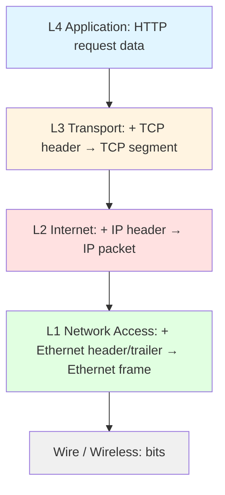

# TCP/IP Model

TCP/IP model — bu **Internetning haqiqiy modeli**. ARPANET loyihasi (1970-yillar) doirasida ishlab chiqilgan, original nomi **DoD model** (US Department of Defense modeli). Hozirgi paytda dunyoda har bir Internet ulanishi shu modelda ishlaydi.

---

## TCP/IP vs OSI — qisqa

| Mezon | OSI | TCP/IP |
|-------|-----|--------|
| Layerlar soni | 7 | 4 |
| Yaratilgan yili | 1984 (ISO standardi) | 1980-yillar (RFC 1122) |
| Ishlatilishi | Konseptual / educational | Real Internet |
| Standartlash | Layerlardan keyin | Standartlardan keyin (RFCs) |
| Approach | Top-down theoretical | Bottom-up practical |

---

## 4 ta layer

```
┌─────────────────────────────────────────────────────────────┐
│  4. Application      │  HTTP, DNS, FTP, SMTP, SSH, ...      │
│  3. Transport        │  TCP, UDP                            │
│  2. Internet         │  IP (IPv4/IPv6), ICMP, IGMP          │
│  1. Network Access   │  Ethernet, Wi-Fi, PPP, ARP           │
└─────────────────────────────────────────────────────────────┘
```

| # | Layer | PDU | OSI ekvivalenti |
|---|-------|-----|-----------------|
| 4 | Application | Data / Message | OSI L5+L6+L7 |
| 3 | Transport | Segment (TCP) / Datagram (UDP) | OSI L4 |
| 2 | Internet | Packet | OSI L3 |
| 1 | Network Access (Link) | Frame / Bit | OSI L1+L2 |

**Diqqat:** TCP/IP modelida OSI ning 5-, 6-, 7-layerlari **bitta Application layer**ga birlashtirilgan. Sababi: amalda bu uchta layerni alohida implementatsiya qilish noqulay (encryption, encoding, session — odatda bitta application kodida bo'ladi).

---

## Har bir layer — qisqacha

### Layer 4: Application
Foydalanuvchi yoki dastur to'g'ridan-to'g'ri ko'radigan protokollar:
- **HTTP / HTTPS** — websaytlar
- **DNS** — domain → IP
- **SMTP, IMAP, POP3** — email
- **FTP, SFTP** — fayl uzatish
- **SSH** — uzoqdan ulanish
- **WebSocket, gRPC, MQTT** — modern protokollar

→ [04-application.md](04-application.md)

### Layer 3: Transport
End-to-end kommunikatsiya. Bu layer **port number** tushunchasini kiritadi (process-level addressing).

- **TCP** — ishonchli, ordered, connection-based (HTTP, SSH, email)
- **UDP** — fast, connectionless (DNS, video, gaming, VoIP)
- **QUIC** — UDP ustida yangi avlod (HTTP/3 ning poydevori)

→ [03-transport.md](03-transport.md)

### Layer 2: Internet
Hostlar o'rtasida packetlarni dunyoning bir burchagidan ikkinchisiga eltish.


- **IPv4 / IPv6** — addressing va routing
- **ICMP** — diagnostic (`ping`, `traceroute`)
- **IPsec** — encryption shu layerda
- **Routing protocols:** OSPF, BGP, RIP

→ [02-internet.md](02-internet.md)

### Layer 1: Network Access (Link)
Bitta segment / link ichida frame uzatish.

- **Ethernet** — kabel orqali (RJ-45, fiber)
- **Wi-Fi (802.11)** — radio orqali
- **PPP** — point-to-point (modem, VPN tunnel)
- **ARP** — IP → MAC

→ [01-network-access.md](01-network-access.md)

---

## Encapsulation TCP/IP modelida



---

## Real misol: `curl https://example.com`

1. **L4 Application:** `curl` HTTP GET so'rovini tayyorlaydi → DNS so'rovi → TLS handshake
2. **L3 Transport:** TCP segmentlar (port 443), 3-way handshake, segmentation
3. **L2 Internet:** IP packetlar (manba IP → 93.184.216.34), TTL, fragmentation agar kerak bo'lsa
4. **L1 Network Access:** Ethernet frame (manba MAC → router MAC), elektr signali kabelda

Har bir hop (router) IP packet ni o'qiydi, **decapsulate** qiladi L2 ni, yangi L2 frame yasaydi va next hop ga uzatadi.

→ Batafsil: [deep-dives/tcp-handshake.md](../deep-dives/tcp-handshake.md), [deep-dives/dns-resolution.md](../deep-dives/dns-resolution.md), [deep-dives/tls-ssl.md](../deep-dives/tls-ssl.md).

---

## Nima uchun TCP/IP yutdi?

1. **Bepul va ochiq:** RFC hujjatlari hammaga ochiq
2. **Internet bilan birga rivojlandi:** OSI bo'lganda Internet allaqachon TCP/IP da edi
3. **Sodda:** 4 layer 7 dan tushunarliroq
4. **Pragmatik:** Standartlardan keyin emas, oldin ishlay boshladi (working code first)

---

## O'qish tartibi

1. [04-application.md](04-application.md) — top-down boshlaymiz
2. [03-transport.md](03-transport.md) ⭐
3. [02-internet.md](02-internet.md) ⭐
4. [01-network-access.md](01-network-access.md)

⭐ = interview da eng ko'p uchraydigan.
