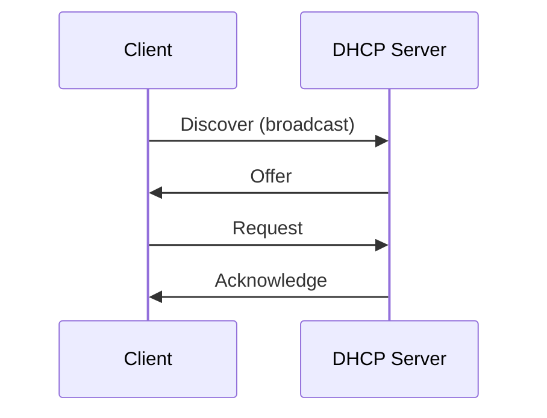

# DHCP, DNS va IPv4 security

## DHCP va IPv4 address olish

DHCP - hostga avtomatik IP configuration beradigan protocol.

DHCP odatda quyidagilarni beradi:

- IP address
- subnet mask
- default gateway
- DNS server
- lease time

## DHCP DORA jarayoni

DHCP jarayoni:

```text
Discover -> Offer -> Request -> Acknowledge
```

Qisqa nomi: **DORA**.



Client boshida IP addressga ega bo'lmagani uchun broadcast ishlatadi:

```text
Source IP:      0.0.0.0
Destination IP: 255.255.255.255
```

DHCP portlari:

| Rol | Port |
|---|---:|
| Server | UDP 67 |
| Client | UDP 68 |

## DHCP ishlamasa nima bo'ladi?

Ko'p OS'larda DHCP ishlamasa host link-local/APIPA address olishi mumkin:

```text
169.254.x.x
```

Bu address hostga lokal segmentda cheklangan aloqa berishi mumkin, lekin odatda Internetga chiqish ishlamaydi.

Troubleshootingda `169.254.x.x` ko'rinsa, birinchi gumon:

- DHCP server ishlamayapti;
- client DHCP serverga yetib bormayapti;
- VLAN noto'g'ri;
- DHCP relay/helper address yo'q;
- firewall yoki switch policy DHCP'ni bloklayapti.

## IPv4 va DNS

DNS hostname'ni IP addressga aylantiradi.

Misol:

```text
example.com -> 93.184.216.34
```

IPv4 uchun DNS record:

```text
A record
```

IPv6 uchun:

```text
AAAA record
```

DNS IP addressni beradi, lekin packetni yetkazish DNS vazifasi emas. Packetni yetkazish routing vazifasi.

## DNS ishlamasa qanday farqlanadi?

Quyidagi holatga qarang:

```bash
ping 8.8.8.8
ping google.com
```

Agar `8.8.8.8` ping bo'lib, `google.com` ishlamasa, IP connectivity bor, lekin DNS muammosi bo'lishi mumkin.

Tekshirish:

```bash
dig google.com A
nslookup google.com
```

## NAT eslatmasi

Private IPv4 addresslar Internetda global route qilinmaydi.

Private range'lar:

```text
10.0.0.0/8
172.16.0.0/12
192.168.0.0/16
```

Private host Internetga chiqishi uchun odatda NAT ishlatiladi.

NAT mavzusi alohida chuqur mavzu: [nat-and-firewall.md](../../nat-and-firewall.md).

## IPv4 security nuqtalari

IPv4 o'zi authentication yoki encryption bermaydi. Shu sababli xavfsizlik boshqa mexanizmlar bilan qilinadi.

Ko'p uchraydigan xavflar:

| Muammo | Izoh | Himoya |
|---|---|---|
| IP spoofing | Source IP soxtalashtiriladi | ingress/egress filtering, uRPF |
| Broadcast abuse | Broadcast orqali amplification | directed broadcastni bloklash |
| ARP spoofing | LAN ichida gateway MAC soxtalashtiriladi | DHCP snooping, dynamic ARP inspection |
| Fragmentation evasion | Fragmentlar bilan firewallni aldash | stateful firewall, reassembly |
| Private IP leak | RFC1918 address Internetga chiqib ketadi | edge filtering |

Muhim qoida:

```text
Private IP range'lar Internet edge'da route qilinmasligi kerak.
```

## ARP spoofing nega IPv4 bilan bog'liq?

IPv4 lokal tarmoqda MAC address topish uchun ARP'ga tayanadi. ARP o'zi ishonchli authentication qilmaydi.

Shuning uchun attacker:

```text
Gateway IP menman, MAC mana shu.
```

deb yolg'on ARP reply yuborishi mumkin. Bu man-in-the-middle yoki traffic hijack xavfiga olib keladi.

Himoya:

- DHCP snooping;
- Dynamic ARP Inspection;
- port security;
- statik ARP faqat juda kichik va nazoratli holatlarda.

## IPv4 encryption bermaydi

IPv4 header va forwarding mexanizmi packetni yetkazishga qaratilgan. U confidentiality bermaydi.

Encryption uchun:

- TLS;
- SSH;
- IPsec;
- VPN;
- application-level encryption

ishlatiladi.

## Qisqa xulosa

DHCP hostga IP konfiguratsiya beradi, DNS hostname'ni IP'ga aylantiradi, NAT private addresslarni Internetga chiqarishda yordam beradi. IPv4 esa o'zi encryption yoki authentication bermaydi, shuning uchun security alohida mexanizmlar bilan quriladi.
