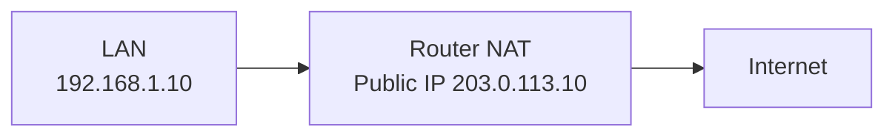

# IPv4 address turlari

IPv4 addresslar faqat "oddiy host address" emas. Ular traffic turi va ishlatilish joyiga qarab bir nechta guruhga bo'linadi.

## Unicast

Unicast - bitta source'dan bitta destination'ga yuboriladigan traffic.

```text
192.168.1.10 -> 192.168.1.20
```

Oddiy web, SSH, DNS query, ping kabi traffic ko'p holatda unicast bo'ladi.

## Broadcast

Broadcast - bitta source'dan subnetdagi hamma hostlarga yuboriladigan traffic.

Ikki asosiy turi bor:

1. **Limited broadcast** - `255.255.255.255`
2. **Directed broadcast** - masalan `192.168.1.255/24`

Broadcast odatda routerdan o'tmaydi. Bu broadcast storm va xavfsizlik muammolarini kamaytiradi.

DHCP Discover kabi jarayonlarda broadcast ishlatiladi, chunki client hali server IP'sini bilmaydi.

## Multicast

Multicast - bitta source'dan multicast group'ga a'zo hostlarga yuboriladigan traffic.

Range:

```text
224.0.0.0/4
```

Ya'ni:

```text
224.0.0.0 - 239.255.255.255
```

Misollar:

| Address | Ma'nosi |
|---|---|
| 224.0.0.5 | OSPF routers |
| 224.0.0.6 | OSPF DR/BDR |
| 224.0.0.9 | RIPv2 |

Multicast membership odatda IGMP orqali boshqariladi.

## Anycast

IPv4 header ichida "anycast" degan alohida address turi yo'q. Lekin routing orqali bir xil IP bir nechta joyda e'lon qilinadi va client eng yaqin route bo'yicha bittasiga boradi.

Masalan:

- public DNS xizmatlari;
- CDN edge serverlar;
- global load balancing.

## Public va private IPv4

IPv4 addresslar ishlatilishiga qarab ikki katta guruhga bo'linadi:

1. **Public IP** - Internetda global route qilinadi.
2. **Private IP** - LAN ichida ishlatiladi, Internetda global route qilinmaydi.

Private IP range'lar:

| Range | CIDR | Odatda qayerda ishlatiladi |
|---|---|---|
| 10.0.0.0 - 10.255.255.255 | 10.0.0.0/8 | enterprise, datacenter, VPN |
| 172.16.0.0 - 172.31.255.255 | 172.16.0.0/12 | enterprise, Docker, Kubernetes |
| 192.168.0.0 - 192.168.255.255 | 192.168.0.0/16 | uy routerlari, kichik LAN |

Private IP Internetga to'g'ridan-to'g'ri chiqmaydi. Odatda NAT kerak bo'ladi.



NAT misoli:

```text
192.168.1.10:51515 -> 203.0.113.10:40001
```

Shu sababli bitta public IP orqasida ko'p private host Internetga chiqishi mumkin.

NAT mavzusi alohida chuqur mavzu: [nat-and-firewall.md](../../nat-and-firewall.md).

## Maxsus IPv4 addresslar

Quyidagi addresslar oddiy hostlarga random berilmaydi:

| Address/range | Nomi | Ma'nosi |
|---|---|---|
| 0.0.0.0 | Unspecified | "Hali address yo'q" yoki "hamma interface" |
| 0.0.0.0/0 | Default route | Hamma destination uchun umumiy route |
| 10.0.0.0/8 | Private | LAN/VPN/datacenter |
| 100.64.0.0/10 | CGNAT | ISP ichki NAT range |
| 127.0.0.0/8 | Loopback | Localhost, o'ziga murojaat |
| 127.0.0.1 | Localhost | O'z kompyutering |
| 169.254.0.0/16 | Link-local/APIPA | DHCP ishlamasa avtomatik address |
| 172.16.0.0/12 | Private | LAN/VPN |
| 192.168.0.0/16 | Private | Home/small office LAN |
| 192.0.2.0/24 | Documentation | Misol uchun ishlatiladi |
| 198.51.100.0/24 | Documentation | Misol uchun ishlatiladi |
| 203.0.113.0/24 | Documentation | Misol uchun ishlatiladi |
| 224.0.0.0/4 | Multicast | Multicast group addresslar |
| 240.0.0.0/4 | Reserved | Kelajak/eksperimental |
| 255.255.255.255 | Limited broadcast | Lokal segmentdagi hammaga |

## Loopback

`127.0.0.1` ni ping qilish:

```bash
ping 127.0.0.1
```

Bu packet network cardgacha chiqmasdan, OS ichida loopback orqali ishlaydi.

Loopback nima uchun kerak?

- local servislarni test qilish;
- hostning TCP/IP stack'i ishlayotganini tekshirish;
- server dasturlarini tashqi networksiz ishga tushirish.

## Link-local/APIPA

`169.254.0.0/16` range DHCP ishlamagan holatlarda avtomatik address uchun ishlatiladi.

Masalan kompyuterda:

```text
169.254.32.10
```

ko'rinsa, bu ko'pincha DHCP serverdan address olinmaganini bildiradi.

## Documentation addresslar

Quyidagi range'lar real konfiguratsiya uchun emas, hujjat va misollar uchun ishlatiladi:

```text
192.0.2.0/24
198.51.100.0/24
203.0.113.0/24
```

Shuning uchun o'quv materialida public IP misoli kerak bo'lsa, shu range'lardan foydalanish to'g'riroq.

## Qisqa xulosa

IPv4 addressning qiymatiga qarab uning vazifasi o'zgaradi. `192.168.1.10` oddiy private host bo'lishi mumkin, `127.0.0.1` loopback, `224.0.0.5` multicast, `255.255.255.255` esa limited broadcast. Troubleshootingda address qaysi guruhga tegishli ekanini bilish juda muhim.
