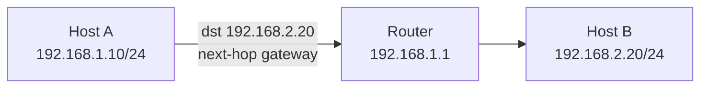

# Default gateway, ARP va routing

## Same subnet yoki different subnet?

Host packet yuborishda birinchi savolni beradi:

```text
Destination men bilan bir subnetdami?
```

Agar destination **bir subnetda** bo'lsa:

- host ARP orqali destination MAC addressni topadi;
- packet to'g'ridan-to'g'ri destination hostga yuboriladi;
- router kerak emas.

Agar destination **boshqa subnetda** bo'lsa:

- host packetni default gateway'ga yuboradi;
- ARP orqali gateway MAC address topiladi;
- IP destination o'zgarmaydi;
- Ethernet destination MAC gateway bo'ladi;
- router packetni keyingi network tomon yo'naltiradi.

## Same subnet misoli

```text
Host A: 192.168.1.10/24
Host B: 192.168.1.20/24
Gateway: 192.168.1.1
```

Host A va Host B bir subnetda:

```text
192.168.1.0/24
```

Router kerak emas.

## Different subnet misoli

```text
Host A: 192.168.1.10/24
Host B: 192.168.2.20/24
Gateway: 192.168.1.1
```

Host B boshqa subnetda. Host A packetni gateway'ga yuboradi.



## Default gateway

Default gateway - host boshqa subnetga chiqishi uchun ishlatadigan router interface.

Masalan:

```text
IP:      192.168.1.10
Mask:    255.255.255.0
Gateway: 192.168.1.1
```

Bu degani:

- `192.168.1.0/24` ichidagi hostlarga to'g'ridan-to'g'ri boriladi.
- boshqa hamma addresslar gateway orqali ketadi.

Default route:

```text
0.0.0.0/0
```

`0.0.0.0/0` - "hamma joy" degani. Routing table'da aniqroq route topilmasa, packet default route orqali ketadi.

Linux'da ko'rish:

```bash
ip route
```

Misol output:

```text
default via 192.168.1.1 dev wlan0
192.168.1.0/24 dev wlan0 proto kernel scope link src 192.168.1.10
```

## Gateway nega host bilan bir subnetda bo'lishi kerak?

Host gateway'ga packet yuborishi uchun avval gateway MAC addressini topishi kerak. MAC addressni topish ARP orqali bo'ladi, ARP esa lokal broadcast domain ichida ishlaydi.

Noto'g'ri:

```text
Host IP: 192.168.1.10/24
Gateway: 192.168.2.1
```

Host `192.168.2.1` ni lokal subnetdan tashqarida deb biladi va unga ARP qila olmaydi.

To'g'ri:

```text
Host IP: 192.168.1.10/24
Gateway: 192.168.1.1
```

## ARP va IPv4

ARP - **Address Resolution Protocol**.

IPv4 packet yuborish uchun hostga next-hop MAC address kerak bo'ladi. ARP IP addressni MAC addressga aylantiradi.

ARP savoli:

```text
192.168.1.20 kim? MAC addressingni ayt.
```

ARP javobi:

```text
192.168.1.20 menman, MAC: aa:bb:cc:dd:ee:ff
```

Muhim nuqtalar:

- ARP faqat lokal broadcast domain ichida ishlaydi.
- Router ARP broadcastni boshqa subnetga o'tkazmaydi.
- Boshqa subnetga ketayotgan packet uchun host destination MAC sifatida gateway MAC'ni ishlatadi.

Tekshirish:

```bash
ip neigh
arp -n
```

## IPv4 routing qanday ishlaydi?

Router packetni destination IP bo'yicha tekshiradi va routing table'dan eng mos route tanlaydi.

Eng muhim qoida:

```text
Longest Prefix Match
```

Ya'ni eng aniq route yutadi.

Route manbalari:

| Route turi | Izoh |
|---|---|
| Connected route | Router interface'iga bevosita ulangan network |
| Static route | Admin qo'lda yozadi |
| Dynamic route | OSPF, EIGRP, RIP, BGP kabi protocol orqali o'rganiladi |
| Default route | Boshqa route topilmasa ishlatiladi |

Routing protocol mavzusi alohida: [routing-protocols.md](../../routing-protocols.md).

## IPv4 packet yo'li: bir misol

Scenario:

```text
PC:      192.168.1.10/24
Gateway: 192.168.1.1
DNS:     8.8.8.8
Target:  example.com
```

Jarayon:

1. PC DNS orqali `example.com` ning A recordini so'raydi.
2. DNS javob beradi: masalan `93.184.216.34`.
3. PC tekshiradi: `93.184.216.34` men bilan bir subnetdami?
4. Yo'q, demak default gateway kerak.
5. PC ARP orqali `192.168.1.1` gateway MAC'ini topadi.
6. Ethernet frame gateway MAC'iga yuboriladi.
7. IP packet ichida destination baribir `93.184.216.34` bo'lib qoladi.
8. Router NAT qilishi mumkin.
9. Router longest prefix match bo'yicha packetni Internetga uzatadi.
10. Javob qaytganda NAT table orqali ichki hostga qaytariladi.

## IPv4 va LAN

LAN ichidagi hamma qurilma bir-biri bilan to'g'ridan-to'g'ri gaplashishi uchun odatda bir subnetda bo'ladi.

Misol:

```text
PC1: 192.168.1.10/24
PC2: 192.168.1.11/24
PC3: 192.168.1.12/24
GW:  192.168.1.1/24
```

Hammasi:

```text
192.168.1.0/24
```

tarmog'ida.

Router LANlar o'rtasida aloqani ta'minlaydi:

```text
LAN 1: 192.168.1.0/24
LAN 2: 192.168.2.0/24
```

Routerda ikki interface bo'lishi mumkin:

```text
G0/0: 192.168.1.1/24
G0/1: 192.168.2.1/24
```

PC1 `192.168.2.10` ga borishi uchun packet router orqali o'tadi.

## Qisqa xulosa

Host avval destination lokal subnetdami yoki yo'qmi, shuni aniqlaydi. Lokal bo'lsa destination MAC uchun ARP qiladi. Boshqa subnet bo'lsa gateway MAC uchun ARP qiladi va packetni routerga beradi. Router esa destination IP bo'yicha longest prefix match qoidasiga ko'ra keyingi hop'ni tanlaydi.
