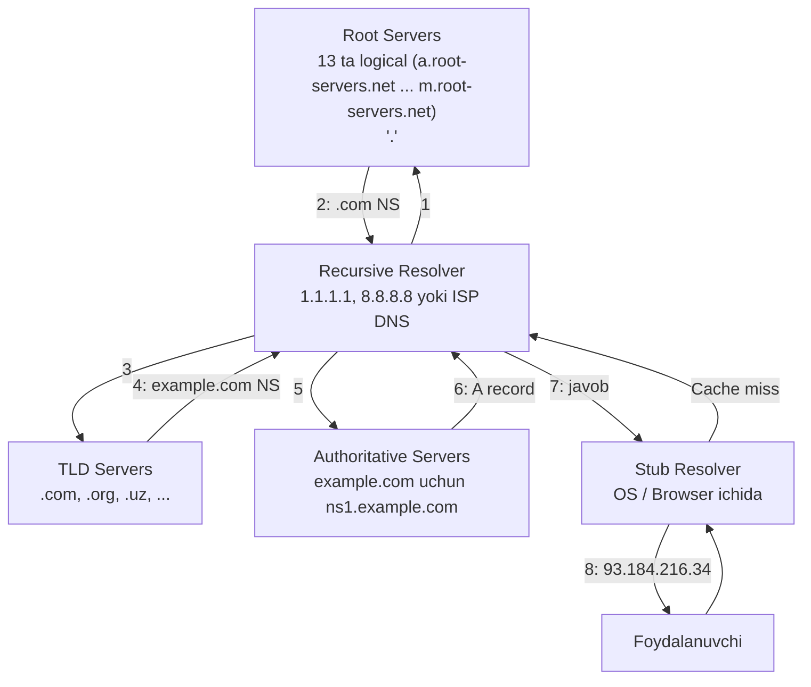
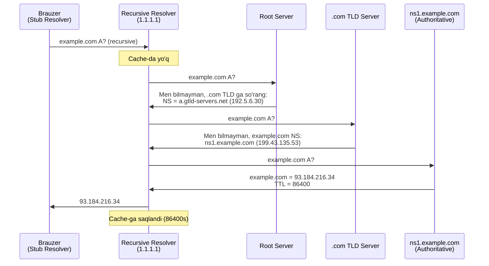
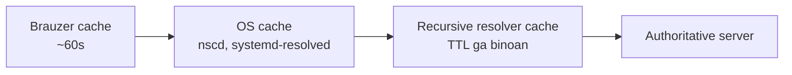
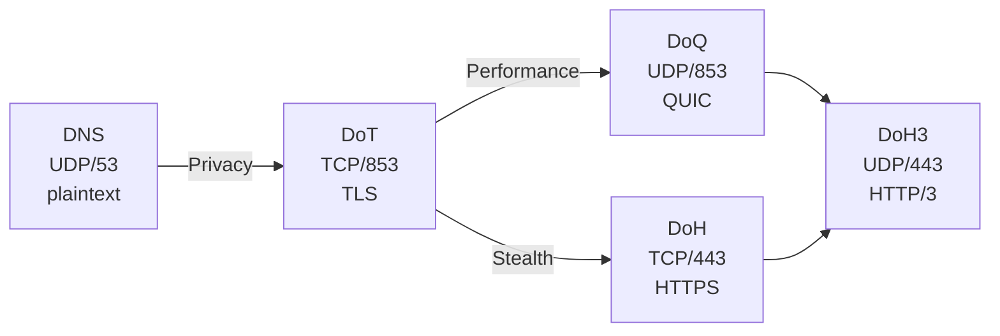

# DNS Resolution — Deep Dive

## 1. Nima uchun bu muhim?

DNS (Domain Name System) — Internet ning **telefon kitobi**. Har safar `google.com` brauzer-da yozilganda, kompyuter avval IP manzilni topishi kerak. DNS bo'lmasa, foydalanuvchilar 142.250.180.46 kabi raqamlarni eslab yurishi kerak edi.

**Interview-da nima uchun so'raladi?**

- **DNS — eng ko'p uchraydigan production muammo manbai:** "It's always DNS" — bu shunchaki internet meme emas, real haqiqat. Latency spike, intermittent failures — sabab DNS bo'lib chiqadi
- **CDN va load balancing tushunish uchun fundamental:** GeoDNS, Anycast — bularning hammasi DNS asosida
- **Security:** DNS hijacking, cache poisoning, DDoS amplification — kibersuglashda muhim
- **Modern privacy:** DoH, DoT, DoQ — har bir engineer 2026 da bu protokollarni bilishi kerak
- **Microservices:** Service discovery (Consul, Kubernetes DNS) — bu DNS asosida ishlaydi

Go developer uchun `net.LookupHost`, custom `Resolver` — production-da connection reliability uchun fundamental.

## 2. Tarix va evolyutsiya

DNS — 1983 yilda **Paul Mockapetris** tomonidan yaratilgan. Undan oldin Internet `HOSTS.TXT` faylga tayanardi — bitta markaziy fayl, hammaga qo'lda yuklab olinardi. Internet o'sgan sari bu yondashuv ishlamay qoldi.

**Asosiy mileston-lar:**

- **RFC 882, 883 (1983)** — DNS asosiy konsepsiyasi (Mockapetris)
- **RFC 1034, 1035 (1987)** — DNS standart spetsifikatsiya
- **RFC 2535 (1999)** — DNSSEC (security extensions)
- **RFC 4033-4035 (2005)** — DNSSEC qayta tahrirlangan
- **RFC 6891 (2013)** — EDNS(0) — kattaroq DNS message-lar uchun
- **RFC 7858 (2016)** — DNS over TLS (DoT)
- **RFC 8484 (2018)** — DNS over HTTPS (DoH)
- **RFC 9250 (2022)** — DNS over QUIC (DoQ)
- **2026** — DoH3 (DoH ustida HTTP/3) keng tarqaldi

**Modern Public Resolvers:**
- **Cloudflare 1.1.1.1** (2018) — eng tez, privacy-focused
- **Google 8.8.8.8** (2009) — eski va ishonchli
- **Quad9 9.9.9.9** (2017) — security-focused (malware bloklash)

## 3. DNS Hierarchy va Resolution Flow



### Recursive vs Iterative Query

**Recursive (Stub → Resolver):** "Menga to'liq javob ber." Resolver hammasini o'zi qiladi.

**Iterative (Resolver → Authoritative):** "Sen bilgan eng yaxshi javobni ber." Resolver server-lar zanjiriga so'rov yuboradi.



## 4. DNS Message Format — Wire Structure

DNS xabar UDP port 53 ustida ishlaydi (cap 512 byte, EDNS bilan 4096 byte). TCP port 53 — kattaroq javoblar uchun (zone transfer, DNSSEC).

```
 0                   1                   2                   3
 0 1 2 3 4 5 6 7 8 9 0 1 2 3 4 5 6 7 8 9 0 1 2 3 4 5 6 7 8 9 0 1
+-+-+-+-+-+-+-+-+-+-+-+-+-+-+-+-+-+-+-+-+-+-+-+-+-+-+-+-+-+-+-+-+
|                       Transaction ID                          |
+-+-+-+-+-+-+-+-+-+-+-+-+-+-+-+-+-+-+-+-+-+-+-+-+-+-+-+-+-+-+-+-+
|QR|  Opcode |AA|TC|RD|RA| Z|AD|CD|  RCODE  |
+-+-+-+-+-+-+-+-+-+-+-+-+-+-+-+-+-+-+-+-+-+-+-+-+-+-+-+-+-+-+-+-+
|                    QDCOUNT (Questions)                        |
+-+-+-+-+-+-+-+-+-+-+-+-+-+-+-+-+-+-+-+-+-+-+-+-+-+-+-+-+-+-+-+-+
|                  ANCOUNT (Answer RRs)                         |
+-+-+-+-+-+-+-+-+-+-+-+-+-+-+-+-+-+-+-+-+-+-+-+-+-+-+-+-+-+-+-+-+
|                  NSCOUNT (Authority RRs)                      |
+-+-+-+-+-+-+-+-+-+-+-+-+-+-+-+-+-+-+-+-+-+-+-+-+-+-+-+-+-+-+-+-+
|                  ARCOUNT (Additional RRs)                     |
+-+-+-+-+-+-+-+-+-+-+-+-+-+-+-+-+-+-+-+-+-+-+-+-+-+-+-+-+-+-+-+-+
|                                                               |
~                       Question Section                        ~
|                                                               |
+-+-+-+-+-+-+-+-+-+-+-+-+-+-+-+-+-+-+-+-+-+-+-+-+-+-+-+-+-+-+-+-+
~                       Answer Section                          ~
+-+-+-+-+-+-+-+-+-+-+-+-+-+-+-+-+-+-+-+-+-+-+-+-+-+-+-+-+-+-+-+-+
~                       Authority Section                       ~
+-+-+-+-+-+-+-+-+-+-+-+-+-+-+-+-+-+-+-+-+-+-+-+-+-+-+-+-+-+-+-+-+
~                       Additional Section                      ~
+-+-+-+-+-+-+-+-+-+-+-+-+-+-+-+-+-+-+-+-+-+-+-+-+-+-+-+-+-+-+-+-+
```

**Header flaglari:**
- **QR** — 0=query, 1=response
- **AA** — Authoritative Answer
- **TC** — Truncated (UDP-da to'liq sig'masa, TCP-ga retry)
- **RD** — Recursion Desired (client so'raydi)
- **RA** — Recursion Available (server javob beradi)
- **RCODE** — Response code (0=NOERROR, 2=SERVFAIL, 3=NXDOMAIN)

## 5. DNS Record Types

| Type | Vazifasi | Misol |
|------|----------|-------|
| **A** | IPv4 manzil | `example.com → 93.184.216.34` |
| **AAAA** | IPv6 manzil | `example.com → 2606:2800:220:1::1` |
| **CNAME** | Alias (boshqa nomga ishora) | `www.example.com → example.com` |
| **MX** | Mail server | `example.com → mail.example.com (priority 10)` |
| **NS** | Name server | `example.com → ns1.example.com` |
| **TXT** | Matn (SPF, DKIM, verification) | `v=spf1 include:_spf.google.com ~all` |
| **SOA** | Start of Authority (zone info) | serial, refresh, retry |
| **SRV** | Service (port, priority, weight) | `_sip._tcp.example.com → 5060 sip.example.com` |
| **PTR** | Reverse DNS (IP → name) | `34.216.184.93.in-addr.arpa → example.com` |
| **CAA** | Qaysi CA cert chiqarishi mumkin | `example.com CAA 0 issue "letsencrypt.org"` |
| **DNSKEY/RRSIG/DS** | DNSSEC uchun |  |

### Real misol — `dig` output

```bash
$ dig example.com

; <<>> DiG 9.18.24 <<>> example.com
;; Got answer:
;; ->>HEADER<<- opcode: QUERY, status: NOERROR, id: 13420
;; flags: qr rd ra; QUERY: 1, ANSWER: 1, AUTHORITY: 0, ADDITIONAL: 1

;; QUESTION SECTION:
;example.com.                   IN      A

;; ANSWER SECTION:
example.com.            76547   IN      A       93.184.216.34

;; Query time: 12 msec
;; SERVER: 1.1.1.1#53(1.1.1.1)
;; WHEN: Mon May 05 12:34:56 +05 2026
;; MSG SIZE  rcvd: 56
```

## 6. DNS Caching va TTL

DNS-ning eng muhim performance optimizatsiyasi — **caching**. Har bir record TTL (Time To Live) ga ega:



**TTL strategiyasi:**
- **Yuqori TTL (24h+):** Static content, kam o'zgaradigan record-lar
- **Past TTL (5min):** Load balancer yoki failover uchun
- **Juda past TTL (60s):** Migration vaqtida

**Cache muammosi:** Server IP o'zgarsa ham, eski IP DNS cache-da TTL tugaguncha qoladi. Shuning uchun migration-dan oldin TTL-ni pastga tushirish kerak.

## 7. DNSSEC — DNS Security Extensions

**Muammo:** Standart DNS shifrlanmagan va imzolanmagan. Hujumchi javobni soxtalashtirishi mumkin (cache poisoning).

**Yechim — DNSSEC:** Har bir DNS javob kriptografik imzo bilan keladi (`RRSIG`). Public key esa `DNSKEY` record-da. Chain of trust root-dan boshlanadi.

```
example.com → DNSKEY (public key)
            → RRSIG (record imzosi)
.com TLD    → DS record (example.com kalitining hashi)
Root        → DS record (.com kalitining hashi)
Root key    → ICANN tomonidan boshqariladi (oflayn HSM)
```

**Holati:** DNSSEC sekin tarqaladi (faqat 5-10% domen). Sabab — murakkablik va kichik foyda. Uning o'rniga DoH/DoT keng tarqaldi.

## 8. Modern DNS Privacy — DoH, DoT, DoQ

Standart DNS port 53 da **plaintext** uzatiladi. ISP, Wi-Fi, hujumchi — hammasi qaysi saytlarga kirayotganingizni ko'radi.

### Taqqoslash

| Protocol | Port | Transport | Visibility | Performance |
|----------|------|-----------|------------|-------------|
| **DNS** (an'anaviy) | 53 | UDP/TCP | Plaintext | Eng tez, 1 RTT |
| **DoT** (DNS over TLS) | 853 | TCP+TLS | Shifrlangan, lekin port 853 ko'rinadi | TLS handshake overhead |
| **DoH** (DNS over HTTPS) | 443 | TCP+TLS+HTTP | HTTPS bilan aralashadi | Eng yashirin |
| **DoQ** (DNS over QUIC) | 853 | UDP+QUIC | Shifrlangan, no head-of-line blocking | 18-22% tezroq DoT-dan |
| **DoH3** (DoH over HTTP/3) | 443 | UDP+QUIC | DoH + DoQ afzalliklari | Eng zamonaviy |



**Public Resolvers — taqqoslash:**

| Resolver | IPv4 | IPv6 | Privacy | Filtering |
|----------|------|------|---------|-----------|
| **Cloudflare** | 1.1.1.1 | 2606:4700:4700::1111 | "1 kun log" | Yo'q (1.1.1.2 — malware blok) |
| **Google** | 8.8.8.8 | 2001:4860:4860::8888 | Anonymized 24-48h | Yo'q |
| **Quad9** | 9.9.9.9 | 2620:fe::fe | "No PII log" | Malware blok (default) |
| **OpenDNS** | 208.67.222.222 | 2620:119:35::35 | Cisco | Configurable |

**2026-da:** Major OS (Android, iOS, Windows 11, modern Linux) — hammasi DoT/DoH ni native qo'llab-quvvatlaydi. Firefox va Chrome default DoH-ga o'tdi.

## 9. Real misollar

### dig +trace — to'liq resolution

```bash
$ dig +trace example.com

; <<>> DiG 9.18.24 <<>> +trace example.com
.                       512000  IN      NS      a.root-servers.net.
.                       512000  IN      NS      b.root-servers.net.
;; ... 13 ta root server

com.                    172800  IN      NS      a.gtld-servers.net.
com.                    172800  IN      NS      b.gtld-servers.net.
;; received 1170 bytes from 198.41.0.4#53(a.root-servers.net) in 32 ms

example.com.            172800  IN      NS      a.iana-servers.net.
example.com.            172800  IN      NS      b.iana-servers.net.
;; received 524 bytes from 192.5.6.30#53(a.gtld-servers.net) in 28 ms

example.com.            86400   IN      A       93.184.216.34
;; received 56 bytes from 199.43.135.53#53(a.iana-servers.net) in 45 ms
```

### Specific resolver bilan

```bash
$ dig @1.1.1.1 example.com           # Cloudflare
$ dig @8.8.8.8 example.com           # Google
$ dig @9.9.9.9 example.com           # Quad9

# DoH testi
$ curl -H 'accept: application/dns-json' \
       'https://1.1.1.1/dns-query?name=example.com&type=A'
{"Status":0,"TC":false,"RD":true,"RA":true,"AD":false,"CD":false,
 "Question":[{"name":"example.com","type":1}],
 "Answer":[{"name":"example.com","type":1,"TTL":76547,"data":"93.184.216.34"}]}
```

### tcpdump bilan capture

```bash
$ sudo tcpdump -i any -nn port 53

12:34:56.789 IP 192.168.1.10.43215 > 1.1.1.1.53: 13420+ A? example.com. (29)
12:34:56.812 IP 1.1.1.1.53 > 192.168.1.10.43215: 13420 1/0/0 A 93.184.216.34 (45)
```

## 10. Go tilida implementatsiya

### Oddiy DNS lookup

```go
package main

import (
    "fmt"
    "net"
)

func main() {
    // Default resolver (system, /etc/resolv.conf)
    ips, err := net.LookupHost("example.com")
    if err != nil {
        panic(err)
    }
    for _, ip := range ips {
        fmt.Println(ip)
    }

    // Specific record types
    mxs, _ := net.LookupMX("gmail.com")
    for _, mx := range mxs {
        fmt.Printf("MX: %s priority=%d\n", mx.Host, mx.Pref)
    }

    txts, _ := net.LookupTXT("example.com")
    fmt.Println("TXT:", txts)
}
```

### Custom DNS Resolver (1.1.1.1 ishlatish)

```go
package main

import (
    "context"
    "fmt"
    "net"
    "time"
)

func main() {
    // Custom resolver — 1.1.1.1 (Cloudflare) ishlatadi
    resolver := &net.Resolver{
        PreferGo: true, // Go DNS clientidan foydalanadi (cgo emas)
        Dial: func(ctx context.Context, network, address string) (net.Conn, error) {
            d := net.Dialer{Timeout: 5 * time.Second}
            return d.DialContext(ctx, "udp", "1.1.1.1:53")
        },
    }

    ctx, cancel := context.WithTimeout(context.Background(), 5*time.Second)
    defer cancel()

    ips, err := resolver.LookupHost(ctx, "example.com")
    if err != nil {
        panic(err)
    }
    fmt.Println("Resolved:", ips)
}
```

### DoH client (oddiy implementation)

```go
package main

import (
    "encoding/json"
    "fmt"
    "io"
    "net/http"
)

type DoHResponse struct {
    Answer []struct {
        Name string `json:"name"`
        TTL  int    `json:"TTL"`
        Data string `json:"data"`
    } `json:"Answer"`
}

func dohLookup(domain string) ([]string, error) {
    url := fmt.Sprintf("https://1.1.1.1/dns-query?name=%s&type=A", domain)
    req, _ := http.NewRequest("GET", url, nil)
    req.Header.Set("Accept", "application/dns-json")

    resp, err := http.DefaultClient.Do(req)
    if err != nil {
        return nil, err
    }
    defer resp.Body.Close()

    body, _ := io.ReadAll(resp.Body)
    var dohResp DoHResponse
    json.Unmarshal(body, &dohResp)

    ips := make([]string, 0, len(dohResp.Answer))
    for _, a := range dohResp.Answer {
        ips = append(ips, a.Data)
    }
    return ips, nil
}

func main() {
    ips, _ := dohLookup("example.com")
    fmt.Println("DoH result:", ips)
}
```

## 11. Common Errors

| Xato | Sabab | Yechim |
|------|-------|--------|
| **NXDOMAIN** | Domain yo'q | Imloni tekshiring, `dig` bilan tekshirish |
| **SERVFAIL** | Resolver xato | Boshqa resolver-ga o'tish (1.1.1.1) |
| **REFUSED** | Resolver javob bermaydi | Firewall yoki ACL muammo |
| **TIMEOUT** | Resolver javob qaytmadi | Network yoki resolver muammo |
| **Wrong A record** | DNS cache eskirgan | `sudo systemd-resolve --flush-caches` |
| **CNAME chain** | Juda chuqur CNAME | Maksimum 8 darajagacha |

## 12. Troubleshooting (Pop!_OS / Linux)

```bash
# Asosiy DNS lookup
dig example.com
nslookup example.com
host example.com

# To'liq resolution chain
dig +trace example.com

# Ma'lum resolver bilan
dig @1.1.1.1 example.com
dig @8.8.8.8 example.com AAAA   # IPv6
dig @9.9.9.9 example.com MX

# Reverse DNS
dig -x 93.184.216.34

# DNSSEC tekshirish
dig +dnssec example.com

# DNS cache tozalash (systemd-resolved)
sudo systemd-resolve --flush-caches
sudo resolvectl flush-caches

# Joriy DNS sozlamalari
cat /etc/resolv.conf
resolvectl status

# DNS trafikni capture
sudo tcpdump -i any -nn port 53 -w dns.pcap
sudo tshark -i any -f "port 53" -Y "dns"

# Real-time DNS query monitoring
sudo dnstop eth0           # eski tool
sudo systemd-resolve --statistics

# /etc/hosts ni override qilish (testing uchun)
echo "127.0.0.1 example.com" | sudo tee -a /etc/hosts
```

**Real misol:** "Sayt ochilmayapti" — qadamlar:
1. `ping example.com` — DNS ishlayaptimi?
2. `dig example.com` — qaysi IP keladi?
3. `dig @1.1.1.1 example.com` — boshqa resolver bilan boshqacha javob keladimi? (DNS poisoning belgisi)
4. `traceroute 93.184.216.34` — IP-ga yetib boriladimi?

## 13. FAQ

**S1: DNS UDP ni ishlatadi, ammo nega TCP ham bor?**
**J:** UDP packet 512 byte dan kattaroq bo'lsa (DNSSEC, ko'p record), TC flag ko'tariladi va client TCP-ga retry qiladi. Zone transfer (AXFR) faqat TCP.

**S2: Browser DNS cache OS DNS cache dan farq qiladimi?**
**J:** Ha, alohida. Chrome `chrome://net-internals/#dns` da o'z cache-ini saqlaydi. Firefox ham xuddi shunday.

**S3: TTL=0 nima qiladi?**
**J:** Resolver cache-ga saqlamasligi kerak. Lekin amaliyotda ko'p resolver minimal TTL (60s) qo'llaydi, chunki TTL=0 server-ga juda katta yuk.

**S4: GeoDNS qanday ishlaydi?**
**J:** Authoritative server client IP-ga qarab har xil javob beradi. AWS Route 53, Cloudflare GeoDNS shunday ishlaydi. Foydalanuvchi yaqin server-ga yo'naltiriladi.

**S5: Anycast DNS nima?**
**J:** Bir xil IP bir nechta serverda. Network routing eng yaqin serverga yo'naltiradi. 1.1.1.1, 8.8.8.8 — anycast. 13 ta root DNS server aslida 1000+ fizik server.

**S6: DoH-ni ISP bloklay oladimi?**
**J:** Texnikaviy juda qiyin — port 443 HTTPS bilan birga. Lekin ISP DoH server IP-larini bloklab qo'yishi mumkin. ECH (Encrypted Client Hello) bu muammoni hal qiladi.

**S7: `/etc/hosts` qanday DNS-ga ta'sir qiladi?**
**J:** OS resolver avval `/etc/hosts` ni tekshiradi, keyin DNS-ga so'rov yuboradi. NSS (Name Service Switch) tartibi `/etc/nsswitch.conf` da.

**S8: DNS cache poisoning nima va qanday himoya qilinadi?**
**J:** Hujumchi soxta DNS javob inject qiladi (Kaminsky attack, 2008). Himoya — random source port, transaction ID, DNSSEC, va eng asosiysi DoT/DoH.

## 14. Cross-references

- Yuqori layer: [`../osi/07-application.md`](../osi/07-application.md)
- Quyi layer (transport): [`./tcp-handshake.md`](./tcp-handshake.md), DNS UDP-ga ham tayanadi
- Tegishli deep-dive: [`./tls-ssl.md`](./tls-ssl.md) — DoT va DoH TLS ustida
- Glossary: [`../00-foundations/glossary.md`](../00-foundations/glossary.md)

## 15. Manbalar

- **RFC 1034** — Domain Names — Concepts and Facilities
- **RFC 1035** — Domain Names — Implementation
- **RFC 4033-4035** — DNSSEC
- **RFC 6891** — EDNS(0)
- **RFC 7858** — DNS over TLS
- **RFC 8484** — DNS over HTTPS
- **RFC 9250** — DNS over QUIC
- **Kitob:** Kurose & Ross "Computer Networking", Bob 2.5 (DNS)
- **Cricket Liu:** "DNS and BIND" (5-nashr) — kitob
- [Cloudflare 1.1.1.1](https://1.1.1.1/)
- [Google Public DNS](https://developers.google.com/speed/public-dns)
- [DNS Encryption in 2026](https://packet.guru/blog/DNS-Encryption-in-2026)
- [DNS Privacy: DoH, DoT, and DoQ (2026)](https://dasroot.net/posts/2026/03/dns-privacy-doh-dot-dns-over-quic/)
- [NextDNS — DoT, DoQ, DoH explained](https://help.nextdns.io/t/x2hmvas/what-is-dns-over-tls-dot-dns-over-quic-doq-and-dns-over-https-doh-doh3)
