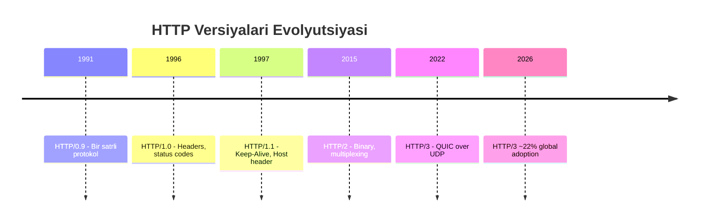
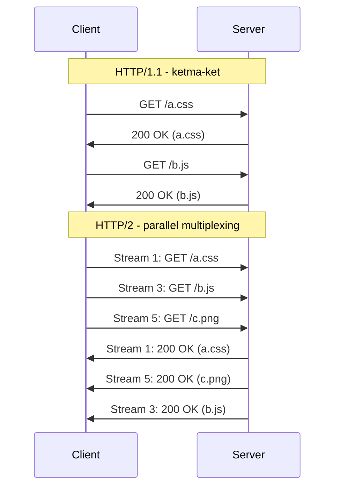
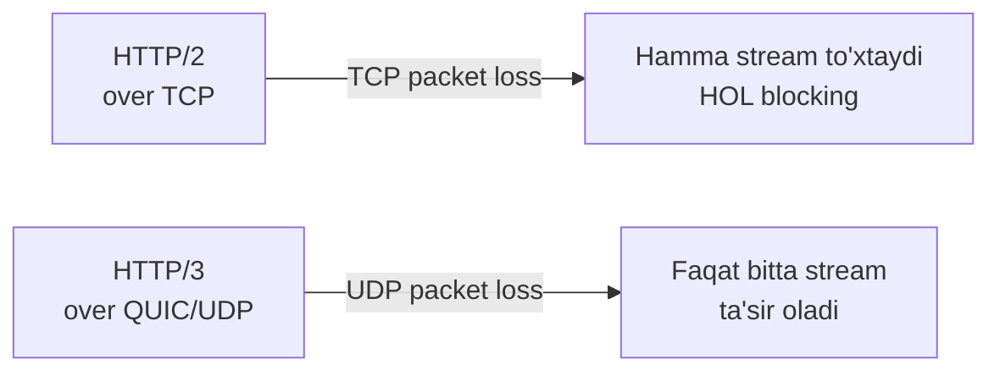

# HTTP Evolyutsiyasi: HTTP/0.9 dan HTTP/3 gacha

## 1. Nima uchun bu muhim?

HTTP (HyperText Transfer Protocol) — Internetning tilidir. Har bir web sahifa, API request, mobil ilova so'rovi shu protokol orqali o'tadi. 1991-yildan 2026-yilgacha HTTP 5 ta katta versiyani boshidan o'tkazdi va har bir versiya o'sha davrning eng katta muammosini hal qilishga harakat qildi: tezlik, parallel ishlash, security, mobil networklardagi packet loss.

Bugungi engineer uchun HTTP versiyalari farqini bilmaslik — bu nafaqat bilim kamchiligi, balki real performance muammolari demakdir. Masalan, agar siz mikroservislar arxitekturasida HTTP/1.1 ishlatsangiz, har request uchun alohida TCP connection ochilishi mumkin va bu **head-of-line (HOL) blocking** ga olib keladi. HTTP/2 multiplexing buni yechadi, HTTP/3 esa QUIC orqali transport layer dagi HOL blocking ni ham yo'q qiladi.

## 2. Tarix va evolyutsiya



**HTTP/0.9 (1991, Tim Berners-Lee):** Faqat `GET` method, faqat HTML qaytaradi. Status code yo'q, header yo'q. Bir satr — `GET /index.html\r\n` — va connection yopiladi.

**HTTP/1.0 (1996, RFC 1945):** Headers paydo bo'ldi, status codes (200, 404, 500), `Content-Type` (MIME types). Lekin har request uchun yangi TCP connection ochilardi — bu juda qimmat operatsiya edi.

**HTTP/1.1 (1997, RFC 2068, keyin RFC 7230-7235):** `Keep-Alive` (persistent connection), `Host` header (bir IP da ko'p website hosting qilish), chunked transfer encoding, pipelining, caching directives, `OPTIONS`, `PUT`, `DELETE` methodlar. Internetning 20 yildan ko'p hukmron versiyasi.

**HTTP/2 (2015, RFC 7540):** Google SPDY asosida. Binary protocol, multiplexing, server push, HPACK header compression, stream priority. Bir TCP connection ustida ko'p stream parallel ishlaydi.

**HTTP/3 (2022, RFC 9114):** TCP o'rniga **QUIC** (UDP ustida) ishlatadi. Transport-level HOL blocking yo'q, connection migration (Wi-Fi'dan 4G ga o'tganda connection uzilmaydi), 0-RTT handshake.

## 3. Asosiy mexanizm

### HTTP/1.1 — Persistent connection va pipelining

HTTP/1.1 da bitta TCP connection ustida ketma-ket bir nechta request yuborish mumkin. Lekin **pipelining** (bir paytda bir nechta request yuborish) amalda ishlamadi — chunki agar birinchi response sekin bo'lsa, qolganlari ham kutadi (HOL blocking).

### HTTP/2 — Binary va multiplexing

HTTP/2 binary frame'lar bilan ishlaydi. Bir TCP connection ustida ko'p **stream** parallel ishlaydi:



### HTTP/3 — QUIC va UDP

HTTP/3 da har stream o'z packet sequence ga ega. Agar bir stream da packet yo'qolsa, boshqa stream'lar to'xtamaydi.




## 4. Wire format / packet structure

### HTTP/1.1 — Plain text

```
GET /index.html HTTP/1.1\r\n
Host: example.com\r\n
User-Agent: curl/8.0\r\n
Accept: */*\r\n
\r\n
```

Response:

```
HTTP/1.1 200 OK\r\n
Content-Type: text/html; charset=UTF-8\r\n
Content-Length: 1234\r\n
\r\n
<html>...</html>
```

### HTTP/2 — Binary frame

HTTP/2 da har frame quyidagi formatda:

```
 0                   1                   2                   3
 0 1 2 3 4 5 6 7 8 9 0 1 2 3 4 5 6 7 8 9 0 1 2 3 4 5 6 7 8 9 0 1
+-+-+-+-+-+-+-+-+-+-+-+-+-+-+-+-+-+-+-+-+-+-+-+-+-+-+-+-+-+-+-+-+
|                 Length (24)                   |
+---------------+---------------+-------------------------------+
|   Type (8)    |   Flags (8)   |
+-+-------------+---------------+-------------------------------+
|R|                 Stream Identifier (31)                      |
+=+=============================================================+
|                   Frame Payload (0...)                      ...
+---------------------------------------------------------------+
```

Frame turlari: `DATA`, `HEADERS`, `PRIORITY`, `RST_STREAM`, `SETTINGS`, `PUSH_PROMISE`, `PING`, `GOAWAY`, `WINDOW_UPDATE`, `CONTINUATION`.

### HTTP/3 — QUIC packet

QUIC packet ichida HTTP/3 frame'lar bor. QUIC o'zi UDP datagram ichida:

```
+----+----------------+----------------+----------------+
|UDP | QUIC Header    | QUIC Frames    | HTTP/3 Frames  |
+----+----------------+----------------+----------------+
```

QUIC Long Header (handshake paytida) va Short Header (1-RTT data paytida) bo'ladi.

## 5. Real misol — capture / output

### curl bilan HTTP/1.1

```bash
$ curl -v --http1.1 https://example.com
> GET / HTTP/1.1
> Host: example.com
> User-Agent: curl/8.4.0
> Accept: */*
>
< HTTP/1.1 200 OK
< Content-Type: text/html
< Content-Length: 1256
< Date: Mon, 05 May 2026 12:00:00 GMT
```

### HTTP/2

```bash
$ curl -v --http2 https://www.google.com
* ALPN: server accepted h2
* Using HTTP2, server supports multiplexing
> GET / HTTP/2
> :authority: www.google.com
> :scheme: https
> :path: /
> user-agent: curl/8.4.0
< HTTP/2 200
< content-type: text/html; charset=ISO-8859-1
```

E'tibor bering: HTTP/2 da pseudo-headers (`:authority`, `:scheme`, `:path`, `:method`) bor.

### HTTP/3

```bash
$ curl -v --http3 https://cloudflare-quic.com
* Connected to cloudflare-quic.com via QUIC
* using HTTP/3
> GET / HTTP/3
> :authority: cloudflare-quic.com
< HTTP/3 200
< server: cloudflare
< alt-svc: h3=":443"; ma=86400
```

### Wireshark filtrlar

```
http.request.method == "GET"      # HTTP/1.x
http2.type == 1                   # HTTP/2 HEADERS frame
http2.streamid == 1               # Bitta stream
quic                              # HTTP/3 (QUIC)
quic.frame_type == 0x06           # CRYPTO frame
```

## 6. Edge cases va anomaliyalar

**Pipelining nima uchun ishlamadi?** HTTP/1.1 pipelining nazariy jihatdan ko'p request parallel yuborishga imkon beradi, lekin: (1) ko'p proxy buni qo'llab-quvvatlamasdi, (2) HOL blocking — bitta sekin response qolganlarini ushlab qoldi, (3) buggy server'lar ko'paytirdi. Shu sabab ko'p browser pipelining ni o'chirib qo'ydi.

**HTTP/2 da TCP HOL blocking:** HTTP/2 application-level HOL ni yechdi, lekin TCP packet loss bo'lsa, hamma stream to'xtaydi — TCP loss recovery tugaguncha. QUIC bu muammoni yechdi.


**Server Push:** HTTP/2 da bor edi, lekin amalda ko'p ishlatilmadi. Chrome 2022-yilda olib tashladi. Endi `103 Early Hints` ishlatiladi.

**0-RTT replay attack:** HTTP/3 da 0-RTT data jo'natish mumkin (handshake tugamasdan). Lekin attacker bu request'ni qayta jo'natishi mumkin (replay). Shu sabab faqat idempotent request'lar (GET) 0-RTT da xavfsiz.

## 7. Performance va optimizatsiya

| Versiya | RTT (yangi connection) | Multiplexing | HOL blocking | Header compression |
|---------|------------------------|--------------|--------------|---------------------|
| HTTP/1.0 | 1 RTT (TCP) + request | Yo'q | TCP + App | Yo'q |
| HTTP/1.1 | 1 RTT (Keep-Alive) | Yo'q (pipelining buggy) | TCP + App | Yo'q |
| HTTP/2 | 2-3 RTT (TCP+TLS) | Ha (bitta TCP) | TCP level | HPACK |
| HTTP/3 | 1 RTT (QUIC+TLS) yoki 0-RTT | Ha (QUIC stream) | Yo'q | QPACK |

**HOL blocking misoli:** 100 ta kichik fayl yuklash. HTTP/1.1 da 6 ta connection (browser limit) bilan ~17 ta request batch. HTTP/2 da bitta connection ustida 100 ta stream parallel. HTTP/3 da packet loss bo'lsa ham parallel davom etadi.


## 8. Security ko'rinishi

HTTP/2 va HTTP/3 amalda **faqat TLS** ustida ishlaydi (browserlar `h2c` cleartext'ni qo'llab-quvvatlamaydi). HTTP/3 da TLS 1.3 majburiy va QUIC ichiga integratsiya qilingan.

**Hujum vektorlari:**
- **HTTP/2 Rapid Reset (CVE-2023-44487):** Attacker ko'p stream ochib, darhol RST_STREAM yuborib, server resurslarini tugatadi. 2023-yilda eng katta DDoS — 398M req/s.
- **HPACK bombing:** Maxsus tayyorlangan header decompression bilan memory tugatish.
- **QUIC amplification:** UDP ustida bo'lgani uchun spoofed source IP bilan amplification hujum mumkin (lekin QUIC da `Retry` packet va source address validation bor).

## 9. Troubleshooting

```bash
# Qaysi HTTP versiya ishlatilmoqda
curl -v -o /dev/null https://example.com 2>&1 | grep -i "HTTP/"

# ALPN negotiation tekshirish
openssl s_client -connect example.com:443 -alpn h2,http/1.1

# HTTP/3 qo'llab-quvvatlanishini tekshirish
curl -I --http3 https://cloudflare.com
# Yoki Alt-Svc header'da
curl -I https://www.google.com | grep -i alt-svc

# nghttp bilan HTTP/2 debug
nghttp -nv https://example.com

# Wireshark — TLS keys export
export SSLKEYLOGFILE=~/sslkeys.log
chrome --ssl-key-log-file=~/sslkeys.log
```

## 10. Go tilida implementatsiya

Go ning `net/http` paketi HTTP/1.1 va HTTP/2 ni avtomatik qo'llab-quvvatlaydi (TLS bilan).

```go
package main

import (
    "fmt"
    "io"
    "net/http"
    "golang.org/x/net/http2"
)

// HTTP/2 client misoli
func main() {
    // HTTP/2 transport ni majburlash
    transport := &http.Transport{}
    http2.ConfigureTransport(transport) // HTTP/2 ni yoqish

    client := &http.Client{Transport: transport}

    resp, err := client.Get("https://www.google.com")
    if err != nil {
        panic(err)
    }
    defer resp.Body.Close()

    // Qaysi protokol ishlatilganini ko'rish
    fmt.Println("Protocol:", resp.Proto) // HTTP/2.0

    body, _ := io.ReadAll(resp.Body)
    fmt.Println("Body length:", len(body))
}
```

HTTP/3 uchun `quic-go` kutubxonasi:

```go
package main

import (
    "crypto/tls"
    "fmt"
    "io"
    "net/http"
    "github.com/quic-go/quic-go/http3"
)

// HTTP/3 client misoli
func main() {
    client := &http.Client{
        Transport: &http3.RoundTripper{
            TLSClientConfig: &tls.Config{
                NextProtos: []string{"h3"}, // ALPN h3
            },
        },
    }

    resp, err := client.Get("https://cloudflare-quic.com")
    if err != nil {
        panic(err)
    }
    defer resp.Body.Close()

    fmt.Println("Protocol:", resp.Proto) // HTTP/3.0
    body, _ := io.ReadAll(resp.Body)
    fmt.Println("Length:", len(body))
}
```

HTTP/3 server:

```go
// HTTP/3 server — quic-go bilan
server := &http3.Server{
    Addr:    ":443",
    Handler: http.DefaultServeMux,
}
server.ListenAndServeTLS("cert.pem", "key.pem")
```

## 11. FAQ

**S: HTTP/2 hamma joyda HTTP/1.1 dan tezroqmi?**
**J:** Yo'q. Stable, tez networklarda farq sezilmaydi. Lekin ko'p kichik resurs (CSS, JS, rasm) yuklash kerak bo'lsa, HTTP/2 sezilarli tezroq. Mobil va sekin networklarda HTTP/3 yanada yaxshi.

**S: HTTP/3 nega TCP o'rniga UDP?**
**J:** TCP bu OS kernel ichida implementatsiya qilingan, va uni o'zgartirish qiyin (har OS update kutadi). UDP esa "minimal" — QUIC user-space da ishlaydi, har application yangi versiyani ishlatishi mumkin. Bu evolyutsiyani tezlashtirdi.

**S: Browser HTTP/3 ni qanday topadi?**
**J:** Server `Alt-Svc: h3=":443"; ma=86400` header yuboradi. Browser keyingi request'ni HTTP/3 da urinadi. Yoki DNS HTTPS record (RFC 9460) orqali.

**S: HTTP/2 server push o'lganmi?**
**J:** Ha, amalda. Chrome 106 dan o'chirib qo'ydi (2022). Endi `103 Early Hints` ishlatiladi — bu yengilroq alternative.

**S: HPACK va QPACK farqi nima?**
**J:** HPACK (HTTP/2) header'larni dynamic table bilan compress qiladi, lekin tartib-bog'liq — TCP da problema yo'q. QPACK (HTTP/3) da streamlar mustaqil bo'lgani uchun, table update'ni alohida stream'da yuboradi va sinxronizatsiya boshqacha.

**S: HTTP/3 hamma firewall'da ishlaydimi?**
**J:** Yo'q. UDP port 443 ko'p korporativ firewall'da bloklangan. Shu sabab HTTP/3 fall back qiladi HTTP/2 ga.

**S: 2026-yilda HTTP/3 nechi foiz?**
**J:** W3Techs ma'lumotiga ko'ra, 2026-aprelda HTTP/3 ~21-22% web sayt tomonidan ishlatiladi. HTTP/2 hali ham hukmron (~50%), HTTP/1.x esa 27% atrofida. Cloudflare, Google, Facebook avtomatik HTTP/3 yoqilgan.

**S: gRPC HTTP/2 mi yoki HTTP/3?**
**J:** gRPC HTTP/2 ustida ishlaydi (multiplexing, streaming kerak). gRPC over HTTP/3 ishlanmoqda, lekin hali standart emas.

## 12. Cross-references

- Quyi layer: [TCP](../osi/04-transport.md), [UDP](../osi/04-transport.md)
- Application layer: [Application Layer](../osi/07-application.md)
- Tegishli deep-dive: [TLS handshake](./tls-ssl.md), [DNS](./dns-resolution.md)
- Glossary: [Glossary](../00-foundations/glossary.md)

## 13. Manbalar

- **RFC 1945** — HTTP/1.0
- **RFC 7230-7235** — HTTP/1.1 (yangilangan)
- **RFC 7540** — HTTP/2
- **RFC 7541** — HPACK
- **RFC 9000** — QUIC Transport
- **RFC 9114** — HTTP/3
- **RFC 9204** — QPACK
- [MDN HTTP Overview](https://developer.mozilla.org/en-US/docs/Web/HTTP/Overview)
- [Cloudflare HTTP/3 blog](https://blog.cloudflare.com/http3-usage-one-year-on/)
- [W3Techs HTTP/3 statistikasi](https://w3techs.com/technologies/details/ce-http3) — 2026-aprel: ~22%
- [Internet Society Pulse — Why HTTP/3 is eating the world](https://pulse.internetsociety.org/blog/why-http-3-is-eating-the-world)
- Kurose & Ross, "Computer Networking: A Top-Down Approach", Bob 2 (Application Layer)
