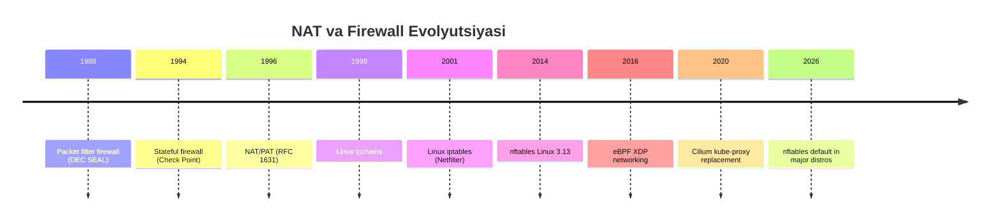
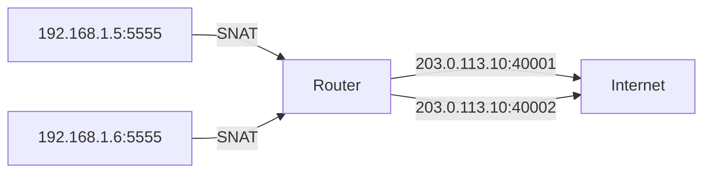
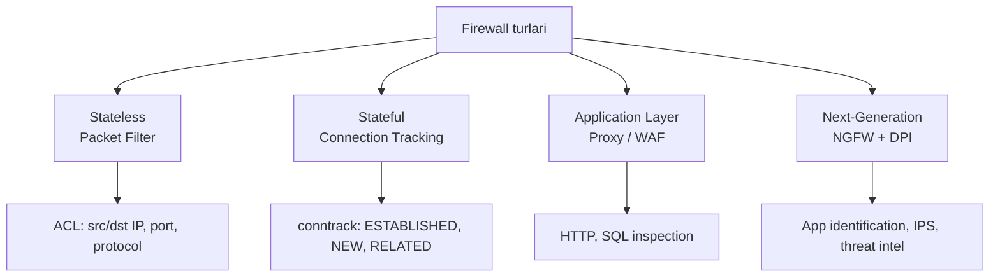

# NAT va Firewall: Chuqur tahlil

## 1. Nima uchun bu muhim?

Internet 1980-yillarda 4.3 milliard IPv4 manzil bilan loyihalashtirilgan edi. Bugun bu son yetmaydi. **NAT** (Network Address Translation) shu muammoning vaqtinchalik (lekin 30+ yildan beri ishlayotgan) yechimi: bitta public IP orqasida minglab qurilma yashashi mumkin.

**Firewall** esa — network xavfsizligining birinchi himoya chizig'i. Har korporativ network, har bulut deployment, har serverda firewall bor. Linux'da `iptables` dan `nftables` va `eBPF` (Cilium, Calico) ga o'tish — 2025-2026-yillarning eng katta infrastructure trend'laridan biri.

Bu mavzuni tushunmasdan: home router'ni to'g'ri sozlay olmaysiz, Kubernetes network policy yoza olmaysiz, VoIP/WebRTC nima uchun ishlamayotganini topa olmaysiz.

## 2. Tarix va evolyutsiya



NAT dastlab tezkor "yamoq" sifatida o'ylab topilgan, lekin u IPv6 ga o'tishni 25 yilga sekinlashtirdi. Bugun ham ko'p home router va mobile carrier NAT (CGNAT) ishlatadi.

## 3. Asosiy mexanizm

### NAT turlari

**SNAT (Source NAT)** — Outbound traffic. Uy router internet'ga chiqayotganda, uy ichidagi `192.168.1.5` manzili public IP `203.0.113.10` ga aylanadi.

**DNAT (Destination NAT)** — Inbound traffic / port forwarding. Tashqaridan kelgan `203.0.113.10:80` ichkaridagi `192.168.1.100:8080` ga yo'naltiriladi.

**PAT / NAPT (Port Address Translation)** — Bitta public IP orqasida ko'p host. NAT table source port'ni o'zgartirib track qiladi.




### NAT topologiya turlari (RFC 3489)

1. **Full Cone NAT** — eng ochiq. Bir marta ichkaridan tashqariga packet yuborilsa, tashqi server o'zining istalgan portidan ichkaridagi mappingga packet yubora oladi.
2. **Restricted Cone NAT** — faqat oldin u IP ga packet yuborilgan tashqi IP javob qaytara oladi.
3. **Port Restricted Cone NAT** — IP + port bo'yicha cheklov.
4. **Symmetric NAT** — eng qattiq. Har destination uchun yangi external port. P2P juda qiyin.


### NAT64 va DNS64

IPv6-only client IPv4 server bilan gaplashishi uchun: DNS64 IPv4 A record'ni AAAA (IPv6) ga o'rab beradi (`64:ff9b::/96` prefix), keyin NAT64 gateway IPv6 packet'ni IPv4 ga aylantiradi.

### CGNAT (Carrier-Grade NAT)

ISP darajasida NAT. Foydalanuvchining home router NAT qiladi (RFC 1918), keyin ISP yana NAT qiladi (RFC 6598, `100.64.0.0/10` range). Double NAT muammolarni keltirib chiqaradi: port forwarding ishlamaydi, P2P qiyin.

### NAT traversal: STUN, TURN, ICE

WebRTC, VoIP, P2P o'yinlar uchun:
- **STUN** — server orqali public IP/port topish
- **TURN** — agar STUN ishlamasa, relay server orqali (sekin va qimmat)
- **ICE** — STUN+TURN+host candidate'larni kombinatsiya qilib eng yaxshi yo'lni tanlash
- **UDP hole punching** — ikkala tomon bir paytda outbound packet yuborib, NAT mapping ochib qo'yish

### Firewall turlari



**Stateless** — har packet'ni alohida tekshiradi. Tez, lekin "bilim" yo'q. ACL bilan ishlaydi.


**Stateful** — connection state'ni track qiladi (`conntrack` table). TCP da SYN, ESTABLISHED, FIN, TIME_WAIT holatlarini biladi. UDP da "pseudo-state" — last packet timestamp.

**Application-layer / WAF** — HTTP request body'ni tekshiradi. SQL injection, XSS payload'larni topadi.

**NGFW** — DPI (Deep Packet Inspection), application identification (Skype vs HTTP), IPS, threat intelligence.

### Linux firewall evolyutsiyasi

`iptables` (2001) → `nftables` (2014) → `eBPF` (2016+).

- **iptables** — chain (PREROUTING, INPUT, FORWARD, OUTPUT, POSTROUTING) va table (filter, nat, mangle, raw). Ko'p rule bo'lganda sekin (linear scan).
- **nftables** — yagona unified syntax (`nft`), set/map data structure, kernel'da native, IPv4+IPv6 yagona ruleset.
- **eBPF** — kernel ichida bytecode ishlaydi. Cilium Kubernetes uchun kube-proxy o'rnini bosadi. XDP (eXpress Data Path) — NIC driver'da ishlaydi, DDoS uchun ideal.

## 4. Wire format / packet structure

NAT packet'ni o'zgartiradi. Misol:


```
ICHKARI (LAN):                       TASHQI (WAN/Internet):
+----------------+                   +-------------------+
| src 192.168.1.5:5555 | --> NAT --> | src 203.0.113.10:40001 |
| dst 8.8.8.8:53        |             | dst 8.8.8.8:53           |
+----------------+                    +-------------------+
                                              |
                                              v
+----------------+                   +-------------------+
| dst 192.168.1.5:5555 | <-- NAT <-- | dst 203.0.113.10:40001 |
| src 8.8.8.8:53        |             | src 8.8.8.8:53           |
+----------------+                    +-------------------+
```

Conntrack jadvali NAT'ning yuragi:

```
tcp 6 432000 ESTABLISHED src=192.168.1.5 dst=8.8.8.8 sport=5555
    dport=53 src=8.8.8.8 dst=203.0.113.10 sport=53 dport=40001
    [ASSURED] mark=0 use=1
```

## 5. Real misol — capture / output

### iptables — NAT va firewall sozlash

```bash
# SNAT (masquerade) — uy router uchun
sudo iptables -t nat -A POSTROUTING -o eth0 -j MASQUERADE

# DNAT — port forwarding (80 → 8080)
sudo iptables -t nat -A PREROUTING -i eth0 -p tcp --dport 80 \
    -j DNAT --to-destination 192.168.1.100:8080

# Stateful filter — faqat ESTABLISHED qabul qil
sudo iptables -A INPUT -m conntrack --ctstate ESTABLISHED,RELATED -j ACCEPT
sudo iptables -A INPUT -p tcp --dport 22 -j ACCEPT  # SSH
sudo iptables -A INPUT -j DROP

# Joriy rules ko'rish
sudo iptables -t nat -L -n -v
sudo iptables -L -n -v --line-numbers
```

### nftables — modern syntax

```bash
# Yagona faylda hammasi
sudo nft list ruleset

# NAT table yaratish
sudo nft add table ip nat
sudo nft add chain ip nat postrouting { type nat hook postrouting priority 100 \; }
sudo nft add rule ip nat postrouting oifname "eth0" masquerade

# Filter
sudo nft add rule inet filter input ct state established,related accept
sudo nft add rule inet filter input tcp dport 22 accept
```

### conntrack ko'rish

```bash
sudo conntrack -L
# tcp 6 86399 ESTABLISHED src=192.168.1.5 dst=140.82.121.4 sport=54321
# dport=443 src=140.82.121.4 dst=203.0.113.10 sport=443 dport=40123
# [ASSURED] mark=0 use=1

sudo conntrack -E  # real-time event watching
sudo conntrack -S  # statistics
```

### Tcpdump bilan NAT tekshirish

```bash
# Ichki interface
sudo tcpdump -i eth1 -n host 192.168.1.5
# 12:00:01.123 IP 192.168.1.5.5555 > 8.8.8.8.53: UDP

# Tashqi interface — endi public IP
sudo tcpdump -i eth0 -n host 8.8.8.8
# 12:00:01.124 IP 203.0.113.10.40001 > 8.8.8.8.53: UDP
```

## 6. Edge cases va anomaliyalar

**FTP active mode va NAT:** FTP server clientga `PORT` command bilan o'z portini aytadi. NAT bu portni bilmaydi. Yechim: `nf_conntrack_ftp` modul — FTP control connection ichidagi PORT command'ni o'qib, dynamic rule qo'shadi.

**SIP/VoIP va Symmetric NAT:** SIP packet ichida o'z IP/port'ni e'lon qiladi. NAT IP header'ni o'zgartiradi, lekin SIP body o'zgarishsiz qoladi — natijada audio stream noto'g'ri joyga ketadi. ALG (Application Layer Gateway) yoki STUN/TURN kerak.

**Hairpinning / NAT loopback:** Ichki host external IP orqali ichki serverga ulanmoqchi. Ko'p router buni qo'llab-quvvatlamaydi.

**Conntrack table to'lib qolishi:** `nf_conntrack: table full, dropping packet`. Default ~262144 entry. Solution: `sysctl net.netfilter.nf_conntrack_max=1048576`.

**Egress source port collision:** Yuqori traffic load'da bitta NAT IP da source port (~64000) tugab qoladi. CGNAT'da bu real muammo.


## 7. Performance va optimizatsiya

| Texnologiya | Throughput (10G NIC) | CPU yuk | Use case |
|-------------|---------------------|---------|----------|
| iptables (1K rules) | ~3 Gbps | Yuqori | Eski deployment |
| nftables | ~6 Gbps | O'rta | Modern Linux |
| eBPF/XDP | ~10 Gbps wire-rate | Past | High-perf, K8s |
| ASIC firewall | 100+ Gbps | N/A | Datacenter |


**iptables sekinligi:** Har packet hamma rule'ni linearly tekshiradi. 10000 rule = sekin.

**nftables tezligi:** Set/map data structure (hash). O(1) lookup.

**eBPF sezilarli tezligi:** Cilium NetworkPolicy kube-proxy'ni almashtirganda CPU 30-40% kamayadi. XDP packet'ni socket buffer'ga ham yetib bormasdan drop qila oladi — DDoS uchun ideal. Cloudflare Magic Firewall shu asosda.


## 8. Security ko'rinishi

**NAT security illusion:** Ko'p odamlar "NAT meni himoya qiladi" deb o'ylaydi. Yo'q — NAT firewall emas. NAT faqat address translation. Xavfsizlik stateful conntrack'dan keladi (default-deny inbound).


**IPv6 da NAT yo'q:** IPv6 da har qurilmaning public IP bor. Demak, firewall qoidalari yana ham muhim.

**Firewall bypass texnikalar:**
- DNS tunneling (port 53)
- ICMP tunneling
- Domain fronting
- Application-layer protocol smuggling

**eBPF xavfsizlik:** Kernel'da kod ishlaydi — verifier (kernel's static analyzer) tekshiradi. Lekin yaqinda CVE'lar ko'paydi (2024-da `BPF_PROG_TYPE_LSM` da bug).

## 9. Troubleshooting

```bash
# 1. Connection NAT'lanyaptimi?
sudo conntrack -L | grep 192.168.1.5

# 2. Firewall packet'ni drop qilyaptimi?
sudo iptables -L -n -v  # paket counterlar
sudo nft list ruleset
dmesg | grep -i drop

# 3. Port forwarding ishlamayapti
sudo iptables -t nat -L PREROUTING -n -v
# FORWARD chain'da ham ruxsat berilganmi?
sudo iptables -L FORWARD -n -v

# 4. IP forwarding yoqilganmi?
sysctl net.ipv4.ip_forward  # 1 bo'lishi kerak

# 5. Conntrack to'lganmi?
cat /proc/sys/net/netfilter/nf_conntrack_count
cat /proc/sys/net/netfilter/nf_conntrack_max

# 6. NAT type aniqlash (P2P uchun)
stun stun.l.google.com:19302
```

Klassik muammo: "Mening server'im public IP'da bor, lekin tashqaridan ulanib bo'lmayapti."
1. ISP CGNAT ishlatyaptimi? (`curl ifconfig.me` natijasini router WAN IP bilan solishtir)
2. Router port forwarding yoqilganmi?
3. Server firewall (`ufw`, `firewalld`) port'ni ochganmi?
4. Cloud provider security group ruxsat berganmi?

## 10. Go tilida implementatsiya

Go'da raw socket bilan ishlash uchun `golang.org/x/sys/unix` va `net/netip`.

```go
package main

import (
    "fmt"
    "net/netip"
)

// NAT mapping table — soddalashtirilgan
type NATEntry struct {
    InternalAddr netip.AddrPort // 192.168.1.5:5555
    ExternalAddr netip.AddrPort // 203.0.113.10:40001
    Protocol     string
}

type NAT struct {
    table     map[netip.AddrPort]NATEntry // external -> entry
    publicIP  netip.Addr
    nextPort  uint16
}

// Outbound packet uchun mapping yarat
func (n *NAT) Translate(internal netip.AddrPort) netip.AddrPort {
    n.nextPort++
    external := netip.AddrPortFrom(n.publicIP, n.nextPort)
    n.table[external] = NATEntry{
        InternalAddr: internal,
        ExternalAddr: external,
        Protocol:     "tcp",
    }
    return external
}

// Inbound packet uchun reverse lookup
func (n *NAT) Reverse(external netip.AddrPort) (netip.AddrPort, bool) {
    entry, ok := n.table[external]
    if !ok {
        return netip.AddrPort{}, false
    }
    return entry.InternalAddr, true
}

func main() {
    nat := &NAT{
        table:    make(map[netip.AddrPort]NATEntry),
        publicIP: netip.MustParseAddr("203.0.113.10"),
        nextPort: 40000,
    }

    internal := netip.MustParseAddrPort("192.168.1.5:5555")
    external := nat.Translate(internal)
    fmt.Printf("LAN %s -> WAN %s\n", internal, external)

    // Reverse
    if back, ok := nat.Reverse(external); ok {
        fmt.Printf("Inbound %s -> %s\n", external, back)
    }
}
```

Stateful firewall uchun `conntrack` kabi simple struct:

```go
type ConnState int

const (
    StateNew ConnState = iota
    StateEstablished
    StateClosed
)

type Connection struct {
    SrcAddr   netip.AddrPort
    DstAddr   netip.AddrPort
    State     ConnState
    LastSeen  int64
}

// Packet kelganda
func (fw *Firewall) Inspect(pkt Packet) bool {
    key := pkt.Tuple()
    if conn, ok := fw.conns[key]; ok {
        conn.LastSeen = time.Now().Unix()
        return true // ESTABLISHED — ruxsat
    }
    if pkt.IsSyn() && fw.allowNew(pkt) {
        fw.conns[key] = &Connection{State: StateNew, LastSeen: time.Now().Unix()}
        return true
    }
    return false // DROP
}
```

## 11. FAQ

**S: NAT bilan IPv6 bormi?**
**J:** NPTv6 (RFC 6296) bor — prefix translation, lekin port translation yo'q. Amalda IPv6 da NAT kerakmas.

**S: Port forwarding nega bazi marta ishlamaydi?**
**J:** Sabablar: (1) ISP CGNAT — sizning router public IP da emas. (2) Router NAT loopback yo'q — local'dan ishlamaydi, internet'dan ishlaydi. (3) FORWARD chain blocked. (4) Server o'zining firewall.

**S: WebRTC va NAT — nega ba'zan ishlamaydi?**
**J:** Ikkala tomon Symmetric NAT orqasida bo'lsa, hole punching ishlamaydi. TURN relay kerak.

**S: iptables va nftables — qaysi birini o'rganay?**
**J:** Yangi proyekt uchun nftables. Eski sistemalarda iptables hali ham hukmron, lekin RHEL 9, Debian 12, Ubuntu 22.04+ default nftables backend ishlatadi (`iptables-nft` shim).

**S: eBPF firewall ishlatish kerakmi?**
**J:** Kubernetes ishlatasizmi? Cilium juda yaxshi. Server-level firewall uchun nftables yetadi. eBPF "complexity premium" bor.

**S: Stateful firewall ko'p memory ishlatadi shekilli?**
**J:** Har conntrack entry ~300 bytes. 1M connection ~300MB. Bugungi serverlarda muammo emas. Lekin DDoS paytida tezda to'lib qoladi.

**S: WAF firewallmi?**
**J:** Texnik nuqtai nazardan ha — application layer firewall. Lekin amalda alohida mahsulot sifatida ko'riladi (Cloudflare WAF, ModSecurity, AWS WAF).

**S: Docker NAT'ni qanday ishlatadi?**
**J:** Docker default `bridge` network'da iptables/nftables ishlatib SNAT (masquerade) qiladi. `docker-proxy` user-space DNAT helper — ba'zan disable qilinadi.

## 12. Cross-references

- Network Layer: [03-network.md](../osi/03-network.md)
- Tegishli deep-dive: [Routing protocols](./routing-protocols.md), [Subnetting/CIDR](./subnetting-cidr.md)
- TLS/Security: [TLS-SSL](./tls-ssl.md)
- Glossary: [Glossary](../00-foundations/glossary.md)

## 13. Manbalar

- **RFC 1631** — NAT (eski)
- **RFC 3022** — Traditional NAT
- **RFC 3489 / RFC 5389** — STUN
- **RFC 6146** — NAT64
- **RFC 6598** — CGNAT shared address space
- **RFC 8200** — IPv6
- [Linux Netfilter docs](https://www.netfilter.org/documentation/)
- [nftables wiki](https://wiki.nftables.org/)
- [Cilium docs](https://docs.cilium.io/)
- [Tigera Calico v3.31 — eBPF & nftables](https://www.tigera.io/blog/whats-new-in-calico-v3-31-ebpf-nftables-and-more/)
- [Cloudflare — Programmable Packet Filtering with Magic Firewall](https://blog.cloudflare.com/programmable-packet-filtering-with-magic-firewall/)
- Kurose & Ross, "Computer Networking", Bob 4 (Network Layer) va Bob 8 (Security)
