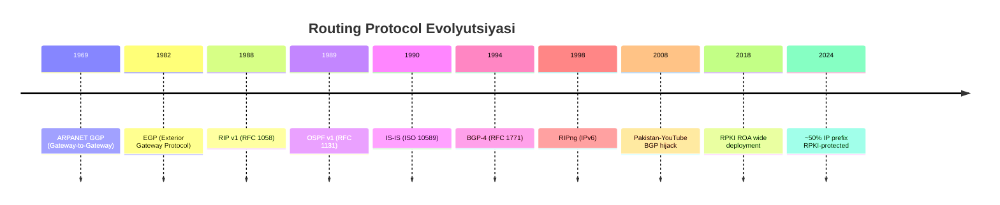
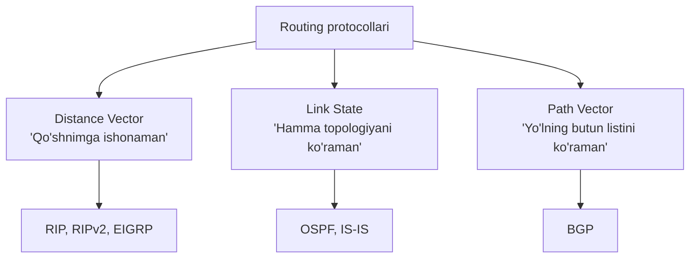
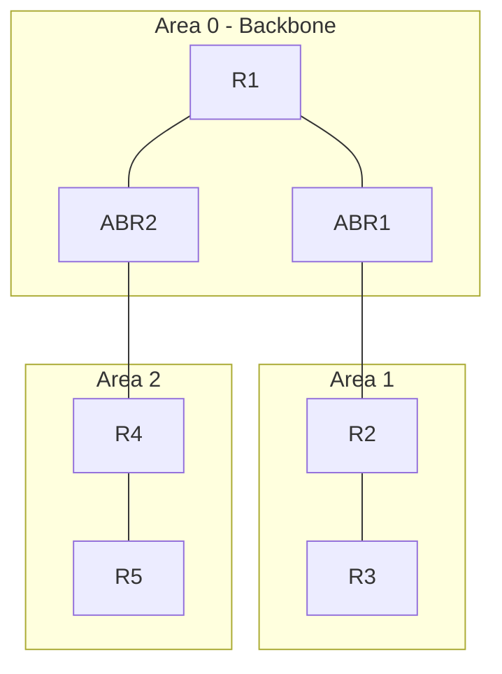
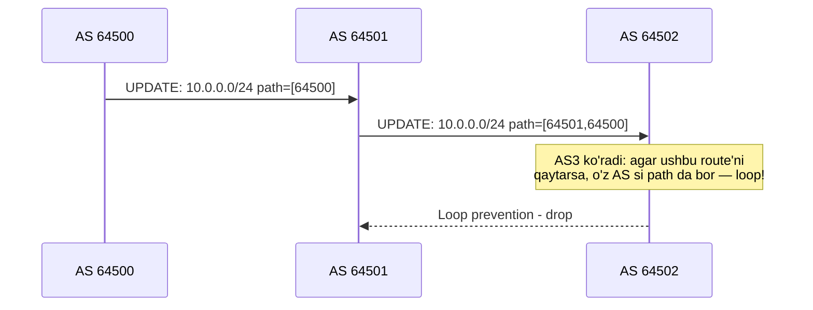

# Routing Protocols: RIP, OSPF, EIGRP, BGP

## 1. Nima uchun bu muhim?

Internet — bu ~75,000 dan ortiq Autonomous System (AS)'ning bir-biri bilan dynamic ravishda gaplashadigan network. Har router boshqa router'larga "Men bu network'ni bilaman, men orqali yuborsang yetib boradi" deb e'lon qiladi. Bu xabar almashish — **routing protocol**.

Routing protokollarini bilmasdan: katta enterprise network qura olmaysiz, datacenter network'da troubleshoot qila olmaysiz, BGP hijack nima ekanligini tushunmaysiz, Internet xaritasini tasavvur qila olmaysiz.

2024-yildagi Cloudflare 1.1.1.1 incident, 2008-yilgi Pakistan Telecom YouTube hijack, 2021-yilgi Facebook 6 soatlik off-line — barchasi BGP misconfiguration. Routing — Internet'ning eng "trust-based" qismi.

## 2. Tarix va evolyutsiya



## 3. Asosiy mexanizm

### Static vs Dynamic routing

**Static** — admin qo'lda yozadi. Kichik network, predictable. Topology o'zgarsa, qo'lda yangilash kerak.

**Dynamic** — protocol avtomatik o'rganadi va adapt qiladi.

### Distance Vector vs Link State vs Path Vector



**Distance Vector:** Router faqat o'z qo'shnilariga "Men shu network ga shu masofada (hop count, metric)" deydi. Sodda, lekin **count-to-infinity** muammosi bor.

**Link State:** Har router butun topologiyani biladi (LSDB — Link State Database). Dijkstra algoritmi bilan eng qisqa yo'l hisoblanadi.

**Path Vector:** BGP — har route uchun butun AS_PATH ko'rinadi. Bu loop'ni oldini oladi va policy decisions imkonini beradi.

### IGP vs EGP

- **IGP (Interior Gateway Protocol):** AS ichida — RIP, OSPF, EIGRP, IS-IS
- **EGP (Exterior Gateway Protocol):** AS lar orasida — BGP

### RIP (Routing Information Protocol)

- RFC 2453 (RIPv2), RFC 2080 (RIPng)
- Distance Vector
- Metric: **hop count**, max 15 (16 = unreachable)
- Update har 30 soniya (full table)
- Port: UDP 520

**Count-to-infinity:** Agar A-B link uzilsa, B "Men A ga 2 hop orqali" deyishi mumkin (C orqali). C "Men A ga 3 hop" deydi va boshqa qaytib aylanadi. Yechimlar: split horizon, poison reverse, hold-down timer.

### OSPF (Open Shortest Path First)

- RFC 2328 (v2 IPv4), RFC 5340 (v3 IPv6)
- Link State, Dijkstra (SPF)
- Areas — scalability uchun (Area 0 backbone majburiy)
- LSA (Link State Advertisement) types: Type 1 (Router), Type 2 (Network), Type 3 (Summary), Type 5 (External), Type 7 (NSSA)
- DR/BDR — broadcast network'da designated router (LSA flooding'ni optimallashtirish)
- ECMP — Equal Cost Multi-Path
- Protocol number: 89 (IP), no TCP/UDP




### EIGRP (Cisco proprietary, endi RFC 7868)

- Hybrid (advanced distance vector)
- DUAL (Diffusing Update Algorithm) — loop-free
- Composite metric: bandwidth, delay, reliability, load
- Tezroq convergence (OSPF dan), lekin asosan Cisco-only
- AS bo'yicha ishlaydi

### BGP (Border Gateway Protocol)

- RFC 4271 (BGP-4)
- Path Vector
- TCP port 179
- **eBGP** — turli AS lar orasida (default TTL=1, multihop bo'lmasa qo'shni)
- **iBGP** — bitta AS ichida (full mesh yoki Route Reflector)

**BGP attributes (path selection order):**
1. **LOCAL_PREF** — yuqori afzal (faqat iBGP)
2. **AS_PATH** — qisqaroq afzal
3. **ORIGIN** — IGP > EGP > Incomplete
4. **MED** — past afzal (eBGP qo'shnilarga "preference")
5. **NEXT_HOP** — yetib bo'ladigan
6. **eBGP > iBGP**
7. **IGP metric** to NEXT_HOP
8. **Router ID** — eng past



### IS-IS (Intermediate System to Intermediate System)

- ISO 10589
- Link State (OSPF ga o'xshash)
- Service provider sektorida hukmron — ko'p ISP backbone IS-IS ishlatadi
- TLV (Type-Length-Value) kengaytiriluvchanligi yaxshi
- IPv6 ni native qo'llab-quvvatlaydi (multi-topology)

## 4. Wire format / packet structure

### BGP UPDATE message

```
 0                   1                   2                   3
 0 1 2 3 4 5 6 7 8 9 0 1 2 3 4 5 6 7 8 9 0 1 2 3 4 5 6 7 8 9 0 1
+-+-+-+-+-+-+-+-+-+-+-+-+-+-+-+-+-+-+-+-+-+-+-+-+-+-+-+-+-+-+-+-+
|                                                               |
+                          Marker (16 bytes)                    +
+-+-+-+-+-+-+-+-+-+-+-+-+-+-+-+-+-+-+-+-+-+-+-+-+-+-+-+-+-+-+-+-+
|          Length               |    Type=2(UPDATE)             |
+-+-+-+-+-+-+-+-+-+-+-+-+-+-+-+-+-+-+-+-+-+-+-+-+-+-+-+-+-+-+-+-+
|   Withdrawn Routes Length     |
+-------------------------------+
|       Withdrawn Routes (variable)                            ...
+-------------------------------+
|   Total Path Attribute Length |
+-------------------------------+
|       Path Attributes (variable)                             ...
+-------------------------------+
|       Network Layer Reachability Information (NLRI)          ...
+---------------------------------------------------------------+
```

### OSPF Hello packet

```
+----------------+----------------+----------------+
| Version=2      | Type=1(Hello)  | Packet Length  |
+----------------+----------------+----------------+
|              Router ID                           |
+--------------------------------------------------+
|              Area ID                             |
+--------------------------------------------------+
| Checksum       | AuType         | Auth (8 bytes) |
+----------------+----------------+----------------+
| Network Mask                                     |
+--------------------------------------------------+
| HelloInterval  | Options | Rtr Pri | RouterDeadInterval |
+----------------+--------------------------------+
| Designated Router                                |
+--------------------------------------------------+
| Backup Designated Router                         |
+--------------------------------------------------+
| Neighbor IP addresses ...                        |
+--------------------------------------------------+
```

## 5. Real misol — capture / output

### Linux routing table

```bash
$ ip route show
default via 192.168.1.1 dev wlan0 proto dhcp metric 600
10.0.0.0/24 via 192.168.1.1 dev wlan0 proto static
192.168.1.0/24 dev wlan0 proto kernel scope link src 192.168.1.5

# FIB (Forwarding Information Base) ko'rish
$ ip -d route show table all
```

### FRRouting (vtysh) — open source BGP/OSPF

```bash
$ sudo vtysh
router# show ip bgp summary
BGP router identifier 192.168.1.1, local AS number 64500
Neighbor        V   AS   MsgRcvd  MsgSent   State/PfxRcd
10.0.0.2        4 64501    1234     5678   1234

router# show ip bgp 10.0.0.0/24
BGP routing table entry for 10.0.0.0/24
Paths: (2 available, best #1)
  AS path: 64501 64502
  Origin IGP, localpref 100, valid, external, best
  Last update: Mon May 5 12:00:00 2026

router# show ip ospf neighbor
Neighbor ID  Pri  State    Dead Time  Address      Interface
10.0.0.2      1   Full/DR  00:00:35   192.168.1.2  eth0
```

### BGP looking glass

`https://lg.ring.nlnog.net/` — har AS dan real-time BGP routes ko'rish.

```
> show route 8.8.8.8
Route 8.8.8.8/32 via AS15169 (Google)
AS_PATH: 1299 15169
NEXT_HOP: 213.248.99.18
ORIGIN: IGP
COMMUNITY: 1299:30000
```

### Traceroute with AS resolution

```bash
$ traceroute --as-resolve 8.8.8.8
 1  192.168.1.1 [AS???]              1.123 ms
 2  10.0.0.1 [AS12345]               5.678 ms  ISP first hop
 3  185.0.0.1 [AS3257]               8.901 ms  GTT
 4  72.14.211.1 [AS15169]            12.345 ms  Google
 5  8.8.8.8 [AS15169]                15.678 ms
```

## 6. Edge cases va anomaliyalar

### BGP route leaks va hijacks (real incidentlar)

**2008 — Pakistan-YouTube:** Pakistan Telecom YouTube'ni mamlakat ichida bloklash uchun more-specific prefix (/24 vs /22) e'lon qildi. Lekin upstream provider (PCCW) buni tashqariga ham yubordi. Natija: butun dunyo YouTube traffic'ini Pakistan'ga yo'naltirdi. 2 soat YouTube off-line.


**2018 — Amazon Route 53 hijack:** eNet hacker'lar BGP hijack qilib, Amazon Route 53 IP'lariga DNS spoofing qilib MyEtherWallet credentials o'g'irladi. ~$150K Ethereum o'g'irlandi.

**2024-iyun — Cloudflare 1.1.1.1:** Brazil ISP AS267613 1.1.1.1/32 ni e'lon qildi. Boshqa AS /24 leak qildi. Global DNS resolution qisqa muddat ishlamadi.

**2025-aprel — Stealth hijack:** AS17894 203.127.225.0/24 ni mis-announce qildi (legit AS3758 ning /16). RPKI ROA bo'lsa-da, ba'zi non-validating AS lar orqali traffic divert bo'ldi.

### RPKI (Resource Public Key Infrastructure)

- ROA (Route Origin Authorization) — sertifikat: "Bu prefix faqat AS X tomonidan e'lon qilinishi mumkin"
- 2024-yilda ~50% global IP prefix RPKI bilan himoyalangan
- Tier-1 transit providerlarning hammasi (Comcast 2024-da qo'shildi) RPKI invalid route'larni reject qiladi
- Lekin ROV (Route Origin Validation) hamma joyda yoqilmagan

### OSPF flapping va instability

LSA flooding storm — agar link tez-tez up/down bo'lsa (route flap), butun area buzulishi mumkin. Hold-down timer va route dampening yordam beradi.

### Black hole routing

`null route` — packet yo'q qilinadi:
```bash
ip route add 192.0.2.0/24 blackhole
```
DDoS hujumlarda useful — attacker IP'ga "yo'q joy" yaratish.

## 7. Performance va optimizatsiya

| Protocol | Convergence Time | Memory | CPU | Use Case |
|----------|-----------------|--------|-----|----------|
| RIP | 2-3 daqiqa | Past | Past | Lab, kichik network |
| OSPF | 1-10 soniya | O'rta | O'rta | Enterprise |
| EIGRP | <1 soniya | O'rta | Past | Cisco network |
| IS-IS | 1-10 soniya | O'rta | O'rta | ISP backbone |
| BGP | Daqiqalar (full table 1M+ route) | Yuqori (~3GB) | Yuqori | Internet |

**BGP convergence:** Full Internet table ~1M IPv4 route + 200K IPv6 route. Yangi peer'ga to'liq yuborish 5-30 daqiqa.

**ECMP (Equal Cost Multi-Path):** OSPF/BGP teng metrik bo'lganda traffic ni hash-based bir nechta link orasida split qiladi. Datacenter spine-leaf da kritik.


**BFD (Bidirectional Forwarding Detection):** ms-darajadagi failure detection. OSPF default 40 soniya dead-timer'dan ko'p tezroq.

## 8. Security ko'rinishi

**Plaintext authentication ham yo'q.** RIPv1 — hech qanday auth. RIPv2/OSPF — MD5 (zaif). BGP — TCP MD5 (zaif), endi TCP-AO (RFC 5925).

**RPKI** — hozirgi eng yaxshi BGP origin validation. Lekin path validation (BGPsec) deploy qilinmagan.

**MANRS (Mutually Agreed Norms for Routing Security):** ISP'lar uchun best-practice rules.

**IPv6 routing security:** SEND (Secure Neighbor Discovery), RA Guard, DHCPv6 Snooping.

## 9. Troubleshooting

```bash
# Default gateway bormi?
ip route | grep default

# Specific destination uchun route
ip route get 8.8.8.8
# 8.8.8.8 via 192.168.1.1 dev wlan0 src 192.168.1.5

# ARP/neighbor
ip neigh show
arp -a

# Kernel routing table monitoring
ip monitor route

# OSPF/BGP holati (FRR)
sudo vtysh -c "show ip ospf neighbor"
sudo vtysh -c "show bgp summary"

# Traceroute
traceroute -n 8.8.8.8
mtr 8.8.8.8  # continuous

# BGP neighbor debug
sudo vtysh -c "show ip bgp neighbor 10.0.0.2"
```

Klassik muammo: "Internet ishlamayapti."
1. `ip route` — default gateway bormi?
2. `ping 8.8.8.8` — IP works?
3. `ping google.com` — DNS works?
4. `traceroute 8.8.8.8` — qaerda to'xtaydi?
5. ISP tomondan BGP issue ehtimoli (BGPlay, looking glass).

## 10. Go tilida implementatsiya

`gobgp` — eng mashhur Go BGP implementation (open-source, Yandex va boshqalar production'da ishlatadi).

```go
package main

import (
    "context"
    "fmt"
    api "github.com/osrg/gobgp/v3/api"
    "github.com/osrg/gobgp/v3/pkg/server"
)

// Oddiy BGP speaker
func main() {
    s := server.NewBgpServer()
    go s.Serve()

    // BGP global config
    err := s.StartBgp(context.Background(), &api.StartBgpRequest{
        Global: &api.Global{
            Asn:        64500,
            RouterId:   "192.168.1.1",
            ListenPort: 179,
        },
    })
    if err != nil {
        panic(err)
    }

    // Peer qo'shish
    n := &api.Peer{
        Conf: &api.PeerConf{
            NeighborAddress: "10.0.0.2",
            PeerAsn:         64501,
        },
    }
    err = s.AddPeer(context.Background(), &api.AddPeerRequest{Peer: n})
    if err != nil {
        panic(err)
    }

    // Yangi prefix e'lon qilish
    nlri, _ := api.NewIPAddressPrefix(24, "10.0.0.0").Marshal()
    attrs, _ := api.NewOriginAttribute(0).Marshal() // IGP
    nextHop, _ := api.NewNextHopAttribute("192.168.1.1").Marshal()

    _, err = s.AddPath(context.Background(), &api.AddPathRequest{
        Path: &api.Path{
            Family: &api.Family{Afi: api.Family_AFI_IP, Safi: api.Family_SAFI_UNICAST},
            Nlri:   nlri,
            Pattrs: []*anypb.Any{attrs, nextHop},
        },
    })

    fmt.Println("BGP speaker ishga tushdi, AS 64500")
    select {} // forever
}
```

Routing table simulation:

```go
type RouteEntry struct {
    Prefix   netip.Prefix
    NextHop  netip.Addr
    Metric   int
    AS_Path  []uint32 // BGP uchun
}

type RoutingTable struct {
    routes []RouteEntry
}

// Longest prefix match — FIB ning asosiy operatsiyasi
func (rt *RoutingTable) Lookup(addr netip.Addr) *RouteEntry {
    var best *RouteEntry
    bestLen := -1
    for i, r := range rt.routes {
        if r.Prefix.Contains(addr) && r.Prefix.Bits() > bestLen {
            best = &rt.routes[i]
            bestLen = r.Prefix.Bits()
        }
    }
    return best
}
```

## 11. FAQ

**S: Nega Internet BGP ishlatadi va OSPF emas?**
**J:** OSPF link-state — har router butun topologiyani biladi. Internet'ning 75K AS bilan bu mumkin emas (memory, CPU, security). BGP path-vector — har AS faqat o'z policy va qo'shnilarni biladi.

**S: iBGP nega full mesh kerak?**
**J:** iBGP loop prevention sodda — iBGP'dan o'rganilgan route'ni boshqa iBGP peer'ga uzatmaydi. Demak, har router boshqa har birini bevosita ko'rishi kerak. N(N-1)/2 connection. Yechim: Route Reflector (RR) yoki Confederation.

**S: OSPF Area 0 nega backbone?**
**J:** Boshqa area lar Area 0 dan o'tib gaplashishi kerak — bu loop-free guarantee beradi. Inter-area route faqat Area 0 orqali.

**S: BGP MED qachon ishlaydi?**
**J:** Faqat bir xil neighbor AS dan kelgan route'larni solishtirganda. Ko'p AS bilan har xil route bor bo'lsa, MED ahamiyatsiz.

**S: RIP hali ishlatiladimi?**
**J:** Production'da deyarli yo'q. Lab va legacy systemlarda. OSPF/EIGRP barcha use case'da yaxshiroq.

**S: ECMP qanday ishlaydi?**
**J:** Bir xil prefix uchun bir nechta NEXT_HOP bo'lsa, kernel hash(src_ip, dst_ip, src_port, dst_port) bilan packet'larni split qiladi. Bir flow doim bir yo'lda — packet reorder bo'lmasligi uchun.


**S: BGP hijack'dan qanday himoyalanish kerak?**
**J:** (1) RPKI ROA o'rnating (sizning prefix'laringiz uchun). (2) ROV ni yoqing (peer'lardan invalid route'larni reject qiling). (3) IRR (RADB, RIPE) prefix list. (4) Monitoring — BGPmon, Cloudflare Radar.

**S: Software-Defined Networking (SDN) routing protokollarni o'ldirdimi?**
**J:** Yo'q. Datacenter ichida ba'zan ha (BGP-EVPN). Lekin Internet va WAN'da BGP/OSPF hukmron. SDN ko'pincha ulardan tepada qatlam (controller).

## 12. Cross-references

- Network Layer: [03-network.md](../osi/03-network.md)
- Tegishli deep-dive: [Subnetting/CIDR](./subnetting-cidr.md), [NAT and Firewall](./nat-and-firewall.md)
- TCP/IP Internet layer: [02-internet.md](../tcp-ip/02-internet.md)
- Glossary: [Glossary](../00-foundations/glossary.md)

## 13. Manbalar

- **RFC 2453** — RIPv2
- **RFC 2328** — OSPFv2
- **RFC 5340** — OSPFv3 (IPv6)
- **RFC 4271** — BGP-4
- **RFC 7868** — EIGRP
- **RFC 6480** — RPKI
- **RFC 6811** — BGP Origin Validation (ROV)
- **RFC 5925** — TCP-AO
- [Cloudflare 1.1.1.1 incident — June 2024](https://blog.cloudflare.com/cloudflare-1111-incident-on-june-27-2024/)
- [APNIC — Stealthy BGP hijacking 2025](https://blog.apnic.net/2025/10/16/understanding-stealthy-bgp-hijacking-risk-in-the-rov-era/)
- [Comcast RPKI deployment 2024](https://www.bleepingcomputer.com/news/security/comcast-now-blocks-bgp-hijacking-attacks-and-route-leaks-with-rpki/)
- [BGP Hijacking — Wikipedia](https://en.wikipedia.org/wiki/BGP_hijacking)
- [FRRouting docs](https://docs.frrouting.org/)
- [GoBGP](https://github.com/osrg/gobgp)
- Kurose & Ross, Bob 5 (Network Layer Control Plane)
