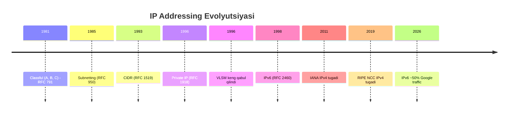
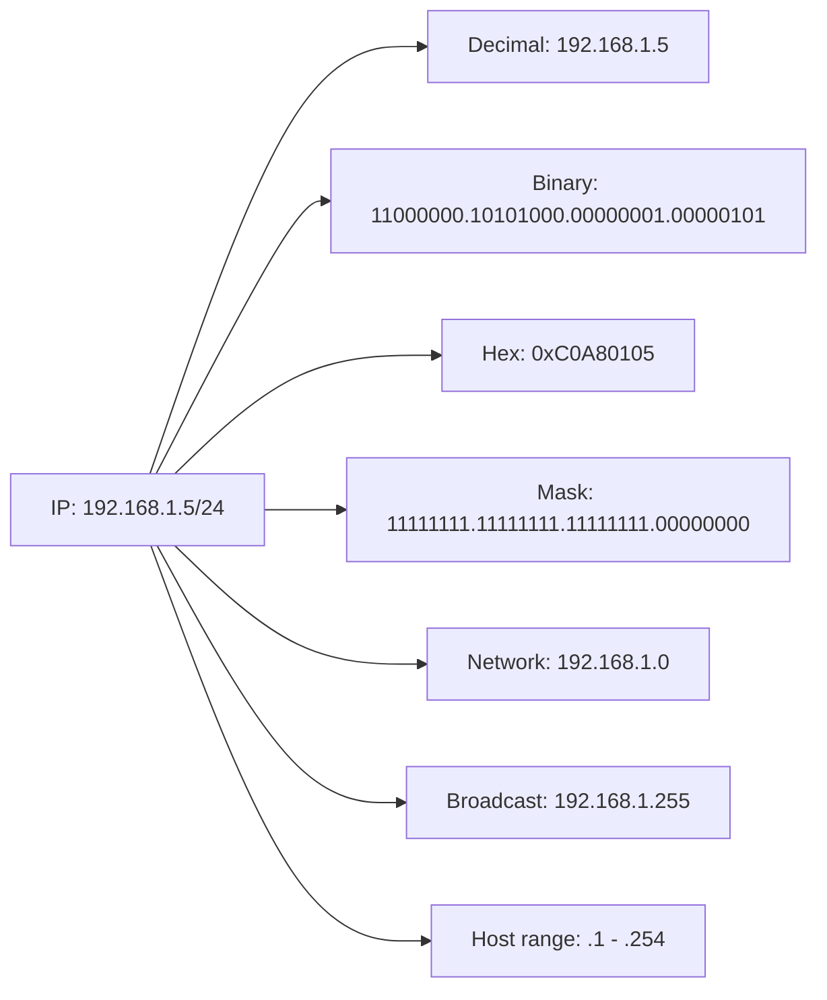

# Subnetting va CIDR: IPv4 Addressing Chuqur Tahlil

## 1. Nima uchun bu muhim?

IP address — Internet'da har qurilmaning manzili. Lekin xom IP address yetmaydi — biz ularni guruhlashtirib **subnet** lar yaratamiz. Bu:
- Routing table'ni kichraytirish (1M IP o'rniga 1 ta /16 prefix)
- Broadcast domain'ni cheklash
- Security boundary yaratish (DMZ, internal, guest)
- IP address'ni efficient ishlatish (VLSM)


Har bir junior engineer interview'da "192.168.1.0/24 ni 4 subnet'ga bo'l" topshirig'i bor. Senior engineer esa /etc/hosts.deny dan tortib K8s Pod CIDR loyihasigacha bu ko'nikmadan foydalanadi.

CIDR (Classless Inter-Domain Routing) 1993-yilda joriy etildi va IPv4 ning umrini 30 yilga uzaytirdi.

## 2. Tarix va evolyutsiya



**Classful (1981):** Address birinchi bit'lariga qarab class'ga bo'lingan:
- Class A: 0xxx... — `0.0.0.0` dan `127.255.255.255` (/8 mask, 16M host)
- Class B: 10xx... — `128.0.0.0` dan `191.255.255.255` (/16 mask, 65K host)
- Class C: 110x... — `192.0.0.0` dan `223.255.255.255` (/24 mask, 256 host)
- Class D: 1110... — Multicast (`224.0.0.0` — `239.255.255.255`)
- Class E: 1111... — Reserved

Muammo: Class B juda katta (65K host kerakmas), Class C juda kichik (256 yetmaydi). Wasted IP.

**CIDR (1993, RFC 1519, hozirgi RFC 4632):** Class chegaralarini olib tashladi. Endi `/8` dan `/30` gacha istalgan prefix length.

## 3. Asosiy mexanizm

### CIDR notation

```
192.168.1.0/24
└─────┬─────┘└─┘
   network    prefix length (network bits)
```

`/24` — birinchi 24 bit network, qolgan 8 bit host. Demak 256 ta address (254 ta usable host, 1 network, 1 broadcast).

### Subnet mask binary representation

```
/24 = 255.255.255.0
    = 11111111.11111111.11111111.00000000
       └────────── 24 bit ────────┘└─8 bit─┘
       network                      host

/16 = 255.255.0.0
    = 11111111.11111111.00000000.00000000

/30 = 255.255.255.252
    = 11111111.11111111.11111111.11111100
```

```mermaid
flowchart LR
    A[32-bit IP<br/>11000000.10101000.00000001.00000101] --> B[Network bits<br/>11000000.10101000.00000001]
    A --> C[Host bits<br/>00000101]
    B --> D[/24 mask<br/>192.168.1.0]
    C --> E[Host #5]
```

### VLSM (Variable Length Subnet Masking)

Klassik subnet — hamma subnet bir xil o'lcham. VLSM esa har subnet'ga turli o'lcham. Bu real loyihalar uchun zarur.

Misol: `10.0.0.0/16` ni quyidagi talab bo'yicha bo'lish:
- 1000 host (Office)
- 500 host (Datacenter)
- 100 host (Guest WiFi)
- 2 host (Point-to-point WAN link)

Yechim:
- Office: `/22` (1022 host) → `10.0.0.0/22`
- Datacenter: `/23` (510 host) → `10.0.4.0/23`
- Guest: `/25` (126 host) → `10.0.6.0/25`
- WAN: `/30` (2 host) → `10.0.6.128/30`

### Step-by-step subnetting (interview question favoriti)

**Misol 1:** `192.168.1.0/24` ni 4 ta subnet'ga bo'l.

1. 4 subnet uchun 2 bit kerak (2² = 4). Demak yangi mask `/24+2 = /26`.
2. `/26` = `255.255.255.192` (binary: `...11000000`)
3. Block size = 256 - 192 = 64
4. Subnetlar:
   - `192.168.1.0/26` — host range `192.168.1.1 - 192.168.1.62`, broadcast `.63`
   - `192.168.1.64/26` — host `.65 - .126`, broadcast `.127`
   - `192.168.1.128/26` — host `.129 - .190`, broadcast `.191`
   - `192.168.1.192/26` — host `.193 - .254`, broadcast `.255`

**Misol 2:** `10.0.0.0/16` ni 4 subnet → `/18` mask.
- Block size = 256 - 192 = 64 (3-octet'da)
- `10.0.0.0/18` — host range `10.0.0.1 - 10.0.63.254`, broadcast `10.0.63.255`
- `10.0.64.0/18` — `10.0.64.1 - 10.0.127.254`
- `10.0.128.0/18` — `10.0.128.1 - 10.0.191.254`
- `10.0.192.0/18` — `10.0.192.1 - 10.0.255.254`

### Power of 2 jadvali

| Bits | 2^n | Hosts (2^n - 2) |
|------|-----|-----------------|
| 1 | 2 | 0 |
| 2 | 4 | 2 |
| 3 | 8 | 6 |
| 4 | 16 | 14 |
| 5 | 32 | 30 |
| 6 | 64 | 62 |
| 7 | 128 | 126 |
| 8 | 256 | 254 |
| 9 | 512 | 510 |
| 10 | 1024 | 1022 |
| 16 | 65536 | 65534 |
| 24 | 16,777,216 | 16,777,214 |

Eslatma: Network address (host = all 0) va broadcast (host = all 1) ishlatilmaydi. /31 va /32 — istisnolar.

### Network address va broadcast

- **Network address:** Host bit'lar = 0. Subnetning identifikatori. `192.168.1.0/24`.
- **Broadcast address:** Host bit'lar = 1. Subnetdagi hammaga packet. `192.168.1.255/24`.
- **First usable host:** Network + 1.
- **Last usable host:** Broadcast - 1.
- **/31 va /32 special:** RFC 3021 — point-to-point link uchun /31 (2 ta IP, ikkalasi ham host). /32 — bitta host (loopback).

## 4. Wire format / packet structure

IPv4 header'da source va destination IP — 32 bit har biri:

```
 0                   1                   2                   3
 0 1 2 3 4 5 6 7 8 9 0 1 2 3 4 5 6 7 8 9 0 1 2 3 4 5 6 7 8 9 0 1
+-+-+-+-+-+-+-+-+-+-+-+-+-+-+-+-+-+-+-+-+-+-+-+-+-+-+-+-+-+-+-+-+
|Version|  IHL  |Type of Service|          Total Length         |
+-+-+-+-+-+-+-+-+-+-+-+-+-+-+-+-+-+-+-+-+-+-+-+-+-+-+-+-+-+-+-+-+
|         Identification        |Flags|      Fragment Offset    |
+-+-+-+-+-+-+-+-+-+-+-+-+-+-+-+-+-+-+-+-+-+-+-+-+-+-+-+-+-+-+-+-+
|  Time to Live |    Protocol   |         Header Checksum       |
+-+-+-+-+-+-+-+-+-+-+-+-+-+-+-+-+-+-+-+-+-+-+-+-+-+-+-+-+-+-+-+-+
|                       Source Address                          |
+-+-+-+-+-+-+-+-+-+-+-+-+-+-+-+-+-+-+-+-+-+-+-+-+-+-+-+-+-+-+-+-+
|                    Destination Address                        |
+-+-+-+-+-+-+-+-+-+-+-+-+-+-+-+-+-+-+-+-+-+-+-+-+-+-+-+-+-+-+-+-+
```

Subnet mask packet ichida bo'lmaydi — u routerlarning routing table'sida saqlanadi.

### Bit-level breakdown



## 5. Real misol — capture / output

### ipcalc

```bash
$ ipcalc 192.168.1.0/26
Address:   192.168.1.0          11000000.10101000.00000001.00 000000
Netmask:   255.255.255.192 = 26 11111111.11111111.11111111.11 000000
Wildcard:  0.0.0.63             00000000.00000000.00000000.00 111111
=>
Network:   192.168.1.0/26       11000000.10101000.00000001.00 000000
HostMin:   192.168.1.1          11000000.10101000.00000001.00 000001
HostMax:   192.168.1.62         11000000.10101000.00000001.00 111110
Broadcast: 192.168.1.63         11000000.10101000.00000001.00 111111
Hosts/Net: 62                   Class C, Private Internet
```

### sipcalc

```bash
$ sipcalc 10.0.0.0/16
-[ipv4 : 10.0.0.0/16] - 0
[CIDR]
Host address    - 10.0.0.0
Host address (decimal) - 167772160
Host address (hex) - A000000
Network address - 10.0.0.0
Network mask    - 255.255.0.0
Network mask (bits) - 16
Broadcast address - 10.0.255.255
Cisco wildcard  - 0.0.255.255
Addresses in network - 65536
Network range   - 10.0.0.0 - 10.0.255.255
Usable range    - 10.0.0.1 - 10.0.255.254
```

### Python `ipaddress` module

```python
import ipaddress

net = ipaddress.ip_network('192.168.1.0/24')
print(net.network_address)    # 192.168.1.0
print(net.broadcast_address)  # 192.168.1.255
print(net.num_addresses)       # 256
print(list(net.hosts())[:5])  # [.1, .2, .3, .4, .5]

# /24 ni /26 ga bo'lish
for sub in net.subnets(prefixlen_diff=2):
    print(sub)
# 192.168.1.0/26
# 192.168.1.64/26
# 192.168.1.128/26
# 192.168.1.192/26

# Tegishli IP qaysi subnet?
ip = ipaddress.ip_address('192.168.1.100')
print(ip in net)  # True
```

### Linux komandalar

```bash
$ ip -4 addr show
2: eth0: <BROADCAST,MULTICAST,UP,LOWER_UP> mtu 1500
    inet 192.168.1.5/24 brd 192.168.1.255 scope global eth0

$ ip route
192.168.1.0/24 dev eth0 proto kernel scope link src 192.168.1.5
default via 192.168.1.1 dev eth0
```

## 6. Edge cases va anomaliyalar

### Private IP ranges (RFC 1918)

- `10.0.0.0/8` — 16M host (Class A)
- `172.16.0.0/12` — 1M host (Class B)
- `192.168.0.0/16` — 65K host (Class C)

Bu IP'lar Internet'da route qilinmaydi — faqat ichki tarmoqda. NAT majburiy.

### Special-purpose addresses

| Range | Vazifa | RFC |
|-------|--------|-----|
| `127.0.0.0/8` | Loopback | RFC 1122 |
| `169.254.0.0/16` | Link-local (DHCP fail bo'lganda) | RFC 3927 |
| `224.0.0.0/4` | Multicast | RFC 5771 |
| `240.0.0.0/4` | Reserved (Class E) | RFC 1112 |
| `100.64.0.0/10` | CGNAT shared space | RFC 6598 |
| `198.18.0.0/15` | Benchmark testing | RFC 2544 |
| `192.0.2.0/24` | Documentation (TEST-NET-1) | RFC 5737 |
| `198.51.100.0/24` | TEST-NET-2 | RFC 5737 |
| `203.0.113.0/24` | TEST-NET-3 | RFC 5737 |

### IPv6 subnetting (qisqacha)

IPv6 da `/64` standart host subnet (SLAAC ishlashi uchun). `/56` yoki `/48` — site allocation. `/127` — point-to-point.

```
2001:db8::/32       ─ documentation
2001:db8:1::/48     ─ company allocation
2001:db8:1:1::/64   ─ subnet (SLAAC capable)
```

IPv6 da broadcast yo'q — multicast (`ff02::1` all-nodes) bilan almashtirildi.

### /31 mavjudligi

RFC 3021 (2000): point-to-point linklarda /31 ishlatish mumkin. Ikkala address ham host (network/broadcast yo'q). Bu IP saqlaydi — har link'da 2 IP yetadi.

### Supernetting

CIDR'ning teskarisi — bir nechta kichikroq subnet'ni katta prefix ostida birlashtirish. ISP route aggregation uchun ishlatadi:

```
10.0.0.0/24
10.0.1.0/24
10.0.2.0/24
10.0.3.0/24
─────────────
Aggregate: 10.0.0.0/22 (kichikroq routing table)
```

## 7. Performance va optimizatsiya

**FIB lookup tezligi:** Modern router 100M+ packet/sec qila oladi. Trie data structure (radix tree) longest prefix match uchun ishlatiladi.


**Routing table size:** Internet full table ~1M IPv4 prefix + 200K IPv6. Aggregation muhim — ISP'lar `/24` dan kichik prefixlarni accept qilmasligi mumkin (de-aggregation).

**Subnet planning best practices:**
- Hamma vaqt 2x growth uchun joy qoldiring
- Bir xil function uchun bir xil pattern (masalan, /24 har VLAN)
- Documentation muhim — IPAM (NetBox, phpIPAM)

## 8. Security ko'rinishi

**Subnet boundary = security boundary:** DMZ, internal, guest — har biri alohida subnet va firewall rule.

**IP spoofing:** Source IP soxtalashtirish. BCP38 (RFC 2827) — ISP'lar o'z customer'lariga tegishli bo'lmagan source IP'larni o'tkazmasligi kerak.


**Bogon IP filtering:** Hech kimga ajratilmagan yoki private IP'lar Internet'da ko'rinishi shubhali. Team Cymru bogon list.

**RFC 1918 exposure:** Ko'p kompaniyalar `/etc/hosts` yoki Slack ichida private IP'larni ko'rsatadi — bu OPSEC issue, ichki topology haqida ma'lumot beradi.

## 9. Troubleshooting

```bash
# Mening IP va subnet'im
ip addr show
ifconfig

# Subnet bo'yicha boshqa hostlar (ARP)
ip neigh show
arp -a

# Subnet ichida ping sweep
nmap -sn 192.168.1.0/24

# To'g'ri subnet'damanmi?
ipcalc 192.168.1.5/24

# Default gateway tegishli subnet'damiku
ip route | grep default

# Conflict tekshirish
arping -D -I eth0 192.168.1.5
```

Klassik muammo: "DHCP IP berdi, lekin internet ishlamayapti."
1. Subnet mask to'g'rimi? (`/24` o'rniga `/16` bo'lsa muammo)
2. Default gateway shu subnet'damiku?
3. Subnet conflict bormi (statik IP bilan urishish)?

Klassik muammo: "Boshqa office bilan VPN bor, lekin gaplashmayapti."
- Ko'p hollarda ikkala office bir xil `192.168.1.0/24` ishlatadi — overlap. Yechim: bittasini boshqa subnet'ga ko'chirish yoki NAT.

## 10. Go tilida implementatsiya

Go 1.18+ da yangi `net/netip` package — `net.IP` dan tezroq va immutable.

```go
package main

import (
    "fmt"
    "net/netip"
)

func main() {
    // CIDR parse
    prefix, err := netip.ParsePrefix("192.168.1.0/24")
    if err != nil {
        panic(err)
    }

    fmt.Println("Network:", prefix.Masked()) // 192.168.1.0/24
    fmt.Println("Bits:", prefix.Bits())       // 24
    fmt.Println("Addr:", prefix.Addr())       // 192.168.1.0

    // IP qaysi subnet'da?
    ip := netip.MustParseAddr("192.168.1.100")
    fmt.Println("Contains:", prefix.Contains(ip)) // true

    // Boshqa subnet
    other := netip.MustParseAddr("10.0.0.5")
    fmt.Println("Contains:", prefix.Contains(other)) // false
}
```

Standart `net` package bilan:

```go
package main

import (
    "fmt"
    "net"
)

func main() {
    _, ipnet, err := net.ParseCIDR("192.168.1.0/24")
    if err != nil {
        panic(err)
    }

    fmt.Println("Network:", ipnet.IP)         // 192.168.1.0
    fmt.Println("Mask:", ipnet.Mask)           // ffffff00
    ones, bits := ipnet.Mask.Size()
    fmt.Printf("Prefix: /%d (out of %d)\n", ones, bits) // /24 out of 32

    // Range hisoblash
    ip := net.ParseIP("192.168.1.100")
    fmt.Println("In subnet:", ipnet.Contains(ip)) // true

    // Broadcast hisoblash
    broadcast := make(net.IP, len(ipnet.IP.To4()))
    for i := range ipnet.IP.To4() {
        broadcast[i] = ipnet.IP.To4()[i] | ^ipnet.Mask[i]
    }
    fmt.Println("Broadcast:", broadcast) // 192.168.1.255
}
```

VLSM subnet calculator:

```go
package main

import (
    "fmt"
    "net/netip"
)

// /24 ni /26 ga bo'lish — 4 ta subnet
func subnetSplit(prefix netip.Prefix, newBits int) []netip.Prefix {
    if newBits <= prefix.Bits() {
        return nil
    }
    delta := newBits - prefix.Bits()
    count := 1 << delta // 2^delta

    base := prefix.Addr().As4()
    blockSize := 1 << (32 - newBits)

    result := make([]netip.Prefix, 0, count)
    for i := 0; i < count; i++ {
        offset := uint32(i * blockSize)
        b := base
        b[2] += byte(offset >> 8)
        b[3] += byte(offset & 0xFF)
        addr := netip.AddrFrom4(b)
        result = append(result, netip.PrefixFrom(addr, newBits))
    }
    return result
}

func main() {
    prefix := netip.MustParsePrefix("192.168.1.0/24")
    subnets := subnetSplit(prefix, 26)
    for _, s := range subnets {
        fmt.Println(s)
    }
    // 192.168.1.0/26
    // 192.168.1.64/26
    // 192.168.1.128/26
    // 192.168.1.192/26
}
```

## 11. FAQ

**S: Nega /31 ham OK, /32 ham OK?**
**J:** /31 — point-to-point link uchun (2 IP, ikkalasi ham host). /32 — bitta IP (loopback yoki host route). Bu special case'lar — hostni network/broadcast deb hisoblash kerakmas.

**S: 192.168.0.0/16 va 192.168.1.0/24 — birinchi ikkinchini o'z ichiga oladimi?**
**J:** Ha. /16 katta prefix (ko'p host), /24 ichida. Routing'da longest prefix match — /24 yutadi specific destination uchun.

**S: 0.0.0.0/0 nima?**
**J:** Default route — "hamma narsa bu yerga". Routing table'da default gateway. Firewall rule'da "any source" yoki "any destination".

**S: Eng katta network qancha bo'la oladi?**
**J:** Texnik: /0 (4.3B IP). Amalda: ISP'lar /24 dan kichik prefix accept qilmaydi. Birovga /0 bering — bu Internet'ning hammasi.

**S: 169.254.x.x ko'rsam nima qilaman?**
**J:** APIPA — link-local. DHCP fail bo'lgan. Diagnostika: DHCP server tirikmi, kabel ulanganmi, mac filter yo'qmi?

**S: VLSM va FLSM farqi?**
**J:** FLSM — Fixed-Length: hamma subnet bir xil. VLSM — Variable: har subnet'ga turli o'lcham. VLSM IP'ni efficient ishlatadi.

**S: IPv6 da subnetting'ga zarurat bormi?**
**J:** Ha, lekin oddiy. /64 standart host subnet, /48 site allocation. /128 — bitta address. Calculation deyarli yo'q chunki har subnetda 2^64 IP bor.

**S: 0.0.0.0 va 255.255.255.255 nima farqi?**
**J:** `0.0.0.0` — "this host on this network" yoki default route. `255.255.255.255` — limited broadcast (faqat local subnet'da, routerdan o'tmaydi).

## 12. Cross-references

- Network Layer: [03-network.md](../osi/03-network.md)
- Tegishli deep-dive: [Routing Protocols](./routing-protocols.md), [NAT and Firewall](./nat-and-firewall.md)
- TCP/IP Internet layer: [02-internet.md](../tcp-ip/02-internet.md)
- Glossary: [Glossary](../00-foundations/glossary.md)

## 13. Manbalar

- **RFC 791** — IPv4
- **RFC 950** — Subnetting
- **RFC 1519** — CIDR (eski)
- **RFC 4632** — CIDR (current)
- **RFC 1918** — Private addresses
- **RFC 3021** — /31 prefix
- **RFC 3927** — Link-local (169.254.0.0/16)
- **RFC 5737** — Documentation prefixes
- **RFC 6598** — CGNAT
- **RFC 2827 / BCP 38** — Source address validation
- [IANA IPv4 Special-Purpose Registry](https://www.iana.org/assignments/iana-ipv4-special-registry/)
- [Subnet calculator](https://www.subnet-calculator.com/)
- [Cloudflare CIDR primer](https://www.cloudflare.com/learning/network-layer/what-is-cidr/)
- Kurose & Ross, Bob 4 (Network Layer), 4.3 IP addressing
