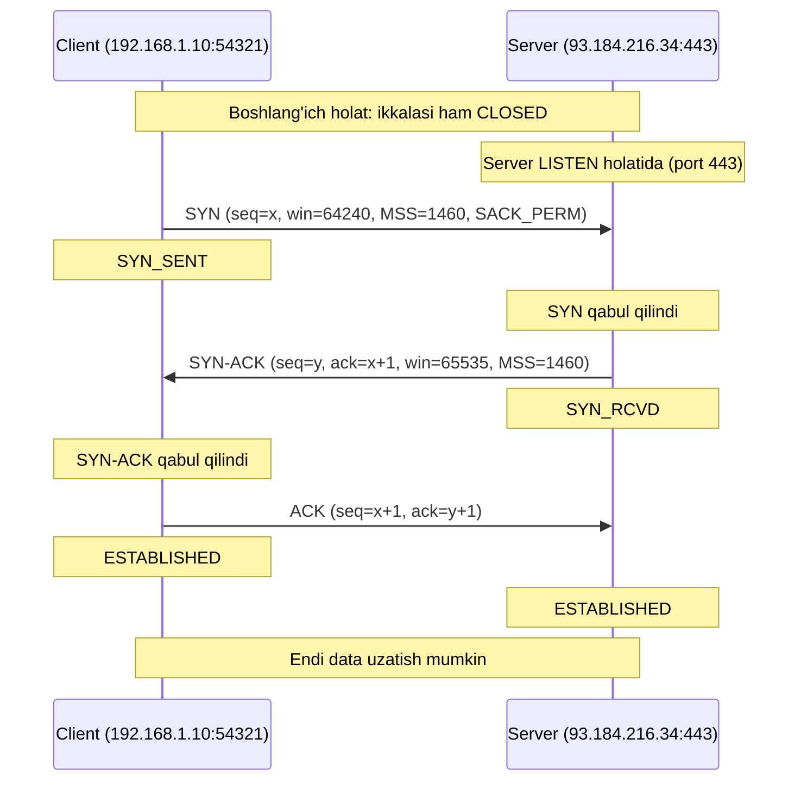
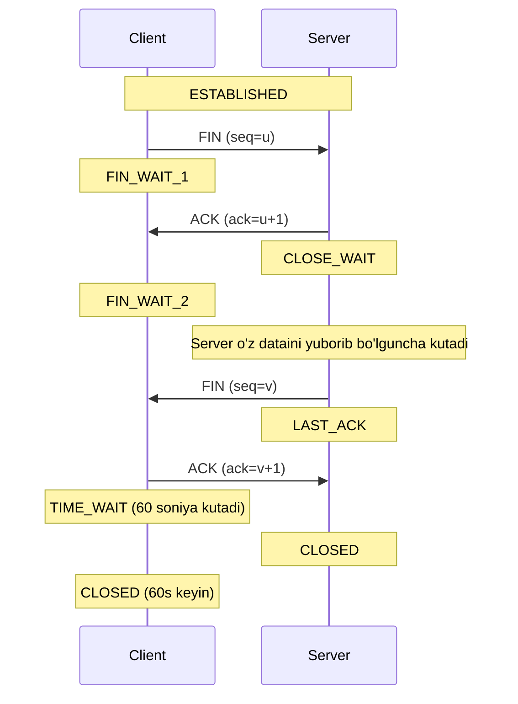
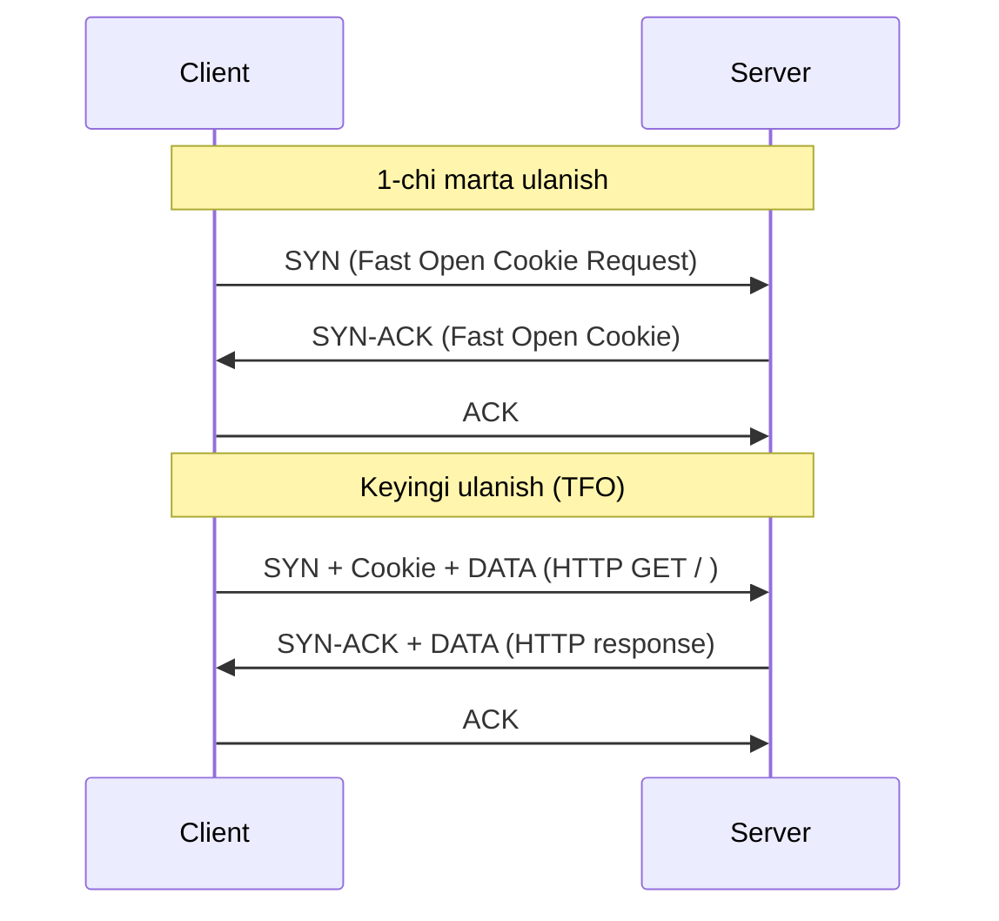

# TCP Handshake — Deep Dive

## 1. Nima uchun bu muhim?

TCP three-way handshake — bu Internet ning poydevor mexanizmlaridan biri. Har bir HTTP so'rov, har bir SSH session, har bir database connection — bularning hammasi TCP handshake bilan boshlanadi. Agar handshake muvaffaqiyatsiz bo'lsa, hech qanday application ishlamaydi.

**Interview-da nima uchun so'raladi?**

Senior Network/Backend engineerlar uchun bu mavzu deyarli har bir interview-da uchraydi. Sababi:

- **Tushuncha chuqurligini tekshiradi:** "TCP qanday ishlaydi?" degan savol oddiy, ammo "ISN qanday tanlanadi?" yoki "TIME_WAIT nima uchun 60 soniya?" — bu savollarga aniq javob bera oladigan kishi haqiqatan chuqur biladigan kishi.
- **Production muammolarini hal qilish:** `CLOSE_WAIT` connectionlar yoki `TIME_WAIT` exhaustion — real load balancer va backend serverlarda kunlik muammo.
- **Security:** SYN flooding hujumi, half-open connectionlar, port scanning — bularni tushunish uchun handshake ni bilish shart.
- **Performance:** TCP Fast Open, connection pooling, keep-alive — bularning hammasi handshake ning narxini kamaytirish uchun.

Go developer uchun esa `net.Dial("tcp", ...)` chaqirilganda nima sodir bo'lishini bilmaslik — bu xuddi avtomobilni haydab, dvigatel ishlash printsipini bilmaslik kabi.

## 2. Tarix va evolyutsiya

TCP — 1974 yilda Vinton Cerf va Robert Kahn tomonidan ishlab chiqilgan. **RFC 793** (1981) bu protokol ning birinchi formal standarti. O'shandan beri TCP juda kam o'zgardi — bu uning eng katta yutuqlaridan biri (stabillik), lekin ayni paytda eng katta cheklov ham (innovatsiya qiyinchiligi).

**Asosiy mileston-lar:**

- **RFC 793 (1981)** — TCP asosiy spetsifikatsiya, three-way handshake, sliding window
- **RFC 1122 (1989)** — Host Requirements, BSD socket API standartlashtirilgan
- **RFC 2018 (1996)** — SACK (Selective Acknowledgment)
- **RFC 5681 (2009)** — TCP Congestion Control (slow start, fast retransmit)
- **RFC 7413 (2014)** — TCP Fast Open (TFO) — handshake bilan birga data jo'natish
- **RFC 9293 (2022)** — TCP yangi konsolidatsiya qilingan spetsifikatsiya (RFC 793 ni eskirtirgan)

QUIC (HTTP/3) ning paydo bo'lishi TCP ning ba'zi cheklovlariga (head-of-line blocking, handshake latency) javob — lekin TCP hali ham Internet traffic'ning 80%+ ini tashkil qiladi.

## 3. Asosiy mexanizm — Three-Way Handshake (chuqur)

Three-way handshake — bu ikki taraf (client va server) o'rtasida ishonchli connection o'rnatish protokoli. Maqsadi:

1. Har ikki tomon ham bir-birining mavjudligini tasdiqlasin
2. Sequence number-larni sinxronlash
3. Connection parametrlari (MSS, window size, SACK support) kelishilsin



**Step-by-step izoh:**

**Step 1 — Client SYN yuboradi.** Client `SYN` flag bilan packet yuboradi. Bu packet ichida client ning **Initial Sequence Number (ISN)** bor — bu raqam tasodifiy tanlangan 32-bit son. Client `SYN_SENT` holatiga o'tadi.

**Step 2 — Server SYN-ACK qaytaradi.** Server SYN-ni qabul qilib, o'zining ISN ni tanlaydi va `SYN+ACK` flaglari bilan packet yuboradi. `acknowledgment number = client_ISN + 1` — bu "men sening seq raqamingni qabul qildim, keyingisini kutyapman" degani. Server `SYN_RCVD` holatiga o'tadi.

**Step 3 — Client ACK yuboradi.** Client server ning seq raqamiga ACK bilan javob beradi: `ack = server_ISN + 1`. Bu packet ichida AYNI vaqtda data ham bo'lishi mumkin (piggybacking). Ikkala tomon ham `ESTABLISHED` holatiga o'tadi.

### ISN qanday tanlanadi?

ISN — bu ahamiyatsiz raqam emas. RFC 6528 ga ko'ra, ISN quyidagi formula bilan hisoblanadi:

```
ISN = M + F(localip, localport, remoteip, remoteport, secret_key)
```

- `M` — har 4 mikrosekundda 1 ga oshadigan timer
- `F` — kriptografik hash funksiya (masalan, MD5)
- `secret_key` — server uchun maxfiy kalit

**Nima uchun shunday murakkab?** Agar ISN oddiy oshib boruvchi raqam bo'lsa, hujumchi uni taxmin qilib, **TCP sequence prediction attack** orqali soxta packet inject qilishi mumkin. Mitnick hujumi (1994) aynan shu zaiflikdan foydalangan.

### 4-Way Termination (FIN handshake)



TCP — full-duplex, shuning uchun har ikki yo'nalish alohida yopiladi. Shuning uchun 4 ta packet kerak.

## 4. Wire Format — TCP Header

TCP header — minimum 20 byte. ASCII art (RFC 793 uslubida):

```
 0                   1                   2                   3
 0 1 2 3 4 5 6 7 8 9 0 1 2 3 4 5 6 7 8 9 0 1 2 3 4 5 6 7 8 9 0 1
+-+-+-+-+-+-+-+-+-+-+-+-+-+-+-+-+-+-+-+-+-+-+-+-+-+-+-+-+-+-+-+-+
|          Source Port          |       Destination Port        |
+-+-+-+-+-+-+-+-+-+-+-+-+-+-+-+-+-+-+-+-+-+-+-+-+-+-+-+-+-+-+-+-+
|                        Sequence Number                        |
+-+-+-+-+-+-+-+-+-+-+-+-+-+-+-+-+-+-+-+-+-+-+-+-+-+-+-+-+-+-+-+-+
|                    Acknowledgment Number                      |
+-+-+-+-+-+-+-+-+-+-+-+-+-+-+-+-+-+-+-+-+-+-+-+-+-+-+-+-+-+-+-+-+
|  Data |           |U|A|P|R|S|F|                               |
| Offset|  Reserved |R|C|S|S|Y|I|            Window             |
|       |           |G|K|H|T|N|N|                               |
+-+-+-+-+-+-+-+-+-+-+-+-+-+-+-+-+-+-+-+-+-+-+-+-+-+-+-+-+-+-+-+-+
|           Checksum            |         Urgent Pointer        |
+-+-+-+-+-+-+-+-+-+-+-+-+-+-+-+-+-+-+-+-+-+-+-+-+-+-+-+-+-+-+-+-+
|                    Options (variable)                         |
+-+-+-+-+-+-+-+-+-+-+-+-+-+-+-+-+-+-+-+-+-+-+-+-+-+-+-+-+-+-+-+-+
|                             data                              |
+-+-+-+-+-+-+-+-+-+-+-+-+-+-+-+-+-+-+-+-+-+-+-+-+-+-+-+-+-+-+-+-+
```

**Muhim flaglar:**
- **SYN** — Synchronize, connection o'rnatish boshlanishi
- **ACK** — Acknowledgment field foydalanilyapti
- **FIN** — Finish, connection yopilishi
- **RST** — Reset, connection ni darhol uzish
- **PSH** — Push, buffer-ni darhol application-ga yuborish
- **URG** — Urgent, urgent pointer foydalanilyapti

**Options ichida (handshake-da uchraydi):**
- **MSS** (Maximum Segment Size) — odatda 1460 byte (1500 MTU - 20 IP - 20 TCP)
- **SACK_PERM** — Selective ACK qo'llab-quvvatlanadi
- **Window Scale** — window size ni 65535 dan kattaroq qilish uchun
- **Timestamps** — RTT o'lchash va PAWS (Protection Against Wrapped Sequence numbers)

## 5. Real misol — Wireshark/tcpdump capture

`curl https://example.com` chaqirilganda tcpdump output:

```
12:34:56.789012 IP 192.168.1.10.54321 > 93.184.216.34.443: Flags [S], seq 1234567890,
    win 64240, options [mss 1460,sackOK,TS val 1234567 ecr 0,nop,wscale 7], length 0

12:34:56.812345 IP 93.184.216.34.443 > 192.168.1.10.54321: Flags [S.], seq 9876543210,
    ack 1234567891, win 65535, options [mss 1460,sackOK,TS val 9876543 ecr 1234567,nop,wscale 7], length 0

12:34:56.812456 IP 192.168.1.10.54321 > 93.184.216.34.443: Flags [.], ack 9876543211,
    win 502, options [nop,nop,TS val 1234568 ecr 9876543], length 0

12:34:56.812789 IP 192.168.1.10.54321 > 93.184.216.34.443: Flags [P.], seq 1:518,
    ack 1, win 502, length 517: TLS Client Hello
```

**Tahlil:**
- Birinchi packet — SYN (`Flags [S]`), seq=1234567890
- Ikkinchi — SYN-ACK (`Flags [S.]`, dot ACK ni anglatadi), ack=1234567891 (=client_ISN+1)
- Uchinchi — ACK (`Flags [.]`)
- To'rtinchi — TLS Client Hello (PSH+ACK), bu allaqachon application data

RTT taxminan 23ms (12.789 → 12.812).

## 6. Edge Cases va Anomaliyalar

### 6.1 Simultaneous Open
Ikki tomon bir vaqtda SYN yuborsa nima bo'ladi? RFC 793 ga ko'ra, bu holda connection ham o'rnatiladi, lekin bu juda kam uchraydi (NAT bilan deyarli imkonsiz).

### 6.2 Half-Open Connection
Bir tomon crash bo'lsa va boshqa tomon bilmasa, connection "half-open" bo'lib qoladi. Keep-alive (`SO_KEEPALIVE`) bilan aniqlanadi — odatda 2 soat.

### 6.3 TIME_WAIT — nima uchun 60 soniya?

`TIME_WAIT = 2 * MSL` (Maximum Segment Lifetime). Linux-da MSL = 30s, demak TIME_WAIT = 60s.

**Nima uchun?**
1. **Eski packetlar yo'qolsin:** Network-da kechikib qolgan eski packetlar yangi connection-ga aralashmasin
2. **Reliable termination:** So'ngi ACK yo'qolsa, qaytadan FIN kelsa, javob bera olsin

**Production muammosi:** High-traffic load balancer-da minglab `TIME_WAIT` connectionlar yig'ilib, ephemeral port exhaustion kelib chiqadi. Yechim: `SO_REUSEADDR`, `SO_REUSEPORT`, yoki `tcp_tw_reuse` sysctl parametri.

### 6.4 RST hujumi
Hujumchi soxta RST packet yuborsa, connection darhol uziladi. Himoya: `tcp_rfc5961_challenge_ack` (challenge ACK).

## 7. Performance va Optimizatsiya

### 7.1 TCP Fast Open (TFO) — RFC 7413

TFO 1-RTT ni 0-RTT ga aylantiradi (qaytaruvchi connectionlar uchun):



Linux-da yoqish: `sysctl -w net.ipv4.tcp_fastopen=3`.

### 7.2 SYN Flooding va SYN Cookies

**Hujum:** Hujumchi minglab SYN packetlar yuboradi, lekin ACK yubormaydi. Server SYN_RCVD holatida resurslarni egallab, halqumdan chiqaradi.

**Himoya — SYN Cookies (Daniel J. Bernstein, 1996):**
Server `SYN_RCVD` holatini saqlamaydi. Buning o'rniga server ISN-ni cookie sifatida hisoblaydi:

```
ISN = HASH(src_ip, src_port, dst_ip, dst_port, secret) | timestamp | MSS
```

Client ACK qaytarganda, server cookie ni tekshirib, connection-ni o'rnatadi. Yoqish: `sysctl -w net.ipv4.tcp_syncookies=1`.

### 7.3 Connection Pooling
Har safar handshake qilmaslik uchun connection-larni pool da saqlash. Go-da `http.Transport.MaxIdleConns` shu maqsad uchun.

## 8. Security ko'rinishi

| Hujum | Mexanizm | Himoya |
|-------|----------|--------|
| SYN Flood | Resurs zo'riqishi | SYN cookies, rate limit |
| TCP Sequence Prediction | ISN taxminlash | Cryptographic ISN (RFC 6528) |
| RST Injection | Soxta RST | Challenge ACK, TLS |
| Port Scanning | SYN scan, FIN scan | Firewall, fail2ban |
| TCP Hijacking | MITM da seq taxminlash | TLS encryption |

## 9. Troubleshooting (Pop!_OS / Linux)

```bash
# Joriy connectionlar va ularning holati
ss -tan
ss -tan state time-wait | wc -l    # TIME_WAIT count

# Listen qilayotgan portlar
ss -tlnp

# TCP statistikasi
ss -s
netstat -s | grep -i "syn\|listen"

# Real-time handshake kuzatish
sudo tcpdump -i any -nn 'tcp port 443 and (tcp-syn|tcp-fin) != 0'

# Connection-ni manually tekshirish
nc -zv example.com 443
curl -v --trace-time https://example.com

# TIME_WAIT muammosi
sudo sysctl net.ipv4.tcp_tw_reuse=1
sudo sysctl net.ipv4.ip_local_port_range="1024 65535"

# SYN flood himoyasini tekshirish
sysctl net.ipv4.tcp_syncookies
```

**Real misol:** "Backend server slow ulanyapti" — `ss -tan | grep SYN_SENT` orqali tekshirish. Agar ko'p `SYN_SENT` bo'lsa, server javob bermayapti yoki firewall blocklagan.

## 10. Go tilida implementatsiya

`net.Dial` chaqirilganda nima sodir bo'ladi?

```go
package main

import (
    "fmt"
    "net"
    "time"
)

func main() {
    // 1. DNS lookup (agar hostname bo'lsa)
    // 2. TCP three-way handshake
    // 3. Tayyor connection qaytaradi
    conn, err := net.DialTimeout("tcp", "example.com:443", 5*time.Second)
    if err != nil {
        fmt.Println("Dial xatosi:", err)
        return
    }
    defer conn.Close()

    // Local va remote addresslarni ko'rish
    fmt.Println("Local:", conn.LocalAddr())   // 192.168.1.10:54321
    fmt.Println("Remote:", conn.RemoteAddr()) // 93.184.216.34:443

    // TCP-specific opsiyalar
    tcpConn := conn.(*net.TCPConn)
    tcpConn.SetKeepAlive(true)
    tcpConn.SetKeepAlivePeriod(30 * time.Second)
    tcpConn.SetNoDelay(true) // Nagle algoritmini o'chirish
}
```

**Ostida nima bo'ladi?**
1. `net.Dial` → `net.dialTCP` → `socket()` system call
2. `connect()` system call — kernel SYN yuboradi
3. Kernel SYN-ACK ni kutadi (`SYN_SENT` holati)
4. SYN-ACK kelganda kernel ACK yuboradi va `connect()` qaytaradi
5. Go `*net.TCPConn` strukturasini qaytaradi

**HTTP server-da listener:**

```go
listener, err := net.Listen("tcp", ":8080")
// Bu ostida: socket() → bind() → listen()
// Kernel SYN_RCVD holatlarini o'zi boshqaradi (backlog queue)

for {
    conn, err := listener.Accept()
    // accept() system call — handshake tugagan connection-ni oladi
    if err != nil {
        continue
    }
    go handleConn(conn)
}
```

## 11. FAQ

**S1: Nima uchun aynan 3 ta packet, 2 ta yoki 4 ta emas?**
**J:** 2 ta yetmaydi — server client ning seq raqamini ACK qila olmaydi. 4 ta keraksiz — SYN-ACK ni bitta packetda birlashtirish mumkin (piggybacking).

**S2: SYN-ACK packetda data bo'lishi mumkinmi?**
**J:** Standard handshake-da yo'q. Lekin TCP Fast Open (RFC 7413) bilan ha — birinchi packetda data ham yuboriladi.

**S3: ISN nega tasodifiy bo'lishi kerak?**
**J:** Sequence prediction hujumini oldini olish uchun. Agar ISN oddiy oshib borsa, hujumchi soxta packet inject qila oladi.

**S4: TIME_WAIT-ni butunlay o'chirish mumkinmi?**
**J:** Texnikaviy mumkin (`tcp_tw_reuse`), lekin xavfli. Eski packetlar yangi connection-ga aralashishi mumkin. Faqat NAT-siz environmentda ishlatish tavsiya etiladi.

**S5: `CLOSE_WAIT` connectionlar nega yig'iladi?**
**J:** Application `close()` chaqirmagan. Bu odatda code bug — defer conn.Close() unutilgan.

**S6: half-open connection-ni qanday aniqlash mumkin?**
**J:** TCP keep-alive (`SO_KEEPALIVE`) bilan. Linux default: 2 soat idle, keyin 9 ta probe har 75 soniyada.

**S7: TFO nima uchun keng tarqalmagan?**
**J:** Middlebox (router, firewall) lar TCP options-ni o'zgartirib yuboradi. Bu protokol ossifikatsiyasi muammosi — QUIC ning paydo bo'lish sabablaridan biri.

**S8: SYN cookies har doim yoqilishi kerakmi?**
**J:** Linux-da default `tcp_syncookies=1` (faqat queue to'lganda). Bu balanced approach — normal vaqtda standart handshake, hujum vaqtida SYN cookies.

## 12. Cross-references

- Yuqori layer: [`../osi/05-session.md`](../osi/05-session.md), [`../osi/07-application.md`](../osi/07-application.md)
- Quyi layer: [`../osi/03-network.md`](../osi/03-network.md), [`../tcp-ip/02-internet.md`](../tcp-ip/02-internet.md)
- Tegishli deep-dive:
  - [`./tls-ssl.md`](./tls-ssl.md) — TCP ustida TLS handshake
  - [`./dns-resolution.md`](./dns-resolution.md) — TCP dan oldin DNS
- Glossary: [`../00-foundations/glossary.md`](../00-foundations/glossary.md)
- Transport layer: [`../osi/04-transport.md`](../osi/04-transport.md)

## 13. Manbalar

- **RFC 793** — Transmission Control Protocol (1981, eskirgan)
- **RFC 9293** — TCP yangi konsolidatsiya (2022)
- **RFC 6528** — Defending against Sequence Number Attacks
- **RFC 7413** — TCP Fast Open
- **RFC 5961** — Improving TCP's Robustness to Blind In-Window Attacks
- **Kitob:** Kurose & Ross "Computer Networking", Bob 3
- **Stevens:** "TCP/IP Illustrated, Vol 1", Chapters 13-18
- **Cloudflare blog:** "The story of one latency spike" — TCP debugging case study
- **Linux kernel:** `Documentation/networking/ip-sysctl.txt`
- [TCP Fast Open RFC 7413](https://datatracker.ietf.org/doc/html/rfc7413)
- [TCP Fast Open Wikipedia](https://en.wikipedia.org/wiki/TCP_Fast_Open)
