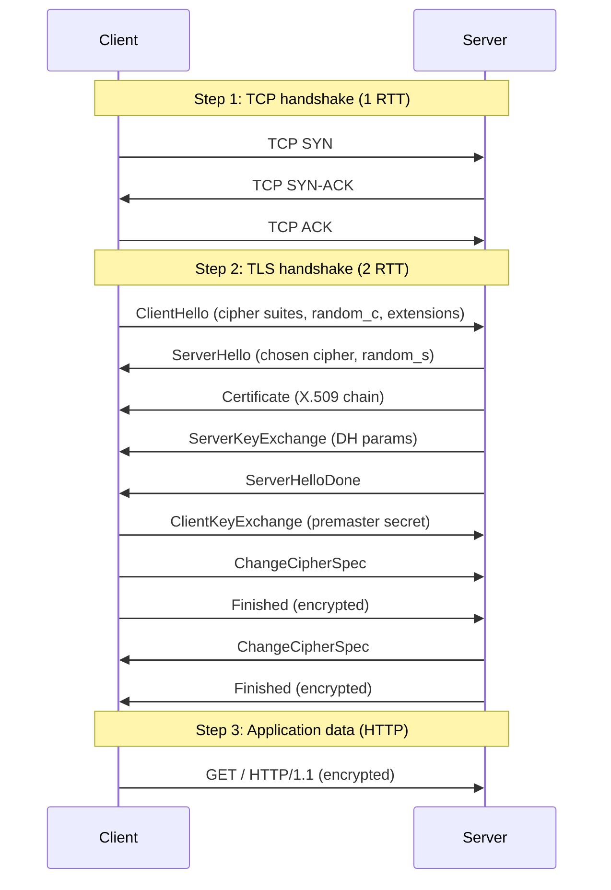
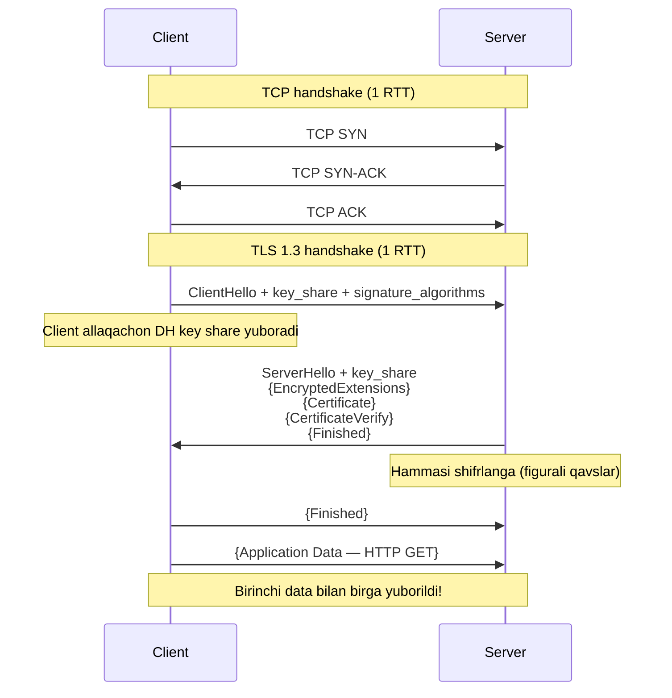
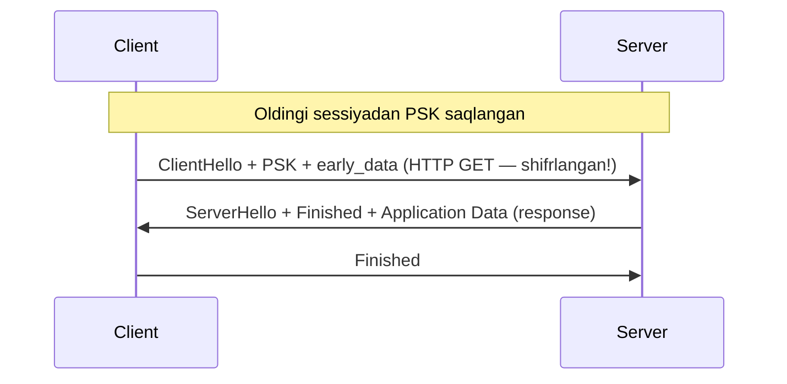
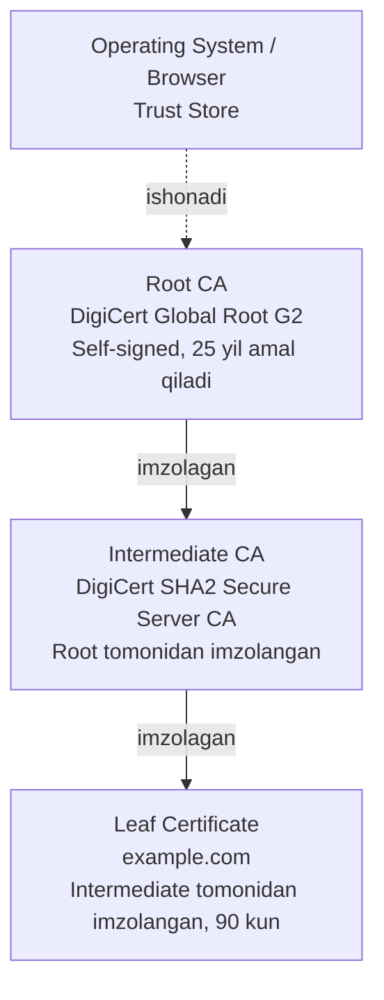
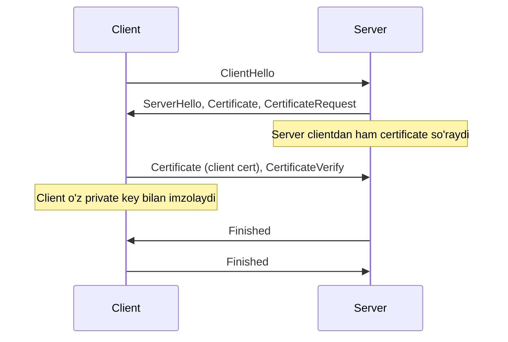
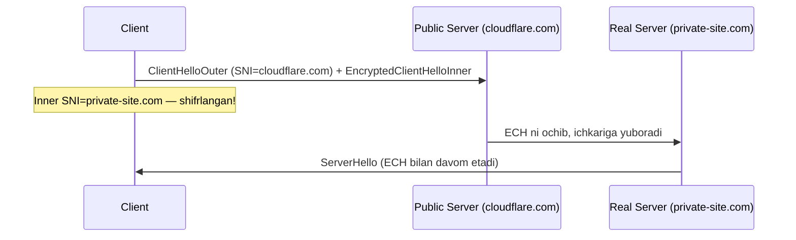

# TLS/SSL — Deep Dive

## 1. Nima uchun bu muhim?

TLS (Transport Layer Security) — zamonaviy Internet ning eng muhim protokollaridan biri. Internet traffic'ning **95% dan ortig'i** TLS bilan shifrlanadi. Har safar `https://`, `wss://`, IMAPS, SMTPS — bularning hammasi TLS ustida ishlaydi.

**Interview-da nima uchun so'raladi?**

- **Security tushunchasi:** Backend engineer TLS ni bilmasa, security holatini tahlil qila olmaydi
- **Production muammolar:** "Certificate verify failed", "wrong host" kabi xatoliklar real ish jarayonida har kuni uchraydi
- **Performance:** TLS handshake — connection ning eng "qimmat" qismi. Latency optimizatsiya uchun TLS 1.3, session resumption, OCSP stapling ni bilish shart
- **Modern arkitektura:** mTLS (Mutual TLS) — service mesh (Istio, Linkerd) ning poydevor texnologiyasi
- **Compliance:** PCI-DSS, HIPAA, GDPR — bu standartlarda TLS minimum talab

Go developer uchun `crypto/tls` package-i HTTP, gRPC, database connection-lar uchun fundamental.

## 2. Tarix va evolyutsiya

| Versiya | Yili | Status | Sabab |
|---------|------|--------|-------|
| SSL 1.0 | 1994 | Hech qachon chiqarilmagan | Netscape ichki versiya, jiddiy zaifliklar |
| SSL 2.0 | 1995 | **DEPRECATED** (RFC 6176, 2011) | Weak MAC, downgrade attacks |
| SSL 3.0 | 1996 | **DEPRECATED** (RFC 7568, 2015) | POODLE attack |
| TLS 1.0 | 1999 | **DEPRECATED** (2021) | BEAST attack, weak ciphers |
| TLS 1.1 | 2006 | **DEPRECATED** (2021) | IV predictability |
| TLS 1.2 | 2008 | Hali ishlatilyapti | RFC 5246 |
| TLS 1.3 | 2018 | **Tavsiya etiladi** | RFC 8446, 1-RTT, 0-RTT |

**Asosiy mileston-lar:**

- **2014 — Heartbleed (OpenSSL bug):** TLS implementation security ning naqadar muhimligini ko'rsatdi
- **2014 — POODLE:** SSL 3.0 ni butunlay o'ldirdi
- **2018 — TLS 1.3:** 10 yil ishlangan, handshake-ni 1 RTT ga qisqartirdi
- **2024-2026 — ECH (Encrypted Client Hello):** RFC 9849 (2026 mart-da nashr) — SNI ni shifrlash

**Nima uchun har bir eski versiya deprecated?**

Har bir versiya ma'lum hujum vektorlari bilan zaif: BEAST (TLS 1.0), CRIME, BREACH, Lucky 13, FREAK, Logjam, SLOTH, ROBOT, Bleichenbacher hujumi. TLS 1.3 bu hujumlarning aksariyatini protokol darajasida bekor qildi (zaif cipher-larni butunlay olib tashladi).

## 3. Asosiy mexanizm — TLS Handshake

### TLS 1.2 Handshake (Full RTT cost)



**Jami:** TCP (1 RTT) + TLS (2 RTT) + HTTP (1 RTT) = **4 RTT** birinchi ulanish uchun.

### TLS 1.3 Handshake (1-RTT)



TLS 1.3 da handshake **1 RTT** ga qisqargan — chunki client darhol o'z DH `key_share` ni yuboradi va serverga keraksiz round-trip kerak emas.

### TLS 1.3 0-RTT (Early Data)

Agar client server bilan oldin gaplashgan bo'lsa, **PSK (Pre-Shared Key)** orqali 0-RTT mumkin:



**0-RTT muammosi — Replay Attack:** 0-RTT data forward secrecy ga ega emas va replay qilinishi mumkin. Shuning uchun faqat **idempotent** so'rovlar uchun ishlatilishi kerak (GET, lekin POST — yo'q).

## 4. Wire Format — TLS Record Layer

```
 0                   1                   2                   3
 0 1 2 3 4 5 6 7 8 9 0 1 2 3 4 5 6 7 8 9 0 1 2 3 4 5 6 7 8 9 0 1
+-+-+-+-+-+-+-+-+-+-+-+-+-+-+-+-+-+-+-+-+-+-+-+-+-+-+-+-+-+-+-+-+
| Content Type  | Legacy Version (TLS 1.2)      | Length (16)   |
+-+-+-+-+-+-+-+-+-+-+-+-+-+-+-+-+-+-+-+-+-+-+-+-+-+-+-+-+-+-+-+-+
|                                                               |
~                  Encrypted Application Data                   ~
|                                                               |
+-+-+-+-+-+-+-+-+-+-+-+-+-+-+-+-+-+-+-+-+-+-+-+-+-+-+-+-+-+-+-+-+
```

**Content Type:**
- `0x14` — ChangeCipherSpec
- `0x15` — Alert
- `0x16` — Handshake
- `0x17` — Application Data
- `0x18` — Heartbeat

**ClientHello strukturasi:**

```
struct {
    ProtocolVersion legacy_version = 0x0303;     // TLS 1.2 (compat)
    Random random;                                 // 32 bytes
    opaque legacy_session_id<0..32>;
    CipherSuite cipher_suites<2..2^16-2>;        // ['TLS_AES_256_GCM_SHA384', ...]
    opaque legacy_compression_methods<1..2^8-1>;
    Extension extensions<8..2^16-1>;             // SNI, ALPN, key_share, ...
} ClientHello;
```

## 5. Cipher Suites — Anatomy

`TLS_AES_256_GCM_SHA384` — bu nima?

| Qism | Ma'no |
|------|-------|
| `TLS_` | Protocol prefix |
| `AES_256_` | Symmetric encryption — AES, 256-bit key |
| `GCM` | Authenticated mode — Galois/Counter Mode |
| `SHA384` | HMAC va key derivation uchun hash funksiya |

**TLS 1.2 da uzunroq:** `TLS_ECDHE_RSA_WITH_AES_256_GCM_SHA384`
- `ECDHE` — key exchange algorithm
- `RSA` — server authentication
- `AES_256_GCM` — bulk encryption
- `SHA384` — MAC

**TLS 1.3 da soddalashgan:** Faqat 5 ta cipher suite qoldi:
1. `TLS_AES_128_GCM_SHA256`
2. `TLS_AES_256_GCM_SHA384`
3. `TLS_CHACHA20_POLY1305_SHA256` (mobile uchun, AES hardware bo'lmaganda)
4. `TLS_AES_128_CCM_SHA256`
5. `TLS_AES_128_CCM_8_SHA256`

Eski va zaif cipher-lar (RC4, DES, MD5, SHA1, RSA key exchange) **butunlay** olib tashlangan.

## 6. Certificates va PKI



**Nima uchun chain?**
- **Root CA** — eng qimmatli kalit, offline saqlanadi (HSM da)
- **Intermediate CA** — kunlik ishlatiladi, agar kompromet bo'lsa, faqat shu chain ishdan chiqadi
- **Leaf** — sayt sertifikati

### X.509 Certificate Strukturasi

```
Certificate:
    Data:
        Version: 3 (0x2)
        Serial Number: 0e:e3:54...
        Signature Algorithm: sha256WithRSAEncryption
        Issuer: CN=DigiCert SHA2 Secure Server CA, O=DigiCert Inc
        Validity:
            Not Before: Jan 15 00:00:00 2026 GMT
            Not After : Apr 15 23:59:59 2026 GMT
        Subject: CN=example.com
        Subject Public Key Info:
            Public Key Algorithm: rsaEncryption
            RSA Public-Key: (2048 bit)
        X509v3 extensions:
            X509v3 Subject Alternative Name:
                DNS:example.com, DNS:www.example.com
            X509v3 Key Usage: Digital Signature, Key Encipherment
            X509v3 Extended Key Usage: TLS Web Server Authentication
    Signature Algorithm: sha256WithRSAEncryption
        7e:84:9c:25:...
```

**SAN (Subject Alternative Name)** — bugungi kunda CN o'rniga ishlatiladi. Bitta sertifikat bir nechta domain uchun ishlasa kerak.

## 7. Mutual TLS (mTLS)

Standart TLS-da faqat client server-ni autentifikatsiya qiladi. mTLS-da **ikkala tomon ham** sertifikat taqdim etadi:



**Qayerda ishlatiladi?**
- **Service mesh** (Istio, Linkerd) — mikroservislar o'rtasida
- **Banking API** — yuqori xavfsizlik talab qiladigan B2B
- **IoT** — har bir device-ning o'z sertifikati
- **Zero Trust architecture** — har bir so'rov autentifikatsiyalanadi

## 8. Encrypted Client Hello (ECH) — RFC 9849

**Muammo:** TLS handshake-da `SNI` (Server Name Indication) extension **ochiq** holda yuboriladi. Demak, ISP yoki MITM qaysi domain-ga kirayotganingizni ko'radi (DNS shifrlangan bo'lsa ham).

**ECH yechimi (2026-da standartlashgan):**



**Holati 2026:**
- **OpenSSL 4.0** (2026 bahor) ECH ni qo'llab-quvvatlaydi
- **NGINX 1.29.4** native ECH support
- **Cloudflare** keng tarqatdi
- **Firefox** (2024 dan) yoqilgan
- **Chrome** (2024 dan) yoqilgan

## 9. Real misol — `openssl s_client`

```bash
$ openssl s_client -connect example.com:443 -tls1_3 -servername example.com

CONNECTED(00000003)
depth=2 C=US, O=DigiCert Inc, OU=www.digicert.com, CN=DigiCert Global Root CA
verify return:1
depth=1 C=US, O=DigiCert Inc, CN=DigiCert SHA2 Secure Server CA
verify return:1
depth=0 C=US, ST=California, L=Los Angeles, O=Internet Corporation for Assigned Names and Numbers, CN=www.example.org
verify return:1
---
Certificate chain
 0 s:CN=www.example.org
   i:CN=DigiCert SHA2 Secure Server CA
 1 s:CN=DigiCert SHA2 Secure Server CA
   i:CN=DigiCert Global Root CA
---
Server certificate
-----BEGIN CERTIFICATE-----
MIIHbzCCBlegAwIBAgIQCgC...
-----END CERTIFICATE-----
---
SSL handshake has read 5829 bytes and written 416 bytes
---
New, TLSv1.3, Cipher is TLS_AES_256_GCM_SHA384
Server public key is 2048 bit
Secure Renegotiation IS NOT supported
Compression: NONE
Expansion: NONE
No ALPN negotiated
Early data was not sent
Verify return code: 0 (ok)
---
```

## 10. Go tilida implementatsiya

### Oddiy HTTPS client

```go
package main

import (
    "crypto/tls"
    "fmt"
    "io"
    "net/http"
)

func main() {
    // Default: TLS 1.2+ ishlatadi, system trust store dan CA larni oladi
    resp, err := http.Get("https://example.com")
    if err != nil {
        panic(err)
    }
    defer resp.Body.Close()

    body, _ := io.ReadAll(resp.Body)
    fmt.Printf("TLS Version: %x\n", resp.TLS.Version)        // 0x0304 = TLS 1.3
    fmt.Printf("Cipher Suite: %s\n", tls.CipherSuiteName(resp.TLS.CipherSuite))
    fmt.Printf("Body length: %d\n", len(body))
}
```

### Custom TLS Config

```go
package main

import (
    "crypto/tls"
    "crypto/x509"
    "net/http"
    "os"
)

func main() {
    // Custom CA cert yuklash
    caCert, err := os.ReadFile("ca.crt")
    if err != nil {
        panic(err)
    }
    caPool := x509.NewCertPool()
    caPool.AppendCertsFromPEM(caCert)

    // Client certificate (mTLS uchun)
    clientCert, err := tls.LoadX509KeyPair("client.crt", "client.key")
    if err != nil {
        panic(err)
    }

    tlsConfig := &tls.Config{
        MinVersion:   tls.VersionTLS13,           // Faqat TLS 1.3
        RootCAs:      caPool,                     // Custom CA
        Certificates: []tls.Certificate{clientCert}, // Client cert (mTLS)
        ServerName:   "secure-api.example.com",   // SNI
        // InsecureSkipVerify: true — HECH QACHON production-da ishlatmang!
    }

    transport := &http.Transport{TLSClientConfig: tlsConfig}
    client := &http.Client{Transport: transport}

    resp, err := client.Get("https://secure-api.example.com/data")
    if err != nil {
        panic(err)
    }
    defer resp.Body.Close()
}
```

### TLS Server (mTLS)

```go
server := &http.Server{
    Addr: ":443",
    TLSConfig: &tls.Config{
        MinVersion: tls.VersionTLS13,
        ClientAuth: tls.RequireAndVerifyClientCert, // mTLS!
        ClientCAs:  caPool,                          // Client cert ni shu CA bilan tekshir
    },
}
server.ListenAndServeTLS("server.crt", "server.key")
```

## 11. Common Errors

| Xato | Sabab | Yechim |
|------|-------|--------|
| `x509: certificate has expired` | Cert muddati o'tgan | Yangi cert oling (Let's Encrypt) |
| `x509: certificate signed by unknown authority` | CA root store-da yo'q | Custom CA-ni `RootCAs` ga qo'shing |
| `x509: certificate is valid for X, not Y` | SNI/hostname mos kelmaydi | Cert SAN ni tekshiring |
| `tls: handshake failure` | Cipher suite mos kelmaydi | Server/client TLS versiyasini tekshiring |
| `tls: unknown certificate authority` | Self-signed cert | `RootCAs` ga qo'shish yoki to'g'ri CA |
| `tls: bad record MAC` | Network corruption yoki cipher mismatch | Network ni tekshiring |

### HSTS (HTTP Strict Transport Security)

Server response header:
```
Strict-Transport-Security: max-age=31536000; includeSubDomains; preload
```

Brauzerga "shu domain uchun har doim HTTPS ishlat" deydi. **HSTS preload list** — Chrome/Firefox-ga oldindan o'rnatilgan ro'yxat.

### Certificate Pinning

Mobile app-larda — faqat ma'lum bir sertifikat (yoki public key) ni qabul qilish. MITM hujumiga qarshi himoya. Lekin ehtiyot: cert rotation murakkab.

## 12. Troubleshooting (Pop!_OS / Linux)

```bash
# TLS handshake ni ko'rish
openssl s_client -connect example.com:443 -showcerts -tls1_3

# Cert tafsilotlari
openssl x509 -in cert.pem -text -noout

# Cert muddati
echo | openssl s_client -connect example.com:443 2>/dev/null | openssl x509 -noout -dates

# Cipher suites tekshirish
nmap --script ssl-enum-ciphers -p 443 example.com

# TLS handshake ni capture qilish (decrypt qilib bo'lmaydi, lekin metadata ko'rinadi)
sudo tcpdump -i any -nn -X 'tcp port 443' -w tls.pcap

# SSL Labs testdan foydalanish
curl https://api.ssllabs.com/api/v3/analyze?host=example.com

# Local certificate hujjatlari (Pop!_OS)
ls /etc/ssl/certs/
update-ca-certificates    # custom CA-ni qo'shgandan keyin

# Go-da TLS debug
GODEBUG=tls13=1 go run main.go
```

## 13. FAQ

**S1: TLS va SSL bir narsami?**
**J:** Texnikaviy farq bor — SSL eskirgan, TLS yangi nomi. Lekin og'zaki "SSL certificate" ko'p ishlatiladi (aslida TLS).

**S2: Self-signed certificate xavfsizmi?**
**J:** Internal use uchun ha, public uchun yo'q. Brauzer ishonmaydi. Yechim — Let's Encrypt (bepul, avtomatik).

**S3: Wildcard sertifikat (`*.example.com`) qanday ishlaydi?**
**J:** Bitta sertifikat barcha subdomain-larga to'g'ri keladi. Lekin faqat 1-darajali — `*.example.com` `a.b.example.com` uchun ishlamaydi.

**S4: TLS 1.3 da forward secrecy nima?**
**J:** Hatto server private key kelajakda kompromet bo'lsa ham, eski sessiyalarni decrypt qilib bo'lmaydi. Chunki har bir session ephemeral DH key ishlatadi.

**S5: 0-RTT replay attack nima?**
**J:** Hujumchi 0-RTT data ni qaytadan yuborsa, server uni qabul qiladi. Shuning uchun GET (idempotent) uchun OK, lekin POST/DELETE uchun xavfli.

**S6: SNI nima va nima uchun muhim?**
**J:** Server Name Indication — bitta IP-da bir nechta domain bo'lsa, qaysi cert ni qaytarish kerakligini bildiradi. ECH bu maydonni shifrlaydi.

**S7: OCSP nima?**
**J:** Online Certificate Status Protocol — sertifikat bekor qilinganmi yo'qligini tekshirish. **OCSP Stapling** — server javobni o'zi qo'shib yuboradi (latency optimizatsiya).

**S8: mTLS qachon kerak?**
**J:** B2B API-lar, mikroservis o'rtasidagi muloqot, IoT, banking. Service mesh (Istio) avtomatik mTLS ni yoqadi.

## 14. Cross-references

- Yuqori layer: [`../osi/07-application.md`](../osi/07-application.md), HTTP/HTTPS
- Quyi layer: [`./tcp-handshake.md`](./tcp-handshake.md) — TLS TCP ustida ishlaydi
- Tegishli deep-dive: [`./dns-resolution.md`](./dns-resolution.md), DoT va DoH bevosita TLS ishlatadi
- Glossary: [`../00-foundations/glossary.md`](../00-foundations/glossary.md)

## 15. Manbalar

- **RFC 8446** — TLS 1.3 (2018)
- **RFC 5246** — TLS 1.2 (2008)
- **RFC 6066** — TLS Extensions (SNI)
- **RFC 7568** — Deprecating SSL 3.0
- **RFC 9849** — TLS Encrypted Client Hello (2026)
- **RFC 7413** — TCP Fast Open
- **Kitob:** Kurose & Ross "Computer Networking", Bob 8 (Network Security)
- **Bruce Schneier:** "Applied Cryptography"
- **Cloudflare:** [What happens in a TLS handshake?](https://www.cloudflare.com/learning/ssl/what-happens-in-a-tls-handshake/)
- **Cloudflare blog:** [Introducing 0-RTT](https://blog.cloudflare.com/introducing-0-rtt/)
- **OpenSSL:** [ECH support announcement (2026)](https://openssl-library.org/post/2026-03-11-ech/index.html)
- **Mozilla:** [Encrypted Client Hello explained](https://support.mozilla.org/en-US/kb/understand-encrypted-client-hello)
- **NGINX:** [ECH in NGINX 1.29.4](https://blog.nginx.org/blog/encrypted-client-hello-comes-to-nginx)
- **SSL Labs:** [SSL Server Test](https://www.ssllabs.com/ssltest/)
