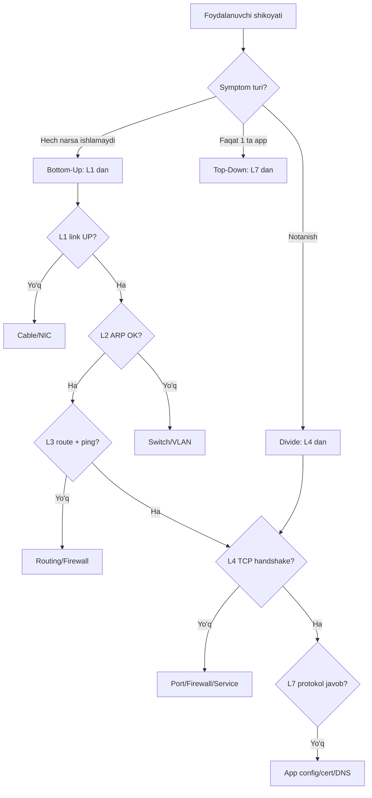
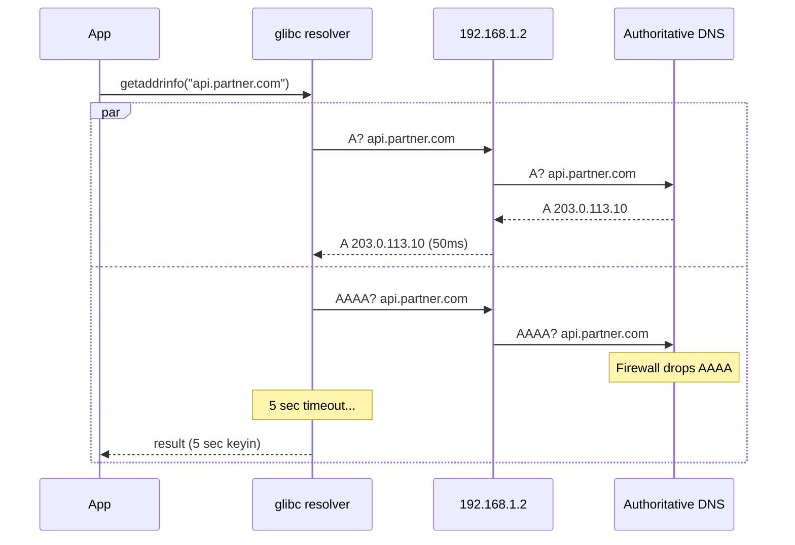
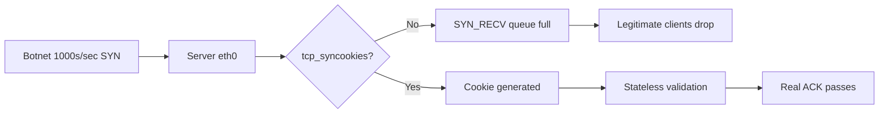
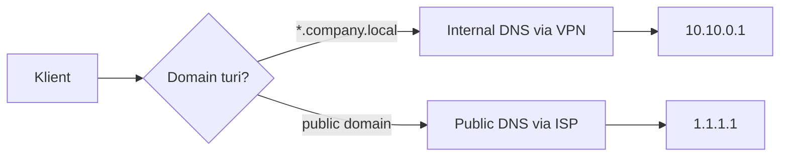
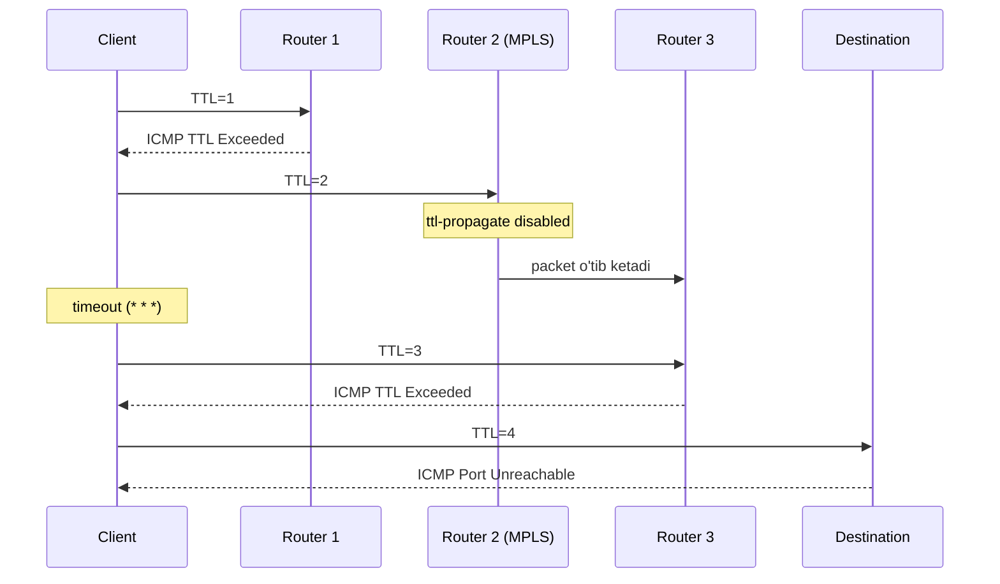
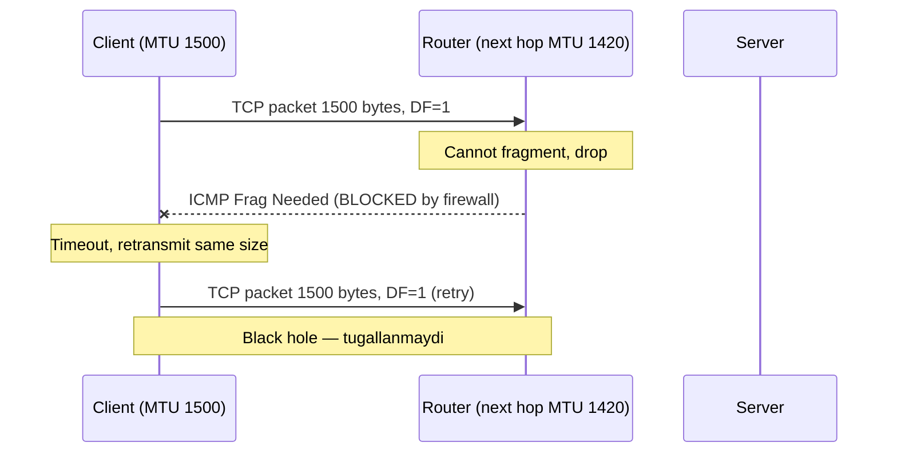
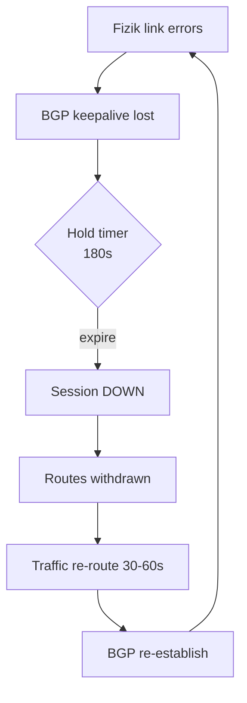
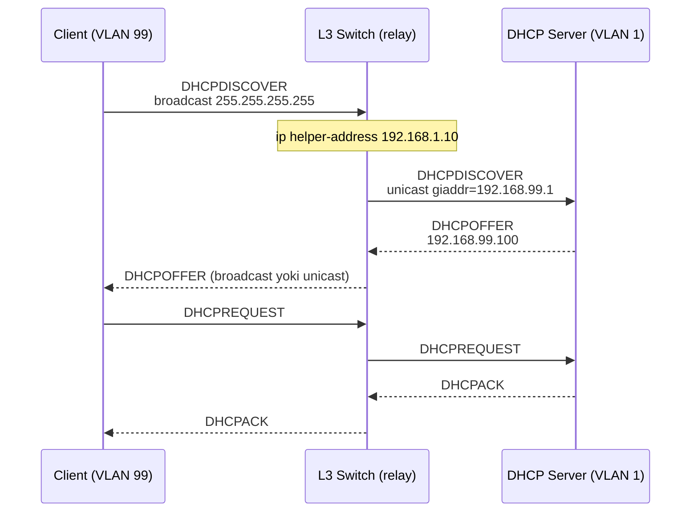
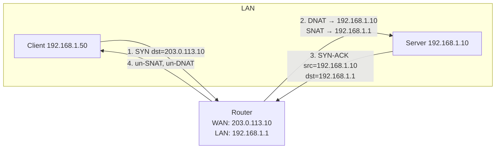

# Network Troubleshooting Cases

17 ta real-hayotdan keys — diagnostika qadamlari, sabab tahlili va yechimlar bilan. Har bir case bottom-up OSI yondashuvi orqali ko'rib chiqilgan.

> **Falsafa:** "Tarmoq ishlamayapti" — bu jumla Senior Engineer uchun kasallikning simptomi. Haqiqiy tashxis (diagnosis) — bu **layer-by-layer** tekshirish va **gipoteza-test-natija** sikli.

---

## Tarkib

| #  | Case | Layer | Asosiy Tools |
|----|------|-------|--------------|
| 1  | Internet ishlamayapti, LAN OK | L3/L7 | `ping`, `dig`, `ip route` |
| 2  | DNS resolution juda sekin (5+ soniya) | L7 | `dig`, `tcpdump`, `resolvectl` |
| 3  | HTTPS fail, HTTP ishlaydi | L6/L7 | `openssl`, `curl -v`, `tcpdump` |
| 4  | Webserver SYN flood ostida | L4 | `ss`, `nstat`, `iptables`, `sysctl` |
| 5  | TCP connection RST bilan tushadi | L4 | `tcpdump`, `conntrack`, `ss -i` |
| 6  | Wi-Fi kuchli signal, lekin sekin | L1/L2 | `iw`, `iwconfig`, `tcpdump` |
| 7  | VPN ulanish OK, DNS ishlamaydi | L7 | `resolvectl`, `dig`, `ip route` |
| 8  | `traceroute` da `* * *` | L3 | `mtr`, `traceroute -T`, `tcpdump` |
| 9  | Web server intermittent 502/504 | L7 | `nginx logs`, `ss`, `curl -w` |
| 10 | MTU mismatch — katta packet drop | L3 | `ping -s -M do`, `tracepath` |
| 11 | BGP session flapping | L3 | `bgpctl`, `tcpdump port 179` |
| 12 | TCP TIME_WAIT exhaustion | L4 | `ss -tan`, `sysctl`, `nstat` |
| 13 | IPv6 ishlaydi, IPv4 yo'q (yoki teskari) | L3 | `ip -6`, `dig AAAA`, `curl -4/-6` |
| 14 | `ss -s` da ko'p ESTABLISHED (connection leak) | L4/L7 | `ss`, `lsof`, `netstat` |
| 15 | DHCP lease olmayapti | L2/L3 | `tcpdump port 67`, `dhclient -v` |
| 16 | NAT loopback (hairpinning) ishlamaydi | L3 | `iptables -t nat`, `tcpdump` |
| 17 | Cron job networkga chiqmayapti | L7/Env | `env`, `strace`, `getent` |

---

## Diagnostika metodologiyasi

Tarmoq muammolarini hal qilishda ikki asosiy yondashuv mavjud:

### Bottom-Up (L1 → L7)
- **Qachon ishlatiladi:** Yangi infrastruktura, fizik muammolar shubhasi, batafsil audit
- **Afzalligi:** Hech narsani o'tkazib yubormaydi
- **Kamchilik:** Sekin

### Top-Down (L7 → L1)
- **Qachon ishlatiladi:** Application-level shikoyat ("websayt ochilmayapti")
- **Afzalligi:** Tezkor — ko'pincha muammo yuqori layerda
- **Kamchilik:** Fizik muammolarni o'tkazib yuborishi mumkin

### Divide & Conquer (Yarmidan boshlash)
- **L4 (TCP)** dan boshlash: agar TCP handshake ishlasa — L1-L3 OK, agar yo'q bo'lsa — pastga; agar TCP OK bo'lsa, lekin app ishlamasa — yuqoriga.



### Universal checklist

```bash
# L1 — fizik link
ip link show
ethtool eth0 | grep -E "Link detected|Speed|Duplex"

# L2 — ARP/neighbor
ip neigh show
arping -I eth0 192.168.1.1

# L3 — IP, route, gateway
ip addr show
ip route show
ping -c 3 <gateway>
ping -c 3 8.8.8.8

# L4 — TCP/UDP port
ss -tlnp
nc -zv example.com 443

# L7 — DNS, HTTP, TLS
dig +short example.com
curl -v https://example.com
openssl s_client -connect example.com:443 -servername example.com </dev/null
```

---

## Case 1: Internet ishlamayapti, LAN ichida ishlaydi

**Scenario:** Office foydalanuvchisi tongdan boshlab tashqi websaytlarga kirolmasligini aytadi. LAN ichidagi file server (`192.168.1.10`) ga SSH qila oladi va Jira (intranet) ham ishlaydi.

**Symptomlar:**
- Browser: `DNS_PROBE_FINISHED_NXDOMAIN`
- `ping google.com` — `Temporary failure in name resolution`
- `ping 8.8.8.8` — natija aniq emas, tekshirish kerak
- `ssh user@192.168.1.10` — ishlaydi
- Boshqa office foydalanuvchilarida ham xuddi shunday muammo

**Diagnostika qadamlari (bottom-up):**

**1. L1 — Link statusi:**
```bash
$ ip link show eth0
2: eth0: <BROADCAST,MULTICAST,UP,LOWER_UP> mtu 1500 qdisc fq_codel state UP
    link/ether a4:bb:6d:11:22:33 brd ff:ff:ff:ff:ff:ff
```
Status `UP, LOWER_UP` — fizik link OK.

**2. L2 — Gateway MAC:**
```bash
$ ip neigh show
192.168.1.1 dev eth0 lladdr 00:1a:2b:3c:4d:5e REACHABLE
```
Gateway ARP javob beryapti — L2 OK.

**3. L3 — Routing va gateway ping:**
```bash
$ ip route show
default via 192.168.1.1 dev eth0 proto dhcp metric 100
192.168.1.0/24 dev eth0 proto kernel scope link src 192.168.1.45

$ ping -c 3 192.168.1.1
64 bytes from 192.168.1.1: icmp_seq=1 ttl=64 time=0.5 ms
```
Default route mavjud, gateway ping qilinadi.

**4. L3 — Tashqi IP ping:**
```bash
$ ping -c 3 8.8.8.8
PING 8.8.8.8: 56 data bytes
64 bytes from 8.8.8.8: icmp_seq=1 ttl=117 time=24.1 ms
64 bytes from 8.8.8.8: icmp_seq=2 ttl=117 time=23.9 ms
```
Tashqi IP ga ping ishlaydi — L3 routing OK.

**5. L7 — DNS test:**
```bash
$ dig google.com
;; connection timed out; no servers could be reached

$ cat /etc/resolv.conf
nameserver 192.168.1.2

$ ping -c 2 192.168.1.2
From 192.168.1.45 icmp_seq=1 Destination Host Unreachable
```

**6. Backup DNS bilan test:**
```bash
$ dig @1.1.1.1 google.com
;; ANSWER SECTION:
google.com.    300    IN    A    142.250.184.46
```
External resolver ishlaydi — muammo internal DNS server'da.

**Sabab:**
Internal DNS server (`192.168.1.2`) ag'darilgan (down). DHCP server foydalanuvchilarga shu DNS ni push qilgan, shuning uchun butun office'ga ta'sir qilgan. Tashqi konnektivlik (L3) butunlay ishlaydi, faqat **DNS resolution** layeri ishlamayapti.

**Yechim:**

Tezkor (workaround):
```bash
# /etc/resolv.conf ga vaqtinchalik public DNS qo'shish
sudo tee /etc/resolv.conf <<EOF
nameserver 1.1.1.1
nameserver 8.8.8.8
EOF

# Yoki systemd-resolved orqali
sudo resolvectl dns eth0 1.1.1.1 8.8.8.8
```

Asosiy yechim:
```bash
# DNS server'ni ko'tarish (BIND yoki Unbound)
ssh admin@192.168.1.2
sudo systemctl status named
sudo systemctl restart named
sudo journalctl -u named --since "1 hour ago"
```

**Oldini olish:**
- DHCP'da **ikkita** DNS server e'lon qilish (primary + secondary)
- DNS server'lar uchun **monitoring** (Prometheus blackbox exporter, healthcheck)
- Anycast DNS yoki HA pair (keepalived bilan VIP)
- Critical workstationlarda fallback DNS sozlash

**Tools ishlatilgan:** `ip`, `ping`, `dig`, `cat /etc/resolv.conf`, `resolvectl`

**Cross-refs:** [Network layer](../osi/03-network.md), [DNS deep-dive](../deep-dives/dns-resolution.md), [Application layer](../osi/07-application.md)

---

## Case 2: DNS resolution juda sekin (5+ soniya)

**Scenario:** Backend developerlar `curl api.partner.com` 5-7 soniya kutib turishini, keyin tez ishlashini aytishadi. Ikkinchi `curl` darhol javob beradi. Bu pattern butun office'da kuzatiladi.

**Symptomlar:**
- Birinchi `curl` — 5-7 soniya
- Keyingi `curl` — < 100 ms
- 5 daqiqadan keyin yana sekin (cache TTL muddati)

**Diagnostika qadamlari:**

**1. DNS lookup vaqtini o'lchash:**
```bash
$ time dig api.partner.com
;; Query time: 5234 msec
;; SERVER: 192.168.1.2#53(192.168.1.2)
real    0m5.241s
```

**2. Tarmoqda nima yuborilayotganini ko'rish:**
```bash
$ sudo tcpdump -i eth0 -n port 53 -w /tmp/dns.pcap
# boshqa terminalda:
$ dig api.partner.com
$ sudo tcpdump -r /tmp/dns.pcap -nn

12:01:23.001 IP 192.168.1.45.51234 > 192.168.1.2.53: A? api.partner.com.
12:01:23.002 IP 192.168.1.45.51234 > 192.168.1.2.53: AAAA? api.partner.com.
12:01:28.005 IP 192.168.1.2.53 > 192.168.1.45.51234: 1/0/0 A 203.0.113.10
12:01:28.006 IP 192.168.1.2.53 > 192.168.1.45.51234: 0/1/0 (no AAAA)
```

**Topilgan:** A va AAAA so'rovlari **parallel** yuborildi, lekin **AAAA javobi 5 soniya kechikdi**. `getaddrinfo()` AAAA javobini kutadi.

**3. AAAA javob qayerdan keladi?**
```bash
$ dig +trace AAAA api.partner.com
# Authoritative server javob bermayapti yoki firewall AAAA so'rovlarini drop qiladi
```

**4. Resolver xatti-harakati:**
```bash
$ resolvectl statistics
DNSSEC supported by current servers: no
Transactions: 1234
Cache size: 567
Cache hits: 890
Cache misses: 344
```

**Sabab:**
**IPv6 fallback delay.** Glibc `getaddrinfo()` A va AAAA so'rovlarini parallel yuboradi. Authoritative DNS server AAAA so'roviga javob bermaydi (yoki firewall drop qiladi). Resolver standart 5 soniya kutadi, keyin IPv4 javobini ishlatadi. Birinchi murojaatdan keyin javob cache'ga tushadi.

**Yechim:**

**Variant A: Resolver tomonida AAAA ni o'chirish (agar IPv6 kerak bo'lmasa):**
```bash
# /etc/gai.conf
precedence ::ffff:0:0/96  100

# Yoki
echo "options single-request-reopen" | sudo tee -a /etc/resolv.conf
```

**Variant B: Authoritative tomonida muammo (eng to'g'ri):**
Partner kompaniyaga muammo haqida xabar berish — ular AAAA so'roviga `NOERROR` (bo'sh javob) qaytarishi kerak, drop qilmaslik.

**Variant C: Local cache resolver:**
```bash
# Unbound o'rnatish
sudo apt install unbound
sudo systemctl enable --now unbound

# /etc/unbound/unbound.conf.d/local.conf
server:
    interface: 127.0.0.1
    qname-minimisation: yes
    prefetch: yes
    cache-min-ttl: 300

# resolv.conf
nameserver 127.0.0.1
```

**Oldini olish:**
- Local recursive resolver (Unbound, dnsmasq) — har bir host'da
- DNS so'rovlar uchun timeout monitoringi
- IPv6 dual-stack to'g'ri konfiguratsiyasi



**Tools:** `dig`, `tcpdump`, `resolvectl`, `time`, `unbound`

**Cross-refs:** [DNS deep-dive](../deep-dives/dns-resolution.md), [Application layer](../osi/07-application.md)

---

## Case 3: HTTPS ulanishlar fail, HTTP ishlaydi

**Scenario:** Foydalanuvchi `http://example.com` ochila olishini, lekin `https://example.com` "Connection failed" xatosini berishini aytadi. Boshqa HTTPS saytlar ishlaydi.

**Symptomlar:**
- `curl http://example.com` — 200 OK
- `curl https://example.com` — `SSL_ERROR_SYSCALL` yoki `connection reset`
- `curl https://google.com` — ishlaydi
- Browser: `ERR_SSL_PROTOCOL_ERROR`

**Diagnostika qadamlari:**

**1. Port 443 ochiqmi?**
```bash
$ nc -zv example.com 443
Connection to example.com 443 port [tcp/https] succeeded!
```
Port ochiq — TCP layer OK.

**2. TLS handshake batafsil:**
```bash
$ openssl s_client -connect example.com:443 -servername example.com -showcerts
CONNECTED(00000003)
write:errno=104
---
no peer certificate available
---
SSL handshake has read 0 bytes and written 305 bytes
```

`errno=104` — **Connection reset by peer**. TLS handshake'ning ClientHello jo'natilgandan keyin server reset yuboryapti.

**3. Tcpdump bilan packet tahlili:**
```bash
$ sudo tcpdump -i any -nn host example.com -w /tmp/tls.pcap
# boshqa terminalda
$ curl https://example.com

$ tshark -r /tmp/tls.pcap -Y "tcp.flags.reset == 1"
12  0.512  example.com -> client  TCP  RST  443 -> 51234
```

**4. Cipher suite mos kelyaptimi?**
```bash
$ openssl s_client -connect example.com:443 -tls1_2 -cipher 'ALL'
# javob bormi?

$ nmap --script ssl-enum-ciphers -p 443 example.com
PORT    STATE SERVICE
443/tcp open  https
| ssl-enum-ciphers:
|   TLSv1.0:
|     ciphers:
|       TLS_RSA_WITH_AES_128_CBC_SHA
|   TLSv1.2: No supported ciphers found
|_  least strength: C
```

**5. Klient TLS versiyasi:**
```bash
$ openssl version
OpenSSL 3.0.2 15 Mar 2022

# Default TLS 1.2/1.3, lekin server faqat TLS 1.0
```

**Sabab:**
Server faqat **eskirgan TLS 1.0** ni qo'llab-quvvatlaydi. Modern OpenSSL 3.x da `MinProtocol = TLSv1.2` standart sozlama. Klient ClientHello'ni TLS 1.2 bilan yuboradi, server qabul qilolmaydi va RST yuboradi.

**Yechim:**

**Variant A: Server tomonini yangilash (eng to'g'ri):**
```bash
# nginx misolida
server {
    listen 443 ssl http2;
    ssl_protocols TLSv1.2 TLSv1.3;
    ssl_ciphers ECDHE-ECDSA-AES256-GCM-SHA384:ECDHE-RSA-AES256-GCM-SHA384;
    ssl_prefer_server_ciphers off;
}
```

**Variant B: Klient tomonida vaqtinchalik o'tkazish (xavfli, faqat test uchun):**
```bash
# /etc/ssl/openssl.cnf
[system_default_sect]
MinProtocol = TLSv1.0
CipherString = DEFAULT@SECLEVEL=0
```

**Variant C: MITM proxy:**
Korporativ tarmoqda Zscaler/Squid SSL inspection certificate'ini klient'da o'rnatmagan bo'lishi mumkin. Bunda:
```bash
$ openssl s_client -connect example.com:443 </dev/null 2>&1 | openssl x509 -noout -issuer
issuer=CN = Zscaler Intermediate Root CA
```
CA sertifikatni klient store'ga qo'shish.

**Oldini olish:**
- TLS auditing (Qualys SSL Labs, `testssl.sh`)
- Periodic security scan
- Certificate expiry monitoring (Prometheus blackbox)

**Tools:** `openssl`, `curl -v`, `tcpdump`, `tshark`, `nmap`, `testssl.sh`

**Cross-refs:** [TLS/SSL deep-dive](../deep-dives/tls-ssl.md), [Presentation layer](../osi/06-presentation.md)

---

## Case 4: Webserver SYN flood ostida

**Scenario:** Production web server (nginx) javob bermay qoldi. CPU 20%, memory normal, lekin yangi ulanishlar timeout. Monitoring SYN_RECV soni 60000+ ekanligini ko'rsatadi.

**Symptomlar:**
- `curl https://api.company.com` — `Connection timed out`
- Server logs — yangi requestlar yo'q
- `ss -s`:
  ```
  TCP: 60123 (estab 1234, closed 0, orphaned 0, synrecv 58000, ...)
  ```
- `dmesg`: `TCP: request_sock_TCP: Possible SYN flooding on port 443`

**Diagnostika qadamlari:**

**1. Connection statistics:**
```bash
$ ss -s
Total: 234
TCP:   60123 (estab 1234, closed 0, orphaned 0, timewait 50)
       transport total ip ipv6
TCP    60000   58800  1200

$ ss -tan state syn-recv | wc -l
58000
```

**2. SYN packet manbai:**
```bash
$ sudo tcpdump -i eth0 -nn 'tcp[tcpflags] == tcp-syn' -c 100 | \
    awk '{print $3}' | cut -d. -f1-4 | sort | uniq -c | sort -rn | head
   45 192.0.2.55
   38 198.51.100.12
   33 203.0.113.99
```

**3. Kernel statistics:**
```bash
$ nstat -az | grep -i syn
TcpExtListenOverflows         12345
TcpExtListenDrops             12500
TcpExtTCPSynRetrans           890
```

**4. Listen backlog:**
```bash
$ ss -tlnp
LISTEN  0  511  *:443  users:(("nginx",pid=1234,fd=6))
# backlog = 511, lekin SYN_RECV 58000 — somaxconn limit
```

**5. SYN cookies status:**
```bash
$ sysctl net.ipv4.tcp_syncookies
net.ipv4.tcp_syncookies = 1
# 1 = faqat backlog to'lganda yoqiladi
```

**Sabab:**
**SYN flood DDoS** — botnet 1000s/sec SYN packetlarini yuborayapti. SYN cookies yoqilgan, lekin backlog overflow tufayli legitimate ulanishlar drop bo'layapti.

**Yechim:**

**Tezkor mitigation:**
```bash
# 1. SYN cookies majburiy yoqish
sudo sysctl -w net.ipv4.tcp_syncookies=1
sudo sysctl -w net.ipv4.tcp_max_syn_backlog=8192
sudo sysctl -w net.core.somaxconn=8192

# 2. SYN retries kamaytirish
sudo sysctl -w net.ipv4.tcp_synack_retries=2

# 3. iptables bilan rate limit
sudo iptables -A INPUT -p tcp --syn --dport 443 \
    -m limit --limit 100/second --limit-burst 200 -j ACCEPT
sudo iptables -A INPUT -p tcp --syn --dport 443 -j DROP

# 4. nftables versiyasi
sudo nft add rule inet filter input tcp dport 443 tcp flags syn \
    limit rate 100/second burst 200 packets accept
```

**Nginx tuning:**
```nginx
events {
    worker_connections 65535;
}
http {
    limit_conn_zone $binary_remote_addr zone=perip:10m;
    limit_conn perip 100;
    limit_req_zone $binary_remote_addr zone=req:10m rate=10r/s;
    limit_req zone=req burst=20 nodelay;
}
```

**Persistent yechim:**
- **Cloudflare/AWS Shield** — upstream DDoS protection
- **eBPF-based filtering** (XDP) — kernel-da packet drop
- **BGP blackhole** — ISP darajasida

**Oldini olish:**
- `tcp_syncookies = 1` har doim
- Rate limiting baseline
- DDoS protection service (Cloudflare Magic Transit)
- Anomaly detection (Prometheus alerts on SYN_RECV)



**Tools:** `ss`, `nstat`, `tcpdump`, `iptables`, `nftables`, `sysctl`

**Cross-refs:** [TCP handshake](../deep-dives/tcp-handshake.md), [Transport layer](../osi/04-transport.md), [NAT and firewall](../deep-dives/nat-and-firewall.md)

---

## Case 5: TCP connection RST bilan tushadi

**Scenario:** Long-lived TCP ulanish (PostgreSQL, RabbitMQ AMQP, MQTT) muntazam 30-60 daqiqada uziladi. App `connection reset by peer` xatosini ko'radi. Bevosita LAN ichida muammo yo'q, faqat NAT/firewall orqali.

**Symptomlar:**
- App log: `EPIPE: broken pipe` yoki `connection reset by peer`
- Pattern: doim 30-60 daqiqa keyin
- LAN ichida (firewall'siz) muammo yo'q

**Diagnostika qadamlari:**

**1. TCP sessiya holati:**
```bash
$ ss -tanp | grep 5432
ESTAB  0  0  10.0.1.5:54321  10.0.2.10:5432  users:(("app",pid=1234,fd=12))

$ ss -tnpio | grep 5432
ESTAB ... cubic wscale:7,7 rto:204 rtt:1.5/0.5 ato:40 ...
```

**2. Tcpdump bilan kuzatish:**
```bash
$ sudo tcpdump -i any -nn host 10.0.2.10 and port 5432 -w /tmp/conn.pcap
# 30 daqiqa kutish

$ tshark -r /tmp/conn.pcap -Y "tcp.flags.reset == 1"
35min  10.0.2.10 -> 10.0.1.5  TCP  RST  5432 -> 54321
35min  10.0.1.5 -> 10.0.2.10  TCP  RST  54321 -> 5432
```

**3. Conntrack jadval:**
```bash
$ sudo conntrack -L -p tcp --dport 5432
tcp  6  3580  ESTABLISHED  src=10.0.1.5  dst=10.0.2.10 sport=54321 dport=5432

$ sudo sysctl net.netfilter.nf_conntrack_tcp_timeout_established
net.netfilter.nf_conntrack_tcp_timeout_established = 432000  # 5 kun

# Lekin oraliq firewall (cloud provider, corporate) idle timeout < 30 min!
```

**4. Keep-alive yoqilganmi?**
```bash
$ ss -tnpio | grep 5432
# keepalive timer ko'rinmasa — yo'q

$ sysctl net.ipv4.tcp_keepalive_time
net.ipv4.tcp_keepalive_time = 7200  # 2 soat — juda uzun!
```

**5. Application sozlamalari:**
```python
# Python psycopg2
conn = psycopg2.connect(
    host="10.0.2.10",
    keepalives=1,
    keepalives_idle=60,
    keepalives_interval=10,
    keepalives_count=3
)
```

**Sabab:**
**Stateful firewall (yoki NAT) idle timeout.** Cloud load balancer (AWS NLB) yoki corporate firewall TCP connection'ni 350 soniya idle bo'lsa, conntrack jadvalidan o'chiradi. Keyingi packet kelganda, firewall RST yuboradi (yoki shunchaki drop qiladi va keyin TCP timeout).

**Yechim:**

**Application-level keep-alive (eng to'g'ri):**
```python
# Python socket
import socket
sock.setsockopt(socket.SOL_SOCKET, socket.SO_KEEPALIVE, 1)
sock.setsockopt(socket.IPPROTO_TCP, socket.TCP_KEEPIDLE, 60)
sock.setsockopt(socket.IPPROTO_TCP, socket.TCP_KEEPINTVL, 10)
sock.setsockopt(socket.IPPROTO_TCP, socket.TCP_KEEPCNT, 3)
```

```go
// Go net package
conn, _ := net.Dial("tcp", "10.0.2.10:5432")
tcpConn := conn.(*net.TCPConn)
tcpConn.SetKeepAlive(true)
tcpConn.SetKeepAlivePeriod(60 * time.Second)
```

**System-level keep-alive:**
```bash
# Hammasi uchun keepalive idle time qisqartirish
sudo sysctl -w net.ipv4.tcp_keepalive_time=60
sudo sysctl -w net.ipv4.tcp_keepalive_intvl=10
sudo sysctl -w net.ipv4.tcp_keepalive_probes=3
```

**Application heartbeat:**
- PostgreSQL: `tcp_keepalives_idle=60` (postgresql.conf)
- RabbitMQ: `heartbeat = 30`
- MQTT: `keepalive=60` connect packet

**Oldini olish:**
- Long-lived connectionlarda har doim keep-alive
- Connection pooling bilan retry logic
- Idle timeoutni firewall'da hujjatlashtirish (350s AWS NLB, 60min Azure LB)

**Tools:** `ss`, `tcpdump`, `conntrack`, `tshark`, `sysctl`

**Cross-refs:** [TCP handshake](../deep-dives/tcp-handshake.md), [NAT and firewall](../deep-dives/nat-and-firewall.md), [Transport layer](../osi/04-transport.md)

---

## Case 6: Wi-Fi kuchli signal lekin sekin

**Scenario:** Foydalanuvchi laptop'da Wi-Fi signal "Excellent" (5/5 bars) ekanligini, lekin internet sekin (5 Mbps) ekanligini aytadi. Telefondan ham xuddi shunday. Boshqa AP'ga ulansa, 200 Mbps.

**Symptomlar:**
- Signal: -45 dBm (juda yaxshi)
- Speedtest: 5 Mbps (kutilgan: 200+ Mbps)
- `ping 192.168.1.1` — 50-200 ms (yuqori), packet loss bor
- Wired ethernet — 1 Gbps

**Diagnostika qadamlari:**

**1. Wi-Fi parametrlari:**
```bash
$ iw dev wlan0 link
Connected to a4:bb:6d:11:22:33 (on wlan0)
    SSID: OfficeWiFi
    freq: 2437  # 2.4 GHz channel 6
    signal: -45 dBm
    tx bitrate: 24.0 MBit/s    # juda past!
    rx bitrate: 18.0 MBit/s
```

**Diqqat:** Signal yaxshi, lekin **bitrate past** — bu interference belgisi.

**2. Channel survey:**
```bash
$ sudo iw dev wlan0 scan | grep -E "SSID|signal|freq" | head -50
SSID: Neighbor1
    freq: 2437
    signal: -55.00 dBm
SSID: Neighbor2
    freq: 2437
    signal: -60.00 dBm
SSID: Neighbor3
    freq: 2437
    signal: -65.00 dBm
SSID: OfficeWiFi
    freq: 2437
```

**Hammasi channel 6 (2.4 GHz)** — overcrowded.

**3. Retry rate:**
```bash
$ iw dev wlan0 station dump
Station a4:bb:6d:11:22:33 (on wlan0)
    rx packets:  12000
    tx packets:  10000
    tx retries:  3500   # 35% retry — juda yuqori!
    tx failed:   200
```

**4. Airtime utilization:**
```bash
$ sudo iw dev wlan0 survey dump
Survey data from wlan0
    frequency: 2437 MHz
    channel active time: 30000 ms
    channel busy time: 26000 ms   # 87% busy!
    channel transmit time: 2000 ms
```

**5. ARP storm bormi?**
```bash
$ sudo tcpdump -i wlan0 -nn arp -c 100
# 100 ARP per second — anomaly
```

**Sabab:**
**2.4 GHz channel 6 da co-channel interference.** Qo'shni 5 ta AP shu kanalda ishlaydi. Bundan tashqari, eski ARP storm (network printer broken loop) airtime'ni iste'mol qiladi. Wi-Fi adaptive bitrate signal yaxshi bo'lsa-da, interference tufayli pastga tushadi.

**Yechim:**

**1. 5 GHz ga o'tish:**
```bash
# Router'da 5 GHz radio yoqish
# SSID: OfficeWiFi-5G
# Channel: auto (DFS yoqish — 36-64, 100-140)
```

**2. 2.4 GHz channel 1 yoki 11 ga o'tish:**
2.4 GHz da faqat 3 ta non-overlapping channel: 1, 6, 11.

**3. Channel width 20 MHz (2.4 GHz uchun):**
```bash
# OpenWrt misolida
uci set wireless.radio0.channel=1
uci set wireless.radio0.htmode='HT20'
uci commit wireless
wifi reload
```

**4. ARP storm sababini topish:**
```bash
$ sudo tcpdump -i wlan0 -nn arp -w /tmp/arp.pcap
$ tshark -r /tmp/arp.pcap -T fields -e arp.src.hw_mac | sort | uniq -c | sort -rn | head
  500  00:11:22:33:44:55   # printer
```
Printer'ni reboot/disable qilish.

**5. Band steering yoqish (modern AP):**
Klient yaqin bo'lsa 5 GHz ga, uzoq bo'lsa 2.4 GHz ga yo'naltiradi.

**Oldini olish:**
- Wi-Fi survey har 6 oyda (Ekahau, NetSpot)
- 5 GHz priority + 6 GHz (Wi-Fi 6E) qo'llab-quvvatlash
- Enterprise WLAN controller (Aruba, Cisco) bilan auto-channel
- Guest network alohida VLAN

**Tools:** `iw`, `iwconfig`, `tcpdump`, `wavemon`, `kismet`

**Cross-refs:** [Physical layer](../osi/01-physical.md), [Data link layer](../osi/02-data-link.md)

---

## Case 7: VPN ulanish OK, lekin DNS ishlamaydi

**Scenario:** Remote ishchi WireGuard VPN ga ulangan. Internal IP (`10.10.0.5`) berildi. `ping 10.10.0.1` (gateway) ishlaydi, `ping 10.20.30.40` (internal server IP) ishlaydi, lekin `ping internal-jira.company.local` — `Name resolution failed`.

**Symptomlar:**
- VPN connected — `wg show` da ulanish OK
- IP-orqali — ishlaydi
- Hostname-orqali — DNS resolution fail
- `dig internal-jira.company.local` — `;; connection timed out`

**Diagnostika qadamlari:**

**1. DNS sozlamalari:**
```bash
$ resolvectl status
Global
       Protocols: -LLMNR -mDNS -DNSOverTLS DNSSEC=no/unsupported

Link 5 (wg0)
    Current Scopes: none
DefaultRoute setting: no
       DNS Servers: (empty)

Link 2 (wlan0)
    Current Scopes: DNS
DefaultRoute setting: yes
       DNS Servers: 192.168.1.1 1.1.1.1
```

`wg0` interface'ida DNS bo'sh.

**2. Routing:**
```bash
$ ip route show
default via 192.168.1.1 dev wlan0
10.10.0.0/24 dev wg0 scope link
10.20.0.0/16 dev wg0 scope link
```

Internal subnet'lar VPN orqali, lekin DNS server ko'rsatilmagan.

**3. Internal DNS test:**
```bash
$ dig @10.10.0.1 internal-jira.company.local
;; ANSWER SECTION:
internal-jira.company.local.  300  IN  A  10.20.30.40

# Internal DNS server javob beradi, lekin sistema unga so'rov yubormayapti
```

**4. WireGuard config:**
```ini
[Interface]
PrivateKey = ...
Address = 10.10.0.5/32
# DNS = ... satri yo'q!

[Peer]
PublicKey = ...
AllowedIPs = 10.10.0.0/24, 10.20.0.0/16
Endpoint = vpn.company.com:51820
```

**Sabab:**
**Split-tunnel VPN — DNS push qilinmagan.** WireGuard config'da `DNS = 10.10.0.1` yo'q. Sistema barcha DNS so'rovlarini default route orqali (internet) yuboradi, lekin internal DNS'ga kira olmaydi.

**Yechim:**

**Variant A: WireGuard config'ga DNS qo'shish (full DNS via VPN):**
```ini
[Interface]
PrivateKey = ...
Address = 10.10.0.5/32
DNS = 10.10.0.1, 10.10.0.2

[Peer]
...
AllowedIPs = 10.10.0.0/24, 10.20.0.0/16
```

**Variant B: Split-DNS (faqat company.local domeni VPN orqali):**
```bash
# systemd-resolved bilan
sudo resolvectl dns wg0 10.10.0.1
sudo resolvectl domain wg0 ~company.local

# `~` — routing-only domain, faqat company.local lookup wg0 ga
```

```ini
# WireGuard PostUp/PostDown
[Interface]
...
PostUp = resolvectl dns %i 10.10.0.1; resolvectl domain %i ~company.local
PostDown = resolvectl revert %i
```

**Variant C: /etc/hosts (faqat 1-2 host uchun):**
```bash
echo "10.20.30.40  internal-jira.company.local" | sudo tee -a /etc/hosts
```

**DNS leak test:**
```bash
$ dig +short whoami.cloudflare TXT @1.1.1.1
"192.168.1.45"  # haqiqiy IP — leak!

# yoki
$ curl -s https://www.dnsleaktest.com/
```

**Oldini olish:**
- VPN konfiguratsiyasini standartlashtirish (Ansible, MDM)
- Split-DNS by default (company.local → internal, qolgan barchasi → public)
- DNS leak monitoring



**Tools:** `wg`, `resolvectl`, `dig`, `ip route`

**Cross-refs:** [DNS deep-dive](../deep-dives/dns-resolution.md), [Network layer](../osi/03-network.md)

---

## Case 8: `traceroute` da `* * *`

**Scenario:** Network engineer `traceroute google.com` ishga tushiradi va o'rtada ba'zi hop'lar `* * *` ko'rsatadi, lekin oxirida javob keladi. Bu normal mi yoki muammo bor?

**Symptomlar:**
```bash
$ traceroute google.com
 1  192.168.1.1   0.5 ms
 2  10.0.0.1      5.2 ms
 3  isp-gw.net    12 ms
 4  * * *
 5  * * *
 6  * * *
 7  google.com    25 ms
```

**Diagnostika qadamlari:**

**1. Boshqa protokol bilan traceroute:**
```bash
# UDP (default)
$ traceroute google.com
 4  * * *

# ICMP
$ sudo traceroute -I google.com
 4  10.50.0.1   18 ms

# TCP port 443
$ sudo traceroute -T -p 443 google.com
 4  10.50.0.1   18 ms
```

**2. mtr (continuous):**
```bash
$ mtr -rwbz -c 100 google.com
HOST: client          Loss%  Snt  Last  Avg  Best  Wrst StDev
1.   192.168.1.1      0.0%   100   0.5   0.6  0.4   1.2  0.1
2.   10.0.0.1         0.0%   100   5.2   5.5  4.8   8.0  0.5
3.   isp-gw.net       0.0%   100  12.0  12.5 11.0  20.0  1.5
4.   ???             100.0%  100   0.0   0.0  0.0   0.0  0.0
5.   ???             100.0%  100   0.0   0.0  0.0   0.0  0.0
6.   google.com       0.0%   100  25.0  25.5 24.0  30.0  1.0
```

**3. End-to-end test:**
```bash
$ ping -c 100 google.com
100 packets transmitted, 100 received, 0% packet loss
```
Packet loss yo'q — ulanish ishlaydi.

**Sabab:**

Bu **ko'pincha NORMAL** — uchta sabab bo'lishi mumkin:

1. **ICMP rate-limiting:** Router ICMP TTL Exceeded javoblarini cheklaydi (CPU yukini kamaytirish uchun). Bu **xavfsizlik emas, performance** sababli.

2. **MPLS hidden hops:** ISP MPLS LSR (Label Switch Router) `ttl-propagate disabled` rejimida — hop ko'rinmaydi.

3. **Firewall ICMP block:** Ba'zi tarmoqlar ICMP TTL Exceeded'ni o'chiradi (xavfsizlik xatosi).

**Asosiy savol:** End-to-end ulanish ishlasa va packet loss yo'q bo'lsa — **muammo yo'q**, bu kosmetik.

**Yechim:**

**Diagnoz uchun:**
```bash
# TCP traceroute — port 443 firewall'dan o'tadi
$ sudo traceroute -T -p 443 -n google.com

# Paris-traceroute — ECMP (load balancing) ni hisobga oladi
$ sudo paris-traceroute google.com

# scapy bilan custom probing
$ sudo python3 -c "
from scapy.all import *
ans, _ = sr(IP(dst='google.com', ttl=(1,15))/UDP(dport=33434), timeout=2)
ans.summary()
"
```

**Agar haqiqiy muammo (packet loss) bo'lsa:**
- ISP ga ticket
- Alternative path (BGP)
- CDN ishlatish

**Oldini olish:**
- Synthetic monitoring (smokeping, mtr daemon)
- ICMP javoblarni hisoblamaslik (loss faqat oxirgi hop'ga muhim)
- Lookuping glasses ishlatish (BGP route trace)



**Tools:** `traceroute`, `mtr`, `paris-traceroute`, `tcpdump`, `scapy`

**Cross-refs:** [Network layer](../osi/03-network.md), [Routing protocols](../deep-dives/routing-protocols.md)

---

## Case 9: Web server intermittent 502/504

**Scenario:** Production nginx (reverse proxy) → Go upstream backend. Random vaqtlarda foydalanuvchilar 502 Bad Gateway yoki 504 Gateway Timeout xatolarini ko'rishadi. Pattern: 1% requests, lekin asosan kechqurun peak hour.

**Symptomlar:**
- nginx access log: `502 0.000 -` yoki `504 60.001`
- Backend log: ba'zi requestlar yo'q (nginx ulana olmagan)
- Backend healthcheck: OK
- CPU/Memory: normal

**Diagnostika qadamlari:**

**1. nginx error log:**
```
2026/05/05 18:23:45 [error] 1234#0: *56789 upstream prematurely closed
    connection while reading response header from upstream,
    client: 1.2.3.4, server: api.company.com,
    upstream: "http://10.0.1.10:8080/v1/users"

2026/05/05 18:24:12 [error] 1234#0: *56790 upstream timed out (110: Connection timed out)
    while connecting to upstream
```

**2. Backend log tahlili:**
```bash
$ grep "GET /v1/users" /var/log/app.log | wc -l
1000

$ grep "502" /var/log/nginx/access.log | wc -l
12  # backend yetib bormagan requestlar
```

**3. TCP connection statistics:**
```bash
$ ss -s
TCP:   12000 (estab 8000, closed 0, orphaned 0, timewait 3500)

$ ss -tan state time-wait | wc -l
3500   # ko'p TIME_WAIT

$ ss -tan state established '( dport = :8080 )' | wc -l
500    # nginx → backend connections
```

**4. Backend listen backlog:**
```bash
$ ss -tlnp | grep 8080
LISTEN  Recv-Q:0  Send-Q:128  *:8080  ...
# backlog 128 — kichik!

$ nstat -az | grep -E "Drop|Overflow"
TcpExtListenOverflows         234
TcpExtListenDrops             234
```

**5. Connection reuse:**
```bash
$ curl -w "@curl-format.txt" -o /dev/null -s http://api.company.com/v1/users
# curl-format.txt: time_namelookup, time_connect, time_total
time_connect: 0.250  # har requestda yangi connection
```

**6. nginx upstream config:**
```nginx
upstream backend {
    server 10.0.1.10:8080;
    # keepalive yo'q!
}
```

**Sabab:**
**Connection pool exhaustion + backlog overflow.** nginx har requestda yangi TCP ulanish ochadi (keepalive yo'q). Peak hour'da:
1. Connection pool to'liq
2. Yangi TCP handshake — backend listen backlog (128) overflow
3. Ba'zi requestlar drop bo'ladi
4. Go backend SO_REUSEPORT yo'q — bitta accept queue

**Yechim:**

**Nginx upstream keepalive:**
```nginx
upstream backend {
    server 10.0.1.10:8080;
    keepalive 64;
    keepalive_requests 1000;
    keepalive_timeout 60s;
}

server {
    location / {
        proxy_pass http://backend;
        proxy_http_version 1.1;
        proxy_set_header Connection "";
        proxy_connect_timeout 5s;
        proxy_read_timeout 30s;
    }
}
```

**Backend listen backlog:**
```go
// Go server
ln, _ := net.Listen("tcp", ":8080")
// somaxconn ni oshirish kerak
```

```bash
sudo sysctl -w net.core.somaxconn=8192
sudo sysctl -w net.ipv4.tcp_max_syn_backlog=8192
```

**Backend horizontal scaling:**
```nginx
upstream backend {
    server 10.0.1.10:8080;
    server 10.0.1.11:8080;
    server 10.0.1.12:8080;
    keepalive 128;
}
```

**Circuit breaker:**
```nginx
upstream backend {
    server 10.0.1.10:8080 max_fails=3 fail_timeout=30s;
}
```

**Oldini olish:**
- Load testing (k6, vegeta) production'ga oxshash trafik bilan
- Prometheus alert: 5xx rate > 0.1%
- Connection pool monitoring (HAProxy stats, nginx stub_status)

**Tools:** `ss`, `nstat`, `nginx -T`, `curl -w`, `k6`, `vegeta`

**Cross-refs:** [HTTP evolution](../deep-dives/http-evolution.md), [Application layer](../osi/07-application.md), [Transport layer](../osi/04-transport.md)

---

## Case 10: MTU mismatch — katta packet drop

**Scenario:** Yangi VPN tunnel (GRE+IPsec) ulandi. SSH ishlaydi, kichik web sahifalar ochiladi, lekin katta fayl yuklab olish (`wget`) muzlab qoladi. `git clone` katta repolarda timeout.

**Symptomlar:**
- `ping host` — ishlaydi
- `ping -s 1400 host` — ishlaydi
- `ping -s 1500 host` — timeout
- HTTP small response — OK
- Large file download — hangs

**Diagnostika qadamlari:**

**1. MTU tekshirish:**
```bash
$ ip link show eth0
2: eth0: <BROADCAST,MULTICAST,UP> mtu 1500

$ ip link show wg0
3: wg0: <POINTOPOINT,UP> mtu 1420   # VPN — kamroq MTU
```

**2. Path MTU Discovery test:**
```bash
# DF flag bilan turli o'lchamda ping
$ ping -M do -s 1472 -c 3 remote-host   # 1472 + 28 = 1500
PING remote-host: 1472 data bytes
ping: local error: message too long, mtu=1420

$ ping -M do -s 1392 -c 3 remote-host   # 1392 + 28 = 1420
64 bytes from remote-host: ...

# Eng katta ishlaydigan o'lcham
$ tracepath remote-host
 1?: [LOCALHOST]                                        pmtu 1500
 1:  192.168.1.1                                        2.5 ms
 1:  192.168.1.1                                        2.4 ms
 2:  10.0.0.1                                pmtu 1420
     pmtu 1420
 2:  remote-host                                        20 ms reached
     Resume: pmtu 1420 hops 2 back 2
```

**3. ICMP javoblar tekshirish:**
```bash
$ sudo tcpdump -i any -nn 'icmp[0] == 3 and icmp[1] == 4' -c 10
# ICMP type 3 code 4 = Fragmentation Needed
```

Agar bu packetlar kelmasa — ICMP **block qilingan**.

**4. PMTU cache:**
```bash
$ ip route get remote-host
remote-host via 10.0.0.1 dev eth0 src 192.168.1.45
    cache expires 580sec mtu 1420
```

**Sabab:**
**Path MTU Discovery (PMTUD) buzilgan.** VPN tunnel MTU 1420, lekin oraliq router ICMP "Fragmentation Needed" javobini block qiladi. Klient katta packet DF=1 bilan yuboradi, oraliq router drop qiladi, lekin klient sababini bilmaydi. TCP retransmits davom etadi, ammo natija yo'q — **black hole**.

**Yechim:**

**Variant A: MSS clamping (eng to'g'ri):**
```bash
# iptables
sudo iptables -t mangle -A FORWARD -p tcp --tcp-flags SYN,RST SYN \
    -j TCPMSS --clamp-mss-to-pmtu

# yoki fixed MSS (MTU - 40 = 1380)
sudo iptables -t mangle -A FORWARD -p tcp --tcp-flags SYN,RST SYN \
    -j TCPMSS --set-mss 1380

# nftables
sudo nft add rule inet filter forward tcp flags syn tcp option maxseg size set 1380
```

**Variant B: Klient MTU pasaytirish:**
```bash
sudo ip link set dev wg0 mtu 1380
```

**Variant C: ICMP'ni ruxsat berish:**
```bash
# Firewall'da ICMP type 3 ruxsat
sudo iptables -A INPUT -p icmp --icmp-type fragmentation-needed -j ACCEPT
sudo iptables -A FORWARD -p icmp --icmp-type fragmentation-needed -j ACCEPT
```

**Variant D: TCP black hole detection:**
```bash
sudo sysctl -w net.ipv4.tcp_mtu_probing=1
```

**Oldini olish:**
- VPN tunnel'lar uchun MSS clamping har doim
- ICMP "Frag Needed" ni firewall'da ruxsat etish
- Tunnel MTU dokumentatsiya (GRE: -24, IPsec: -50/60, WireGuard: -80)



**Tools:** `ping -M do`, `tracepath`, `iptables`, `tcpdump`, `ip route get`

**Cross-refs:** [Network layer](../osi/03-network.md), [TCP handshake](../deep-dives/tcp-handshake.md)

---

## Case 11: BGP session flapping

**Scenario:** Edge router'da BGP peer (uplink ISP) muntazam UP/DOWN bo'ladi. Har 3-5 daqiqada session reset, traffic recovery 30-60 soniya.

**Symptomlar:**
- BGP peer state: `Active → Idle → OpenSent → Established → ... → Idle`
- syslog: `BGP: neighbor 198.51.100.1 Down BGP Notification received`
- Traffic loss windows
- Hold timer expiry messages

**Diagnostika qadamlari:**

**1. BGP session status:**
```bash
$ vtysh -c "show bgp summary"
Neighbor        V    AS    MsgRcvd    MsgSent  Up/Down    State
198.51.100.1    4    65000  1234       1500    00:02:14   Established
198.51.100.5    4    65001    50         60    never      Active
```

**2. BGP logs:**
```bash
$ journalctl -u frr -f
2026-05-05 14:23:01 BGP: %NOTIFICATION: sent to neighbor 198.51.100.1
    4/0 (Hold Timer Expired) 0 bytes
2026-05-05 14:23:01 BGP: 198.51.100.1 went from Established to Idle
2026-05-05 14:23:31 BGP: 198.51.100.1 went from Active to OpenSent
```

**3. TCP-level tahlil (BGP — TCP 179):**
```bash
$ sudo tcpdump -i eth0 -nn port 179 -w /tmp/bgp.pcap
$ tshark -r /tmp/bgp.pcap -Y "tcp.flags.reset == 1"
14:23:00 198.51.100.1 -> 192.0.2.1 TCP RST
```

**4. Hold timer va keepalive:**
```bash
$ vtysh -c "show bgp neighbor 198.51.100.1"
  BGP version 4, remote router ID 198.51.100.1
  Hold timer 180 sec, KeepAlive timer 60 sec
  Last reset 00:02:14 ago, due to Hold Timer Expired
```

**5. Network latency/loss:**
```bash
$ mtr -rwbz -c 100 198.51.100.1
HOST: edge-router          Loss%  Snt  Last  Avg  Best  Wrst
1.   198.51.100.1          15.0%  100   2.5   3.0  2.0  10.0
```

**15% packet loss** — bu BGP keepalive packetlarini yo'qotishga olib keladi.

**6. MD5 authentication:**
```bash
$ vtysh -c "show running-config" | grep neighbor
neighbor 198.51.100.1 password mySecret
```

**7. Interface errors:**
```bash
$ ip -s link show eth0
2: eth0: ...
    RX: errors dropped overrun mcast
        1234       0      567        0
    TX: errors dropped overrun
        0          0      0
```

**Errors va overruns** — fizik muammo belgisi.

**Sabab:**
**Fizik link muammosi (RX errors)** + BGP hold timer 180s. Packet loss 15% holatida BGP keepalive (har 60s) yo'qoladi, hold timer expire bo'ladi (3 ta keepalive miss). Sabab — uplink fiber transceiver dirty yoki cable issue.

**Yechim:**

**Tezkor mitigation (BFD ishlatish):**
```
# FRR config
router bgp 65535
 neighbor 198.51.100.1 bfd
 neighbor 198.51.100.1 bfd profile fast

bfd
 profile fast
  transmit-interval 300
  receive-interval 300
  detect-multiplier 3
```
BFD 300ms da failure aniqlay oladi (BGP hold timer 180s o'rniga).

**Fizik tekshirish:**
```bash
$ ethtool eth0
Settings for eth0:
    Speed: 1000Mb/s
    Link detected: yes

$ ethtool -S eth0 | grep -i error
rx_crc_errors:  1234   # CRC xatolar — fizik muammo
rx_frame_errors: 567

$ ethtool -m eth0   # transceiver diagnostics (DDM)
Module temperature : 75 C   # juda issiq!
RX power: -25 dBm           # juda past!
```

**Cable swap, transceiver clean/replace.**

**MD5 authentication issue (agar keepalive yetib kelsa):**
```bash
# Ikkala tomonda md5 mos kelishini tekshirish
sudo tcpdump -i eth0 -vv 'tcp[tcpflags] & tcp-rst != 0'
```

**Oldini olish:**
- BFD majburiy (sub-second failure detection)
- Interface error monitoring (Prometheus node_exporter)
- Optical level monitoring (DDM/DOM)
- Ikkilangan uplinks (BGP multi-path)
- Hold timer 30s, keepalive 10s (eBGP)



**Tools:** `vtysh`, `tcpdump`, `mtr`, `ethtool`, `bgpctl`, BFD

**Cross-refs:** [Routing protocols](../deep-dives/routing-protocols.md), [Network layer](../osi/03-network.md)

---

## Case 12: TCP TIME_WAIT exhaustion (port qolmagan)

**Scenario:** High-traffic API server (Go, 50000 RPS) `connect: cannot assign requested address` xatosini ko'rsata boshladi outbound HTTP klient'da (har request — yangi backend connection).

**Symptomlar:**
- App log: `dial tcp 10.0.1.10:8080: connect: cannot assign requested address`
- `ss -s`: 28000+ TIME_WAIT
- Pattern: traffic peak vaqti
- Restart yordam beradi 10-15 daqiqaga

**Diagnostika qadamlari:**

**1. TIME_WAIT count:**
```bash
$ ss -tan state time-wait | wc -l
28456

$ ss -tan state time-wait | awk '{print $4}' | cut -d: -f1 | sort | uniq -c | sort -rn | head
  28000  10.0.1.5    # bizning server
```

**2. Local port range:**
```bash
$ sysctl net.ipv4.ip_local_port_range
net.ipv4.ip_local_port_range = 32768  60999

# Mavjud portlar: 60999 - 32768 + 1 = 28232
# 28000 TIME_WAIT — deyarli barcha portlar band!
```

**3. Outbound connections target:**
```bash
$ ss -tan | awk 'NR>1 {print $5}' | cut -d: -f1 | sort | uniq -c | sort -rn | head
  28000  10.0.1.10   # bitta backend!
  500    10.0.1.11
```

**Diqqat:** Hammasi bitta backend IP'ga — bu 4-tuple `(srcip, srcport, dstip, dstport)` da `srcip` va `dstip:dstport` fixed, faqat `srcport` o'zgaradi → 28232 limit.

**4. App connection pattern:**
```go
// Yomon — har request yangi connection
func handler(w http.ResponseWriter, r *http.Request) {
    resp, _ := http.Get("http://10.0.1.10:8080/api")
    // ...
}
```

**5. TIME_WAIT settings:**
```bash
$ sysctl -a 2>/dev/null | grep -E "tw_reuse|tw_recycle|fin_timeout"
net.ipv4.tcp_tw_reuse = 0
net.ipv4.tcp_fin_timeout = 60
```

**Sabab:**
**Outbound port exhaustion.** Go HTTP client default Transport ishlatilmagan (har request — yangi `http.Client`). Connection pooling yo'q. TIME_WAIT 60 soniya. Peak'da 28232 outbound port to'lib, yangi `connect()` xato beradi.

**Yechim:**

**Variant A: Connection pooling (eng to'g'ri):**
```go
// Singleton HTTP client
var httpClient = &http.Client{
    Transport: &http.Transport{
        MaxIdleConns:        100,
        MaxIdleConnsPerHost: 100,
        IdleConnTimeout:     90 * time.Second,
    },
    Timeout: 10 * time.Second,
}

func handler(w http.ResponseWriter, r *http.Request) {
    resp, _ := httpClient.Get("http://10.0.1.10:8080/api")
    // ...
}
```

**Variant B: tcp_tw_reuse (kernel-level):**
```bash
# TIME_WAIT socketni outbound yangi connection uchun qayta ishlatish
sudo sysctl -w net.ipv4.tcp_tw_reuse=1
```
**Eslatma:** `tcp_tw_recycle` — REMOVED in kernel 4.12 (NAT bilan buziladi).

**Variant C: Local port range kengaytirish:**
```bash
sudo sysctl -w net.ipv4.ip_local_port_range="1024 65535"
# Endi 64511 port mavjud
```

**Variant D: Multiple destination IPs (load balancing klient tomonda):**
```go
// DNS round-robin yoki client-side LB
backends := []string{"10.0.1.10:8080", "10.0.1.11:8080", "10.0.1.12:8080"}
```

**Variant E: SO_REUSEADDR/SO_REUSEPORT:**
```go
// Listener uchun, klient uchun emas
```

**Oldini olish:**
- HTTP client har doim singleton (pool bilan)
- `tcp_tw_reuse=1` baseline
- Monitoring: `node_netstat_Tcp_CurrEstab`, TIME_WAIT count alerts
- Connection limit per host

```mermaid
flowchart LR
    A[Request 1] --> B[connect()<br/>srcport 32768]
    B --> C[Backend]
    C --> D[Close → TIME_WAIT 60s]

    A2[Request 2] --> B2[connect()<br/>srcport 32769]
    B2 --> C
    C --> D2[TIME_WAIT 60s]

    A3[...28232 ta...] --> X[Port exhausted]
    X --> Y[ERROR: cannot assign address]
```

**Tools:** `ss`, `nstat`, `sysctl`, `lsof`, app profiling

**Cross-refs:** [TCP handshake](../deep-dives/tcp-handshake.md), [Transport layer](../osi/04-transport.md)

---

## Case 13: IPv6 ishlaydi, IPv4 yo'q (yoki teskari)

**Scenario:** Foydalanuvchi `curl -4 https://example.com` muvaffaqiyatsiz, lekin `curl -6 https://example.com` ishlaydi. Browser ham ba'zi saytlarni ochmaydi (IPv4-only saytlar).

**Symptomlar:**
- `curl -4 ifconfig.me` — timeout
- `curl -6 ifconfig.me` — `2001:db8::1` qaytaradi
- IPv4-only saytlar ochilmaydi
- IPv6-enabled saytlar (Google, Facebook) ishlaydi

**Diagnostika qadamlari:**

**1. Interface IP:**
```bash
$ ip -4 addr show eth0
2: eth0: <BROADCAST,MULTICAST,UP> mtu 1500
    inet 192.168.1.45/24 brd 192.168.1.255 scope global eth0

$ ip -6 addr show eth0
    inet6 2001:db8::abc/64 scope global
    inet6 fe80::1234/64 scope link
```

Ikkala protokolda ham IP mavjud.

**2. Routing:**
```bash
$ ip -4 route show
default via 192.168.1.1 dev eth0

$ ip -6 route show
default via fe80::1 dev eth0 proto ra metric 1024
```

Default route'lar mavjud.

**3. Gateway ping:**
```bash
$ ping -4 -c 3 192.168.1.1
3 packets transmitted, 3 received, 0% packet loss

$ ping -6 -c 3 fe80::1%eth0
3 packets transmitted, 3 received, 0% packet loss
```

**4. External ping:**
```bash
$ ping -4 -c 3 8.8.8.8
PING 8.8.8.8 56 data bytes
^C
3 packets transmitted, 0 received, 100% packet loss

$ ping -6 -c 3 2001:4860:4860::8888
3 packets transmitted, 3 received, 0% packet loss
```

**Topildi:** IPv4 internet'ga chiqmaydi.

**5. NAT/firewall:**
```bash
# Klient tomonda
$ traceroute -4 8.8.8.8
 1  192.168.1.1   0.5 ms
 2  * * *
 3  * * *

$ traceroute -6 2001:4860:4860::8888
 1  fe80::1       0.5 ms
 2  2001:db8:1::1 5.2 ms
 ...
```

**6. Router tomonida (agar kirish bo'lsa):**
```bash
# IPv4 NAT
$ sudo iptables -t nat -L -v -n
Chain POSTROUTING
target     prot opt source        destination
# Bo'sh — NAT yo'q!
```

**Sabab:**
Router'da **IPv4 MASQUERADE/SNAT yo'q yoki o'chirilgan**. IPv6 — public addresses ishlatadi (NAT shart emas), shuning uchun IPv6 to'g'ri ishlaydi. IPv4 packetlar router'dan o'tib ketsa-da, public IP'ga translatsiya qilinmaydi → ISP drop qiladi (RFC1918 source).

**Yechim:**

**IPv4 NAT yoqish:**
```bash
# IPv4 forwarding
sudo sysctl -w net.ipv4.ip_forward=1

# MASQUERADE qoidasi
sudo iptables -t nat -A POSTROUTING -o wan0 -j MASQUERADE

# Yoki SNAT (static IP bilan)
sudo iptables -t nat -A POSTROUTING -o wan0 -s 192.168.1.0/24 \
    -j SNAT --to-source 203.0.113.10

# Persistent qilish
sudo apt install iptables-persistent
sudo netfilter-persistent save
```

**Teskari muammo: IPv4 ishlaydi, IPv6 yo'q:**
```bash
# IPv6 forwarding
sudo sysctl -w net.ipv6.conf.all.forwarding=1

# Router Advertisement yoki DHCPv6
# IPv6 NAT — kerak emas (public addresses)
# Lekin firewall ruxsat:
sudo ip6tables -A FORWARD -i lan0 -o wan0 -j ACCEPT
sudo ip6tables -A FORWARD -i wan0 -o lan0 -m state \
    --state RELATED,ESTABLISHED -j ACCEPT
```

**Klient tomonda Happy Eyeballs:**
Modern browser/curl IPv6'ni avval sinaydi, fail bo'lsa IPv4'ga o'tadi. Lekin agar IPv6 ulanadi-yu, sekin bo'lsa — UX yomon. `curl --connect-timeout 1` test qilish.

**`/etc/gai.conf` priority:**
```bash
# IPv4 prefer qilish (vaqtinchalik)
echo "precedence ::ffff:0:0/96  100" | sudo tee -a /etc/gai.conf
```

**Oldini olish:**
- Dual-stack to'g'ri konfiguratsiya (IPv4 NAT + IPv6 firewall)
- Synthetic monitoring `-4` va `-6` alohida
- IPv6 readiness audit (tashqi tools — test-ipv6.com)

**Tools:** `ip -4`, `ip -6`, `ping -4/-6`, `traceroute -4/-6`, `iptables`, `ip6tables`

**Cross-refs:** [Network layer](../osi/03-network.md), [Subnetting CIDR](../deep-dives/subnetting-cidr.md), [NAT and firewall](../deep-dives/nat-and-firewall.md)

---

## Case 14: `ss -s` da juda ko'p ESTABLISHED (connection leak)

**Scenario:** Long-running Go service. Har kuni `ss -s` ko'rsatkichi ortib boryapti. 7 kun keyin: 50000+ ESTABLISHED. OOM xavfi (har socket — kernel memory). Restart qilsa — 0 ga tushadi va yana o'sa boshlaydi.

**Symptomlar:**
- `ss -s` da ESTABLISHED count linear o'sadi
- App memory normal, lekin kernel slab memory ko'p
- File descriptor count o'sadi
- `/proc/<pid>/status` da `FDSize` katta

**Diagnostika qadamlari:**

**1. Connection o'sish trendi:**
```bash
$ while true; do
    echo "$(date) $(ss -tan state established | wc -l)"
    sleep 60
done
2026-05-05 10:00 1234
2026-05-05 11:00 1567
2026-05-05 12:00 1890
# +300/hour leak
```

**2. Qaysi processda?**
```bash
$ ss -tanp state established | awk '{print $6}' | grep -oP 'pid=\K[0-9]+' | sort | uniq -c | sort -rn | head
  45000  1234   # bizning go-app
```

**3. Connection target:**
```bash
$ ss -tanp state established | grep "pid=1234" | awk '{print $5}' | cut -d: -f1 | sort | uniq -c | sort -rn | head
  20000  10.0.2.50    # postgres
  15000  10.0.2.60    # redis
  10000  10.0.2.70    # rabbitmq
```

**4. File descriptors:**
```bash
$ ls /proc/1234/fd | wc -l
50000

$ ls -la /proc/1234/fd | head
lr-x------ 1 user user 64 May  5 10:00 0 -> /dev/null
lrwx------ 1 user user 64 May  5 10:00 100 -> 'socket:[12345]'
# socket FDs — leak!
```

**5. App profile (Go):**
```bash
$ curl http://localhost:6060/debug/pprof/goroutine?debug=1
goroutine 50001 [select, 12 minutes]:
github.com/jackc/pgx/v4/pgxpool.(*Conn).Hijack
# 50000+ goroutines holdmask — connection pool buggy
```

**6. Code review:**
```go
// Yomon — connection pool ishlatmaydi
func handleRequest(req Request) {
    conn, _ := pgx.Connect(ctx, "postgres://...")
    // conn.Close() YO'Q!
    rows, _ := conn.Query(ctx, "SELECT ...")
    // rows.Close() YO'Q!
}
```

**Sabab:**
**Connection leak.** Go service har request'da yangi pgx connection ochadi, `defer conn.Close()` yo'q. Garbage collector socket'ni clean qilmaydi (socket — OS resource, runtime managed emas). Postgres tomondan ham connection band. Jurnal'da `too many connections`.

**Yechim:**

**Go connection pool to'g'ri ishlatish:**
```go
// Singleton pool
var pool *pgxpool.Pool

func init() {
    config, _ := pgxpool.ParseConfig("postgres://...")
    config.MaxConns = 50
    config.MinConns = 10
    config.MaxConnLifetime = time.Hour
    config.MaxConnIdleTime = 30 * time.Minute
    pool, _ = pgxpool.NewWithConfig(ctx, config)
}

func handleRequest(req Request) {
    rows, err := pool.Query(ctx, "SELECT ...")
    if err != nil {
        return
    }
    defer rows.Close()  // MUHIM!
    // ...
}
```

**Limit fd'lar:**
```bash
# /etc/security/limits.conf
goapp soft nofile 65536
goapp hard nofile 131072

# yoki systemd
[Service]
LimitNOFILE=65536
```

**Connection lifetime monitoring:**
```go
// Prometheus metrika
var dbConnsActive = prometheus.NewGauge(...)

stats := pool.Stat()
dbConnsActive.Set(float64(stats.AcquiredConns()))
```

**Backend tomonda limit:**
```sql
-- postgresql.conf
max_connections = 200

-- klient'da pool 50, replicas 4 → 200, mos
```

**Oldini olish:**
- Code review: har `Open/Connect` uchun `defer Close()`
- Linter: `errcheck`, `bodyclose`
- Prometheus alert: connections o'sish trendi
- Load test 1 soat — leak'ni aniqlash

**Tools:** `ss`, `lsof`, `/proc/<pid>/fd`, pprof, `netstat`

**Cross-refs:** [Application layer](../osi/07-application.md), [Transport layer](../osi/04-transport.md)

---

## Case 15: DHCP lease olmayapti

**Scenario:** Yangi VLAN'ga ulangan workstation IP olmayapti. `192.168.99.0/24` VLAN, DHCP server boshqa VLAN'da (`192.168.1.10`). Eski VLAN'lardagi mashinalar IP oladi.

**Symptomlar:**
- `ip addr` — `inet 169.254.x.x/16` (link-local — DHCP fail)
- `dhclient -v eth0` — `DHCPDISCOVER on eth0...` lekin `No DHCPOFFERS received`
- L2 switch port — UP

**Diagnostika qadamlari:**

**1. DHCP klient verbose:**
```bash
$ sudo dhclient -v -4 eth0
Internet Systems Consortium DHCP Client 4.4.1
Listening on LPF/eth0/a4:bb:6d:11:22:33
Sending on   LPF/eth0/a4:bb:6d:11:22:33
DHCPDISCOVER on eth0 to 255.255.255.255 port 67 interval 5
DHCPDISCOVER on eth0 to 255.255.255.255 port 67 interval 9
DHCPDISCOVER on eth0 to 255.255.255.255 port 67 interval 18
No DHCPOFFERS received.
```

**2. Tcpdump:**
```bash
$ sudo tcpdump -i eth0 -nn 'udp port 67 or udp port 68' -e
12:00:01.234 a4:bb:6d:11:22:33 > ff:ff:ff:ff:ff:ff, ethertype IPv4
    0.0.0.0.68 > 255.255.255.255.67: BOOTP/DHCP, Request
    Length 300, hops:0, xid 0x1234, secs:0, Flags [none]
    Client-Ethernet-Address a4:bb:6d:11:22:33
# Faqat DISCOVER, OFFER yo'q — server javob bermayapti yoki yetib bormayapti
```

**3. L2 — switch tomonida:**
```bash
# Switch CLI (Cisco)
switch# show vlan brief
VLAN  Name      Status   Ports
1     default   active   Gi0/1
99    new-vlan  active   Gi0/2

switch# show interfaces Gi0/2 switchport
Name: Gi0/2
Switchport: Enabled
Operational Mode: static access
Access Mode VLAN: 99 (new-vlan)
```

**4. DHCP relay agent (ip helper):**
```bash
# Switch SVI uchun
switch# show running-config interface Vlan99
interface Vlan99
 ip address 192.168.99.1 255.255.255.0
 # ip helper-address 192.168.1.10  <- YO'Q!
```

**Topildi:** L3 SVI'da `ip helper-address` yo'q.

**5. Server tomonida:**
```bash
$ sudo tcpdump -i eth0 -nn 'udp port 67' -e
# Hech narsa kelmaydi
```

**Sabab:**
**DHCP relay agent (ip helper) sozlanmagan.** DHCP DISCOVER packet broadcast (`255.255.255.255`) — VLAN chegarasini kesib o'tmaydi. Cross-VLAN DHCP uchun L3 device (switch yoki router) **DHCP relay** rolida bo'lishi kerak — broadcast'ni unicast qilib, server'ga forward qilishi kerak.

**Yechim:**

**Cisco switch'da:**
```
switch# configure terminal
switch(config)# interface Vlan99
switch(config-if)# ip helper-address 192.168.1.10
switch(config-if)# ip helper-address 192.168.1.11   ! HA uchun
switch(config-if)# end
switch# write memory
```

**Linux router (dhcrelay):**
```bash
sudo apt install isc-dhcp-relay

# /etc/default/isc-dhcp-relay
SERVERS="192.168.1.10 192.168.1.11"
INTERFACES="eth0.99 eth0.1"
OPTIONS="-a"   # add option 82 (relay info)

sudo systemctl restart isc-dhcp-relay
```

**DHCP server tomonida (ISC dhcpd):**
```
# /etc/dhcp/dhcpd.conf
shared-network corporate {
    subnet 192.168.1.0 netmask 255.255.255.0 {
        # local subnet
    }
    subnet 192.168.99.0 netmask 255.255.255.0 {
        range 192.168.99.100 192.168.99.200;
        option routers 192.168.99.1;
        option domain-name-servers 192.168.1.2;
        default-lease-time 86400;
    }
}
```

**MAC filter tekshirish (ba'zi corp tarmoqlar):**
```
# Switch'da port-security
switch# show port-security interface Gi0/2
Port Security: Enabled
Maximum MAC Addresses: 1
Total MAC Addresses: 1
Sticky MAC Addresses: 1
```

**DHCP snooping (security):**
```
ip dhcp snooping
ip dhcp snooping vlan 99
```

**Oldini olish:**
- VLAN provisioning checklist (`ip helper`, DHCP scope, routing)
- DHCP server log monitoring
- Lease usage alerts



**Tools:** `dhclient -v`, `tcpdump`, switch CLI, `dhcrelay`

**Cross-refs:** [Data link layer](../osi/02-data-link.md), [Network layer](../osi/03-network.md)

---

## Case 16: NAT loopback (hairpinning) ishlamaydi

**Scenario:** Office'da web server `192.168.1.10:443`. Tashqi domen `www.company.com → 203.0.113.10` (router public IP). Tashqi foydalanuvchilar normal kira oladi. **Lekin** office ichidagi foydalanuvchilar `https://www.company.com` ochmaydi.

**Symptomlar:**
- LAN'dan `https://192.168.1.10` — ishlaydi
- LAN'dan `https://www.company.com` — timeout
- Internet'dan `https://www.company.com` — ishlaydi
- DNS — `www.company.com → 203.0.113.10` (public)

**Diagnostika qadamlari:**

**1. DNS resolution (klient tomonda):**
```bash
$ dig +short www.company.com
203.0.113.10   # public IP
```

**2. Routing:**
```bash
$ ip route get 203.0.113.10
203.0.113.10 via 192.168.1.1 dev eth0 src 192.168.1.50
```

Klient packetni gateway (router) ga yuboradi.

**3. Tcpdump router'da (LAN tomonida):**
```bash
$ sudo tcpdump -i lan0 -nn host 203.0.113.10
12:00:01 192.168.1.50.51234 > 203.0.113.10.443: SYN
# Klient SYN router'ga yetib keldi
```

**4. Tcpdump router'da (WAN tomonida):**
```bash
$ sudo tcpdump -i wan0 -nn port 443
# Hech narsa! Router internet'ga yubormagan
```

**5. Router NAT rules:**
```bash
$ sudo iptables -t nat -L PREROUTING -v -n
Chain PREROUTING
target  prot opt in  out source        destination     ...
DNAT    tcp  --  wan0 *  0.0.0.0/0     203.0.113.10  tcp dpt:443 to:192.168.1.10:443

$ sudo iptables -t nat -L POSTROUTING -v -n
Chain POSTROUTING
target     prot opt source        destination
MASQUERADE all  --  192.168.1.0/24 0.0.0.0/0      [out wan0]
```

**Topildi:** DNAT faqat `wan0` interface'idan keladigan packetlar uchun. LAN'dan keladigan packetlar uchun — yo'q.

**6. Klient SYN router'ga keladi, lekin:**
```
Source: 192.168.1.50:51234
Dest:   203.0.113.10:443
```
Router uchun bu — local IP (router'ning public IP). Lokal stack 443 portda ishlamasa — `RST` yoki drop.

**Sabab:**
**NAT loopback (hairpinning) sozlanmagan.** LAN klient public IP'ga so'rov yuboradi → router'ga keladi → router DNAT qoidasini qo'llamaydi (faqat WAN interfacedan keladigan packetlar uchun). Bundan tashqari, hatto DNAT qilingan taqdirda ham SNAT kerak — aks holda server javob klient'ga to'g'ridan-to'g'ri yuboradi (public IP source bilan emas), klient `RST` qiladi.

**Yechim:**

**iptables NAT loopback:**
```bash
# 1. DNAT — LAN tomondan ham ishlaysin
sudo iptables -t nat -A PREROUTING -i lan0 -d 203.0.113.10 \
    -p tcp --dport 443 -j DNAT --to-destination 192.168.1.10:443

# 2. SNAT — server javobi router orqali qaytsin
sudo iptables -t nat -A POSTROUTING -s 192.168.1.0/24 -d 192.168.1.10 \
    -p tcp --dport 443 -j SNAT --to-source 192.168.1.1

# 3. FORWARD ruxsat
sudo iptables -A FORWARD -s 192.168.1.0/24 -d 192.168.1.10 \
    -p tcp --dport 443 -j ACCEPT
```

**nftables versiyasi:**
```bash
sudo nft add rule ip nat prerouting iif lan0 \
    ip daddr 203.0.113.10 tcp dport 443 dnat to 192.168.1.10:443
sudo nft add rule ip nat postrouting ip saddr 192.168.1.0/24 \
    ip daddr 192.168.1.10 tcp dport 443 snat to 192.168.1.1
```

**Variant B: Split-horizon DNS (eng yaxshi):**
LAN ichida internal DNS server `www.company.com → 192.168.1.10` qaytarsin. Tashqi DNS — `203.0.113.10`. Bu hairpinning'ni butunlay olib tashlaydi.

```bash
# Internal BIND zone
zone "company.com" {
    type master;
    file "/etc/bind/db.company.com.internal";
};

# db.company.com.internal
www  IN  A  192.168.1.10
```

**Variant C: /etc/hosts (kichik o'lchamda):**
```bash
192.168.1.10  www.company.com
```

**Oldini olish:**
- **Split-horizon DNS** baseline (NAT loopback'siz)
- Public servicelar uchun ham internal DNS record
- Periodic NAT loopback test (Selenium internal)



**Tools:** `tcpdump`, `iptables -t nat -L`, `nftables`, `dig`

**Cross-refs:** [NAT and firewall](../deep-dives/nat-and-firewall.md), [DNS deep-dive](../deep-dives/dns-resolution.md), [Network layer](../osi/03-network.md)

---

## Case 17: Cron job networkga chiqmayapti, lekin manual ssh OK

**Scenario:** Backup script har tunda 02:00 da `rclone copy` orqali S3 ga ma'lumot yuklaydi. Manual ishga tushirilsa — ishlaydi. Cron'dan ishlasa — `connection refused` yoki `could not resolve hostname`.

**Symptomlar:**
- Manual: `bash /opt/backup.sh` — OK
- Cron: `0 2 * * * /opt/backup.sh` — fail
- Email log: `Could not resolve host: s3.amazonaws.com` yoki `Permission denied`
- ssh-da xuddi shu user — manual ishlaydi, cron'da yo'q

**Diagnostika qadamlari:**

**1. Cron job log:**
```bash
$ tail /var/log/syslog | grep CRON
May  5 02:00:01 server CRON[12345]: (backup) CMD (/opt/backup.sh)
May  5 02:00:02 server CRON[12345]: (backup) MAIL (mailed 256 bytes...)

# Email content:
# rclone: Failed to copy: Get "https://s3.amazonaws.com/...":
#   dial tcp: lookup s3.amazonaws.com: no such host
```

**2. Manual run vs cron environment:**
```bash
# Manual
$ env > /tmp/manual.env

# Cron'ga qo'shish
$ crontab -e
* * * * * env > /tmp/cron.env

# Solishtirish
$ diff /tmp/manual.env /tmp/cron.env
< HOME=/home/backup
< PATH=/usr/local/sbin:/usr/local/bin:/usr/sbin:/usr/bin:/sbin:/bin
< SSH_AUTH_SOCK=/run/user/1000/keyring/ssh
< DBUS_SESSION_BUS_ADDRESS=unix:path=/run/user/1000/bus
> HOME=/home/backup
> PATH=/usr/bin:/bin
> SHELL=/bin/sh
> LOGNAME=backup
```

**Topildi:** Cron'da `PATH` qisqargan, `SSH_AUTH_SOCK` yo'q, environment `proxy` o'zgaruvchilari yo'q.

**3. DNS — cron'da:**
```bash
* * * * * /usr/bin/dig s3.amazonaws.com > /tmp/dig.out 2>&1
```

```
$ cat /tmp/dig.out
;; connection timed out; no servers could be reached
```

**4. /etc/resolv.conf — cron uchun ham?**
```bash
$ ls -la /etc/resolv.conf
lrwxrwxrwx 1 root root 39 May  5 /etc/resolv.conf -> /run/systemd/resolve/stub-resolv.conf
```

**5. Network namespace:**
```bash
* * * * * ip netns identify $$ > /tmp/netns.out
```

Agar process boshqa namespace'da bo'lsa — internet yo'q.

**6. Proxy environment:**
```bash
# Manual
$ env | grep -i proxy
http_proxy=http://proxy.company.com:3128
https_proxy=http://proxy.company.com:3128

# Cron'da yo'q!
```

**Sabab:**
Bir nechta sabab bo'lishi mumkin:

1. **`http_proxy` environment yo'q** — manual'da `~/.profile` orqali yuklanadi, cron'da yo'q.
2. **PATH qisqa** — `rclone` `/usr/local/bin/rclone` da, cron PATH'ida emas.
3. **DNS configuration** — namespace yoki `resolv.conf` chained
4. **PAM session** — manual ssh login PAM'dan o'tadi (limits, env), cron — yo'q.

**Yechim:**

**Cron environment to'g'ri sozlash:**
```bash
$ crontab -e
# Cron file boshida:
SHELL=/bin/bash
PATH=/usr/local/sbin:/usr/local/bin:/usr/sbin:/usr/bin:/sbin:/bin
HOME=/home/backup
http_proxy=http://proxy.company.com:3128
https_proxy=http://proxy.company.com:3128
no_proxy=localhost,127.0.0.1,.company.local

0 2 * * * /opt/backup.sh
```

**Yoki script ichida environment yuklash:**
```bash
#!/bin/bash
# /opt/backup.sh

# Profile'ni yuklash
source /home/backup/.profile

# yoki proxy aniq berish
export http_proxy=http://proxy.company.com:3128
export https_proxy=$http_proxy

# Full path ishlatish
/usr/local/bin/rclone copy /data s3:bucket/
```

**Systemd timer (cron'dan yaxshiroq):**
```ini
# /etc/systemd/system/backup.service
[Unit]
Description=Backup
After=network-online.target
Wants=network-online.target

[Service]
Type=oneshot
User=backup
Environment="http_proxy=http://proxy.company.com:3128"
Environment="https_proxy=http://proxy.company.com:3128"
EnvironmentFile=-/etc/backup/env
ExecStart=/opt/backup.sh
```

```ini
# /etc/systemd/system/backup.timer
[Unit]
Description=Daily backup

[Timer]
OnCalendar=daily
Persistent=true

[Install]
WantedBy=timers.target
```

```bash
sudo systemctl enable --now backup.timer
sudo systemctl list-timers
```

**Debug technique — cron'ga shu commandni qo'shing:**
```bash
* * * * * /opt/debug.sh

# /opt/debug.sh
#!/bin/bash
{
    echo "=== ENV ==="
    env
    echo "=== DNS ==="
    cat /etc/resolv.conf
    echo "=== ROUTE ==="
    ip route
    echo "=== TEST ==="
    curl -sv https://s3.amazonaws.com 2>&1 | head -20
} > /tmp/cron-debug.log 2>&1
```

**Oldini olish:**
- Production'da cron o'rniga **systemd timer** (env, logging, dependency)
- Critical scriptlar boshida `set -euo pipefail` va environment check
- Centralized log (journalctl, syslog) — cron output'lar uchun
- Pre-flight check function (DNS, proxy, credentials)

**Tools:** `env`, `crontab -e`, `systemd-run`, `strace -f`, `getent`

**Cross-refs:** [Application layer](../osi/07-application.md), [DNS deep-dive](../deep-dives/dns-resolution.md)

---

## Universal Toolbox — Senior SRE arsenali

| Layer | Tools |
|-------|-------|
| **L1** | `ethtool`, `mii-tool`, `iw`, `dmesg`, `lspci` |
| **L2** | `ip neigh`, `arping`, `bridge`, `tcpdump arp`, `vlan`, `wireshark` |
| **L3** | `ip route`, `ping`, `traceroute`, `mtr`, `tracepath`, `ip rule` |
| **L4** | `ss`, `nstat`, `tcpdump`, `nc`, `nmap`, `iperf3`, `conntrack` |
| **L5/6** | `openssl s_client`, `testssl.sh`, `nmap --script ssl-*` |
| **L7** | `curl -v`, `dig`, `httpie`, `wrk`, `ab`, `nslookup`, `httping` |
| **Firewall** | `iptables`, `nftables`, `ufw`, `firewalld` |
| **Trace** | `strace`, `ltrace`, `perf`, `bpftrace`, `tcpconnect-bpfcc` |

## Eslab qol — Top 10 lessons learned

1. **DNS doim shubhada** — har case'da `dig` bilan boshlash.
2. **Bottom-up emas, divide & conquer** — L4 (TCP) dan boshlash ko'pincha tezroq.
3. **`tcpdump` — eng kuchli silah** — wire'da nima bo'layotganini ko'rish.
4. **Stateful firewall idle timeout** — long connectionlar uchun keep-alive majburiy.
5. **MTU/PMTUD** — VPN/tunnel da har doim MSS clamping.
6. **Connection pooling** — har doim, har joyda. Yangi connection — yangi muammo.
7. **`ss -s` baseline** — connection trendlarni Prometheus'ga eksport.
8. **Split-horizon DNS** — NAT loopback'dan ko'ra yaxshiroq.
9. **BFD > Hold timer** — sub-second failure detection.
10. **Cron != ssh shell** — environment differs, systemd timer afzal.

## Amaliyot — o'zingizni sinab ko'ring

1. **Lab:** VirtualBox/Multipass'da 3 ta VM yarating: client, router, server. Switch VLAN simulate qiling. NAT, DNAT, firewall qoidalari yozing va Case 1, 16'ni qayta-qayta sinab ko'ring.

2. **`tcpdump` mashq:** Browserda Wikipedia ochib, parallel `sudo tcpdump -i any -nn -w wiki.pcap` yozing. Wireshark'da TLS handshake, HTTP/2 streamlarni topib o'rganing.

3. **Chaos:** O'z laptopingizda `sudo iptables -A OUTPUT -p udp --dport 53 -j DROP` qo'ying. Nima ishlaydi, nima yo'q? `dig`, `curl`, `ssh` har birining xatti-harakatini tahlil qiling.

4. **Rate limit:** Nginx + Go backend yarating. `vegeta attack -rate=1000` bilan SYN flood simulate qiling, Case 4 yechimlarini qo'llang va RPS'ni o'lchang.

5. **MTU:** WireGuard tunnel qiling, `ping -M do -s 1472` bilan PMTU topging. MSS clamping qo'shish/o'chirish bilan farqni ko'ring.

---

> **Final wisdom:** Network troubleshooting — bu **gipotezalarni tezda yo'q qilish** san'ati. Har "kasb" engineerda 10 standart shubha bor. Senior bo'lish — bu **shubhalarni tartiblash** va **eng arzon test'ni avval** ishga tushirishni bilish.

**Cross-refs:** [Foundations glossary](../00-foundations/glossary.md), [OSI layers](../osi/), [TCP/IP layers](../tcp-ip/), [Deep-dives](../deep-dives/)
