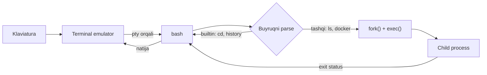

# 01. Shell va terminal

> Manba: TLCL 1 va 8-boblar · Muhit: Ubuntu 24.04, bash 5.2 · [← Kurs xaritasi](00-README.md) · [Keyingi dars: navigation-and-filesystem →](02-navigation-and-filesystem.md)

## Nima uchun kerak

Siz kuniga o'nlab marta terminalga kirasiz: `docker exec`, `kubectl logs`, SSH orqali serverga ulanish, git bilan ishlash. Lekin ko'pchilik developer shell ni "buyruq teradigan joy" deb biladi, xolos — natijada bitta uzun buyruqni qayta terish uchun 30 soniya sarflaydi, `Ctrl+R` bilan buni 2 soniyada topish mumkinligini bilmaydi. Bu dars ikkita narsani beradi: (1) shell aslida nima ekanligini ichki mexanizmi bilan tushunish — bu keyingi 23 darsning poydevori; (2) readline va history ko'nikmalari — bugundan boshlab har kuni vaqt tejaydigan muscle memory.

## Nazariya

### Shell nima?

**Shell** — klaviaturadan kiritilgan buyruqlarni qabul qilib, ularni operatsion tizimga bajarish uchun uzatadigan dastur. Deyarli barcha Linux distributivlar GNU loyihasining **bash** (Bourne Again Shell) shell i bilan keladi — bu Unix ning original `sh` (Steve Bourne yozgan) shell ining yaxshilangan o'rnini bosuvchisi.

Muhim nuqta: shell — OS ning bir qismi emas, **oddiy user-space dastur**. Uni almashtirish mumkin (zsh, fish), bir vaqtda bir nechtasini ishga tushirish mumkin. Go dasturchi sifatida tasavvur qiling: shell — bu cheksiz `for` loopda `read → parse → fork+exec → wait` qiladigan REPL:



### Terminal, tty va pty

**Terminal emulator** (gnome-terminal, iTerm2, Windows Terminal...) — grafik muhitda shell ga kirish beruvchi dastur. Tarixan terminal — katta kompyuterga serial kabel bilan ulangan alohida qurilma (klaviatura + ekran) bo'lgan. Bu meros hozirgacha nomlarda yashaydi:

- **tty** (teletype) — terminal qurilmasining kernel dagi vakili. `tty` buyrug'i qaysi terminal device da o'tirganingizni aytadi.
- **pty** (pseudo-terminal) — zamonaviy "soxta" terminal jufti: terminal emulator bir tomonida, shell ikkinchi tomonida. SSH va `docker exec -it` ham aynan pty yaratadi — `-t` flag "menga tty ajrat" degani.

```console
$ tty
/dev/pts/1
```

Agar `docker exec` ni `-t` siz ishlatsangiz, `tty` `not a tty` deb javob beradi — shuning uchun ba'zi interaktiv dasturlar (top, vim) `-it` siz ishlamaydi. Tanish muammomi?

### Prompt anatomiyasi

```
me@linuxbox:~$
```

`username@hostname`, joriy katalog (`~` = home), va oxirida `$`. Agar oxirgi belgi `#` bo'lsa — sessiya **root** (superuser) huquqida ishlayapti. Bu farqni bir qarashda ko'rish refleksga aylanishi kerak: `#` ko'rsangiz — har bir buyruq tizimni buzishi mumkin.

### Readline — nega shortcut lar hamma joyda bir xil

bash buyruq qatorini tahrirlash uchun **GNU Readline** kutubxonasidan foydalanadi. `psql`, `python` REPL, `gdb`, `mysql` ham xuddi shu kutubxonani ishlatadi — shuning uchun `Ctrl+A`, `Ctrl+R` ularning hammasida bir xil ishlaydi. Bir marta o'rgansangiz — hamma joyda ishlatasiz.

Eslatma: hujjatlarda **Meta** klavishi deyilganda zamonaviy klaviaturada **Alt** nazarda tutiladi (macOS terminalda — Option, ba'zan Esc ni bosib-qo'yib yuborish ham ishlaydi).

## Buyruqlar

### Birinchi buyruqlar

Har biri Ubuntu 24.04 da ishga tushirilib tekshirilgan:

```bash
date        # joriy sana va vaqt
```
```console
$ date
Fri Jul 10 09:19:36 UTC 2026
```

```bash
cal         # joriy oy kalendari (Ubuntu da: apt install ncal)
```
```console
$ cal
     July 2026
Su Mo Tu We Th Fr Sa
          1  2  3  4
 5  6  7  8  9 10 11
12 13 14 15 16 17 18
19 20 21 22 23 24 25
26 27 28 29 30 31
```

```bash
df -h       # disklardagi bo'sh joy (-h = human-readable)
```
```console
$ df -h
Filesystem      Size  Used Avail Use% Mounted on
overlay         453G   12G  419G   3% /
tmpfs            64M     0   64M   0% /dev
shm              64M     0   64M   0% /dev/shm
```

```bash
free -h     # RAM holati (-h = human-readable)
```
```console
$ free -h
               total        used        free      shared  buff/cache   available
Mem:           7.8Gi       883Mi       6.5Gi       560Ki       516Mi       6.9Gi
Swap:          1.0Gi          0B       1.0Gi
```

Backend dev uchun `free` o'qishda bitta klassik tuzoq: **`free` ustuniga emas, `available` ustuniga qarang.** Linux bo'sh RAM ni disk cache (buff/cache) uchun ishlatadi — bu "band" emas, kerak bo'lganda darhol bo'shatiladi.

```bash
exit        # terminal sessiyasini tugatish (yoki Ctrl+D)
clear       # ekranni tozalash (yoki Ctrl+L)
```

### Kursorni boshqarish (readline)

| Klavish | Amal |
|---------|------|
| `Ctrl+A` | Qator boshiga |
| `Ctrl+E` | Qator oxiriga |
| `Alt+F` / `Alt+B` | Bir so'z oldinga / orqaga |
| `Ctrl+F` / `Ctrl+B` | Bir belgi oldinga / orqaga (= o'ng/chap strelka) |
| `Ctrl+L` | Ekranni tozalash (`clear` bilan bir xil) |

### Matnni tahrirlash va kill-ring

Readline da "cut/paste" **killing and yanking** deb ataladi. Kesilgan matn **kill-ring** degan doiraviy buferda saqlanadi:

| Klavish | Amal |
|---------|------|
| `Ctrl+K` | Kursordan qator **oxirigacha** kesish |
| `Ctrl+U` | Kursordan qator **boshigacha** kesish |
| `Ctrl+W` / `Alt+Backspace` | Oldingi so'zni kesish |
| `Alt+D` | Keyingi so'zni kesish |
| `Ctrl+Y` | Kill-ring dan qaytarish (yank/paste) |
| `Ctrl+T` | Ikki belgini almashtirish (typo fix) |
| `Alt+U` / `Alt+L` | So'zni UPPER / lower registrga |

Amaliy misol: uzun buyruq terdingiz, lekin avval boshqa buyruq bajarish kerakligi esingizga tushdi → `Ctrl+U` (kesish) → boshqa buyruqni bajaring → `Ctrl+Y` (qaytarish).

Mavjud bindinglarni ko'rish:

```bash
bind -p | grep -v self-insert | less
```
```console
$ bind -p | grep -E "beginning-of-line|end-of-line" | head -3
"\C-a": beginning-of-line
"\M-OH": beginning-of-line
"\M-[H": beginning-of-line
```

### Tab completion

`Tab` — fayl yo'llari, buyruq nomlari, `$` bilan boshlansa variable lar, `~` bilan boshlansa user lar uchun avtomatik dopolneniya. Bitta `Tab` — yagona variant bo'lsa to'ldiradi; ikki marta `Tab` — barcha variantlarni ko'rsatadi. Zamonaviy distributivlarda **programmable completion** (`bash-completion` paketi) `git`, `docker`, `kubectl` subcommand larini ham to'ldiradi:

```bash
# kubectl completion o'rnatilgan bo'lsa:
kubectl des<Tab>       # → kubectl describe
docker im<Tab><Tab>    # → image images import
```

### History — buyruqlar tarixi

Tarix `~/.bash_history` faylida saqlanadi. Ubuntu 24.04 default qiymatlari (tekshirilgan):

```console
$ echo "HISTSIZE=$HISTSIZE HISTFILESIZE=$HISTFILESIZE HISTCONTROL=$HISTCONTROL"
HISTSIZE=1000 HISTFILESIZE=2000 HISTCONTROL=ignoredups:ignorespace
```

- `HISTSIZE` — xotiradagi (sessiya) tarix hajmi
- `HISTFILESIZE` — fayldagi tarix hajmi
- `HISTCONTROL=ignoredups:ignorespace` — ketma-ket duplikatlar saqlanmaydi; **probel bilan boshlangan buyruq tarixga yozilmaydi** (parol/token bor buyruq uchun foydali!)

```bash
history              # to'liq tarix (raqamlangan)
history | grep ssh   # tarixdan qidirish
```
```console
$ history | grep /usr/bin
    1  ls -l /usr/bin
```

**`Ctrl+R` — incremental reverse search.** Tarix bilan ishlashning eng muhim usuli:

1. `Ctrl+R` bosing → prompt `(reverse-i-search)` ga o'zgaradi
2. Qidiruv matnini tering — har belgi bilan natija aniqlashadi
3. `Enter` — topilganni bajarish; `Ctrl+J` — tahrirlash uchun qatorga olish; yana `Ctrl+R` — oldingi mosligiga o'tish; `Ctrl+G` — bekor qilish

### History expansion — `!` sintaksisi

| Ifoda | Amal |
|-------|------|
| `!!` | Oxirgi buyruqni takrorlash |
| `!42` | Tarixdagi 42-buyruqni bajarish |
| `!ssh` | `ssh` bilan boshlangan oxirgi buyruq |
| `!?conf?` | Ichida `conf` bo'lgan oxirgi buyruq |

Tekshirilgan misollar (`history -p` — bajarilmasdan nima expand bo'lishini ko'rsatadi):

```console
$ history -p "!!"
echo salom
$ history -p "!e"
echo salom
$ history -p "!?usr?"
ls -l /usr/bin
```

Klassik use case — `sudo` esdan chiqqanda:

```bash
apt install htop        # Permission denied...
sudo !!                 # = sudo apt install htop
```

Ehtiyot bo'ling: `!string` va `!?string?` ni tarixda aynan nima borligini bilmasangiz ishlatmang — kutilmagan buyruq bajarilib ketishi mumkin (pastdagi Xatolar bo'limiga qarang).

### `script` — sessiyani yozib olish

```bash
script deploy-session.log    # shu yerdan boshlab hamma narsa faylga yoziladi
# ... ishlaringiz ...
exit                          # yozishni to'xtatish
```
```console
$ script --version
script from util-linux 2.39.3
```

Production da incident paytida qilingan amallarni hujjatlashtirish uchun juda qulay (postmortem uchun tayyor material).

## Real-world scenariylar

**1. Incident paytida murakkab buyruqni qayta topish.** Uch hafta oldin log larni filtrlash uchun uzun `journalctl ... | grep -E ...` pipeline yozgan edingiz. Yechim: `Ctrl+R` → `journalctl` → yana `Ctrl+R` bilan variantlarni aylanib chiqing. Yoki `history | grep journalctl`.

**2. Docker konteyner ichida "not a tty" xatosi.** CI da `docker exec mycontainer top` ishlamayapti. Sabab: `top` ga tty kerak, lekin exec pty ajratmagan. Yechim: interaktiv kerak bo'lsa `docker exec -it`, script da esa tty talab qilmaydigan variant: `docker exec mycontainer top -b -n1`.

**3. Token ni tarixga yozib qo'ymaslik.** `curl -H "Authorization: Bearer eyJhbG..."` ni ishga tushirishdan oldin — buyruq boshiga **bitta probel** qo'ying: `HISTCONTROL=ignorespace` tufayli u `~/.bash_history` ga tushmaydi. (Server umumiy bo'lsa, bu faylni boshqa admin lar o'qiy olishini unutmang.)

## Zamonaviy yondashuv

**History konfiguratsiyasini kuchaytirish** — default 1000 juda kam. `~/.bashrc` ga:

```bash
HISTSIZE=100000
HISTFILESIZE=200000
HISTCONTROL=ignoreboth:erasedups   # ignoreboth = ignoredups + ignorespace
HISTTIMEFORMAT='%F %T '            # har yozuvga timestamp (audit uchun)
shopt -s histappend                # sessiya tarixni ustidan yozmasdan qo'shadi
```

Muhim nuance: bash tarixni **faqat sessiya tugaganda** faylga yozadi — SSH sessiya uzilib qolsa, tarix yo'qoladi. Har buyruqdan keyin yozish uchun: `PROMPT_COMMAND="history -a"`.

**Zamonaviy tool lar:**

- **[fzf](https://github.com/junegunn/fzf)** — fuzzy finder; o'rnatilganda `Ctrl+R` ni interaktiv fuzzy-search ga almashtiradi. Eng kam invaziv upgrade, birinchi bo'lib shuni sinang.
- **[atuin](https://atuin.sh)** — tarixni SQLite ga yozadi, mashinalar orasida **encrypted sync**, katalog bo'yicha filtr (`cwd filter` — "shu papkada qanday buyruqlar ishlatganman?"), exit status saqlaydi. 2026 da eng mashhur history tool.
- **mcfly**, **hstr** — yengilroq alternativalar.
- `~/.inputrc` orqali readline ni sozlash mumkin (masalan, case-insensitive completion: `set completion-ignore-case on`).

Nima eskirgan: `!` history expansion ko'p zamonaviy setup larda o'chiriladi — `Ctrl+R`/fzf/atuin bilan bir xil ishni xavfsizroq qilish mumkin. Bilish kerak (eski script va manuallarda uchraydi), lekin yangi muscle memory ni `Ctrl+R` atrofida quring.

## Keng tarqalgan xatolar

1. **Terminalda `Ctrl+C` / `Ctrl+V` bilan copy/paste qilishga urinish.** Bu kombinatsiyalar shell da boshqa ma'noga ega (`Ctrl+C` — processni o'ldirish signali!). To'g'ri: `Ctrl+Shift+C` / `Ctrl+Shift+V` (ko'p terminal emulatorlarda) yoki sichqoncha bilan belgilash.

2. **`free` chiqishida "free" ustunini ko'rib "RAM tugayapti!" deb vahima qilish.** Linux RAM ni cache uchun ishlatadi — bu normal. To'g'ri metrika: `available` ustuni.

3. **`!r` kabi qisqa history expansion ni ko'r-ko'rona ishlatish.** Tarixda oxirgi `r` bilan boshlangan buyruq `rm -rf ...` bo'lsa — u bajariladi. To'g'ri: avval `!r:p` (`:p` = print, bajarmasdan ko'rsatish) yoki umuman `Ctrl+R` ishlating.

4. **Root prompt (`#`) da ekanini sezmaslik.** `$` va `#` farqiga e'tibor refleksi yo'qligi — "nega bu server buzildi" savolining klassik boshlanishi. Root da faqat kerak paytda ishlang.

5. **Har safar uzun buyruqni boshidan terish.** Strelka + `Ctrl+A`/`Ctrl+E`/`Alt+B` kombinatsiyalarini bilmaslik kuniga daqiqalab vaqt yeydi. Bir hafta ataylab mashq qiling — keyin o'zi chiqadi.

## Amaliy mashqlar

Muhit: `docker run -it --rm ubuntu:24.04 bash` (yoki istalgan Linux/macOS terminal).

**1.** `date`, `cal`, `df -h`, `free -h` ni ishga tushiring. `free` chiqishidan: sizda qancha `available` RAM bor?

<details><summary>Yechim</summary>

```console
$ free -h
               total        used        free      shared  buff/cache   available
Mem:           7.8Gi       883Mi       6.5Gi       560Ki       516Mi       6.9Gi
```
`available` ustuni — bu misolda 6.9Gi. Konteynerda `cal` yo'q bo'lsa: `apt update && apt install -y ncal`.
</details>

**2.** `echo salom dunyo bu test` deb tering (Enter bosmasdan). Faqat klaviatura bilan: kursorni `salom` so'ziga olib boring va uni `assalomu` ga almashtiring.

<details><summary>Yechim</summary>

`Ctrl+A` (qator boshi) → `Alt+F` (echo dan keyin) → `Alt+D` (salom ni kesish) → `assalomu` deb tering. Yoki: `Alt+B` bilan orqaga so'zma-so'z qaytish ham mumkin.
</details>

**3.** Uzun buyruq tering: `echo bu juda uzun va muhim buyruq`. Enter bosmasdan uni butunlay kesib oling, `pwd` ni bajaring, keyin kesilgan buyruqni qaytarib bajaring.

<details><summary>Yechim</summary>

`Ctrl+A` → `Ctrl+K` (yoki to'g'ridan-to'g'ri `Ctrl+U` qator oxirida tursangiz) → `pwd` + Enter → `Ctrl+Y` → Enter.
</details>

**4.** Kamida 5 ta har xil buyruq bajaring. Keyin `Ctrl+R` bilan ulardan bittasini toping va **tahrirlash uchun** qatorga oling (bajarmasdan).

<details><summary>Yechim</summary>

`Ctrl+R` → qidiruv matni → topilganda `Ctrl+J` (yoki chap/o'ng strelka) — buyruq qatorga tushadi, lekin bajarilmaydi. `Enter` bossangiz — darhol bajariladi.
</details>

**5.** `history` dan biror buyruqning raqamini toping va `!raqam` bilan takrorlang. Keyin xuddi shu buyruqni `!?matn?` shakli bilan chaqiring.

<details><summary>Yechim</summary>

```console
$ history | grep echo
    3  echo salom
$ !3
echo salom
salom
$ !?salom?
echo salom
salom
```
</details>

**6.** Probel bilan boshlangan buyruq tarixga tushmasligini isbotlang.

<details><summary>Yechim</summary>

```console
$  echo maxfiy-token        # boshida probel!
maxfiy-token
$ history | tail -2
```
`echo maxfiy-token` tarixda yo'q — `HISTCONTROL` da `ignorespace` bo'lgani uchun. `echo $HISTCONTROL` bilan tekshiring.
</details>

**7.** (Qiyinroq) `script mashq.log` bilan sessiya yozishni boshlang, 2-3 buyruq bajaring, `exit` qiling. Keyin `cat mashq.log` bilan yozuvni ko'ring. Nega faylda `^[[?2004h` kabi g'alati belgilar bor?

<details><summary>Yechim</summary>

`script` terminalga yuborilgan **hamma** baytlarni yozadi — jumladan ANSI escape sequence larni (rang, bracketed paste mode). Ularni tozalab o'qish: `less -R mashq.log` yoki `col -b < mashq.log`.
</details>

## Cheat sheet

| Buyruq / Klavish | Nima qiladi | Eng ko'p ishlatiladigan variant |
|------------------|-------------|--------------------------------|
| `date` | Sana/vaqt | `date` |
| `df` | Disk bo'sh joyi | `df -h` |
| `free` | RAM holati | `free -h` (available ga qarang) |
| `history` | Buyruqlar tarixi | `history \| grep <matn>` |
| `Ctrl+R` | Tarixdan incremental qidiruv | `Ctrl+R` → matn → `Ctrl+J` |
| `!!` | Oxirgi buyruq | `sudo !!` |
| `Ctrl+A` / `Ctrl+E` | Qator boshi / oxiri | — |
| `Alt+F` / `Alt+B` | So'z oldinga / orqaga | — |
| `Ctrl+K` / `Ctrl+U` | Oxirigacha / boshigacha kesish | — |
| `Ctrl+W` | Oldingi so'zni kesish | — |
| `Ctrl+Y` | Kesilganni qaytarish | — |
| `Ctrl+L` | Ekran tozalash | — |
| `tty` | Qaysi terminaldaman | `tty` |
| `script` | Sessiyani faylga yozish | `script incident.log` |

## Qo'shimcha manbalar

- [Bash Reference Manual — Command Line Editing](https://www.gnu.org/software/bash/manual/html_node/Command-Line-Editing.html) — readline ning rasmiy hujjati
- [Keyboard shortcuts every CLI hacker should know about GNU Readline](https://www.masteringemacs.org/article/keyboard-shortcuts-every-command-line-hacker-should-know-about-gnu-readline) — readline ni chuqur tushuntiradigan sifatli maqola
- [Atuin — Magical Shell History](https://atuin.sh) — zamonaviy history tool ning rasmiy sayti

---

[← Kurs xaritasi](00-README.md) · [Keyingi dars: 02 — navigation-and-filesystem →](02-navigation-and-filesystem.md)
