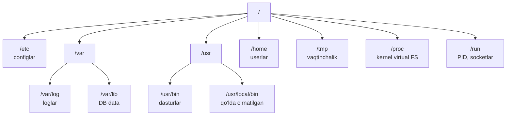

# 02. Navigatsiya va fayl tizimi

> Manba: TLCL 2 va 3-boblar · Muhit: Ubuntu 24.04, bash 5.2 · [← Oldingi: shell-and-terminal](01-shell-and-terminal.md) · [Kurs xaritasi](00-README.md) · [Keyingi: file-operations →](03-file-operations.md)

## Nima uchun kerak

Production serverga SSH bilan kirdingiz — log qayerda? Config qayerda? Binary qayerda? Bu savollarga javob bermasdan hech qanday debugging boshlanmaydi. Docker image ichini `docker exec` bilan tekshirayotganingizda ham xuddi shu bilim ishlaydi: FHS (Filesystem Hierarchy Standard) ni bilgan odam notanish tizimda ham 30 soniyada mo'ljal oladi. Bu dars — Linux fayl tizimining "xaritasi" va u bo'ylab harakatlanish asboblari.

## Nazariya

### Yagona daraxt

Windows dan farqli o'laroq (har disk — alohida `C:\`, `D:\`), Linux da **har doim bitta fayl tizimi daraxti** bor. Barcha disklar, USB, network storage — daraxtning turli nuqtalariga **mount** qilinadi. Daraxt tepasi — **root directory** `/`.

Har qanday vaqtda siz daraxtning bitta nuqtasida turasiz — bu **current working directory**. Yo'llar ikki xil:

- **Absolute path** — `/` dan boshlanadi: `/usr/bin`
- **Relative path** — joriy katalogdan boshlanadi: `.` (joriy katalog), `..` (parent katalog)

### Fayl nomlari haqida 4 ta fakt

1. `.` bilan boshlangan fayllar — **hidden** (`ls` ko'rsatmaydi, `ls -a` ko'rsatadi). Config fayllar an'anasi: `.bashrc`, `.gitconfig`.
2. Linux **case-sensitive**: `File1` va `file1` — ikki xil fayl. (macOS default fayl tizimi case-insensitive — cross-platform Go loyihalarda import path muammolarining manbasi!)
3. Fayl nomida probel ishlatmang — keyin har bir script da quoting bilan kurashasiz. So'zlarni `-` yoki `_` bilan ajrating.
4. Linux da "fayl kengaytmasi" tushunchasi tizim darajasida **yo'q** — `.jpg` shunchaki nomning qismi. Fayl turini kontent bo'yicha `file` buyrug'i aniqlaydi.

### FHS — kataloglar xaritasi

Tizim tuzilishi **Filesystem Hierarchy Standard** (FHS 3.0) bilan standartlashtirilgan. Backend developer eng ko'p ishlatadigan qismlari:

| Katalog | Nima bor | Backend dev uchun ahamiyati |
|---------|----------|------------------------------|
| `/etc` | Tizim config fayllari (deyarli hammasi plain text) | nginx, systemd, cron configlarini shu yerdan topasiz |
| `/var/log` | Log fayllar | Debugging ning birinchi manzili |
| `/var` | O'zgaruvchan data: DB fayllar, cache, queue | PostgreSQL data odatda `/var/lib/postgresql` da |
| `/home` | Oddiy userlar home kataloglari | Deploy user ning fayllari |
| `/root` | root userning home i (`/home/root` EMAS) | — |
| `/usr/bin` | Distributiv o'rnatgan dasturlar | `which go` ko'pincha shu yerni ko'rsatadi |
| `/usr/local/bin` | Qo'lda o'rnatilgan dasturlar | O'zingiz qo'ygan binarylar shu yerga |
| `/opt` | "Optional" — uchinchi tomon katta paketlar | Ba'zi vendor softlar |
| `/tmp` | Vaqtinchalik fayllar (reboot da tozalanishi mumkin) | Temp fayllar; muhim narsa saqlamang |
| `/dev` | Device fayllar ("hamma narsa fayl") | `/dev/null`, `/dev/stdout` — redirection darsida |
| `/proc` | Virtual FS — kernel ning "ko'zoynagi", diskda yo'q | Process/memory info; monitoring toollar shu yerdan o'qiydi |
| `/boot` | Kernel va bootloader | Konteynerda odatda bo'sh/yo'q |
| `/run` | Runtime data: PID fayllar, socketlar (tmpfs) | `docker.sock` ham shu yerda: `/run/docker.sock` |



Muhim zamonaviy o'zgarish — **usr-merge**: zamonaviy distributivlarda `/bin`, `/sbin`, `/lib` endi real kataloglar emas, `/usr` ichiga symlink. Ubuntu 24.04 da tekshirilgan:

```console
$ ls -ld /bin /sbin /lib
lrwxrwxrwx 1 root root 7 Apr 22  2024 /bin -> usr/bin
lrwxrwxrwx 1 root root 7 Apr 22  2024 /lib -> usr/lib
lrwxrwxrwx 1 root root 8 Apr 22  2024 /sbin -> usr/sbin
```

Shuning uchun eski kitoblardagi "/bin — boot uchun kritik dasturlar, /usr/bin — qolganlari" bo'linishi endi tarixiy fakt, amalda ikkalasi bir joy.

## Buyruqlar

### `pwd` — qayerdaman?

```bash
pwd
```
```console
$ pwd
/root
```

### `cd` — katalogni almashtirish

```bash
cd /usr/bin    # absolute path
cd ..          # parent katalogga
cd ./bin       # relative (./ ni yozmasa ham bo'ladi: cd bin)
cd             # argumentsiz — home katalogga
cd -           # OLDINGI katalogga (juda foydali!)
cd ~postgres   # postgres userning home iga
```

Tekshirilgan:

```console
$ cd /usr/bin && pwd
/usr/bin
$ cd .. && pwd
/usr
$ cd && pwd
/root
$ cd /var/log && cd /etc && cd -
/var/log
```

`cd -` ikki katalog orasida "toggle" qiladi — config va log orasida yugurayotganda oltin buyruq.

### `ls` — katalog tarkibi

Sintaksis: `ls [options] [fayl yoki katalog...]`

| Flag | Uzun varianti | Nima qiladi |
|------|---------------|-------------|
| `-l` | — | Long format (permissions, owner, size, date) |
| `-a` | `--all` | Hidden fayllarni ham ko'rsatish |
| `-h` | `--human-readable` | Hajmni KB/MB/GB da (faqat `-l` bilan) |
| `-t` | — | Vaqt bo'yicha sortlash (eng yangi birinchi) |
| `-r` | `--reverse` | Teskari tartib |
| `-S` | — | Hajm bo'yicha sortlash |
| `-d` | `--directory` | Katalogning o'zini ko'rsatish (ichini emas) |
| `-F` | `--classify` | Tur indikatori qo'shish (`/` katalog, `@` symlink, `*` executable) |

Bir nechta joyni bitta buyruqda:

```bash
ls ~ /usr
```

Eng ko'p ishlatiladigan kombinatsiyalar (tekshirilgan):

```bash
ls -lh /var/log     # loglar hajmi bilan
```
```console
$ ls -lh /var/log | head -6
total 260K
-rw-r--r-- 1 root root 4.9K Jul 10 09:17 alternatives.log
drwxr-xr-x 1 root root 4.0K Jul 10 09:19 apt
-rw-r--r-- 1 root root  60K Jun 10 02:09 bootstrap.log
-rw-rw---- 1 root utmp    0 Jun 10 02:09 btmp
-rw-r--r-- 1 root root 181K Jul 10 09:19 dpkg.log
```

```bash
ls -lt /etc | head   # oxirgi o'zgargan configlar — "kim nimani o'zgartirdi?"
```
```console
$ ls -lt /etc | head -5
total 296
-rw-r--r-- 1 root root    5259 Jul 10 09:17 ld.so.cache
drwxr-xr-x 1 root root    4096 Jul 10 09:17 alternatives
-rw-r--r-- 1 root root     172 Jul 10 09:16 hosts
-rw-r--r-- 1 root root     222 Jul 10 09:16 resolv.conf
```

```bash
ls -a ~              # home dagi hidden configlar
```
```console
$ ls -a ~
.  ..  .bash_history  .bashrc  .profile
```

```bash
ls -F /              # turlarni indikator bilan
```
```console
$ ls -F / | head -8
bin@
boot/
dev/
etc/
home/
lib@
media/
mnt/
```

(`@` — symlink: usr-merge ni shu yerda ham ko'ryapmiz.)

### Long format ni o'qish

```
-rw-r--r-- 1 root root 3576296 2024-04-03 11:05 app.log
│          │ │    │    │       │                └─ nomi
│          │ │    │    │       └─ oxirgi o'zgarish vaqti
│          │ │    │    └─ hajmi (bayt)
│          │ │    └─ group (egasi guruh)
│          │ └─ owner (egasi user)
│          └─ hard link lar soni
└─ tur + permissions: 1-belgi tur (- fayl, d katalog, l symlink),
   keyin 3×3: owner / group / others huquqlari (07-darsda batafsil)
```

### `file` — fayl turini aniqlash

```bash
file /etc/hosts /usr/bin/ls /bin
```
```console
$ file /etc/hosts
/etc/hosts: ASCII text
$ file /usr/bin/ls
/usr/bin/ls: ELF 64-bit LSB pie executable, ARM aarch64, version 1 (SYSV), dynamically linked, ...
$ file /bin
/bin: symbolic link to usr/bin
```

`file` nomga emas, **kontentga** qaraydi (magic bytes). "Bu binary qaysi arxitektura uchun?" degan savolga ham javob beradi — cross-compile qilingan Go binaryni serverga deploy qilganda `Exec format error` chiqsa, birinchi tekshiruv shu.

### `less` — pager

```bash
less /etc/passwd
```

Ichidagi klavishlar:

| Klavish | Amal |
|---------|------|
| `Space` / `b` | Sahifa pastga / tepaga |
| `G` / `g` | Fayl oxiriga / boshiga |
| `/matn` | Pastga qidirish |
| `n` / `N` | Keyingi / oldingi topilma |
| `q` | Chiqish |
| `h` | Yordam |

Nomi — "less is more" so'z o'yini: eski `more` pageridan farqli, ikki yo'nalishda aylana oladi. `less` katta fayl ni **to'liq yuklamaydi** — 5GB log faylni ham bir zumda ochadi (shuning uchun log o'qishda `cat` emas, `less` ishlating).

### Symlink va hard link (birinchi tanishuv)

Katalog listinglarida shunday yozuvlarni ko'rasiz:

```console
$ ls -l /usr/lib/aarch64-linux-gnu/ | grep "^l" | head -3
lrwxrwxrwx  1 root root      18 Oct  2  2024 libacl.so.1 -> libacl.so.1.1.2302
lrwxrwxrwx  1 root root      19 Oct 22  2024 libapt-pkg.so.6.0 -> libapt-pkg.so.6.0.0
```

**Symbolic link (symlink)** — boshqa faylga "ko'rsatkich". Klassik use case — versiyalash: dastur `libacl.so.1` ni ochadi, symlink esa aslida `libacl.so.1.1.2302` ga olib boradi. Yangi versiya chiqsa — faqat symlink almashtiriladi, dasturlarni o'zgartirish shart emas. Xuddi shu pattern deploy da ham: `current -> releases/v2.4.1`. Rollback = symlinkni eski versiyaga qaytarish, 1 soniya.

**Hard link** — bir fayl kontentiga ikkinchi "asl nom". Farqlarini keyingi darsda `ln` bilan amaliy ko'ramiz.

### `/proc` — kernel bilan suhbat

```bash
cat /proc/version
head -4 /proc/meminfo
```
```console
$ cat /proc/version
Linux version 6.12.76-linuxkit (root@buildkitsandbox) (gcc (Alpine 15.2.0) 15.2.0, ...) #1 SMP Thu Jun 25 13:45:40 UTC 2026
$ head -4 /proc/meminfo
MemTotal:        8126480 kB
MemFree:         6986668 kB
MemAvailable:    7357004 kB
Buffers:           27880 kB
```

Bu fayllar diskda yo'q — kernel ularni o'qilgan paytda generatsiya qiladi. `top`, `htop`, Prometheus node_exporter — hammasi aslida `/proc` ni o'qiydi.

## Real-world scenariylar

**1. Notanish serverda birinchi 2 daqiqa.** SSH bilan kirdingiz, servis nima qilayotganini bilmaysiz:

```bash
cd /var/log && ls -lt | head        # qaysi loglar hozir yozilyapti?
ls -lt /etc | head                  # yaqinda qaysi config o'zgargan?
ls /usr/local/bin /opt              # qo'lda nima o'rnatilgan?
```

**2. Docker image ichini tekshirish.** Multi-stage build dan keyin image ga nima tushganini ko'rish:

```bash
docker run --rm -it myapp:latest sh
ls -lh /app                         # binary hajmi kutilgandekmi?
file /app/server                    # to'g'ri arxitekturami? (amd64 serverga arm64 binary — klassik xato)
```

**3. "No space left on device" — lekin qayerda?** Katta fayllarni qidirish `ls -S` bilan boshlanadi:

```bash
ls -lhS /var/log | head             # eng katta loglar tepada
```

(Tizim bo'ylab qidirish uchun `du` — 12-darsda.)

## Zamonaviy yondashuv

- **[eza](https://github.com/eza-community/eza)** — `ls` ning Rust dagi zamonaviy o'rnini bosuvchisi (o'lik `exa` ning davomchisi): rangli output, per-fayl **git status**, `--tree` (alohida `tree` buyrug'i kerak emas), `--icons`. Odatiy alias: `alias ls='eza'`, `alias ll='eza -la --git'`.
- **[zoxide](https://github.com/ajeetdsouza/zoxide)** — "aqlli `cd`": qaysi kataloglarga tez-tez kirishingizni o'rganadi (frecency algoritmi), keyin `z proj` deb yozsangiz eng mos katalogga sakraydi. `cd ~/work/company/backend/services/auth` o'rniga `z auth`.
- **`tree`** — katalog strukturasini daraxt shaklida ko'rsatadi (`apt install tree`); README ga struktura qo'yish uchun standart.
- **Script uchun `ls` EMAS**: `ls` output i odam uchun, machine-parsing uchun emas (quyida Xatolar 5-band). Script da `find` yoki shell glob ishlating.
- FHS bilishi kerak bo'lgan zamonaviy nuance lar: usr-merge (yuqorida), `/var/run` → `/run` ko'chishi (eski yo'l endi symlink), va konteyner imagelar FHS ning minimal qismini oladi (distroless da `/etc` deyarli bo'sh).

## Keng tarqalgan xatolar

1. **`cd` + `ls` ni har safar alohida terish** o'rniga to'g'ridan-to'g'ri `ls -lt /var/log` — buyruqlarning ko'pi katalogga "kirmasdan" ishlaydi. `cd` faqat u yerda ko'p ish qilmoqchi bo'lsangiz kerak.

2. **`ls -l` da katalog o'rniga ichi chiqishi.** `ls -l /etc` katalog *ichini* ko'rsatadi. Katalogning *o'zi* haqida info kerak bo'lsa (permissions tekshirish): `ls -ld /etc`.

3. **Hidden fayllarni unutish.** "Config yo'q-ku!" — `ls` ishlatgansiz, config esa `.env` yoki `.config/` ichida. Refleks: notanish katalogda doim `ls -la`.

4. **root ning home i `/home/root` deb o'ylash.** Root ning home i — `/root`. `/home` faqat oddiy userlar uchun. CI scriptlarda `~` root uchun `/root` ga expand bo'lishini unutmang.

5. **Script da `ls` outputini parse qilish.** `for f in $(ls *.log)` — probelli nomlarda buziladi, ranglar/escape belgilar aralashadi. To'g'ri: `for f in *.log` (shell glob o'zi ro'yxatni beradi) yoki `find . -name '*.log'`. [Nega — batafsil](https://mywiki.wooledge.org/ParsingLs).

6. **Binary faylni `less`/`cat` bilan ochib terminalni buzish.** Ekran "ieroglif" bo'lib qolsa — `reset` buyrug'i terminalni tiklaydi. Ochishdan oldin `file` bilan turini tekshiring.

## Amaliy mashqlar

Muhit: `docker run -it --rm ubuntu:24.04 bash`

**1.** Home katalogingizdan `/var/log` ga o'ting, keyin **bitta buyruq bilan** avvalgi katalogga qayting. Yana bitta buyruq bilan yana `/var/log` ga qayting.

<details><summary>Yechim</summary>

```console
$ cd /var/log
$ cd -        # home ga qaytdi
/root
$ cd -        # yana /var/log ga
/var/log
```
`cd -` `$OLDPWD` ga o'tadi va yangi joyni ekranga chiqaradi.
</details>

**2.** `/etc` dagi fayllarni oxirgi o'zgarish vaqti bo'yicha, **eng eskisi tepada** bo'lib chiqadigan qilib ko'rsating.

<details><summary>Yechim</summary>

```bash
ls -ltr /etc | head
```
`-t` vaqt bo'yicha (yangi→eski), `-r` teskari qiladi (eski→yangi). `ls -lt --reverse /etc` ham xuddi shu.
</details>

**3.** `/usr/bin` da nechta hidden fayl bor? Isbotini ko'rsating.

<details><summary>Yechim</summary>

```console
$ ls -a /usr/bin | head -3
.
..
[
```
Faqat `.` va `..` chiqadi (va `[` degan haqiqiy buyruq — bu hidden emas!). Dastur kataloglarida hidden fayllar odatda bo'lmaydi; hidden config pattern i home kataloglarga xos.
</details>

**4.** `file` yordamida aniqlang: `/etc/os-release`, `/usr/bin/apt`, `/dev/null` — bu uchtasi qanday turdagi "fayllar"?

<details><summary>Yechim</summary>

```console
$ file /etc/os-release /usr/bin/apt /dev/null
/etc/os-release: symbolic link to ../usr/lib/os-release
/usr/bin/apt:    ELF 64-bit LSB pie executable, ...
/dev/null:       character special (1/3)
```
Uch xil dunyoni ko'rdik: symlink, binary dastur, device fayl ("hamma narsa fayl" tamoyili).
</details>

**5.** `less /etc/passwd` oching. Faylni ochgan holda: oxiriga o'ting, boshiga qaytıng, ichidan `root` so'zini qidiring, keyingi topilmaga o'ting, chiqing.

<details><summary>Yechim</summary>

`G` (oxiriga) → `g` (boshiga) → `/root` + Enter → `n` (keyingi) → `q` (chiqish).
</details>

**6.** Ubuntu 24.04 da `/bin` haqiqiy katalogmi yoki symlinkmi? Buni **ikki xil** buyruq bilan isbotlang.

<details><summary>Yechim</summary>

```console
$ ls -ld /bin
lrwxrwxrwx 1 root root 7 Apr 22  2024 /bin -> usr/bin
$ file /bin
/bin: symbolic link to usr/bin
```
Bu — usr-merge. `ls -F /` dagi `bin@` belgisi ham uchinchi isbot.
</details>

**7.** (Qiyinroq) `/proc` dan foydalanib: kernel versiyasini, RAM miqdorini va o'z shell processingizning nomini toping (maslahat: `/proc/self`).

<details><summary>Yechim</summary>

```console
$ cat /proc/version
Linux version 6.12.76-linuxkit ...
$ head -1 /proc/meminfo
MemTotal:        8126480 kB
$ cat /proc/self/comm
cat
```
Kutilmagan natija: `/proc/self` — o'qiyotgan processning o'zi, ya'ni `cat`! Shell ni ko'rish uchun: `cat /proc/$$/comm` (`$$` — shell ning PID i, 08-darsda).
</details>

## Cheat sheet

| Buyruq | Nima qiladi | Eng ko'p ishlatiladigan variant |
|--------|-------------|--------------------------------|
| `pwd` | Joriy katalogni ko'rsatish | `pwd` |
| `cd` | Katalog almashtirish | `cd -` (oldingi joyga), `cd` (home ga) |
| `ls` | Katalog tarkibi | `ls -lah`, `ls -lt \| head` |
| `ls -d` | Katalogning o'zi haqida | `ls -ld /etc` |
| `file` | Fayl turini aniqlash | `file binary_nomi` |
| `less` | Faylni sahifalab ko'rish | `less /var/log/syslog` |
| `reset` | Buzilgan terminalni tiklash | `reset` |
| FHS | — | configlar: `/etc`, loglar: `/var/log`, o'z binarylaringiz: `/usr/local/bin` |

## Qo'shimcha manbalar

- [Filesystem Hierarchy Standard 3.0](https://refspecs.linuxfoundation.org/FHS_3.0/fhs/index.html) — rasmiy standart
- [Making Sense of the Linux Filesystem Hierarchy](https://sinclairtarget.com/blog/2024/11/making-sense-of-the-linux-filesystem-hierarchy/) — FHS tarixiy evolyutsiyasi haqida sifatli maqola
- [ParsingLs — Greg's Wiki](https://mywiki.wooledge.org/ParsingLs) — nega `ls` outputini parse qilmaslik kerak

---

[← Oldingi: 01 — shell-and-terminal](01-shell-and-terminal.md) · [Kurs xaritasi](00-README.md) · [Keyingi: 03 — file-operations →](03-file-operations.md)
