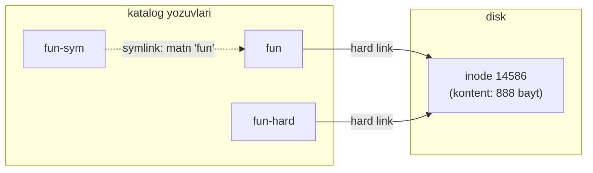

# 03. Fayl operatsiyalari

> Manba: TLCL 4-bob · Muhit: Ubuntu 24.04, bash 5.2 · [← Oldingi: navigation-and-filesystem](02-navigation-and-filesystem.md) · [Kurs xaritasi](00-README.md) · [Keyingi: commands-and-documentation →](04-commands-and-documentation.md)

## Nima uchun kerak

`cp`, `mv`, `rm`, `mkdir`, `ln` — kuniga o'nlab marta ishlatiladigan beshlik. GUI da fayl ko'chirish oson, lekin "faqat destination da yo'q yoki yangiroq HTML fayllarni ko'chir" degan vazifa GUI da azob, terminalda bitta qator: `cp -u *.html dest/`. Bundan tashqari: deploy scriptlari, Dockerfile `COPY` semantikasi, CI/CD dagi artifact ko'chirishlar — hammasi shu buyruqlar mantig'iga qurilgan. Va eng muhimi: `rm` da **undo yo'q** — bu darsda xavfsiz ishlash refleksini ham qo'yamiz.

## Nazariya

### Wildcards (globbing)

Shell fayl nomlari bilan ishlash uchun maxsus belgilar — **wildcards** ni qo'llab-quvvatlaydi. Muhim tushuncha: wildcard ni buyruq emas, **shell o'zi** expand qiladi — `rm *.log` bajarilganda `rm` dasturi `*.log` ni ko'rmaydi, u tayyor ro'yxatni oladi: `rm app.log error.log`. (Bu mexanizm 06-darsda chuqurlashadi.)

| Wildcard | Mos keladi |
|----------|-----------|
| `*` | Istalgan belgilar ketma-ketligi (bo'sh ham) |
| `?` | Aynan bitta istalgan belgi |
| `[abc]` | Ko'rsatilgan to'plamdan bitta belgi |
| `[!abc]` | To'plamga kirmaydigan bitta belgi |
| `[[:class:]]` | Klassdan bitta belgi: `[:alpha:]`, `[:digit:]`, `[:alnum:]`, `[:upper:]`, `[:lower:]` |

Eslatma: eski `[A-Z]` diapazon yozuvi locale sozlamasiga qarab kutilmagan natija berishi mumkin — `[[:upper:]]` klassini ishlating.

### Fayl = inode + nom

Hard link larni tushunish uchun faylni ikki qismga ajratib tasavvur qiling:

- **data qismi** — kontent, diskda bloklar zanjiri. Bunga **inode** raqami biriktiriladi;
- **nom qismi** — katalogdagi yozuv: "shu nom → shu inode".



- **Hard link** — xuddi shu inode ga ikkinchi nom. Fayldan farqsiz; kontent barcha hard linklar o'chirilgandagina yo'qoladi. Cheklovlar: boshqa fayl tizimiga (partition ga) ishora qila olmaydi, katalogga ishora qila olmaydi.
- **Symbolic link (symlink)** — ichida boshqa yo'l yozilgan **maxsus fayl**. Boshqa FS ga ham, katalogga ham ishora qiladi. Target o'chsa — **broken** bo'lib qoladi.

Ko'p operatsiyalar symlinkda **target ga** ta'sir qiladi (yozish, o'qish); `rm` — istisno: linkning **o'zini** o'chiradi.

## Buyruqlar

### `mkdir` — katalog yaratish

```bash
mkdir dir1 dir2 dir3          # bir nechtasini birdan
mkdir -p a/b/c                # -p: oraliq kataloglarni ham yaratadi, mavjud bo'lsa xato bermaydi
```

Tekshirilgan — Go loyiha skeleti bitta buyruqda:

```console
$ mkdir -p services/auth/{cmd,internal,api}
$ ls -R services | head -6
services:
auth

services/auth:
api
cmd
```

(`{...}` — brace expansion, 06-darsda; script larda `mkdir -p` **idempotent** bo'lgani uchun standart tanlov.)

### `cp` — nusxalash

```bash
cp item1 item2          # bitta fayl/katalogni nusxalash
cp item... katalog      # bir nechtasini katalogga
```

| Flag | Nima qiladi |
|------|-------------|
| `-r`, `--recursive` | Kataloglarni rekursiv (katalog uchun majburiy) |
| `-a`, `--archive` | `-r` + barcha atributlar (owner, permissions, timestamps, symlinks) saqlanadi |
| `-i`, `--interactive` | Ustidan yozishdan oldin so'raydi (aks holda **indamay** yozib yuboradi!) |
| `-u`, `--update` | Faqat yangiroq yoki yo'q fayllarni ko'chiradi |
| `-v`, `--verbose` | Nima qilayotganini ko'rsatadi |

```console
$ cp /etc/passwd .
$ cp -v /etc/passwd .
'/etc/passwd' -> './passwd'
$ cp -uv *.txt backup/
'new.txt' -> 'backup/new.txt'      # faqat o'zgargani ko'chdi
```

Semantika jadvallari (yodlash shart):

| Buyruq | Natija |
|--------|--------|
| `cp file1 file2` | file2 mavjud bo'lsa — **so'ramasdan** ustidan yozadi; yo'q bo'lsa yaratadi |
| `cp file1 file2 dir1` | Ikkalasini dir1 ga (dir1 mavjud bo'lishi shart) |
| `cp -r dir1 dir2` | dir2 **yo'q** bo'lsa: dir2 yaratiladi, ichiga dir1 kontenti. dir2 **mavjud** bo'lsa: dir2/dir1 paydo bo'ladi! |

Oxirgi qator — klassik tuzoq. Deploy scriptni ikkinchi marta ishga tushirsangiz `dest/app/app` paydo bo'ladi. Aniq semantika kerak bo'lsa (tekshirilgan):

```bash
cp -r src/. dst/     # HAR DOIM "kontentni dst ichiga" degani — dst mavjud bo'lsa ham
```

Muhim: GNU `cp` uchun source dagi trailing slash (`src/` vs `src`) **farq qilmaydi** — bu `rsync` semantikasi (15-dars). `cp` da kontentni ko'chirish uchun `src/.` ishlating.

### `mv` — ko'chirish / qayta nomlash

```bash
mv item1 item2          # rename yoki move
mv item... katalog      # katalogga ko'chirish
```

Flaglari `cp` bilan bir xil mantiq: `-i`, `-u`, `-v` (rekursiv flag kerak emas — `mv` katalogni har doim yaxlit ko'chiradi).

| Buyruq | Natija |
|--------|--------|
| `mv file1 file2` | Rename; file2 mavjud bo'lsa — indamay almashtiradi |
| `mv dir1 dir2` | dir2 **yo'q** bo'lsa: rename. dir2 **mavjud** bo'lsa: dir2/dir1 ga ko'chadi |

Tekshirilgan:

```console
$ mv fun dir1 && mv dir1 dir2
$ ls -l dir2
drwxr-xr-x 2 root root 4096 Jul 10 09:28 dir1
$ ls -l dir2/dir1
-rw-r--r-- 1 root root 888 Jul 10 09:28 fun
```

Ichki mexanizm: bir fayl tizimi ichida `mv` — bu `rename()` syscall, faqat katalog yozuvi o'zgaradi, data ko'chmaydi (shuning uchun 100GB katalogni `mv` qilish bir zumda bo'ladi). **Har xil fayl tizimlari orasida** esa `mv` = copy + delete (sekin!). Shu sababdan bir partition da atomic, boshqasiga esa yo'q.

### `rm` — o'chirish

```bash
rm item...
```

| Flag | Nima qiladi |
|------|-------------|
| `-r`, `--recursive` | Katalogni ichi bilan (katalog uchun majburiy) |
| `-i`, `--interactive` | Har biridan oldin so'raydi |
| `-f`, `--force` | Yo'q fayl uchun xato bermaydi, so'ramaydi (`-i` ni bekor qiladi) |
| `-v`, `--verbose` | Nimani o'chirayotganini ko'rsatadi |

**Linux da undelete YO'Q.** `rm` bilan o'chirilgan narsa qaytmaydi (backup dan tashqari).

Oltin qoida — wildcard bilan `rm` dan oldin **xuddi shu pattern bilan `ls`**:

```bash
ls *.log      # nimalar o'chishini KO'RIB oling
# yuqori strelka, ls ni rm ga almashtiring
rm *.log
```

Klassik fojia — bitta ortiqcha probel:

```console
$ rm *.html     # to'g'ri: faqat html lar o'chadi
$ rm * .html    # FALOKAT: * hammani o'chiradi, keyin ".html topilmadi" deydi
```

Tekshirilgan demo (dry-run `ls` bilan):

```console
$ ls * .log
ls: cannot access '.log': No such file or directory
BACKUP.001
BACKUP.002
...
```

`ls` bilan tekshirganda xato darhol ko'rinadi — `rm` bilan esa kech bo'lardi.

### `ln` — linklar yaratish

```bash
ln fayl link          # hard link
ln -s target link     # symbolic link
```

To'liq amaliy sessiya (tekshirilgan):

```console
$ ln fun fun-hard
$ ls -l fun fun-hard
-rw-r--r-- 4 root root 888 Jul 10 09:28 fun
-rw-r--r-- 4 root root 888 Jul 10 09:28 fun-hard
```

2-ustundagi `4` — shu inode ga nechta hard link borligi. Bir xil fayl ekanini isbotlash — inode raqami (`-i`):

```console
$ ls -li fun fun-hard
14586 -rw-r--r-- 4 root root 888 Jul 10 09:28 fun
14586 -rw-r--r-- 4 root root 888 Jul 10 09:28 fun-hard
```

Symlink — target ni **link joylashgan joyga nisbatan** yozing:

```console
$ ln -s fun fun-sym              # fun-sym bilan fun bir katalogda
$ ln -s ../fun dir1/fun-sym      # dir1 ichidan qaraganda fun bir daraja tepada
$ ls -l dir1
lrwxrwxrwx 1 root root   6 Jul 10 09:29 fun-sym -> ../fun
```

Symlink hajmi (6 bayt) — bu target *matni*ning uzunligi (`../fun` = 6 belgi), fayl hajmi emas. Absolute path bilan ham bo'ladi, lekin **relative afzal** — katalogni ko'chirsangiz linklar tirik qoladi.

Hard link o'chirilganda hisoblagich kamayadi; target o'chirilganda symlink **broken** bo'ladi:

```console
$ rm fun-hard && ls -l fun
-rw-r--r-- 3 root root 888 Jul 10 09:28 fun      # 4 -> 3
$ rm fun && cat fun-sym
cat: fun-sym: No such file or directory           # broken link
```

### Wildcard misollar (hammasi tekshirilgan)

Test fayllar: `app.log app.log.1 app.log.2 error.log data.csv BACKUP.001 BACKUP.002 readme.md Data123 Dataabc`

```console
$ ls *.log
app.log
error.log
$ ls app.log.?
app.log.1
app.log.2
$ ls BACKUP.[0-9][0-9][0-9]
BACKUP.001
BACKUP.002
$ ls [[:upper:]]*
BACKUP.001
BACKUP.002
Data123
Dataabc
$ ls Data???
Data123
Dataabc
```

## Real-world scenariylar

**1. Zero-downtime deploy: symlink switch.** Klassik pattern (Capistrano, ko'p CI/CD setuplar):

```bash
mkdir -p /srv/app/releases/v2.4.1
cp -r ./build/. /srv/app/releases/v2.4.1/
ln -sfn /srv/app/releases/v2.4.1 /srv/app/current   # atomic switch
# rollback = linkni eski versiyaga qaytarish:
ln -sfn /srv/app/releases/v2.4.0 /srv/app/current
```

(`-f` — eski linkni almashtir, `-n` — link katalogga ishora qilsa ichiga kirma. nginx `root /srv/app/current;` ga qaraydi.)

**2. Config o'zgartirishdan oldin backup.** Serverda nginx configiga tegishdan oldin:

```bash
cp -a /etc/nginx/nginx.conf /etc/nginx/nginx.conf.bak.$(date +%F)
```

`-a` timestamps va permissions ni saqlaydi — "qachon, qanday edi" degan savolga javob qoladi.

**3. Log rotate qo'lda.** Disk to'lgan, eski loglarni ajratish kerak:

```bash
mkdir -p /var/log/archive
ls /var/log/app/*.log.[0-9]        # avval KO'RISH
mv /var/log/app/*.log.[0-9] /var/log/archive/
```

## Zamonaviy yondashuv

- **`rm` uchun xavfsizlik to'ri**: [trash-cli](https://github.com/andreafrancia/trash-cli) — faylni o'chirmasdan XDG trash ga ko'chiradi (`trash-put`, `trash-restore`, `trash-empty`). Rust muqobili: `rip`. Laptopda foydali; serverlarda odatda baribir toza `rm` ishlatiladi — shuning uchun `ls`-avval-`rm` refleksi muhimroq.
- **`alias rm='rm -i'` tavsiya qilinmaydi** (garchi keng tarqalgan): unga o'rganib qolasiz, alias yo'q serverda esa refleks ishlamay qoladi. Yaxshiroq odat: `rm` dan oldin `pwd` + `ls`.
- **Katta nusxalashlarga `rsync`**: `cp` dan farqli, qayta ishga tushirilsa faqat farqni ko'chiradi, progress ko'rsatadi (15-darsda to'liq). `cp -u` — uning "mini" versiyasi.
- **GNU coreutils 9.x** da `cp -u` endi "deprecated in favor of `--update=older`" yo'nalishida rivojlanmoqda; Ubuntu 24.04 dagi versiyada `-u` ishlaydi (yuqorida tekshirildi).
- Fayl nomlash konvensiyasi: probel o'rniga `kebab-case` yoki `snake_case` — scriptlar va CI/CD bilan do'st bo'ladi.

## Keng tarqalgan xatolar

1. **`rm * .html` (ortiqcha probel).** `*` alohida argument bo'lib hammani o'chiradi. Yechim: wildcard + `rm` dan oldin doim `ls` bilan dry-run.

2. **`cp -r dir1 dir2` ni ikki marta ishga tushirish → `dir2/dir1/dir1`... kutish.** Yo'q — ikkinchi marta `dir2/dir1` paydo bo'ladi (dir2 endi mavjud). Deploy scriptlarda deterministik variant: `cp -r src/. dst/`.

3. **`cp` permissions ni yo'qotadi deb kutmaslik.** Oddiy `cp` yangi faylga *sizning* umask ingiz bo'yicha huquq beradi, owner — siz bo'lasiz. Backup/ko'chirishda atributlar muhim bo'lsa: `cp -a`.

4. **Symlink yaratishda relative yo'lni "o'zim turgan joydan" hisoblash.** `ln -s ../fun dir1/fun-sym` dagi `../fun` — **link joylashgan `dir1` dan** hisoblanadi, siz turgan joydan emas. Tekshiruv: `ls -l link` chiqargan target ko'rinishiga link katalogidan qarab mantiqiy yetib bo'ladimi?

5. **Katalogni `mv` bilan boshqa diskka "tez" ko'chirish kutish.** Har xil fayl tizimlari orasida `mv` = to'liq copy + delete. Katta data uchun `rsync` yaxshiroq (uzilsa davom ettirsa bo'ladi).

6. **`rm -rf $APP_DIR/` da variable bo'sh bo'lishi.** `$APP_DIR` set bo'lmasa bu `rm -rf /` ga aylanadi. Scriptda: `rm -rf "${APP_DIR:?APP_DIR is not set}"` (24-darsda batafsil).

## Amaliy mashqlar

Muhit: `docker run -it --rm ubuntu:24.04 bash`, home katalogda `mkdir playground && cd playground` bilan boshlang.

**1.** Bitta buyruq bilan quyidagi strukturani yarating: `project/cmd`, `project/internal/auth`, `project/internal/db`, `project/api`.

<details><summary>Yechim</summary>

```bash
mkdir -p project/{cmd,internal/{auth,db},api}
# yoki brace siz:
mkdir -p project/cmd project/internal/auth project/internal/db project/api
ls -R project
```
</details>

**2.** `/etc/passwd` ni playground ga ko'chirib `fun` deb nomlang. Keyin `fun` ga bitta hard link va bitta symlink yarating. `ls -li` bilan qaysi ikkitasi bir xil inode da ekanini ko'rsating.

<details><summary>Yechim</summary>

```console
$ cp /etc/passwd . && mv passwd fun
$ ln fun fun-hard && ln -s fun fun-sym
$ ls -li
14586 -rw-r--r-- 2 root root 888 ... fun
14586 -rw-r--r-- 2 root root 888 ... fun-hard     # bir xil inode
14603 lrwxrwxrwx 1 root root   3 ... fun-sym -> fun
```
</details>

**3.** `fun` ni o'chiring. `fun-hard` va `fun-sym` dan qaysi biri hali ham o'qiladi? Nega?

<details><summary>Yechim</summary>

```console
$ rm fun
$ head -1 fun-hard      # ISHLAYDI: kontent (inode) tirik, unga hali 1 nom bor
root:x:0:0:root:/root:/bin/bash
$ head -1 fun-sym       # BROKEN: symlink "fun" degan NOMga ishora qilardi
head: cannot open 'fun-sym' for reading: No such file or directory
```
Hard link inode ga, symlink nomga bog'lanadi — farqning mohiyati shu.
</details>

**4.** Quyidagi fayllarni yarating: `touch report-2024.pdf report-2025.pdf report-draft.pdf summary.txt`. Wildcard bilan: (a) faqat yil raqamli reportlarni ko'rsating; (b) pdf bo'lmagan fayllarni ko'rsating.

<details><summary>Yechim</summary>

```console
$ ls report-[0-9][0-9][0-9][0-9].pdf
report-2024.pdf
report-2025.pdf
$ ls !(*.pdf)      # extglob yoqilgan bo'lsa; universal variant:
$ ls | grep -v '\.pdf$'
summary.txt
```
(a) da `report-*.pdf` ham draft ni qo'shib yuborardi — aniqlik uchun `[0-9]` klasslar.
</details>

**5.** `releases/v1` va `releases/v2` kataloglarini yarating, har biriga bittadan fayl qo'ying. `current` symlinkini v1 ga qarating, keyin uni **bitta buyruq** bilan v2 ga almashtiring (o'chirmasdan).

<details><summary>Yechim</summary>

```console
$ mkdir -p releases/{v1,v2} && touch releases/v1/app-v1 releases/v2/app-v2
$ ln -s releases/v1 current
$ ls current/
app-v1
$ ln -sfn releases/v2 current      # -f: almashtir, -n: dir-link ichiga kirma
$ ls current/
app-v2
```
Bu — zero-downtime deploy pattern ining yadrosi.
</details>

**6.** Xavfsiz o'chirish mashqi: playground da `*.pdf` fayllarni o'chirishdan oldin nimalar o'chishini tekshiring, keyin o'chiring. Bitta pdf ni esa `-i` bilan o'chirib ko'ring.

<details><summary>Yechim</summary>

```console
$ ls *.pdf                 # dry-run: 3 ta report ko'rinadi
$ rm -i report-draft.pdf
rm: remove regular file 'report-draft.pdf'? y
$ rm *.pdf                 # qolganlarini
```
</details>

**7.** (Qiyinroq) `mv dir1 dir2` buyrug'ining ikki xil natijasini bitta sessiyada ko'rsating: avval dir2 yo'q holatda (rename), keyin dir2 mavjud holatda (ichiga ko'chirish).

<details><summary>Yechim</summary>

```console
$ mkdir dir1 && mv dir1 dir2 && ls        # rename: dir1 yo'q, dir2 bor
dir2
$ mkdir dir1 && mv dir1 dir2 && ls dir2   # endi dir2 MAVJUD -> ichiga kirdi
dir1
```
Xuddi shu ikkilanish `cp -r` da ham bor — scriptlarda buni doim hisobga oling.
</details>

## Cheat sheet

| Buyruq | Nima qiladi | Eng ko'p ishlatiladigan variant |
|--------|-------------|--------------------------------|
| `mkdir` | Katalog yaratish | `mkdir -p a/b/c` |
| `cp` | Nusxalash | `cp -av src/. dst/` |
| `mv` | Ko'chirish/rename | `mv -v eski yangi` |
| `rm` | O'chirish (qaytmas!) | avval `ls pattern`, keyin `rm pattern` |
| `rm -rf` | Katalogni majburan o'chirish | `rm -rf "${VAR:?bo'sh}"` — variable tekshirib |
| `ln` | Hard link | `ln fayl link` |
| `ln -s` | Symlink | `ln -sfn target link` (deploy switch) |
| `ls -li` | Inode raqamlari bilan | hard linklarni fosh qilish |
| `*` `?` `[...]` | Wildcards | `ls` bilan sinab ko'rib ishlatish |

## Qo'shimcha manbalar

- [GNU Coreutils manual — cp/mv/rm/ln](https://www.gnu.org/software/coreutils/manual/html_node/index.html) — rasmiy hujjat
- [trash-cli](https://github.com/andreafrancia/trash-cli) — xavfsiz o'chirish tool i
- [The Unexpected Importance of the Trailing Slash](https://tookmund.com/2022/04/importance-of-the-trailing-slash) — trailing slash semantikasi haqida chuqur maqola

---

[← Oldingi: 02 — navigation-and-filesystem](02-navigation-and-filesystem.md) · [Kurs xaritasi](00-README.md) · [Keyingi: 04 — commands-and-documentation →](04-commands-and-documentation.md)
