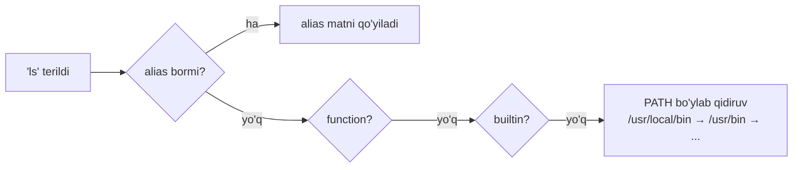

# 04. Buyruqlar va hujjatlar bilan ishlash

> Manba: TLCL 5-bob · Muhit: Ubuntu 24.04, bash 5.2 · [← Oldingi: file-operations](03-file-operations.md) · [Kurs xaritasi](00-README.md) · [Keyingi: redirection-and-pipelines →](05-redirection-and-pipelines.md)

## Nima uchun kerak

Linux da mingga yaqin buyruq bor — hammasini yodlash imkonsiz va keraksiz. Professional bilan boshlovchining farqi bilimlar hajmida emas, **javobni qanchalik tez topa olishida**. Bu dars sizga "o'zini o'zi o'qitadigan" skill beradi: har qanday buyruqning nima ekanligini, qayerdaligini va qanday ishlatilishini 30 soniyada aniqlash. Bonus: `alias` bilan o'z buyruqlaringizni yaratishni o'rganasiz — bash scripting sari birinchi qadam.

## Nazariya

### "Buyruq" aslida 4 xil narsa

`ls` deb terganingizda shell 4 turdagi narsalardan birini bajaradi:

1. **Executable dastur** — `/usr/bin` dagi fayllar: kompilyatsiya qilingan binary (C, Go, Rust) yoki script (shell, python...).
2. **Shell builtin** — bash ning o'z ichiga qurilgan buyruq (`cd`, `pwd`, `echo`...). Nega `cd` builtin? Chunki tashqi dastur o'z child processida katalog almashtirardi, sizning shell ingiz joyida qolardi (08-darsda process modeli bilan aniq bo'ladi).
3. **Shell function** — environment dagi mini-scriptlar (18-darsda yozamiz).
4. **Alias** — o'zingiz ta'riflagan qisqartma.

Shell qidiruv tartibi ham shu mantiqda: **alias → function → builtin → PATH dagi executable**. Bir xil nomli alias va binary bo'lsa — alias yutadi.



### Hujjatlar ekotizimi

Har bir buyruq turi uchun o'z hujjat manbasi bor: builtin → `help`, tashqi dastur → `man` / `--help`, GNU dasturlar → qo'shimcha `info`, paketlar → `/usr/share/doc`. Man sahifalar **bo'limlarga** ajratilgan:

| Bo'lim | Tarkib |
|--------|--------|
| 1 | User buyruqlari |
| 2 | Kernel syscall lari |
| 3 | C library funksiyalari |
| 4 | Device fayllar, drayverlar |
| 5 | Fayl formatlari (`/etc/passwd`, `crontab`...) |
| 6 | O'yinlar |
| 7 | Boshqa (konventsiyalar, protokollar) |
| 8 | Administrator buyruqlari |

`whatis ls` dagi `ls (1)` yozuvidagi raqam — shu bo'lim. Go dasturchiga tanish holat: `man 2 write` (syscall) va `man 1 write` (user buyruq) — butunlay boshqa narsalar.

## Buyruqlar

### `type` — bu nima o'zi?

```bash
type buyruq
```

Tekshirilgan (Ubuntu 24.04):

```console
$ type type
type is a shell builtin
$ type ls
ls is aliased to `ls --color=auto'
$ type cp
cp is /usr/bin/cp
$ type cd
cd is a shell builtin
```

Mana nega `ls` rangli — u aslida alias! `type -a buyruq` barcha variantlarni ko'rsatadi (alias ham, binary ham).

### `which` — binary qayerda?

```console
$ which ls
/usr/bin/ls
$ which cd
(hech narsa, exit code = 1)
```

`which` faqat **PATH dagi executable** larni ko'radi — builtin va aliaslarni bilmaydi (`which cd` ning "jim" muvaffaqiyatsizligi shundan).

**Script uchun to'g'ri variant — `command -v`** (POSIX standart, builtin/alias ni ham ko'radi):

```console
$ command -v ls
alias ls='ls --color=auto'
$ command -v cd
cd
```

```bash
# script da dastur mavjudligini tekshirishning kanonik usuli:
if command -v docker >/dev/null 2>&1; then
    echo "docker bor"
fi
```

### `help` — builtin lar uchun

```console
$ help cd | head -6
cd: cd [-L|[-P [-e]] [-@]] [dir]
    Change the shell working directory.

    Change the current directory to DIR.  The default DIR is the value of the
    HOME shell variable. If DIR is "-", it is converted to $OLDPWD.
```

Sintaksis yozuvini o'qish: `[...]` — ixtiyoriy element, `|` — "yoki". Bir qatorlik ta'rif uchun: `help -d pwd`.

### `--help` — dasturning o'z qisqa spravkasi

```console
$ mkdir --help | head -6
Usage: mkdir [OPTION]... DIRECTORY...
Create the DIRECTORY(ies), if they do not already exist.

Mandatory arguments to long options are mandatory for short options too.
  -m, --mode=MODE   set file mode (as in chmod), not a=rwx - umask
  -p, --parents     no error if existing, make parent directories as needed,
```

Deyarli barcha GNU dasturlar qo'llab-quvvatlaydi; qo'llamasa ham xato xabarida usage ko'rinadi.

### `man` — rasmiy qo'llanma

```bash
man ls          # 1-bo'limdan (default)
man 5 passwd    # aynan 5-bo'limdan: /etc/passwd FAYL FORMATI
man -k termin   # = apropos
```

```console
$ man ls | head -8
LS(1)                            User Commands                           LS(1)

NAME
       ls - list directory contents

SYNOPSIS
       ls [OPTION]... [FILE]...
$ man 5 passwd | head -5
PASSWD(5)               File Formats and Configuration               PASSWD(5)

NAME
       passwd - the password file
```

`man` sahifani `less` orqali ko'rsatadi — 02-darsdagi barcha klavishlar ishlaydi (`/` qidiruv, `n` keyingi, `q` chiqish). Man page — **spravochnik**, tutorial emas: misollar kam, lekin aniqlik to'liq. O'qish strategiyasi: NAME → SYNOPSIS → kerakli flag ni `/` bilan qidirish.

Muhim ops-fakt (shu kurs davomida real duch kelindi): **Ubuntu Docker imagelari "minimized"** — man sahifalar olib tashlangan, `man` o'rnida stub. Tiklash: `unminimize` buyrug'i (yoki docs kerak bo'lsa oddiy VM/serverda ishlang).

### `apropos` / `whatis` — nomini bilmasangiz

```console
$ apropos partition | head -4
addpart (8)          - tell the kernel about the existence of a partition
delpart (8)          - tell the kernel to forget about a partition
partx (8)            - tell the kernel about the presence and numbering of on...
resizepart (8)       - tell the kernel about the new size of a partition
$ whatis ls cp mkdir
ls (1)               - list directory contents
cp (1)               - copy files and directories
mkdir (1)            - make directories
```

`apropos` — "vazifasini bilaman, nomini bilmayman" holatlari uchun: tavsiflar bo'ylab qidiradi. (Yangi tizimda ishlamasa: `sudo mandb` bilan indeksni yangilang.)

### `info` va `/usr/share/doc`

GNU loyihalari uchun `info coreutils` — gipermatnli, man dan batafsilroq hujjat (`n`/`p`/`u` — navigatsiya, `q` — chiqish). Amalda kam ishlatiladi — man va web yetarli. `/usr/share/doc/<paket>/` da esa README, changelog va misollar:

```console
$ ls /usr/share/doc | head -5
apt
base-files
base-passwd
bash
bsdextrautils
```

### `alias` — o'z buyrug'ingiz

Avval bir qatorda bir nechta buyruq usuli: `buyruq1; buyruq2; buyruq3`

```console
$ cd /usr; ls; cd -
bin  games  include  lib  libexec  local  sbin  share  src
/root
```

Alias yaratish (nom band emasligini avval `type` bilan tekshiring!):

```console
$ type foo
bash: type: foo: not found     # bo'sh — ishlatsa bo'ladi
$ alias foo='cd /usr; ls; cd -'
$ foo
bin  games  include  lib  libexec  local  sbin  share  src
/
$ type foo
foo is aliased to `cd /usr; ls; cd -'
$ unalias foo
```

Sintaksis qat'iy: `alias nom='matn'` — `=` atrofida **probel yo'q**. Argumentsiz `alias` barcha mavjud aliaslarni ko'rsatadi. Terminalda yaratilgan alias **sessiya bilan o'ladi** — doimiy qilish `~/.bashrc` da (09-dars).

Backend developerning tipik aliaslari:

```bash
alias k='kubectl'
alias dps='docker ps --format "table {{.Names}}\t{{.Status}}\t{{.Ports}}"'
alias gs='git status -sb'
alias ll='ls -lah'
```

## Real-world scenariylar

**1. "Bu serverda `python` qaysi?"** Deploy muammosi: script python3.12 kutadi, server esa boshqasini beradi:

```bash
type -a python3        # alias/binary hammasini ko'rsatadi
command -v python3     # script ichida tekshirish uchun
python3 --version
```

**2. CI scriptda dependency check.** Pipeline boshida kerakli toollarni tekshirish:

```bash
for tool in docker jq curl; do
    command -v "$tool" >/dev/null 2>&1 || { echo "ERROR: $tool topilmadi"; exit 1; }
done
```

(`which` emas — `command -v`: POSIX standart, alpine kabi minimal imagelarda ham bir xil ishlaydi.)

**3. Notanish flag ni tezda aniqlash.** Kod reviewda `tar -xzvf` ko'rdingiz, `z` nima?

```bash
man tar          # ichida: /-z bilan qidirish
tar --help | grep -- '-z'
curl cheat.sh/tar   # misollar bilan (pastda)
```

## Zamonaviy yondashuv

- **[tldr](https://tldr.sh)** — man ga jamoaviy "misollar-birinchi" to'ldiruvchi: `tldr tar` eng ko'p ishlatiladigan 5-8 ta real misolni beradi. Client lar: `pipx install tldr` (python), `npm i -g tldr`, yoki Rust dagi `tealdeer`. Diqqat: Ubuntu `apt` dagi Haskell klienti eskirgan/muammoli (shu kursda tekshirildi — cache xatolari) — pipx/npm variantini ishlating.
- **[cheat.sh](https://cheat.sh)** — o'rnatishsiz, curl orqali (tekshirilgan):

```console
$ curl -s cheat.sh/tar | head -5
#[cheat.sheets:tar]
# tar
# GNU version of the tar archiving utility
```

- **`man` o'qishni yaxshilash**: `MANPAGER="less -R"` default; rangli man uchun `bat` bilan: `export MANPAGER="sh -c 'col -bx | bat -l man -p'"`.
- **AI davri konteksti**: LLM lar buyruq misollarini yaxshi beradi, lekin flag nomlari va nozik semantikada adashadi — **manba haqiqati baribir `man`**. To'g'ri workflow: g'oya (AI/tldr) → tekshiruv (man) → ishga tushirish.
- `alias` ning chegarasi: argument o'rtaga kerak bo'lsa (`mytool <arg> --flag`), alias ojiz — shell function kerak (18-darsda). Qoida: parametrsiz qisqartma — alias, parametrli — function.

## Keng tarqalgan xatolar

1. **Script da `which` ishlatish.** `which` bash builtin emas, xatti-harakati distributivga qarab farq qiladi, POSIX da yo'q. To'g'ri: `command -v`.

2. **`alias rm = 'rm -i'` (probellar bilan).** `alias` sintaksisida `=` atrofida probel bo'lmaydi — `alias rm='rm -i'`. Va umuman bu alias yomon g'oya (03-darsda aytilgani kabi — refleksni buzadi).

3. **`man passwd` deb `/etc/passwd` formatini qidirish.** 1-bo'limdagi `passwd` buyrug'i chiqadi. Fayl formati — `man 5 passwd`. Qaysi bo'limlarda borligini ko'rish: `whatis passwd`.

4. **Alias binary ni "yashirganini" bilmaslik.** `alias grep='grep --color=always'` qilib, keyin script pipe da rang kodlari buzilishiga hayron qolish. Diagnostika: `type grep`. Aliasni chetlab o'tish: `\grep` yoki `command grep`.

5. **`--help` ni katta dasturda o'qib o'tirish.** `docker --help` — 100+ qator. Filtrlang: `docker --help | grep -i volume` yoki to'g'ri `tldr docker` dan boshlang.

## Amaliy mashqlar

Muhit: `docker run -it --rm ubuntu:24.04 bash` (man kerak bo'lsa: `apt update && apt install -y man-db manpages && unminimize` yoki lokal Linux).

**1.** Quyidagilarning har biri qanday turdagi buyruq: `echo`, `test`, `awk`, `ll`? (`ll` topilmasa — nega?)

<details><summary>Yechim</summary>

```console
$ type echo test awk ll
echo is a shell builtin
test is a shell builtin
awk is /usr/bin/awk
bash: type: ll: not found
```
`ll` — ko'p distributivlarda `.bashrc` dagi alias; toza konteynerda root uchun u yo'q. Desktop Ubuntu da `ll is aliased to 'ls -alF'` chiqardi.
</details>

**2.** `echo` ham builtin, ham `/usr/bin/echo` binary sifatida mavjud. Buni bitta buyruq bilan isbotlang. Qaysi biri ishlaydi deb o'ylaysiz?

<details><summary>Yechim</summary>

```console
$ type -a echo
echo is a shell builtin
echo is /usr/bin/echo
```
Builtin yutadi (qidiruv tartibi: alias → function → builtin → PATH). Binary ni majburan chaqirish: `/usr/bin/echo` yoki `command echo` emas — `command` ham builtinni topadi; faqat to'liq yo'l ishlaydi.
</details>

**3.** `cd` buyrug'ining `-P` flagi nima qilishini **man ishlatmasdan** toping.

<details><summary>Yechim</summary>

```console
$ help cd | grep -A2 '\-P'
    -P	use the physical directory structure without following symbolic links...
```
`cd` builtin — uning hujjati `man` da emas, `help` da. (`man cd` ba'zi tizimlarda umumiy builtins sahifasini ochadi.)
</details>

**4.** Kalendar bilan ishlaydigan buyruqlarni nomini bilmagan holda toping.

<details><summary>Yechim</summary>

```console
$ apropos calendar
cal (1)              - display a calendar
ncal (1)             - display a calendar and the date of Easter
```
`apropos` bo'sh qaytarsa: `sudo mandb` bilan indeks yangilanadi.
</details>

**5.** `/etc/fstab` faylining formati qaysi man bo'limida? O'sha sahifani oching va u yerda `UUID` haqida nima deyilganini toping.

<details><summary>Yechim</summary>

```console
$ whatis fstab
fstab (5)            - static information about the filesystems
$ man 5 fstab        # ichida: /UUID + Enter, n bilan keyingisi
```
5-bo'lim — fayl formatlari. UUID — device nomiga bog'lanmasdan diskni identifikatsiya qilish usuli (12-darsda ishlatamiz).
</details>

**6.** `dclean` nomli alias yarating: to'xtagan Docker konteynerlar va dangling imagelarni tozalasin. Yaratishdan oldin nom bandligini tekshiring, yaratib bo'lib test qiling, keyin o'chiring.

<details><summary>Yechim</summary>

```console
$ type dclean
bash: type: dclean: not found
$ alias dclean='docker container prune -f; docker image prune -f'
$ type dclean
dclean is aliased to `docker container prune -f; docker image prune -f'
$ dclean          # docker o'rnatilgan muhitda ishlaydi
$ unalias dclean
```
</details>

**7.** (Qiyinroq) Sizda `deploy.sh` scripti bor deylik, unga `kubectl` va `helm` kerak. Ikkalasining mavjudligini tekshirib, yo'g'i haqida xabar berib, `exit 1` qiladigan blok yozing — `which` siz.

<details><summary>Yechim</summary>

```bash
missing=0
for tool in kubectl helm; do
    if ! command -v "$tool" >/dev/null 2>&1; then
        echo "ERROR: '$tool' PATH da topilmadi" >&2
        missing=1
    fi
done
[ "$missing" -eq 1 ] && exit 1
```
`command -v` — POSIX, builtin, alias va binary ni bir xil ko'radi; `>&2` — xatoni stderr ga (05-dars).
</details>

## Cheat sheet

| Buyruq | Nima qiladi | Eng ko'p ishlatiladigan variant |
|--------|-------------|--------------------------------|
| `type` | Buyruq turini aytadi | `type -a nom` (barcha variantlar) |
| `which` | PATH dagi binary yo'li | interaktiv tekshirish uchun |
| `command -v` | POSIX universal tekshiruv | script larda: `command -v x >/dev/null` |
| `help` | Builtin hujjati | `help cd`, `help -d pwd` |
| `--help` | Dastur qisqa spravkasi | `cmd --help \| grep flag` |
| `man` | To'liq qo'llanma | `man 5 fmt` (bo'lim bilan), ichida `/qidiruv` |
| `apropos` | Tavsif bo'yicha qidirish | `apropos "keyword"` |
| `whatis` | Bir qatorlik ta'rif | `whatis nom` |
| `alias` | Qisqartma yaratish | `alias nom='buyruqlar'` (probelsiz `=`) |
| `unalias` | Aliasni o'chirish | `unalias nom` |
| `tldr` / `cheat.sh` | Misollar-birinchi spravka | `tldr tar`, `curl cheat.sh/tar` |

## Qo'shimcha manbalar

- [tldr-pages](https://github.com/tldr-pages/tldr) — jamoaviy cheatsheet loyihasi
- [cheat.sh](https://cheat.sh) — curl orqali universal spravka
- [The Art of Reading Man Pages (man man-pages)](https://man7.org/linux/man-pages/man7/man-pages.7.html) — man sahifalar tuzilishi haqida rasmiy hujjat

---

[← Oldingi: 03 — file-operations](03-file-operations.md) · [Kurs xaritasi](00-README.md) · [Keyingi: 05 — redirection-and-pipelines →](05-redirection-and-pipelines.md)
