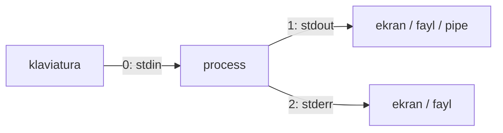

# 05. Redirection va pipelinelar

> Manba: TLCL 6-bob · Muhit: Ubuntu 24.04, bash 5.2 · [← Oldingi: commands-and-documentation](04-commands-and-documentation.md) · [Kurs xaritasi](00-README.md) · [Keyingi: expansion-and-quoting →](06-expansion-and-quoting.md)

## Nima uchun kerak

Bu — butun kursning eng muhim darsi. Unix falsafasi: har bir dastur bitta ishni yaxshi qiladi va matn oqimi orqali boshqalar bilan gaplashadi. `|` operatori shu falsafani ishga tushiradi: 5-6 ta kichik tool dan bir martalik "dastur" yig'asiz — log dan eng ko'p uchraydigan IP larni chiqarish, deployda xatolarni faylga yig'ish, curl natijasini filtrlash. Go da bunga o'xshash narsani `io.Reader`/`io.Writer` interfeyslari bilan qilasiz — shell da esa xuddi shu kompozitsiya bitta belgida.

## Nazariya

### Uch standart oqim

Har bir process 3 ta ochiq "fayl" bilan tug'iladi (yana o'sha "hamma narsa fayl" tamoyili):

| Oqim | File descriptor | Default ulangan joy | Vazifasi |
|------|-----------------|---------------------|----------|
| **stdin** | 0 | klaviatura | kirish ma'lumotlari |
| **stdout** | 1 | ekran | ish natijasi (data) |
| **stderr** | 2 | ekran | xato va status xabarlari |

Muhim dizayn qarori: stdout va stderr **ataylab ajratilgan**. Natija (data) — stdout ga, "dasturning ahvoli" — stderr ga. Shuning uchun pipe orqali faqat data oqadi, xatolar esa ekranda ko'rinib turadi.



Go dasturchiga tanish: `os.Stdin`, `os.Stdout`, `os.Stderr` — aynan shu 0/1/2 deskriptorlar. `log` paketi default stderr ga yozishi ham shu konventsiyadan.

### Redirection vs pipe

- `buyruq > fayl` — stdout ni **faylga** ulash
- `buyruq1 | buyruq2` — birinchi buyruq stdout ini ikkinchisining stdin iga ulash

**Hech qachon `buyruq1 > buyruq2` demang** — bu pipe emas! Kitobdagi real voqea: administrator root sifatida `cd /usr/bin; ls > less` terib, `less` **dasturining ustiga** ls natijasini yozib, dasturni yo'q qilgan. `>` so'ramasdan yaratadi/ustidan yozadi.

## Buyruqlar

### stdout redirection: `>` va `>>`

```console
$ ls -l /usr/bin > ls-output.txt
$ ls -l ls-output.txt
-rw-r--r-- 1 root root 22273 Jul 10 09:39 ls-output.txt
```

`>` faylni **har doim nolga qirqib** boshlaydi. Klassik tuzoq — buyruq xato bersa ham fayl allaqachon bo'shagan bo'ladi (tekshirilgan):

```console
$ ls -l /bin/usr > ls-output.txt
ls: cannot access '/bin/usr': No such file or directory
$ ls -l ls-output.txt
-rw-r--r-- 1 root root 0 Jul 10 09:39 ls-output.txt      # bo'sh!
```

Shell redirectionni **buyruqdan oldin** o'rnatadi: fayl ochildi (truncate), keyin ls ishga tushdi va xato berdi. Foydali trick — faylni bo'shatish/yaratish:

```bash
> app.log        # bo'sh fayl (truncate)
```

Qo'shish (append) — `>>` (tekshirilgan: 3 marta = 3 baravar hajm):

```bash
ls -l /usr/bin >> ls-output.txt
```

### stderr redirection: `2>`, birlashtirish: `2>&1` va `&>`

```console
$ ls -l /bin/usr 2> ls-error.txt      # faqat xatolar faylga
$ ls -l /bin/usr > all.txt 2>&1       # hammasi bitta faylga (klassik sintaksis)
$ ls -l /bin/usr &> all.txt           # xuddi shu, zamonaviy bash qisqartmasi
$ ls -l /bin/usr &>> all.txt          # append varianti
$ ls -l /bin/usr 2> /dev/null         # xatolarni yutish
```

`2>&1` o'qilishi: "2-deskriptorni hozir 1-deskriptor qaragan joyga ula". **TARTIB MUHIM** (tekshirilgan):

```console
$ ls -l /bin/usr > tartib.txt 2>&1    # TO'G'RI: ikkalasi ham faylda
$ ls -l /bin/usr 2>&1 > tartib.txt    # XATO: stderr ekranda qoldi!
ls: cannot access '/bin/usr': No such file or directory
```

Ikkinchi holatda `2>&1` bajarilganda stdout hali ekranga qaragan edi — stderr "ekranga" ulandi, keyin faqat stdout faylga ketdi. Redirectionlar chapdan o'ngga, ketma-ket qo'llanadi.

`/dev/null` — "bit bucket": yozilgan hamma narsani yutadigan device. Xato chiqmasin desangiz `2>/dev/null` — lekin **exit code saqlanadi** (tekshirilgan: `exit=2`), shuning uchun scriptlarda xatoni bilib olish mumkin.

### `cat` — birlashtirish va stdin

```bash
cat fayl...           # fayllarni ketma-ket stdout ga
cat                   # argumentsiz: stdin ni stdout ga (Ctrl+D = EOF)
cat > yangi.txt       # dunyodagi eng sodda "matn muharriri"
cat < fayl            # stdin ni fayldan olish
```

Bo'laklarni birlashtirish (wildcard alfavit tartibida expand bo'ladi — tekshirilgan):

```console
$ cat part.0* > butun.txt && cat butun.txt
qism1
qism2
qism3
```

### Pipeline: `|`

```bash
buyruq1 | buyruq2 | buyruq3
```

Har bir bosqich **parallel processda** ishlaydi; data buferlab oqib o'tadi. Birinchi amaliy foyda — istalgan uzun outputni sahifalash:

```bash
ls -l /usr/bin | less
```

### Filter to'plami

**`sort`** — qatorlarni tartiblash. **`uniq`** — **ketma-ket** dublikatlarni olib tashlash (shuning uchun deyarli doim `sort | uniq`). **`wc`** — qator/so'z/bayt hisobi. **`grep`** — pattern bo'yicha filtr. **`head`/`tail`** — birinchi/oxirgi N qator.

To'liq zanjir (tekshirilgan — /bin symlink bo'lgani uchun hamma nom ikki marta chiqadi, uniq ularni yig'ishtiradi):

```console
$ ls /bin /usr/bin | sort | wc -l
803
$ ls /bin /usr/bin | sort | uniq | wc -l
403
$ ls /bin /usr/bin | sort | uniq -d | head -3     # -d: FAQAT dublikatlar
[
addpart
apropos
```

```console
$ ls /bin /usr/bin | sort | uniq | grep zip
gunzip
gzip
streamzip
zipdetails
$ wc ls-output.txt
 1203 11028 66819 ls-output.txt        # qator / so'z / bayt
```

`grep` ning hozircha eng kerakli flaglari: `-i` (katta-kichik farqsiz), `-v` (mos KELMAGANlarini ko'rsat). To'liq kuchi 16-darsda.

```console
$ head -n 3 ls-output.txt
total 74512
-rwxr-xr-x 1 root root      67760 Jan 23 13:30 [
-rwxr-xr-x 1 root root      67744 Mar  6 16:00 addpart
$ tail -n 3 ls-output.txt
-rwxr-xr-x 1 root root       2206 Jan 27  2025 zless
-rwxr-xr-x 1 root root       1842 Jan 27  2025 zmore
-rwxr-xr-x 1 root root       4577 Jan 27  2025 znew
```

**`tail -f`** — faylni "jonli" kuzatish; yangi qo'shilgan qatorlar darhol chiqadi, `Ctrl+C` bilan to'xtaydi (tekshirilgan — parallel yozuvchi process bilan):

```console
$ tail -f app.log
request 1
request 2
request 3
^C
```

### `tee` — oqimni ikkiga bo'lish

Pipe o'rtasidan nusxa olish (nomi T-quvurdan):

```console
$ ls /usr/bin | tee ls.txt | grep zip | head -4
gunzip
gzip
streamzip
zipdetails
$ wc -l ls.txt
400 ls.txt          # to'liq ro'yxat faylda saqlandi, grep esa filtrladi
```

`sudo` bilan yozish uchun ham standart yechim: `echo "conf" | sudo tee /etc/app.conf` (`sudo echo > fayl` ishlamaydi — redirect ni sizning shell ochadi, sudo emas).

### Pipeline exit status: `PIPESTATUS` va `pipefail`

Default holatda pipeline exit codei — **oxirgi** buyruqniki. O'rtadagi xato yutilib ketadi (tekshirilgan):

```console
$ ls /bin/usr 2>/dev/null | sort | wc -l
0
$ echo "PIPESTATUS: ${PIPESTATUS[@]}"
PIPESTATUS: 2 0 0                    # ls yiqilgan, lekin umumiy exit=0 edi!
$ set -o pipefail
$ ls /bin/usr 2>/dev/null | sort | wc -l; echo "exit=$?"
0
exit=2                               # endi xato ko'rinadi
```

CI/CD scriptlarida `set -o pipefail` — majburiy amaliyot (24-darsda to'liq).

## Real-world scenariylar

**1. Log dan xato statistikasi.** Nginx/app logidan eng ko'p uchraydigan xatolarni topish:

```bash
grep ' 500 ' access.log | wc -l                          # nechta 500?
tail -n 1000 app.log | grep -i error | head -20          # oxirgi mingtadan xatolar
```

**2. Deploy paytida to'liq audit-log.** Butun output (xatolar bilan) ham ekranda ko'rinsin, ham faylga yozilsin:

```bash
./deploy.sh 2>&1 | tee deploy-$(date +%F-%H%M).log
```

**3. Jonli debugging: `tail -f` + `grep`.** Faqat kerakli qatorlarni jonli kuzatish:

```bash
tail -f /var/log/app/app.log | grep --line-buffered ERROR
```

(`--line-buffered` — grep pipe rejimida bufferlab qo'ymasin, qatorlar darhol chiqsin. Docker dunyosida ekvivalenti: `docker logs -f app 2>&1 | grep ERROR` — diqqat, docker logs stderr ga ham yozadi.)

## Zamonaviy yondashuv

- **Structured logging davri**: zamonaviy servislar JSON log yozadi — `grep` o'rniga/yonida **`jq`**: `docker logs app | jq 'select(.level=="error")'`. Matn pipelinelari baribir kerak (nginx, postgres, tizim loglari hali matn).
- **`journalctl -f -u myapp`** — systemd muhitida `tail -f /var/log/...` ning o'rnini bosgan; fayl qidirish shart emas, unit nomi yetadi.
- **SIGPIPE ni bilish**: pipe o'quvchisi yopilsa (masalan `head` kerakli qatorlarini olib chiqib ketsa) yozuvchi SIGPIPE oladi — bu **normal mexanizm**. `pipefail` bilan birga esa "soxta xato" ko'rinishi mumkin: `slow-generator | head -1` pipefail da nonzero qaytarishi mumkin. Bilib ishlating: shunday joyda `|| true`.
- **"Useless use of cat"**: `cat fayl | grep x` o'rniga `grep x fayl` — bitta process kam. Jiddiy xato emas, lekin idiomatik shell da to'g'ridan-to'g'ri argument afzal. (Himoya argumenti ham bor: `cat fayl |` boshlagan odam `< >` adashib faylni o'chirib yubormaydi.)
- Ubuntu da `zless`, `zcat` — gzip qilingan loglarni ochmasdan o'qish: `zcat access.log.2.gz | grep 500`.

## Keng tarqalgan xatolar

1. **`buyruq > fayl 2>&1` o'rniga `buyruq 2>&1 > fayl`.** Stderr ekranda qoladi. Qoida: `2>&1` **har doim oxirida** (yoki oddiyroq: `&>` ishlating).

2. **`sudo echo x > /etc/conf` — Permission denied.** Redirect ni sudo emas, sizning shellingiz ochadi. To'g'ri: `echo x | sudo tee /etc/conf > /dev/null`.

3. **O'qiyotgan faylga yozish: `sort fayl > fayl`.** Shell avval faylni truncate qiladi — sort bo'sh faylni o'qiydi, data **yo'qoladi**. To'g'ri: `sort fayl > fayl.tmp && mv fayl.tmp fayl` yoki `sort -o fayl fayl`.

4. **`uniq` ni sort siz ishlatish.** `uniq` faqat **qo'shni** dublikatlarni ko'radi. `... | uniq` ko'pincha bug: `... | sort | uniq` yoki `sort -u`.

5. **Pipeline o'rtasidagi xatoni sezmaslik.** Default exit code faqat oxirgi buyruqniki. Scriptda: `set -o pipefail` + kerak bo'lsa `${PIPESTATUS[@]}`.

6. **`>` bilan mavjud faylni bilmasdan o'chirish.** `ls > less` fojiasi. Himoya: interaktiv sessiyada `set -o noclobber` (mavjud faylga `>` taqiqlanadi; ataylab yozish: `>|`).

## Amaliy mashqlar

Muhit: `docker run -it --rm ubuntu:24.04 bash`

**1.** `/usr/bin` dagi fayllar ro'yxatini `bin.txt` ga yozing. Keyin `/etc` nikini ham **xuddi shu faylga qo'shing** (birinchisini o'chirmasdan). Fayl necha qator bo'ldi?

<details><summary>Yechim</summary>

```bash
ls /usr/bin > bin.txt
ls /etc >> bin.txt
wc -l bin.txt
```
</details>

**2.** `ls /etc /yoq-katalog` ni shunday bajarengki: (a) faqat xatolar `err.txt` ga tushsin; (b) hammasi `all.txt` ga tushsin; (c) xatolar butunlay yo'q bo'lsin.

<details><summary>Yechim</summary>

```bash
ls /etc /yoq-katalog 2> err.txt        # (a)
ls /etc /yoq-katalog &> all.txt        # (b) yoki: > all.txt 2>&1
ls /etc /yoq-katalog 2> /dev/null      # (c)
```
</details>

**3.** Bitta pipeline bilan: `/etc` dagi `.conf` bilan tugaydigan fayllar sonini toping.

<details><summary>Yechim</summary>

```console
$ ls /etc | grep '\.conf$' | wc -l
15
```
(`$` — qator oxiri; 16-darsda. Oddiyroq: `ls /etc/*.conf | wc -l` ham bo'ladi, lekin katalog ichidagi kataloglarni hisobga olishda farq qiladi.)
</details>

**4.** `/etc/passwd` dagi userlarning **oxirgi 5 tasini** ko'rsating, keyin ular ichida `nologin` so'zi borlarini ajrating.

<details><summary>Yechim</summary>

```bash
tail -n 5 /etc/passwd
tail -n 5 /etc/passwd | grep nologin
```
</details>

**5.** Pipeline o'rtasini faylga saqlang: `/usr/bin` ro'yxatini sortlab, natijani `sorted.txt` ga ham yozing, ekranga esa faqat `z` bilan boshlanganlarini chiqaring.

<details><summary>Yechim</summary>

```bash
ls /usr/bin | sort | tee sorted.txt | grep '^z'
```
</details>

**6.** `2>&1 > f` va `> f 2>&1` farqini amalda ko'rsating: har ikkala variantda ham `ls /mavjud /yoq` ishlatib, faylga nima tushganini solishtiring.

<details><summary>Yechim</summary>

```console
$ ls /etc /yoq > v1.txt 2>&1
$ wc -l v1.txt          # xato ham ichida
$ ls /etc /yoq 2>&1 > v2.txt
ls: cannot access '/yoq': ...   # xato EKRANDA
$ wc -l v2.txt          # faqat /etc ro'yxati
```
</details>

**7.** (Qiyinroq) Pipeline dagi yashirin xatoni toping: `cat /yoq-fayl | wc -l` ning exit codei nima? `PIPESTATUS` bilan har bosqichnikini ko'rsating, keyin `pipefail` bilan qaytaring.

<details><summary>Yechim</summary>

```console
$ cat /yoq-fayl 2>/dev/null | wc -l; echo "exit=$?"
0
exit=0                                  # xato yutildi!
$ cat /yoq-fayl 2>/dev/null | wc -l; echo "${PIPESTATUS[@]}"
0
1 0                                     # cat=1, wc=0
$ set -o pipefail
$ cat /yoq-fayl 2>/dev/null | wc -l; echo "exit=$?"
0
exit=1
```
</details>

## Cheat sheet

| Operator/Buyruq | Nima qiladi | Eng ko'p ishlatiladigan variant |
|-----------------|-------------|--------------------------------|
| `>` / `>>` | stdout faylga (truncate/append) | `cmd > out.txt` |
| `2>` | stderr faylga | `cmd 2> err.txt` |
| `&>` / `> f 2>&1` | ikkalasi faylga | `cmd &> all.txt` |
| `2>/dev/null` | xatolarni yutish | diagnostikada ehtiyot bo'ling |
| `<` | stdin fayldan | `cmd < input.txt` |
| `\|` | stdout → keyingi stdin | `cmd1 \| cmd2` |
| `cat` | fayllarni birlashtirish | `cat a b > c` |
| `sort` | tartiblash | `sort \| uniq` yoki `sort -u` |
| `uniq` | qo'shni dublikatlar | `uniq -d` (faqat dublar), `-c` (sanab) |
| `wc` | hisoblash | `wc -l` (qatorlar) |
| `grep` | filtr | `grep -i xato`, `grep -v debug` |
| `head`/`tail` | boshi/oxiri | `tail -n 100`, `tail -f` (jonli) |
| `tee` | oqimni fayl+stdout ga | `cmd \| tee log.txt \| filter` |
| `set -o pipefail` | pipeline xatosini ko'rsatadi | har CI scriptda |

## Qo'shimcha manbalar

- [Bash Reference Manual — Redirections](https://www.gnu.org/software/bash/manual/html_node/Redirections.html) — rasmiy hujjat
- [BashPitfalls — Greg's Wiki](https://mywiki.wooledge.org/BashPitfalls) — redirection bilan bog'liq klassik xatolar to'plami
- [How to Fix 'Broken Pipe' Errors in Bash Pipelines](https://oneuptime.com/blog/post/2026-01-24-bash-broken-pipe/view) — SIGPIPE va pipefail nuanslari

---

[← Oldingi: 04 — commands-and-documentation](04-commands-and-documentation.md) · [Kurs xaritasi](00-README.md) · [Keyingi: 06 — expansion-and-quoting →](06-expansion-and-quoting.md)
