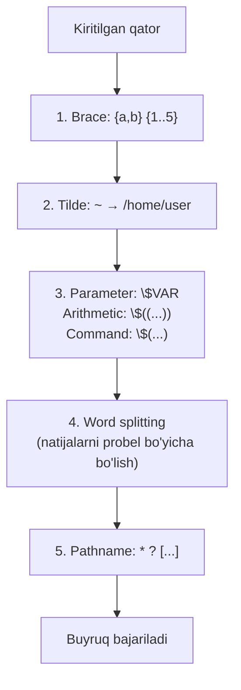

# 06. Expansion va quoting

> Manba: TLCL 7-bob · Muhit: Ubuntu 24.04, bash 5.2 · [← Oldingi: redirection-and-pipelines](05-redirection-and-pipelines.md) · [Kurs xaritasi](00-README.md) · [Keyingi: permissions →](07-permissions.md)

## Nima uchun kerak

Bash xatolarining ~90% ildizi bitta savolga borib taqaladi: **"Enter bosilganda shell buyrug'imni qanday ko'radi?"** CI scriptingiz probelli fayl nomida yiqilganda, `$VAR` kutilmagan joyda bo'sh chiqqanda, `rm` kerak bo'lmagan fayllarni o'chirganda — bularning hammasi expansion va quoting mexanikasi. Bu dars kursning eng "nazariy" darslaridan biri, lekin aynan shu bilim sizni "google'dan buyruq ko'chiruvchi"dan "shell ni tushunadigan engineer"ga aylantiradi.

## Nazariya

### Enter bosilganda nima bo'ladi

Shell buyruqni bajarishdan **oldin** qatorni bir necha bosqichda qayta yozadi — bu **expansion**. `echo *` da echo hech qachon `*` ni ko'rmaydi — shell uni allaqachon fayl ro'yxatiga almashtirib bo'lgan:

```console
$ echo *
Desktop Documents Music Pictures Public Templates Videos ls-output.txt
```

Expansion turlari (bajarilish tartibida, soddalashtirilgan):



Eng muhim ikki nuance:
- **Word splitting** parameter/command expansiondan **keyin** ishlaydi — shuning uchun `$VAR` ichidagi probel argumentlarni bo'lib yuboradi (quoting shuni to'xtatadi).
- Brace expansion **birinchi** — shuning uchun `{1..$N}` **ishlamaydi** ($N hali expand bo'lmagan).

### Quoting — expansionni jilovlash

Uch daraja (tekshirilgan, bitta misolda):

```console
$ echo text {a,b} $(echo foo) $((2+2)) $USER
text a b foo 4 root

$ echo "text ~/*.txt {a,b} $(echo foo) $((2+2)) $USER"
text ~/*.txt {a,b} foo 4 root

$ echo 'text ~/*.txt {a,b} $(echo foo) $((2+2)) $USER'
text ~/*.txt {a,b} $(echo foo) $((2+2)) $USER
```

| Yozuv | Nima o'chadi | Nima ishlaydi |
|-------|--------------|---------------|
| quotesiz | — | hammasi (xavfli zona) |
| `"..."` | glob, brace, tilde, word splitting | `$VAR`, `$(...)`, `$((...))`, `\` |
| `'...'` | **hammasi** | hech narsa (literal matn) |

Yodlash formulasi: **"Double — dollar ishlaydi, single — hech nima ishlamaydi."**

## Buyruqlar

### Pathname expansion (globbing)

03-darsdagi wildcardlar aslida shu mexanizm (hammasi tekshirilgan):

```console
$ echo D*
Desktop Documents
$ echo *s
Documents Pictures Templates Videos
$ echo [[:upper:]]*
Desktop Documents Music Pictures Public Templates Videos
$ echo /usr/*/share
/usr/local/share
```

Hidden fayllar: `*` ularni olmaydi. `echo .*` bilan olish mumkin, va bash 5.2+ da yoqimli yangilik (tekshirilgan):

```console
$ echo .*
.bash_history .bashrc .local .profile
```

`.` va `..` chiqmadi! Bash 5.2 dan `globskipdots` opsiyasi default yoqilgan. **Lekin** eski bash/POSIX sh da `.*` hali ham `.` va `..` ni qaytaradi — portativ scriptlarda ishonchli usul baribir `ls -A` yoki `.[!.]*` pattern.

Muhim: pattern hech narsaga mos kelmasa, u **o'z holicha qoladi** (bash da default) — `rm *.tmp` fayl topilmasa `rm` ga literal `*.tmp` argumenti boradi va "No such file" xatosi chiqadi.

### Tilde expansion

```console
$ echo ~
/root
$ echo ~postgres
~postgres
```

`~user` — user mavjud bo'lsa uning home iga expand bo'ladi; mavjud bo'lmasa (yuqoridagi konteynerda postgres yo'q) — **literal qoladi**. `~` faqat so'z **boshida** ishlaydi va **quote ichida ishlamaydi**: `"~/app"` — bu literal `~/app` (klassik bug: `PATH="~/bin:$PATH"`).

### Arithmetic expansion: `$((...))`

```console
$ echo $((2 + 2))
4
$ echo $(((5**2) * 3))
75
$ echo "Besh bo'linsin ikkiga: $((5/2)), qoldiq: $((5%2))"
Besh bo'linsin ikkiga: 2, qoldiq: 1
```

Faqat **butun sonlar** (`5/2 = 2`!). Operatorlar: `+ - * / % **`. Ichida `$` siz variable ishlatsa bo'ladi: `$((x + 1))`. Kasrli hisob kerak bo'lsa — `bc` yoki `awk` (22-darsda).

### Brace expansion: `{...}`

Fayl nomlari emas — **matn generatsiyasi** (mavjudlik tekshirilmaydi):

```console
$ echo old-{A,B,C}-son
old-A-son old-B-son old-C-son
$ echo raqam_{1..5}
raqam_1 raqam_2 raqam_3 raqam_4 raqam_5
$ echo {01..15}
01 02 03 04 05 06 07 08 09 10 11 12 13 14 15
$ echo a{A{1,2},B{3,4}}b
aA1b aA2b aB3b aB4b
```

Klassik amaliy misol — sanali kataloglar (tekshirilgan: 24 katalog bir buyruqda):

```console
$ mkdir {2025..2026}-{01..12}
$ ls | head -4
2025-01
2025-02
2025-03
2025-04
```

Kundalik foyda — yo'lni ikki marta yozmaslik:

```bash
cp nginx.conf{,.bak}          # = cp nginx.conf nginx.conf.bak
mv app.{staging,prod}.yaml    # = mv app.staging.yaml app.prod.yaml
```

### Parameter expansion: `$VAR`

```console
$ echo $USER
root
$ printenv | head -4
HOSTNAME=1af0fe06007c
PWD=/
HOME=/root
USER=root
```

Xavfli xususiyat — **xato nom indamay bo'sh string beradi** (tekshirilgan):

```console
$ echo "USER=$USER SUER=[$SUER]"
USER=root SUER=[]
```

Glob xato bo'lsa pattern o'zi qoladi (ko'rinadi), variable xato bo'lsa — **jimgina yo'qoladi**. Himoya: `set -u` (24-dars) yoki `${VAR:?xato}`.

### Command substitution: `$(...)`

Buyruq outputini argumentga aylantirish:

```console
$ ls -l $(which cp)
-rwxr-xr-x 1 root root 133496 Jan 23 13:30 /usr/bin/cp
$ file $(ls /usr/bin/* | grep -m2 zip)
/usr/bin/gunzip: POSIX shell script, ASCII text executable
/usr/bin/gzip:   ELF 64-bit LSB pie executable, ARM aarch64, ...
```

Eski sintaksis — backticks: `` ls -l `which cp` `` — ishlaydi, lekin **eskirgan**: ichma-ich joylash og'ir, o'qish qiyin. Har doim `$(...)` yozing.

### Quoting amalda

**Word splitting muammosi** (tekshirilgan):

```console
$ echo this is a     test
this is a test                    # probellar "yutildi" — 4 ta alohida argument
$ echo "this is a     test"
this is a     test                # bitta argument, probellar joyida
```

**Probelli fayl** (tekshirilgan):

```console
$ ls -l ikki soz.txt
ls: cannot access 'ikki': No such file or directory
ls: cannot access 'soz.txt': No such file or directory
$ ls -l "ikki soz.txt"
-rw-r--r-- 1 root root 0 Jul 10 09:44 ikki soz.txt
```

**Double quote ichida `$`, `$()`, `$(())` ishlashda davom etadi:**

```console
$ echo "$USER $((2+2)) $(echo salom)"
root 4 salom
```

**Newline larni saqlash** — eng nozik farq (tekshirilgan):

```console
$ echo $(cal)
July 2026 Su Mo Tu We Th Fr Sa 1 2 3 4 5 6 7 8 9 ...    # bitta uzun qator!
$ echo "$(cal)"
     July 2026
Su Mo Tu We Th Fr Sa
          1  2  3  4
```

Quotesiz variant word splitting tufayli 38 ta argumentga bo'linadi, newlinelar yo'qoladi. Shu sababdan **oltin qoida: `"$(...)"` va `"$VAR"` — deyarli har doim quote bilan.**

**Escape belgi `\`** — bitta belgini himoyalash:

```console
$ echo "Foydalanuvchi $USER balansi: \$5.00"
Foydalanuvchi root balansi: $5.00
$ mv bad\&filename good_filename
```

**Control sequences** — `echo -e` bilan:

```console
$ echo -e "ustun1\tustun2\nqator2\tdavomi"
ustun1	ustun2
qator2	davomi
```

(`\n` newline, `\t` tab, `\a` bell. Scriptda formatlash uchun `printf` afzalroq — 17-darsda.)

## Real-world scenariylar

**1. CI da probelli path fojiasi.** Script `rm -rf $BUILD_DIR/tmp` qiladi; kimdir `BUILD_DIR="/data/my project"` qo'ydi — endi `rm -rf /data/my` va `project/tmp` bajariladi. **Har doim**: `rm -rf "${BUILD_DIR}/tmp"`. Shellcheck bu xatoni SC2086 deb ushlaydi.

**2. Backup nomlash bir qatorda.** Config o'zgartirishdan oldin:

```bash
cp /etc/nginx/nginx.conf{,.bak-$(date +%F)}
# = cp /etc/nginx/nginx.conf /etc/nginx/nginx.conf.bak-2026-07-10
```

Brace + command substitution birgalikda.

**3. Bir xil strukturali muhitlar.** Yangi servis uchun katalog skeleti:

```bash
mkdir -p /srv/myapp/{releases,shared/{logs,config},backups/{daily,weekly}}
```

## Zamonaviy yondashuv

- **[ShellCheck](https://www.shellcheck.net)** — script linter; quoting xatolarining katta qismini (SC2086 va oila) avtomatik topadi. Har jiddiy bash fayl uchun majburiy tool, VS Code plagini bor (24-darsda o'rnatamiz).
- **Bir nechta argumentni variable da saqlash** — string emas, **array** ishlating: `opts=(-v --color=auto)` keyin `ls "${opts[@]}"`. String + quotesiz expansion — mo'rt yechim (22-darsda).
- **Bash 5.2 `globskipdots`** — `.*` endi xavfsizroq, lekin faqat yangi bash da; portativlik kerak bo'lsa eski usullar.
- `shopt -s nullglob` — mos kelmagan glob literal qolish o'rniga **bo'sh** bo'ladi; `for f in *.log` looplarida "fayl topilmasa `*.log` string bilan ishlash" bugini yo'q qiladi (20-darsda ishlatamiz).
- `$'...'` sintaksisi — control belgilar bilan string: `printf '%s\n' $'birinchi\nikkinchi'`.

## Keng tarqalgan xatolar

1. **Variable ni quotesiz ishlatish: `rm $FILE`.** Probel bo'lsa ikki fayl "o'chadi", glob belgisi bo'lsa expansion ketadi. To'g'ri: `rm "$FILE"`. Bu — shell dagi №1 xato (ShellCheck SC2086).

2. **Single quote ichida `$VAR` kutish.** `echo 'Salom $USER'` — literal `$USER` chiqadi. `$` kerak bo'lsa double quote.

3. **`"~/app"` — tilde quote ichida ishlamaydi.** `cd "~/app"` → "No such directory". To'g'ri: `cd ~/app` yoki `cd "$HOME/app"`.

4. **`{1..$N}` ishlaydi deb o'ylash.** Brace expansion variable expansiondan OLDIN bajariladi — natija: literal `{1..5}` emas, `{1..$N}`ning o'zi. Yechim: `seq 1 "$N"` yoki C-style `for` (20-dars).

5. **Backticks ichida backticks.** `` `cmd1 `cmd2` ` `` — parse xatosi yoki kutilmagan natija. `$(cmd1 $(cmd2))` — muammosiz ichma-ich.

6. **`$(cal)` kabi natijani quotesiz saqlash.** `RESULT=$(long-command)` dan keyin `echo $RESULT` — newline va ketma-ket probellar yo'qoladi (diff, JSON, formatli matnlar buziladi). To'g'ri: `echo "$RESULT"`.

## Amaliy mashqlar

Muhit: `docker run -it --rm ubuntu:24.04 bash`

**1.** Buyruq bajarilishidan **oldin** shell qatorni qanday ko'rishini tekshiring: `echo` bilan quyidagilarning har birini "portlatib" ko'ring va natijani izohlang: `~`, `{a..e}`, `$((7*6))`, `$(hostname)`, `/etc/*.conf`.

<details><summary>Yechim</summary>

```console
$ echo ~ {a..e} $((7*6)) $(hostname) /etc/*.conf
/root a b c d e 42 1af0fe06007c /etc/adduser.conf /etc/ca-certificates.conf ...
```
`echo` — expansionni ko'rishning eng tez usuli: buyruq nima olayotganini bilmasangiz, oldiga `echo` qo'yib ko'ring.
</details>

**2.** Bitta buyruq bilan quyidagi fayllarni yarating: `app-dev.env`, `app-staging.env`, `app-prod.env`. Keyin bitta buyruq bilan uchchalasining `.bak` nusxasini oling (uchta alohida cp siz — hint: loop hali o'tilmadi, brace bilan bo'lmaydi... yoki bo'ladimi?).

<details><summary>Yechim</summary>

```console
$ touch app-{dev,staging,prod}.env
$ ls app-*
app-dev.env  app-prod.env  app-staging.env
```
Nusxa: `cp` bir vaqtda faqat bitta manba→maqsad juftini oladi, shuning uchun brace bilan bitta `cp` da bo'lmaydi — bu loop uchun ish (20-dars). Bitta faylga esa: `cp app-dev.env{,.bak}`.
</details>

**3.** `msg='Salom $USER, bugun $(date)'` deb saqlang. `echo $msg`, `echo "$msg"` va `eval echo "$msg"` natijalarini taqqoslang (oxirgisini faqat kuzatish uchun — eval xavfli!).

<details><summary>Yechim</summary>

```console
$ msg='Salom $USER, bugun $(date)'
$ echo $msg
Salom $USER, bugun $(date)        # single quote saqlagan edi
$ echo "$msg"
Salom $USER, bugun $(date)        # variable ichidagi $ QAYTA expand bo'lmaydi
```
Muhim dars: expansion **bir marta** ishlaydi — variable qiymati ichidagi `$` avtomatik qayta ochilmaydi (xavfsizlik uchun yaxshi). `eval` buni majburlaydi, lekin injection xavfi tufayli undan qoching.
</details>

**4.** Ismida probel bor fayl yarating (`"yillik hisobot.txt"`), keyin uni: (a) quotesiz `ls` bilan ko'rishga urinib xatoni ko'ring; (b) uch xil usulda to'g'ri murojaat qiling.

<details><summary>Yechim</summary>

```console
$ touch "yillik hisobot.txt"
$ ls -l yillik hisobot.txt           # (a) ikki xato
$ ls -l "yillik hisobot.txt"         # (b1) double quote
$ ls -l 'yillik hisobot.txt'         # (b2) single quote
$ ls -l yillik\ hisobot.txt          # (b3) backslash escape
```
</details>

**5.** Serverda 3 yillik oylik backup kataloglari kerak: `backup-2024-01` dan `backup-2026-12` gacha. Yarating va sonini tekshiring (36 bo'lishi kerak).

<details><summary>Yechim</summary>

```console
$ mkdir backup-{2024..2026}-{01..12}
$ ls -d backup-* | wc -l
36
```
</details>

**6.** `echo "$(ls)"` va `echo $(ls)` orasidagi farqni ko'rsating va nega scriptlarda birinchisi to'g'ri ekanini tushuntiring.

<details><summary>Yechim</summary>

```console
$ echo $(ls)
Desktop Documents Music ...          # hammasi bir qatorda
$ echo "$(ls)"
Desktop
Documents
Music                                # newlinelar saqlandi
```
Quotesiz: word splitting har so'zni alohida argument qiladi, `echo` ularni bitta probel bilan yopishtiradi. Quote bilan: butun output yaxlit bitta argument. Fayl ro'yxati, JSON, diff — har qanday formatli matn uchun quote majburiy.
</details>

**7.** (Qiyinroq) `VAR="*.txt"` bo'lsin. `echo $VAR`, `echo "$VAR"`, `ls $VAR` nima chiqaradi? Nima uchun `$VAR` dagi glob ba'zida "ishlab ketadi"?

<details><summary>Yechim</summary>

```console
$ VAR="*.txt"
$ echo "$VAR"
*.txt                          # quote — literal
$ echo $VAR
all.txt butun.txt ls.txt ...   # quotesiz: expansion natijasiga glob QAYTA qo'llandi!
```
Tartibni eslang: parameter expansion → word splitting → **pathname expansion**. Quotesiz `$VAR` dan chiqqan `*.txt` oxirgi bosqichda glob sifatida ochiladi. Bu — `rm $PATTERN` turidagi buyruqlar kutilmagan fayllarni o'chirishining sababi.
</details>

## Cheat sheet

| Sintaksis | Nima qiladi | Misol → natija |
|-----------|-------------|----------------|
| `*` `?` `[...]` | Pathname expansion | `echo D*` → `Desktop Documents` |
| `~` | Home katalog | `echo ~` → `/root` |
| `$((expr))` | Butun son arifmetikasi | `$((5/2))` → `2` |
| `{a,b}` `{1..5}` | Matn generatsiyasi | `f{,.bak}` → `f f.bak` |
| `$VAR` | Variable qiymati | xato nom → jim bo'sh string! |
| `$(cmd)` | Buyruq outputi | `ls -l $(which cp)` |
| `"..."` | $ ishlaydi, glob/splitting yo'q | `"$VAR"` — standart usul |
| `'...'` | Hamma narsa literal | `'$5.00'` |
| `\x` | Bitta belgi escape | `\$100`, `fayl\ nomi` |
| `echo -e` | `\n` `\t` interpretatsiyasi | `echo -e "a\tb"` |

## Qo'shimcha manbalar

- [Bash Reference Manual — Shell Expansions](https://www.gnu.org/software/bash/manual/html_node/Shell-Expansions.html) — rasmiy, to'liq tartib bilan
- [ShellCheck SC2086](https://www.shellcheck.net/wiki/SC2086) — "double quote to prevent globbing and word splitting" izohli
- [Word Splitting — Greg's Wiki](https://mywiki.wooledge.org/WordSplitting) — word splitting ning barcha nozikliklari

---

[← Oldingi: 05 — redirection-and-pipelines](05-redirection-and-pipelines.md) · [Kurs xaritasi](00-README.md) · [Keyingi: 07 — permissions →](07-permissions.md)
