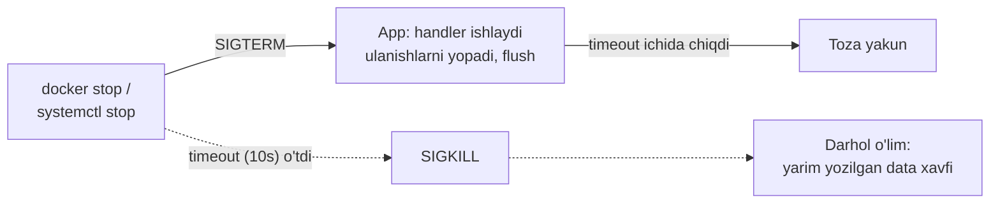

# 08. Processlar

> Manba: TLCL 10-bob · Muhit: Ubuntu 24.04, bash 5.2 · [← Oldingi: permissions](07-permissions.md) · [Kurs xaritasi](00-README.md) · [Keyingi: environment →](09-environment.md)

## Nima uchun kerak

"Servis javob bermayapti" — bu process darajasida debugging degani: process tirikmi, CPU/RAM yeyapti, qanday holatda (D state? zombie?), qanday signal bilan to'xtatish kerak? Docker dunyosida bu bilim ikki karra muhim: konteyner = izolyatsiyalangan process daraxti, `docker stop` = SIGTERM + timeout + SIGKILL, mashhur "konteyner 10 soniya o'lmayapti" muammosi esa PID 1 signal semantikasi. Go da graceful shutdown yozgan bo'lsangiz (`signal.NotifyContext`) — bu darsda uning OS tomonini ko'rasiz.

## Nazariya

### Process qanday tug'iladi

Tizim yuklanganda kernel `init` ni (zamonaviy tizimlarda — **systemd**, PID 1) ishga tushiradi; u service larni — ko'pi **daemon** (fonda, terminalsiz ishlaydigan) dasturlarni ko'taradi. Qolgan hamma process — **parent → child** zanjiri orqali: shell `fork()` bilan o'z nusxasini yaratadi, nusxa `exec()` bilan yangi dasturga aylanadi (01-darsdagi diagramma).

Har process haqida kernel yuritadigan asosiy ma'lumot: **PID**, parent PID, egasi (uid), holati, resurslari. Bularning hammasi `/proc/<PID>/` da ochiq turadi — `ps` va `top` shu yerdan o'qiydi.

### Process holatlari (STAT)

| Holat | Ma'nosi |
|-------|---------|
| `R` | Running — ishlayapti yoki CPU navbatida |
| `S` | Sleeping — hodisa kutyapti (so'rov, timer...) — normal holat |
| `D` | Uninterruptible sleep — I/O kutyapti; **kill ham olmaydi!** Ko'p D — disk/NFS muammosi belgisi |
| `T` | Stopped — to'xtatilgan (Ctrl+Z) |
| `Z` | Zombie — tugagan, lekin parent `wait()` qilmagan |
| `<` / `N` | Yuqori / past prioritet (niceness) |
| `s` / `+` | Session leader / foreground guruh (qo'shimcha belgilar) |

### Signallar — processlar bilan gaplashish tili

Signal — kernel orqali processga yuboriladigan qisqa xabar. Klaviatura kombinatsiyalari ham signal yuboradi: `Ctrl+C` → **SIGINT**, `Ctrl+Z` → **SIGTSTP**.

| № | Nom | Ma'nosi |
|---|-----|---------|
| 1 | HUP | Terminal uzildi. Daemonlarda qayta maqsadlangan: "configni qayta o'qi" (nginx, sshd) |
| 2 | INT | Interrupt (Ctrl+C) — odatda tugatadi |
| 9 | KILL | **Processga yetib bormaydi** — kernel darhol o'ldiradi. Tozalanish imkoni yo'q. Faqat oxirgi chora! |
| 15 | TERM | Terminate — **default va to'g'ri usul**: process ushlab, tozalanib chiqa oladi |
| 18 | CONT | Davom et (STOP/TSTP dan keyin) |
| 19 | STOP | To'xtat (ignorlanmaydi) |
| 20 | TSTP | Terminal stop (Ctrl+Z) — ignorlanishi mumkin |

Muhim: process TERM/INT/HUP ga **handler** yozib olishi mumkin (Go da `signal.Notify`) — shuning uchun graceful shutdown ishlaydi. KILL va STOP ga esa yo'q.



## Buyruqlar

### `ps` — processlar suratga olingan holda

```console
$ ps
  PID TTY          TIME CMD
 4105 pts/1    00:00:00 bash
 4117 pts/1    00:00:00 ps
```

Default — faqat shu terminal sessiyasi. Kengroq (BSD-uslub, defissiz flaglar):

```console
$ ps x | head -4
  PID TTY      STAT   TIME COMMAND
    1 ?        Ss     0:00 sleep infinity
  216 pts/0    Ss+    0:00 /bin/sh
 4105 pts/1    Ss     0:00 bash
```

(`x` — terminalga bog'lanmaganlarni ham; `TTY=?` — terminal yo'q, ya'ni daemon-simon. Bu konteynerda PID 1 — `sleep infinity` ekaniga e'tibor bering: konteyner = process!)

```console
$ ps aux | head -3
USER       PID %CPU %MEM    VSZ   RSS TTY      STAT START   TIME COMMAND
root         1  0.0  0.0   2272  1224 ?        Ss   09:16   0:00 sleep infinity
root       216  0.0  0.0   2384  1524 pts/0    Ss+  09:18   0:00 /bin/sh
```

`aux` — barcha userlarning barcha processlari + CPU/MEM. Kundalik ish uchun eng foydali kombinatsiyalar:

```bash
ps aux | grep myapp                     # nom bo'yicha topish (yoki: pgrep -a myapp)
ps aux --sort=-%mem | head              # RAM yeyuvchilar tepada
ps -ef --forest                         # parent-child daraxti bilan
```

### `top` — jonli monitoring

```console
$ top -b -n1 | head -5
top - 09:54:51 up 38 min,  0 user,  load average: 0.00, 0.00, 0.00
Tasks:   5 total,   1 running,   4 sleeping,   0 stopped,   0 zombie
%Cpu(s):  0.0 us,  0.9 sy,  0.0 ni, 99.1 id,  0.0 wa,  0.0 hi,  0.0 si,  0.0 st
MiB Mem :   7936.0 total,   6587.6 free,    757.6 used,    759.6 buff/cache
MiB Swap:   1024.0 total,   1024.0 free,      0.0 used.   7178.4 avail Mem
```

O'qish tartibi:
- **load average** — uch raqam: 1/5/15 daqiqalik o'rtacha "ishga tayyor processlar soni". Qoida: CPU yadrolar sonidan kichik = sog'lom. `0.07 2.5 6.0` — "yaqinda yomon edi, tuzalyapti"; teskarisi — "hozir yomonlashyapti".
- **%Cpu**: `us` user kodi, `sy` kernel, `id` bo'sh, **`wa` — I/O kutish** (baland `wa` = disk muammo, CPU emas!), `st` — virtualizatsiyada hypervisor "o'g'irlagan" vaqt.
- Interaktiv klavishlar: `M` — RAM bo'yicha sort, `P` — CPU, `k` — kill, `1` — har yadro alohida, `q` — chiqish. Scriptda: `top -b -n1` (batch rejim).

### Job control: `&`, `jobs`, `fg`, `bg`

Terminalda uzoq buyruqni fonga yuborish (tekshirilgan):

```console
$ sleep 300 &
[1] 4122
$ jobs
[1]+  Running                 sleep 300 &
$ ps
  PID TTY          TIME CMD
 4105 pts/1    00:00:00 bash
 4122 pts/1    00:00:00 sleep
```

`[1]` — job raqami (shu shellga xos), `4122` — PID (tizim bo'ylab). `fg %1` — old planga qaytarish; ishlayotgan processni to'xtatib fonga o'tkazish: `Ctrl+Z` keyin `bg`:

```console
$ jobs                         # Ctrl+Z dan keyin
[1]+  Stopped                 sleep 300
$ bg %1
[1]+ sleep 300 &
$ jobs
[1]+  Running                 sleep 300 &
```

Klassik holat: vim da ishlayapsiz → `Ctrl+Z` → buyruq bajardingiz → `fg` — vim joyida.

### `kill` — signal yuborish

```bash
kill PID              # default: SIGTERM (15)
kill -9 PID           # SIGKILL — oxirgi chora
kill -HUP PID         # = kill -1 PID
kill %1               # job spec bilan ham bo'ladi
kill -l               # barcha signallar ro'yxati
```

Tekshirilgan sessiya:

```console
$ sleep 300 &
[1] 4122
$ kill %1
[1]+  Terminated              sleep 300
$ sleep 300 &
[1] 4125
$ kill -1 4125
[1]+  Hangup                  sleep 300
```

```console
$ kill -l | head -2
 1) SIGHUP	 2) SIGINT	 3) SIGQUIT	 4) SIGILL	 5) SIGTRAP
 6) SIGABRT	 7) SIGBUS	 8) SIGFPE	 9) SIGKILL	10) SIGUSR1
```

Faqat **o'z processlaringizga** signal yubora olasiz (root — hammaga). To'g'ri o'ldirish tartibi: `kill PID` → 5-10 soniya kutish → ishlamasa `kill -9 PID`.

### `killall` va `pkill` — nom bo'yicha

```console
$ sleep 300 & sleep 300 &
[1] 4129
[2] 4130
$ killall sleep
[1]-  Terminated              sleep 300
[2]+  Terminated              sleep 300
```

`pkill -f "python.*worker"` — to'liq buyruq qatori bo'yicha pattern; `pgrep -a nom` — o'ldirmasdan PID larni ko'rish (avval **pgrep bilan tekshirib**, keyin pkill qiling!).

### Zombie — nima u va nega paydo bo'ladi

Zombie = tugagan, lekin parent hali `wait()` bilan exit statusini olmagan process. RAM yemaydi, faqat process jadvalida yozuv. Real yaratib ko'rsatilgan (tekshirilgan):

```console
$ bash -c "sleep 0.2 & exec sleep 2" &     # child ota o'lganidan keyin zombie bo'ladi
$ ps aux | grep defunct
root      4164  0.0  0.0      0     0 pts/2    Z    09:54   0:00 [sleep] <defunct>
```

Zombie ni `kill` qilib bo'lmaydi (u allaqachon o'lik!) — parentni tuzatish/o'ldirish kerak. Bir-ikkitasi zararsiz; **ko'payib borayotgani** — parent dasturda bug.

### Tizimni o'chirish

```bash
sudo systemctl reboot         # yoki: sudo reboot
sudo systemctl poweroff       # yoki: sudo shutdown -h now
sudo shutdown -r +5 "Deploy uchun reboot"    # 5 daqiqadan keyin, userlarga xabar bilan
```

### Boshqa foydali asboblar

```console
$ pstree -p | head -3        # parent-child daraxt
$ uptime
 09:54:51 up 38 min,  0 user,  load average: 0.00, 0.00, 0.00
$ vmstat
procs -----------memory---------- ---swap-- -----io---- -system-- -------cpu-------
 r  b   swpd   free   buff  cache   si   so    bi    bo   in   cs us sy id wa st gu
 1  0      0 6687660  59104 718764    0    0   120   281  427    0  0  0 100  0  0  0
```

## Real-world scenariylar

**1. "Server sekin" — 3 daqiqalik diagnostika.**

```bash
uptime                          # load qancha? yadrolar soni bilan solishtiring (nproc)
top -b -n1 | head -15           # kim yeyapti? %wa balandmi (disk?) us balandmi (kod?)
ps aux --sort=-%mem | head -8   # RAM top
ps aux | awk '$8 ~ /D/'         # D holatdagilar — I/O da qotganlar
```

**2. Docker konteyner 10 soniya o'lmayapti.** `docker stop` avval SIGTERM yuboradi, 10s kutib SIGKILL uradi. Sabablari: (a) app PID 1 va TERM handler yozmagan — kernel PID 1 uchun default handlerlarni **qo'llamaydi**, signal shunchaki ignorlanadi; (b) app shell script orqali ishga tushirilgan (`CMD ["sh", "-c", "..."]`) — shell signalni childga **uzatmaydi**. Yechim: `exec ./app` (shell o'rnini bosadi), `docker run --init` (tini PID 1 bo'ladi, signal forward + zombie reaping), Go da esa signal handler.

**3. SSH sessiya uzilsa job o'lmasin.** Fon job terminal yopilganda SIGHUP oladi. Uzoq ishni himoyalash:

```bash
nohup ./migration.sh > migration.log 2>&1 &
# yoki yaxshiroq: tmux/screen sessiyasida ishga tushirish
```

## Zamonaviy yondashuv

- **[htop](https://htop.dev)** — interaktiv top: rang, sichqoncha, F9 bilan signal tanlash. Serverlarda de-fakto standart (`apt install htop`). **[btop](https://github.com/aristocratos/btop)** — 2026 ning eng chiroyli varianti: grafiklar, GPU, mouse; desktopda zo'r, minimal muhitda htop yengilroq (4MB vs 22MB).
- **systemd davri**: production da servislarni `kill` bilan emas, `systemctl` bilan boshqarasiz: `systemctl status myapp` (holat + oxirgi loglar!), `systemctl restart myapp`, `systemctl reload nginx` (= HUP). `shutdown`/`reboot` ham endi systemd ga proxy.
- **Konteyner = cgroup + namespace**: `docker stats` — konteynerlar bo'yicha jonli resurs; konteyner ichidagi `top` host emas, o'z namespace ini ko'radi. OOM killer konteyner limitiga urilganda processni 137 (128+9=SIGKILL) kodi bilan o'ldiradi — `exit code 137` ko'rsangiz, bu OOM yoki docker stop timeout.
- `pgrep`/`pkill` — `ps aux | grep x | grep -v grep | awk ...` zanjirining zamonaviy o'rnini bosuvchisi.

## Keng tarqalgan xatolar

1. **Darhol `kill -9`.** Process bufferlarni flush qilolmaydi, lock fayllar qoladi, DB writeni yarmida uziladi. To'g'ri: TERM → kutish → KILL. `kill -9` birinchi chora emas, **oxirgi** chora.

2. **Zombie ni `kill -9` bilan o'ldirishga urinish.** Zombie allaqachon o'lik — signal qabul qilmaydi. Yechim parentda: parent zombilarni reap qilmayotgan bo'lsa, uni tuzatish yoki restart.

3. **`ps aux | grep app` da grep o'zini ham topishi.** `kill $(ps aux | grep app | awk '{print $2}')` — grep processini ham o'ldirishga urinadi. To'g'ri: `pgrep app` yoki `pkill app`.

4. **Load average ni CPU foizi deb o'ylash.** Load 4.0 — 4 yadroli mashinada normal, 1 yadrolida halokat. Har doim `nproc` bilan solishtiring. Va load faqat CPU emas — D holatdagi (disk kutayotgan) processlar ham hisobga kiradi.

5. **%CPU baland deb vahima, %wa ni ko'rmaslik.** `top` da CPU idle 90% lekin servis sekin? `wa` ga qarang — disk I/O tiqilgan bo'lishi mumkin. CPU muammosi bilan disk muammosining davosi har xil.

6. **PID 1 haqida unutish (Docker).** `CMD ["./run.sh"]` ichida `./app` — signal app ga yetmaydi. `exec ./app` yoki `--init`. "Konteynerim SIGKILL bilan o'lyapti" muammolarining 90% i shu.

## Amaliy mashqlar

Muhit: `docker run -it --rm ubuntu:24.04 bash` (ichida `apt update && apt install -y procps psmisc`)

**1.** `sleep 500` ni fonda ishga tushiring. `jobs`, `ps` va `pgrep sleep` bilan uni uch xil usulda toping. Job raqami bilan PID farqini ayting.

<details><summary>Yechim</summary>

```console
$ sleep 500 &
[1] 4122
$ jobs          # shell darajasi: [1]
$ pgrep -a sleep
4122 sleep 500
```
Job raqami — faqat shu shell sessiyasida ma'noli; PID — butun tizimda unikal.
</details>

**2.** `sleep 500` ni old planda ishga tushirib, uni **tugatmasdan** fonga o'tkazing, ishlayotganini isbotlang, keyin old planga qaytarib Ctrl+C bilan tugating.

<details><summary>Yechim</summary>

`sleep 500` → `Ctrl+Z` (Stopped) → `bg` (Running, fonda) → `jobs` bilan tekshirish → `fg` → `Ctrl+C`.
</details>

**3.** Bitta buyruq bilan RAM bo'yicha top-5 processni chiqaring.

<details><summary>Yechim</summary>

```bash
ps aux --sort=-%mem | head -6      # 1 qator sarlavha + 5 process
```
`top` ichida bo'lsangiz: `M` klavishi.
</details>

**4.** Uchta `sleep 400` ni fonda oching. Bittasini PID bilan (TERM), bittasini job spec bilan, qolganini nom bo'yicha bitta buyruqda o'ldiring.

<details><summary>Yechim</summary>

```console
$ sleep 400 & sleep 400 & sleep 400 &
$ kill 4130           # PID bilan (o'zingiznikini qo'ying)
$ kill %2             # job spec
$ killall sleep       # qolganlari
```
</details>

**5.** `kill -9` dan farqni his qiling: `sleep 400 &` ga avval `kill -STOP`, keyin `kill -CONT`, oxirida `kill -TERM` yuboring. Har qadamda `jobs` yoki `ps -o pid,stat,cmd` bilan holatni ko'ring.

<details><summary>Yechim</summary>

```console
$ sleep 400 &
$ kill -STOP %1 && ps -o pid,stat,cmd | grep sleep
 4149 T    sleep 400          # T = stopped
$ kill -CONT %1 && ps -o pid,stat,cmd | grep sleep
 4149 S    sleep 400          # yana sleeping
$ kill -TERM %1
[1]+  Terminated              sleep 400
```
STOP/CONT — debugging va throttling uchun ham foydali (processni "pauza" qilish).
</details>

**6.** Zombie yarating va uni `ps` da `Z` holatida ko'rsating. Nega `kill -9` unga ta'sir qilmaydi?

<details><summary>Yechim</summary>

```console
$ bash -c "sleep 0.2 & exec sleep 5" &
$ sleep 1; ps aux | grep defunct | grep -v grep
root  4164  0.0  0.0  0  0 pts/2  Z  09:54  0:00 [sleep] <defunct>
```
Ichki bash `exec` bilan sleep 5 ga aylanadi — u child (sleep 0.2) ning statusini hech qachon o'qimaydi. Zombie — process emas, jadvaldagi yozuv: signal oladigan kod qolmagan. 5 soniyadan keyin parent o'lgach, zombie ni PID 1 asrab olib reap qiladi.
</details>

**7.** (Qiyinroq) `yes > /dev/null &` bilan CPU ni yuklang (bu buyruq to'xtovsiz "y" chiqaradi). `top` da uni toping, load average o'sishini kuzating (1-2 daqiqa), keyin renice bilan prioritetini pasaytiring va o'ldiring.

<details><summary>Yechim</summary>

```console
$ yes > /dev/null &
$ top -b -n1 | grep yes        # %CPU ~100
$ renice +19 -p $(pgrep yes)   # eng past prioritet
$ uptime                        # load 1 ga yaqinlashganini ko'rasiz
$ pkill yes
```
`nice`/`renice` — CPU talashganda "kim muhimroq"ni belgilash mexanizmi.
</details>

## Cheat sheet

| Buyruq | Nima qiladi | Eng ko'p ishlatiladigan variant |
|--------|-------------|--------------------------------|
| `ps` | Process ro'yxati (surat) | `ps aux`, `ps aux --sort=-%mem \| head` |
| `top` | Jonli monitoring | `top` (M/P/k/q), scriptda `top -b -n1` |
| `htop`/`btop` | Zamonaviy top | `htop` |
| `jobs` | Shu shell joblari | `jobs` |
| `&` / `fg` / `bg` | Fon boshqaruvi | `cmd &`, `Ctrl+Z` + `bg`, `fg %1` |
| `kill` | Signal yuborish | `kill PID` (TERM), keyin `kill -9 PID` |
| `killall` | Nom bo'yicha | `killall nom` |
| `pgrep`/`pkill` | Pattern bo'yicha | `pgrep -a app`, `pkill -f "worker"` |
| `nohup` | HUP dan himoya | `nohup cmd > log 2>&1 &` |
| `uptime` | Load average | `nproc` bilan solishtiring |
| `pstree` | Daraxt | `pstree -p` |
| `systemctl` | Servis boshqaruvi | `systemctl status/restart/reload app` |

## Qo'shimcha manbalar

- [man 7 signal](https://man7.org/linux/man-pages/man7/signal.7.html) — signallarning to'liq rasmiy ro'yxati va semantikasi
- [Why Your Docker Containers Refuse to Die: The PID 1 Problem](https://dev.to/alanwest/why-your-docker-containers-refuse-to-die-the-pid-1-problem-e70) — PID 1 va signal forwarding
- [Linux Load Averages: Solving the Mystery — Brendan Gregg](https://www.brendangregg.com/blog/2017-08-08/linux-load-averages.html) — load average chuqur tahlili

---

[← Oldingi: 07 — permissions](07-permissions.md) · [Kurs xaritasi](00-README.md) · [Keyingi: 09 — environment →](09-environment.md)
