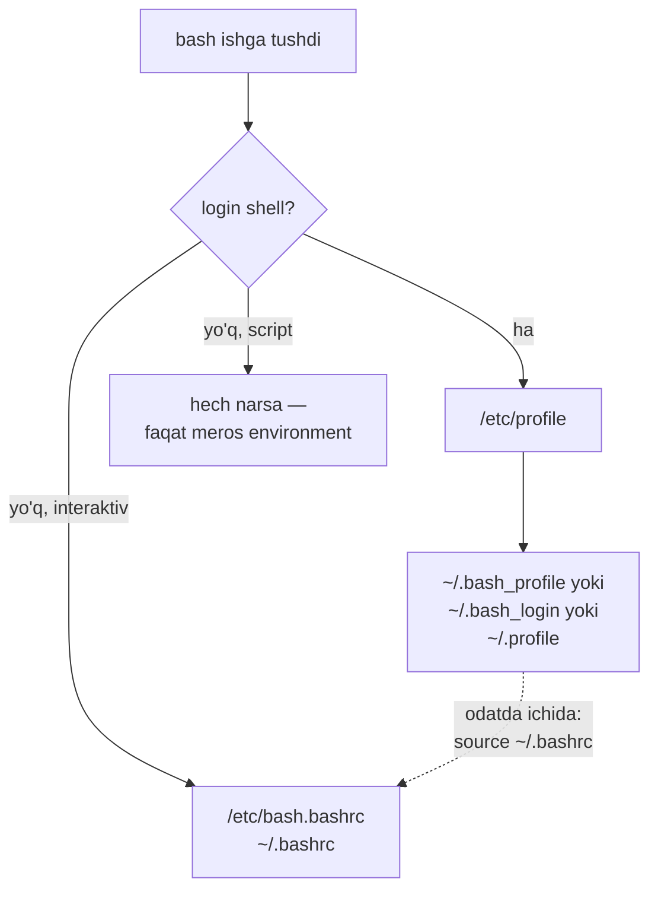

# 09. Environment

> Manba: TLCL 11 va 13-boblar · Muhit: Ubuntu 24.04, bash 5.2 · [← Oldingi: processes](08-processes.md) · [Kurs xaritasi](00-README.md) · [Keyingi: vim-basics →](10-vim-basics.md)

## Nima uchun kerak

12-factor app konfiguratsiyani environment variable larda saqlaydi — `DATABASE_URL`, `PORT`, `LOG_LEVEL` ni siz har kuni ishlatasiz. Lekin: nega `.bashrc` ga yozgan PATH cron jobda ko'rinmaydi? Nega `export` siz o'rnatilgan variable child processga o'tmaydi? Nega SSH orqali kirilganda alias ishlamaydi? Bularning hammasi environment mexanikasi va startup fayllar zanjiri — bilmagan odam soatlab "nega ishlamayapti" deb o'tiradi.

## Nazariya

### Environment nima va qanday meros bo'ladi

Har process o'zining **environment** to'plami bilan yashaydi: kalit=qiymat juftliklari. Muhim qonun: environment **faqat yuqoridan pastga** meros bo'ladi — process yaratilayotganda parentdan **nusxa** oladi. Keyin parentdagi o'zgarish childga ta'sir qilmaydi va aksincha (Go dagi `os.Environ()` — aynan shu nusxa).

Ikki xil variable bor:

- **Shell variable** — faqat shu shellda: `MYVAR="qiymat"`
- **Environment variable** — child processlarga ham o'tadi: `export MYVAR`

Amaliy isbot (tekshirilgan):

```console
$ MYVAR="lokal"
$ bash -c 'echo child koradi: [$MYVAR]'
child koradi: []                        # export siz — child ko'rmaydi
$ export MYVAR
$ bash -c 'echo export dan keyin: [$MYVAR]'
export dan keyin: [lokal]
```

### Startup fayllar zanjiri

bash ishga tushganda qaysi config fayllarni o'qishi **sessiya turiga** bog'liq:

- **Login shell** — tizimga kirish (SSH, konsol, `su -`, `bash --login`)
- **Non-login (interaktiv)** — desktop da terminal ochish, mavjud shell ichida `bash`
- **Non-interaktiv** — scriptlar (hech qaysi rc faylni o'qimaydi!*)

| Sessiya | O'qiladigan fayllar (tartibda) |
|---------|-------------------------------|
| Login | `/etc/profile` → `~/.bash_profile` **yoki** `~/.bash_login` **yoki** `~/.profile` (birinchi topilgani) |
| Non-login interaktiv | `/etc/bash.bashrc` → `~/.bashrc` |
| Script | hech biri (faqat parentdan meros environment) |



Ubuntu/Debian da `~/.bash_profile` yo'q — o'rniga `~/.profile` (tekshirilgan: home da `.bashrc`, `.profile`, `.bash_logout`), va u ichidan `.bashrc` ni chaqiradi. **Amaliy qoida**: aliaslar va interaktiv sozlamalar → `~/.bashrc`; environment (PATH, EDITOR...) → `~/.profile` (yoki `.bashrc` — Ubuntu zanjiri baribir ikkalasini bog'laydi). Chalkashmaslik uchun eng keng tarqalgan setup: **hammasi `.bashrc` da, `.profile` esa uni source qiladi** (Ubuntu default allaqachon shunday).

\* Diqqat: `~/.bashrc` ning boshida `case $- in *i*) ;; *) return;; esac` guard bor — non-interaktiv shell uni ochsa ham darhol chiqib ketadi. "Scriptim .bashrc dagi PATH ni ko'rmayapti" muammosining ildizi shu.

## Buyruqlar

### Environmentni ko'rish

```console
$ printenv | head -8
SHELL=/bin/bash
PWD=/home/dev
LOGNAME=dev
HOME=/home/dev
LANG=C.UTF-8
TERM=xterm
USER=dev
SHLVL=1
$ printenv USER
dev
$ echo "$HOME"
/home/dev
```

`set` — environment + shell variablelar + funksiyalar (juda uzun, `| less` bilan). Aliaslar bunga kirmaydi — ular uchun `alias`:

```console
$ alias | head -3
alias egrep='egrep --color=auto'
alias fgrep='fgrep --color=auto'
alias grep='grep --color=auto'
```

### Muhim variablelar

| Variable | Nima |
|----------|------|
| `PATH` | Buyruq qidiriladigan kataloglar (`:` bilan ajratilgan, tartib muhim!) |
| `HOME` | Home katalog (`~` shundan) |
| `USER` / `LOGNAME` | Kimsiz |
| `SHELL` | Login shellingiz |
| `PS1` | Prompt shabloni |
| `PWD` / `OLDPWD` | Joriy / oldingi katalog (`cd -` shundan) |
| `EDITOR` | Default muharrir (git commit, crontab -e shuni ochadi) |
| `PAGER` | Sahifalagich (odatda less) |
| `LANG` | Til/locale — sort tartibi va belgi klasslariga ta'sir qiladi |
| `TERM` | Terminal protokoli |
| `TZ` | Vaqt zonasi |
| `SHLVL` | Nechinchi darajali ichma-ich shell |

### PATH bilan ishlash

```console
$ echo $PATH
/usr/local/sbin:/usr/local/bin:/usr/sbin:/usr/bin:/sbin:/bin:/usr/games:...
$ export PATH="$HOME/bin:$PATH"
$ echo $PATH
/home/dev/bin:/usr/local/sbin:/usr/local/bin:...
```

Qidiruv **chapdan o'ngga** — `$HOME/bin` ni boshiga qo'ysangiz, sizning versiyangiz tizimnikini "yopadi". Go dasturchining klassik qatori (`~/.bashrc` ga):

```bash
export PATH="$PATH:/usr/local/go/bin:$HOME/go/bin"
```

### O'zgarishni faollashtirish: `source`

Config faylni tahrirlagach, yangi terminal ochmasdan qo'llash (tekshirilgan):

```console
$ echo 'export TEST_FROM_RC=ha' >> ~/.bashrc
$ source ~/.bashrc
$ echo $TEST_FROM_RC
ha
```

`source fayl` (yoki `. fayl`) — faylni **joriy shellda** bajaradi (yangi process ochmasdan — aks holda o'zgarishlar child bilan birga o'lardi).

### PS1 — prompt shakli

Ubuntu default (tekshirilgan):

```console
$ echo $PS1
\[\e]0;\u@\h: \w\a\]${debian_chroot:+($debian_chroot)}\u@\h:\w\$
```

Asosiy escape lar: `\u` user, `\h` host, `\w` to'liq yo'l, `\W` yo'lning oxirgi qismi, `\A` vaqt (HH:MM), `\$` — oddiy userga `$`, rootga `#`, `\[...\]` — bosilmaydigan (rang) kodlarni o'rash.

Tajriba (avval zaxira!):

```console
$ ps1_old="$PS1"          # tiklash uchun: PS1="$ps1_old"
$ PS1="\A \h \$ "
17:33 linuxbox $
$ PS1="<\u@\h \W>\$ "
<dev@linuxbox ~>$
```

Rangli variant (yashil user@host):

```bash
PS1="\[\e[0;32m\]\u@\h:\w\$\[\e[0m\] "
```

`\e[0;32m` — ANSI yashil, `\e[0m` — reset. Rang kodlari **majburiy** `\[...\]` ichida bo'lsin — aks holda bash prompt uzunligini noto'g'ri hisoblab, uzun buyruqlarda kursor "sakraydi" (klassik bug). Doimiy qilish — `.bashrc` ga yozish. Production serverlarda promptga hostname va rang qo'yish (masalan prod — qizil!) — "noto'g'ri serverda buyruq" fojialaridan himoya.

## Real-world scenariylar

**1. "Cron jobim ishlamayapti, terminalda ishlaydi-ku!"** Cron **login shell emas** — sizning `.bashrc`/`.profile` ni o'qimaydi, PATH i minimal (`/usr/bin:/bin`). Yechim: cron scriptda to'liq yo'llar (`/usr/local/bin/docker`) yoki script boshida PATH ni o'zi o'rnatishi.

**2. 12-factor: secret larni env orqali berish.**

```bash
export DATABASE_URL="postgres://app:pass@db:5432/prod"
./server                                  # Go: os.Getenv("DATABASE_URL")
# bir martalik — faqat shu buyruq uchun:
LOG_LEVEL=debug ./server                  # environment faqat shu processga
```

Oxirgi shakl (`VAR=qiymat buyruq`) — juda foydali: joriy shellni ifloslamaydi.

**3. Docker da environment.** `docker run -e LOG_LEVEL=debug -e DATABASE_URL=... app` yoki `--env-file .env`. Konteyner sizning shell startup fayllaringizni ko'rmaydi — u **faqat** aniq berilgan env bilan ishlaydi. "Lokalda ishlaydi, konteynerda yo'q" muammolarining bir ildizi shu.

## Zamonaviy yondashuv

- **[starship](https://starship.rs)** — PS1 ni qo'lda terish o'rniga zamonaviy cross-shell prompt: git branch/status, til versiyalari, k8s kontekst — hammasi tayyor. O'rnatish: `.bashrc` ga `eval "$(starship init bash)"`.
- **[direnv](https://direnv.net)** — katalogga kirganda `.envrc` dagi variablelarni avtomatik yuklaydi, chiqqanda tozalaydi. Har loyihaga o'z `DATABASE_URL` i — qo'lda export siz. `.bashrc` ga: `eval "$(direnv hook bash)"`.
- **`.env` fayllar**: `KEY=value` format, `docker compose` va ko'p framework o'qiydi. Qoida: **`.gitignore` ga kiritish majburiy** (production credential leak ning eng keng yo'li); repoga `.env.example` shabloni qo'yiladi.
- Secret lar uchun env ham ideal emas (process ro'yxatida, log larga tushishi mumkin) — jiddiy production da secret manager (Vault, AWS SM). Env — konfiguratsiya uchun, o'ta maxfiylar uchun ehtiyotkorlik.
- `EDITOR` ni o'rnating: `export EDITOR=vim` — `git commit`, `crontab -e`, `visudo` shuni ishlatadi.

## Keng tarqalgan xatolar

1. **`export` ni unutish.** `MYVAR=x` faqat joriy shellda — `./script.sh` uni ko'rmaydi. Child ga kerak bo'lsa: `export MYVAR=x`.

2. **`.bashrc` ni tahrirlab, "ishlamayapti" deyish.** Fayl faqat **yangi** shell ochilganda o'qiladi. Joriy sessiyada: `source ~/.bashrc`.

3. **Script `.bashrc` dagi narsalarni ko'radi deb kutish.** Non-interaktiv shell `.bashrc` ni o'qimaydi (o'qisa ham boshidagi guard qaytarib yuboradi). Script o'ziga kerakli env ni o'zi o'rnatsin yoki systemd unit / docker `-e` orqali olsin.

4. **`PATH=/yangi/yol` deb eskisini o'chirib yuborish.** `$PATH` ni unutgan holda qayta yozish → `ls: command not found`. To'g'ri: `export PATH="/yangi/yol:$PATH"`. (Buzsangiz: `export PATH=/usr/local/bin:/usr/bin:/bin` bilan jonlantiring.)

5. **PS1 dagi rang kodlarini `\[...\]` siz yozish.** Prompt chiroyli ko'rinadi, lekin uzun qatorda kursor pozitsiyasi buziladi. Har bosilmaydigan ketma-ketlik `\[` va `\]` orasida.

6. **Ubuntu da `~/.bash_profile` yaratib qo'yish.** U paydo bo'lishi bilan bash `~/.profile` ni **o'qimay qo'yadi** — mavjud sozlamalar "yo'qoladi". Ubuntu da `.profile` va `.bashrc` bilan ishlang.

## Amaliy mashqlar

Muhit: `docker run -it --rm ubuntu:24.04 bash`

**1.** `printenv`, `set` va `alias` chiqishlari orasidagi farqni ko'rsating: har biridan nimani topish mumkin?

<details><summary>Yechim</summary>

```bash
printenv | wc -l     # faqat environment (export qilinganlar)
set | wc -l          # env + shell varlar + funksiyalar (ancha ko'p)
alias                # faqat aliaslar (set/printenv da chiqmaydi)
```
</details>

**2.** `GREETING="salom"` yarating. `bash -c 'echo $GREETING'` nima chiqaradi? `export` dan keyin-chi? Nega?

<details><summary>Yechim</summary>

```console
$ GREETING="salom"
$ bash -c 'echo [$GREETING]'
[]                        # shell variable — meros bo'lmaydi
$ export GREETING
$ bash -c 'echo [$GREETING]'
[salom]                   # endi environment variable
```
Single quote muhim: `"..."` bo'lsa $GREETING ni PARENT shell expand qilib yuboradi va tajriba buziladi (06-dars).
</details>

**3.** Promptingizni vaqt + katalog ko'rsatadigan qilib o'zgartiring, keyin asliga qaytaring.

<details><summary>Yechim</summary>

```console
$ ps1_old="$PS1"
$ PS1="\A \W \$ "
17:45 ~ $
$ PS1="$ps1_old"
```
</details>

**4.** `~/bin` katalogini yarating, ichiga `salom` nomli script qo'ying (`echo Assalomu alaykum!`), executable qiling va PATH ga qo'shib istalgan joydan `salom` deb chaqiring.

<details><summary>Yechim</summary>

```console
$ mkdir -p ~/bin
$ echo 'echo Assalomu alaykum!' > ~/bin/salom && chmod +x ~/bin/salom
$ export PATH="$HOME/bin:$PATH"
$ cd /tmp && salom
Assalomu alaykum!
```
Doimiy qilish: `export PATH=...` qatorini `~/.bashrc` ga yozing.
</details>

**5.** Bir martalik environment bilan ishga tushirish: `TZ` variablesini o'zgartirib `date` ni Toshkent vaqtida chiqaring — lekin shellingizdagi TZ o'zgarmasin.

<details><summary>Yechim</summary>

```console
$ TZ=Asia/Tashkent date
Fri Jul 10 15:02:04 +05 2026
$ echo [$TZ]
[]                        # shell toza qoldi
```
`VAR=qiymat buyruq` sintaksisi environmentni faqat o'sha bitta processga beradi. (Minimal konteynerda zona ma'lumotlari yo'q bo'lishi mumkin: `apt install tzdata`.)
</details>

**6.** `.bashrc` ga `ll` aliasini (`ls -lah`) qo'shing va yangi terminal ochmasdan ishlating.

<details><summary>Yechim</summary>

```bash
echo "alias ll='ls -lah'" >> ~/.bashrc
source ~/.bashrc
ll
```
</details>

**7.** (Qiyinroq) Login va non-login shell farqini isbotlang: `~/.profile` ga `export FROM_PROFILE=1`, `~/.bashrc` ga `export FROM_BASHRC=1` yozing. `bash` (non-login) va `bash --login` bilan yangi shell ochib, qaysi variable qayerda borligini tekshiring.

<details><summary>Yechim</summary>

```console
$ echo 'export FROM_PROFILE=1' >> ~/.profile
$ echo 'export FROM_BASHRC=1' >> ~/.bashrc
$ env -i HOME=$HOME TERM=$TERM bash -c 'echo P=$FROM_PROFILE B=$FROM_BASHRC'
P= B=                      # script: hech biri o'qilmadi
$ env -i HOME=$HOME TERM=$TERM bash -i -c 'echo P=$FROM_PROFILE B=$FROM_BASHRC'
P= B=1                     # interaktiv non-login: faqat .bashrc
$ env -i HOME=$HOME TERM=$TERM bash --login -i -c 'echo P=$FROM_PROFILE B=$FROM_BASHRC'
P=1 B=1                    # login: .profile (u .bashrc ni ham chaqiradi)
```
`env -i` — toza environmentdan boshlash (meros aralashmasligi uchun).
</details>

## Cheat sheet

| Buyruq | Nima qiladi | Eng ko'p ishlatiladigan variant |
|--------|-------------|--------------------------------|
| `printenv` | Environment ro'yxati | `printenv \| grep -i proxy` |
| `set` | Env + shell varlar + funksiyalar | `set \| less` |
| `export` | Variable ni environmentga | `export VAR=qiymat` |
| `VAR=x cmd` | Bir martalik env | `LOG_LEVEL=debug ./app` |
| `source` / `.` | Faylni joriy shellda bajarish | `source ~/.bashrc` |
| `unset` | Variable ni o'chirish | `unset VAR` |
| `env -i` | Toza environment | debugging uchun |
| Fayllar | — | interaktiv: `~/.bashrc`; login: `~/.profile`; tizim: `/etc/profile`, `/etc/profile.d/` |
| PS1 | Prompt | `\u`@`\h`:`\w`, ranglar `\[\e[...m\]` ichida |

## Qo'shimcha manbalar

- [Bash Startup Files — rasmiy manual](https://www.gnu.org/software/bash/manual/html_node/Bash-Startup-Files.html) — qaysi fayl qachon o'qilishi, aniq tartibda
- [The Twelve-Factor App: Config](https://12factor.net/config) — nega konfiguratsiya environmentda bo'lishi kerak
- [starship.rs](https://starship.rs) va [direnv.net](https://direnv.net) — zamonaviy prompt va per-katalog environment

---

[← Oldingi: 08 — processes](08-processes.md) · [Kurs xaritasi](00-README.md) · [Keyingi: 10 — vim-basics →](10-vim-basics.md)
