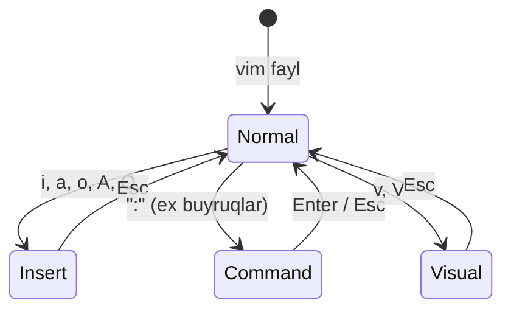

# 10. Vim asoslari

> Manba: TLCL 12-bob · Muhit: Ubuntu 24.04, vim 9.1 · [← Oldingi: environment](09-environment.md) · [Kurs xaritasi](00-README.md) · [Keyingi: package-management →](11-package-management.md)

## Nima uchun kerak

SSH bilan production serverga kirdingiz, nginx configda bitta qatorni tuzatish kerak — VS Code yo'q, GUI yo'q. `vi` esa **har doim bor**: POSIX standarti uni talab qiladi, minimal serverdan tortib har Linux mashinada mavjud. Backend developer uchun vim maqsad emas, **survival skill**: config tuzatish, git commit message, `kubectl edit`. Bonus: `EDITOR=vim` bo'lgan har joyda (crontab, visudo) shu bilim ishlaydi. Maqsad — 20 daqiqada "vim ichida adashib qolmaydigan" darajaga chiqish.

## Nazariya

### Nega vi/vim?

1. **Har doim bor** — GUI siz serverlar, buzilgan tizimlar, minimal konteynerlar.
2. **Yengil va tez** — bir soniyada ochiladi, klaviaturadan qo'l uzilmaydi.
3. Deyarli barcha distributivlarda `vi` aslida **vim** (Vi IMproved) — Bill Joy ning 1976 yildagi originalining zamonaviy vorisi.

### Modal editing — vim ning bosh g'oyasi

Vim **rejimli** muharrir: bitta klavish rejimga qarab har xil ish qiladi.



- **Normal (command) mode** — ochilganda shu rejimda bo'lasiz; har klavish — buyruq. **Matn terib bo'lmaydi!**
- **Insert mode** — oddiy terish; `-- INSERT --` indikatori pastda.
- **Ex (command-line) mode** — `:` bilan: saqlash, chiqish, almashtirish.

Adashsangan bo'lsangiz — **`Esc` ni ikki marta bosing**: har doim Normal rejimga qaytaradi.

### Vim grammatikasi

Buyruqlarni yodlamang — **grammatikani** o'rganing: `[son] operator harakat`:

- `d` (delete) + `w` (word) = `dw` — so'zni o'chirish
- `d` + `$` = `d$` — qator oxirigacha o'chirish
- `3` + `dd` = `3dd` — uch qatorni o'chirish
- `c` (change) + `iw` (inner word) = `ciw` — so'zni almashtirishga

O'nlab buyruq o'rniga: ~5 operator × ~10 harakat = kombinatorika.

## Buyruqlar

### Ochish, chiqish, saqlash — survival minimumi

```bash
vim fayl.txt        # ochish (yo'q bo'lsa — yangi)
```

| Buyruq | Amal |
|--------|------|
| `:q` | Chiqish (o'zgarish bo'lmasa) |
| `:q!` | Saqlamasdan majburan chiqish — **"qutqaruv" buyrug'i** |
| `:w` | Saqlash |
| `:wq` yoki `ZZ` | Saqlab chiqish |
| `Esc Esc` | Qaysi rejimdaligini bilmasangiz — Normal ga qaytish |

Dunyodagi eng mashhur StackOverflow savoli "how to exit vim" — endi sizda javob bor.

### Insert rejimga kirish yo'llari

| Klavish | Qayerdan boshlaydi |
|---------|--------------------|
| `i` | Kursor **oldidan** |
| `a` | Kursor **keyidan** (append) — qator oxiriga qo'shishda kerak |
| `A` | Qator **oxiridan** |
| `o` | **Pastga** yangi qator ochib |
| `O` | **Tepaga** yangi qator ochib |

### Harakat (Normal rejimda)

| Klavish | Harakat |
|---------|---------|
| `h j k l` | chap / past / tepa / o'ng (strelkalar ham ishlaydi) |
| `w` / `b` | keyingi / oldingi so'z boshi |
| `0` / `^` / `$` | qator boshi / birinchi belgi / qator oxiri |
| `gg` / `G` | fayl boshi / oxiri |
| `15G` yoki `:15` | 15-qatorga (xato stack trace dagi qatorga sakrash!) |
| `Ctrl+F` / `Ctrl+B` | sahifa pastga / tepaga |

Son prefiksi hamma joyda ishlaydi: `5j` — 5 qator pastga.

### Tahrirlash

| Buyruq | Amal |
|--------|------|
| `x` | Kursor ostidagi belgini o'chirish |
| `dd` | Qatorni o'chirish (kesish — buferga tushadi) |
| `dw` / `d$` / `d0` | so'zni / oxirigacha / boshigacha o'chirish |
| `yy` | Qatorni nusxalash (yank) |
| `yw` | So'zni nusxalash |
| `p` / `P` | Buferdan keyin / oldin qo'yish (paste) |
| `J` | Keyingi qatorni shu qatorga ulash |
| `u` | Undo (ketma-ket bosib chuqur qaytish mumkin) |
| `Ctrl+R` | Redo |
| `.` | Oxirgi o'zgartirishni takrorlash — vim ning "sehri" |

`dd` + `p` = qatorni ko'chirish; `yy` + `p` = dublikat qilish.

### Qidirish va almashtirish

| Buyruq | Amal |
|--------|------|
| `/matn` + Enter | Pastga qidirish |
| `?matn` | Tepaga qidirish |
| `n` / `N` | Keyingi / oldingi topilma |
| `f belgisi` | Qator ichida belgigacha sakrash |
| `:%s/eski/yangi/g` | Butun faylda almashtirish |
| `:%s/eski/yangi/gc` | Har birini so'rab (y/n) almashtirish |
| `:1,10s/eski/yangi/g` | Faqat 1-10 qatorlarda |

Almashtirish real ishlashi verify qilingan (vim 9.1, ex rejimda):

```console
$ cat vimdemo.txt
birinchi qator
ikkinchi qator eski matn bilan
uchinchi qator eski gap
$ vim -es +"%s/eski/yangi/g" +"wq" vimdemo.txt && cat vimdemo.txt
birinchi qator
ikkinchi qator yangi matn bilan
uchinchi qator yangi gap
```

(`vim -es` — scriptdan ex-buyruqlarni bajarish; xuddi shu `:%s...` ni interaktiv sessiyada terasiz. Sintaksis sed bilan deyarli bir xil — 17-darsda ko'rasiz.)

### Bir nechta fayl

```bash
vim fayl1 fayl2
```

| Buyruq | Amal |
|--------|------|
| `:bn` / `:bp` | Keyingi / oldingi buffer |
| `:buffers` | Ochiq fayllar ro'yxati |
| `:e boshqa.txt` | Yana fayl ochish |
| `:r fayl` | Fayl kontentini shu yerga quyish |

`:r` verify qilingan:

```console
$ vim -es +"r extra.txt" +"wq" vimdemo.txt && tail -1 vimdemo.txt
tashqi kontent
```

## Real-world scenariylar

**1. Serverda config tuzatish (to'liq sessiya).** nginx da portni almashtirish:

```
vim /etc/nginx/sites-enabled/default
/listen        ← "listen" ni qidirish
n              ← kerakli topilmagacha
ciw            ← so'zni o'chirib insert rejimga (yoki cw)
8080           ← yangi qiymat
Esc :wq        ← saqlab chiqish
nginx -t       ← config sintaksisini tekshirish!
```

**2. Git commit / interactive rebase.** `EDITOR` vim bo'lsa `git commit` vim ochadi: xabar yozing → `Esc` → `:wq`. Bekor qilish: `:q!` (bo'sh message = commit bekor).

**3. `kubectl edit deployment myapp`** — manifest vim da ochiladi. Yaml da xato qilsangiz kubectl qabul qilmaydi va qayta ochadi. `/(image:)` bilan qidirib, `A` bilan qator oxirini tahrirlab, `:wq`.

## Zamonaviy yondashuv

- **`vimtutor`** — o'rganishning rasmiy va eng yaxshi yo'li: terminalda `vimtutor` deb tering, 30 daqiqalik interaktiv darslik (vim bilan birga o'rnatiladi).
- **[Neovim](https://neovim.io)** — vim ning zamonaviy forki: LSP (IDE darajasidagi autocomplete), Lua config, Tree-sitter. Server-survival uchun farqi yo'q (klavishlar bir xil), lekin asosiy muharrir sifatida ishlatmoqchi bo'lsangiz — nvim.
- **IDE ichida vim mode**: VS Code (`vscodevim`), JetBrains (IdeaVim) — vim grammatikasini kundalik IDE da ishlatish. Ko'p engineer uchun optimal: IDE qulayligi + vim tezligi.
- **Minimal `~/.vimrc`** (serverga ham nusxalash arziydi):

```vim
set number          " qator raqamlari
set hlsearch        " topilmalarni bo'yash
set ignorecase      " qidirua katta-kichik farqsiz
set tabstop=4 shiftwidth=4 expandtab
syntax on
```

- nano ham bor (Ubuntu da default) va u soddaroq — lekin har serverda emas; vi/vim esa POSIX kafolati. Ikkalasini bilib, vimni tanlash — professional variant.

## Keng tarqalgan xatolar

1. **Normal rejimda matn terish.** Har harf buyruq bo'lib ketadi — matningiz "yeb ketiladi", kutilmagan o'zgarishlar bo'ladi. Yechim: `Esc` → `u` (undo) → `i` bilan qaytadan.

2. **Chiqishni bilmasdan panikaga tushish.** `Ctrl+C`, `Ctrl+Z` urish (oxirgisi vimni fonga yashiradi — 08-darsdagi job control!, `fg` bilan qaytaradi). To'g'ri: `Esc` → `:q!`.

3. **Caps Lock yoqilib qolishi.** `J` (qator ulash), `I`, `A` — hammasi boshqa buyruq. Kutilmagan harakatlar boshlansa: Caps ni tekshiring, `u` bilan qaytaring.

4. **`:w` ni root bo'lmagan faylda ishlatib "readonly" ga urilish.** `sudo vim` bilan ochish esdan chiqqan. Vim ichidan yechim: `:w !sudo tee %` (fayl sudo orqali yoziladi), keyin `L` (reload).

5. **Recovery so'roviga tushib qolish.** Vim uzilib qolgan sessiyadan `.swp` fayl qoldiradi; keyingi ochilishda savol beradi. O'zgarishlar kerak bo'lmasa: `d` (delete swap) yoki terminaldan `rm .fayl.swp`.

6. **hjkl ni majburlab yodlash bilan boshlash.** Strelkalar ham ishlaydi — boshlanishda ulardan foydalaning, hjkl keyin o'zi keladi. Muhimi: modal model va `:wq`/`:q!` refleksi.

## Amaliy mashqlar

Muhit: istalgan terminal (`apt install vim`). **Birinchi mashqdan oldin `vimtutor` ning 1-2 darsini o'tishni tavsiya qilaman.**

**1.** `mashq.txt` yarating vim bilan: 3 qator matn kiriting, saqlab chiqing. Keyin qayta ochib, saqlamasdan chiqing.

<details><summary>Yechim</summary>

`vim mashq.txt` → `i` → matn (Enter bilan qatorlar) → `Esc` → `:wq`. Qayta: `vim mashq.txt` → biror narsa o'zgartiring → `:q!`.
</details>

**2.** Faylning 2-qatorini butunlay o'chiring, keyin xatoni tan olib qaytaring, keyin qatorni fayl oxiriga ko'chiring.

<details><summary>Yechim</summary>

`2G` (2-qatorga) → `dd` (o'chirish) → `u` (qaytarish) → `dd` yana → `G` (oxiriga) → `p` (qo'yish).
</details>

**3.** Kursorni harakatlantirmasdan turib ayting: `A` va `a` farqi nima? `o` va `O`-chi? Amalda tekshiring.

<details><summary>Yechim</summary>

`a` — kursordan keyin insert; `A` — qator **oxiridan** insert (= `$` + `a`). `o` — pastga yangi qator, `O` — tepaga. `A` — config qatoriga qiymat qo'shishda eng ko'p ishlatiladi.
</details>

**4.** `/etc/passwd` nusxasini oling va vim da: `root` so'zi nechta ekanini qidiruv bilan sanang (taxminan), keyin barcha `nologin` ni `NOLOGIN` ga almashtiring.

<details><summary>Yechim</summary>

```
cp /etc/passwd /tmp/p && vim /tmp/p
/root       ← n bilan sakrab sanash (yoki :%s/root//gn — faqat hisoblaydi!)
:%s/nologin/NOLOGIN/g
:wq
```
`:%s/pattern//gn` — almashtirmasdan sanash tricki.
</details>

**5.** Bitta buyruq zanjiri bilan: faylning birinchi qatorini nusxalab, uni 3 marta pastga qo'ying.

<details><summary>Yechim</summary>

`gg` → `yy` → `3p` — son prefiksi paste ga ham ishlaydi.
</details>

**6.** Ikki faylni bitta vim sessiyasida oching, birinchisidan bir qatorni ikkinchisiga ko'chiring.

<details><summary>Yechim</summary>

`vim a.txt b.txt` → (a.txt da) `yy` → `:bn` (b.txt ga) → `p` → `:wq` → yana `:wq`. Bufferlar orasida clipboard umumiy.
</details>

**7.** (Qiyinroq) `.` (repeat) buyrug'ining kuchini ko'rsating: har qatori `item` bilan boshlanadigan 5 qatorlik fayl yarating; birinchi qatorga `- ` prefiksini qo'shing (`I- Esc`), keyin qolgan qatorlarga faqat `j .` bilan tarqating.

<details><summary>Yechim</summary>

`I` (qator boshidan insert) → `- ` → `Esc` — bu "bitta o'zgarish". Endi `j` (pastga) `.` (takrorlash), yana `j .` ... — vim grammatikasining eng katta unumdorlik sirlaridan biri.
</details>

## Cheat sheet

| Buyruq | Nima qiladi | Eslab qolish |
|--------|-------------|--------------|
| `Esc Esc` | Normal rejimga | adashganda — birinchi yordam |
| `:q!` / `:wq` | Chiqish / saqlab chiqish | survival juftligi |
| `i` `a` `A` `o` | Insert ga kirish | insert/append/append-line/open-line |
| `hjkl`, `w` `b`, `0` `$`, `gg` `G` | Harakat | chap-past-tepa-o'ng |
| `x` `dd` `dw` | O'chirish | delete |
| `yy` `p` | Nusxalash/qo'yish | yank/paste |
| `u` / `Ctrl+R` | Undo / redo | — |
| `.` | Takrorlash | eng kuchli klavish |
| `/matn` `n` | Qidirish | keyingisi — n |
| `:%s/a/b/g` | Almashtirish | sed sintaksisi |
| `:15` yoki `15G` | Qatorga sakrash | stack trace uchun |
| `vimtutor` | O'rganish | 30 daqiqa |

## Qo'shimcha manbalar

- `vimtutor` — o'z mashinangizdagi eng yaxshi darslik (buyruq sifatida tering)
- [Learn-Vim (iggredible)](https://github.com/iggredible/Learn-Vim) — vimtutor dan keyingi bosqich uchun tekin, tuzilgan qo'llanma
- [Vim Cheat Sheet](https://vim.rtorr.com/) — chop etib stolga qo'yiladigan varaq

---

[← Oldingi: 09 — environment](09-environment.md) · [Kurs xaritasi](00-README.md) · [Keyingi: 11 — package-management →](11-package-management.md)
