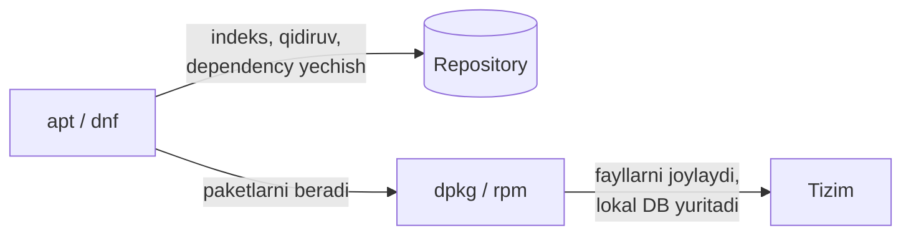

# 11. Package management

> Manba: TLCL 14-bob · Muhit: Ubuntu 24.04 (apt/dpkg) + Fedora 41 (dnf/rpm) · [← Oldingi: vim-basics](10-vim-basics.md) · [Kurs xaritasi](00-README.md) · [Keyingi: storage-and-filesystems →](12-storage-and-filesystems.md)

## Nima uchun kerak

Dockerfile dagi har `RUN apt-get install...` qatori, CI dagi tool o'rnatishlar, serverga htop/jq qo'yish — hammasi package management. Tushunmasdan ishlatish esa klassik muammolarga olib keladi: "unmet dependencies", Dockerfile da keraksiz katta imagelar, "nega bu fayl qaysi paketdan kelganini bilmayman". Bu dars ikki asosiy oilani (deb va rpm) va ularning ichki mexanikasini yoritadi — bilim istalgan distributivda ishlaydi.

## Nazariya

### Paket, repository, dependency

**Paket fayli** (.deb / .rpm) — siqilgan arxiv: dastur fayllari + **metadata** (tavsif, versiya, dependency ro'yxati) + o'rnatish oldidan/keyin ishlaydigan scriptlar. Paketlarni **maintainer** lar tayyorlaydi — upstream manba kodini kompilyatsiya qilib, distributivga moslab.

**Repository** — paketlar ombori (HTTP server): asosiy, security, updates, uchinchi tomon (PPA va h.k.). Paket menejeri repodan **indeks** yuklab, undan qidiradi.

**Dependency resolution** — asosiy qulaylik: `htop` desangiz, unga kerakli shared librarylar avtomatik hisoblanadi va birga o'rnatiladi.

### Ikki daraja: low-level va high-level

| Oila | Distributivlar | Low-level | High-level |
|------|----------------|-----------|------------|
| Debian (.deb) | Debian, Ubuntu, Mint, Raspbian | `dpkg` | `apt` (eski: apt-get) |
| Red Hat (.rpm) | Fedora, RHEL, CentOS/Alma/Rocky | `rpm` | `dnf` (eski: yum) |

- **Low-level** (`dpkg`, `rpm`) — bitta paket fayli bilan ishlaydi: o'rnatadi, o'chiradi, so'raydi. **Dependency larni yechmaydi.**
- **High-level** (`apt`, `dnf`) — repo bilan ishlaydi: qidiradi, dependency yechadi, yangilaydi.



### apt vs apt-get

`apt` (2014) — user uchun qulay interfeys: progress bar, birlashtirilgan buyruqlar, ranglar. `apt-get`/`apt-cache` — eski, script-barqaror interfeys. Interaktiv ish uchun — `apt`; Dockerfile/scriptlarda `apt-get` hali ham keng qo'llanadi (output formati kafolatlangani uchun). Quyida `apt` ishlatamiz.

## Buyruqlar

### Debian oilasi: `apt` + `dpkg` (Ubuntu 24.04 da verify qilingan)

**Indeksni yangilash** — har qidiruv/o'rnatishdan oldingi birinchi qadam:

```console
$ sudo apt update
...
6 packages can be upgraded. Run 'apt list --upgradable' to see them.
```

**Qidirish va ma'lumot:**

```console
$ apt search htop
htop/noble 3.3.0-4build1 arm64
  interactive processes viewer
$ apt show htop
Package: htop
Version: 3.3.0-4build1
Priority: optional
Section: utils
Origin: Ubuntu
```

**O'rnatish / o'chirish:**

```bash
sudo apt install htop
sudo apt remove htop          # config fayllar qoladi
sudo apt purge htop           # configlar bilan
sudo apt autoremove           # yetim qolgan dependency larni tozalash
```

**Yangilash:**

```console
$ apt list --upgradable
gzip/noble-updates,noble-security 1.12-1ubuntu3.2 arm64 [upgradable from: 1.12-1ubuntu3.1]
...
$ sudo apt upgrade            # hammasini yangilash
```

**O'rnatilganlarni ko'rish:**

```console
$ apt list --installed | head -3
adduser/noble,now 3.137ubuntu1 all [installed,automatic]
apt/noble-updates,now 2.8.3 arm64 [installed]
$ dpkg -l | grep htop
ii  htop    3.3.0-4build1    arm64    interactive processes viewer
```

(`ii` = installed+configured; `rc` = removed, configlar qolgan.)

**Detektiv savollar** — `dpkg` ning eng foydali tomoni:

```console
$ dpkg -L htop               # bu paket QAYSI fayllarni qo'ygan?
/usr/bin/htop
/usr/share/applications
...
$ dpkg -S /usr/bin/htop      # bu fayl QAYSI paketdan?
htop: /usr/bin/htop
$ dpkg -S $(which ls)
coreutils: /usr/bin/ls
```

**Lokal .deb fayl o'rnatish:**

```bash
sudo apt install ./package.deb    # zamonaviy usul — dependency ham yechadi
# eski usul: sudo dpkg -i package.deb && sudo apt install -f
```

**Versiyani qotirish (hold):**

```console
$ sudo apt-mark hold vim
$ apt-mark showhold
vim
$ sudo apt-mark unhold vim
```

### Red Hat oilasi: `dnf` + `rpm` (Fedora 41 da verify qilingan)

```console
$ dnf search htop
 htop.aarch64	Interactive process viewer
$ dnf info htop
Name           : htop
Version        : 3.3.0
Release        : 4.fc41
$ sudo dnf install htop
$ rpm -q htop                # o'rnatilganmi?
htop-3.3.0-4.fc41.aarch64
$ rpm -ql htop | head -1     # paket fayllari (= dpkg -L)
/usr/bin/htop
$ rpm -qf /usr/bin/ls        # fayl kimniki? (= dpkg -S)
coreutils-9.5-12.fc41.aarch64
```

### Ikkala oila taqqoslama jadvali

| Vazifa | Debian/Ubuntu | RedHat/Fedora |
|--------|---------------|----------------|
| Indeks yangilash | `apt update` | `dnf check-update` (yoki avtomatik) |
| Qidirish | `apt search x` | `dnf search x` |
| Ma'lumot | `apt show x` | `dnf info x` |
| O'rnatish | `apt install x` | `dnf install x` |
| O'chirish | `apt remove x` | `dnf remove x` |
| Hammasini yangilash | `apt upgrade` | `dnf upgrade` |
| O'rnatilganlar | `apt list --installed` | `dnf list --installed` |
| Paket fayllari | `dpkg -L x` | `rpm -ql x` |
| Fayl → paket | `dpkg -S /yo'l` | `rpm -qf /yo'l` |
| Lokal fayl | `apt install ./x.deb` | `dnf install ./x.rpm` |

## Real-world scenariylar

**1. Dockerfile best practice.** Klassik pattern va nima uchunligi:

```dockerfile
RUN apt-get update && apt-get install -y --no-install-recommends \
    curl ca-certificates \
    && rm -rf /var/lib/apt/lists/*
```

- `update` va `install` **bitta RUN da** — alohida bo'lsa, layer cache eski indeks bilan install urinib 404 oladi;
- `--no-install-recommends` — "tavsiya etilgan" ortiqcha paketlar imagega tushmaydi;
- `rm -rf /var/lib/apt/lists/*` — indeks fayllari (~50MB) imagedan olib tashlanadi.

**2. "Bu binary qayerdan kelgan?"** Serverda notanish `/usr/local/bin/mystery` yotibdi:

```bash
dpkg -S /usr/local/bin/mystery
# "no path found" chiqsa — paketdan EMAS, qo'lda qo'yilgan (deploy? make install?)
```

`dpkg -S` javob bersa — paket nomi orqali `apt show` bilan tarixini bilasiz. `/usr/local` odatda paketlardan tashqarida — 02-darsdagi FHS mantiqli bo'lib qoladi.

**3. Security patch lar.** Production Ubuntu serverlarda `unattended-upgrades` default yoqilgan — **faqat security** yangilanishlarni har kuni avtomatik o'rnatadi. Tekshirish va sozlash:

```bash
systemctl status unattended-upgrades
cat /etc/apt/apt.conf.d/50unattended-upgrades   # nima yangilanadi
# reboot talab qilinsa: /var/run/reboot-required paydo bo'ladi
cat /var/run/reboot-required 2>/dev/null
```

## Zamonaviy yondashuv

- **`yum` → `dnf`, `apt-get` → `apt`**: eski nomlar ishlaydi (symlink/wrapper), lekin yangi interfeyslarni o'rganing. RHEL 8+ da yum aslida dnf.
- **Universal formatlar**: **snap** (Ubuntu, avto-yangilanadi), **flatpak** (desktop apps) — distributivdan mustaqil, sandbox li. Server CLI toollar uchun apt/dnf asosiy bo'lib qolmoqda.
- **Docker imagelar paket menejerni siqib chiqarmoqda**: ko'p hollarda "serverga postgres o'rnatish" o'rniga "postgres konteynerini ishga tushirish". Lekin bazaviy toollar (htop, jq, curl) va host sozlamalari uchun apt/dnf bilim shart.
- **PPA ehtiyotkorligi**: uchinchi tomon repolar — "unmet dependencies" xatolarining eng katta manbai. Kamroq PPA = barqarorroq tizim. Qo'shishdan oldin: rasmiy repoda yo'qligiga ishonch hosil qiling (`apt search`).
- Muqobil: dasturlarni vendor beradigan **tarball/binary release** dan `/usr/local/bin` ga qo'yish (Go binarylar shunday tarqatiladi) — paket menejerdan tashqarida, yangilash qo'lda.

## Keng tarqalgan xatolar

1. **`apt update` va `apt upgrade` ni adashtirish.** `update` — faqat **indeksni** yangilaydi (nima borligini bilib oladi), `upgrade` — paketlarni haqiqatda yangilaydi. `update` hech narsani o'zgartirmaydi, undan qo'rqmang.

2. **Dockerfile da `apt-get update` ni alohida RUN qilish.** Layer caching tufayli keyingi buildda eski indeks + yangi install = 404 xatolar. Doim `update && install` bir RUN da.

3. **Uzilgan o'rnatishdan keyin qotib qolish.** Davosi (tartibda): `sudo dpkg --configure -a` → `sudo apt install -f` (fix-broken) → held paketlar bo'lsa `apt-mark showhold` bilan sababini tekshirish.

4. **`dpkg -i` dan keyin dependency xatolarida qolish.** `dpkg` dependency yechmaydi! Zamonaviy usul: `apt install ./fayl.deb` — hammasini o'zi hal qiladi.

5. **`apt remove` config fayllarni qoldirishini bilmaslik.** Qayta o'rnatishda eski config tufayli g'alati xatti-harakat. To'liq tozalash: `apt purge`, yetimlarni yig'ishtirish: `apt autoremove`.

6. **Har PPA/repo ni o'ylamasdan qo'shish.** Bir yildan keyin release-upgrade da aynan shular sinadi. Qo'shgan repolaringizni `/etc/apt/sources.list.d/` da yuritib boring, keraksizini o'chiring.

## Amaliy mashqlar

Muhit: `docker run -it --rm ubuntu:24.04 bash` (root, sudo kerak emas)

**1.** Indeksni yangilang, `cowsay` paketini toping, o'rnatmasdan hajmi va tavsifini ko'ring.

<details><summary>Yechim</summary>

```bash
apt update
apt search cowsay
apt show cowsay          # Size, Description qatorlari
```
</details>

**2.** `jq` ni o'rnating, u qo'ygan **barcha fayllarni** ko'ring, keyin binary qaysi paketdanligini teskari tekshiring.

<details><summary>Yechim</summary>

```console
# apt install -y jq
# dpkg -L jq | head
/usr/bin/jq ...
# dpkg -S $(which jq)
jq: /usr/bin/jq
```
</details>

**3.** Tizimda nechta paket o'rnatilgan? Nechtasi yangilanishi mumkin?

<details><summary>Yechim</summary>

```bash
dpkg -l | grep -c '^ii'
apt list --upgradable 2>/dev/null | grep -c upgradable
```
</details>

**4.** `curl` binarysi qaysi paketdan? U bilan birga qanday config fayllar kelgan?

<details><summary>Yechim</summary>

```console
# dpkg -S $(which curl)
curl: /usr/bin/curl
# dpkg -L curl | grep etc      # odatda bo'sh — curl config talab qilmaydi
```
</details>

**5.** `vim` ni hold qiling, `apt upgrade` simulyatsiyasida u chetlab o'tilishini ko'ring, keyin unhold qiling.

<details><summary>Yechim</summary>

```console
# apt-mark hold vim && apt-mark showhold
vim
# apt upgrade --dry-run 2>/dev/null | grep -i "held\|vim" | head -3
# apt-mark unhold vim
```
`--dry-run` — hech narsani o'zgartirmasdan rejani ko'rsatadi.
</details>

**6.** `htop` ni o'rnatib, keyin `remove` va `purge` farqini isbotlang (maslahat: `dpkg -l | grep htop` dagi holat belgisi).

<details><summary>Yechim</summary>

```console
# apt install -y htop && apt remove -y htop
# dpkg -l | grep htop
rc  htop ...        # rc = removed, config qolgan
# apt purge -y htop
# dpkg -l | grep htop
                    # endi butunlay yo'q
```
(htop da config fayllar kam — kuchliroq misol: biror servisni remove/purge qilish.)
</details>

**7.** (Qiyinroq) Dockerfile yozing: Ubuntu 24.04 asosida `curl` va `jq` o'rnatilgan minimal image. Best practice larni qo'llang va image hajmini `--no-install-recommends` siz variant bilan solishtiring.

<details><summary>Yechim</summary>

```dockerfile
FROM ubuntu:24.04
RUN apt-get update && apt-get install -y --no-install-recommends \
    curl jq ca-certificates \
    && rm -rf /var/lib/apt/lists/*
```
```bash
docker build -t test:slim .
# --no-install-recommends ni olib tashlab test:fat qiling
docker images | grep test      # hajm farqini ko'ring
```
</details>

## Cheat sheet

| Buyruq | Nima qiladi | Eng ko'p ishlatiladigan variant |
|--------|-------------|--------------------------------|
| `apt update` | Repo indeksini yangilash | har installdan oldin |
| `apt search` / `show` | Qidirish / ma'lumot | `apt show paket` |
| `apt install` | O'rnatish | `apt install -y paket`, `apt install ./x.deb` |
| `apt remove` / `purge` | O'chirish (configsiz / to'liq) | `apt purge paket && apt autoremove` |
| `apt upgrade` | Yangilash | `apt list --upgradable` bilan oldin ko'rish |
| `apt-mark` | Hold boshqaruvi | `hold` / `unhold` / `showhold` |
| `dpkg -l` | O'rnatilganlar | `dpkg -l \| grep nom` |
| `dpkg -L` | Paket fayllari | `dpkg -L paket` |
| `dpkg -S` | Fayl → paket | `dpkg -S $(which cmd)` |
| `dnf` / `rpm` | RedHat ekvivalentlari | `dnf install`, `rpm -ql`, `rpm -qf` |
| Tuzatish | — | `dpkg --configure -a` → `apt install -f` |

## Qo'shimcha manbalar

- [Ubuntu Server docs — Package management](https://documentation.ubuntu.com/server/how-to/software/package-management/) — rasmiy qo'llanma
- [Fedora docs — DNF](https://docs.fedoraproject.org/en-US/quick-docs/dnf/) — dnf rasmiy hujjati
- [Fix Broken Packages on Ubuntu](https://oneuptime.com/blog/post/2026-01-15-fix-broken-packages-ubuntu/view) — buzilgan holatlarni tuzatish bo'yicha amaliy maqola

---

[← Oldingi: 10 — vim-basics](10-vim-basics.md) · [Kurs xaritasi](00-README.md) · [Keyingi: 12 — storage-and-filesystems →](12-storage-and-filesystems.md)
