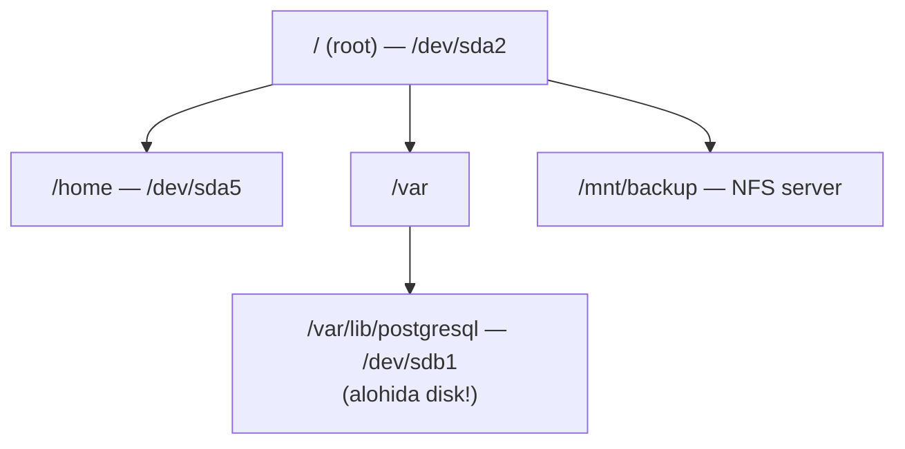

# 12. Storage va fayl tizimlari

> Manba: TLCL 15-bob · Muhit: Ubuntu 24.04 (privileged konteynerda loop device bilan) · [← Oldingi: package-management](11-package-management.md) · [Kurs xaritasi](00-README.md) · [Keyingi: networking →](13-networking.md)

## Nima uchun kerak

"No space left on device" — production dagi eng klassik insident: loglar to'lib ketdi, DB yozolmayapti, deploy yiqildi. Bu darsdan keyin siz: 3 daqiqada qaysi katalog diskni yeganini topasiz; `df` 100% deyapti-yu `du` topolmayotgan "sirli" joyni fosh qilasiz (deleted-but-open fayllar); yangi disk qo'shib mount qilasiz. Docker volumelar, K8s PersistentVolume lar — hammasi ostida shu mexanika yotadi.

## Nazariya

### Mounting — diskni daraxtga ulash

Linux da alohida "disk D:\" yo'q — har qanday storage (disk partition, USB, network storage, hatto fayl ichidagi image) daraxtning biror nuqtasiga — **mount point** katalogiga ulanadi. Ulangandan keyin u shunchaki katalog bo'lib ko'rinadi.



### Device nomlari va UUID

Disklar `/dev` da fayl sifatida: `/dev/sda` (birinchi disk), `/dev/sda1` (uning 1-partitioni), `/dev/nvme0n1p1` (NVMe), `/dev/vda` (virtual mashinada). Muammo: nomlar **qayta yuklashda o'zgarishi mumkin** (disk qo'shilsa sdb sda bo'lib qolishi...). Yechim — **UUID**: fayl tizimi yaratilganda beriladigan unikal ID (tekshirilgan):

```console
$ blkid /disk.img
/disk.img: LABEL="testdisk" UUID="7e6de837-0d92-4055-b9ed-7f201a071e2f" BLOCK_SIZE="4096" TYPE="ext4"
```

### `/etc/fstab` — yuklashda nima mount qilinadi

Har qator: `device  mount_point  fs_type  options  dump  fsck_order`

```
UUID=7e6de837-...  /data   ext4   defaults          0  2
/dev/sdb1          /backup ext4   ro,noexec         0  2
tmpfs              /tmp    tmpfs  size=2G           0  0
```

Optionlar foydali: `ro` (read-only), `noexec` (dastur ishlatib bo'lmaydi — removable media uchun xavfsizlik), `defaults`. Device sifatida **UUID ishlating** — 5-darsdagi `man 5 fstab` esingizdami?

### Fayl tizimi turlari

| Tur | Qayerda |
|-----|---------|
| **ext4** | Linux standart — default tanlov |
| **xfs** | RHEL default, katta fayllar/parallel I/O da kuchli |
| **btrfs/zfs** | Snapshot, checksum — NAS/ilg'or setuplar |
| **vfat/exfat** | USB fleshkalar, Windows bilan umumiy |
| **ntfs** | Windows disklari |
| **tmpfs** | RAM da — `/tmp`, `/run` |
| **overlay** | Docker image layerlari! `df -h /` konteynerda shuni ko'rsatadi |

## Buyruqlar

### `df` — fayl tizimlari darajasida joy

```console
$ df -h
Filesystem      Size  Used Avail Use% Mounted on
overlay         453G   12G  418G   3% /
tmpfs            64M     0   64M   0% /dev
shm              64M     0   64M   0% /dev/shm
```

`-h` — human-readable. Kam ma'lum, lekin kritik: **`df -i` — inode hisobi**:

```console
$ df -i /
Filesystem       Inodes  IUsed    IFree IUse% Mounted on
overlay        30179328 218867 29960461    1% /
```

Millionlab mayda fayl (session fayllar, cache) inode larni tugatadi — joy bor-u, "No space left" chiqadi. `df -h` normal ko'rinsa — `df -i` ni tekshiring.

### `du` — kataloglar darajasida joy

```console
$ du -sh /usr/share/* | sort -rh | head -5
2.4M	/usr/share/doc
612K	/usr/share/locale
576K	/usr/share/info
528K	/usr/share/perl5
352K	/usr/share/bash-completion
```

`-s` — katalog yig'indisi, `-h` — human, `sort -rh` — kattadan kichikka. Disk yeguvchini topish algoritmi: `/` dan boshlab qavat-qavat pastga tushish (Real-world 1-scenariy).

### `lsblk` — blok qurilmalar daraxti

```bash
lsblk          # disklar, partitionlar, mount pointlar — eng tez umumiy ko'rinish
lsblk -f       # + fayl tizimi turi va UUID
```

Real serverda odatiy natija: `sda` → `sda1 /boot`, `sda2 /` ko'rinishidagi daraxt. (Konteynerda host disklari ko'rinmaydi — izolyatsiya.)

### `mount` / `umount`

```bash
mount                              # hozir nima mount qilingan (argumentsiz)
sudo mount /dev/sdb1 /mnt/data     # qo'lda mount
sudo mount -o ro /dev/sdb1 /mnt    # read-only
sudo umount /mnt/data              # ajratish (buyruq: umount, uNmount emas!)
```

To'liq amaliy sikl — fayl ichida disk yasab ko'ramiz (hammasi verify qilingan):

```console
$ dd if=/dev/zero of=/disk.img bs=1M count=100      # 1. 100MB bo'sh "disk"
104857600 bytes (105 MB, 100 MiB) copied, 0.0299338 s, 3.5 GB/s
$ mkfs.ext4 -L testdisk /disk.img                    # 2. fayl tizimi yaratish
$ mkdir -p /mnt/test && mount -o loop /disk.img /mnt/test    # 3. mount
$ df -h /mnt/test
Filesystem      Size  Used Avail Use% Mounted on
/dev/loop0       90M   24K   83M   1% /mnt/test
$ echo "salom disk" > /mnt/test/hello.txt            # 4. ishlatish
$ mount | grep /mnt/test
/disk.img on /mnt/test type ext4 (rw,relatime)
$ umount /mnt/test                                   # 5. ajratish
```

Bu **loop device** texnikasi o'quv mashqigina emas — ISO fayllarni ochish, disk imagelar bilan ishlash, test muhitlari uchun kundalik asbob.

### `fdisk` — partition jadvali

```bash
sudo fdisk -l              # barcha disklar va partitionlar (xavfsiz, faqat o'qiydi)
sudo fdisk /dev/sdb        # interaktiv partitionlash (EHTIYOT!)
```

Interaktiv buyruqlari: `p` — ko'rish, `n` — yangi partition, `d` — o'chirish, `t` — tur, `w` — **yozish** (shu paytgacha hech nima o'zgarmaydi), `q` — yozmasdan chiqish. Zamonaviy >2TB disklar uchun GPT jadval — `gdisk` yoki `parted`.

### `mkfs` — fayl tizimi yaratish

```bash
sudo mkfs.ext4 -L data /dev/sdb1     # -L — label
sudo mkfs.xfs /dev/sdb1
```

**DIQQAT: mkfs partition dagi hamma narsani yo'q qiladi.** Ikki marta tekshiring: `lsblk` da to'g'ri diskmi?

### `fsck` — tekshirish va tuzatish

```console
$ fsck.ext4 -fy /disk.img
Pass 5: Checking group summary information
/disk.img: 11/12800 files (9.1% non-contiguous), 1840/12800 blocks
```

(`-f` — majburiy to'liq tekshiruv, `-y` — savollarga avtomatik "yes".) Qoida: **faqat umount qilingan** fayl tizimida ishlating — mounted da ishlatish buzilishga olib keladi. Root FS uchun — recovery rejimdan.

### `dd` — bloklab nusxalash

```bash
dd if=/dev/zero of=file.img bs=1M count=100     # bo'sh image
sudo dd if=/dev/sda of=disk-backup.img bs=4M status=progress   # butun diskni image ga
sudo dd if=ubuntu.iso of=/dev/sdX bs=4M status=progress        # bootable USB yozish
```

Hazil nomi — "disk destroyer": `if=`/`of=` ni almashtirib yuborish = ma'lumot o'ldi. Har ishlatishda uch marta o'qing. `status=progress` — jarayonni ko'rsatadi.

## Real-world scenariylar

**1. "Disk to'ldi" — standart tergov protokoli:**

```bash
df -h                                    # qaysi FS to'lgan?
df -i                                    # inode emasmi?
sudo du -xsh /var/* | sort -rh | head    # -x: boshqa FS ga o'tmaslik
sudo du -xsh /var/log/* | sort -rh | head
# odatiy aybdorlar: /var/log, /var/lib/docker, /tmp, eski backuplar
```

**2. `df` 90% deydi, `du` esa topolmaydi — deleted-but-open fayl.** Process ochib turgan faylni `rm` qilsangiz, katalogdan yozuv o'chadi, lekin **bloklar band qoladi** (process yopguncha). To'liq verify qilingan demo:

```console
$ df -h /mnt/t | tail -1
/dev/loop0       43M   31M  9.4M  77% /mnt/t
$ rm /mnt/t/big.log                     # 30MB faylni o'chirdik
$ df -h /mnt/t | tail -1
/dev/loop0       43M   31M  9.4M  77% /mnt/t     # JOY BO'SHAMADI!
$ lsof +L1 | head -2
COMMAND PID USER   FD   TYPE DEVICE SIZE/OFF NLINK NODE NAME
tail    244 root    3r   REG    7,0 31457280     0   12 /mnt/t/big.log (deleted)
$ kill 244                              # processni qayta ishga tushirish/o'ldirish
$ df -h /mnt/t | tail -1
/dev/loop0       43M   24K   40M   1% /mnt/t     # endi bo'shadi
```

Shuning uchun katta log ni `rm` emas — `truncate -s 0 fayl` yoki `> fayl` qiling (process yozishda davom etadi, joy bo'shaydi).

**3. Docker disk yeyapti.**

```bash
docker system df                # image/container/volume bo'yicha hisob
docker system prune -af --volumes   # ishlatilmayotganlarni tozalash (EHTIYOT: volumes!)
du -xsh /var/lib/docker/overlay2 2>/dev/null
```

## Zamonaviy yondashuv

- **[ncdu](https://dev.yorhel.nl/ncdu)** — interaktiv du: `ncdu /var` bilan katalogda strelkalar orqali "sayohat" qilib eng katta narsani tez topasiz. Server debugging uchun birinchi o'rnatiladigan toollardan. **duf** — chiroyli df muqobili.
- **LVM (Logical Volume Manager)** — partition va disk o'rtasida abstraksiya: diskni to'xtatmasdan kengaytirish (`lvextend` + `resize2fs`). Cloud VM larda disk kattalashtirish shu orqali. Basic kursda chuqurlashmaymiz, lekin `lsblk` da `lvm` tipini ko'rsangiz — bilib qo'ying.
- **Cloudda partition kamaymoqda**: EBS/PD disk odatda butunligicha bitta FS (partitionsiz), kengaytirish — cloud konsolda + `growpart`/`resize2fs`. `fdisk` bilimi baribir kerak (bare-metal, VM disklari).
- **CD/DVD yozish (kitobning genisoimage/wodim qismi) — tarix**; ISO bilan ishlash qoldi: `mount -o loop file.iso /mnt` — o'sha loop texnikasi.
- **smartctl** (`smartmontools`) — disk salomatligi: `sudo smartctl -H /dev/sda`.

## Keng tarqalgan xatolar

1. **`du` va `df` farqini bilmaslik.** `df` — FS darajasida (superblock dan, tez), `du` — fayllarni sanab (sekin, faqat ko'rgan fayllari). Farq katta bo'lsa: deleted-but-open fayllar (`lsof +L1`) yoki mount ostida "ko'milgan" fayllar.

2. **Band fayl tizimini umount qilishga urinish — "target is busy".** Kim band qilganini toping: `lsof +D /mnt/data` yoki `fuser -vm /mnt/data`. O'sha processni yopib, keyin umount.

3. **`mkfs` ni noto'g'ri diskda ishga tushirish.** Qaytarib bo'lmaydi. Himoya rituali: avval `lsblk -f` — nom, hajm, label mosligini ko'zdan kechirish; faqat keyin mkfs.

4. **fstab ga xato yozib, server yuklanmay qolishi.** fstab dagi sintaksis xato yoki yo'q UUID = boot da emergency mode. Himoya: yozgandan keyin **reboot dan oldin** `sudo mount -a` bilan tekshiring (fstabdagi hammasini mount qilib ko'radi); `nofail` optioni — disk topilmasa ham yuklanaversin.

5. **Katta faylni `rm` qilib "joy bo'shamadi" deb hayron qolish.** Yuqoridagi 2-scenariy. Log fayllar uchun: `truncate -s 0`, yoki logrotate sozlash.

6. **Mounted FS da fsck ishlatish.** Ma'lumot buziladi. Faqat umount dan keyin (yoki boot-time tekshiruv).

## Amaliy mashqlar

Muhit: `docker run -it --rm --privileged ubuntu:24.04 bash` (loop mount uchun `--privileged` kerak; ichida `apt update && apt install -y e2fsprogs lsof ncdu`)

**1.** Tizimingizda qaysi fayl tizimlari mount qilingan va har birida qancha joy bor? Inode holati-chi?

<details><summary>Yechim</summary>

```bash
df -h        # joy
df -i        # inode
mount | head # yoki: findmnt
```
</details>

**2.** `/usr` ichidagi eng "og'ir" 5 katalogni toping.

<details><summary>Yechim</summary>

```console
$ du -sh /usr/* | sort -rh | head -5
```
Yoki interaktiv: `ncdu /usr`.
</details>

**3.** 50MB lik fayl-disk yarating, unga ext4 o'rnating, `/mnt/lab` ga mount qilib bitta fayl yozing, keyin toza ajrating.

<details><summary>Yechim</summary>

```bash
dd if=/dev/zero of=/lab.img bs=1M count=50
mkfs.ext4 -q -L lab /lab.img
mkdir -p /mnt/lab && mount -o loop /lab.img /mnt/lab
echo test > /mnt/lab/f.txt && df -h /mnt/lab
umount /mnt/lab
```
</details>

**4.** 3-mashqdagi imagening UUID va labelini toping. fstab qatori qanday yozilardi?

<details><summary>Yechim</summary>

```console
$ blkid /lab.img
/lab.img: LABEL="lab" UUID="..." TYPE="ext4"
```
fstab: `UUID=<o'sha-uuid>  /mnt/lab  ext4  defaults,nofail  0  2`
</details>

**5.** Umount qilingan imageni `fsck` bilan tekshiring. Nega mounted holatda mumkin emas?

<details><summary>Yechim</summary>

```bash
fsck.ext4 -fy /lab.img
```
Mounted FS da kernel va fsck bir vaqtda metadata ni o'zgartirib, bir-birining ishini buzadi — natija: korruptsiya.
</details>

**6.** Deleted-but-open stsenariysini o'zingiz yarating: mount qilingan FS da katta fayl oching (`tail -f` bilan), o'chiring, `df` o'zgarmasligini ko'ring, `lsof +L1` bilan toping, processni o'ldirib joy qaytganini tasdiqlang.

<details><summary>Yechim</summary>

Yuqoridagi Real-world 2-scenariyning aynan o'zi:
```bash
mount -o loop /lab.img /mnt/lab
dd if=/dev/zero of=/mnt/lab/big.log bs=1M count=30
tail -f /mnt/lab/big.log >/dev/null & 
rm /mnt/lab/big.log
df -h /mnt/lab      # band
lsof +L1            # aybdor: tail ... (deleted)
kill %1 && df -h /mnt/lab    # bo'shadi
```
</details>

**7.** (Qiyinroq) Inode tugashi bilan "disk to'ldirish": kichik image yarating va joy bor bo'lsa ham yozib bo'lmaydigan holatga keltiring.

<details><summary>Yechim</summary>

```bash
dd if=/dev/zero of=/tiny.img bs=1M count=10
mkfs.ext4 -q -N 32 /tiny.img          # atigi 32 inode!
mkdir -p /mnt/tiny && mount -o loop /tiny.img /mnt/tiny
for i in $(seq 1 40); do touch /mnt/tiny/f$i 2>/dev/null; done
touch /mnt/tiny/yana 2>&1              # "No space left on device"
df -h /mnt/tiny                        # joy deyarli bo'sh!
df -i /mnt/tiny                        # IUse% = 100 — sabab shu
```
</details>

## Cheat sheet

| Buyruq | Nima qiladi | Eng ko'p ishlatiladigan variant |
|--------|-------------|--------------------------------|
| `df` | FS bo'yicha joy | `df -h`, `df -i` (inode!) |
| `du` | Katalog bo'yicha joy | `du -xsh /var/* \| sort -rh \| head` |
| `ncdu` | Interaktiv du | `ncdu /var` |
| `lsblk` | Disklar daraxti | `lsblk -f` |
| `blkid` | UUID/label | `blkid /dev/sdb1` |
| `mount` | Ulash / ro'yxat | `mount -o loop img /mnt`, `mount -a` (fstab test) |
| `umount` | Ajratish | band bo'lsa: `lsof +D /mnt` |
| `fdisk` | Partition | `fdisk -l` (xavfsiz ko'rish) |
| `mkfs.ext4` | FS yaratish (data o'ladi!) | `mkfs.ext4 -L label /dev/...` |
| `fsck` | Tekshirish (faqat umounted!) | `fsck.ext4 -fy` |
| `dd` | Blok nusxa | `dd if=... of=... bs=4M status=progress` |
| `lsof +L1` | O'chirilgan-ochiq fayllar | df/du farqi tergovi |
| `truncate -s 0` | Faylni bo'shatish (rm siz) | katta loglar uchun |

## Qo'shimcha manbalar

- [man 5 fstab](https://man7.org/linux/man-pages/man5/fstab.5.html) — fstab maydonlarining rasmiy tavsifi
- [Find Deleted Files Still Holding Disk Space](https://www.tecmint.com/df-du-disk-usage-difference-linux/) — df/du farqi va lsof amaliyoti
- [Arch Wiki — File systems](https://wiki.archlinux.org/title/File_systems) — FS turlari bo'yicha chuqur spravochnik

---

[← Oldingi: 11 — package-management](11-package-management.md) · [Kurs xaritasi](00-README.md) · [Keyingi: 13 — networking →](13-networking.md)
