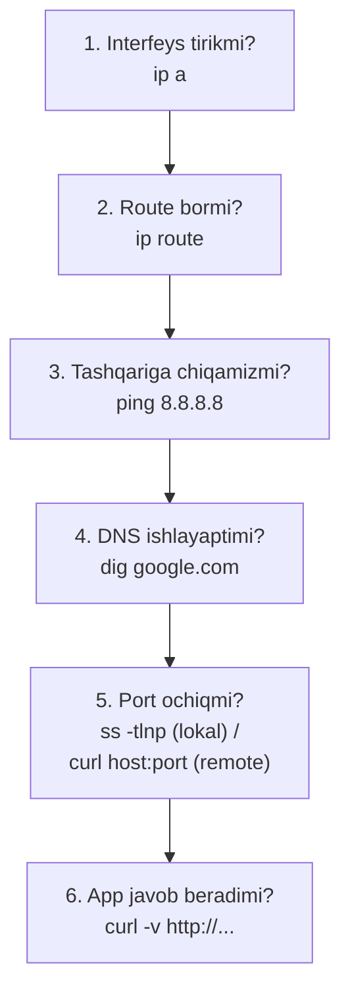

# 13. Networking

> Manba: TLCL 16-bob · Muhit: Ubuntu 24.04 (konteynerda sshd bilan) · [← Oldingi: storage-and-filesystems](12-storage-and-filesystems.md) · [Kurs xaritasi](00-README.md) · [Keyingi: finding-files →](14-finding-files.md)

## Nima uchun kerak

Backend developerning ish joyi — remote server. "Servis 5432-portda eshityaptimi?", "DNS to'g'ri resolve bo'lyaptimi?", "Nega konteynerdan tashqariga chiqolmayapti?" — bu savollar har haftalik. Bu darsda diagnostika zanjiri (ping → DNS → route → port) va SSH ekotizimini o'rganamiz. Muhim: kitobdagi `netstat`/`ifconfig` avlodi eskirgan — biz zamonaviy `ip`/`ss` bilan ishlaymiz.

## Nazariya

### Diagnostika qatlamma-qatlam

Tarmoq muammosi — deyarli har doim qatlamlardan bittasida. Tekshirish tartibi:



`ping 8.8.8.8` ishlasa-yu `ping google.com` ishlamasa — muammo DNS da. Bu bitta farq soatlab vaqtni tejaydi.

### Eski va yangi asboblar

`net-tools` paketi (ifconfig, netstat, route) 2001 yildan beri rivojlanmaydi; zamonaviy distributivlarda default o'rnatilmagan ham. O'rnini `iproute2` oilasi egallagan:

| Eski (bilish kerak) | Yangi (ishlatish kerak) |
|--------------------|--------------------------|
| `ifconfig` | `ip a` (address), `ip link` |
| `route` | `ip route` |
| `netstat -tlnp` | `ss -tlnp` |
| `arp` | `ip neigh` |

`ss` kernel bilan netlink orqali to'g'ridan-to'g'ri gaplashadi — minglab connectionli serverda netstat dan sezilarli tez.

## Buyruqlar

### `ping` — u tirikmi?

```console
$ ping -c 3 google.com
PING google.com (142.250.109.101) 56(84) bytes of data.
64 bytes from zr-in-f101.1e100.net (142.250.109.101): icmp_seq=1 ttl=63 time=92.5 ms
64 bytes from zr-in-f101.1e100.net (142.250.109.101): icmp_seq=2 ttl=63 time=93.1 ms
--- google.com ping statistics ---
3 packets transmitted, 3 received, 0% packet loss, time 2011ms
rtt min/avg/max/mdev = 93.260/94.622/95.510/0.977 ms
```

`-c 3` — 3 paket bilan cheklab (aks holda Ctrl+C gacha ishlaydi). O'qish: **packet loss** 0% = yo'l sog'lom; **rtt avg** — kechikish. Diqqat: ko'p firewall ICMP ni bloklaydi — "ping ishlamadi" hali "server o'lik" degani emas (port tekshiruvi aniqroq: pastda).

### `traceroute` — yo'l qayerda uziladi?

```console
$ traceroute -m 6 google.com
traceroute to google.com (142.250.109.101), 6 hops max, 60 byte packets
 1  172.17.0.1 (172.17.0.1)  0.034 ms  0.008 ms  0.007 ms
 2  * * *
 3  * * *
```

Har qator — bitta router (hop). `* * *` — javob bermagan hop (firewall/sozlama; har doim ham muammo emas). Foydasi: "internal tarmoqdami muammo yoki provayderdami" savoliga javob. Muqobillari: `tracepath`, `mtr` (jonli traceroute+ping).

### `ip` — interfeys va routelar

```console
$ ip a
1: lo: <LOOPBACK,UP,LOWER_UP> mtu 65536 ...
    inet 127.0.0.1/8 scope host lo
...
$ ip route
default via 172.17.0.1 dev eth0
172.17.0.0/16 dev eth0 proto kernel scope link src 172.17.0.2
```

O'qish: `ip a` da interfeys `UP` mi va `inet` (IP manzil) bormi; `ip route` da `default via ...` — gateway. Docker konteyner ichidamiz — `172.17.0.x` (docker0 bridge tarmog'i) shundan.

Qisqartmalar to'liq shakli: `ip addr show`, `ip route show` — `ip a`, `ip r` yetadi.

### `ss` — socket statistikasi (netstat vorisi)

```console
$ ss -tlnp
State  Recv-Q Send-Q Local Address:Port Peer Address:Port Process
LISTEN 0      128          0.0.0.0:22        0.0.0.0:*    users:(("sshd",pid=6027,fd=3))
LISTEN 0      128             [::]:22           [::]:*    users:(("sshd",pid=6027,fd=4))
```

Flaglar — yodlab olinadigan kombinatsiya **`-tlnp`**: **t**cp, **l**isten, **n**umeric (DNS so'ramasdan), **p**rocess. Javob beradigan savollari:

```bash
ss -tlnp                      # kim qaysi portda eshityapti?
ss -tnp | grep 5432           # postgresga kim ulangan?
ss -s                         # umumiy statistika
```

`0.0.0.0:22` — barcha interfeyslardan qabul qiladi; `127.0.0.1:5432` — faqat localhost dan (tashqaridan ulanib bo'lmaydi — klassik "nega DB ga ulanolmayman" javobi).

### DNS: `dig` / `host`

```console
$ dig +short google.com
142.250.109.101
142.250.109.102
```

`dig +short` — tez javob; to'liq `dig google.com` — TTL, qaysi DNS server javob berdi va h.k. `/etc/resolv.conf` — tizim qaysi DNS serverdan so'raydi; `/etc/hosts` — lokal override lar (docker compose service nomlari ham shunga o'xshash mexanizmda ishlaydi).

### `wget` va `curl` — fayl olish va API tekshirish

```console
$ wget -q https://raw.githubusercontent.com/torvalds/linux/master/README -O linux-readme
$ head -2 linux-readme
Linux kernel
============
```

`wget` — fayl **yuklab olish** ga qulay (rekursiv mirror, davom ettirish `-c`). `curl` — HTTP bilan **gaplashish** uchun universal asbob:

```console
$ curl -s -o /dev/null -w "HTTP status: %{http_code}, vaqt: %{time_total}s\n" https://example.com
HTTP status: 200, vaqt: 0.381541s
$ curl -s https://api.github.com/zen
Anything added dilutes everything else.
```

Backend arsenalidagi eng ko'p ishlatiladigan curl flaglari:

```bash
curl -v https://api.example.com/health      # -v: so'rov/javob headerlari (TLS ham)
curl -i -X POST -H "Content-Type: application/json" -d '{"a":1}' http://localhost:8080/api
curl -sS --fail http://localhost:8080/healthz   # script uchun: xatoda nonzero exit
```

### `ssh` — remote shell

SSH — shifrlangan kanal orqali remote shell. Autentifikatsiya: parol yoki **kalit jufti** (standart — kalit).

```bash
ssh-keygen -t ed25519                      # kalit yaratish (zamonaviy tur — ed25519)
ssh-copy-id user@server                    # ochiq kalitni serverga qo'shish
ssh user@server                            # interaktiv sessiya
ssh user@server "buyruq"                   # bitta buyruq bajarib qaytish
```

Konteynerda sshd ko'tarib real tekshirilgan:

```console
$ ssh localhost "echo Uzoq serverda: \$(hostname); uname -m"
Uzoq serverda: 1af0fe06007c
aarch64
$ ssh localhost "df -h / | tail -1"
overlay         453G   13G  417G   3% /
```

E'tibor bering: `\$(hostname)` — escape qilingan, **remote da** expand bo'ladi; escapesiz bo'lsa lokalda expand bo'lardi (06-dars quoting!).

`~/.ssh/config` — ulanishlarni qisqartirish:

```
Host prod
    HostName 203.0.113.10
    User deploy
    IdentityFile ~/.ssh/id_ed25519_work
```

Endi `ssh prod` yetarli. Permissions muhim (07-dars): `~/.ssh` = 700, kalitlar = 600.

### `scp` / `sftp` — SSH orqali fayl

```console
$ scp /tmp/app.conf localhost:/tmp/app.conf.copy
$ ssh localhost "cat /tmp/app.conf.copy"
muhim config
```

```bash
scp fayl user@server:/yo'l/            # u yoqqa
scp user@server:/yo'l/fayl .           # bu yoqqa
scp -r katalog user@server:/yo'l/      # rekursiv
```

Katta/davomiy sinxronlash uchun `rsync` afzal (15-dars).

## Real-world scenariylar

**1. "Servisga ulanib bo'lmayapti" — to'liq zanjir.**

```bash
ssh app-server                       # 1. serverga kiramiz
ss -tlnp | grep 8080                 # 2. app eshityaptimi? qaysi manzilda?
curl -s localhost:8080/healthz       # 3. lokal ishlayaptimi?
# lokal OK, tashqaridan yo'q bo'lsa: 0.0.0.0 emas 127.0.0.1 da eshitayotgan
# yoki firewall/security-group port yopiq
```

**2. DNS muammosini ajratish.**

```bash
ping -c1 8.8.8.8 && echo "internet BOR"
dig +short api.partner.com || echo "DNS YO'Q"
dig @8.8.8.8 +short api.partner.com    # boshqa DNS dan so'rab solishtirish
cat /etc/resolv.conf                    # tizim kimdan so'rayapti?
```

**3. SSH tunnel — DB ga xavfsiz ulanish.** Production Postgres faqat private tarmoqda; lokal psql bilan ulanish:

```bash
ssh -L 15432:db.internal:5432 bastion-host -N
# endi lokalda: psql -h localhost -p 15432
```

`-L` — local port forwarding: lokal 15432 → bastion orqali → db.internal:5432. Har backend developerning "maxfiy quroli".

## Zamonaviy yondashuv

- **`ss` va `ip`** — standart; `netstat`/`ifconfig` faqat eski serverlarda uchraydi (bilish foydali, o'rganish shart emas).
- **`mtr`** — traceroute + ping jonli kombinatsiyasi: `mtr google.com` — har hop bo'yicha loss/latency real vaqtda.
- **HTTP diagnostika evolyutsiyasi**: [httpie](https://httpie.io) (`http GET api.example.com`) — odam uchun qulay curl; `curl` esa universal standart bo'lib qolaveradi (har serverda bor).
- **SSH kalitlari**: RSA o'rniga **ed25519** (qisqa, tez, xavfsiz); parol autentifikatsiyani production da o'chirish (`PasswordAuthentication no`) — standart hardening.
- **Portlarni tashqaridan skanlash**: `nc -zv host 5432` yoki `nmap` — "firewall portni yopganmi" savoliga javob (faqat o'z infratuzilmangizda!).
- Konteyner dunyosida: `docker network inspect`, `docker exec app ss -tlnp` — xuddi shu asboblar namespace ichida.

## Keng tarqalgan xatolar

1. **"Ping ishlamadi = server o'lik" xulosasi.** ICMP ko'p joyda bloklangan. To'g'ri tekshiruv — kerakli portning o'zi: `nc -zv host 443` yoki `curl -v telnet://host:443`.

2. **`ss -tlnp` da manzil farqiga e'tibor bermaslik.** `127.0.0.1:8080` — faqat lokal; `0.0.0.0:8080` — hamma joydan. Docker da app `localhost` ga bind qilinsa, port mapping ishlamaydi — konteyner ichida `0.0.0.0` ga bind qiling.

3. **SSH da `Permission denied (publickey)` bilan kurashda parol so'ramasligini tushunmaslik.** Server parol auth ni o'chirgan. Tekshiruv: `ssh -v user@host` — qaysi kalitlarni sinayotganini ko'rsatadi; ko'pincha muammo noto'g'ri kalit yoki `~/.ssh` permissions (700/600!).

4. **`ssh server buyruq` da quoting.** `ssh server "echo $HOME"` — **lokal** HOME chiqadi (double quote ichida lokal expand!). Remote uchun: `ssh server 'echo $HOME'` yoki `\$HOME`.

5. **wget/curl natijasini tekshirmasdan pipe ga berish.** `curl url | bash` — xavfli pattern; hech bo'lmasa avval faylga olib o'qing. Scriptda: `curl --fail -sS` — 404 ham "muvaffaqiyat" bo'lib qolmasligi uchun.

6. **DNS cache/TTL ni unutish.** DNS yozuvni o'zgartirdingiz-u "ishlamayapti" — TTL tugashini kutish kerak yoki `dig +short @8.8.8.8` bilan haqiqiy holatni ko'rish.

## Amaliy mashqlar

Muhit: `docker run -it --rm ubuntu:24.04 bash`, ichida: `apt update && apt install -y iputils-ping traceroute iproute2 dnsutils curl wget openssh-server openssh-client`

**1.** Konteyneringizning IP manzili va default gateway ini toping.

<details><summary>Yechim</summary>

```console
$ ip a | grep "inet "        # 172.17.0.x /16
$ ip route | head -1
default via 172.17.0.1 dev eth0
```
</details>

**2.** DNS siz va DNS bilan tekshiruv: `8.8.8.8` ga ping qiling, keyin `github.com` ning IP larini `dig` bilan toping va bittasiga ping qiling.

<details><summary>Yechim</summary>

```bash
ping -c2 8.8.8.8
dig +short github.com
ping -c2 $(dig +short github.com | head -1)
```
</details>

**3.** `example.com` ga curl bilan: (a) faqat HTTP statusni oling; (b) faqat response headerlarni ko'ring; (c) umumiy vaqtni o'lchang.

<details><summary>Yechim</summary>

```bash
curl -s -o /dev/null -w "%{http_code}\n" https://example.com     # (a)
curl -sI https://example.com | head -5                            # (b) -I = HEAD
curl -s -o /dev/null -w "%{time_total}s\n" https://example.com    # (c)
```
</details>

**4.** Konteynerda sshd ishga tushiring, kalit jufti yarating va parolsiz `ssh localhost` ishlashiga erishing.

<details><summary>Yechim</summary>

```bash
mkdir -p /run/sshd && /usr/sbin/sshd
ssh-keygen -t ed25519 -N "" -f ~/.ssh/id_ed25519
cat ~/.ssh/id_ed25519.pub >> ~/.ssh/authorized_keys
chmod 700 ~/.ssh && chmod 600 ~/.ssh/authorized_keys
ssh -o StrictHostKeyChecking=accept-new localhost hostname
```
</details>

**5.** `ss -tlnp` bilan sshd qaysi manzil:portda eshitayotganini aniqlang. `0.0.0.0:22` va `127.0.0.1:22` farqini tushuntiring.

<details><summary>Yechim</summary>

```console
$ ss -tlnp | grep sshd
LISTEN 0  128  0.0.0.0:22 ... ("sshd",pid=...)
```
`0.0.0.0` — barcha interfeyslar (tashqaridan ulanish mumkin); `127.0.0.1` — faqat shu mashina ichidan.
</details>

**6.** ssh orqali **bitta buyruq** bilan localhost dagi "remote" tizimning: hostname, disk holati va load average ini bitta qatorda oling.

<details><summary>Yechim</summary>

```bash
ssh localhost 'echo "$(hostname) | $(df -h / | tail -1 | awk "{print \$5}") | $(uptime | grep -o "load average.*")"'
```
Quotinglar qatlamiga e'tibor: tashqi single quote — hammasi remote da expand bo'ladi.
</details>

**7.** (Qiyinroq) scp va ssh pipe ni solishtiring: 10MB fayl yarating, uni (a) scp bilan, (b) `cat fayl | ssh localhost "cat > /tmp/f2"` bilan ko'chiring. Ikkalasi ham ishlashini va hajm bir xilligini tekshiring.

<details><summary>Yechim</summary>

```bash
dd if=/dev/urandom of=/tmp/big bs=1M count=10
scp -q /tmp/big localhost:/tmp/big-scp
cat /tmp/big | ssh localhost "cat > /tmp/big-pipe"
ls -l /tmp/big*          # uchchalasi 10485760 bayt
```
ssh-pipe pattern — pg_dump ni to'g'ridan-to'g'ri remote ga oqizish kabi ishlarda ishlatiladi: `pg_dump db | ssh backup "gzip > db.sql.gz"`.
</details>

## Cheat sheet

| Buyruq | Nima qiladi | Eng ko'p ishlatiladigan variant |
|--------|-------------|--------------------------------|
| `ping` | Yetib borish + latency | `ping -c 3 host` |
| `traceroute`/`mtr` | Yo'l diagnostikasi | `mtr host` (jonli) |
| `ip` | Interfeys/route | `ip a`, `ip route` |
| `ss` | Socketlar | `ss -tlnp` (kim eshityapti) |
| `dig` | DNS so'rov | `dig +short host`, `dig @8.8.8.8 host` |
| `curl` | HTTP universal | `curl -v`, `-sS --fail`, `-w "%{http_code}"` |
| `wget` | Fayl yuklash | `wget -c url` (davom ettirish) |
| `ssh` | Remote shell | `ssh host "cmd"`, `-v` (debug), `-L` (tunnel) |
| `ssh-keygen` | Kalit yaratish | `ssh-keygen -t ed25519` |
| `scp` | SSH orqali fayl | `scp -r dir host:/yo'l/` |
| `nc` | Port tekshirish | `nc -zv host port` |

## Qo'shimcha manbalar

- [SSH Academy](https://www.ssh.com/academy/ssh) — SSH bo'yicha chuqur rasmiy-darajali material
- [Everything curl](https://everything.curl.dev/) — curl muallifining bepul kitobi
- [Red Hat: ss command](https://www.redhat.com/en/blog/ss-command) — ss bo'yicha amaliy qo'llanma

---

[← Oldingi: 12 — storage-and-filesystems](12-storage-and-filesystems.md) · [Kurs xaritasi](00-README.md) · [Keyingi: 14 — finding-files →](14-finding-files.md)
