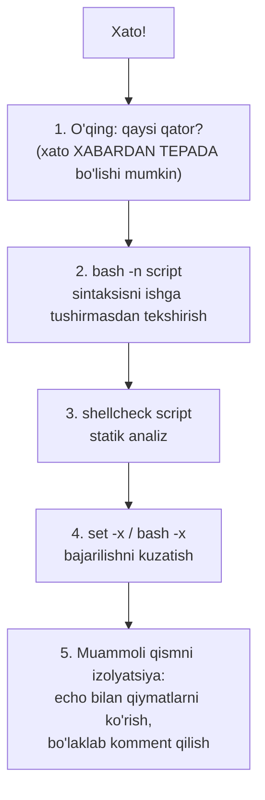

# 24. Debugging va best practices

> Manba: TLCL 30-bob · Muhit: Ubuntu 24.04, bash 5.2 · [← Oldingi: advanced-scripting](23-advanced-scripting.md) · [Kurs xaritasi](00-README.md) · **Kursning yakuniy darsi**

## Nima uchun kerak

Script yozishni o'rgandik — endi uni **buzilmaydigan** qilishni o'rganamiz. Bash indamay kechiradigan til: xato bo'ldi — davom etaveradi, variable yo'q — bo'sh string, pipeline yiqildi — bilinmaydi. Production da bu "kechirimlilik" ma'lumot yo'qotish degani. Bu capstone darsda: xatolarni topish texnikasi (`set -x`, bash -n), ularni oldindan bloklash (`set -euo pipefail`, ShellCheck) va himoyaviy dasturlash — kurs davomida to'plangan barcha "temir qoidalar"ning yakuniy tizimi.

## Nazariya

### Xatolarning uch turi

1. **Sintaksis xatolar** — bash faylni umuman qabul qilmaydi (yopilmagan quote, tushib qolgan `fi`). Xato xabari **ko'pincha xatodan pastda** ko'rsatiladi!
2. **Mantiqiy xatolar** — script ishlaydi, lekin noto'g'ri ish qiladi (bo'sh variable, noto'g'ri shart, edge case).
3. **Muhit xatolari** — sizda ishlaydi, serverda yo'q (PATH, versiya, locale, huquqlar).

### Diagnostika strategiyasi



## Buyruqlar

### Sintaksis xatolarni o'qish (tekshirilgan)

Yopilmagan quote — xato **oxirida** "portlaydi":

```console
$ bash trouble1.sh
trouble1.sh: line 6: unexpected EOF while looking for matching `"'
```

6-qator deyapti, xato esa 4-qatordagi ochiq `"` da. Qoida: **ko'rsatilgan qatordan TEPAGA qarab qidiring**. Ishga tushirmasdan tekshirish:

```console
$ bash -n trouble1.sh        # -n: faqat parse, bajarma
trouble1.sh: line 6: unexpected EOF while looking for matching `"'
```

### Klassik "unary operator expected" (kursda 3-marta!)

```console
$ number=
$ [ $number = 1 ]
line 3: [: =: unary operator expected
```

Bo'sh variable quotesiz g'oyib bo'lib, `[ = 1 ]` qoldi. Davosi eskicha: `[ "$number" = 1 ]` yoki `[[ ]]`. Bu xato 06, 19-darslarda ham bor edi — chunki u real hayotda ham qayta-qayta uchraydi.

### `set -x` — tracing (tekshirilgan)

Har bajarilayotgan qatorni (expansiondan KEYINGI holatda!) ko'rsatadi:

```console
$ bash traced.sh
+ number=1
+ '[' 1 -eq 1 ']'          # $number allaqachon 1 bo'lib expand bo'lgan — ko'rinyapti!
+ echo teng
teng
+ set +x                    # tracingni o'chirish
tracing tugadi
```

Variantlari: butun script — `bash -x script`; qism — `set -x` ... `set +x`; qator raqamlari bilan (tekshirilgan):

```console
$ export PS4='+ [$LINENO] '
$ bash ps4.sh
+ [4] a=5
+ [5] b=10
```

### `set -euo pipefail` — "strict mode" (har biri isbotlangan)

**`-e`** — xatoda to'xtash:

```console
$ bash noe.sh                # set -e YO'Q
set -e YO'Q: bu qator chiqdi (xato yutildi!)
$ bash withe.sh              # set -e bilan
(exit=1)                     # false dan keyin darhol to'xtadi
```

**`-u`** — mavjud emas variable = xato (jim bo'sh string emas):

```console
$ bash -c 'set -u; echo "$yoq_variable"'
bash: line 1: yoq_variable: unbound variable
```

**`-o pipefail`** — pipeline o'rtasidagi xato yashirinmaydi (05-darsda isbotlangan edi).

Uchligi birga — har jiddiy scriptning 2-qatori. Bilib qo'yish kerak nuanslar: `-e` ba'zi kontekstlarda ishlamaydi (`if cmd`, `cmd || true`, `$(...)` assignment ichida) — bu "sehrli qalqon" emas, birinchi himoya chizig'i.

### ShellCheck — statik analizator (tekshirilgan)

```console
$ shellcheck buggy.sh
In buggy.sh line 4:
    rm $f
       ^-- SC2086 (info): Double quote to prevent globbing and word splitting.
Did you mean:
    rm "$f"
```

Kurs davomida aytilgan xatolarning aksariyatini (SC2086 quote, SC2044 find-loop, SC2181 `$?`...) **yozish paytida** ushlaydi. O'rnatish: `apt install shellcheck`, VS Code extension, CI step. Bu — bash uchun `go vet`.

### Himoyaviy dasturlash arsenali (kurs xulosasi)

```bash
#!/usr/bin/env bash
set -euo pipefail                              # strict mode

# 1. Majburiy inputlar darhol tekshiriladi:
src="${1:?Usage: $0 <src-dir>}"                # 22-dars
[ -d "$src" ] || { echo "katalog emas: $src" >&2; exit 1; }   # 19-dars

# 2. Xavfli amallar himoyalangan:
cd "$src" || exit 1                            # cd tekshiruvsiz qolmaydi
rm -rf "${workdir:?}/cache"                    # bo'sh variable = to'xtash

# 3. Temp + cleanup:
tmp=$(mktemp -d); trap 'rm -rf "$tmp"' EXIT    # 23-dars

# 4. Tashqi buyruqlar tekshiriladi:
command -v jq >/dev/null || { echo "jq kerak" >&2; exit 1; }  # 4-dars

# 5. Log stderr ga, aniq xabar bilan:
log() { echo "[$(date +%T)] $*" >&2; }         # 5-dars (stdout data uchun!)
```

### Test qilish

- **Dry-run rejimi**: xavfli scriptga `--dry-run` flagi (`echo` bilan nima qilinishini ko'rsatish) — rsync/apt dan o'rganilgan odat (15-dars).
- **Kichik test muhit**: script fayllar bilan ishlasa — mktemp -d ichida soxta struktura yasab sinash (biz kurs davomida qilgan "playground" usuli).
- **Edge caselar ro'yxati**: bo'sh input, probelli nomlar, mavjud emas fayl, huquq yo'q, katta hajm — har biri uchun bir sinov.

## Real-world scenariylar

**1. "Scriptim CI da yiqildi, lokalda ishlaydi".**

```bash
bash -x ./deploy.sh 2>&1 | head -50    # CI logida tracing
# tipik sabablar: PATH boshqa (cron/CI — 09-dars), locale, bash versiyasi,
# interaktiv .bashrc ga tayanish, TTY yo'qligi (01-dars)
```

**2. Yarim tunda buzilgan cron job tergovi.**

```bash
# cron da stderr yo'qolmasin deb o'zi log yozadigan qilamiz:
# 0 3 * * * /opt/scripts/backup.sh >> /var/log/backup.log 2>&1
tail -50 /var/log/backup.log
bash -n /opt/scripts/backup.sh          # kimdir tahrir qilib sindirganmi?
shellcheck /opt/scripts/backup.sh
```

**3. Katta scriptda "qayerda buzilayapti" ni topish** — ikkilik qidiruv: o'rtasiga `echo "CHECKPOINT 1: var=$var" >&2` qo'yib, muammo qaysi yarmida ekanini aniqlab, toraytirib boring. Kitobning "isolation" texnikasi — 50 yildan beri ishlaydi.

## Zamonaviy yondashuv

- **ShellCheck + CI**: `.github/workflows` da `shellcheck **/*.sh` stepi — bash sifatining sanoat standarti. `shfmt` — formatter (gofmt ekvivalenti).
- **Bats** (Bash Automated Testing System) — bash uchun test framework: muhim scriptlarga unit-test yozsa bo'ladi.
- **Strict mode munozarasi**: ba'zi ekspertlar `set -e` nozikliklari tufayli uni tanqid qiladi; sanoat konsensusi baribir — ishlating, lekin sehr kutmang: kritik joylarda aniq `|| { ...; exit 1; }` yozing.
- **Structured logging scriptlarda ham**: `log "level=info msg=\"backup done\" size=$size"` — keyin grep/jq bilan tahlil oson.
- Va yakuniy eslatma: **bash chegarasini biling** (18-dars) — murakkablik oshsa Go/Python. Yaxshi engineer bash ni bilgani uchun emas, **qachon ishlatmaslikni** bilgani uchun kuchli.

## Keng tarqalgan xatolar

1. **Xato xabaridagi qator raqamiga ko'r-ko'rona ishonish.** Quote/fi xatolari oxirida portlaydi — ko'rsatilgan qatordan tepaga qarang.

2. **`set -e` bor deb tekshiruvlarni yozmaslik.** `-e` `if`, `&&`, `||` kontekstlarida o'chadi; command substitution xatolari yutilishi mumkin. Kritik buyruqlarga aniq nazorat.

3. **Debugni `echo` bilan qilib, tozalashni unutish.** Debug chiqishlarini **stderr** ga va prefiks bilan yozing (`echo "DEBUG: ..." >&2`) — data oqimini buzmaydi va keyin grep bilan topib o'chirish oson.

4. **Scriptni to'g'ridan-to'g'ri production da debug qilish.** Avval nusxada/mktemp muhitida. `--dry-run` bo'lmasa — qo'shing.

5. **ShellCheck ogohlantirishlarini "info-ku" deb o'chirib qo'yish.** SC2086 "info" darajasida, lekin real falokatlar manbai. Har ogohlantirish — yo tuzatiladi, yo aniq sabab bilan `# shellcheck disable=SCxxxx` izohlanadi.

6. **Muvaffaqiyat holatini test qilib, xato holatlarini sinamagan holda deploy.** Script yaxshi kunda emas, yomon kunda qanday o'zini tutishi muhim: fayl yo'q bo'lsa? disk to'lsa? network uzilsa?

## Amaliy mashqlar

Muhit: `docker run -it --rm ubuntu:24.04 bash` (`apt update && apt install -y shellcheck`)

**1.** Quyidagi buzuq scriptni yozib, xatosini toping (bash xabaridagi qator bilan haqiqiy xato qatorini solishtiring):

```bash
#!/usr/bin/env bash
echo "boshlandi
echo "tugadi"
```

<details><summary>Yechim</summary>

```console
$ bash -n broken.sh
broken.sh: line 4: unexpected EOF while looking for matching `"'
```
Xato 2-qatorda (yopilmagan quote), xabar esa faylning oxirini ko'rsatadi. Syntax highlighting bor muharrirda bu darhol ko'rinadi.
</details>

**2.** `set -x` bilan quyidagini tekshiring: `n=5; [ $n -gt 3 ] && echo katta` — tracing chiqishida `$n` qanday ko'rinadi va bu debugda nega qimmatli?

<details><summary>Yechim</summary>

```console
$ set -x; n=5; [ $n -gt 3 ] && echo katta; set +x
+ n=5
+ '[' 5 -gt 3 ']'      # $n EMAS, 5 — expansiondan keyingi haqiqiy qiymat!
+ echo katta
```
Tracing "shell nimani ko'rdi"ni ko'rsatadi — expansion muammolari (bo'sh variable, probel) darhol fosh bo'ladi.
</details>

**3.** `set -e`, `set -u`, `set -o pipefail` har birini alohida kichik misolda isbotlang.

<details><summary>Yechim</summary>

```bash
bash -c 'false; echo yutildi'                          # chiqadi
bash -c 'set -e; false; echo yutilmadi'                # chiqmaydi
bash -c 'echo "[$yoq]"'                                # [] — jim
bash -c 'set -u; echo "[$yoq]"'                        # unbound variable
bash -c 'false | true; echo $?'                        # 0!
bash -c 'set -o pipefail; false | true; echo $?'       # 1
```
</details>

**4.** Quyidagi scriptni shellcheck dan o'tkazib, BARCHA ogohlantirishlarni tuzating:

```bash
#!/bin/bash
dir=$1
cd $dir
for f in $(ls *.log); do
    cat $f | grep ERROR
done
```

<details><summary>Yechim</summary>

```bash
#!/usr/bin/env bash
set -euo pipefail
dir="${1:?Usage: $0 <dir>}"
cd "$dir" || exit 1
shopt -s nullglob
for f in *.log; do
    grep ERROR "$f" || true      # topilmasa ham davom (grep 1 qaytaradi)
done
```
Tuzatilganlar: quote lar, `ls` parse o'rniga glob, useless cat, cd tekshiruvi, majburiy argument.
</details>

**5.** PS4 ni boyitib (`'+ [$LINENO] '`) 10 qatorlik istalgan scriptingizni trace qiling — qaysi qator sekinligini `PS4='+ [$SECONDS] '` bilan ham ko'ring.

<details><summary>Yechim</summary>

```bash
export PS4='+ [${SECONDS}s L$LINENO] '
bash -x myscript.sh
# har qator oldida o'tgan vaqt — "qayerda qotib qolyapti" savoli uchun primitiv profiler
```
</details>

**6.** "Yomon kun" testi: 4-mashqdagi scriptni quyidagi holatlarda sinang: argument berilmadi; katalog mavjud emas; katalogda .log yo'q; .log ichida ERROR yo'q. Har holat aniq xabar bilan tugashiga erishing.

<details><summary>Yechim</summary>

```console
$ ./logs.sh
./logs.sh: line 3: 1: Usage: ./logs.sh <dir>
$ ./logs.sh /yoq
cd: /yoq: No such file or directory
$ mkdir /tmp/bosh && ./logs.sh /tmp/bosh      # nullglob: jim tugaydi (yoki xabar qo'shing)
$ # ERROR yo'q holatda: || true tufayli xatosiz tugaydi
```
Har edge case oldindan o'ylangan — himoyaviy dasturlashning mohiyati.
</details>

**7.** (Capstone) Kursning yakuniy mashqi — "production-grade backup tool": shu paytgacha o'rganilgan hamma narsani birlashtiring. Talablar: strict mode; `--help`; `--dry-run`; manba va maqsadni flag bilan olish; mavjudlik/huquq tekshiruvlari; mktemp+trap; tar+zstd; muvaffaqiyatda o'lchamli hisobot, xatoda aniq xabar va to'g'ri exit code; shellcheck toza o'tsin.

<details><summary>Yechim (skelet)</summary>

```bash
#!/usr/bin/env bash
set -euo pipefail

usage() { cat <<EOF
Usage: $0 --src <dir> --dest <dir> [--dry-run]
EOF
exit "${1:-0}"; }

log() { echo "[$(date +%T)] $*" >&2; }

src=""; dest=""; dry=0
while [ $# -gt 0 ]; do
    case "$1" in
        --src)  shift; src="$1" ;;
        --dest) shift; dest="$1" ;;
        --dry-run) dry=1 ;;
        -h|--help) usage ;;
        *) log "noma'lum: $1"; usage 1 ;;
    esac
    shift
done

if [ -z "$src" ] || [ -z "$dest" ]; then usage 1; fi
[ -d "$src" ]  || { log "manba katalog emas: $src"; exit 1; }
[ -d "$dest" ] || { log "maqsad katalog emas: $dest"; exit 1; }
[ -w "$dest" ] || { log "maqsadga yozib bo'lmaydi"; exit 1; }
command -v zstd >/dev/null || { log "zstd kerak"; exit 1; }

tmp=$(mktemp -d)
trap 'rm -rf "$tmp"' EXIT

archive="$dest/$(basename "$src")-$(date +%F-%H%M).tar.zst"
if [ "$dry" -eq 1 ]; then
    log "DRY-RUN: tar --zstd -cf $archive -C $(dirname "$src") $(basename "$src")"
    exit 0
fi

tar --zstd -cf "$tmp/backup.tar.zst" -C "$(dirname "$src")" "$(basename "$src")"
mv "$tmp/backup.tar.zst" "$archive"
log "OK: $archive ($(du -h "$archive" | cut -f1))"
```
Bunda: 21-dars (parsing), 19 (tekshiruvlar), 22 (`${:?}`, basename), 23 (mktemp+trap), 15 (tar+zstd), 5 (stderr log), 24 (strict mode). Kurs yakunlandi!
</details>

## Cheat sheet

| Asbob | Nima | Qachon |
|-------|------|--------|
| `bash -n script` | Sintaksis tekshiruv | tahrirdan keyin, ishga tushirishdan oldin |
| `bash -x` / `set -x` | Tracing | "nega bunday qilyapti?" |
| `PS4='+ [$LINENO] '` | Boyitilgan trace | katta scriptlarda |
| `set -e` | Xatoda to'xtash | har scriptda (nozikliklari bilan) |
| `set -u` | Unbound = xato | har scriptda |
| `set -o pipefail` | Pipeline xatosi | har scriptda |
| `shellcheck` | Statik analiz | yozish paytida + CI |
| `${var:?msg}` | Majburiy variable | xavfli amallardan oldin |
| `trap cleanup EXIT` | Kafolatli tozalash | temp/lock bor joyda |
| `--dry-run` | Xavfsiz sinov | destruktiv scriptlarda |
| `echo "DEBUG: $var" >&2` | Qiymat ko'rish | stderr ga, prefiks bilan |
| Xato qatori | Ko'rsatilganidan TEPADA qidiring | quote/fi xatolari |

## Qo'shimcha manbalar

- [ShellCheck](https://www.shellcheck.net/) — onlayn tekshiruv va SCxxxx wiki
- [Greg's Wiki — BashPitfalls](https://mywiki.wooledge.org/BashPitfalls) — 60+ klassik xato, har biri izohli (kursdan keyingi eng foydali o'qish)
- [Bats-core](https://github.com/bats-core/bats-core) — bash uchun test framework

---

[← Oldingi: 23 — advanced-scripting](23-advanced-scripting.md) · [Kurs xaritasi](00-README.md) · 🎉 **Kurs tugadi — endi 00-README dagi "qanday o'rganish" bo'limiga qaytib, amaliyotni davom ettiring!**
