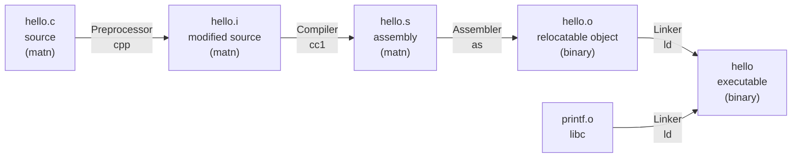
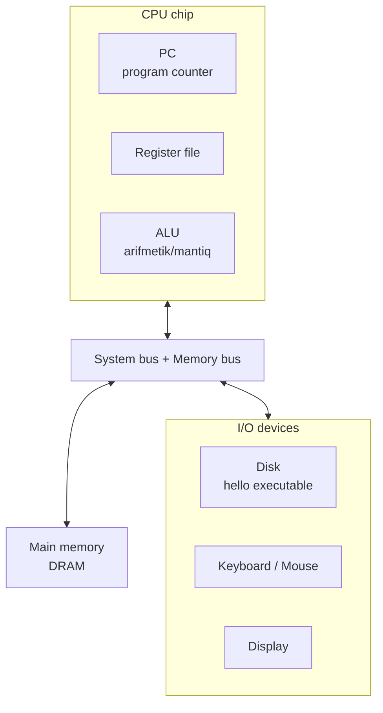
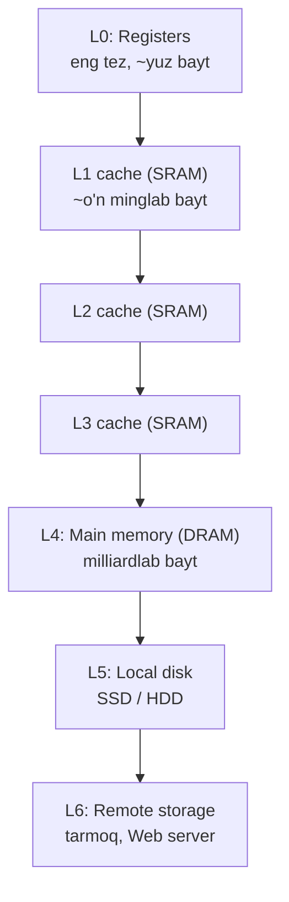
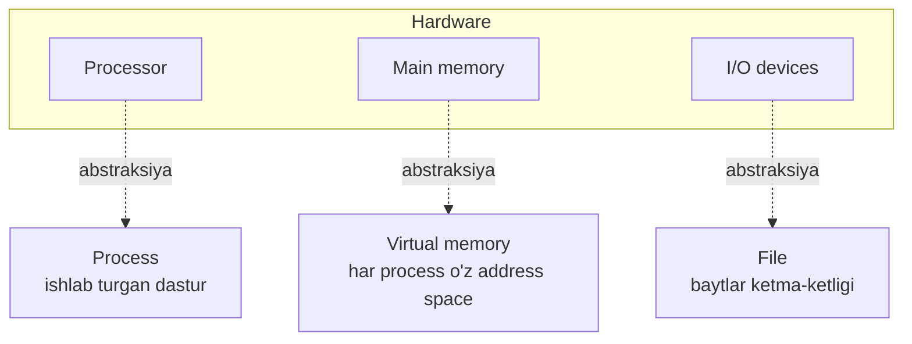

# 01. A Tour of Computer Systems — hello dasturining hayoti

> Manba: CS:APP 2-nashr, 1-bob · Muhit: Ubuntu 24.04 x86-64 (Docker), gcc 13.3.0, go 1.22.2 · [Kurs xaritasi](00-README.md) · [Keyingi →](02-information-storage.md)

## Nima uchun kerak

Sen 3 yildan beri Go backend yozasan: HTTP handler, PostgreSQL query, Docker image, CI/CD. Bularning hammasi ishlaydi — lekin qachonlardir shunday savol tug'iladi: nega bir xil kod `hello` C binary 16 KB, Go binary esa 1.9 MB? Nega bitta goroutine "thread emas" deyishadi? Nega bir sikl `local` o'zgaruvchiga yig'ganda cache tufayli 10 barobar tez ishlaydi? Nega C-da yozilgan servislar "buffer overflow" bilan buziladi, Go esa yo'q?

Bu savollarning hammasi bitta joyga borib taqaladi — **kompyuter tizimi** (computer system): hardware va systems software birgalikda dasturni qanday ishga tushiradi. Bu dars shu tizimning to'liq xaritasini beradi. Biz atigi bitta `hello` dasturini olamiz va uni tug'ilishidan (matn fayl) o'limigacha (ekranga chop etib tugaydi) kuzatamiz. Yo'l davomida butun kursning skeletiga duch kelamiz: bit, kompilyatsiya, CPU, cache, virtual memory, process, network.

Bu **kirish** darsi — har mavzuni 2-4 paragrafda "havodan ko'rinish" sifatida beramiz, keyingi darslarda har biriga chuqur sho'ng'iymiz.

## Nazariya

### 1. Ma'lumot = bits + context

`hello.c` faylini editorda yozganingda, u diskda **baytlar ketma-ketligi** sifatida saqlanadi. Har bayt — 8 bit (0 yoki 1). Matn fayllarda har bayt bitta belgini bildiradi. Bu moslikni **ASCII** standarti belgilaydi: `#` = 35, `i` = 105, `n` = 110 va hokazo.

Bu yerda kursning eng chuqur g'oyalaridan biri yashiringan: **bir xil baytlar, turli kontekstda — turli ma'no**. `01101000` bir joyda `h` harfi, boshqa joyda 104 soni, uchinchi joyda floating-point sonining bir bo'lagi, to'rtinchi joyda mashina instruction'ining bir qismi bo'lishi mumkin. Baytning "ma'nosi" o'zida yo'q — biz uni qanday kontekstda o'qiyotganimizga bog'liq.

Shuning uchun dasturchi sonlarning **mashina ko'rinishini** tushunishi shart: ular matematik butun va haqiqiy sonlar emas, balki cheklangan yaqinlashuvlar (finite approximations). Ular kutilmagan tarzda o'zini tutadi — masalan `int` overflow, `float` yaxlitlash xatolari. Buni keyingi darsda (02) batafsil ko'ramiz.

### 2. Dasturlar boshqa dasturlar tomonidan tarjima qilinadi

`hello.c` — **high-level** til: odam o'qiy oladi. Lekin CPU faqat **machine-language instruction**larni (mashina tili buyruqlari) tushunadi. Oradagi tarjimani **compilation system** (kompilyatsiya tizimi) bajaradi. Bitta `gcc -o hello hello.c` buyrug'i aslida **4 bosqichli** quvurdir (pipeline):



Har bosqich nima qiladi:

- **Preprocessor (cpp)** — `#` bilan boshlanuvchi direktivalarni bajaradi. `#include <stdio.h>` ni ko'rib, `stdio.h` header faylining butun matnini shu joyga qo'yib qo'yadi. Natija — hali ham C kod, `.i` kengaytmali, lekin ancha kattaroq.
- **Compiler (cc1)** — `.i` faylni **assembly** tiliga (`hello.s`) tarjima qiladi. Assembly — har qatori aynan bitta past darajali machine instruction'ni matn ko'rinishida tasvirlaydi. Bu turli tillar (C, Fortran, Go) uchun umumiy chiqish nuqtasi.
- **Assembler (as)** — assembly matnini haqiqiy machine-language baytlariga aylantiradi va **relocatable object file** (`hello.o`) sifatida joylaydi. Endi bu binary — matn editorda ochsang, "gibberish" (ma'nosiz belgilar) ko'rinadi.
- **Linker (ld)** — bizning `hello.o` `printf` funksiyasini chaqiradi, lekin `printf` kodi bizda yo'q — u `libc` ichida oldindan kompilyatsiya qilingan. Linker bu bo'laklarni birlashtiradi va tayyor **executable** (`hello`) hosil qiladi.

### 3. Nega kompilyatsiyani tushunish foyda beradi

Kompilyator odatda yaxshi kod chiqaradi, lekin uni "qora quti" deb qarash ba'zan qimmatga tushadi. Kitob uch sababni ta'kidlaydi:

- **Performance optimizatsiya** — `switch` har doim `if-else` dan tezmi? Function call qancha overhead qo'shadi? Nega `local` o'zgaruvchiga yig'ish tezroq? Bularni bilish uchun machine-level kodni tushunish kerak (06-11 va 13-darslarda chuqurlashamiz).
- **Link-time xatolar** — "cannot resolve reference", "duplicate symbol", static vs dynamic library — eng bosh og'rig'i keltiradigan xatolar linker bilan bog'liq (19-darsda).
- **Xavfsizlik** — buffer overflow yillar davomida server hujumlarining asosiy manbai bo'lgan. Nega? Chunki stack'da ma'lumot va control information qanday saqlanishini ko'p dasturchi bilmaydi (09 va 11-darslarda stack discipline).

### 4. CPU instruction'larni memory'dan o'qiydi va bajaradi

Tayyor `hello` diskda yotibdi. Uni ishga tushirish uchun shell'ga nomini yozamiz: `./hello`. **Shell** — command-line interpreter: prompt chiqaradi, buyruqni kutadi, keyin bajaradi. Agar birinchi so'z ichki buyruq bo'lmasa, shell uni executable fayl deb hisoblab, memory'ga yuklaydi va ishga tushiradi.

Tipik tizimning hardware tashkiloti quyidagicha:



Asosiy qismlar:

- **Bus** — komponentlar orasida baytlarni tashuvchi elektr o'tkazgichlar. Ular odatda **word** deb ataluvchi qat'iy o'lchamli bo'laklarni tashiydi. Bugungi tizimlar ko'pincha 8-bayt (64-bit) word ishlatadi.
- **Main memory (DRAM)** — dastur va uning ma'lumotini vaqtincha saqlaydi. Mantiqiy jihatdan bu baytlarning chiziqli massivi: har bayt o'z **address**iga ega (0 dan boshlanadi).
- **CPU (processor)** — memory'dagi instruction'larni bajaruvchi "dvigatel". Yadrosida **PC (program counter)** degan word-o'lchamli register bor: u doim navbatdagi instruction'ning address'ini ushlab turadi.
- **Register file** — nomlangan, word-o'lchamli registerlar to'plami (juda tez, juda kichik).
- **ALU** — yangi ma'lumot va address qiymatlarini hisoblaydi.

CPU juda sodda tsiklda ishlaydi: PC ko'rsatgan instruction'ni o'qi → bitlarni talqin qil → sodda amalni bajar → PC'ni navbatdagi instruction'ga yangila. Bu amallar bir nechta: **Load** (memory'dan register'ga ko'chir), **Store** (register'dan memory'ga), **Operate** (ALU'da hisobla), **Jump** (PC'ni o'zgartir).

> Muhim: bu **instruction set architecture (ISA)** — CPU'ning tashqi modeli, har instruction "ketma-ket, bittalab bajariladi" degan illyuziya. Aslida zamonaviy CPU ichida **microarchitecture** ancha murakkab: bir vaqtda o'nlab instruction bajaradi. Lekin natija har doim sodda ketma-ket modelga mos keladi. Bu — abstraksiya kuchi.

### 5. Cache muhim, storage — ierarxiya

`hello` ishlaganda tizim ko'p vaqtni **ma'lumotni bir joydan boshqasiga ko'chirishga** sarflaydi: diskdan memory'ga, memory'dan register'ga, register'dan display'ga. Dasturchi nuqtai nazaridan bu ko'chirish "haqiqiy ish"ni sekinlashtiradigan overhead.

Fizika qonuni shafqatsiz: **kattaroq storage sekinroq**. Disk main memory'dan 1000 barobar katta bo'lishi mumkin, lekin diskdan bir word o'qish memory'dan o'qishga qaraganda 10 million barobar sekinroq. Register memory'dan 100 barobar tez, lekin atigi bir necha yuz bayt sig'adi. Yillar o'tgani sari bu **processor-memory gap** kengaymoqda.

Yechim — oradagi kichik, tez **cache** xotiralar. Ular CPU keyingi ehtimol kerak bo'ladigan ma'lumotni oldindan ushlab turadi. Bu **locality** (mahalliylik) tamoyiliga tayanadi: dasturlar ma'lumot va kodga mahalliy hududlarda murojaat qiladi.



Yuqoridan pastga: **tezroq va qimmatroq → sekinroq va arzonroq**. Asosiy g'oya: har daraja pastdagi darajaning cache'i vazifasini bajaradi. Register — L1 cache'ning cache'i, L1 — L2 ning, ... main memory — diskning cache'i. Cache'lardan xabardor dasturchi o'z kodini bir necha barobar tezlashtira oladi (16-18-darslarda chuqur).

### 6. Operatsion tizim hardware'ni boshqaradi

`hello` bir marta ham keyboard, disk yoki memory'ga **to'g'ridan-to'g'ri** murojaat qilmadi. Ular hammasi **operatsion tizim** (OS) xizmatlaridan foydalandi. OS — application va hardware orasidagi qatlam. Uning ikki maqsadi: (1) hardware'ni nazoratsiz application'lardan himoya qilish, (2) turli-tuman hardware'ni boshqarish uchun sodda, bir xil interfeys berish.

OS buni **uchta fundamental abstraksiya** orqali amalga oshiradi:



- **Process** — ishlab turgan dasturning abstraksiyasi. OS har process'ga u tizimdagi yagona dastur degan **illyuziya** beradi: butun CPU, memory, I/O faqat unga tegishlidek. Ko'p process bir vaqtda **concurrent** ishlaydi — bittasining instruction'lari boshqasiniki bilan aralashib (interleaved) bajariladi. Bitta CPU ko'p process'ni **context switch** orqali navbatlashtiradi: joriy process'ning **context**ini (PC, register file, memory holati) saqlaydi, yangisini tiklaydi. Bunda maxsus funksiya — **system call** — boshqaruvni OS'ga topshiradi (21-darsda).
- **Thread** — bitta process ichida bir nechta bajarilish oqimi bo'lishi mumkin. Ular bir xil kod va global ma'lumotni bo'lishadi, shuning uchun process'lardan yengilroq va tez. Network server'lar uchun asosiy model (32-darsda).
- **Virtual memory** — har process'ga "butun main memory faqat meniki" illyuziyasini beradi. Har process bir xil **virtual address space**ga ega: pastda kod va data, keyin heap (malloc/free), o'rtada shared library'lar, tepada stack (function call'lar uchun), eng tepada kernel. Aslida bu ma'lumot diskda saqlanadi, main memory esa uning cache'i sifatida ishlaydi (24-darsda).
- **File** — baytlar ketma-ketligi, boshqa hech narsa emas. Har I/O device — disk, keyboard, display, hatto network — file sifatida modellashtiriladi. Barcha I/O kichik system call to'plami (Unix I/O) orqali file o'qish/yozishdan iborat (28-darsda). Bu abstraksiya kuchi: dasturchi disk texnologiyasini bilmasdan bir xil kod yozadi.

### 7. Tizimlar tarmoq orqali muloqot qiladi

Tizim nuqtai nazaridan **network — shunchaki yana bir I/O device**. Memory'dan baytlarni network adapter'ga ko'chirsang, ular diskka emas, boshqa mashinaga oqib boradi. Email, veb, fayl uzatish — hammasi network orqali ma'lumot ko'chirishga asoslangan (31-darsda o'z Web server'ingni yozasan).

### 8. Muhim mavzular: concurrency va parallelism

Ikki so'zni farqlash muhim: **concurrency** — tizimda bir vaqtda bir nechta faoliyat borligining umumiy tushunchasi; **parallelism** — concurrency'dan tizimni tezlashtirish uchun foydalanish. Parallelism uch darajada namoyon bo'ladi:

- **Thread-level** — bir nechta process yoki thread bir vaqtda ishlaydi. **Multi-core** protsessorlar bir chipda bir nechta CPU core saqlaydi (har biri o'z L1/L2, umumiy L3). **Hyperthreading** — bitta core bir necha thread oqimini navbatlashtiradi.
- **Instruction-level (ILP)** — CPU bir vaqtda bir nechta instruction bajaradi. **Pipelining** orqali. Bir siklda 1 dan ortiq instruction bajaradiganlar — **superscalar** (12 va 14-darslarda).
- **SIMD** (single-instruction, multiple-data) — bitta instruction bir nechta amalni parallel bajaradi (masalan 4 juft `float`ni bir vaqtda qo'shish). Rasm, ovoz, video uchun.

### 9. Abstraksiyalarning ahamiyati

Butun kursning bosh g'oyasi — **abstraksiya**. ISA — hardware'ning abstraksiyasi. File, virtual memory, process — OS abstraksiyalari. Bularning ustiga yana bittasi qo'shiladi: **virtual machine** — butun kompyuterning (OS + CPU + dastur) abstraksiyasi. Docker, VM'lar — shu g'oyaning zamonaviy davomi.

## Kod va isbot

Endi nazariyani real buyruqlar bilan tasdiqlaymiz. Barcha output Ubuntu 24.04 x86-64, gcc 13.3.0 da haqiqatan bajarilgan.

### hello.c

```c
#include <stdio.h>

int main(void)
{
    printf("hello, world\n");
    return 0;
}
```

### bits + context: faylning birinchi 16 bayti

```bash
head -c 16 hello.c | od -A d -t d1 -v
```

```
0000000   35  105  110   99  108  117  100  101   32   60  115  116  100  105  111   46
```

Bu sonlar — `#include <stdio.` matnining ASCII kodlari: 35=`#`, 105=`i`, 110=`n`, 99=`c`, 108=`l`, 117=`u`, 100=`d`, 101=`e`, 32=`bo'sh joy`, 60=`<`, 115=`s`, 116=`t`, 100=`d`, 105=`i`, 111=`o`, 46=`.`. Ko'rdingmi — fayl "matn" emas, baytlar; biz uni ASCII kontekstida o'qiganimiz uchungina "matn" bo'lib ko'rinadi.

### 1-bosqich: Preprocessing

```bash
gcc -E hello.c -o hello.i && wc -l hello.c hello.i
```

```
    7 hello.c
  820 hello.i
```

7 qatorlik faylimiz 820 qatorga aylandi. Sabab — `#include <stdio.h>` direktivasi `stdio.h` header'ining butun matnini bizning faylga qo'shib qo'ydi. Preprocessor faqat matn bilan ishlaydi, hali hech qanday "tarjima" yo'q.

### 2-bosqich: Compilation → assembly

```bash
gcc -Og -S hello.c
```

`hello.s` faylidagi `main` funksiyasi (muhim qismi):

```asm
	.section	.rodata.str1.1,"aMS",@progbits,1
.LC0:
	.string	"hello, world"
	.text
	.globl	main
main:
	endbr64
	subq	$8, %rsp
	leaq	.LC0(%rip), %rdi
	call	puts@PLT
	movl	$0, %eax
	addq	$8, %rsp
	ret
```

Diqqat qil: biz kodda `printf` yozgandik, lekin assembly'da `call puts@PLT` turibdi. gcc **optimizatsiya** qildi — `printf("hello, world\n")` da format satri o'zgarmas va oxiri `\n` bo'lgani uchun, u yengilroq `puts()` chaqiruviga aylantirildi (`puts` avtomatik `\n` qo'shadi). Bu haqiqiy zamonaviy kompilyator xatti-harakati: sen yozgan kod va bajariladigan kod bir xil emas. Registerlarni (`%rsp`, `%rdi`, `%eax`) 06-darsda batafsil ko'ramiz.

### 3-bosqich: Assemble → object file

```bash
gcc -Og -c hello.c && file hello.o && objdump -d hello.o
```

```
hello.o: ELF 64-bit LSB relocatable, x86-64, version 1 (SYSV), not stripped

0000000000000000 <main>:
   0:	f3 0f 1e fa          	endbr64
   4:	48 83 ec 08          	sub    $0x8,%rsp
   8:	48 8d 3d 00 00 00 00 	lea    0x0(%rip),%rdi        # f <main+0xf>
   f:	e8 00 00 00 00       	call   14 <main+0x14>
  14:	b8 00 00 00 00       	mov    $0x0,%eax
  19:	48 83 c4 08          	add    $0x8,%rsp
  1d:	c3                   	ret
```

Endi chap tarafda haqiqiy **machine code** baytlari (`f3 0f 1e fa`, ...) turibdi — assembly matni baytlarga aylandi. `file` buyrug'i "relocatable" deydi: bu hali tayyor dastur emas, ko'chirilishi (relocation) mumkin bo'lgan bo'lak. E'tibor ber: `lea` va `call` da `00 00 00 00` baytlar bor — bular bo'sh joylar, linker keyin `puts` va satrning haqiqiy address'i bilan to'ldiradi (19-darsda relocation chuqur o'rganiladi).

### 4-bosqich: Link → executable

```bash
gcc -Og -o hello hello.c && file hello && ldd hello
```

```
hello: ELF 64-bit LSB pie executable, x86-64, version 1 (SYSV), dynamically linked, interpreter /lib64/ld-linux-x86-64.so.2, for GNU/Linux 3.2.0, not stripped
	libc.so.6 => /lib/x86_64-linux-gnu/libc.so.6 (0x00007fffff5a9000)
	/lib64/ld-linux-x86-64.so.2 (0x00007ffffffc6000)
```

Endi `file` "executable" deydi — tayyor dastur. `ldd` esa uning **dynamically linked** ekanini ko'rsatadi: `puts`/`printf` kodi binary ichida emas, ishga tushganda `libc.so.6` dan yuklanadi. Bu sabab keyinroq Go bilan taqqoslashda muhim bo'ladi.

### Ishga tushirish

```bash
./hello
```

```
hello, world
```

Butun sayohat yakunlandi: matn fayl → preprocessing → compile → assemble → link → executable → CPU bajaradi → ekranga chop etadi.

### bits + context isboti: bir xil 4 bayt, uch xil talqin

```c
#include <stdio.h>

int main(void)
{
    unsigned char bytes[4] = {0x68, 0x65, 0x6c, 0x6c};  /* "hell" */

    printf("char sifatida : %c %c %c %c\n",
           bytes[0], bytes[1], bytes[2], bytes[3]);
    printf("int sifatida  : %d\n", *(int *)bytes);
    printf("float sifatida: %.10e\n", *(float *)bytes);
    return 0;
}
```

```bash
gcc -Og -o context context.c && ./context
```

```
char sifatida : h e l l
int sifatida  : 1819043176
float sifatida: 1.1431414836e+27
```

Mana "bits + context" g'oyasining sof isboti. Xotirada **aynan bir xil** 4 bayt yotibdi: `68 65 6c 6c`. Lekin biz uni `char` deb o'qisak — `h e l l`, `int` deb o'qisak — 1819043176, `float` deb o'qisak — 1.14e+27. Baytda "ma'no" yo'q; ma'noni biz beradigan **tip (kontekst)** yaratadi. 02-darsda bu sonlar aynan qanday kodlanishini ko'ramiz.

## Go dasturchiga ko'prik

Endi eng qiziq qismi. Xuddi shu `hello` dasturini Go'da yozamiz:

```go
package main

import "fmt"

func main() {
	fmt.Println("hello, world")
}
```

```bash
go build -o hello_go hello.go && ./hello_go && file hello_go
```

```
hello, world
hello_go: ELF 64-bit LSB executable, x86-64, version 1 (SYSV), statically linked, Go BuildID=...
```

E'tibor ber ikki so'zga: `file` C binary'ni **dynamically linked**, Go binary'ni **statically linked** deydi. `ls -lh` ni ishlatsang:

| Binary | Hajmi | Linking |
|--------|-------|---------|
| `hello` (C) | 16 KB | dynamically linked — `libc` tashqarida |
| `hello_go` (Go) | 1.9 MB | statically linked — hamma narsa ichida |

Nega Go binary 120 barobar katta? Chunki **static linking**: `fmt` paketi va, eng muhimi, butun **Go runtime** binary ichiga joylashtirilgan. Go runtime ichida nima bor?

- **Garbage collector (GC)** — memory'ni avtomatik tozalaydi (C'da o'zing `malloc`/`free` qilasan).
- **Goroutine scheduler** — goroutine'larni OS thread'lariga taqsimlaydi.
- **Runtime type ma'lumoti, panic/recover, channel mexanizmi** va boshqalar.

Bu yerda muhim tushuncha: **goroutine — thread emas**. OS thread'i og'ir (kernel resursi, katta stack, context switch qimmat). Goroutine esa Go runtime ichidagi yengil abstraksiya — minglab goroutine bir necha OS thread ustida navbatlashadi. Scheduler ularni **user-space**da boshqaradi, kernelga chiqmasdan. Bu — kitobdagi "process/thread abstraksiyasi" g'oyasining Go'dagi yana bir qatlami (32-darsda goroutine scheduler ichini ochamiz).

Yana bir amaliy natija: static binary tufayli **FROM scratch** Docker image'lar Go'da oson. Go binary hech qanday tashqi `.so` faylga muhtoj emas, shuning uchun uni bo'sh (`scratch`) image ichiga tashlab qo'yasan va u ishlaydi. C dynamic binary esa `libc.so.6` va loader'ni talab qiladi — `scratch` image'da ular yo'q.

## Real-world scenariylar

**1. Container image hajmi va cold start.** Go static binary'ni `FROM scratch` yoki `distroless` image'ga joylaysan — natija bir necha MB, cold start tez, hujum yuzasi (attack surface) kichik. C/Python dynamic dastur esa butun runtime va library'larni image ichida olib yurishi kerak — kattaroq image, sekinroq deploy. Bu to'g'ridan-to'g'ri yuqoridagi static vs dynamic linking farqidan kelib chiqadi (19 va 20-darslarda linking).

**2. Production latency tergovi.** Servising p99 latency'si tushunarsiz sakraydi. Sabab ko'pincha algoritm emas — **cache miss**. Ma'lumot strukturasi memory'da tarqoq joylashgan (poor locality) bo'lsa, CPU har murojaatda main memory'ni kutadi va 100 barobar sekinlashadi. Xuddi shu kod ma'lumotni ketma-ket (cache-friendly) joylashtirsa, 10 barobar tezlashadi. Buni tushunish uchun memory hierarchy bilimi kerak (16 va 17-darslarda cache va locality).

**3. Buffer overflow xavfsizlik.** C'da massiv chegarasidan tashqariga yozish mumkin — hujumchi stack'dagi return address'ni buzib, o'z kodini ishga tushirishi mumkin. Yillar davomida server hujumlarining asosiy sababi shu bo'lgan. Go esa **bounds checking** qiladi (chegaradan tashqari indeks — panic) va manual pointer arifmetikasini cheklaydi, shuning uchun bu klassik hujumdan himoyalangan. Nega C xavfli ekanini 09 va 11-darslarda stack discipline orqali ko'ramiz.

## Zamonaviy yondashuv

CS:APP 2-nashri 2011-yilda chiqqan. O'shandan beri ba'zi narsalar o'zgardi — kitob g'oyalari bilan zamonaviy holatni bog'laymiz:

- **Multi-core endi standart.** Kitob "concurrency muhimlashmoqda" degan edi; bugun bir chipda 8-64 core oddiy hol. Go'ning butun jozibasi ham shu — goroutine + channel bilan multi-core'dan foydalanish tabiiy.
- **ARM64 server dunyosiga kirdi.** Kitob deyarli faqat Intel x86'ni ko'rsatadi. Bugun laptopingda Apple Silicon (M-seriya) ARM64, AWS'da **Graviton** (ARM64) instance'lar arzonroq va energiya-samarali. Arxitektura farqi: **ARM64 — RISC** (sodda, qat'iy uzunlikdagi instruction'lar, kam energiya), **x86-64 — CISC** (murakkab, o'zgaruvchan uzunlikdagi instruction'lar). Ammo x86-64 hali ham server dunyosida dominant. Amaliy natija: Docker image'ni ikkala arxitektura uchun ham build qilish (multi-arch) kerak bo'ladi — x86 uchun qurilgan binary ARM64'da ishlamaydi.
- **Kompilyatorlar yangilandi.** Kitobdagi `gcc`/`cc1` hali dolzarb, lekin `clang`/`LLVM` ham keng tarqalgan. Ikkalasi ham aynan shu 4 bosqichli pipeline'ni bajaradi (clang integrated assembler ishlatadi). Assembly'ni ko'rish uchun endi terminal shart emas — **godbolt.org** (Compiler Explorer) brauzerda kod → assembly'ni real vaqtda ko'rsatadi.
- **IA32 eskirdi, telnet o'ldi.** Kitob 32-bit **IA32** kodni ko'p ishlatadi — biz **x86-64** (64-bit) ishlatamiz. Kitobning `telnet` misoli ham tarixiy: bugun `ssh`/`curl` zamoni, telnet shifrsiz bo'lgani uchun ishlatilmaydi. G'oya (network = I/O device) esa o'zgarmagan.

## Keng tarqalgan xatolar

**1. "CPU C kodni to'g'ridan-to'g'ri bajaradi."** — Xato. CPU faqat machine-language baytlarini bajaradi. C kod avval 4 bosqichdan o'tib executable'ga aylanishi shart. Yuqorida `objdump` bilan buni ko'rdik: `printf` hatto `puts`ga aylanib ketdi.

**2. "RAM'ga murojaat hamma joyda bir xil tez."** — Xato. Register → L1 → L2 → L3 → DRAM → disk — har qadamda tezlik keskin tushadi (register DRAM'dan ~100x tez, DRAM diskdan millionlab barobar tez). Cache miss bitta kod'ni 10x sekinlashtirishi mumkin.

**3. "Process = programma."** — Xato. Programma — diskdagi passiv fayl (baytlar). Process — OS abstraksiyasi: ishlab turgan dastur o'z context'i (PC, register, memory) bilan. Bir programmadan ko'p process ishga tushirish mumkin.

**4. "Kompilyatsiya — bir qadamli jarayon."** — Xato. `gcc -o hello hello.c` bitta buyruqdek ko'rinadi, lekin ichida to'rt alohida dastur ishlaydi: cpp → cc1 → as → ld. `-E`, `-S`, `-c` flaglari bilan har birini alohida ko'rsatdik.

**5. "64-bit tizim avtomatik 2x tez."** — Xato. 64-bit asosan kattaroq address space (4 GB dan ortiq RAM) va kengroq registerlarni bildiradi, dvigatel avtomatik 2x tez emas. Ba'zi hollarda 64-bit kod hatto kattaroq (pointer'lar 2x joy egallaydi, cache'ga kamroq sig'adi).

**6. "Goroutine — OS thread'ning boshqa nomi."** — Xato. Goroutine — Go runtime ichidagi yengil abstraksiya; minglab goroutine bir necha OS thread ustida user-space scheduler orqali navbatlashadi. Thread esa kernel resursi, ancha og'ir.

## Amaliy mashqlar

### 1-mashq (oson). ASCII dekodlash

`od` chiqishida faylning 10-bayti `60` (o'nlik). Bu qaysi belgi? Yuqoridagi verify qilingan output'dan foydalanib toping.

<details><summary>Yechim</summary>

Verify qilingan output: `... 32 60 115 ...`. 60 = `<` belgisi. Bu `#include <stdio.h>` dagi ochuvchi burchak qavs. (32 undan oldingi bo'sh joy, 115 esa `s`.)

</details>

### 2-mashq (oson). Qaysi bosqich?

`gcc -E hello.c -o hello.i` buyrug'i qaysi bosqichni bajaradi va natijasi hali C kodmi yoki binary?

<details><summary>Yechim</summary>

`-E` flagi faqat **preprocessing** bosqichini bajaradi (cpp). Natija (`hello.i`) hali ham **C kod** (matn), faqat `#include`/`#define` yoyilgan. Verify qilingan output buni tasdiqlaydi: 7 qator → 820 qator, hali matn.

</details>

### 3-mashq (o'rta). printf yo'qoldi

`gcc -Og -S hello.c` dan keyin `hello.s` ichida `printf` so'zini qidirsang, uni topolmaysan. Nega? Uning o'rnida nima turibdi?

<details><summary>Yechim</summary>

gcc optimizatsiya qilib, `printf("hello, world\n")` ni `puts("hello, world")` ga aylantirdi (format satri oddiy va oxiri `\n` bo'lgani uchun — `puts` avtomatik yangi qator qo'shadi). Verify qilingan assembly'da `call puts@PLT` turibdi. Bu — sen yozgan kod bilan bajariladigan kod bir xil emasligining isboti.

</details>

### 4-mashq (o'rta). Relocation baytlari

`objdump -d hello.o` chiqishida `call` instruction'i `e8 00 00 00 00` ko'rinishida. Nega `00 00 00 00`? Bu qachon to'ladi?

<details><summary>Yechim</summary>

`hello.o` — **relocatable object file**: `puts` funksiyasining haqiqiy address'i hali noma'lum, chunki u boshqa faylda (`libc`). Assembler bu joyga vaqtincha `00 00 00 00` qo'yadi. **Linker** (`ld`) link bosqichida bu bo'sh joyni haqiqiy address bilan to'ldiradi. Shuning uchun `hello.o` da bo'sh, `hello` executable'da esa to'ldirilgan bo'ladi (19-darsda chuqur).

</details>

### 5-mashq (o'rta). Static vs dynamic

`ldd hello` `libc.so.6` ni ko'rsatadi, lekin `ldd hello_go` (Go binary) hech qanday library ko'rsatmaydi ("not a dynamic executable"). Nega? Bu ikki binary hajmiga qanday ta'sir qiladi?

<details><summary>Yechim</summary>

C binary **dynamically linked**: `puts` kodi tashqarida (`libc.so.6`), ishga tushganda yuklanadi — shuning uchun binary kichik (16 KB). Go binary **statically linked**: `fmt` va butun Go runtime (GC, scheduler) binary ichida — shuning uchun katta (1.9 MB), lekin tashqi library'ga muhtoj emas. `ldd` Go binary'da bog'liqlik topmaydi.

</details>

### 6-mashq (qiyin). Bits + context bashorati

Agar `context.c` dagi baytlarni `{0x68, 0x65, 0x6c, 0x6c}` (`hell`) o'rniga bir xil qoldirib, faqat `%d` o'rniga `%u` (unsigned) ishlatsak, `int sifatida` natijasi o'zgaradimi? Verify qilingan output'ga tayanib bashorat qil.

<details><summary>Yechim</summary>

Verify qilingan output: `int sifatida : 1819043176`. Bu qiymat musbat va `int` diapazoniga sig'adi (2^31 dan kichik). Shuning uchun `%u` bilan ham **aynan bir xil** 1819043176 chiqadi — musbat qiymat uchun signed va unsigned talqin ustma-ust tushadi. (Agar eng katta bayt 0x80 dan katta bo'lsa, farq paydo bo'lar edi — buni 03-darsda ko'ramiz.)

</details>

### 7-mashq (qiyin). Sayohat tartibi

Quyidagi fayllarni `hello` dasturi hayotidagi paydo bo'lish tartibida joylashtir: `hello.o`, `hello.s`, `hello`, `hello.c`, `hello.i`. Har biri qaysi dastur tomonidan yaratilishini ayt.

<details><summary>Yechim</summary>

Tartib: `hello.c` (dasturchi/editor) → `hello.i` (preprocessor cpp) → `hello.s` (compiler cc1) → `hello.o` (assembler as) → `hello` (linker ld). Diagrammadagi pipeline aynan shu. Birinchi uchtasi matn, oxirgi ikkitasi binary.

</details>

## Cheat sheet

| Tushuncha / Buyruq | Nima qiladi | Eslab qolish |
|---|---|---|
| bits + context | bir xil baytlar, turli tip → turli ma'no | `context.c`: `hell` = h/int/float |
| `gcc -E` | preprocessing (cpp) | `#include` yoyiladi, matn qoladi |
| `gcc -S` | compile → assembly (cc1) | `.s` fayl, matn |
| `gcc -c` | assemble → object (as) | `.o` binary, relocatable |
| `gcc -o` | to'liq pipeline + link (ld) | tayyor executable |
| `file` | fayl turini aniqlaydi | relocatable / executable, static / dynamic |
| `objdump -d` | disassemble | machine code ↔ assembly |
| `ldd` | dynamic bog'liqliklar | `libc.so.6` bormi? |
| `od -t d1` | baytlarni son sifatida ko'rsatadi | ASCII kodlarni tekshirish |
| Register | CPU ichidagi eng tez xotira | L0, ~yuz bayt, ~100x DRAM'dan tez |
| Cache L1/L2/L3 | processor-memory gap'ni yopadi | locality'ga tayanadi |
| PC | program counter | navbatdagi instruction address'i |
| Process | ishlab turgan dastur abstraksiyasi | context switch bilan navbatlashadi |
| Virtual memory | har process o'z address space | main memory = disk'ning cache'i |
| File | baytlar ketma-ketligi | har I/O device = file |
| Static vs dynamic linking | kod binary ichidami yoki tashqarida | Go 1.9M static, C 16K dynamic |
| Goroutine | Go runtime yengil oqim | thread EMAS, user-space scheduler |

## Qo'shimcha manbalar

- [CS:APP kitobining rasmiy sayti (CMU)](http://csapp.cs.cmu.edu/) — bob konspektlari, slaydlar, lab'lar.
- [Compiler Explorer — godbolt.org](https://godbolt.org/) — C/Go kodni brauzerda real vaqtda assembly'ga aylantirib ko'rsatadi (gcc, clang, x86-64, ARM64).
- [Clang: Assembling a Complete Toolchain](https://clang.llvm.org/docs/Toolchain.html) — zamonaviy pipeline (preprocessor → compiler → assembler → linker) rasmiy hujjatda.
- [AWS Graviton getting-started / transition guide](https://github.com/aws/aws-graviton-getting-started/blob/main/transition-guide.md) — x86-64 dan ARM64 ga o'tish, developerlar uchun amaliy farqlar.
