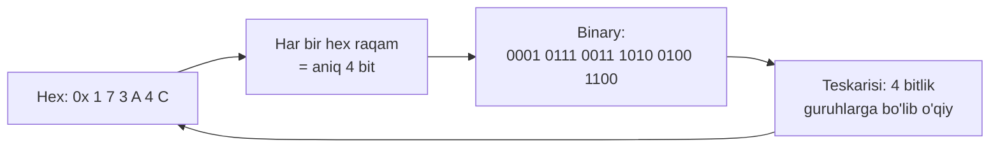
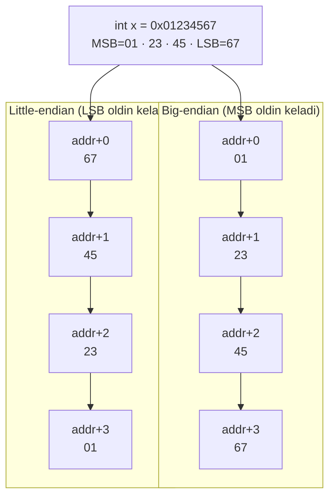
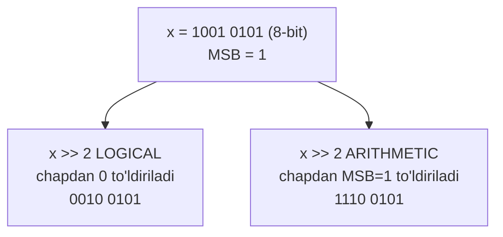

# 02. Information Storage — bitlar, baytlar va ular ustidagi amallar

> Manba: CS:APP 2-nashr, 2.1-bo'lim · Muhit: Ubuntu 24.04 x86-64 (Docker), gcc 13.3.0, go 1.22.2 · [← Oldingi](01-tour-of-computer-systems.md) · [Kurs xaritasi](00-README.md) · [Keyingi →](03-integer-representation.md)

## Nima uchun kerak

Sen har kuni Go-da `int32`, `uint64`, `[]byte` bilan ishlaysan — lekin bu qiymatlar xotirada aslida qanday yotishini ko'rganmisan? Bir kun kelib PostgreSQL wire protocol'idan kelgan xom baytlarni parse qilishing, yoki gRPC/protobuf message'ni debug qilishing kerak bo'ladi — va u yerda **endianness** (baytlar tartibi) noto'g'ri bo'lsa, `5` o'rniga `83886080` chiqadi.

Bit flag'lar ham shu darsdan: Linux fayl permission'lari (`rwxr-xr-x`), feature flag'lar, network protokol header'laridagi bit maydonlari — bularning hammasi **bit-level operatsiyalar** ustiga qurilgan. Va nihoyat, `hexdump` yoki `xxd` chiqishini o'qiy olish — bu buzilgan fayl yoki noto'g'ri serialize qilingan message'ni topishda haqiqiy debugging superkuchi.

Bu darsdan keyin xom baytlar sen uchun "sehr" bo'lishdan to'xtaydi.

## Nazariya

### 1. Xotira = katta bayt massivi

Kompyuter alohida bitlarga emas, **bayt** (byte — 8 bit)larga murojaat qiladi. Bayt — xotiraning eng kichik adreslanadigan (addressable) bo'lagi. Mashina nuqtai nazaridan xotira — bu ulkan bir o'lchamli bayt massivi: **virtual memory**.

Har bir baytning o'z tartib raqami bor — bu uning **address**'i (manzili). Barcha mumkin bo'lgan address'lar to'plami — **virtual address space** (virtual adres fazosi). C-dagi har qanday pointer qiymati — aslida shu massivdagi bironta baytning address'i, xolos.

> Muhim g'oya: bayt o'z-o'zidan "ma'no"ga ega emas. Bir xil baytlar — `int`, `float`, belgi yoki mashina instruction'i bo'lishi mumkin. Ma'noni faqat biz uni qanday tip sifatida o'qiganimiz beradi. Kompilyator tip haqidagi ma'lumotni saqlaydi; hosil bo'lgan mashina kodi esa har bir obyektni shunchaki baytlar bloki deb ko'radi.

### 2. Nega hexadecimal? (0x notatsiyasi)

Bitta baytni yozishning uchta yo'li bor, lekin ikkitasi noqulay:

- **Binary** (ikkilik): `0110 1001` — juda uzun, ekranni to'ldiradi.
- **Decimal** (o'nlik): `105` — ixcham, lekin bitlarga aylantirish uchun bo'lish/ko'paytirish kerak.
- **Hexadecimal** (o'n oltilik, "hex"): `0x69` — ixcham VA bitlarga tez aylanadi.

Hex 16 ta raqam ishlatadi: `0..9` va `A..F` (A=10, B=11, C=12, D=13, E=14, F=15). C-da hex son `0x` yoki `0X` prefiksi bilan yoziladi. Bitta hex raqam aynan **4 bit**ni (yarim baytni) ifodalaydi — mana shuning uchun hex ideal:



Konversiya qoidasi oddiy: har hex raqamni 4 bitga yoy, yoki 4 bitni bitta hex raqamga yig'. `0x173A4C` = `0001 0111 0011 1010 0100 1100`. Agar bitlar soni 4 ga bo'linmasa, chapdan nol qo'shib to'ldir.

Yana bir foydali fokus: agar son **ikki darajasi** bo'lsa (`x = 2^n`), uni hex'da darhol yozish mumkin. Masalan `2^12 = 4096` — binaryda `1` va 12 ta nol, ya'ni `0x1000`.

### 3. Word size — nima uchun 4 GB va 16 EB

Har bir kompyuterning **word size**'i bor — integer va pointer ma'lumotining "nominal" o'lchami. Eng muhim oqibati: word size **virtual address space**'ning maksimal hajmini belgilaydi. `w`-bitli word size'da address'lar `0` dan `2^w − 1` gacha boradi.

| Word size | Address diapazoni | Maksimal xotira |
| --------- | ----------------- | --------------- |
| 32-bit    | 0 .. 2^32 − 1     | 4 GB            |
| 64-bit    | 0 .. 2^64 − 1     | 16 EB (exabyte) |

Mana nega eski 32-bit tizimlar 4 GB dan ortiq RAM'ni "ko'ra olmasdi". Bugungi deyarli barcha server va desktop — 64-bit (x86-64, ARM64), shuning uchun biz butun kursda `w = 64` ni asosiy holat deb olamiz.

### 4. C tiplarining o'lchamlari (x86-64)

C bir nechta integer va floating-point tipni qo'llab-quvvatlaydi, har xil uzunlikda. Muhim nozik nuqta: **o'lchamlar mashina va kompilyatorga bog'liq**. x86-64 (64-bit Linux, gcc) uchun tipik o'lchamlar:

| C tip       | x86-64 (bayt) | 32-bit mashina (bayt) |
| ----------- | ------------- | --------------------- |
| `char`      | 1             | 1                     |
| `short`     | 2             | 2                     |
| `int`       | 4             | 4                     |
| `long`      | 8             | 4                     |
| `long long` | 8             | 8                     |
| `char *`    | 8             | 4                     |
| `float`     | 4             | 4                     |
| `double`    | 8             | 8                     |

Diqqat: `long` va pointer (`char *`) mashinaning word size'iga teng — 32-bit'da 4 bayt, 64-bit'da 8 bayt. Ko'p eski dastur "`int` ichiga pointer sig'adi" deb taxmin qilgan — bu 32-bit'da ishlaydi, 64-bit'da esa **bug**. `int` esa ikkala platformada ham 4 bayt qoladi. Buni Go bilan solishtirishni pastda ko'ramiz.

### 5. Byte ordering — little-endian va big-endian

Bir baytdan katta obyekt (masalan 4 baytli `int`) xotirada ketma-ket baytlarda saqlanadi. Obyektning address'i — eng kichik baytning address'i. Savol: baytlarni **qaysi tartibda** joylashtiramiz?

Ikki konvensiya bor. Aytaylik `int x = 0x01234567`, uning eng katta ahamiyatli bayti (MSB) `0x01`, eng kichigi (LSB) `0x67`:



- **Little-endian**: eng kichik ahamiyatli bayt eng kichik address'da. x86, ARM64 (default rejim), RISC-V — hammasi shunday.
- **Big-endian**: eng katta ahamiyatli bayt eng kichik address'da. Eski IBM/Sun mashinalari va **network protokollar** ("network byte order").

Ko'pchilik dasturchi uchun endianness ko'rinmaydi — bir mashinada kompilyatsiya qilingan dastur bir xil natija beradi. Lekin **uchta holatda** u yuzaga chiqadi:
1. **Network orqali binary ma'lumot** — jo'natuvchi va qabul qiluvchi turli endianness'da bo'lsa, baytlar teskari o'qiladi.
2. **Disassembly o'qish** — mashina kodidagi address'lar little-endian'da teskari yotadi (06-11-darslarda ko'ramiz).
3. **Type punning** — obyektni yaratilgan tipidan boshqa tip sifatida o'qish (cast orqali). Bu tizim dasturlashda kerak, lekin ehtiyot talab qiladi.

### 6. String va kod — platformadan mustaqilmi?

C-da **string** — belgilar massivi, oxirida null belgi (`\0`, qiymati 0) turadi. Har belgi biror kodlash bilan ifodalanadi, eng keng tarqalgani — **ASCII**. Muhim: string baytlari **teskari saqlanmaydi** — har belgi o'z o'rnida, chunki ular bitta ko'p baytli son emas, balki alohida 1 baytli qiymatlar ketma-ketligi.

Shuning uchun ASCII matn **har mashinada bir xil** — endianness va word size'ga bog'liq emas. Matn ma'lumot binary ma'lumotga qaraganda ko'proq platformadan mustaqil. (Unicode/UTF-8 ham ASCII bilan mos: standart ASCII belgilar UTF-8'da ham xuddi shunday 1 baytli kodga ega.)

Mashina **kodi** esa — teskari: bir xil C funksiya turli mashina/OS'da butunlay boshqa baytlarga kompilyatsiya bo'ladi. Binary kod deyarli hech qachon platformalar aro ko'chirilmaydi. Mashina nuqtai nazaridan dastur — shunchaki baytlar ketma-ketligi.

### 7. Boolean algebra va C bit-level operatsiyalari

Kompyuter 0 va 1 ustida ishlagani uchun ular haqidagi matematika — **Boolean algebra** (George Boole, 1850-yillar) — muhim. C to'rtta bit-level operatsiyani beradi, ular Boolean amallariga aynan mos:

| Amal | Nomi | Qoida |
| ---- | ---- | ----- |
| `&`  | AND  | ikkala bit 1 bo'lsa, natija 1 |
| `\|` | OR   | kamida bittasi 1 bo'lsa, natija 1 |
| `^`  | XOR  | bitlar **har xil** bo'lsa, natija 1 |
| `~`  | NOT  | bitni teskarisiga aylantiradi |

Bu amallar butun **bit vector** (bir xil uzunlikdagi bitlar qatori) ustida bit-bit qo'llanadi. Eng foydali qo'llanish — **mask** (niqob): tanlangan bitlarni ajratib olish yoki o'zgartirish uchun maxsus bit shabloni. Masalan `x & 0xFF` — `x`ning faqat eng past baytini qoldiradi, qolganini nolga aylantiradi. `~0` esa word size'dan qat'i nazar "hammasi 1" mask beradi (`0xFFFFFFFF` deb yozishdan ko'ra portativroq).

XOR'ning bir sehrli xossasi: `a ^ a = 0`. Shuning uchun `x ^ x` doim nol — bu ko'p aqlli fokuslarga (masalan uchinchi o'zgaruvchisiz swap) asos bo'ladi.

### 8. Logical operatsiyalar (`&&` `||` `!`) — bit-level'dan farqi

C-da yana **logical** operatorlar bor: `&&`, `||`, `!`. Ular bit-level'dan tubdan farq qiladi:

- Har qanday **nolmas** argumentni `True`, **nol**ni `False` deb qaraydi.
- Natija doim `0` yoki `1`.
- **Short-circuit**: agar natija birinchi argumentdan aniqlansa, ikkinchisi umuman hisoblanmaydi. Masalan `p && *p` — `p` null bo'lsa, `*p` (dereference) bajarilmaydi, crash bo'lmaydi.

> Oltin qoida: `&` bit-level (har bitni alohida), `&&` logical (butun qiymatni rost/yolg'on deb). Ularni chalkashtirish backend'da eng xatarli, sekin topiladigan bug'lardan biri. `if (flags & MASK)` va `if (flags && MASK)` butunlay boshqa narsa.

### 9. Shift operatsiyalari — logical vs arithmetic

Shift bitlarni chap yoki o'ngga suradi:

- **Chapga shift** `x << k` — bitlarni `k` pozitsiya chapga suradi, o'ng tarafni nol bilan to'ldiradi. Bu `x`ni `2^k` ga ko'paytirish bilan teng.
- **O'ngga shift** `x >> k` — ikki xil bo'ladi:
  - **Logical shift**: chapni **nol** bilan to'ldiradi. `unsigned` tiplar uchun **doim** shu qo'llanadi.
  - **Arithmetic shift**: chapni **eng katta ahamiyatli bit** (sign bit) bilan to'ldiradi. `signed` tiplar uchun (amalda) shu qo'llanadi — bu manfiy sonlarni to'g'ri bo'lishda saqlaydi.



Bu farq keyingi darslarda (03 signed/unsigned, 04 arithmetic) integer'lar ichida qanday manfiy son saqlanishini tushunishga to'g'ridan-to'g'ri asos.

## Kod va isbot

### Misol 1 — `sizes.c`: C tiplari x86-64 da qancha joy oladi

```c
#include <stdio.h>

int main(void)
{
    printf("char      : %zu bayt\n", sizeof(char));
    printf("short     : %zu bayt\n", sizeof(short));
    printf("int       : %zu bayt\n", sizeof(int));
    printf("long      : %zu bayt\n", sizeof(long));
    printf("long long : %zu bayt\n", sizeof(long long));
    printf("char *    : %zu bayt\n", sizeof(char *));
    printf("float     : %zu bayt\n", sizeof(float));
    printf("double    : %zu bayt\n", sizeof(double));
    return 0;
}
```

```
$ gcc -Og -o sizes sizes.c && ./sizes
char      : 1 bayt
short     : 2 bayt
int       : 4 bayt
long      : 8 bayt
long long : 8 bayt
char *    : 8 bayt
float     : 4 bayt
double    : 8 bayt
```

`sizeof` operatori obyekt egallaydigan bayt sonini qaytaradi. Belgilangan son o'rniga `sizeof`'dan foydalanish — portativlik sari birinchi qadam. E'tibor ber: `long` va `char *` 8 bayt (word size), `int` esa 4 bayt. 32-bit mashinada `long` va `char *` 4 bayt bo'lardi.

### Misol 2 — `show_bytes.c`: obyektning xom baytlarini ko'rish (endianness isboti)

Bu darsning yuragi. G'oya: istalgan obyektning address'ini `unsigned char *` ga cast qilamiz — endi kompilyator uni "baytlar ketma-ketligi" deb ko'radi va biz har baytni hex'da chop etamiz.

```c
#include <stdio.h>

typedef unsigned char *byte_pointer;

void show_bytes(byte_pointer start, size_t len)
{
    for (size_t i = 0; i < len; i++)
        printf(" %.2x", start[i]);
    printf("\n");
}

int main(void)
{
    int x = 0x01234567;
    float f = 3.14f;
    const char *s = "salom";
    int *p = &x;

    printf("int  0x01234567 :");
    show_bytes((byte_pointer)&x, sizeof(x));
    printf("float 3.14      :");
    show_bytes((byte_pointer)&f, sizeof(f));
    printf("string \"salom\" :");
    show_bytes((byte_pointer)s, 6);           /* null terminator bilan */
    printf("pointer &x      :");
    show_bytes((byte_pointer)&p, sizeof(p));
    return 0;
}
```

```
$ gcc -Og -o show_bytes show_bytes.c && ./show_bytes
int  0x01234567 : 67 45 23 01
float 3.14      : c3 f5 48 40
string "salom" : 73 61 6c 6f 6d 00
pointer &x      : b8 5b fc ff ff 7f 00 00
```

Uchta xulosa, bittalab:

1. **`int` baytlari TESKARI** — `0x01234567` xotirada `67 45 23 01` bo'lib yotibdi. Bu x86-64 **little-endian** ekanining tirik isboti: eng kichik ahamiyatli bayt (`0x67`) eng kichik address'da. `float` ham xuddi shunday little-endian (`c3 f5 48 40`).
2. **String teskari EMAS** — `73 61 6c 6f 6d 00` bu aynan `s`, `a`, `l`, `o`, `m`, va null terminator. ASCII kodlar: `s`=0x73, `a`=0x61, `l`=0x6c, `o`=0x6f, `m`=0x6d. Har belgi o'z o'rnida — chunki string ko'p baytli son emas, balki 1 baytli qiymatlar massivi. Matn platformadan mustaqil.
3. **Pointer** qiymati (`&x` — stack address `0x00007ffffffc5bb8`) ham little-endian yotibdi. Har ishga tushirishda bu address boshqacha bo'lishi mumkin — bu **ASLR** (Address Space Layout Randomization), xavfsizlik mexanizmi (11-darsda ko'ramiz).

Notional machine nuqtai nazaridan: `(byte_pointer)&x` **pointer qiymatini o'zgartirmaydi** — u faqat kompilyatorga "shu address'dagi ma'lumotni `unsigned char` deb o'qi" deb aytadi. Xotirada hech nima ko'chmaydi; biz shunchaki bir xil baytlarga boshqa "ko'zoynak" bilan qaraymiz.

### Misol 3 — `bitops.c`: bit-level va logical amallar

```c
#include <stdio.h>

int main(void)
{
    unsigned char a = 0x69;   /* 0110 1001 */
    unsigned char b = 0x55;   /* 0101 0101 */

    printf("a & b  = 0x%.2x\n", a & b);
    printf("a | b  = 0x%.2x\n", a | b);
    printf("a ^ b  = 0x%.2x\n", a ^ b);
    printf("~a     = 0x%.2x\n", (unsigned char)~a);

    /* masking: IP addressdan oktet ajratish */
    unsigned int ip = 0xC0A80105;   /* 192.168.1.5 */
    printf("ip & 0xFF          = %u (oxirgi oktet)\n", ip & 0xFF);
    printf("(ip >> 24) & 0xFF  = %u (birinchi oktet)\n", (ip >> 24) & 0xFF);

    /* bitwise vs logical */
    printf("0x69 && 0x55 = %d (logical)\n", 0x69 && 0x55);
    printf("0x69 &  0x55 = 0x%x (bitwise)\n", 0x69 & 0x55);
    return 0;
}
```

```
$ gcc -Og -o bitops bitops.c && ./bitops
a & b  = 0x41
a | b  = 0x7d
a ^ b  = 0x3c
~a     = 0x96
ip & 0xFF          = 5 (oxirgi oktet)
(ip >> 24) & 0xFF  = 192 (birinchi oktet)
0x69 && 0x55 = 1 (logical)
0x69 &  0x55 = 0x41 (bitwise)
```

Bitlab hisoblab ko'ramiz (`a=0110 1001`, `b=0101 0101`):

```
   0110 1001   (a = 0x69)          0110 1001   (a = 0x69)
 & 0101 0101   (b = 0x55)        | 0101 0101   (b = 0x55)
 -----------                     -----------
   0100 0001   = 0x41              0111 1101   = 0x7d

   0110 1001   (a = 0x69)        ~ 0110 1001   (a = 0x69)
 ^ 0101 0101   (b = 0x55)          ---------
 -----------                       1001 0110   = 0x96
   0011 1100   = 0x3c
```

**IP masking** — real network kodi. `0xC0A80105` = `192.168.1.5` (C0=192, A8=168, 01=1, 05=5). `ip & 0xFF` oxirgi baytni (`0x05`=5) ajratadi. `(ip >> 24) & 0xFF` esa avval eng yuqori baytni pastga suradi, keyin niqoblab birinchi oktetni (`0xC0`=192) oladi. Bu aynan `net` paketlar IP'ni oktetlarga bo'lgandagi mantiq.

Oxirgi ikki qator — eng muhim farq: `0x69 && 0x55` = `1` (ikkala qiymat ham nolmas, demak "rost"), lekin `0x69 & 0x55` = `0x41` (bit-bit AND). Bir xil operandlar, butunlay boshqa natija.

### Misol 4 — `shifts.c`: logical vs arithmetic shift

```c
#include <stdio.h>

int main(void)
{
    int sx = -16;              /* 0xFFFFFFF0 */
    unsigned int ux = 0xFFFFFFF0;

    printf("signed   -16 >> 2 = %d  (0x%.8x) arithmetic shift\n", sx >> 2, (unsigned)(sx >> 2));
    printf("unsigned     >> 2 = %u (0x%.8x) logical shift\n", ux >> 2, ux >> 2);
    printf("1 << 10 = %d (2^10)\n", 1 << 10);
    printf("x*8 == x<<3: 7*8=%d, 7<<3=%d\n", 7*8, 7 << 3);
    return 0;
}
```

```
$ gcc -Og -o shifts shifts.c && ./shifts
signed   -16 >> 2 = -4  (0xfffffffc) arithmetic shift
unsigned     >> 2 = 1073741820 (0x3ffffffc) logical shift
1 << 10 = 1024 (2^10)
x*8 == x<<3: 7*8=56, 7<<3=56
```

Bir xil bit shabloni (`0xFFFFFFF0`), lekin tip boshqacha bo'lgani uchun `>> 2` boshqacha ishlaydi:

- `signed` `-16 >> 2`: **arithmetic** shift, chapdan sign bit (`1`) bilan to'ldiriladi. Natija `0xFFFFFFFC` = `-4`. Manfiy son manfiy qoldi, matematik jihatdan to'g'ri (`-16 / 4 = -4`).
- `unsigned` `>> 2`: **logical** shift, chapdan `0` bilan to'ldiriladi. Natija `0x3FFFFFFC` = `1073741820`.

Yana ikki foydali fokus: `1 << 10` = `1024` = `2^10` (bir bitni chapga surish = 2 darajaga ko'paytirish), va `7 << 3` = `56` = `7 * 8`. Kompilyatorlar ko'pincha `* 8` ni avtomatik `<< 3` ga aylantiradi (13-darsda optimizatsiya). Bu tip va shift bog'liqligi 03-04-darslarga tayyorgarlik.

## Go dasturchiga ko'prik

Go-da xuddi shu tushunchalar bor, lekin xavfsizroq API bilan. Quyidagi misol uchta yo'lni ko'rsatadi: xom xotira (`unsafe`), aniq byte order (`encoding/binary`) va bit amallari (`math/bits`).

```go
package main

import (
	"encoding/binary"
	"fmt"
	"math/bits"
	"unsafe"
)

func main() {
	x := uint32(0x01234567)

	// Xotiradagi haqiqiy tartib (unsafe orqali)
	p := (*[4]byte)(unsafe.Pointer(&x))
	fmt.Printf("xotirada       : % x\n", p[:])

	// encoding/binary bilan aniq tartib tanlash
	le := make([]byte, 4)
	be := make([]byte, 4)
	binary.LittleEndian.PutUint32(le, x)
	binary.BigEndian.PutUint32(be, x) // network byte order
	fmt.Printf("little-endian  : % x\n", le)
	fmt.Printf("big-endian     : % x (network byte order)\n", be)

	// math/bits — bit amallari uchun standart paket
	fmt.Printf("OnesCount(0x69)   = %d\n", bits.OnesCount8(0x69))
	fmt.Printf("ReverseBytes32    = 0x%08x\n", bits.ReverseBytes32(x))
}
```

```
$ go run endian.go
xotirada       : 67 45 23 01
little-endian  : 67 45 23 01
big-endian     : 01 23 45 67 (network byte order)
OnesCount(0x69)   = 4
ReverseBytes32    = 0x67452301
```

Nimalarga e'tibor berish kerak:

- **`unsafe` — kam ishlat.** `unsafe.Pointer` orqali xotiradagi haqiqiy tartibni ko'rish mumkin (`67 45 23 01` — xuddi C'dagidek little-endian), lekin bu C'dagi type punning'ning Go ekvivalenti: xavfli, portativ emas, faqat past darajali kod uchun. Kundalik kodda undan qoching.
- **`encoding/binary` — to'g'ri yo'l.** `binary.LittleEndian` va `binary.BigEndian` byte order'ni **aniq** tanlashga majbur qiladi. Bu xotirangdagi tartibga bog'liq emas — Go har platformada bir xil natija beradi. Determinizm = kamroq bug.
- **Network = BigEndian.** Deyarli barcha network protokol (TCP/IP header, DNS, PostgreSQL wire protocol) va ko'p binary format big-endian ("network byte order") ishlatadi. protobuf esa o'zining varint kodlashini ishlatadi, lekin fixed-size maydonlar little-endian. Qoida: **bir xil byte order bilan encode va decode qil**, aks holda ma'lumot buziladi.
- **`math/bits`** — bit hisoblash uchun standart paket: `OnesCount` (nechta bit 1), `ReverseBytes32` (baytlarni teskari qiladi, endianness almashtirish uchun), `LeadingZeros`, `TrailingZeros` va h.k. Bularni qo'lda yozma.

Muhim farq: Go-da `int` platformaga qarab 32 yoki 64 bit (64-bit tizimda 8 bayt). Shuning uchun binary serialize'da **hech qachon `int` ishlatma** — `int32` yoki `int64` kabi aniq o'lchamli tip ishlat. C'da `int` doim 4 bayt qoladi — bu C va Go orasidagi nozik farq.

## Real-world scenariylar

### 1. Binary fayl format bug'i — endianness

Tasavvur qil: xizmatingiz mijoz ID'sini `uint32` sifatida faylga yozadi. Bir mikroservis little-endian mashinada yozgan, boshqasi (yoki eski big-endian arxitektura, yoki noto'g'ri `binary.BigEndian` bilan yozilgan) uni o'qiydi. Natija: ID `1` o'rniga `16777216` (`0x01000000`) bo'lib chiqadi — baytlar teskari o'qilgan. Yechim: fayl formatini **hujjatlashtir** ("barcha integer little-endian") va `encoding/binary` bilan aniq byte order ishlatib o'qi/yoz.

### 2. Bit flag'lar — Linux fayl permission'lari

Linux fayl permission'lari (`rwxr-xr-x`) aslida bit mask. Har uchlik (owner/group/other) 3 bit: read=4 (`100`), write=2 (`010`), execute=1 (`001`). `chmod 755` — bu `111 101 101` = owner'ga `rwx`, boshqalarga `r-x`. Tekshirish `perm & 0b100` (o'qish ruxsatimi?), qo'shish `perm | 0b010` (yozish qo'sh), o'chirish `perm & ~0b001` (execute'ni olib tashla). Bu Linux kursidagi `chmod` mantig'ining ichki ko'rinishi — endi nega raqamlar shunday ishlashini bilasan.

### 3. Hexdump bilan production debugging

Serviseng buzilgan message qabul qilyapti. `xxd` yoki `hexdump` bilan xom baytlarni ko'rasan:

```
00000000: 5041 434b 0001 0000 0000 0005 ...
```

Birinchi 4 bayt `50 41 43 4b` = ASCII `PACK` (magic number, header sog'-salomat). Keyingi baytlar — versiya va uzunlik maydonlari. Agar bu yerda `4b 43 41 50` ko'rsang, jo'natuvchi baytlarni teskari (noto'g'ri endianness) yuborgan. Hexdump o'qiy olish — bu buzilgan header, noto'g'ri offset yoki truncated payload'ni ko'z bilan topish qobiliyati.

## Zamonaviy yondashuv

Web va sanoat amaliyotidan sintez:

- **Little-endian g'olib bo'ldi.** Bugungi deyarli barcha CPU — x86-64, ARM64 (default), Apple Silicon, RISC-V — little-endian. Big-endian faqat network protokollarda ("network byte order") va ba'zi legacy tizimlarda (eski SPARC, ba'zi network qurilma firmware) qoldi. Shu sababli ko'p dasturchi endianness'ga hech qachon duch kelmaydi — to network yoki cross-platform binary format bilan ishlamaguncha.
- **Type punning endi ehtiyotkorlik talab qiladi.** Zamonaviy C'da (strict aliasing qoidalari tufayli) `int`'ni `float *` orqali o'qish undefined behavior bo'lishi mumkin. To'g'ri yo'l — `memcpy` yoki `union` orqali. C'dagi eski "pointer cast" fokusi hali ham ishlaydi (biz `show_bytes`'da `unsigned char *` ishlatdik — bu istisno, ruxsat etilgan), lekin ixtiyoriy tiplar aro emas.
- **Zamonaviy tillar endianness'ni explicit qiladi.** Go (`encoding/binary`), Rust (`u32::to_be_bytes` / `from_le_bytes`) baytlar tartibini API darajasida majbur qiladi — "mashinaning tartibi qanaqa" degan savol umuman tug'ilmaydi. Bu implicit taxminlardan kelib chiqadigan butun bir bug sinfini yo'q qiladi.
- **Serialize uchun standart yechimlar.** Qo'lda byte-by-byte yozish o'rniga bugun protobuf, FlatBuffers, MessagePack, CBOR ishlatiladi — ular endianness'ni ichida hal qiladi. `encoding/binary` esa oddiy, tez-o'zgarmas formatlar va protokol header'lari uchun yaxshi.

## Keng tarqalgan xatolar

1. **`&` va `&&` ni chalkashtirish.** `if (flags & FLAG_X)` — bit tekshiruvi (to'g'ri). `if (flags && FLAG_X)` — logical AND, ikkala qiymat nolmasligini tekshiradi (deyarli doim noto'g'ri, "har doim true" bug'i). `|` va `||` uchun ham xuddi shunday. Bu sekin topiladigan, xatarli xato.

2. **"String ham teskari saqlanadi" degan xato tasavvur.** Yo'q — faqat ko'p baytli **sonlar** (int, float, pointer) endianness'ga bog'liq. String/`[]byte` — 1 baytli elementlar massivi, har element o'z o'rnida, teskari emas.

3. **`signed` songa `>>` ishlatish.** `signed` tipga o'ngga shift **arithmetic** (sign bilan to'ldiradi) — agar logical (nol bilan) kutgan bo'lsang, manfiy sonlarda kutilmagan natija. Bit-manipulyatsiya kerak bo'lsa `unsigned` tip ishlat.

4. **"Hexdump tartibi = sonning yozilishi" deb o'ylash.** Little-endian mashinada `int 0x01234567` hexdump'da `67 45 23 01` bo'lib ko'rinadi. Xom baytlar teskari — hexdump'ni o'qiganda buni yodda tut.

5. **`int` hamma joyda 4 bayt deb taxmin qilish.** C'da `long`/`char *` 32-bit'da 4, 64-bit'da 8 bayt. Go'da `int` platformaga qarab 4 yoki 8 bayt — binary serialize'da **hech qachon** `int` ishlatma, `int32`/`int64` ishlat.

6. **Mask'da qavsni unutish (operator precedence).** `x & 0xFF == 0` aslida `x & (0xFF == 0)` = `x & 0` = `0` bo'ladi, chunki `==` `&`'dan yuqori prioritetli! To'g'risi: `(x & 0xFF) == 0`. Bit amallarni doim qavsga ol.

## Amaliy mashqlar

### 1 (oson) — Hex → binary → decimal

`0x2F` ni binaryga va decimalga aylantir.

<details><summary>Yechim</summary>

Har hex raqamni 4 bitga yoy: `2` = `0010`, `F` = `1111`. Demak `0x2F` = `0010 1111`.
Decimal: `2 * 16 + 15 = 47`.
</details>

### 2 (oson) — Binary → hex

`1011 0110` ni hex va decimalga aylantir.

<details><summary>Yechim</summary>

`1011` = `B`, `0110` = `6`, demak `0xB6`.
Decimal: `11 * 16 + 6 = 182`.
</details>

### 3 (oson) — Ikki darajasini hex'da yoz

`2^12` ni hex'da yoz (bo'lmasdan/ko'paytirmasdan).

<details><summary>Yechim</summary>

`n = 12 = 0 + 4*3`. Yetakchi hex raqam `1` (i=0), keyin 3 ta nol → `0x1000`.
Tekshir: `0x1000` = `4096` = `2^12`. To'g'ri.
</details>

### 4 (o'rta) — Endianness bashorati

`uint32 v = 0xDEADBEEF` little-endian x86-64 xotirasida qanday tartibda yotadi? Big-endian'da-chi?

<details><summary>Yechim</summary>

Baytlar MSB→LSB: `DE AD BE EF`.
**Little-endian** (LSB oldin): `EF BE AD DE`.
**Big-endian** (MSB oldin): `DE AD BE EF`.
`show_bytes`'ni bu qiymatga chaqirsang, x86-64'da `ef be ad de` chiqadi.
</details>

### 5 (o'rta) — Mask yozish

`bitops.c`'dagi `ip = 0xC0A80105` (192.168.1.5) uchun **ikkinchi oktet**ni (168) ajratuvchi C ifodasini yoz.

<details><summary>Yechim</summary>

192.168.1.5 baytlari: `C0 A8 01 05`. Ikkinchi oktet `168` = `0xA8`, u 16..23 bit oralig'ida. Avval 16 bit pastga sur, keyin niqobla:
`(ip >> 16) & 0xFF`
Hisob: `ip >> 16` = `0x0000C0A8`, `& 0xFF` = `0xA8` = `168`. To'g'ri.
(Diqqat: `(ip >> 8) & 0xFF` uchinchi oktetni — `0x01` = `1` ni berardi, `168` ni emas.)
</details>

### 6 (o'rta) — Bu kod nima chiqaradi?

`bitops.c`'dagi `a = 0x69`, `b = 0x55` uchun `~b` (unsigned char) nimaga teng? Qo'lda hisobla.

<details><summary>Yechim</summary>

`b = 0x55 = 0101 0101`. `~b` har bitni teskari qiladi: `1010 1010` = `0xAA`.
(Diqqat: `unsigned char`ga cast qilmasang, C `int`gacha kengaytirib `0xFFFFFFAA` chiqaradi — bu keng tarqalgan `~` xatosi.)
</details>

### 7 (qiyin) — Signed shift tahlili

`shifts.c` mantig'iga tayanib: `int y = -16` uchun `y >> 2` nima uchun `-4` chiqadi, `unsigned`'da esa `>> 2` nega ulkan musbat son? Bit darajasida tushuntir.

<details><summary>Yechim</summary>

`-16` 32-bit two's complement'da `0xFFFFFFF0` = `1111...1111 0000`.
`signed >> 2` — **arithmetic** shift: chapdan sign bit (`1`) bilan to'ldiriladi → `0xFFFFFFFC` = `-4`. Manfiy son manfiy qoldi (`-16 / 4 = -4`).
`unsigned >> 2` — **logical** shift: chapdan `0` bilan to'ldiriladi → `0x3FFFFFFC` = `1073741820`. Bir xil bitlar, boshqa tip → boshqa to'ldirish qoidasi. Bu two's complement'ni chuqurroq o'rganadigan 03-darsga ko'prik.
</details>

## Cheat sheet

| Tushuncha / Amal | Nima qiladi | Eslab qolish |
| ---------------- | ----------- | ------------ |
| `0x` prefiks | hex son | 1 hex raqam = 4 bit |
| `&` | bit AND | ikkala bit 1 → 1; mask uchun |
| `\|` | bit OR | biror bit 1 → 1; bit yoqish |
| `^` | bit XOR | bitlar har xil → 1; `x ^ x = 0` |
| `~` | bit NOT | barcha bitni teskari; `~0` = hammasi 1 |
| `<<` | chap shift | `x << k` = `x * 2^k` |
| `>>` | o'ng shift | unsigned=logical, signed=arithmetic |
| `x & 0xFF` | mask | eng past baytni ajratadi |
| `x \| MASK` | bit set | tanlangan bitlarni yoqadi |
| `x & ~MASK` | bit clear | tanlangan bitlarni o'chiradi |
| `x ^ MASK` | bit toggle | tanlangan bitlarni almashtiradi |
| `&&` `\|\|` `!` | logical | qiymatni rost/yolg'on; short-circuit |
| little-endian | LSB oldin | x86-64, ARM64, RISC-V |
| big-endian | MSB oldin | network byte order, legacy |
| `int` (C) | 4 bayt | mashinadan qat'i nazar |
| `long`, pointer (C) | word size | 32-bit=4, 64-bit=8 bayt |

## Qo'shimcha manbalar

- [Endianness — Wikipedia](https://en.wikipedia.org/wiki/Endianness) — little/big-endian, network byte order va tarixi.
- [Go `encoding/binary` paketi](https://pkg.go.dev/encoding/binary) — `LittleEndian`/`BigEndian` API, byte order best practices.
- [Networking and Sockets: Endianness (kungfudev)](https://www.kungfudev.com/blog/2024/06/14/network-sockets-endianness) — socket dasturlashda byte order konversiyasi amaliy misollar bilan.
- [Bitwise operations in C — Wikipedia](https://en.wikipedia.org/wiki/Bitwise_operations_in_C) — operator precedence va tipik xatolar.
