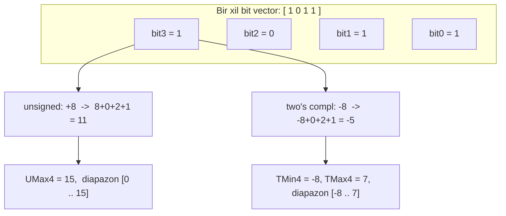
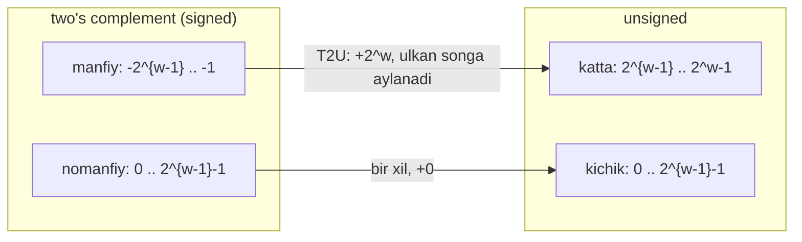
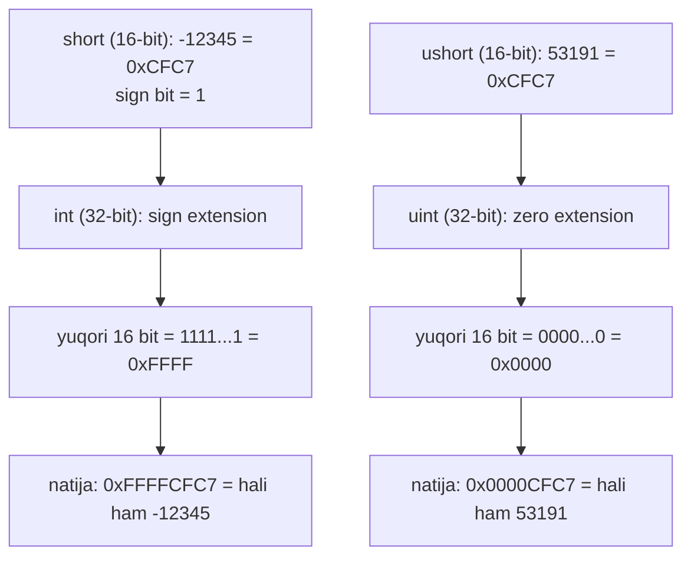

# 03. Integer Representation — unsigned va two's complement

> Manba: CS:APP 2-nashr, 2.2-bo'lim · Muhit: Ubuntu 24.04 x86-64 (Docker), gcc 13.3.0, go 1.22.2 · [← Oldingi](02-information-storage.md) · [Kurs xaritasi](00-README.md) · [Keyingi →](04-integer-arithmetic.md)

## Nima uchun kerak

Bir kun kelib DB'dagi `count` maydoniga xatolik tufayli `-1` yozilib qoladi, keyin uni C xizmatida `unsigned` sifatida o'qiysan — va to'satdan `4294967295` chiqadi. Yoki `if (len - 1 > max)` deb yozasan, `len` esa `size_t` (unsigned); `len == 0` bo'lganda `0 - 1` nolga aylanmaydi, balki **ulkan songa** o'girilib, tekshiruvni yorib o'tadi. Bu shunchaki nazariya emas — aynan shu naqsh ustida haqiqiy CVE'lar yozilgan.

Go'da ham xuddi shu masalalar bor, faqat boshqacha qoplangan: `len()` ataylab `int` qaytaradi (`size_t` emas), aralash `int`/`uint` taqqoslash esa **kompilyatsiya** bosqichida taqiqlangan. Nega bunday qilingani — Go dizaynining ongli qarori, va buni tushunish uchun avval C'dagi tuzoqlarni ko'rish kerak.

Va nihoyat: 06-darsda disassembly o'qiganingda `0xfffffe58` kabi sonlarni ko'rasan. Bu darsdan keyin bunday hex'ga qarab darhol "bu manfiy son, taxminan `-424`" deb o'qiy olasan. Bit'lar ortidagi ma'noni ko'rish — bu debugging superkuchi.

## Nazariya

### 1. Bit vector — barchasining asosi

Faraz qilaylik bizda `w` bitli integer tip bor. Uning bit'lar to'plamini **bit vector** deb ataymiz va `[x_{w-1}, x_{w-2}, ..., x_1, x_0]` ko'rinishida yozamiz. Bu yerda `x_0` — eng past (o'ng) bit, `x_{w-1}` — eng yuqori (chap) bit.

Bir xil bit'lar to'plamini **ikki xil** talqin qilishimiz mumkin:

- **unsigned** — faqat nomanfiy sonlar (0 va musbat),
- **two's complement** — manfiy, nol va musbat sonlar.

> Oltin g'oya: bit'lar o'zgarmaydi — faqat ularni **qanday o'qiyapmiz** o'zgaradi. Bir xil `0xCFC7` bir vaqtning o'zida `-12345` (signed) VA `53191` (unsigned).

Bu 02-darsdagi asosiy fikrning davomi: bayt o'z-o'zidan ma'noga ega emas, ma'noni talqin beradi. Endi shu talqinni aniq formula bilan ifodalaymiz.

### 2. Unsigned encoding — B2U

Eng oddiy holat. Har bir bit `i` o'z **og'irligiga** ega: `2^i`. Qiymat — yoqilgan bit'lar og'irliklarining yig'indisi. Bu funksiyani **B2U** (binary to unsigned) deb ataymiz:

```
B2U_w([x_{w-1}, ..., x_0]) = x_{w-1}*2^{w-1} + ... + x_1*2^1 + x_0*2^0
```

4-bitli misollar bilan (og'irliklar: `8, 4, 2, 1`):

| Bit vector | Hisob | B2U |
| ---------- | ------------------ | --- |
| `[0001]` | `0+0+0+1` | 1 |
| `[0101]` | `0+4+0+1` | 5 |
| `[1011]` | `8+0+2+1` | **11** |
| `[1111]` | `8+4+2+1` | **15** |

Eng kichik qiymat — `[0000] = 0`. Eng katta — `[1111...1]`, ya'ni hamma bit 1. Uni **UMax** deb ataymiz: `UMax_w = 2^w - 1`. 4-bit uchun `UMax_4 = 2^4 - 1 = 15`. Demak unsigned diapazoni: `[0, 2^w - 1]`.

Muhim xususiyat: har bir son shu diapazonda **aynan bitta** bit vector'ga mos keladi (matematik tilda — bijection). `11` ni 4-bitda ifodalashning yagona yo'li — `[1011]`.

### 3. Two's complement — B2T va sign bit

Endi manfiy sonlar kerak. Eng keng tarqalgan usul — **two's complement**. G'oya nihoyatda oddiy: eng yuqori bit (`x_{w-1}`) og'irligini **manfiy** qilamiz. Uning og'irligi `-2^{w-1}`, qolgan barcha bit'lar unsigned'dagidek musbat.

```
B2T_w([x_{w-1}, ..., x_0]) = -x_{w-1}*2^{w-1} + x_{w-2}*2^{w-2} + ... + x_0*2^0
```

Eng yuqori bit **sign bit** (ishora biti) deb ataladi. Uning mantiqi soddagina:

- sign bit = `0` → son nomanfiy (unsigned bilan bir xil o'qiladi),
- sign bit = `1` → son manfiy.

Xuddi shu 4-bit vector'larni endi two's complement sifatida o'qiymiz (og'irliklar: `-8, 4, 2, 1`):

| Bit vector | Hisob | B2T |
| ---------- | -------------------- | ------ |
| `[0001]` | `-0+0+0+1` | 1 |
| `[0101]` | `-0+4+0+1` | 5 |
| `[1011]` | `-8+0+2+1` | **-5** |
| `[1111]` | `-8+4+2+1` | **-1** |

Diqqat qil: `[1011]` va `[1111]` uchun bit'lar B2U jadvalidagi bilan **aynan bir xil**, lekin qiymatlar farq qiladi — chunki yuqori bit endi `+8` emas, `-8` og'irlikka ega. Bit'lar bir xil, talqin boshqa.

Quyidagi diagramma ikkala talqinni yonma-yon ko'rsatadi (dual coding: yuqoridagi ikki jadval — vizual shaklda):



### 4. TMin, TMax va diapazon asimmetriyasi

Two's complement diapazoni chegaralarini bevosita bit shakllaridan chiqaramiz:

- **TMin** (eng kichik) = `[1000...0]` — faqat sign bit yoqilgan: `TMin_w = -2^{w-1}`.
- **TMax** (eng katta) = `[0111...1]` — sign bit o'chgan, qolgani yoqilgan: `TMax_w = 2^{w-1} - 1`.

4-bit uchun: `TMin_4 = -8`, `TMax_4 = 7`. Diapazon: `[-8, 7]`.

Muhim va noqulay fakt — diapazon **asimmetrik**: manfiy tomon musbat tomondan bittaga uzunroq:

```
|TMin| = |TMax| + 1
```

4-bitda: `|-8| = 8`, `|7| = 7`, `8 = 7 + 1`. Nega? Chunki bit shakllarining yarmi (sign bit = 1) manfiy sonlarga, yarmi (sign bit = 0) nomanfiy sonlarga ketadi. Nomanfiy yarmiga `0` ham kirgani uchun musbat sonlar bittaga kam qoladi. Bu asimmetriya keyingi darsda (04-darsda) `-TMin == TMin` kabi g'alati holatlarning sababi bo'ladi.

Yana ikki foydali munosabat:

- `UMax = 2*TMax + 1` (unsigned diapazoni two's complement musbat qismidan ikki barobardan sal ko'proq),
- `-1` ning bit shakli — **hammasi 1** (`[1111...1]`), bu esa `UMax` bilan aynan bir xil bit shakl.

Muhim sonlarni bir jadvalda jamlaymiz (w = 32 uchun):

| Qiymat | Bit shakl (hex) | Sign bit | Izoh |
| ------ | --------------- | -------- | ---- |
| `UMax` | `0xFFFFFFFF` | — | hamma bit 1, unsigned eng katta |
| `TMax` | `0x7FFFFFFF` | 0 | sign 0, qolgani 1 |
| `TMin` | `0x80000000` | 1 | faqat sign bit 1 |
| `-1` | `0xFFFFFFFF` | 1 | hamma bit 1, `UMax` bilan bir xil |
| `0` | `0x00000000` | 0 | hamma bit 0 |

### 5. Nega aynan two's complement g'olib bo'ldi

Manfiy sonlarni kodlashning boshqa usullari ham tarixda bo'lgan:

- **Sign-magnitude**: yuqori bit — faqat ishora, qolgani — kattalik. `B2S_w = (-1)^{x_{w-1}} * (qolgan bit'lar yig'indisi)`.
- **Ones' complement**: yuqori bit og'irligi `-(2^{w-1} - 1)`, `-2^{w-1}` emas.

Ikkalasining ham noqulay xususiyati bor: **nol ikki xil ko'rinishga ega** (`+0` va `-0`). Sign-magnitude'da `[1000...0]` = `-0`, ones' complement'da `[1111...1]` = `-0`. Ikki xil nol — taqqoslash va arifmetikani murakkablashtiradi.

Two's complement'ning ikkita hal qiluvchi ustunligi:

1. **Nol yagona** — `[0000...0]` faqat bitta.
2. **Qo'shish sxemasi bir xil** — protsessor uchun signed va unsigned qo'shuvchi bir xil apparatdan foydalanadi (buni 04-darsda ko'ramiz). Bitta ALU hamma holatga yetadi.

> "two's complement" nomi shundan: nomanfiy `x` uchun `-x` ning `w`-bitli shaklini `2^w - x` deb hisoblaymiz (bitta "two" — `2^w`). "ones' complement" esa `-x = [111...1] - x` (ko'p "one").

Amalda bugungi deyarli barcha mashina two's complement ishlatadi. C standarti kitob yozilganda buni **majburlamas** edi (portativlik uchun boshqa usullarga ruxsat berardi), lekin bu endi tarix — "Zamonaviy yondashuv" bo'limida ko'ramiz.

### 6. Signed <-> unsigned konversiya: bit'lar qotadi, talqin o'zgaradi

Bu darsning eng muhim amaliy g'oyasi. C'da bir tipdan boshqasiga cast qilganingda (bir xil `w` uchun) **bit shakli o'zgarmaydi** — faqat talqin o'zgaradi.

Buni matematik formula bilan ifodalaymiz. `T2U_w` — signed'dan unsigned'ga o'tkazuvchi funksiya (bit'lar bir xil qoladi):

```
T2U_w(x) = x + 2^w   (agar x < 0)
T2U_w(x) = x         (agar x >= 0)
```

Ya'ni manfiy songa `2^w` qo'shiladi, nomanfiy son o'zgarmaydi. Misollar:

- `T2U_16(-12345) = -12345 + 65536 = 53191`
- `T2U_32(-1) = -1 + 2^32 = 4294967295 = UMax_32`
- `T2U_32(TMin) = -2^31 + 2^32 = 2^31 = TMax + 1`

Teskari yo'nalish — `U2T_w` (unsigned'dan signed'ga):

```
U2T_w(u) = u          (agar u < 2^{w-1})
U2T_w(u) = u - 2^w    (agar u >= 2^{w-1})
```

- `U2T_16(53191) = 53191 - 65536 = -12345`
- `U2T_32(4294967295) = 4294967295 - 2^32 = -1`

Xulosa bitta rasmda: `[0, 2^{w-1})` oralig'idagi sonlar **ikki talqinda ham bir xil**. Bu oraliqdan tashqaridagilarda esa konversiya `2^w` ni qo'shadi yoki ayiradi — manfiy sonlar ulkan musbat sonlarga, katta unsigned sonlar manfiy sonlarga aylanadi.



### 7. C'ning xavfli qoidasi: aralashsa, signed -> unsigned

Endi eng ko'p bug tug'diradigan joy. C'da bitta ifodada **bir operand signed, biri unsigned** bo'lsa, C **signed operandni yashirincha unsigned'ga** cast qiladi va hisobni nomanfiy sonlar deb bajaradi.

Klassik misol: `-1 < 0U`. Ikkinchi operand unsigned (`0U`), shuning uchun `-1` ham unsigned'ga cast bo'ladi: `T2U_32(-1) = 4294967295`. Endi ifoda `4294967295U < 0U` ga aylanadi — bu **yolg'on**. Ya'ni `-1 < 0U` intuitivga zid ravishda `0` (false) qaytaradi.

Bu qoida arifmetik amallar (`+`, `-`, `*`) uchun ko'pincha muhim emas, lekin taqqoslash operatorlari (`<`, `>`, `<=`, `>=`) uchun jiddiy tuzoq. `printf` esa tipni umuman bilmaydi — `%d` bilan unsigned, `%u` bilan signed chop etsang, bir xil bit'lar boshqacha "o'qiladi".

### 8. Sign extension va zero extension

Kichik tipdan katta tipga o'tkazganda (masalan `short` -> `int`) qiymatni **saqlab qolish** kerak. Qoida talqinga bog'liq:

- **zero extension** (unsigned uchun): yuqoriga `0` bit'lar qo'shiladi.
- **sign extension** (two's complement uchun): yuqoriga **sign bit'ning nusxalari** qo'shiladi. Sign bit 1 bo'lsa — `1`lar, 0 bo'lsa — `0`lar.

Nega sign bit takrorlanadi? Kichik misol bilan (w=3 dan w=4 ga). `[101]` = `-4+1 = -3`. Sign extension: `[1101]` = `-8+4+1 = -3`. Qiymat saqlandi! Sabab: yuqori ikki bit birlashib `-8+4 = -4` beradi — bu esa w=3 dagi sign bit `-4` ga aynan teng.



Diqqat: `0xCFC7` 16-bitda signed va unsigned uchun bir xil bit shakl edi, lekin 32-bitga kengaytirilganda ajralib ketadi — chunki biri sign, biri zero extension bo'ladi.

### 9. Truncation — katta tipdan kichikka

Teskari amal: `int` -> `short` da yuqori bit'lar **tashlab yuboriladi**. Bu ma'lumot yo'qotishi — overflow'ning bir turi.

Matematik jihatdan, `w`-bitli sonni `k`-bitga qisqartirish = `x mod 2^k` (unsigned talqinda). Ya'ni faqat past `k` bit qoladi:

```
0x12345678 -> short (past 16 bit) = 0x5678 = 22136
```

two's complement uchun ham bit'lar bir xil qisqaradi, natijani esa yana signed deb o'qiymiz: qiymat `U2T_k(x mod 2^k)` bo'ladi. Shuning uchun katta musbat son qisqartirilganda manfiyga aylanib qolishi mumkin.

## Kod va isbot

### 1-misol: diapazon konstantalari (`limits.c`)

`<limits.h>` sarlavhasi har bir integer tipning chegaralarini beradi. Ular aynan `TMin`, `TMax`, `UMax` qiymatlaridir.

```c
#include <stdio.h>
#include <limits.h>

int main(void)
{
    printf("INT_MAX   = %d  (0x%.8x)\n", INT_MAX, INT_MAX);
    printf("INT_MIN   = %d (0x%.8x)\n", INT_MIN, INT_MIN);
    printf("UINT_MAX  = %u  (0x%.8x)\n", UINT_MAX, UINT_MAX);
    printf("LONG_MAX  = %ld\n", LONG_MAX);
    printf("LONG_MIN  = %ld\n", LONG_MIN);
    printf("-1 int    = 0x%.8x (UMax bilan bir xil bitlar!)\n", -1);
    return 0;
}
```

```text
$ gcc -Og -o limits limits.c && ./limits
INT_MAX   = 2147483647  (0x7fffffff)
INT_MIN   = -2147483648 (0x80000000)
UINT_MAX  = 4294967295  (0xffffffff)
LONG_MAX  = 9223372036854775807
LONG_MIN  = -9223372036854775808
-1 int    = 0xffffffff (UMax bilan bir xil bitlar!)
```

Bit shakllarini nazariya jadvali bilan solishtir:

- `TMax = 0x7FFFFFFF` — sign bit `0`, qolgani `1`.
- `TMin = 0x80000000` — faqat sign bit `1`.
- `-1 = 0xFFFFFFFF` — hamma bit `1`, `UMax` bilan aynan bir xil shakl.

Notional machine nuqtai nazaridan: `INT_MIN` ni `limits.h` aslida `(-INT_MAX - 1)` deb yozadi, `-2147483648` deb emas. Sabab — `2147483648` `int` diapazoniga sig'maydi, kompilyator uni katta tipda ushlab, keyin `-` qo'llardi. `-2147483647 - 1` esa har doim to'g'ri `TMin` beradi.

### 2-misol: klassik konversiya (`cast.c`)

Bu darsning yuragi. Cast bit'larni **o'zgartirmaydi**, faqat talqinni.

```c
#include <stdio.h>

int main(void)
{
    short v = -12345;
    unsigned short uv = (unsigned short) v;
    printf("v  = %d, uv = %u (bitlar: 0x%.4hx)\n", v, uv, v);

    unsigned u = 4294967295u;               /* UMax_32 */
    int tu = (int) u;
    printf("u  = %u, tu = %d (bitlar: 0x%.8x)\n", u, tu, u);
    return 0;
}
```

```text
$ gcc -Og -o cast cast.c && ./cast
v  = -12345, uv = 53191 (bitlar: 0xcfc7)
u  = 4294967295, tu = -1 (bitlar: 0xffffffff)
```

Ikkala satrni formulalar bilan tekshiramiz:

- `0xCFC7` bir vaqtda `-12345` (signed) va `53191` (unsigned). `T2U_16(-12345) = -12345 + 65536 = 53191` — mos keldi.
- `0xFFFFFFFF` bir vaqtda `4294967295` (unsigned) va `-1` (signed). `U2T_32(4294967295) = 4294967295 - 2^32 = -1` — mos keldi.

Bit shakli `0xCFC7` va `0xFFFFFFFF` ikkala satrda ham **o'zgarmadi** — faqat `%d`/`%u` uni boshqacha ko'rsatdi. Bu — signed<->unsigned konversiyaning butun mohiyati.

### 3-misol: implicit conversion tuzoqlari (`traps.c`)

Endi eng xavfli qismi — real bug'lar. Uch xil tuzoq bitta faylda.

```c
#include <stdio.h>
#include <string.h>

int main(void)
{
    /* 1-tuzoq: signed va unsigned aralash taqqoslash */
    printf("-1 < 0U  natijasi: %d (kutilgan 1, chiqdi 0!)\n", -1 < 0U);

    /* 2-tuzoq: strlen() size_t (unsigned) qaytaradi */
    const char *s = "";
    if (strlen(s) - 1 > 100)
        printf("strlen(\"\")-1 > 100 rost! chunki 0-1 unsigned'da ulkan son\n");
    printf("strlen(\"\")-1 = %zu\n", strlen(s) - 1);

    /* 3-tuzoq: sikl hisoblagichi unsigned bo'lsa */
    unsigned i;
    int count = 0;
    for (i = 3; i >= 0 && count < 5; i--)   /* i >= 0 DOIM rost */
        count++;
    printf("unsigned 'i >= 0' sikli %d marta aylandi (cheksizdan himoya bilan)\n", count);
    return 0;
}
```

```text
$ gcc -Og -o traps traps.c && ./traps
-1 < 0U  natijasi: 0 (kutilgan 1, chiqdi 0!)
strlen("")-1 > 100 rost! chunki 0-1 unsigned'da ulkan son
strlen("")-1 = 18446744073709551615
unsigned 'i >= 0' sikli 5 marta aylandi (cheksizdan himoya bilan)
```

Har bir tuzoqni ochamiz:

- **1-tuzoq.** `0U` unsigned bo'lgani uchun `-1` ham unsigned'ga aylanadi: `T2U_32(-1) = 4294967295`. Endi `4294967295 < 0` — yolg'on, natija `0`.
- **2-tuzoq.** `strlen("") = 0`, `strlen` esa `size_t` (unsigned 64-bit) qaytaradi. `0 - 1` unsigned'da nolga aylanmaydi — u `2^64 - 1 = 18446744073709551615` bo'ladi. Shuning uchun `... > 100` doim rost. Bu naqsh — bufer o'lchamlari tekshiruvlarida haqiqiy security bug manbai.
- **3-tuzoq.** `i` unsigned, shuning uchun `i >= 0` **hech qachon** yolg'on bo'lmaydi (unsigned son manfiy bo'lolmaydi). `i` `0` dan pastga tushganda `4294967295` ga "wrap around" bo'ladi. Biz `count < 5` himoyasini qo'shdik, aks holda dastur cheksiz aylanardi.

### 4-misol: sign/zero extension va truncation (`extend.c`)

02-darsdagi `show_bytes` yordamida bit'larni xotira darajasida ko'ramiz.

```c
#include <stdio.h>

typedef unsigned char *byte_pointer;

void show_bytes(byte_pointer start, size_t len)
{
    for (size_t i = 0; i < len; i++)
        printf(" %.2x", start[i]);
    printf("\n");
}

int main(void)
{
    short sv = -12345;            /* 0xCFC7 */
    int   iv = sv;                /* sign extension */
    unsigned short usv = 53191;   /* 0xCFC7 - bir xil bitlar! */
    unsigned int   uiv = usv;     /* zero extension */

    printf("short -12345      :"); show_bytes((byte_pointer)&sv, sizeof(sv));
    printf("int   (sign ext)  :"); show_bytes((byte_pointer)&iv, sizeof(iv));
    printf("ushort 53191      :"); show_bytes((byte_pointer)&usv, sizeof(usv));
    printf("uint  (zero ext)  :"); show_bytes((byte_pointer)&uiv, sizeof(uiv));

    /* truncation: katta tipdan kichikka */
    int big = 0x12345678;
    short trunc = (short) big;    /* faqat past 16 bit qoladi */
    printf("int 0x12345678 -> short: 0x%.4hx (%d)\n", trunc, trunc);
    return 0;
}
```

```text
$ gcc -Og -o extend extend.c && ./extend
short -12345      : c7 cf
int   (sign ext)  : c7 cf ff ff
ushort 53191      : c7 cf
uint  (zero ext)  : c7 cf 00 00
int 0x12345678 -> short: 0x5678 (22136)
```

Baytlar **little-endian** tartibda ko'rinadi — 02-darsda o'rgangandek, past bayt oldin. Shuning uchun `0xCFC7` xotirada `c7 cf`. Endi natijalarni o'qiymiz:

- **sign extension**: `-12345` kengayganda yuqoriga sign bit (`1`) nusxalari qo'shiladi → `ff ff`. Qiymat `-12345` saqlandi (`0xFFFFCFC7`).
- **zero extension**: `53191` (unsigned) kengayganda yuqoriga `0`lar qo'shiladi → `00 00`. Qiymat `53191` saqlandi (`0x0000CFC7`).
- **truncation**: `0x12345678` dan faqat past 16 bit qoladi → `0x5678 = 22136`. Yuqori bit'lar (`0x1234`) **yo'qoldi**.

E'tibor ber: `0xCFC7` 16-bitda signed va unsigned uchun aynan bir xil edi, lekin 32-bitga kengaytirilgach ajralib ketdi — biri `ff ff`, biri `00 00`. Talqin kengaytirish yo'lini belgiladi.

## Go dasturchiga ko'prik

Go xuddi shu apparat ustida ishlaydi — bit'lar, two's complement, extension — hammasi bir xil. Farq **til dizaynida**: Go C'ning eng ko'p bug tug'diradigan tuzoqlarini ataylab yopib qo'ygan.

### 5-misol: aniq o'lchamli tiplar va explicit cast (`intrep.go`)

```go
package main

import (
	"fmt"
	"math"
)

func main() {
	// Go'da aniq o'lchamli tiplar - diapazonlar
	fmt.Printf("int8 : [%d, %d]\n", math.MinInt8, math.MaxInt8)
	fmt.Printf("int32: [%d, %d]\n", math.MinInt32, math.MaxInt32)
	fmt.Printf("int64: [%d, %d]\n", math.MinInt64, math.MaxInt64)

	// Bir xil bitlar, ikki talqin - C'dagi kabi, lekin EXPLICIT cast bilan
	var v int16 = -12345
	uv := uint16(v) // aniq konversiya talab qilinadi
	fmt.Printf("int16(-12345) -> uint16 = %d (bitlar 0x%04x)\n", uv, uv)

	// var x int = -1
	// if x < uint(0) {}  // KOMPILYATSIYA XATOSI: invalid operation:
	//                    // mismatched types int and uint
	// Go C'dagi -1 < 0U tuzog'ini kompilyatsiya bosqichida taqiqlaydi

	// len() int qaytaradi (size_t emas!) - strlen tuzog'i yo'q
	s := ""
	fmt.Printf("len(\"\")-1 = %d (int, unsigned emas - xavfsiz)\n", len(s)-1)
}
```

```text
$ go run intrep.go
int8 : [-128, 127]
int32: [-2147483648, 2147483647]
int64: [-9223372036854775808, 9223372036854775807]
int16(-12345) -> uint16 = 53191 (bitlar 0xcfc7)
len("")-1 = -1 (int, unsigned emas - xavfsiz)
```

Uchta muhim dizayn qarori:

- **Aniq o'lchamli tiplar.** C'da `int` mashinaga bog'liq (16, 32 yoki 64 bit bo'lishi mumkin). Go'da `int8`, `int16`, `int32`, `int64` (va `uint...`) o'lchami nom bilan qat'iy belgilangan — hech qanday "typical vs guaranteed" chalkashligi yo'q.
- **Bir xil semantika.** `uint16(v)` cast C bilan **aynan bir xil** bit-preserving ishlaydi: `int16(-12345)` → `uint16` = `53191`, bit'lar `0xCFC7`. `T2U_16(-12345) = 53191` — formula bir xil.
- **`len()` `int` qaytaradi.** C'dagi `strlen` `size_t` (unsigned) qaytarardi va `strlen("") - 1` ulkan songa aylanardi. Go'da `len("")` — `int`, `len("") - 1 = -1` — xavfsiz. Bu ongli qaror: `size_t` tuzoqlaridan qochish uchun Go mualliflari `len`/`cap` ni signed `int` qildi.

### 6-misol: aralash taqqoslash — kompilyatsiya xatosi (`mixcmp.go`)

Go C'ning `-1 < 0U` tuzog'ini umuman ishga tushirtirmaydi — bunday kod **kompilyatsiya bo'lmaydi**.

```go
package main

func main() {
	var x int = -1
	var u uint = 0
	_ = x < u
}
```

```text
$ go run mixcmp.go
./mixcmp.go:6:10: invalid operation: x < u (mismatched types int and uint)
```

Bu — Go dizaynining eng yorqin farqi. C yashirin cast qilib xato natija berardi ("nonintuitive `0`"), Go esa bunday aralashtirishni **kompilyatsiya bosqichida** rad etadi. Agar rostdan taqqoslamoqchi bo'lsang, o'zing explicit cast qilishing shart (`int(u)` yoki `uint(x)`) — shunda qaror va uning oqibati kodda ko'rinib turadi.

Muhim ogohlik: Go bit-level xavfsizlikni **bermaydi**. Konstanta bilan `uint8(300)` kompilyatsiya xatosi beradi (`constant 300 overflows uint8`), lekin o'zgaruvchi bilan `x := 300; uint8(x)` bemalol `44` qaytaradi (300 mod 256 = 44) — runtime'da truncation C'dagidek jim ishlaydi. Go faqat *aralashtirishni* va *konstanta* overflow'ni taqiqlaydi. Overflow'ning to'liq mexanikasi — 04-darsda.

## Real-world scenariylar

1. **DB/API'dan kelgan `-1` sentinel.** Ko'p tizim "qiymat yo'q" ni `-1` bilan belgilaydi. Agar bu `-1` C xizmatida `unsigned` maydonga tushsa, `T2U_32(-1) = 4294967295` bo'ladi — to'satdan "4 milliard element" degan g'alati son. Chegaraviy holatlarda bu real incident manbai.

2. **`if (len - 1 > max)` security bug.** `len` `size_t` (unsigned) bo'lsa va `len == 0` bo'lsa, `len - 1 = 2^64 - 1` — tekshiruv har doim rost bo'lib, bufer chegaralaridan tashqariga chiqishga yo'l ochadi. Bu integer underflow — CVE bazalarida keng tarqalgan klass (masalan `memcpy` ga manfiy `len` uzatilishi). Yechim: **ayirishdan oldin** taqqoslash (`if (len > max + 1)` yoki `if (a > b)` ko'rinishida).

3. **Disassembly/hexdump o'qish.** 06-darsda `mov 0xfffffe58(%ebp), %eax` kabi qatorlarni ko'rasan. `0xfffffe58` — hamma yuqori bit'lar `f`, ya'ni sign bit `1`, demak bu **manfiy** son (stack'da lokal o'zgaruvchiga nisbatan salbiy offset). `0xffffff9c` ni ko'rsang — darhol `-100` deb o'qiy olasan (`0x100000000 - 0xffffff9c = 0x64 = 100`). Bu ko'nikma disassembly'ni tez o'qishning asosi.

## Zamonaviy yondashuv

Kitob yozilganda C standarti signed sonlar uchun **uch xil** representatsiyaga (two's complement, ones' complement, sign-magnitude) ruxsat berardi — portativlik nazariyasi uchun. Bugun bu tugadi:

- **C++20** va **C23** endi signed integer uchun **faqat two's complement**ni talab qiladi. WG14 va WG21 hujjatlari (N2218, P0907) sababini oddiy tushuntiradi: hech bir zamonaviy mashina boshqasini ishlatmaydi, MSVC/GCC/LLVM'ning hech biri boshqa shaklni qo'llamaydi. Standart shunchaki amaldagi haqiqatni rasmiylashtirdi — va shu bilan trap qiymatlari, integral `-0`, keraksiz undefined behavior yo'qoldi.

- **Zamonaviy tillar aralashtirishni taqiqlaydi.** Go signed/unsigned aralash taqqoslashni kompilyatsiyada rad etadi (6-misol). Rust ham shunday — `-1 < 0u32` kompilyatsiya bo'lmaydi. Bu C'ning "yashirin cast" muammosini butkul bartaraf etadi.

- **Sanitizer'lar.** Zamonaviy C/C++ loyihalarida UBSan (`-fsanitize=signed-integer-overflow`) va boshqa tekshiruvlar signed overflow'ni ishga tushish paytida topadi. Bu kitobdagi "ehtiyot bo'l" maslahatini avtomatik himoyaga aylantiradi.

Xulosa: two's complement endi "ko'pchilik mashina" emas, **standart talab**. Boshqa representatsiyalar — faqat tarix va o'quv materiali.

## Keng tarqalgan xatolar

- **"unsigned ishlatsam xavfsizroq".** Aksincha. `unsigned` "manfiy bo'lolmaydi" degan tuyg'u beradi, lekin aralash arifmetikada aynan shu **xavfliroq**: `0 - 1` nolda to'xtamay, `UMax` ga sakraydi. Ayirish bo'lgan joyda unsigned — bomba.

- **`for (unsigned i = n; i >= 0; i--)` — cheksiz sikl.** `i >= 0` unsigned uchun **hech qachon** yolg'on emas (3-misoldagi tuzoq). Teskari sanashda `int` ishlat, yoki `i > 0` sharti bilan qayta yoz.

- **"cast qiymatni saqlaydi".** Yo'q — cast (bir xil `w` uchun) **bit'larni** saqlaydi, qiymatni emas. `(unsigned)(-1)` = `4294967295`. Qiymat saqlanadigan yagona holat — son ikkala talqinning umumiy diapazoni `[0, 2^{w-1})` da bo'lsa.

- **truncation'da ma'lumot yo'qolishini unutish.** `(short)0x12345678 = 0x5678` — yuqori baytlar qaytmaslikka ketdi. Katta tipdan kichikka o'tkazishdan oldin qiymat sig'ishini tekshir.

- **`%d` bilan unsigned (yoki `%u` bilan signed) chop etish.** `printf` tipni bilmaydi — bit'larni ko'rsatilgan formatga majburan o'qiydi. `-1` ni `%u` bilan chop etsang `4294967295` chiqadi. Har doim tipga mos format ishlat.

## Amaliy mashqlar

**1 (oson).** `[1110]` bit vector'ini ikki talqinda hisobla: `B2U_4` va `B2T_4`.

<details>
<summary>Yechim</summary>

Og'irliklar: `8, 4, 2, 1` (B2U) yoki `-8, 4, 2, 1` (B2T).
- `B2U_4([1110]) = 8+4+2+0 = 14`
- `B2T_4([1110]) = -8+4+2+0 = -2`

Bit'lar bir xil, faqat yuqori bit og'irligi `+8` vs `-8`.
</details>

**2 (oson).** `w = 8` uchun `TMin`, `TMax`, `UMax` qiymatlarini va ularning hex bit shakllarini yoz.

<details>
<summary>Yechim</summary>

- `TMin_8 = -2^7 = -128`, bit shakl `0x80` (`[10000000]`).
- `TMax_8 = 2^7 - 1 = 127`, bit shakl `0x7F` (`[01111111]`).
- `UMax_8 = 2^8 - 1 = 255`, bit shakl `0xFF` (`[11111111]`).

Asimmetriya: `|-128| = 128 = 127 + 1 = |TMax| + 1`.
</details>

**3 (oson).** `T2U_16(-1)` va `U2T_16(40000)` ni formulalar bilan hisobla.

<details>
<summary>Yechim</summary>

- `T2U_16(-1) = -1 + 2^16 = -1 + 65536 = 65535 = UMax_16`.
- `40000 >= 2^15 = 32768`, demak `U2T_16(40000) = 40000 - 2^16 = 40000 - 65536 = -25536`.
</details>

**4 (o'rta).** `traps.c` (3-misol) ishga tushganda `-1 < 0U` nima qaytaradi va nega? Formula bilan tushuntir.

<details>
<summary>Yechim</summary>

Chiqadi `0` (false). `0U` unsigned bo'lgani uchun C `-1` ni unsigned'ga cast qiladi: `T2U_32(-1) = -1 + 2^32 = 4294967295`. Endi ifoda `4294967295 < 0` — yolg'on. Verify qilingan output: `-1 < 0U  natijasi: 0 (kutilgan 1, chiqdi 0!)`.
</details>

**5 (o'rta).** `extend.c` (4-misol)da `short sv = -12345` ni `int iv = sv` ga kengaytirsak, xotirada baytlar qanday chiqadi? Bashorat qil, keyin sababini ayt.

<details>
<summary>Yechim</summary>

Chiqadi `c7 cf ff ff` (little-endian). `-12345 = 0xCFC7`, sign bit `1`. Sign extension yuqori 16 bit'ga sign bit nusxalarini qo'yadi → `0xFFFF`. To'liq qiymat `0xFFFFCFC7 = -12345` (saqlanadi). Baytlar little-endian: `c7 cf ff ff`.
</details>

**6 (o'rta).** `extend.c`da `int big = 0x12345678` ni `short` ga cast qilsak natija nima? Qaysi bit'lar yo'qoladi?

<details>
<summary>Yechim</summary>

`(short)0x12345678 = 0x5678 = 22136`. Truncation faqat past 16 bit'ni saqlaydi (`0x5678`), yuqori 16 bit (`0x1234`) yo'qoladi. Formula: `0x12345678 mod 2^16 = 0x5678`. Verify output: `int 0x12345678 -> short: 0x5678 (22136)`.
</details>

**7 (qiyin).** Nega Go'da `var x int = -1; var u uint = 0; _ = x < u` kompilyatsiya bo'lmaydi, C'da esa `-1 < 0U` bo'ladi (lekin `0` qaytaradi)? Ikki tilning dizayn falsafasi farqini tushuntir.

<details>
<summary>Yechim</summary>

C aralash operandlarni **yashirincha** unsigned'ga cast qiladi va hisoblaydi — natija sintaktik jihatdan to'g'ri, lekin semantik jihatdan intuitivga zid (`0`). Go bunday yashirin cast'ni umuman rad etadi: `mismatched types int and uint` kompilyatsiya xatosi (6-misol verify output). Falsafa: C dasturchiga ishonadi va tezlik uchun yashirin qoidalar qo'yadi; Go esa "aniq bo'lsin" tamoyili bilan xavfli konversiyani majburan ko'rinadigan qiladi — agar rostdan kerak bo'lsa, `int(u)` deb o'zing yozasan. Shu tariqa `-1 < 0U` klassik bug'i Go'da hatto yozib ham bo'lmaydi.
</details>

## Cheat sheet

| Tushuncha | Nima | Eslab qolish |
| --------- | ---- | ------------ |
| `UMax_w` | `2^w - 1`, hamma bit 1 | 32-bit: `0xFFFFFFFF` |
| `TMax_w` | `2^{w-1} - 1`, sign 0 qolgani 1 | 32-bit: `0x7FFFFFFF` |
| `TMin_w` | `-2^{w-1}`, faqat sign bit 1 | 32-bit: `0x80000000` |
| `-1` | hamma bit 1 | `UMax` bilan bir xil bit shakl |
| Asimmetriya | `\|TMin\| = \|TMax\| + 1` | manfiy tomon 1 taga uzun |
| `T2U(x)` | `x + 2^w` (x<0), `x` (x>=0) | manfiy → ulkan musbat |
| `U2T(u)` | `u - 2^w` (u>=2^{w-1}), `u` (kichik) | katta unsigned → manfiy |
| Cast (bir xil w) | bit'lar qotadi, talqin o'zgaradi | qiymat emas, bit saqlanadi |
| sign extension | yuqoriga sign bit nusxasi | two's complement kengayishi |
| zero extension | yuqoriga 0 | unsigned kengayishi |
| truncation | past `k` bit, `x mod 2^k` | yuqori bit'lar yo'qoladi |
| C aralash qoidasi | signed → unsigned | `-1 < 0U` → false |
| Go | explicit cast majburiy | aralash taqqoslash = kompilyatsiya xatosi |

## Qo'shimcha manbalar

- [WG14 N2218: Signed Integers are Two's Complement](https://www.open-std.org/jtc1/sc22/wg14/www/docs/n2218.htm) — C23 uchun rasmiy taklif, two's complement nega majburiy qilingani.
- [Integer overflow and underflow vulnerabilities (Infosec)](https://www.infosecinstitute.com/resources/secure-coding/integer-overflow-and-underflow-vulnerabilities/) — signed/unsigned konversiya bug'lari va security oqibatlari.
- [Integer Overflows in Golang (rene's blog)](https://blog.rene.sh/blog/2020/06/22/int-overflow/) — Go'da overflow xatti-harakati va `len()`/`int` dizayni.
