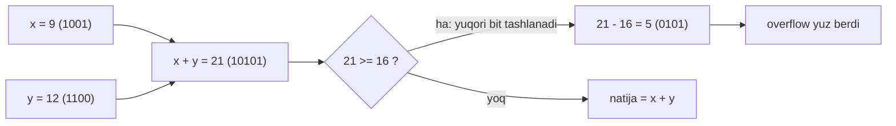
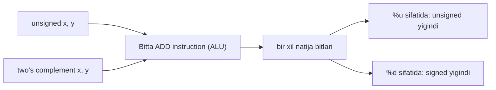
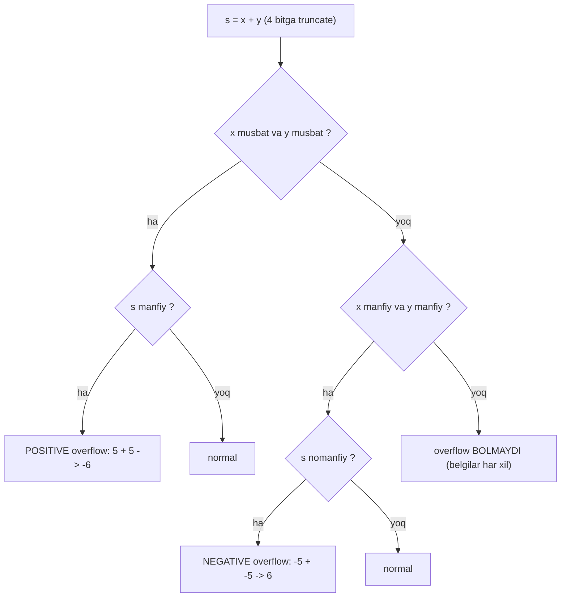

# 04. Integer Arithmetic — overflow, negation va shift-arifmetika

> Manba: CS:APP 2-nashr, 2.3-bo'lim · Muhit: Ubuntu 24.04 x86-64 (Docker), gcc 13.3.0, go 1.22.2 · [← Oldingi](03-integer-representation.md) · [Kurs xaritasi](00-README.md) · [Keyingi →](05-floating-point.md)

## Nima uchun kerak

Ikkita musbat sonni qo'shib **manfiy** natija olish — bu ilm-fantastika emas, production'da har kuni sodir bo'ladi. `int32` counter, `time.Now().UnixNano()` timestamp yoki auto-increment ID sekin-astalik bilan chegaraga yetadi va bir kun `+1` qilinganda to'satdan `TMin`ga ag'darilib tushadi. Bunday incidentlar tarixda raketa portlatgan, samolyot elektr tizimini o'chirgan va YouTube hisoblagichini buzgan (pastda batafsil).

Yana bir xavf tilning o'zidan keladi: C'da signed overflow — **undefined behavior (UB)** (standart "ta'riflanmagan xatti-harakat", ya'ni kompilyator uni "hech qachon bo'lmaydi" deb hisoblab, kodingni jimgina o'zgartirib yoki olib tashlab yuborishi mumkin). Go'da esa overflow aniq belgilangan (wrap), UB yo'q — lekin wrap jimgina sodir bo'ladi, ya'ni xato baribir xato. Bu dars ikkala tilning arifmetikasi ortidagi apparatni va uni xavfsiz ishlatishni ochadi.

## Nazariya

### 1. Kompyuter arifmetikasi = modular arifmetika

Odatdagi matematikada `x + y` cheksiz kattalasha oladi. Kompyuterda esa tip **qat'iy `w` bit** — 4-bit, 32-bit yoki 64-bit. Yig'indi bu chegaradan oshsa, yuqori bit(lar) shunchaki **tushib qoladi**. Natija — soat aylanasi kabi: `w`-bitli arifmetika `mod 2^w` bo'yicha ishlaydi.

Analogiya: 12 soatlik devor soati. Soat 9 da turibsan, 5 soat qo'shsang `14` emas, `2` chiqadi (`14 mod 12 = 2`). "Yuqoridan oshgan" qism yo'qoladi. `w`-bitli integer aynan shunday, faqat modul `12` emas, `2^w`.

### 2. Unsigned addition — mod 2^w

Ikkita nomanfiy `w`-bitli son `x` va `y` ni olaylik. Ularning haqiqiy yig'indisi `w+1` bit talab qilishi mumkin. Kompyuter esa faqat past `w` bit'ni saqlaydi — bu **yuqori bit'ni tashlab yuborish** bilan bir xil, ya'ni `mod 2^w`.

4-bit misol (`w = 4`, `2^w = 16`): `x = 9 = [1001]`, `y = 12 = [1100]`.

```
  [1001]   (9)
+ [1100]   (12)
---------
 [10101]   (21, 5 bit!)
```

Yig'indi `21 = [10101]` — 5 bit. Yuqori bit'ni (`1`) tashlaymiz → `[0101] = 5`. Va haqiqatan `21 mod 16 = 5`. Bit'lar darajasida "high-order bit'ni discard qilish" = "`2^w` ni ayirish".



**Notional machine:** ALU (arithmetic logic unit) 5-bitli yig'indini emas, faqat 4 bitni registrga yozadi. Beshinchi bit (carry-out) registrga sig'maydi va yo'qoladi — hech qanday xato signali chiqmaydi. Dastur bilib ham olmaydi.

### 3. Overflow'ni aniqlash: `s < x`

C dasturda overflow **xato sifatida signal bermaydi**. Lekin ba'zan bilishimiz kerak. Oddiy qoida bor: `s = x + y` (mod 2^w) hisoblangach, **`s < x` bo'lsa overflow yuz bergan**.

Sababi intuitiv: overflow bo'lmasa `x + y >= x` (chunki `y >= 0`), demak `s >= x`. Overflow bo'lsa `s = x + y - 2^w`, `y < 2^w` bo'lgani uchun `y - 2^w < 0`, demak `s < x`.

Bizning misolimizda `9 + 12 = 5` va `5 < 9` → overflow tasdiqlandi. Diqqat: bu qoida **faqat unsigned** uchun ishlaydi va `s` allaqachon hisoblangan bo'lishi kerak.

### 4. Two's complement addition — BIT DARAJASIDA UNSIGNED BILAN BIR XIL

Endi eng nafis g'oya. 03-darsda ko'rdik: two's complement — bu bir xil bit'larning boshqacha talqini. Qo'shishda ham **aynan shu**: `w`-bitli signed yig'indi unsigned yig'indi bilan **bit'ma-bit bir xil**.

> Oltin g'oya: mashinada signed va unsigned qo'shish uchun **BITTA** ADD instruction, **BITTA** ALU ishlatiladi. Bit'lar bir xil chiqadi — faqat siz `%d` yoki `%u` bilan boshqacha o'qiysiz. Bu two's complement'ning eng katta g'alabasi (03-darsdagi asosiy fikrning davomi).



Farq faqat **overflow chegaralarida**. Signed 4-bit diapazoni `[-8, 7]`. Yig'indi bu chegaralardan chiqsa, ikki tur overflow bo'ladi:

- **Positive overflow** — ikki musbat qo'shildi, natija manfiy chiqdi (`x + y >= 2^{w-1}`).
- **Negative overflow** — ikki manfiy qo'shildi, natija nomanfiy chiqdi (`x + y < -2^{w-1}`).

4-bit misollar:

| x | y | x + y (haqiqiy) | signed natija | holat |
| --- | --- | --- | --- | --- |
| 5 `[0101]` | 5 `[0101]` | 10 | `[1010] = -6` | positive overflow |
| -5 `[1011]` | -5 `[1011]` | -10 | `[0110] = 6` | negative overflow |
| -3 `[1101]` | 2 `[0010]` | -1 | `[1111] = -1` | normal |
| 3 `[0011]` | 3 `[0011]` | 6 | `[0110] = 6` | normal |

`5 + 5`: bit'larda `[0101]+[0101]=[1010]`, unsigned bo'lsa `10`, lekin signed talqin `-8+2 = -6`. Bit'lar bir xil, faqat `[1010]` ning ma'nosi tipga bog'liq. Positive overflow: `2^w = 16` ni ayirdi, `10 - 16 = -6`.



Muhim xulosa diagrammadan: **belgilar har xil bo'lsa** (biri musbat, biri manfiy) overflow **hech qachon** bo'lmaydi — chunki natija operandlar orasida yotadi.

### 5. Negation: `-x = ~x + 1` va TMin anomaliyasi

Sonni manfiyga aylantirishning bit-darajali retsepti: **hamma bit'ni teskari qil (`~`), keyin 1 qo'sh**. Ya'ni C'da `-x` va `~x + 1` doim bir xil.

Nega ishlaydi? `~x` — bu `-x - 1` (chunki `x + ~x = -1`, hamma bit `1` = `-1`). Demak `~x + 1 = -x`. 4-bit misol: `x = 5 = [0101]`, `~x = [1010]`, `+1 = [1011] = -5`. To'g'ri.

Lekin bitta **anomaliya** bor. `TMin` (eng kichik manfiy son) ning teskarisi — **o'zi**:

```
x = TMin_4 = -8 = [1000]
~x = [0111] = 7
~x + 1 = [1000] = -8   <- yana o'zi!
```

Sababi: `-(-8) = +8`, lekin `+8` signed 4-bitga (`[-8, 7]`) **sig'maydi**. Shuning uchun `-TMin = TMin`. Bu 03-darsdagi asimmetriyaning (`|TMin| = |TMax| + 1`) bevosita oqibati. Amaliy tuzoq: `abs(TMin)` **manfiy** son qaytaradi (pastda isbot).

### 6. Ko'paytirish: bit darajada signed/unsigned bir xil + truncation

Qo'shishdek, ko'paytirish ham bit darajada signed va unsigned uchun **bir xil**. Ikki `w`-bitli sonning to'liq ko'paytmasi `2w` bit talab qilishi mumkin, lekin C faqat **past `w` bit**ni saqlaydi (truncation), ya'ni `mod 2^w`.

4-bit misol: `5 * 5 = 25`. `25 = [11001]` (5 bit), past 4 bit → `[1001]`. Unsigned talqin `9`, signed talqin `-7` (`9 - 16`). Bit'lar bir xil `[1001]`, faqat o'qish farqli. Mashina yana **bitta** multiply instruction ishlatadi.

### 7. Konstantaga ko'paytirishni kompilyator shift'larga aylantiradi

Multiply instruction sekin (10+ tsikl), shift/add/sub tez (1 tsikl). Shuning uchun kompilyator `x * K` (K — konstanta) ni shift'lar kombinatsiyasiga aylantiradi. Asos: `x << k = x * 2^k`.

`x * 14` ni ikki xil yozish mumkin:

- **Form A** (birlar to'plami: `14 = 2^3 + 2^2 + 2^1`): `(x<<3) + (x<<2) + (x<<1)`.
- **Form B** (`14 = 2^4 - 2^1`): `(x<<4) - (x<<1)` — kamroq amal.

gcc yana ham aqlliroq ishlaydi (pastda haqiqiy assembly'da ko'ramiz): `lea` (load effective address) instruction bilan `x*8`, `sub`, `add` orqali multiply'siz hisoblaydi.

### 8. 2 darajasiga bo'lish: o'ngga shift + manfiy uchun bias

Bo'lish ko'paytirishdan ham sekin (30+ tsikl). `2^k` ga bo'lish — **o'ngga shift**. Lekin bir nozik farq bor:

- **Unsigned yoki musbat signed**: oddiy `x >> k = x / 2^k`. C bo'lishi ham, shift ham nolga tomon yaxlitlaydi. `7 >> 1 = 3`, `7 / 2 = 3`. Mos.
- **Manfiy signed**: arithmetic shift **floor** (pastga) yaxlitlaydi, C bo'lishi esa nolga tomon. `-7 >> 1 = -4` (floor), lekin `-7 / 2 = -3` (nolga tomon). **Farq!**

Tuzatish uchun shift'dan **oldin bias** (`2^k - 1`) qo'shiladi: `(x + (1<<k) - 1) >> k`. Bu manfiy natijani nolga tomon yaxlitlaydi. `(-7 + 1) >> 1 = -6 >> 1 = -3` — endi to'g'ri.

### 9. C: signed overflow = UB, unsigned = aniq mod 2^w

Eng muhim amaliy nuqta. C standarti:

- **Unsigned overflow** — **aniq belgilangan**: doim `mod 2^w`, wrap. Ishonch bilan tayanish mumkin.
- **Signed overflow** — **undefined behavior (UB)**. Standart "bu hech qachon bo'lmaydi" deydi. Kompilyator shu farazga tayanib kodni optimallashtiradi — va agar overflow bo'lsa, natija **butunlay oldindan aytib bo'lmas**. Kompilyator `x + 1 > x` ni "doim rost" deb hisoblab, tekshiruvni butunlay olib tashlashi mumkin.

Bu shunchaki nazariya emas — aynan shu narsa xavfsizlik tekshiruvlarini "o'chirib" real CVE'lar tug'diradi. Keyingi bo'limda buni assembly va real output bilan isbotlaymiz.

## Kod va isbot

### 1-misol: unsigned mod-arifmetika va int8 overflow (`overflow.c`)

```c
#include <stdio.h>
#include <stdint.h>
#include <limits.h>

int main(void)
{
    /* unsigned overflow - aniq belgilangan: mod 2^w */
    unsigned int u = UINT_MAX;
    printf("UINT_MAX + 1     = %u\n", u + 1);

    unsigned int a = 9, b = 12;         /* 4-bit misolning 32-bit versiyasi */
    unsigned int s = a + b;
    printf("overflow tekshiruvi: s < a ? %s\n", (s < a) ? "ha" : "yo'q");

    unsigned int big1 = 3000000000u, big2 = 2000000000u;
    unsigned int bs = big1 + big2;
    printf("3000000000 + 2000000000 = %u (mod 2^32)\n", bs);
    printf("overflow tekshiruvi: bs < big1 ? %s\n", (bs < big1) ? "ha" : "yo'q");

    /* int8_t orqali kichik miqyosda korish (konversiya orqali - aniqlangan) */
    int8_t x = 127;                     /* TMax_8 */
    int8_t y = (int8_t)(x + 1);         /* 128 int'da, int8_t ga sig'maydi */
    printf("int8_t: 127 + 1  = %d\n", y);

    int8_t n1 = -128, n2 = -1;
    printf("int8_t: -128 + -1 = %d (negative overflow)\n", (int8_t)(n1 + n2));
    return 0;
}
```

```text
$ gcc -Og -o overflow overflow.c && ./overflow
UINT_MAX + 1     = 0
overflow tekshiruvi: s < a ? yo'q
3000000000 + 2000000000 = 705032704 (mod 2^32)
overflow tekshiruvi: bs < big1 ? ha
int8_t: 127 + 1  = -128
int8_t: -128 + -1 = 127 (negative overflow)
```

Har satrni ochamiz:

- `UINT_MAX + 1 = 0` — `2^32 - 1` ga `1` qo'shilsa `2^32 = 0 (mod 2^32)`. Unsigned wrap aniq belgilangan.
- `9 + 12`: `21 < 2^32`, overflow yo'q. 32-bitda 21 bemalol sig'adi (bizning 4-bit misolimiz faqat 4 bitda overflow qilardi).
- `3000000000 + 2000000000 = 5000000000`, bu `2^32 = 4294967296` dan katta. `5000000000 - 4294967296 = 705032704`. Bu yerda `s < x` qoidasi ishladi: `705032704 < 3000000000` → **ha**, overflow.
- `int8_t: 127 + 1`: `TMax_8 + 1` positive overflow → `TMin_8 = -128`. Xuddi 4-bitdagi `7 + 1 = -8` kabi, faqat 8-bit miqyosda.
- `int8_t: -128 + -1 = -129`, `[-128, 127]` ga sig'maydi → `+256` → `127`. Negative overflow.

> E'tibor: `int8_t` misolida arifmetika avval `int`da bajarilib, keyin `int8_t` ga **truncation** bo'ladi — bu implementation-defined konversiya, UB **emas**. Shuning uchun bu kod xavfsiz demonstratsiya.

### 2-misol: signed overflow UNDEFINED BEHAVIOR isboti (`ub.c`) — darsning eng kuchli demosi

```c
#include <stdio.h>
#include <limits.h>

int check(int x) { return x + 1 > x; }   /* matematikada doim rost */

int main(void)
{
    printf("check(INT_MAX) = %d\n", check(INT_MAX));
    return 0;
}
```

`check(x)` matematik jihatdan **har doim** `1` qaytarishi kerak — `x + 1` doim `x` dan katta. Lekin `x = INT_MAX` bo'lsa, `x + 1` overflow qiladi va bu C'da UB. Endi turli flag'lar bilan kompilyatsiya qilamiz:

```text
$ gcc -O0 -o ub_O0 ub.c && ./ub_O0
check(INT_MAX) = 1
$ gcc -O2 -o ub_O2 ub.c && ./ub_O2
check(INT_MAX) = 1
$ gcc -O2 -fwrapv -o ub_wrapv ub.c && ./ub_wrapv
check(INT_MAX) = 0
```

Bu uchta satr — butun darsning yuragi. Tahlil qilamiz:

- `-O0` va `-O2` da natija **`1`**. Kompilyator "signed overflow UB, demak hech qachon bo'lmaydi" deb hisoblaydi va `x + 1 > x` ifodani konstanta `1` ga **fold** qiladi — hatto `-O0` da ham (gcc front-end'ining `fold-const` qismi buni har doim qiladi). CPU'da haqiqiy solishtirish umuman bajarilmaydi.
- `-fwrapv` bilan natija **`0`**. Bu flag kompilyatorga "signed overflow'ni wrap semantikasi bilan ishlat" deydi. Endi `INT_MAX + 1` haqiqatan wrap bo'lib `INT_MIN` bo'ladi, `INT_MIN > INT_MAX` esa yolg'on → `0`.

> Xulosa: C'da signed overflow'ga **tayangan kod yozib bo'lmaydi**. Kompilyator uni "bo'lmaydi" deb qabul qilib, kodingni o'zgartiradi yoki tekshiruvingni olib tashlaydi. Aynan shu — `if (len + offset < len)` kabi security tekshiruvlarini "yo'q qilib yuboradigan" real bug manbai.

### 3-misol: negation va TMin anomaliyasi (`negation.c`)

```c
#include <stdio.h>
#include <limits.h>
#include <stdlib.h>

int main(void)
{
    int x = 5;
    printf("-x = %d, ~x + 1 = %d\n", -x, ~x + 1);

    int m = INT_MIN;
    printf("-INT_MIN     = %d (o'zi!)\n", -m);
    printf("abs(INT_MIN) = %d (manfiy abs!)\n", abs(m));
    return 0;
}
```

```text
$ gcc -Og -fwrapv -o negation negation.c && ./negation
-x = -5, ~x + 1 = -5
-INT_MIN     = -2147483648 (o'zi!)
abs(INT_MIN) = -2147483648 (manfiy abs!)
```

- `-x = ~x + 1 = -5` — bit-darajali negation formulasi tasdiqlandi. `~5 + 1 = -5`.
- `-INT_MIN = INT_MIN` — anomaliya 32-bitda ham xuddi 4-bitdagidek. `~0x80000000 = 0x7FFFFFFF`, `+1 = 0x80000000` — o'ziga qaytadi. Chunki `+2147483648` `int`ga sig'maydi.
- `abs(INT_MIN)` **manfiy** qaytaradi! `abs` `-INT_MIN` ni hisoblaydi, u esa yana `INT_MIN`. Bu mashhur tuzoq — `abs` natijasi doim musbat deb ishonib bo'lmaydi.

> Halol ogohlik: `-INT_MIN` aslida signed overflow (UB). Biz uni ko'rsatish uchun `-fwrapv` bilan kompilyatsiya qildik, aks holda kompilyator natijani boshqacha "optimallashtirishi" mumkin edi.

### 4-misol: bo'lish vs shift — yaxlitlash farqi (`divshift.c`)

```c
#include <stdio.h>

int main(void)
{
    printf("7 / 2   = %d,  7 >> 1  = %d\n", 7 / 2, 7 >> 1);
    printf("-7 / 2  = %d, -7 >> 1  = %d  (farq!)\n", -7 / 2, -7 >> 1);
    /* C bo'lish nolga tomon yaxlitlaydi, shift esa pastga (floor) */
    int x = -7;
    int k = 1;
    int biased = (x + (1 << k) - 1) >> k;   /* bias qo'shilsa shift ham nolga tomon */
    printf("bias bilan: (-7 + 1) >> 1 = %d\n", biased);
    return 0;
}
```

```text
$ gcc -Og -o divshift divshift.c && ./divshift
7 / 2   = 3,  7 >> 1  = 3
-7 / 2  = -3, -7 >> 1  = -4  (farq!)
bias bilan: (-7 + 1) >> 1 = -3
```

- Musbat son: `7 / 2` va `7 >> 1` — ikkovi ham `3`. Farq yo'q.
- Manfiy son: `-7 / 2 = -3` (nolga tomon), `-7 >> 1 = -4` (floor). Aynan shu farq tufayli kompilyator manfiy sonlar uchun oddiy shift ishlata **olmaydi**.
- Bias bilan: `(x + 2^k - 1) >> k = (-7 + 1) >> 1 = -6 >> 1 = -3` — endi bo'lish bilan mos. Bias `2^k - 1 = 1`.

### 5-misol: kompilyator ko'paytirishni shift'larga aylantiradi (`mul14.c`, haqiqiy assembly)

```c
long mul14(long x) { return x * 14; }
long div8(long x)  { return x / 8; }
```

```text
$ gcc -Og -S mul14.c    # hosil bo'lgan assembly (muhim qismi):
mul14:
	endbr64
	leaq	0(,%rdi,8), %rax
	subq	%rdi, %rax
	addq	%rax, %rax
	ret
div8:
	endbr64
	leaq	7(%rdi), %rax
	testq	%rdi, %rdi
	cmovns	%rdi, %rax
	sarq	$3, %rax
	ret
```

Assembly sintaksisini hali batafsil o'rganmadik (06-darsda), shuning uchun faqat g'oyani ko'ramiz. Qoida: `%rdi` = kirish argumenti (x), `%rax` = natija.

**`mul14`** — `imul` (multiply instruction) umuman **YO'Q**! gcc buni shunday hisoblaydi:
- `leaq 0(,%rdi,8), %rax` → `%rax = x * 8`,
- `subq %rdi, %rax` → `%rax = 8x - x = 7x`,
- `addq %rax, %rax` → `%rax = 7x + 7x = 14x`.

Ya'ni `x * 14 = (x*8 - x) * 2` — faqat `lea`/`sub`/`add`, chunki ular multiply'dan tezroq.

**`div8`** — bizning bias formulamizning **kompilyator qo'llagan** versiyasi:
- `leaq 7(%rdi), %rax` → `%rax = x + 7` (bias = `2^3 - 1 = 7`!),
- `testq` + `cmovns` → agar `x` **manfiy bo'lmasa**, bias'siz `x`ni ol (musbatga bias kerak emas),
- `sarq $3` → arithmetic shift 3 (`/8`).

Bu bo'limimizdagi `(x<0 ? x+(1<<k)-1 : x) >> k` formulasining aynan o'zi — kompilyator uni avtomatik yozdi.

## Go dasturchiga ko'prik

### 6-misol: Go'da overflow ANIQ BELGILANGAN (`overflow.go`)

```go
package main

import (
	"fmt"
	"math"
)

func main() {
	// Go'da signed overflow ANIQ BELGILANGAN: wrap (mod 2^w)
	var x int64 = math.MaxInt64
	fmt.Printf("MaxInt64 + 1   = %d (wrap, UB emas)\n", x+1)
	fmt.Printf("x+1 > x        = %v (Go halol javob beradi)\n", x+1 > x)

	var i8 int8 = 127
	i8++
	fmt.Printf("int8(127)++    = %d\n", i8)

	// Overflow'ni qo'lda tekshirish - Go standart usuli
	a, b := int64(math.MaxInt64), int64(1)
	if b > 0 && a > math.MaxInt64-b {
		fmt.Println("qo'shishdan OLDIN aniqlandi: overflow bo'ladi")
	}
}
```

```text
$ go run overflow.go
MaxInt64 + 1   = -9223372036854775808 (wrap, UB emas)
x+1 > x        = false (Go halol javob beradi)
int8(127)++    = -128
qo'shishdan OLDIN aniqlandi: overflow bo'ladi
```

Bu yerda C'dan eng katta farq ko'rinadi:

- **Go spec signed overflow'ni wrap deb belgilaydi** — UB **yo'q**. `MaxInt64 + 1` halol wrap qilib `MinInt64`ga o'tadi.
- **Go halol javob beradi.** 2-misolda gcc `x+1 > x` ni `1`ga fold qilgan edi. Go'da `x+1 > x` `MaxInt64` uchun rostakam `false` — chunki kompilyator wrap'ni hisobga oladi, kodni "o'chirmaydi".
- **`int8(127)++ = -128`** — kichik tiplar C'dagidek wrap qiladi.

Lekin muhim ogohlik: **wrap jimgina sodir bo'ladi**. `false` chiqishi to'g'ri, ammo `MaxInt64 + 1` baribir siz kutmagan `MinInt64` — mantiqiy xato. Shuning uchun Go'da ham overflow'ni **oldindan tekshirish** kerak: `a > math.MaxInt64 - b` — bu qo'shishdan **oldin** solishtiradi va hech qachon overflow qilmaydi.

Tekshiruvning uch standart usuli Go'da:

| Usul | Qanday | Qachon |
| --- | --- | --- |
| Oldindan solishtirish | `a > math.MaxInt64 - b` (b>0 uchun) | eng oddiy, hamma joyda |
| `math/bits.Add64` | `sum, carry := bits.Add64(a, b, 0)`; `carry != 0` → overflow | unsigned, carry aniq kerak bo'lsa |
| `math/bits.Mul64` | `hi, lo := bits.Mul64(a, b)`; `hi != 0` → overflow | ko'paytirish overflow'i |
| Katta tipga o'tish | `int32` ni `int64`da hisoblab tekshirish | kichik tiplar uchun |

C vs Go qisqacha:

| | C | Go |
| --- | --- | --- |
| Signed overflow | **UB** (kompilyator kodni o'zgartiradi) | **wrap** (aniq belgilangan) |
| Unsigned overflow | wrap (mod 2^w) | wrap (mod 2^w) |
| `x+1 > x` (MAX da) | `1` (fold qiladi!) | `false` (halol) |
| Xavf | kod jim o'chirilishi | wrap jim sodir bo'lishi |

## Real-world scenariylar

1. **Ariane 5 raketasi (1996) — $370M portlash.** Uchishdan 40 soniya keyin raketa portladi. Sabab: navigatsiya dasturida **64-bit floating-point** son **16-bit signed integer**ga o'girilganda qiymat `32767` dan oshib overflow qildi. Bundan ham achinarlisi — bu kod Ariane 5 uchun umuman kerak emas edi, u eski Ariane 4'dan qolgan legacy modul edi. Bizning darsimizga bog'lanish: bu — truncation (katta tipdan kichikka o'tishda yuqori bit'lar yo'qolishi) va overflow'ning eng qimmat namunasi.

2. **Boeing 787 Dreamliner (2015) — 248 kunlik bomba.** FAA ogohlantirdi: agar samolyot elektr tizimi **248 kun uzluksiz** yoqilgan qolsa, ichki counter `2147483647` (`INT_MAX` 32-bit) ga yetib overflow qiladi va **butun elektr tizimi o'chib qolishi** mumkin. Yechim — vaqti-vaqti bilan qayta yuklash. Bog'lanish: bu — timestamp/uptime counter'ning `TMax`dan oshib `TMin`ga wrap bo'lishi, aynan 1-misoldagi `int8(127)++` ning katta miqyosi.

3. **C'da UB tufayli o'chirilgan security tekshiruvi (CVE naqshi).** Klassik xato: `if (len + offset < len) return ERROR;` — dasturchi overflow'ni shu bilan tekshirmoqchi. Lekin `len` va `offset` signed bo'lsa, `len + offset` overflow'i UB, kompilyator "signed overflow bo'lmaydi, demak `len + offset >= len` doim rost, demak `< len` doim yolg'on" deb butun `if`ni **olib tashlaydi**. Natijada bufer chegara tekshiruvi yo'q bo'lib, buffer overflow (11-darsda) ochiladi. Bog'lanish: aynan 2-misoldagi `check(INT_MAX)` fold demosi, faqat bu safar oqibati — security teshigi.

4. **YouTube "Gangnam Style" counter (2014).** Video ko'rishlar soni `int32` chegarasi `2147483647` ga yaqinlashdi va Google hisoblagichni `int64`ga o'tkazishga majbur bo'ldi. Bog'lanish: sof capacity overflow — yechim "katta tipga o'tish" (6-misoldagi Go usullaridan biri).

## Zamonaviy yondashuv

Web izlanishlar sintezi. Kitob "ehtiyot bo'l" deydi; bugungi ekotizim buni avtomatik himoyaga aylantirdi:

- **UBSan** (`gcc/clang -fsanitize=signed-integer-overflow`) — signed overflow'ni **runtime'da**, ishga tushish paytida topadi va aniq joyini ko'rsatadi. CI'da test bilan birga ishlatiladi.
- **`-fwrapv` va `-ftrapv`** — `-fwrapv` overflow'ni aniq wrap qiladi (UB'ni yo'qotadi, 2-misolda ko'rdik), `-ftrapv` overflow'da dasturni to'xtatadi. Ikkovi ham UB'ning "jim optimizatsiya" xavfini bartaraf etadi.
- **Rust modeli** — `debug` build'da overflow'da **panic**, `release`'da wrap. Aniq API'lar: `checked_add` (`Option` qaytaradi), `wrapping_add` (ataylab wrap), `saturating_add` (chegarada to'xtaydi), `overflowing_add` (natija + bool). Bu C'ning "jimgina UB"siga zid: dasturchi niyatini kod bilan aytadi.
- **Go modeli** — signed overflow wrap (UB yo'q), lekin standart `math/bits.Add64`/`Mul64` carry va hi orqali overflow'ni aniqlash imkonini beradi (6-misol). Xavfsizlik-kritik joyda qo'lda oldindan tekshirish yoki bu funksiyalar ishlatiladi.

Umumiy tendentsiya: yangi tillar (Go, Rust) UB'dan voz kechib, overflow'ni yo aniq wrap, yo aniq tekshiruvli qildi. C/C++'da esa sanitizer'lar va `-fwrapv` — xavfsizlik-kritik kod uchun deyarli majburiy.

## Keng tarqalgan xatolar

- **"signed overflow shunchaki wrap bo'ladi".** C'da **UB**, kompilyator kodni o'zgartirishi mumkin (2-misol). Wrap kafolati faqat unsigned'da, yoki Go/`-fwrapv`da. C signed'da overflow'ga tayanish — bug.

- **Overflow'ni `x + y < x` bilan *signed*'da tekshirish.** Bu tekshiruvning o'zi signed overflow'ni hisoblaydi → **UB**! Kompilyator uni olib tashlaydi (3-real-scenariy). To'g'risi: **oldindan**, overflow'siz solishtir — `if (y > 0 && x > INT_MAX - y)`.

- **`abs()` natijasi doim musbat deb o'ylash.** `abs(INT_MIN) = INT_MIN` (manfiy!) — 3-misolda isbotlandi. `TMin`ning teskarisi o'zi. `abs` natijasiga ishonishdan oldin `TMin`ni tekshir.

- **`-7 / 2` va `-7 >> 1` bir xil deb o'ylash.** Bo'lish nolga tomon (`-3`), arithmetic shift floor (`-4`) — 4-misol. Manfiy sonda shift bilan bo'lish uchun **bias** shart.

- **Aralash `int8`/`int16` arifmetikada implicit `int` promotion'ni unutish.** C'da `int8_t a, b` qo'shilganda avval ikkovi `int`ga ko'tariladi, arifmetika `int`da bo'ladi, keyin natija truncate qilinadi. Shuning uchun oraliq natija kutilmagan chiqishi mumkin — tipni aniq bilib ishla.

## Amaliy mashqlar

**1 (oson).** 4-bit unsigned: `[1010] + [0110]` ni hisobla. Overflow bo'ladimi? `s < x` qoidasi bilan tekshir.

<details>
<summary>Yechim</summary>

`[1010] = 10`, `[0110] = 6`. `10 + 6 = 16 = [10000]` (5 bit). Yuqori bit tashlanadi → `[0000] = 0`. `16 mod 16 = 0`. Overflow **ha**: `s = 0 < 10 = x`.
</details>

**2 (oson).** Xuddi shu bit'lar `[1010] + [0110]` ni **two's complement** talqinda hisobla. Bu holat nima (positive/negative overflow yoki normal)?

<details>
<summary>Yechim</summary>

`[1010] = -6` (signed), `[0110] = 6`. `-6 + 6 = 0 = [0000]`. Belgilar **har xil** (biri manfiy, biri musbat) → overflow **bo'lmaydi**, **normal**. Bit'lar unsigned bilan bir xil (`[0000]`), faqat talqin farqli.
</details>

**3 (oson).** 4-bit two's complement: `6 + 5` ni bit'larda hisobla. Qaysi overflow turi?

<details>
<summary>Yechim</summary>

`6 = [0110]`, `5 = [0101]`. `[0110]+[0101]=[1011]`. `B2T([1011]) = -8+2+1 = -5`. Ikki musbat qo'shildi, natija manfiy → **positive overflow**. Tekshiruv: `11 >= 8 = 2^{w-1}`, `11 - 16 = -5`.
</details>

**4 (o'rta).** `~x + 1` formulasi bilan 4-bit `x = -4 = [1100]` ning negation'ini hisobla. Keyin `x = -8 = [1000]` uchun takrorla.

<details>
<summary>Yechim</summary>

`x = -4 = [1100]`: `~x = [0011] = 3`, `+1 = [0100] = 4`. `-(-4) = 4` — to'g'ri.
`x = -8 = [1000]` (TMin_4): `~x = [0111] = 7`, `+1 = [1000] = -8` — **o'ziga qaytadi!** `-TMin = TMin` anomaliyasi.
</details>

**5 (o'rta).** Kompilyator `x * 20` ni qanday shift/lea kombinatsiyasiga aylantirishi mumkin? Kamida bitta usul top (assembly aniqligi shart emas, g'oya yetarli).

<details>
<summary>Yechim</summary>

`20 = 16 + 4 = 2^4 + 2^2` → **Form A**: `(x<<4) + (x<<2)`.
Yoki `lea` bilan aqlliroq: `5x = (x<<2) + x`, keyin `(5x) << 2 = 20x`. Ya'ni bitta lea (`x*4 + x = 5x`) + bitta shift. gcc odatda shu ikkinchi yo'lni tanlaydi, chunki kamroq amal.
</details>

**6 (o'rta).** `-13 >> 2` (arithmetic shift, 32-bit) nima beradi va `-13 / 4` nima? Farqni bias bilan tuzat.

<details>
<summary>Yechim</summary>

`-13 >> 2 = floor(-13/4) = floor(-3.25) = -4`. `-13 / 4 = -3` (nolga tomon, C). Farq bor.
Bias `2^2 - 1 = 3`: `(-13 + 3) >> 2 = -10 >> 2 = floor(-2.5) = -3` — endi bo'lish bilan mos.
</details>

**7 (qiyin).** Quyidagi C kodni tahlil qil: `int f(int x){ return (x + 100 < x); }`. gcc `-O2` da `f(INT_MAX)` uchun nima qaytaradi va nega? `-fwrapv` bilan-chi?

<details>
<summary>Yechim</summary>

`-O2`: kompilyator "signed overflow UB, demak `x + 100 >= x` doim rost, `< x` doim yolg'on" deb funksiyani `return 0;` ga fold qiladi → doim **`0`**, hatto `INT_MAX` uchun ham. Bu 2-misoldagi `check` demosi bilan bir xil mexanizm — overflow tekshiruvi "o'chiriladi".
`-fwrapv`: overflow wrap qiladi, `INT_MAX + 100` haqiqatan manfiyga o'tadi, `manfiy < INT_MAX` rost → **`1`**. To'g'ri overflow'ni tekshirish uchun oldindan solishtir: `x > INT_MAX - 100`.
</details>

## Cheat sheet

| Tushuncha | Nima | Eslab qolish |
| --- | --- | --- |
| Unsigned add | `mod 2^w` (wrap) | soat aylanasi, `9+12=5` (4-bit) |
| Overflow test (unsigned) | `s < x` bo'lsa overflow | faqat unsigned, `s` hisoblangach |
| Signed = unsigned bit'da | bitta ADD/ALU/multiply | talqin farqi, bit bir xil |
| Positive overflow | 2 musbat → manfiy natija | `x+y >= 2^{w-1}` |
| Negative overflow | 2 manfiy → nomanfiy natija | `x+y < -2^{w-1}` |
| Har xil belgilar | overflow **bo'lmaydi** | natija operandlar orasida |
| Negation | `-x = ~x + 1` | teskari qil + 1 |
| TMin anomaliya | `-TMin = TMin` | `-8 = [1000]` o'ziga qaytadi |
| `abs(TMin)` | **manfiy** qaytaradi | tuzoq, ishonma |
| `x << k` | `x * 2^k` | multiply o'rniga shift |
| `x >> k` (musbat) | `x / 2^k` | oddiy o'ngga shift |
| Manfiy bo'lish bias | `(x + (1<<k) - 1) >> k` | `-7>>1=-4`, tuzatilsa `-3` |
| C signed overflow | **UB** | kompilyator kodni o'chiradi |
| C unsigned overflow | wrap (mod 2^w) | aniq belgilangan |
| Go overflow | wrap, **UB yo'q** | lekin jim, oldindan tekshir |
| Go tekshirish | `a > MAX - b`, `bits.Add64`, `bits.Mul64` | oldindan solishtirish afzal |

## Qo'shimcha manbalar

- [Integer Overflow Basics (GNU Autoconf manual)](https://www.gnu.org/software/autoconf/manual/autoconf-2.63/html_node/Integer-Overflow-Basics.html) — signed overflow UB va kompilyator optimizatsiyasining klassik tushuntirishi.
- [math/bits package (Go)](https://pkg.go.dev/math/bits) — `Add64`, `Mul64` orqali carry/hi bilan overflow aniqlash rasmiy hujjati.
- [Integer overflow (Wikipedia)](https://en.wikipedia.org/wiki/Integer_overflow) — Ariane 5, Boeing 787, Pac-Man va boshqa real incidentlar ro'yxati.
