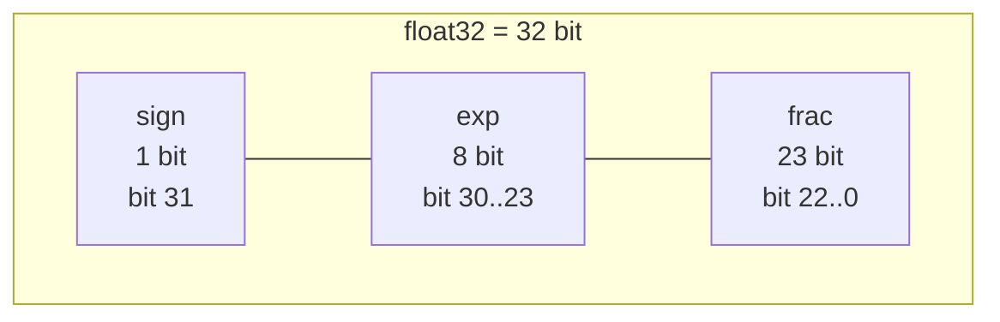
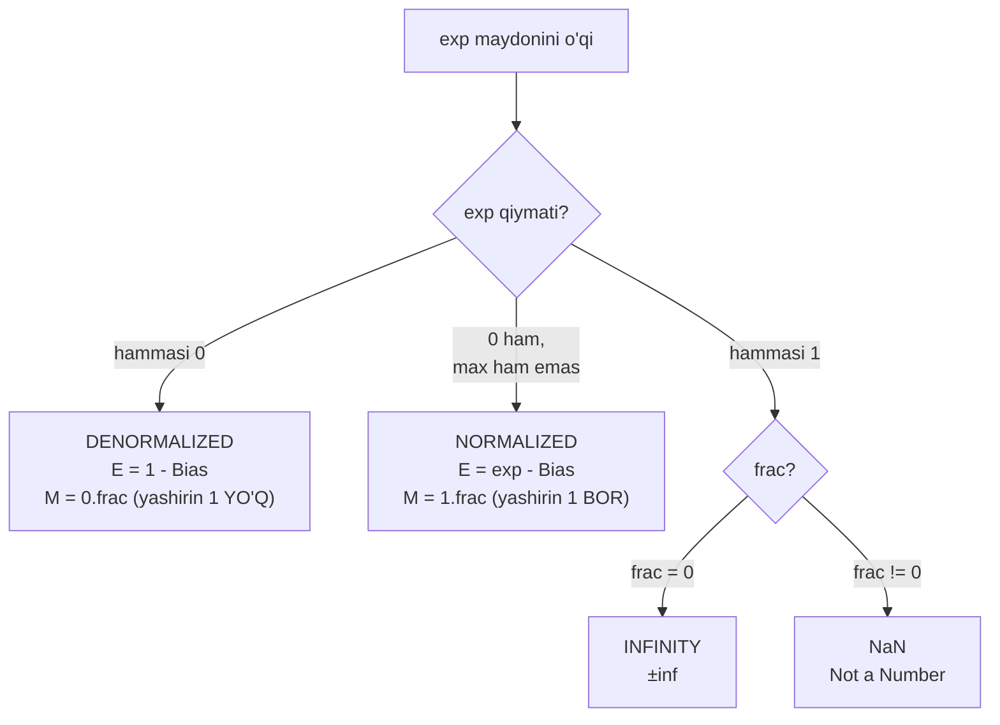
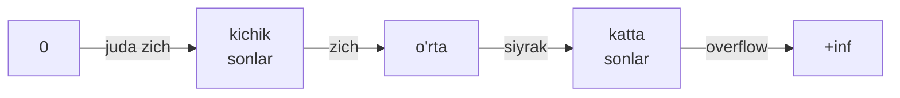

# 05. Floating Point — IEEE 754 va uning tuzoqlari

> Manba: CS:APP 2-nashr, 2.4-bo'lim · Muhit: Ubuntu 24.04 x86-64 (Docker), gcc 13.3.0, go 1.22.2 · [← Oldingi](04-integer-arithmetic.md) · [Kurs xaritasi](00-README.md) · [Keyingi →](06-machine-level-basics.md)

## Nima uchun kerak

Bir bank tizimida har tranzaksiyada `float` bilan tiyin (cent) hisoblansa, mikroskopik yaxlitlash xatolari yig'ilib, oylar davomida million so'm "yo'qoladi" — bu real hodisa, quyida Vancouver birjasini ko'rasan. Backend'da JSON orqali `int64` ID (masalan Twitter tweet ID) `float64` bo'lib o'tsa, aynan buziladi va noto'g'ri obyektni ochib qo'yasan. Monitoring metrikalarida millionlab `float` qiymatini qo'shsang, natija haqiqiy yig'indidan foizlab og'adi.

Va nihoyat, "nega `0.1 + 0.2 != 0.3`?" — bu deyarli har texnik intervyuda so'raladigan savol. Shu darsdan keyin sen javobni yodlab emas, **bit darajasida isbotlab** aytasan.

## Nazariya

### 1. Fractional binary — binary kasrlar

03-darsda butun sonlarni binary'da yozishni ko'rgan eding: har bit chapga qarab `2^i` og'irlikda edi. Kasr qismi ham xuddi shunday, faqat **binary point**dan (nuqta) o'ngga qarab og'irliklar `1/2, 1/4, 1/8, ...` bo'ladi.

Masalan `101.11b` ni o'qiymiz:

```
1*4 + 0*2 + 1*1  .  1*(1/2) + 1*(1/4)  =  5 + 0.75  =  5.75
```

Muhim qoida: binary point'ni bir pozitsiya chapga surish sonni **2 ga bo'ladi**, o'ngga surish **2 ga ko'paytiradi**. Bu bizga keyinroq (normalized formada) kerak bo'ladi.

Ba'zi sonlar `x * 2^y` shaklida **aniq** yoziladi: `0.5 = 0.1b`, `0.25 = 0.01b`, `0.75 = 0.11b`. Lekin `0.1` (o'nlik) ni binary'da aniq yozib **bo'lmaydi**.

> Analogiya: decimal'da `1/3 = 0.3333...` ni cheklangan raqamlar bilan aniq yoza olmaysan. Binary'da `1/10` (ya'ni 0.1) ayni shunday — u davriy (nonterminating) kasr.

Hisoblab ko'raylik: `0.1` ni doim 2 ga ko'paytirib, butun qismini yozib boramiz:

```
0.1 * 2 = 0.2 -> 0
0.2 * 2 = 0.4 -> 0
0.4 * 2 = 0.8 -> 0
0.8 * 2 = 1.6 -> 1  (1.6 -> 0.6)
0.6 * 2 = 1.2 -> 1  (1.2 -> 0.2)
0.2 * 2 = 0.4 -> 0  ... va 0011 bloki abadiy takrorlanadi
```

Natija: `0.1 = 0.0001100110011[0011]...b` — `[0011]` bloki cheksiz takrorlanadi. Kompyuter faqat cheklangan bitni saqlaydi, shuning uchun `0.1` **doim taxminiy** — bu barcha keyingi "sirlar"ning ildizi.

### 2. IEEE 754 formati — V = (-1)^s * M * 2^E

`5 * 2^100` ni to'liq bit bilan yozish (101 va 100 ta nol) samarasiz. Shuning uchun IEEE 754 sonni uch bo'lakka bo'lib saqlaydi:

- **sign** (`s`) — ishora: 0 musbat, 1 manfiy.
- **exponent** (`exp`) — 2 ning darajasi (E), lekin bias bilan siljitilgan.
- **fraction** (`frac`) — significand (M) ning kasr qismi.

Ikki asosiy format:

| Format | C tipi | sign | exp | frac | jami |
| --- | --- | --- | --- | --- | --- |
| single precision | `float` | 1 | 8 | 23 | 32 bit |
| double precision | `double` | 1 | 11 | 52 | 64 bit |

`float32` maydonlari (chapdan o'ngga bit 31 → 0):



### 3. Bias — nega exponent siljitilgan?

`exp` maydoni unsigned (0..255) saqlanadi, lekin bizga manfiy daraja ham kerak (masalan `0.5 = 2^-1`). Yechim: haqiqiy `E = exp - Bias`, bunda **Bias = 2^(k-1) - 1**.

- `float`: Bias = `2^7 - 1 = 127` → E diapazoni -126..+127.
- `double`: Bias = `2^10 - 1 = 1023` → E diapazoni -1022..+1023.

Nega shunday? Chunki bit'larni oddiy unsigned integer sifatida taqqoslaganda, floating-point sonlar to'g'ri tartibda joylashadi — ya'ni float'larni **integer taqqoslash bilan saralash** mumkin (bu apparat uchun juda qulay).

### 4. Uch toifa — exp qiymatiga qarab

`exp` maydonining qiymati sonning qaysi toifaga tegishliligini hal qiladi:



**(1) Normalized** — eng ko'p ishlatiladigan holat. `exp` na hammasi 0, na hammasi 1. Bunda:
- `E = exp - Bias`
- `M = 1 + f`, ya'ni binary'da `1.frac` — bu **yashirin (implied) leading 1**.

Yashirin 1 nima uchun muhim? Normalized formada significand doim `1 <= M < 2` bo'ladi, ya'ni boshida doim `1` turadi. Uni saqlamasak ham bo'ladi — bu **bepul qo'shimcha bit precision**! Shuning uchun `float` da 23 explicit frac bit bo'lsa ham, aslida **24 bit** aniqlik bor.

**(2) Denormalized** — `exp` hammasi 0. Bunda:
- `E = 1 - Bias` (oddiy `-Bias` emas — bu denormal'dan normal'ga silliq o'tishni ta'minlaydi)
- `M = f`, ya'ni `0.frac` — yashirin 1 **yo'q**.

Vazifasi ikkita. Birinchi: **0 ni ifodalash**. Normalized'da M >= 1 bo'lgani uchun 0 ni yoza olmaysan; denormal esa hamma bit 0 bo'lganda `+0.0` beradi. Sign biti 1 bo'lsa `-0.0` — ha, IEEE'da ikkita nol bor! Ikkinchi: **gradual underflow** — nolga silliq, teng qadamlar bilan yaqinlashish (birdan 0 ga "sakramaydi").

**(3) Special** — `exp` hammasi 1. Bunda:
- `frac = 0` → **infinity** (`+inf` yoki `-inf`). Overflow yoki 0 ga bo'lishda chiqadi.
- `frac != 0` → **NaN** ("Not a Number"). `sqrt(-1)` yoki `inf - inf` kabi ma'nosiz natijalarda chiqadi.

### 5. Sonlar zichligi — 0 atrofida zich, uzoqda siyrak

Floating-point sonlar son o'qida **teng tarqalmagan**. `2^E` og'irlik kattalashgan sari qo'shni sonlar orasidagi masofa ham kattalashadi:



Amaliy oqibat: `1e20 + 1` da `1` shunchalik kichikki, u `1e20` ning qadam masofasidan ham kichik — natijada `1` butunlay **yutiladi** va `1e20 + 1 == 1e20` bo'ladi. Buni quyida kod bilan ko'rasan.

### 6. Rounding — yaxlitlash rejimlari

Son formatga aniq sig'masa, uni eng yaqin ifodalanadigan qiymatga **yaxlitlash** kerak. IEEE 4 rejim beradi, default: **round-to-even** (round-to-nearest).

Ikki variant orasidagi aniq o'rtada turgan qiymat (masalan `2.5`) qayerga yaxlitlanadi? Round-to-even: **eng kichik raqami juft** bo'ladigan tomonga. Shuning uchun `2.5 -> 2`, `3.5 -> 4`. Nega juft? Chunki hamma vaqt yuqoriga yaxlitlasak, ko'p qiymat o'rtachasi asta-sekin **yuqoriga siljiydi** (statistik bias). Juftga yaxlitlash taxminan 50% yuqoriga, 50% pastga borib bu og'ishni yo'q qiladi.

### 7. Amallar xossalari — nima buziladi

`x +f y` ni `Round(x + y)` deb belgilaymiz (haqiqiy amal, keyin yaxlitlash). Real sonlardan farqli xossalar:

| Xossa | Integer (03/04-dars) | Floating-point |
| --- | --- | --- |
| Kommutativ (`a+b = b+a`) | HA | HA |
| Assotsiativ (`(a+b)+c = a+(b+c)`) | HA | **YO'Q** |
| Distributiv (`a*(b+c) = a*b+a*c`) | HA | **YO'Q** |
| Monotonlik (`a>=b => x+a>=x+b`) | YO'Q | **HA** |
| Overflow'da | wraparound | `inf` (crash emas) |

Assotsiativlik yo'qligi eng muhim oqibat: kompilyator `a+b+c` ni erkin qayta guruhlashtira **olmaydi**, chunki natija o'zgarishi mumkin. Bu 04-darsdagi integer optimizatsiyalari (masalan `7*x -> (x<<3)-x`) float'da ishlamasligini bildiradi. Optimizatsiya darsida (13-darsda) buni yana ko'ramiz.

Yana bir farq integer'dan: float **abort qilmaydi**. 0 ga bo'lish crash emas — `inf` qaytadi; ma'nosiz amal `NaN` beradi va dastur davom etadi.

## Kod va isbot

### fbits.c — IEEE 754 maydonlarini ajratamiz

Bu dastur `float` ning xotiradagi 32 bitini olib, sign/exp/frac maydonlariga ajratadi. Diqqat: bitlarni olishning **to'g'ri usuli** — `memcpy` (type punning), pointer cast orqali `*(uint32_t*)&f` qilish undefined behavior bo'lishi mumkin.

```c
void show_float(float f)
{
    uint32_t bits;
    memcpy(&bits, &f, sizeof(bits));          /* type punning'ning to'g'ri usuli */
    uint32_t sign = bits >> 31;
    uint32_t exp  = (bits >> 23) & 0xFF;      /* 8 bit exp'ni ajratamiz */
    uint32_t frac = bits & 0x7FFFFF;          /* pastki 23 bit frac */
    printf("%12g = 0x%08x  sign=%u exp=%3u(bias-127=%4d) frac=0x%06x\n",
           f, bits, sign, exp, (int)exp - 127, frac);
}
```

Output:

```
           1 = 0x3f800000  sign=0 exp=127(bias-127=   0) frac=0x000000
         0.5 = 0x3f000000  sign=0 exp=126(bias-127=  -1) frac=0x000000
           2 = 0x40000000  sign=0 exp=128(bias-127=   1) frac=0x000000
    -0.15625 = 0xbe200000  sign=1 exp=124(bias-127=  -3) frac=0x200000
        3.14 = 0x4048f5c3  sign=0 exp=128(bias-127=   1) frac=0x48f5c3
```

Har qiymatni **qo'lda tekshiramiz** — bu formulani ichiga singdirishning eng yaxshi yo'li:

- **1.0** = `1.0 * 2^0`. Normalized: M=1.0 (`1.000...b`), frac=0. E=0 → exp = 0+127 = **127** = 0x7F. sign=0. Natija `0x3f800000`. Mana shu — 1.0 ning bit shakli, uni yodlab qo'ysang qulay: 0x3f800000.
- **0.5** = `1.0 * 2^-1`. E=-1 → exp = 126. frac=0 → `0x3f000000`.
- **2.0** = `1.0 * 2^1`. E=1 → exp = 128 → `0x40000000`.
- **-0.15625**: `0.15625 = 5/32 = 0.00101b`. Normalize: `1.01b * 2^-3`. E=-3 → exp = 124. sign=1. frac = kasr qismi `.01` ni 23 bit'ga cho'zamiz → yuqori ikki bit `01`, ya'ni bit 21 yoqilgan = `0x200000`. Yig'sak: `0x80000000 | (124<<23) | 0x200000 = 0xbe200000`. To'g'ri!
- **3.14**: `1.57 * 2^1`, exp=128, frac=0x48f5c3 — bu `0.57` ning eng yaqin 23-bit yaqinlashuvi (3.14 ham aniq ifodalanmaydi).

**02-dars bilan ko'prik:** `3.14` ning baytlari `c3 f5 48 40` — bu aynan 02-darsdagi `show_bytes` da little-endian tartibda ko'rgan baytlar. Ularni katta-endian o'qisak `0x4048f5c3` chiqadi. Ya'ni bugungi `fbits` va o'shandagi `show_bytes` bir xil narsaning ikki ko'rinishi.

### classic.c — 0.1 + 0.2 va yig'ilish xatolari

```c
printf("0.1 + 0.2 == 0.3 ? %s\n", (0.1 + 0.2 == 0.3) ? "ha" : "YO'Q");
printf("1e20 + 1 == 1e20 ? %s\n", (1e20 + 1 == 1e20) ? "ha" : "yo'q");

float sum = 0.0f;
for (int i = 0; i < 10000000; i++)
    sum += 0.1f;                     /* 10 mln marta 0.1f qo'shamiz */
printf("0.1f ni 10 mln marta yig'ish = %f (kutilgan 1000000)\n", sum);
```

Output:

```
0.1 + 0.2 == 0.3 ? YO'Q
0.1 + 0.2         = 0.30000000000000004
0.3               = 0.29999999999999999
1e20 + 1 == 1e20 ? ha
0.1f ni 10 mln marta yig'ish = 1087937.000000 (kutilgan 1000000)
```

`0.1` va `0.2` ikkalasi ham davriy binary kasr — har biri saqlanganda ozgina yaxlitlanadi. Ularni qo'shsak, xatolar `0.30000000000000004` beradi, `0.3` ning o'zi esa `0.29999999999999999` — ikkalasi teng emas.

10 mln marta `0.1f` qo'shganda kutilgan `1000000`, lekin `1087937` chiqdi — **8.8% xato!** Sabab: `sum` kattalashgan sari uning qadam masofasi o'sadi, va qo'shilayotgan `0.1f` ning bir qismi (ba'zan hammasi) yutiladi. `1e20 + 1 == 1e20` xuddi shu hodisaning ekstremal ko'rinishi.

### assoc.c — assotsiativlik buzilgani

```c
printf("float : (3.14f + 1e10f) - 1e10f = %f\n", (3.14f + 1e10f) - 1e10f);
printf("float : 3.14f + (1e10f - 1e10f) = %f\n", 3.14f + (1e10f - 1e10f));
```

Output:

```
float : (3.14f + 1e10f) - 1e10f = 0.000000
float : 3.14f + (1e10f - 1e10f) = 3.140000
double: (3.14 + 1e17) - 1e17   = 0.00000
double: 3.14 + (1e17 - 1e17)   = 3.14000
```

Faqat **qavs joyi** o'zgardi, natija esa `0` va `3.14` — butunlay boshqa! Birinchi holatda `3.14f` avval `1e10f` yoniga qo'shiladi, u yerda 24-bit precision `3.14` ni butunlay yutadi; keyin `1e10f` ni ayirsak `0` qoladi. Ikkinchida qavs ichida `1e10f - 1e10f = 0`, keyin `3.14` saqlanadi. Shuning uchun kompilyator float ifodalarni erkin qayta joylashtira olmaydi (13-darsda optimizatsiya to'sig'i sifatida ko'ramiz).

### special.c — inf va NaN

```c
double pinf = 1.0 / 0.0;
double nan_ = 0.0 / 0.0;
printf("1.0/0.0   = %f\n", pinf);
printf("0.0/0.0   = %f\n", nan_);
printf("nan == nan ? %s (NaN o'ziga teng emas!)\n", (nan_ == nan_) ? "ha" : "yo'q");
```

Output:

```
1.0/0.0   = inf
-1.0/0.0  = -inf
0.0/0.0   = nan
nan == nan ? yo'q (NaN o'ziga teng emas!)
1e308 * 10 = inf (overflow -> inf)
inf - inf  = nan
```

Integer'da `1/0` — SIGFPE crash edi (04-dars). Float'da esa **crash yo'q**: `1.0/0.0 = inf`. Bu apparatga o'rnatilgan xossa. Eng g'alati fakt: `NaN == NaN` **false**! NaN o'ziga ham teng emas. Bu bug emas — aksincha, `x != x` testi NaN'ni aniqlashning standart usuli.

### intfloat.c — precision chegaralari va round-to-even

```c
int big = 16777217;                 /* 2^24 + 1 */
float f = (float)big;
printf("int 16777217 -> float -> int = %d (yo'qoldi!)\n", (int)f);

long big2 = 9007199254740993L;      /* 2^53 + 1 */
double d = (double)big2;
printf("long 2^53+1  -> double -> long = %ld (yo'qoldi!)\n", (long)d);
printf("rint(2.5) = %.0f, rint(3.5) = %.0f (round-to-even)\n",
       __builtin_rint(2.5), __builtin_rint(3.5));
```

Output:

```
int 16777217 -> float -> int = 16777216 (yo'qoldi!)
float'da 2^24 dan keyin har butun son ifodalanmaydi
long 2^53+1  -> double -> long = 9007199254740992 (yo'qoldi!)
rint(2.5) = 2, rint(3.5) = 4 (round-to-even)
```

`float` significand'i 24 bit (23 + yashirin 1). `2^24` sig'adi (mantissa toza), lekin `2^24 + 1` ga eng kichik `+1` bitini qo'shish uchun 24-chi frac bit kerak — u yo'q. Round-to-even esa juftga (`2^24` ga) yaxlitlaydi, natijada `+1` **yo'qoladi**. `double` da xuddi shu chegara `2^53`. Ana shuning uchun katta `int64` ID'lar `float64` orqali o'tsa buziladi. `rint` chizig'i round-to-even'ni tasdiqlaydi: `2.5 -> 2` (juft), `3.5 -> 4` (juft).

## Go dasturchiga ko'prik

### Konstanta vs o'zgaruvchi — Go'ga xos "surpriz"

Go'da eng chalg'itadigan xatti-harakat: **konstanta** arifmetikasi va **o'zgaruvchi** arifmetikasi bir xil emas.

```go
// KONSTANTALAR: Go compile-time'da cheksiz (untyped) aniqlikda hisoblaydi
fmt.Println("konstanta: 0.1 + 0.2 == 0.3 ?", 0.1+0.2 == 0.3) // true!

// O'ZGARUVCHILAR: runtime'da IEEE 754 float64 - C bilan bir xil
a, b, c := 0.1, 0.2, 0.3
fmt.Println("o'zgaruvchi: a + b == c ?", a+b == c) // false!
fmt.Printf("a + b = %.17f\n", a+b)

// To'g'ri taqqoslash - epsilon bilan
fmt.Println("epsilon bilan:", math.Abs((a+b)-c) < 1e-9)
```

Output:

```
konstanta: 0.1 + 0.2 == 0.3 ? true
o'zgaruvchi: a + b == c ? false
a + b = 0.30000000000000004
epsilon bilan: true
```

Nega bunday? Go spetsifikatsiyasiga ko'ra, **untyped constant** ifodalari compile-time'da kamida **256 bit** aniqlikda hisoblanadi. Shuning uchun `0.1+0.2 == 0.3` konstanta ifodasi `true`. Lekin qiymatni o'zgaruvchiga (`a, b, c`) tushirsang, u IEEE 754 `float64` bo'ladi va C bilan aynan bir xil `false` beradi. Bu C'da yo'q, Go'ga xos jihat — intervyuda tuzoq bo'lib chiqishi mumkin.

To'g'ri taqqoslash: hech qachon `==` emas, **epsilon** bilan `math.Abs(a-b) < eps`.

### Bit'lar va NaN — standart kutubxona

C'dagi `memcpy` punning'ning Go ekvivalenti — `math.Float32bits` / `math.Float64bits`:

```go
fmt.Printf("Float32bits(3.14) = 0x%08x\n", math.Float32bits(3.14))
fmt.Printf("Float64bits(0.1)  = 0x%016x\n", math.Float64bits(0.1))
fmt.Println("math.NaN() == math.NaN() ?", math.NaN() == math.NaN())
fmt.Println("IsNaN to'g'ri usul:", math.IsNaN(math.NaN()))
```

Output:

```
Float32bits(3.14) = 0x4048f5c3
Float64bits(0.1)  = 0x3fb999999999999a
math.NaN() == math.NaN() ? false
IsNaN to'g'ri usul: true
```

`Float32bits(3.14) = 0x4048f5c3` — C'dagi `fbits.c` natijasi bilan **aynan bir xil**. IEEE 754 universal: til farqi yo'q, apparat bir. `0.1` ning double bit'lari `0x3fb999999999999a` — takrorlanuvchi `9...9a` binary davriy kasrning bevosita izidir. NaN'ni tekshirishning to'g'ri usuli — `==` emas, `math.IsNaN`.

### Pul uchun oltin qoida

> Pulni hech qachon `float` da saqlama. Butun tiyin/cent'ni `int64` da sakla, yoki decimal kutubxona ishlat.

- Eng oddiy: `int64` da tiyin (`$28.67 -> 2867`). Butun son arifmetikasi aniq (04-dars).
- Katta loyihalarda: `github.com/shopspring/decimal` yoki `github.com/govalues/money` — fixed-point decimal, banker's rounding, precision yo'qolmaydi.
- Bazada: `NUMERIC`/`DECIMAL` tip (`FLOAT`/`DOUBLE` emas).

## Real-world scenariylar

**1) Patriot missile, 1991 (Dhahran).** Patriot tizimi ichki soatni har 0.1 soniyada oshadigan counter sifatida saqlagan. Vaqtni sekundga aylantirish uchun uni `0.1` ning 24-bitli binary yaqinlashuviga ko'paytirgan — lekin `0.1` davriy kasr (yuqorida ko'rdik!). 100 soatlik uzluksiz ishdan keyin xato ~0.34 sekundgacha to'plangan. Scud raketasi 2000 m/s tezlikda uchgani uchun bu ~500+ metr xato bo'lgan — Patriot Scud'ni ushlay olmagan, 28 harbiy halok bo'lgan. Bu bevosita `classic.c` dagi "yig'ilish xatosi" hodisasi, hayotiy narxda.

**2) Vancouver Stock Exchange, 1982.** Indeks 1000.000 dan boshlangan. Har o'zgarishda uch kasr xonagacha **truncate** (yaxlitlash emas, kesish) qilingan. 22 oyda indeks 524.881 gacha "tushgan", haqiqiy qiymat ~1009 bo'lishi kerak edi. Xato tuzatilgach, indeks bir kechada 1098 ga sakragan. Bu bir tranzaksiyadagi kichik xatoning millionlab operatsiyada qanday to'planishini ko'rsatadi — pul uchun `float` ishlatmaslik qoidamizning tarixiy isboti.

**3) JSON / JavaScript va int64 ID.** JavaScript'da hamma son `float64` (`double`). `2^53` dan katta `int64` ID JSON orqali o'tsa, `intfloat.c` dagidek buziladi — oxirgi raqamlar o'zgaradi. Twitter API aynan shu sabab har obyektga `id` (raqam) yonida `id_str` (satr) qo'shishga majbur bo'lgan. Go backend JSON qaytarganda katta ID'larni **string** sifatida bering.

## Zamonaviy yondashuv

- **IEEE 754-2019** — standartning eng so'nggi reviziyasi; FMA va decimal formatlarni rasmiylashtiradi.
- **float16 / bfloat16** — ML/AI dunyosida (GPU tensor core). Kam precision, lekin ko'p sonni tez qayta ishlash uchun yetarli; bfloat16 float32 bilan bir xil exponent diapazonini saqlaydi.
- **FMA (fused multiply-add)** — `a*b + c` ni bitta amalda, oraliq yaxlitlashsiz hisoblaydi; aniqroq va tezroq.
- **`-ffast-math` xavfi** — bu gcc/clang flagi assotsiativlik va boshqa "buzilgan" xossalarni yoqib yuboradi. Kod tezlashadi, lekin `assoc.c` dagi natija o'zgarishi mumkin — moliya/ilmiy kodda ehtiyot bo'l.
- **decimal floating point (IEEE 754 decimal128)** — moliya uchun mo'ljallangan, decimal kasrlarni aniq saqlaydi.
- Go, Rust, Python, Java — hammasi asosiy tip sifatida IEEE 754 binary64 (`float64`/`double`) ishlatadi. Ya'ni bu dars bilimlari tildan qat'i nazar amal qiladi.

## Keng tarqalgan xatolar

1. **Float'ni `==` bilan taqqoslash.** `a == b` deyarli har doim noto'g'ri — yaxlitlash xatolari bor. To'g'ri: `math.Abs(a-b) < eps` (mos epsilon tanlab).
2. **Pul hisobida `float`.** Tiyin/cent'ni `int64` da yoki decimal kutubxonada sakla. `0.1 + 0.2` misolini eslab qol — pulda bu million yo'qotishga aylanadi.
3. **"double aniqroq, xato yo'q" degan tasavvur.** `double` da ham xato **bor**, faqat kichikroq (`2^53` chegara). Aniqlik oshadi, lekin "aniq" bo'lmaydi.
4. **Katta va kichik sonni qo'shishda yutilish.** `1e20 + 1 == 1e20`. Ko'p sonni qo'shsang, tartib muhim (kichiklarni avval qo'sh) yoki **Kahan summation** algoritmini ishlat — u yo'qotilgan bitlarni kompensatsiya qiladi.
5. **NaN'ni `x == NaN` bilan tekshirish.** Bu doim `false`. To'g'ri: `math.IsNaN(x)` yoki `x != x`.

## Amaliy mashqlar

Yechishdan oldin o'zing hisoblab ko'r, keyin oching.

**1. 0.75f ning IEEE bit shaklini qo'lda topib chiq.**

<details>
<summary>Yechim</summary>

`0.75 = 3/4 = 0.11b`. Normalize: `1.1b * 2^-1`. E=-1 → exp = 126 = 0x7E. sign=0. frac = kasr qismi `.1` → bit 22 yoqilgan = `0x400000`. Yig'sak: `(126<<23) | 0x400000 = 0x3f400000`. Ya'ni `0.75f = 0x3f400000`.
</details>

**2. `-2.5f` ning bitlarini top.**

<details>
<summary>Yechim</summary>

`2.5 = 10.1b = 1.01b * 2^1`. E=1 → exp = 128 = 0x80. sign=1 (manfiy). frac = `.01` → bit 21 = `0x200000`. Yig'sak: `0x80000000 | (128<<23) | 0x200000 = 0xc0200000`.
</details>

**3. `fbits` outputidan qiymatni tikla:** `0x40000000` (sign=0, exp=128, frac=0) qaysi songa mos?

<details>
<summary>Yechim</summary>

exp=128 → E = 128-127 = 1. frac=0 → M = 1.0 (yashirin 1). Qiymat = `1.0 * 2^1 = 2.0`. Bu `fbits` chiqishidagi `2.0` qatoriga to'g'ri keladi.
</details>

**4. Bashorat: bu ifodalar Go'da `true` yoki `false`?**
(a) konstanta `0.5 + 0.25 == 0.75`
(b) o'zgaruvchi `a := 1e16; a+1 == a`

<details>
<summary>Yechim</summary>

(a) **true** — `0.5`, `0.25`, `0.75` hammasi `x*2^y` shaklida aniq ifodalanadi, yaxlitlash yo'q.
(b) **true** — `1e16 > 2^53` (~9e15), shu darajada `+1` ning qadam masofasi 1 dan katta, `1` yutiladi. `intfloat.c` mantig'i.
</details>

**5. Nega `16777217` (`2^24+1`) `float` da yo'qoladi, lekin `16777216` (`2^24`) yo'qolmaydi?**

<details>
<summary>Yechim</summary>

`2^24 = 1.000...0b * 2^24` — mantissa toza nol, 24 bit ichida sig'adi. `2^24 + 1` esa eng past `2^0` bitini qo'shishni talab qiladi — bu leading 1 dan 24 pozitsiya past, lekin frac faqat 23 bit. Sig'maydi → round-to-even juftga (`2^24`) yaxlitlaydi, `+1` yo'qoladi.
</details>

**6. `special.c` da `inf - inf` nega `nan` beradi?**

<details>
<summary>Yechim</summary>

`inf - inf` matematik jihatdan aniqlanmagan (ma'nosiz) — natija ne real son, ne inf. IEEE bunday holatlarda `NaN` qaytaradi. Xuddi `0.0/0.0` va `sqrt(-1)` kabi.
</details>

**7. Bank kodida balans `float64` da. Nima xato bo'ladi va qanday tuzatasan?**

<details>
<summary>Yechim</summary>

Har qo'shish/ayirishda yaxlitlash xatosi to'planadi (Vancouver birjasi kabi), oxir-oqibat balans tiyinlarda og'adi va audit mos kelmaydi. Tuzatish: balansni `int64` da tiyin sifatida sakla (`$10.50 -> 1050`), yoki `shopspring/decimal` / `govalues/money` ishlat; bazada `NUMERIC`.
</details>

## Cheat sheet

| Tushuncha | Nima | Eslab qolish |
| --- | --- | --- |
| Formula | `V = (-1)^s * M * 2^E` | sign, significand, exponent |
| float layout | 1 + 8 + 23 = 32 bit | precision ~7 o'nlik raqam |
| double layout | 1 + 11 + 52 = 64 bit | precision ~15-16 raqam |
| Bias | `2^(k-1)-1`: float 127, double 1023 | `E = exp - Bias` |
| Yashirin 1 | normalized'da `M = 1.frac` | bepul +1 bit precision |
| Normalized | exp na 0, na max | eng ko'p holat |
| Denormalized | exp = 0, `M = 0.frac` | 0 va gradual underflow |
| Special | exp = max; frac=0 → inf, !=0 → NaN | crash yo'q, davom etadi |
| Precision chegara | float `2^24`, double `2^53` | undan katta int buziladi |
| Round default | round-to-even | 2.5→2, 3.5→4 |
| Amallar | kommutativ HA, assotsiativ/distributiv YO'Q | kompilyator qayta guruhlay olmaydi |
| Taqqoslash | `==` YO'Q, epsilon | `abs(a-b) < eps` |
| NaN test | `math.IsNaN` yoki `x != x` | `NaN == NaN` doim false |
| Pul | `int64` cent yoki decimal | float ISHLATMA |

## Qo'shimcha manbalar

- [What Every Computer Scientist Should Know About Floating-Point (Goldberg)](https://docs.oracle.com/cd/E19957-01/806-3568/ncg_goldberg.html) — klassik, chuqur manba.
- [0.30000000000000004.com](https://0.30000000000000004.com/) — turli tillarda `0.1 + 0.2` natijasi va qisqa tushuntirish.
- [Python docs: Floating-Point Arithmetic Issues and Limitations](https://docs.python.org/3/tutorial/floatingpoint.html) — sodda va amaliy kirish.
- [github.com/govalues/money](https://pkg.go.dev/github.com/govalues/money) — Go'da pulni to'g'ri saqlash uchun kutubxona.
