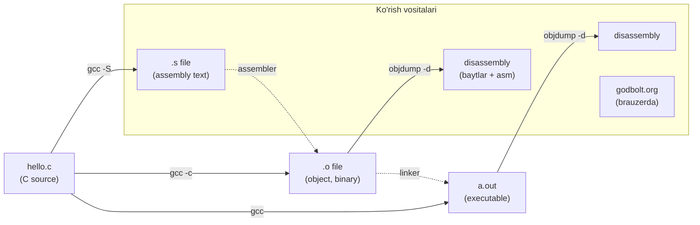
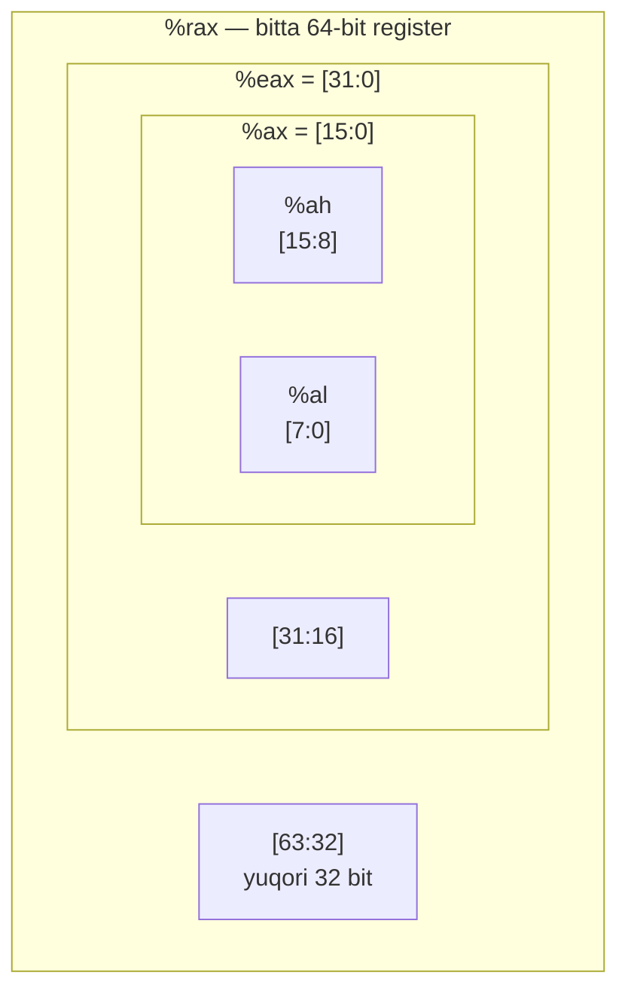

# 06. Machine-Level Basics — registerlar, operandlar va mov

> Manba: CS:APP 2-nashr, 3.1-3.4, 3.13 (x86-64 ga moslashtirilgan) · Muhit: Ubuntu 24.04 x86-64 (Docker), gcc 13.3.0, go 1.22.2 · [← Oldingi](05-floating-point.md) · [Kurs xaritasi](00-README.md) · [Keyingi →](07-data-movement-arithmetic.md)

## Nima uchun kerak

Sen Go backend yozasan, assembly emas. Unda nega bu dars? Chunki `go tool pprof` seni hot funksiyaga olib borganda, `disasm` buyrug'i sen hech ilgari ko'rmagan `MOVQ`, `LEAQ`, `CMPQ` qatorlarini chiqaradi — va aynan o'sha qatorlarda sekinlik yashiringan bo'ladi.

Panic bo'lganda stack trace ostidagi `0x000000000045abcd` — bu register va instruksiya address'i. Crash dump'da `RIP`, `RAX` qiymatlari turadi. Bularni o'qiy olmasang, muammoning yarmi ko'zdan yashirin qoladi.

Va eng muhimi: "kompilyator mening kodimni nimaga aylantirdi?" degan savol. `godbolt.org` da C yoki Go kodni yozib, natijaviy assembly'ni real vaqtda ko'rish — bu performance intuitsiyasini o'stiradi.

> Assembly **yozish** shart emas. Assembly **o'qish** — bu superkuch. Bu dars seni yozuvchi emas, o'qiydigan qiluvchi darsdir.

## Nazariya

### Nega machine-level'ga tushamiz

Yuqori darajali til (C, Go) senga qulay abstraksiya beradi: o'zgaruvchi, tip, funksiya. Lekin protsessor bularni bilmaydi — u faqat baytlar ketma-ketligini bajaradi. Machine-level'ni o'rganish quyidagilarni ochadi:

- **Performance** — kompilyator kodni qanday optimallashtirgani (yoki optimallashtira olmagani) faqat assembly'da ko'rinadi.
- **Ishonch, lekin tekshirish** — kompilyatorga ishonasan, ammo shubhali joyda `-S` bilan tekshira olasan.
- **Debugging** — GDB, crash dump, stack trace hammasi register va address tilida gapiradi.
- **Security** — buffer overflow, ROP kabi hujumlar aynan machine-level'da yashaydi (11-darsda ko'ramiz).

### ISA — hardware bilan software o'rtasidagi shartnoma

**ISA** (Instruction Set Architecture — instruksiyalar to'plami arxitekturasi) — bu protsessor va dastur o'rtasidagi rasmiy shartnoma. U uchta narsani belgilaydi: protsessor holati (registerlar, flag'lar), instruksiyalar formati, va har bir instruksiya bu holatga qanday ta'sir qilishi.

Bu tushunchani (01-darsda) abstraksiya qatlamlari sifatida ko'rgan eding: gcc pipeline C kodni bosqichma-bosqich mashina kodiga aylantiradi. ISA — o'sha pipeline'ning oxirgi manzili uchun til.

Muhim jihat: ISA dastur xatti-harakatini "har instruksiya birma-bir, ketma-ket bajariladi" deb ta'riflaydi. Aslida protsessor o'nlab instruksiyani parallel bajaradi (12-darsda pipeline), lekin natija xuddi ketma-ket bajarilgandek chiqishini kafolatlaydi. Bu — abstraksiyaning kuchi.

### IA32 -> x86-64: juda qisqa tarix

Kitob (CS:APP 2-nashr) asosan **IA32** (Intel Architecture 32-bit, 8 ta 32-bit register) ni o'rgatadi. Biz esa **x86-64** ni default qilamiz. Tarix qisqa: 2003-yilda AMD IA32 ni 64 bitga kengaytirdi (dastlab AMD64, keyin Intel EM64T/Intel64 nomi bilan), va bugungi barcha server, desktop, laptop shu arxitekturada ishlaydi. 32-bitli mashina taxminan 4 GB (2^32 bayt) xotira ko'ra oladi; 64-bitli mashina esa amalda 256 TB gacha.

Biz kitobdan faqat **g'oyalar va mental modellar** ni olamiz. Barcha assembly — x86-64.

### Assembly'ni ko'rishning uch yo'li

Bir C fayldan mashina kodiga yo'l bir nechta bosqichdan o'tadi, va har bosqichni alohida tool bilan ko'rish mumkin:



- **`gcc -S file.c`** -> `file.s`: kompilyator hosil qilgan assembly matni (o'qiydigan format).
- **`gcc -c file.c`** -> `file.o`: object code (binary; global address'lar hali to'ldirilmagan — bu 19-darsda linking).
- **`objdump -d file.o`**: object yoki executable'dan assembly'ni qayta tiklaydi (disassemble), baytlar bilan birga.
- **`godbolt.org`**: brauzerda C/Go yozib, real vaqtda assembly ko'rasan — de-facto standart tool.

### x86-64 register jadvali

x86-64 da **16 ta** butun son (integer) registeri bor, har biri 64-bit. Har registerning kichik qismlariga alohida murojaat qilish mumkin — bu tarixiy meros (8086 -> i386 -> x86-64). To'liq jadval:

| 64-bit | 32-bit | 16-bit | 8-bit (low) | An'anaviy rol (System V) |
|--------|--------|--------|-------------|--------------------------|
| `%rax` | `%eax` | `%ax`  | `%al`       | return value (qaytish qiymati) |
| `%rbx` | `%ebx` | `%bx`  | `%bl`       | callee-saved |
| `%rcx` | `%ecx` | `%cx`  | `%cl`       | 4-argument |
| `%rdx` | `%edx` | `%dx`  | `%dl`       | 3-argument |
| `%rsi` | `%esi` | `%si`  | `%sil`      | 2-argument |
| `%rdi` | `%edi` | `%di`  | `%dil`      | 1-argument |
| `%rbp` | `%ebp` | `%bp`  | `%bpl`      | frame pointer / callee-saved |
| `%rsp` | `%esp` | `%sp`  | `%spl`      | stack pointer (o'zgartma qoidasiz!) |
| `%r8`  | `%r8d` | `%r8w` | `%r8b`      | 5-argument |
| `%r9`  | `%r9d` | `%r9w` | `%r9b`      | 6-argument |
| `%r10` | `%r10d`| `%r10w`| `%r10b`     | caller-saved (temp) |
| `%r11` | `%r11d`| `%r11w`| `%r11b`     | caller-saved (temp) |
| `%r12` | `%r12d`| `%r12w`| `%r12b`     | callee-saved |
| `%r13` | `%r13d`| `%r13w`| `%r13b`     | callee-saved |
| `%r14` | `%r14d`| `%r14w`| `%r14b`     | callee-saved |
| `%r15` | `%r15d`| `%r15w`| `%r15b`     | callee-saved |

Bir registerning to'rt "kattaligi" — bu alohida registerlar EMAS, bir registerning turli kesimlari:



`%al` — eng past 1 bayt, `%ax` — past 2 bayt, `%eax` — past 4 bayt, `%rax` — to'liq 8 bayt. Hammasi bir jismoniy registerning ustma-ust turgan qismlari.

**Rollarni hozircha yodlash shart emas.** `%rax` = return, `%rdi/%rsi/%rdx/%rcx/%r8/%r9` = birinchi 6 argument, `%rsp` = stack pointer — shulari yetadi. Callee-saved vs caller-saved (funksiya chaqiruvida kim qaysi registerni saqlashi kerakligi) — bu 09-darsda procedures/stack mavzusida chuqur ochiladi.

### Operand shakllari — instruksiya nimaga tegadi

Har instruksiya bir yoki bir nechta **operand** bilan ishlaydi. Uch xil operand turi bor:

| Tur | Sintaksis | Ma'nosi | Misol |
|-----|-----------|---------|-------|
| Immediate | `$Imm` | konstanta (o'zi) | `$0x10`, `$-577` |
| Register | `%reg` | registerdagi qiymat | `%rax`, `%dil` |
| Memory | `Imm(rb,ri,s)` | xotiradagi qiymat (hisoblangan address'da) | `24(%rdi)`, `(%rdi,%rsi,8)` |

Immediate — `$` bilan boshlanadi, "shu son". Register — `%` bilan, registerdagi qiymat. Memory — qavs bilan, hisoblangan address'dagi xotira qiymati.

### Memory addressing — umumiy shakl

Eng umumiy xotira murojaati shakli:

```
Imm(rb, ri, s)   =>   address = Imm + R[rb] + R[ri] * s
```

Bu yerda:
- **Imm** — konstanta ofset (displacement),
- **rb** — base register,
- **ri** — index register,
- **s** — scale, faqat **1, 2, 4 yoki 8** bo'lishi mumkin.

Qolgan barcha shakllar — shu umumiy shaklning maxsus holatlari (ba'zi qismlar tushirilgan):

| Shakl | Hisoblanadigan address | Nomi |
|-------|------------------------|------|
| `(%rax)` | R[rax] | Indirect |
| `8(%rax)` | R[rax] + 8 | Base + displacement |
| `(%rax,%rcx)` | R[rax] + R[rcx] | Indexed |
| `(%rax,%rcx,4)` | R[rax] + R[rcx]*4 | Scaled indexed |
| `8(%rax,%rcx,4)` | 8 + R[rax] + R[rcx]*4 | To'liq umumiy shakl |
| `0x100` | 0x100 | Absolute |

Nima uchun aynan shunday murakkab shakl? Chunki u massiv elementiga murojaatni bitta instruksiyada ifodalaydi: `a[i]` -> base + i*element_size. Buni "Kod va isbot" bo'limida ko'ramiz.

### mov oilasi — ma'lumot ko'chirish

Eng ko'p ishlatiladigan instruksiya — `mov`: bir joydan boshqasiga qiymat nusxalash. `mov S, D` degani "S dan D ga ko'chir" (AT&T: source oldin, destination keyin).

**Suffikslar** operand o'lchamini bildiradi:

| Suffiks | Nomi | O'lcham | C tipi |
|---------|------|---------|--------|
| `b` | byte | 1 bayt | `char` |
| `w` | word | 2 bayt | `short` |
| `l` | long (doubleword) | 4 bayt | `int` |
| `q` | quadword | 8 bayt | `long`, pointer |

Diqqat: Intel tarixiy sabablarga ko'ra 16 bitni "word" deb ataydi, shuning uchun 32-bit = "double word" (`l`), 64-bit = "quad word" (`q`).

**Kengaytiruvchi mov'lar** — kichik qiymatni kattaroq joyga ko'chirishda yuqori bitlarni qanday to'ldirish:

- **`movz`** (zero extend) — yuqori bitlarni **nol** bilan to'ldiradi. Unsigned uchun.
- **`movs`** (sign extend) — yuqori bitlarni **eng katta bit (sign)** nusxasi bilan to'ldiradi. Signed uchun.

To'liq nomi ikki o'lchamni birlashtiradi: `movzbl` = "move zero-extend byte to long" (1 bayt -> 4 bayt, nol bilan). Bu (03-darsdagi) zero/sign extension tushunchasining aynan mashina kodidagi ko'rinishi.

**Muhim qoida:** `mov` ning **ikkala** operandi bir vaqtda memory bo'la olmaydi. Bir xotira joyidan boshqasiga ko'chirish uchun ikkita instruksiya kerak — avval registerga load, keyin registerdan store.

### x86-64 ning oltin qoidasi: 32-bit yozish yuqorini nollaydi

> 32-bit registerga (`%eax`) yozish, o'sha registerning yuqori 32 bitini **avtomatik nollaydi**. Lekin 8-bit (`%al`) yoki 16-bit (`%ax`) yozish yuqori bitlarga **tegmaydi**.

Bu qoida x86-64 dizaynining ataylab qo'yilgan qismi. Amaliy oqibati: `unsigned int` dan `long` ga zero extension uchun **hech qanday maxsus instruksiya kerak emas** — oddiy `movl %edi, %eax` yozilishi bilan `%rax` ning yuqorisi o'z-o'zidan nollanadi. Shuning uchun `movzlq` degan instruksiya umuman yo'q.

### AT&T vs Intel sintaksis

Biz **AT&T** sintaksisdan foydalanamiz — gcc, objdump va Linux tool'larining default'i. Intel sintaksis (Microsoft, Intel hujjatlari) boshqacha. Asosiy farqlar:

| Jihat | AT&T (biz) | Intel |
|-------|-----------|-------|
| Operand tartibi | `mov src, dst` | `mov dst, src` (teskari!) |
| Register | `%rax` | `rax` |
| Immediate | `$0x10` | `0x10` |
| Memory | `8(%rdi)` | `[rdi+8]` |
| Suffiks | `movq` (o'lcham suffiksda) | `mov ... QWORD PTR` |

Eng xavfli farq — **operand tartibi teskari**. AT&T da `mov %rsi, %rdi` degani "rsi -> rdi", Intel da esa xuddi shu yozilish "rdi -> rsi" degani bo'lardi. Ikki format orasida sakraganda buni doim eslab tur.

Intel ko'rinishini istasang: `gcc -S -masm=intel` yoki `objdump -M intel -d`.

## Kod va isbot

### 1-misol: exchange — mov ikki yo'nalishda

Klassik load/store misoli. C funksiya pointer orqali ikki qiymatni almashtiradi:

```c
long exchange(long *xp, long y)
{
    long x = *xp;   // load: xp ko'rsatgan joydan o'qish
    *xp = y;        // store: xp ko'rsatgan joyga yozish
    return x;       // x ni qaytarish
}
```

`gcc -Og -S exchange.c` natijasi (asosiy qismi):

```asm
exchange:
	endbr64
	movq	(%rdi), %rax      # x = *xp: rdi ko'rsatgan xotiradan %rax ga LOAD
	movq	%rsi, (%rdi)      # *xp = y: %rsi (y) ni rdi ko'rsatgan xotiraga STORE
	ret                       # %rax (x) qiymati bilan qaytish
```

Har qatorni ochamiz:

- **`endbr64`** — CET (Control-flow Enforcement Technology) himoya instruksiyasi. Funksiya boshiga xavfsizlik uchun qo'yiladi; mantiqni tushunishda e'tiborga olmasang ham bo'ladi.
- **`movq (%rdi), %rax`** — System V konvensiyasiga ko'ra 1-argument `%rdi` da (ya'ni `xp` pointer). `(%rdi)` = "rdi ko'rsatgan address'dagi xotira". Uni `%rax` ga o'qidik — bu **load** (dereference `*xp`).
- **`movq %rsi, (%rdi)`** — 2-argument `%rsi` da (`y`). Uni rdi ko'rsatgan xotiraga yozdik — bu **store** (`*xp = y`).
- **`ret`** — qaytish. Qaytish qiymati `%rax` da bo'lishi kerak, va x allaqachon o'sha yerda.

Diqqat: C dagi 3 qator faqat **2 instruksiya** ga aylandi. `x` alohida xotira joyi olmadi — u to'g'ridan-to'g'ri `%rax` da yashadi (register memory'dan tezroq).

### 2-misol: tip o'lchami -> suffiks tanlash

To'rt xil tip, to'rt xil suffiks:

```c
char  getb(char *p)  { return *p; }
short getw(short *p) { return *p; }
int   getl(int *p)   { return *p; }
long  getq(long *p)  { return *p; }
```

`gcc -Og -S movsizes.c` natijasi:

```asm
getb:
	movzbl	(%rdi), %eax      # 1 bayt o'qib, %eax ga NOL bilan kengaytir
	ret
getw:
	movzwl	(%rdi), %eax      # 2 bayt o'qib, %eax ga NOL bilan kengaytir
	ret
getl:
	movl	(%rdi), %eax      # 4 bayt o'qi
	ret
getq:
	movq	(%rdi), %rax      # 8 bayt o'qi
	ret
```

Kutilgani: `char`->`b`, `short`->`w`, `int`->`l`, `long`->`q`. Lekin **qiziq narsa**: `getb` uchun oddiy `movb` emas, `movzbl` chiqdi!

Nega? Chunki faqat `%al` (1 bayt) ni yozish — qisman register yangilash — protsessor uchun samarasiz (yuqori bitlar bilan bog'liqlik hosil bo'ladi). Kompilyator o'rniga to'liq `%eax` ni yangilaydi: `movzbl` 1 baytni o'qib, qolgan bitlarni nol bilan to'ldiradi. Bu (2-misoldagi) "32-bit yozish yuqorini nollaydi" qoidasi bilan birga ishlaydi.

`movz` (zero-extend) vs `movs` (sign-extend) — bu aynan (03-darsdagi) zero/sign extension'ning mashina kodidagi ko'rinishi. Unsigned qiymat kengaysa `movz`, signed qiymat kengaysa `movs`.

### 3-misol: addressing mode'lar amalda

Uch xil xotira murojaati:

```c
long idx(long *a, long i)   { return a[i]; }       // massiv indeksatsiya
long field(long *p)         { return *(p + 3); }   // fiksatsiya offset
long scaled(long x, long y) { return x + 4 * y; }  // sof arifmetika
```

`gcc -Og -S addr.c` natijasi:

```asm
idx:
	endbr64
	movq	(%rdi,%rsi,8), %rax   # address = rdi + rsi*8, o'sha joydan o'qi
	ret
field:
	endbr64
	movq	24(%rdi), %rax        # address = rdi + 24, o'sha joydan o'qi
	ret
scaled:
	endbr64
	leaq	(%rdi,%rsi,4), %rax   # rax = rdi + rsi*4 (XOTIRAGA TEGMAYDI!)
	ret
```

Uchtasini solishtiramiz:

- **`idx`**: `a[i]` uchun `(%rdi,%rsi,8)` — bu umumiy shakl `Imm(rb,ri,s)` da Imm=0, rb=rdi (a), ri=rsi (i), s=8. Nega 8? Chunki `long` 8 bayt, shuning uchun i-element `a + i*8` da turadi. Bitta instruksiyada butun manzil hisoblanadi.
- **`field`**: `*(p + 3)` uchun `24(%rdi)` — kompilyator 3*8=24 ni **oldindan hisoblab** qo'ygan. Bu base + displacement.
- **`scaled`**: `x + 4*y` — bu pointer emas, sof arifmetika! Lekin kompilyator `leaq` (load effective address) bilan `rdi + rsi*4` ni hisoblaydi va **xotiraga umuman tegmaydi**. `lea` addressing mexanizmini arifmetika uchun ishlatadi — bu (04-darsdagi mul14 dagi) hiylaning aynan o'zi. `lea` ni 07-darsda chuqur ko'ramiz.

Asosiy saboq: **bitta addressing sintaksisi** ham pointer dereference, ham arifmetika uchun xizmat qiladi.

### 4-misol: objdump — instruksiya baytlarigacha

Object faylni disassemble qilamiz: `gcc -Og -c exchange.c && objdump -d exchange.o`:

```
0000000000000000 <exchange>:
   0:	f3 0f 1e fa          	endbr64
   4:	48 8b 07             	mov    (%rdi),%rax
   7:	48 89 37             	mov    %rsi,(%rdi)
   a:	c3                   	ret
```

Chapdagi raqamlar — funksiya boshidan **offset** (address). O'rtadagi hex — instruksiyaning **baytlari**. Bu yerdan bir necha muhim narsa ko'rinadi:

- **O'zgaruvchan uzunlik**: `endbr64` = 4 bayt, `mov` = 3 bayt, `ret` = 1 bayt. x86-64 — CISC arxitekturasi, instruksiyalar 1 dan 15 baytgacha bo'lishi mumkin (RISC'da odatda barchasi bir xil uzunlikda).
- **`48` prefiksi** = REX.W — bu instruksiya 64-bit operand bilan ishlashini bildiradi. Shu prefiks tufayli `mov` -> `movq`.
- **Disassembler suffiksni tashlaydi**: `movq` o'rniga shunchaki `mov` yozilgan, chunki `%rax` register nomidan o'lcham allaqachon ravshan.

Offset'lar 0, 4, 7, a — har biri oldingining uzunligiga qarab siljigan. Bu — protsessor ko'radigan haqiqiy kod: shunchaki baytlar ketma-ketligi.

### 5-misol: %eax nollash + katta immediate

Ikki nozik holat:

```c
long zext(unsigned x) { return x; }               // unsigned -> long: zero extend
long bigimm(void)     { return 0x1122334455667788; }  // 64-bit konstanta
```

`gcc -Og -S regs.c` natijasi:

```asm
zext:
	endbr64
	movl	%edi, %eax        # %edi -> %eax; %rax yuqorisi AVTOMATIK nollandi
	ret
bigimm:
	endbr64
	movabsq	$1234605616436508552, %rax   # to'liq 64-bit immediate yuklash
	ret
```

- **`zext`**: `unsigned` (32-bit) ni `long` (64-bit) ga zero extension. Kutasanki `movzlq` bo'ladi — lekin unday instruksiya **yo'q**! Oddiy `movl %edi, %eax` yetarli: 32-bit yozish `%rax` ning yuqori 32 bitini o'z-o'zidan nollaydi. Kompilyator qoidani biladi va bepul foydalanadi.
- **`bigimm`**: `movabsq` — maxsus instruksiya, to'liq 64-bit immediate ni registerga yuklaydi. Nega maxsus? Chunki oddiy `movq $imm` faqat 32-bit sign-extended immediate qabul qiladi. `0x1122334455667788` (o'nlik: 1234605616436508552) 32 bitga sig'maydi, shuning uchun `movabsq` kerak.

## Go dasturchiga ko'prik

Go o'z assembly'sini — **Plan 9 assembly** ni ishlatadi (Go ijodkorlarining Bell Labs / Plan 9 merosidan). Bir misolni ko'ramiz:

```go
package main

func add(x, y int64) int64 {
	return x + y
}

func main() {
	println(add(3, 4))
}
```

`go tool compile -S add.go` natijasi (`main.add` qismi, qisqartirilgan):

```
main.add STEXT nosplit size=4 args=0x10 locals=0x0
	TEXT	main.add(SB), NOSPLIT|NOFRAME|ABIInternal, $0-16
	ADDQ	BX, AX
	RET
```

Bu bizga tanish x86-64 emas — lekin pastda baribir o'sha mashina kodi. Farqlarni jadvalda:

| Jihat | System V (gcc, AT&T) | Go Plan 9 |
|-------|---------------------|-----------|
| Register nomi | `%rax`, `%rbx` | `AX`, `BX` (`%` yo'q) |
| Operand tartibi | src, dst | src, dst (bir xil) |
| 1-argument | `%rdi` | `AX` |
| 2-argument | `%rsi` | `BX` |
| Return | `%rax` | `AX` |
| Suffiks | `movq`, `addq` | `MOVQ`, `ADDQ` (katta harf) |

Diqqat qiling: `ADDQ BX, AX` = "AX = AX + BX" = `x + y`, natija `AX` da. Go 1.17+ dan boshlab **ABIInternal** konvensiyasi ishlaydi: argumentlar **registerlarda** uzatiladi (AX, BX, CX...). Bu System V dan farqli — Go 1-arg uchun AX ishlatadi, System V esa `%rdi`.

Nega Go o'z assembleriga ega? Ikki sabab: (1) Plan 9 merosi, (2) portativlik — bitta assembly sintaksisi barcha arxitekturalarda (x86-64, ARM64, RISC-V) bir xil ko'rinadi, faqat instruksiya nomlari o'zgaradi.

Agar tanish x86-64 ko'rmoqchi bo'lsang, Go binary'ni oddiy `objdump -d` bilan disassemble qilsang — pastda haqiqiy `mov`, `add` chiqadi. Shuningdek Plan 9 chiqishida `FUNCDATA` va `PCDATA` direktivalarini ko'rasan — bular garbage collector uchun metadata (GC ni 27-darsda ko'ramiz); mantiqni o'qishda ularni o'tkazib yubor.

## Real-world scenariylar

**1. pprof'da hot funksiyani disasm qilish.** `go tool pprof` seni CPU vaqtining ko'pi ketgan funksiyaga olib boradi. `disasm funcname` buyrug'i har assembly qatoriga qancha vaqt ketganini ko'rsatadi. Ko'pincha ko'zga tashlanadigan narsa — kutilmagan `CALL runtime.panicIndex` yoki bounds-check instruksiyalari (`CMPQ ... ; JAE`). Agar bir qatorda vaqt to'planib qolgan bo'lsa, o'sha yerda slice yoki map access bor.

**2. godbolt'da ikki variantni solishtirish.** Bir C yoki Go funksiyani ikki xil yozib, `godbolt.org` da yonma-yon qo'yasan. Qaysi biri kamroq instruksiya, kamroq memory access (kamroq `mov (...)`, ko'proq `lea`/register-only) chiqarsa — o'sha ehtimol tezroq. Bu — mikrooptimizatsiya intuitsiyasini o'stiradigan eng arzon usul.

**3. Crash dump'dan xatoni topish.** Program crash bo'lganda, kernel yoki debugger register holatini dump qiladi: `RIP` (keyingi bajariladigan instruksiya address'i), `RAX`, `RDI` va h.k. `RIP` qiymatini binary'dagi funksiyalar bilan solishtirib, qaysi funksiyada, qaysi instruksiyada crash bo'lganini aniqlaysan. Bu — pastki darajali debugging'ning boshlang'ich ko'nikmasi.

## Zamonaviy yondashuv

Web tadqiqotidan sintez:

- **System V AMD64 ABI** — Linux, macOS, FreeBSD, Solaris uchun standart calling convention. Argumentlar: `%rdi, %rsi, %rdx, %rcx, %r8, %r9` (birinchi 6 ta integer/pointer), keyingilari stack'da. Return: `%rax`. Muhim: **Windows boshqa** ABI ishlatadi (`%rcx, %rdx, %r8, %r9`) — cross-platform assembly yozganda buni eslab tur.
- **AT&T vs Intel** — gcc va objdump default AT&T. Intel ko'rish uchun `objdump -M intel -d` yoki `gcc -S -masm=intel`. Unix dunyosida AT&T, Windows dunyosida Intel dominant.
- **godbolt.org (Compiler Explorer)** — de-facto standart tool. C, Go, Rust, va o'nlab tillar; turli kompilyator versiyalari; real vaqtda assembly.
- **Stack alignment** — System V talab qiladi: `call` dan oldin `%rsp` 16 baytga tekislangan bo'lishi kerak. Buni kompilyator o'zi boshqaradi, lekin qo'lda assembly yozganda muhim.
- **ARM64 farqli** — registerlar `x0`-`x30` deb nomlanadi, calling convention ham boshqa. Apple Silicon Mac yoki server ARM'da ishlaganda kerak bo'ladi.
- **Go 1.17 register-based calling** — stack-based dan register-based ga o'tish taxminan 5-15% throughput yaxshilanishi berdi (register access stack access'dan ~40% tezroq).

## Keng tarqalgan xatolar

**1. AT&T operand tartibini Intel deb o'qish.** `movq %rsi, %rdi` ni "rdi -> rsi" deb o'qish — eng ko'p uchraydigan xato. AT&T da **source oldin, destination keyin**: bu "rsi -> rdi". Doim eslab tur: AT&T = `src, dst`.

**2. "%eax va %rax alohida registerlar" deb o'ylash.** Ular **bir registerning qismlari**. `%eax` ga yozsang, `%rax` ning past 32 biti o'zgaradi (va yuqorisi nollanadi). Alohida qiymatlar saqlay olmaysan.

**3. mov ikkala operandi memory bo'la oladi deb o'ylash.** Yo'q. `mov (%rax), (%rbx)` — xato. Xotiradan xotiraga ko'chirish uchun ikki instruksiya kerak: avval registerga load, keyin store.

**4. Suffiksni e'tiborsiz qoldirish.** `movl` va `movq` — katta farq. `movl %edi, %eax` faqat 4 bayt (va yuqorini nollaydi), `movq %rdi, %rax` esa to'liq 8 bayt ko'chiradi. Signed sonda bu overflow/truncation'ga olib kelishi mumkin.

**5. lea memory o'qiydi deb o'ylash.** `lea` — "load effective address". U faqat **address'ni hisoblaydi** va registerga yozadi, xotiraga **umuman tegmaydi**. `movq (%rdi), %rax` xotiradan o'qiydi; `leaq (%rdi), %rax` esa shunchaki `%rdi` qiymatini `%rax` ga ko'chiradi (address'ning o'zini, unga tegmasdan).

## Amaliy mashqlar

**Mashq 1 (address hisoblash).** `movq (%rdi,%rsi,8), %rax` bajarilganda, agar `%rdi = 0x100`, `%rsi = 3` bo'lsa, qaysi xotira address'idan o'qiladi?

<details>
<summary>Yechim</summary>

Umumiy shakl: address = Imm + R[rb] + R[ri]*s = 0 + 0x100 + 3*8 = 0x100 + 24 = 0x100 + 0x18 = **0x118**.
</details>

**Mashq 2 (address hisoblash).** `movq 8(%rdi,%rsi,4), %rax` da `%rdi = 0x200`, `%rsi = 5`. Address qancha?

<details>
<summary>Yechim</summary>

address = 8 + 0x200 + 5*4 = 8 + 512 + 20 = 540 = **0x21C**.

Tekshirish: 0x200 = 512, 5*4 = 20, +8 = 540. 540 = 0x21C.
</details>

**Mashq 3 (C -> assembly moslash).** Quyidagi funksiya qaysi mov suffiks va (movz/movs/oddiy) turini beradi, deb o'ylaysan?

```c
long f(short *p) { return *p; }   // signed short -> long
```

<details>
<summary>Yechim</summary>

`short` — signed, va u `long` ga kengaymoqda. Signed kengaytirish = **sign extend**, 2 bayt -> 8 bayt: `movswq (%rdi), %rax`. (Agar `unsigned short` bo'lsa, `movzwl` yetardi, chunki 32-bit yozish yuqorini nollaydi.)
</details>

**Mashq 4 (suffiks tanlash).** Bu operandlar uchun to'g'ri suffiksni tanla (`b/w/l/q`):

```
mov  %ax, (%rsp)       // a)
mov  (%rdi), %rbx      // b)
mov  $0xFF, %cl        // c)
mov  %edx, (%rax)      // d)
```

<details>
<summary>Yechim</summary>

- a) `%ax` = 16-bit -> **`movw`**
- b) `%rbx` = 64-bit -> **`movq`**
- c) `%cl` = 8-bit -> **`movb`**
- d) `%edx` = 32-bit -> **`movl`**

Qoida: suffiks register o'lchamiga mos kelishi shart.
</details>

**Mashq 5 (AT&T -> Intel tarjima).** `movq %rsi, (%rdi)` ni Intel sintaksisiga o'gir.

<details>
<summary>Yechim</summary>

Intel: `mov [rdi], rsi`.

O'zgarishlar: operand tartibi teskari (dst oldin), `%` yo'q, memory `[...]` bilan, suffiks yo'q.
</details>

**Mashq 6 (nollanish qoidasi).** `movl %edi, %eax` bajarilishidan oldin `%rax = 0xFFFFFFFF12345678` edi. Bajarilgandan keyin `%rax` nima bo'ladi, agar `%edi = 0xABCD`?

<details>
<summary>Yechim</summary>

`%rax = 0x000000000000ABCD`.

`%eax` ga `0x0000ABCD` yozildi (edi 32-bit), va x86-64 qoidasi bo'yicha yuqori 32 bit **avtomatik nollandi**. Eski `0xFFFFFFFF` yuqori qism yo'qoldi.
</details>

**Mashq 7 (reverse engineering).** Quyidagi assembly qaysi C funksiyaga mos? (`long` argumentlar)

```asm
	movq	(%rdi,%rsi,8), %rax
	ret
```

<details>
<summary>Yechim</summary>

```c
long get(long *a, long i) { return a[i]; }
```

`%rdi` = 1-arg (pointer a), `%rsi` = 2-arg (index i), scale 8 = `long` o'lchami. Address = a + i*8 = `a[i]`. Bu 3-misoldagi `idx` funksiya.
</details>

## Cheat sheet

| Tushuncha | Nima | Eslab qolish |
|-----------|------|--------------|
| 6 argument | `%rdi %rsi %rdx %rcx %r8 %r9` | "Diane's silk dress cost $8.9" tartibi |
| Return | `%rax` | A = answer |
| Stack pointer | `%rsp` | SP = stack pointer |
| Suffiks b/w/l/q | 1/2/4/8 bayt | char/short/int/long |
| `movz` | zero-extend (nol bilan) | unsigned |
| `movs` | sign-extend (sign bilan) | signed |
| Umumiy address | `Imm(rb,ri,s)` = Imm + rb + ri*s | s ∈ {1,2,4,8} |
| 32-bit yozish | yuqori 32 bit nollanadi | `movl` = bepul zero-extend |
| `mov` cheklovi | ikkala operand memory bo'lolmaydi | xotira->xotira = 2 instruksiya |
| `lea` | address hisoblaydi, xotiraga tegmaydi | arifmetika hiylasi |
| AT&T tartib | `mov src, dst` | source birinchi |
| Register qismlari | `%rax`>`%eax`>`%ax`>`%al` | bitta register, 4 kesim |

**Foydali buyruqlar:**

| Buyruq | Vazifasi |
|--------|----------|
| `gcc -Og -S file.c` | assembly matn (`.s`) |
| `gcc -Og -c file.c` | object (`.o`) |
| `objdump -d file.o` | disassemble (AT&T) |
| `objdump -M intel -d file.o` | disassemble (Intel) |
| `go tool compile -S file.go` | Go Plan 9 assembly |
| `godbolt.org` | brauzerda real vaqtda |

## Qo'shimcha manbalar

- [System V AMD64 Calling Convention (TheJat)](https://www.thejat.in/learn/system-v-amd64-calling-convention) — argument registerlari, return, stack alignment tushuntirilgan.
- [Intel vs AT&T Syntax (SDU)](https://imada.sdu.dk/~kslarsen/dm546/Material/IntelnATT.htm) — ikki sintaksis farqlari jadval bilan.
- [Go internal ABI specification](https://go.dev/src/cmd/compile/abi-internal) — Go'ning register-based ABIInternal rasmiy hujjati.
- [godbolt.org — Compiler Explorer](https://godbolt.org) — C/Go kodni yozib real vaqtda assembly ko'rish.
