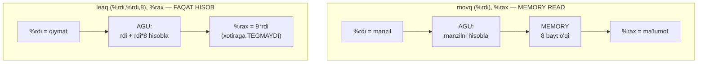
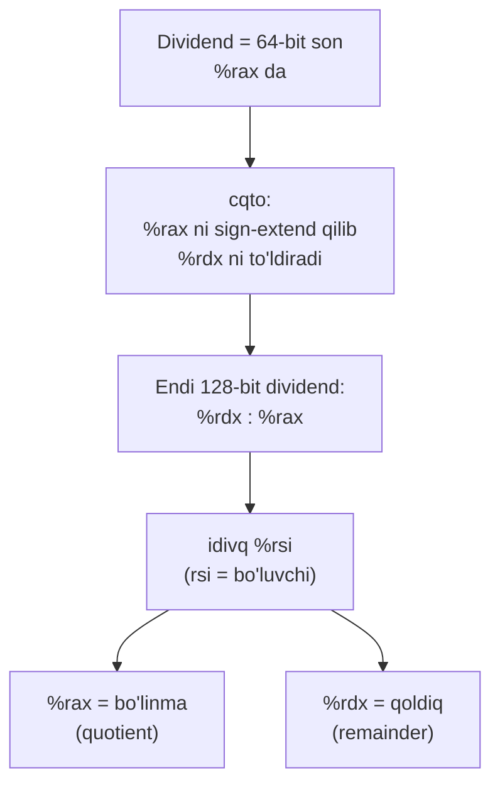
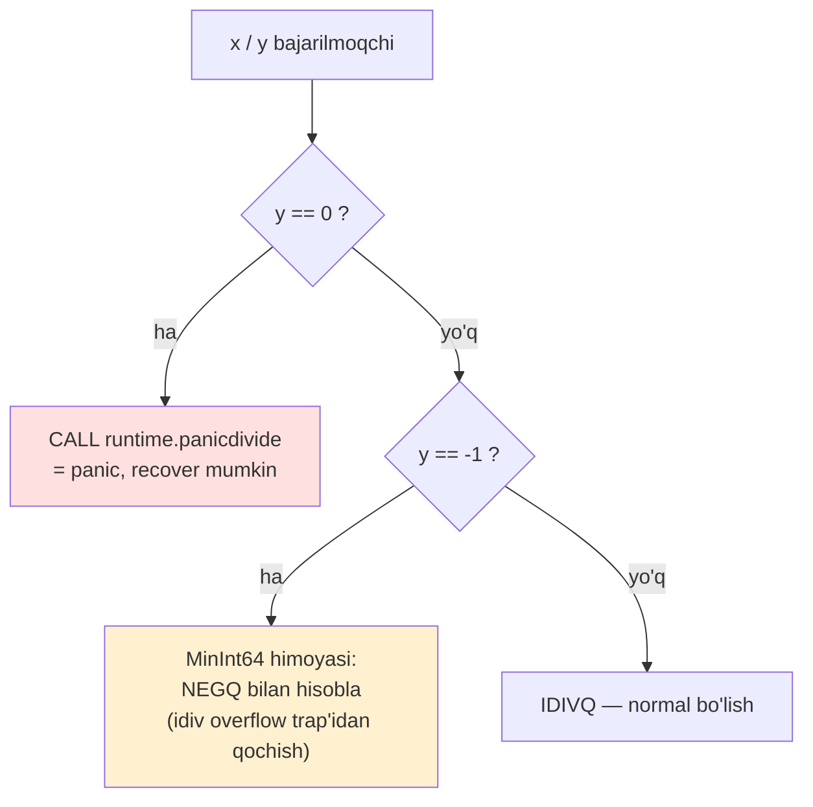

# 07. Data Movement va Arithmetic — lea, amallar va bo'lish

> Manba: CS:APP 2-nashr, 3.5 (x86-64 ga moslashtirilgan) · Muhit: Ubuntu 24.04 x86-64 (Docker), gcc 13.3.0, go 1.22.2 · [← Oldingi](06-machine-level-basics.md) · [Kurs xaritasi](00-README.md) · [Keyingi →](08-machine-control-flow.md)

## Nima uchun kerak

Sen `godbolt.org` da o'z funksiyangni ko'rasan-u, `x * 9` o'rniga `imul` emas, allaqanday `leaq (%rdi,%rdi,8)` chiqadi — bu nima va nega tezroq? Bir C ifoda, uch xil instruksiya (`lea`, `imul`, `idiv`) — qaysi biri qancha turadi, bilishing kerak.

Ikkinchisi: nega `x / y` ko'paytmadan o'nlab marta sekin, va nega profilda `idiv` ba'zan alohida hotspot bo'lib turadi. Hash ring yoki sharding kodida `% N` yozgan har bir dasturchi buni bir kun uchratadi.

Uchinchisi — Go xususiyati: nega `x / 0` C'da butun protsessni **crash** qiladi (SIGFPE), Go'da esa **panic** beradi va uni `recover` qilsang bo'ladi. Bu farq bo'lish instruksiyasining atrofidagi ko'rinmas tekshiruvlarda yashiringan. Bu dars aynan shu uch og'riqni ochadi.

> Bu dars bitta g'oyaga tayanadi: kompilyator arifmetikani **sen yozgandek** emas, **eng arzon instruksiya bilan** bajaradi. Buni ko'ra bilish — performance intuitsiyasi.

## Nazariya

### lea — "address hisoblagich"ning arifmetikaga o'g'irlanishi

(06-darsda) memory operand'ning umumiy shaklini ko'rgan eding: `Imm(rb, ri, s)` = `Imm + R[rb] + R[ri]*s`, bu yerda `s` ∈ {1,2,4,8}. Bu formula protsessorning **address hisoblagichi** (address generation unit, AGU) uchun yaratilgan — array element yoki struct field manzilini topish uchun.

`leaq S, D` (load effective address) esa hiyla: u xuddi `movq S, D` kabi yoziladi, **lekin xotiraga umuman tegmaydi**. `movq (%rdi), %rax` — `%rdi` ko'rsatgan manzildan 8 bayt **o'qiydi**. `leaq (%rdi), %rax` — shunchaki `%rdi` ning o'zini `%rax` ga ko'chiradi. Farqi: `lea` **manzilni hisoblaydi**, undan **o'qimaydi**.

Endi diqqat: `Imm + R[rb] + R[ri]*s` — bu aslida **arifmetik ifoda**. Agar `rb` va `ri` ni oddiy sonlar deb qarasak, `leaq (%rdi,%rdi,8), %rax` = `rdi + rdi*8` = `9*rdi`. Manzil hisoblagich bir instruksiyada **ko'paytma + qo'shish** qildi. Kompilyator buni ko'rib turibdi va arifmetika uchun o'g'irlaydi.



**Nega kompilyator lea'ni yaxshi ko'radi?** Uch sabab:

1. **Bir instruksiyada ko'p ish** — `d*x + Imm` shaklidagi ifodani (x, x*2, x*4, x*8, va +son) bitta `lea` bajaradi. `imul` + `add` ikki instruksiya bo'lardi.
2. **Flag'larni buzmaydi** — oddiy `add`, `sub`, `imul` CPU flag'larini (ZF, SF, CF, OF) o'zgartiradi. `lea` esa **tegmaydi**. Agar kompilyator flag'ni keyingi shart uchun saqlamoqchi bo'lsa (08-darsdagi `cmp`/`jmp`), `lea` — bepul arifmetika.
3. **Alohida portda ishlaydi** — zamonaviy CPU'da AGU alohida execution port. `lea` ALU portini band qilmaydi, ya'ni `imul`/`add` bilan parallel ketishi mumkin (port pressure balansi).

Cheklovi: `s` faqat {1,2,4,8}, ya'ni `lea` faqat 2, 3, 4, 5, 8, 9 kabi konstantalarga ko'paytira oladi (`x*d` ni `x + x*(d-1)` ko'rinishida). `x*7` bitta lea'da chiqmaydi — quyida ko'ramiz, kompilyator uni `x*8 - x` ga aylantiradi.

### Unary amallar — bitta operand

Bir operandli amallar, operand ham source, ham destination:

| Instruksiya | Ma'nosi | C ekvivalenti |
|-------------|---------|---------------|
| `incq D` | `D = D + 1` | `x++` |
| `decq D` | `D = D - 1` | `x--` |
| `negq D` | `D = -D` | `x = -x` (ikki-to'ldiruvchi inkor) |
| `notq D` | `D = ~D` | `x = ~x` (bitwise NOT) |

`neg` — ikki-to'ldiruvchi (two's complement) inkor: `-x = ~x + 1`. `not` — har bitni teskarilash. Bularni (04-darsdagi) integer arifmetika bilan bog'la.

### Binary amallar — AT&T tartibi va "dst = dst OP src"

Ikki operandli amallar. **Eng ko'p adashtiradigan joy shu**: AT&T sintaksisida birinchi operand — **source**, ikkinchi — **destination**, va natija destination'ga yoziladi:

> `OP src, dst`  →  `dst = dst OP src`

| Instruksiya | Amal | `subq %rsi, %rdi` ma'nosi |
|-------------|------|---------------------------|
| `addq` | qo'shish | — |
| `subq` | ayirish | `rdi = rdi - rsi` (rsi'dan rdi emas!) |
| `imulq` | ko'paytma (ikki operandli) | — |
| `andq` | bitwise AND | — |
| `orq` | bitwise OR | — |
| `xorq` | bitwise XOR | — |

`sub` da tartib muhim: `subq %rsi, %rdi` = `rdi = rdi - rsi`, **ayirilayotgan (rsi) oldinda turadi, lekin natija dst'da**. Buni teskari o'qish — eng klassik xato.

### Shift amallar — miqdor immediate yoki %cl da

| Instruksiya | Ma'nosi | (04-darsdan) |
|-------------|---------|--------------|
| `salq k, D` / `shlq k, D` | chapga surish (`D << k`) | arithmetic = logical (chapda bir xil) |
| `sarq k, D` | o'ngga **arithmetic** surish | sign bit takrorlanadi (signed) |
| `shrq k, D` | o'ngga **logical** surish | nol bilan to'ldiriladi (unsigned) |

Shift miqdori `k` ikki xil bo'ladi: **immediate** (`salq $4, %rax`) yoki **`%cl` registerida** (`salq %cl, %rax`). Nega aynan `%cl`? Tarixiy: `cl` = "count" registri. Muhim nozik nuqta: 64-bit amalda miqdorning faqat **past 6 biti** olinadi (`k mod 64`) — (02-darsdagi) `k mod w` qoidasi. Ya'ni `shlq $65, %rax` = `shlq $1, %rax`, chunki `65 mod 64 = 1`.

### Katta arifmetika — 128-bit ko'paytma va bo'lish

64-bit sonlarni ko'paytirsak, natija 128 bit bo'lishi mumkin. `imulq`/`mulq` ning **bir operandli** shakli aynan shuni beradi:

- `mulq S` (unsigned) yoki `imulq S` (signed): `%rax * S` ni hisoblaydi, **128-bit natijani `%rdx:%rax` juftligiga** yozadi — yuqori 64 bit `%rdx` da, past 64 bit `%rax` da.

Bo'lish esa teskari: u **128-bit bo'linuvchini talab qiladi**, u ham `%rdx:%rax` juftligida:

- `idivq S` (signed) / `divq S` (unsigned): `%rdx:%rax / S` ni hisoblaydi. Natija: **`%rax` = bo'linma (quotient), `%rdx` = qoldiq (remainder)**.
- Bo'lishdan oldin `%rdx` ni to'g'ri to'ldirish shart. Signed uchun: `cqto` — `%rax` ning sign bitini `%rdx` ning hamma bitiga ko'chiradi (sign-extend). Unsigned uchun: `%rdx` ga oddiy `0`.



Eng muhim xulosa shu diagrammadan: **bo'linma va qoldiq bitta instruksiyada birga hosil bo'ladi**. `x / y` va `x % y` ni birga kerak bo'lsa — ikkinchisi bepul.

### Nega bo'lish sekin

`add` ~1 sikl, `imul` ~3 sikl, `idiv`/`div` esa **~20-40+ sikl** (mikroarxitekturaga qarab, Agner Fog jadvallari bo'yicha 12-44 sikl oralig'ida). Sabab: ko'paytma apparatda parallel (Wallace tree kabi) tez bajariladi, bo'lish esa **iterativ algoritm** — har siklda natijaning bir necha bitini topadi, shuning uchun ko'p sikl. Bu (13-darsdagi) optimizatsiyaning asosiy motividir: kompilyator konstantaga bo'lishni ko'paytmaga aylantirishga urinadi.

## Kod va isbot

### 1-misol: lea — arifmetika quroli sifatida

```c
long mul9(long x)          { return x * 9; }
long expr(long x, long y)  { return 5*x + 7*y; }
long addr_vs_val(long *p)  { return (long)(p + 2); }   /* pointer arifmetika ham lea */
```

`gcc -Og -S lea.c`:

```asm
mul9:
	endbr64
	leaq	(%rdi,%rdi,8), %rax    ; rax = rdi + rdi*8 = 9*x. imul EMAS!
	ret
```

`x * 9` uchun kompilyator `imul` yozmadi. `9*x = x + x*8`, va bu aynan `lea` formulasiga tushadi: `rdi + rdi*8`. Bir instruksiya, flag buzilmadi.

```asm
expr:
	endbr64
	leaq	(%rdi,%rdi,4), %rax    ; rax = rdi + rdi*4 = 5*x
	leaq	0(,%rsi,8), %rdx       ; rdx = rsi*8 = 8*y
	subq	%rsi, %rdx            ; rdx = 8*y - y = 7*y
	addq	%rdx, %rax           ; rax = 5*x + 7*y
	ret
```

Bu yerda ikkita hiyla ko'rinadi. `5*x` — bitta lea (`rdi + rdi*4`). Lekin `7*y` bitta lea'ga sig'maydi (`s` da 7 yo'q!), shuning uchun kompilyator `7*y = 8*y - y` deb yozdi: `leaq 0(,%rsi,8)` bilan `8*y`, keyin `subq %rsi` bilan `-y`. Oxirida `add`.

```asm
addr_vs_val:
	endbr64
	leaq	16(%rdi), %rax        ; rax = rdi + 16
	ret
```

`p + 2` — pointer arifmetikasi. `p` — `long*`, `long` = 8 bayt, demak `+2` element = `+16` bayt. Kompilyator `leaq 16(%rdi)` yozdi. **Muhim: bir xil `lea` instruksiyasi ham qiymat arifmetikasi (9*x), ham manzil arifmetikasi (p+2) uchun ishlaydi — CPU uchun farqi yo'q.**

### 2-misol: binary amallar zanjiri va register qayta ishlatish

```c
long ops(long x, long y)
{
    long t1 = x ^ y;
    long t2 = y << 4;
    long t3 = t1 & 0x0F0F;
    long t4 = t2 - t3;
    return t4;
}
```

`gcc -Og -S arith.c`:

```asm
ops:
	endbr64
	xorq	%rsi, %rdi           ; rdi = rdi ^ rsi = x ^ y  (t1) — dst OXIRIDA
	salq	$4, %rsi             ; rsi = rsi << 4 = y << 4  (t2)
	andl	$3855, %edi          ; edi = edi & 0x0F0F  (t3) — 32-bit AND!
	movq	%rsi, %rax           ; rax = t2
	subq	%rdi, %rax           ; rax = t2 - t3  (t4)
	ret
```

Uch nozik nuqta:

**(a) AT&T tartibi.** `xorq %rsi, %rdi` = `rdi = rdi ^ rsi` — natija `%rdi` da (dst oxirida). Agar teskari o'qisang, mantiq buziladi.

**(b) `andl` — 64-bit emas, 32-bit AND!** `0x0F0F` = 3855. Kompilyator biladi: natija baribir 16 bitga sig'adi, shuning uchun `andl` (32-bit) yetarli — va (06-darsdagi qoida bo'yicha) 32-bit yozish yuqori 32 bitni avtomatik nollaydi. Kichikroq instruksiya = tezroq encoding.

**(c) Register qayta ishlatish.** `t1` ham, `t3` ham `%rdi` da yashaydi. Kompilyator har C o'zgaruvchisiga alohida register bermaydi — mumkin bo'lsa, o'lgan (endi kerak bo'lmagan) qiymat ustiga yozadi.

### 3-misol: bo'lish — cqto + idivq protokoli

```c
long sdiv(long x, long y)                            { return x / y; }
long smod(long x, long y)                            { return x % y; }
unsigned long udiv(unsigned long x, unsigned long y) { return x / y; }
```

`gcc -Og -S div.c`:

```asm
sdiv:
	endbr64
	movq	%rdi, %rax           ; rax = x (dividend past qismi)
	cqto                         ; rdx = rax ning sign biti (sign-extend) -> rdx:rax
	idivq	%rsi                 ; rax = x/y (bo'linma), rdx = qoldiq
	ret
```

`smod` deyarli **bir xil**, faqat oxirida qoldiqni qaytaradi:

```asm
smod:
	endbr64
	movq	%rdi, %rax
	cqto
	idivq	%rsi
	movq	%rdx, %rax           ; rax = qoldiq (rdx dan) — YAGONA farq!
	ret
```

Diqqat: `sdiv` va `smod` orasidagi yagona farq — qaysi registerni qaytarish (`%rax` yoki `%rdx`). Ya'ni **`x/y` va `x%y` ni birga hisoblasang, ikkinchisi bepul** — `idivq` allaqachon ikkalasini bergan.

Unsigned holatda `cqto` yo'q, `%rdx` ga oddiy 0:

```asm
udiv:
	endbr64
	movq	%rdi, %rax
	movl	$0, %edx             ; rdx = 0 (unsigned uchun sign-extend kerak emas)
	divq	%rsi                 ; divq (idivq emas) — unsigned bo'lish
	ret
```

`movl $0, %edx` — bu ham 32-bit yozib yuqorini nollash hiylasi (06-dars), `movq $0` dan kichikroq.

### 4-misol: to'liq 128-bit ko'paytma — mulq

```c
typedef unsigned __int128 u128;
u128 mulfull(unsigned long x, unsigned long y) { return (u128)x * y; }
```

`gcc -Og -S mul128.c`:

```asm
mulfull:
	endbr64
	movq	%rsi, %rax           ; rax = y
	mulq	%rdi                 ; rdx:rax = y * x  (128-bit natija!)
	ret
```

Bir operandli `mulq %rdi` = `%rax * %rdi`, natija 128 bit: yuqori 64 bit `%rdx` da, past 64 bit `%rax` da. `__int128` return C ABI'da aynan `%rdx:%rax` juftligida qaytariladi, shuning uchun qo'shimcha ko'chirish ham kerak emas. 64x64=128 bit ko'paytma apparatda mavjud — C'dan `__int128` orqali, Go'dan `math/bits.Mul64` orqali yetiladi (buni pastda ko'ramiz).

## Go dasturchiga ko'prik

### Go ham xuddi shu hiylalarni qiladi — LEAQ

```go
package main

func mul9(x int64) int64 {
	return x * 9
}

func divmod(x, y int64) (int64, int64) {
	return x / y, x % y
}

func main() {
	q, r := divmod(mul9(5), 7)
	println(q, r)
}
```

`go tool compile -S mul9.go` — `mul9`:

```
main.mul9:
	TEXT	main.mul9(SB), NOSPLIT|NOFRAME|ABIInternal, $0-8
	LEAQ	(AX)(AX*8), AX       ; AX = AX + AX*8 = 9*x — gcc bilan BIR XIL hiyla!
	RET
```

`LEAQ (AX)(AX*8), AX` — bu aynan gcc'ning `leaq (%rdi,%rdi,8)` si, faqat Plan 9 sintaksisida (06-darsda ko'rgan Go assembler). Kompilyator qaysi bo'lishidan qat'i nazar, `x*9` ni lea bilan bajaradi.

### Go bo'lish — panic vs C crash

Endi `divmod`. Bu yerda Go C'dan **jiddiy farq** qiladi:

```
main.divmod (qisqartirilgan):
	TEXT	main.divmod(SB), NOSPLIT|ABIInternal, $8-16
	MOVQ	SP, BP
	JEQ	33                   ; <- y == 0 tekshiruvi: agar 0 bo'lsa, panic'ga sakra
	CMPQ	BX, $-1              ; <- y == -1 tekshiruvi (MinInt64 / -1 himoyasi)
	NEGQ	AX
	CQO
	IDIVQ	BX                  ; asl bo'lish
	MOVQ	DX, BX
	CALL	runtime.panicdivide(SB)  ; <- y==0 bo'lsa shu chaqiriladi
```

Apparatdagi `idivq` bo'luvchi 0 bo'lsa **CPU exception** beradi. C'da bu qayta ishlanmaydi — dastur `SIGFPE` signali bilan **crash** bo'ladi. Go esa bo'lishdan **oldin** `y == 0` ni tekshiradi va `runtime.panicdivide` chaqiradi — bu **muntazam panic**, ya'ni `recover()` bilan ushlab qolsa bo'ladi.



Ikkinchi tekshiruv — `CMPQ BX, $-1` + `NEGQ`: `MinInt64 / -1` matematik natijasi `MaxInt64 + 1`, u int64'ga sig'maydi va apparatda **overflow trap** beradi. Go buni ham oldindan ushlaydi va natijani `NEG` bilan hisoblaydi.

**Bu tekshiruvlarning narxi.** Har Go bo'lish amali ichida shu 2-3 ko'rinmas instruksiya bor — xavfsizlik narxi. Lekin kompilyator aqlli: agar bo'luvchi **konstanta va nolmas** bo'lsa (`x / 8`), tekshiruvlar olib tashlanadi (va odatda bo'lishning o'zi shift/ko'paytmaga aylanadi).

### math/bits.Mul64 — mulq ning Go yuzi

Go'da to'liq 128-bit ko'paytma uchun `math/bits.Mul64(x, y) (hi, lo uint64)` bor — u aynan `mulq` ga kompilyatsiya qilinadi, `hi` = `%rdx`, `lo` = `%rax`. Buni (04-darsda) ko'paytma overflow'ini aniqlashda ishlatgan eding: agar `hi != 0` bo'lsa, natija 64 bitga sig'magan.

## Real-world scenariylar

**1. Hot loop'da `%` (modulo) — sharding/hash ring bottleneck'i.** Hash ring yoki shard tanlashda `bucket := hash % N` juda keng tarqalgan. Agar bu kod sekundiga millionlab marta bajarilsa, har `%` ~20-40 sikl — profilda `idiv` alohida hotspot bo'lib chiqadi. Yechim: agar `N` ikkining darajasi bo'lsa (`N = 2^k`), `hash % N` ni `hash & (N-1)` bilan almashtir — `and` ~1 sikl. Shuning uchun ko'p hash table'lar bucket sonini doim 2^k qilib saqlaydi. Kompilyator buni konstanta `N` uchun o'zi qiladi, lekin `N` runtime o'zgaruvchisi bo'lsa — qo'lda mask qilishing kerak.

**2. Go servisida division-by-zero'ni recover bilan ushlash.** HTTP handler ichida foydalanuvchi kiritgan songa bo'lish (`total / count`, `count` esa 0 bo'lishi mumkin) — C bo'lsa butun jarayon crash. Go'da esa `runtime.panicdivide` panic beradi, va `recover()` bilan handler faqat 500 qaytaradi, server tirik qoladi. Bu farq aynan yuqoridagi `JEQ` tekshiruvi tufayli mumkin — Go bo'lishni har doim "himoyalangan" qiladi.

**3. godbolt'da `x * constant` variantlarini solishtirish.** `x*8`, `x*9`, `x*7`, `x*15`, `x*10` ni godbolt'da yonma-yon qo'y. Ko'rasan: `x*8` = `salq $3` (shift), `x*9` = bitta `lea`, `x*7` = `lea` + `sub`, `x*10` = `lea` + `add` yoki ikki lea, `x*15` = ikki lea yoki `shl`+`sub`. `imul` faqat konstanta "noqulay" bo'lganda (masalan katta tub son) chiqadi. Bu — kompilyator qanday "o'ylashini" ko'rishning eng arzon usuli.

## Zamonaviy yondashuv

Web tadqiqotidan sintez:

- **imul ~3 sikl, idiv 12-90+ sikl.** Agner Fog jadvallari bo'yicha 64-bit `idiv` mikroarxitekturaga qarab 12-44 sikl (masalan Ice Lake'da ~15 sikl latency, har 10 siklda bittasi). Bir 64-bit ko'paytma esa ~3 sikl — bo'lish ~5x sekinroq. **Bo'lishdan qochish hali ham dolzarb optimizatsiya.**
- **Konstantaga bo'lish -> "magic number" ko'paytmasi.** Kompilyatorlar `x / 7` kabi konstanta bo'lishni maxsus ko'paytma + shift'ga aylantiradi (reciprocal multiply). G'oya: `x / d ≈ (x * M) >> s`, bu yerda `M` — oldindan hisoblangan "sehrli son". Bu texnika `libdivide` kutubxonasida runtime uchun ham mavjud — agar bir xil bo'luvchiga ko'p marta bo'lsang, foydali.
- **lea port pressure balanslash.** `lea` AGU portida ishlagani uchun kompilyator uni ALU'ni bo'shatish maqsadida ham ishlatadi — arifmetika bo'lmasa ham. Lekin ba'zi CPU'larda uch komponentli `lea` (`Imm(rb,ri,s)`) "slow lea" bo'lib qo'shimcha sikl talab qilishi mumkin — kompilyatorlar buni hisobga oladi.
- **ARM64 boshqacha, printsip bir xil.** ARM64'da ko'paytma+qo'shishni bitta `madd` (multiply-add), ayirishni `msub` bajaradi. Bo'lish uchun `sdiv`/`udiv` bor, lekin qoldiq uchun alohida instruksiya yo'q — `msub` bilan hisoblanadi. lea ekvivalenti — moslashuvchan address modelar. Apparat farq qiladi, "bo'lishdan qoch, arzon amalga aylantir" falsafasi bir xil.

## Keng tarqalgan xatolar

**1. `lea` memory o'qiydi deb o'ylash.** `leaq (%rdi), %rax` xotiraga **tegmaydi** — u faqat manzilni (ya'ni `%rdi` qiymatini) `%rax` ga ko'chiradi. `movq (%rdi), %rax` esa o'sha manzildagi ma'lumotni o'qiydi. Bittasi hisob, ikkinchisi o'qish.

**2. AT&T'da `imul`/`sub` operand tartibini adashtirish.** `subq %rsi, %rdi` = `rdi = rdi - rsi`, **rsi'dan rdi emas**. AT&T da doim `OP src, dst` va natija dst'da. Teskari o'qish — mantiqni buzadi.

**3. "Bo'lish ham ko'paytirishdek tez" deb o'ylash.** Yo'q. `imul` ~3 sikl, `idiv` ~20-40+ sikl. Hot path'da bo'lishni ko'rsang — ogohlan. Bu shift/mask/reciprocal bilan almashtirilishi mumkin bo'lgan asosiy nomzod.

**4. `x % y` va `x / y` ni alohida hisoblatish.** Ikkalasini alohida funksiya chaqiruvi bilan olsang, ehtimol ikki marta `idiv` bajariladi. Bittada `q, r := x/y, x%y` deb yozsang — kompilyator bitta `idivq` bilan ikkalasini beradi (`%rax` va `%rdx`). Qoldiq bepul.

**5. Shift miqdori 64+ bo'lsa nima bo'lishini bilmaslik.** `x << 65` 64-bit tipda `x << 1` ga teng — CPU faqat miqdorning past 6 bitini oladi (`65 mod 64 = 1`), (02-darsdagi) `k mod w` qoidasi. Go spetsifikatsiyasi esa boshqacha: Go'da shift miqdori tip kengligidan katta bo'lsa, natija **0** (til darajasida aniqlangan, apparatdan farqli). Bu farqni bilmaslik — nozik bug manbai.

## Amaliy mashqlar

**Mashq 1 (lea hisoblash).** `leaq 4(%rdi,%rdi,2), %rax` qaysi qiymatni hisoblaydi (`%rdi = x`)?

<details>
<summary>Yechim</summary>

Formula: `Imm + rb + ri*s` = `4 + x + x*2` = **`3*x + 4`**.

Masalan `x = 10` bo'lsa: `4 + 10 + 20 = 34 = 3*10 + 4`. To'g'ri.
</details>

**Mashq 2 (lea qurish).** `x * 15` ni faqat `lea` bilan qanday hisoblash mumkin? (bitta lea yetadimi?)

<details>
<summary>Yechim</summary>

Bitta lea yetmaydi — `s` ∈ {1,2,4,8}, 15 yo'q. Ikki yo'l:

- **Ikki lea:** `15 = 3 * 5`. `leaq (%rdi,%rdi,2), %rax` (= 3x), keyin `leaq (%rax,%rax,4), %rax` (= 5*3x = 15x).
- **Shift + sub:** `15x = 16x - x`. `movq %rdi, %rax; salq $4, %rax; subq %rdi, %rax`.

Kompilyator odatda ikkinchisini (shift+sub) tanlaydi — kamroq instruksiya latency.
</details>

**Mashq 3 (lea hisoblash, ikki register).** `leaq (%rdi,%rsi,4), %rax` da `%rdi = 0x100`, `%rsi = 3`. Natija?

<details>
<summary>Yechim</summary>

`rdi + rsi*4` = `0x100 + 3*4` = `256 + 12` = `268` = **`0x10C`**.

Diqqat: bu manzil arifmetikasi ham bo'lishi mumkin (`int` array'da `p[3]`, chunki `int` = 4 bayt), lekin `lea` shunchaki qiymatni beradi — o'qimaydi.
</details>

**Mashq 4 (assembly -> C moslash).** Bu assembly qaysi C ifodaga mos (argumentlar `long x`, `long y`)?

```asm
	leaq	(%rsi,%rsi,2), %rax    # ?
	addq	%rdi, %rax
	ret
```

<details>
<summary>Yechim</summary>

`leaq (%rsi,%rsi,2)` = `rsi + rsi*2` = `3*y`. Keyin `addq %rdi` = `+ x`. Natija = **`x + 3*y`**.
</details>

**Mashq 5 (idivq protokoli).** Bo'lishdan oldin `%rax = 20`, `%rsi = 6`. `cqto; idivq %rsi` bajarilgach `%rax` va `%rdx` da nima bo'ladi?

<details>
<summary>Yechim</summary>

`cqto` — `%rax = 20` musbat, sign biti 0, demak `%rdx = 0`. Dividend `%rdx:%rax = 20`.

`idivq %rsi` (bo'luvchi 6): `20 / 6 = 3` qoldiq `2`. Demak:
- `%rax = 3` (bo'linma)
- `%rdx = 2` (qoldiq)
</details>

**Mashq 6 (AT&T tartib).** `subq %rsi, %rdi` bajarilishidan oldin `%rdi = 30`, `%rsi = 12`. Keyin `%rdi` nima?

<details>
<summary>Yechim</summary>

`rdi = rdi - rsi` = `30 - 12` = **`18`**. (`12 - 30 = -18` EMAS! AT&T da dst'dan src ayiriladi.)
</details>

**Mashq 7 (Go bo'lish narxi).** Nega Go'da `a / b` (ikkalasi ham runtime `int64`) gcc'dan ko'proq instruksiya beradi? Qaysi ikki tekshiruv qo'shiladi va nega?

<details>
<summary>Yechim</summary>

Ikki tekshiruv:
1. **`b == 0`** (`JEQ` -> `runtime.panicdivide`) — apparat bo'lish 0 ga SIGFPE crash beradi; Go uni panic'ga (recover mumkin) aylantiradi.
2. **`b == -1`** (`CMPQ BX, $-1` + `NEGQ`) — `MinInt64 / -1` apparat overflow trap beradi; Go natijani NEG bilan hisoblab trap'dan qochadi.

Bu xavfsizlik narxi. Agar `b` konstanta nolmas bo'lsa, kompilyator ikkala tekshiruvni ham olib tashlaydi.
</details>

## Cheat sheet

| Instruksiya | Nima qiladi | Eslab qolish |
|-------------|-------------|--------------|
| `leaq S, D` | `D = manzil(S)`, xotiraga tegmaydi | arifmetika hiylasi, flag buzmaydi |
| `incq/decq D` | `+1` / `-1` | unary |
| `negq/notq D` | `-D` / `~D` | inkor / bit teskarilash |
| `addq S, D` | `D = D + S` | AT&T: dst oxirida |
| `subq S, D` | `D = D - S` | dst'DAN src ayriladi |
| `imulq S, D` | `D = D * S` (2-operand) | ~3 sikl |
| `andq/orq/xorq S, D` | bitwise, `D = D OP S` | — |
| `salq/shlq k, D` | `D << k` | chapga surish |
| `sarq k, D` | `D >> k` arithmetic | signed, sign takrorlanadi |
| `shrq k, D` | `D >> k` logical | unsigned, nol bilan |
| `cqto` | `%rax` -> `%rdx:%rax` sign-extend | idivq'dan oldin (signed) |
| `idivq/divq S` | `%rdx:%rax / S` | **rax=bo'linma, rdx=qoldiq** |
| `mulq S` (1-op) | `%rax * S` -> `%rdx:%rax` | 128-bit natija |

**Tezlik taqqosi (taxminiy, x86-64):**

| Amal | Latency | Nota |
|------|---------|------|
| `add`, `sub`, `and`, `lea` | ~1 sikl | eng arzon |
| `imul` | ~3 sikl | tez |
| `idiv`, `div` | ~20-40+ sikl | qoch, mumkin bo'lsa shift/mask |

**Konstantaga ko'paytma qoidalari:**

| Ifoda | Kompilyator tanlashi |
|-------|----------------------|
| `x * 8` | `salq $3` (shift) |
| `x * 9` | `leaq (%rdi,%rdi,8)` (bitta lea) |
| `x * 7` | `leaq (,%rdi,8)` + `subq` (8x - x) |
| `x * 10` | ikki lea yoki `lea`+`add` |
| `x % 2^k` | `andq $(2^k - 1)` (mask) |

## Qo'shimcha manbalar

- [Intuition Behind the x86 lea Instruction (Lesley Lai)](https://lesleylai.info/en/lea/) — lea nega arifmetika uchun ishlatilishi, misollar bilan.
- [Integer Division (Algorithmica / HPC)](https://en.algorithmica.org/hpc/arithmetic/division/) — bo'lish nega sekin, reciprocal multiply va "magic number" texnikasi.
- [Agner Fog — Instruction Tables (PDF)](https://www.agner.org/optimize/instruction_tables.pdf) — har instruksiyaning aniq latency/throughput jadvallari (idiv, imul, lea).
- [go.dev/src/runtime/panic.go](https://go.dev/src/runtime/panic.go) — `panicdivide` va boshqa runtime panic'lar manba kodi.
