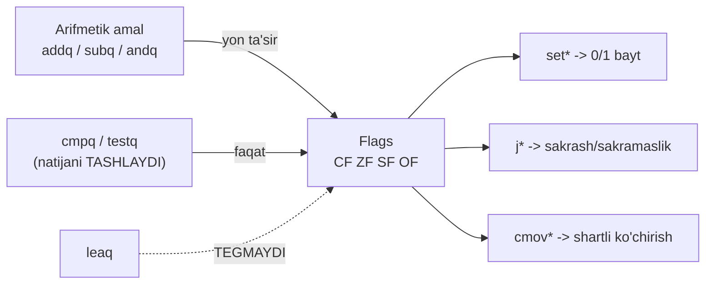
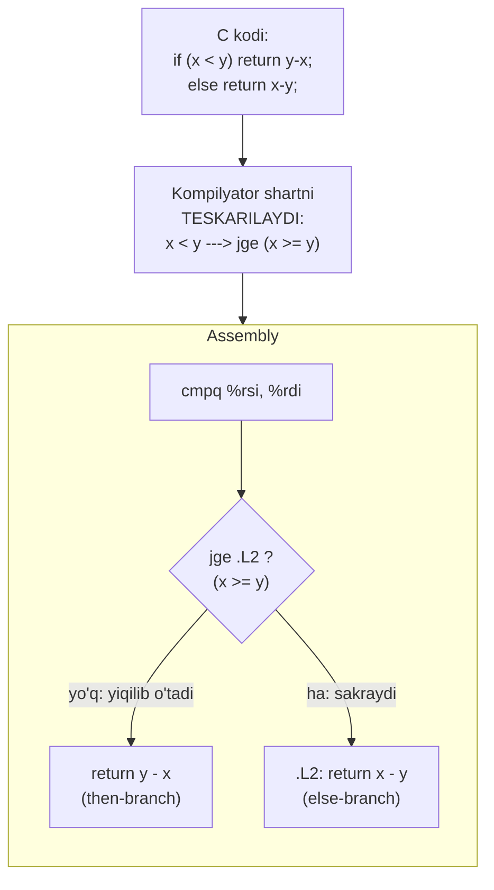
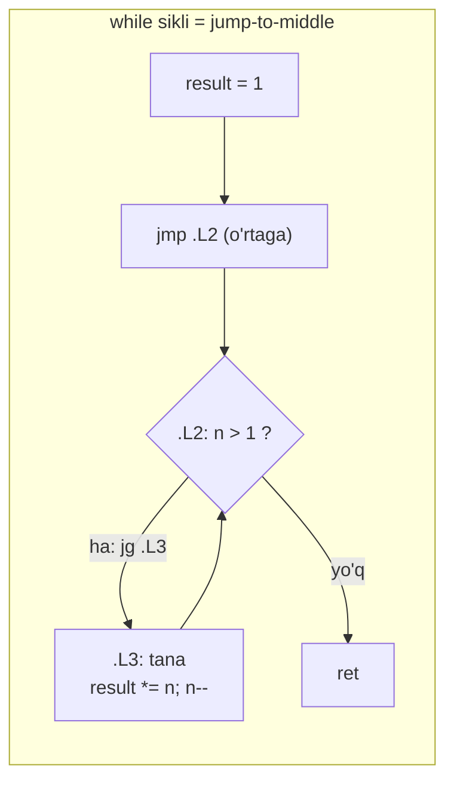
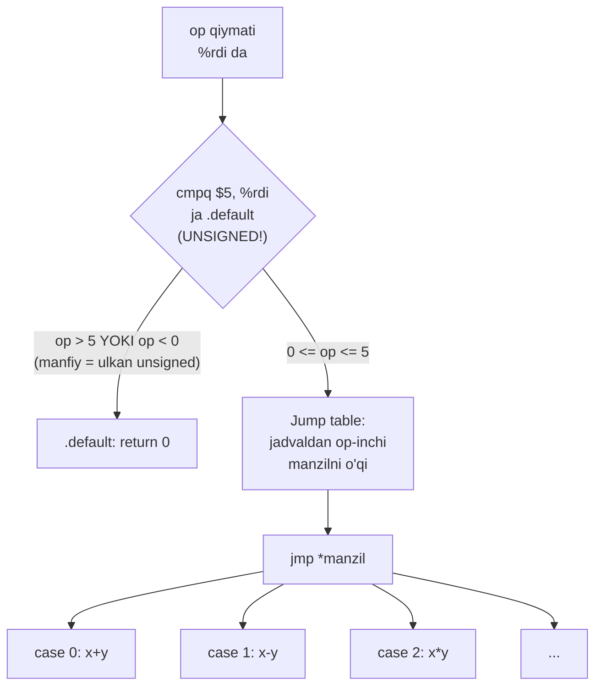

# 08. Machine-Level Control Flow — flags, jumps, loops, switch

> Manba: CS:APP 2-nashr, 3.6 (x86-64 ga moslashtirilgan) · Muhit: Ubuntu 24.04 x86-64 (Docker), gcc 13.3.0, go 1.22.2 · [← Oldingi](07-data-movement-arithmetic.md) · [Kurs xaritasi](00-README.md) · [Keyingi →](09-procedures-stack.md)

## Nima uchun kerak

Sen har kuni `if`, `for`, `switch` yozasan — lekin ular apparatda "sehr" emas. CPU'da shart degan tushuncha yo'q; bor-yo'g'i **4 ta bit** (condition codes) va shu bitlarga qarab sakraydigan **jump** instruksiyalari. Bu darsdan keyin har bir `if` ni assemblyda "ko'ra" olasan.

Ikkinchisi — performance. Nega ba'zan bir xil ishni qiladigan ikki kod tezligi 5-10 barobar farq qiladi? Javob ko'pincha **branch misprediction** da: noto'g'ri bashorat qilingan bitta `if` ~15-20 sikl behuda ketadi. Kompilyator ba'zan `if` ni butunlay yo'q qiladi — `cmov` (conditional move) bilan **branch'siz** tanlaydi. Qachon mumkin, qachon yo'q — shu yerda.

Uchinchisi — Go xususiyati: nega `s[i]` "shunchaki o'qish" emas? Har indeks ortida yashirin `if i >= len(s)` bor (bounds check). Profilda buni ko'rsang, kompilyator qachon uni olib tashlashini (BCE) bilishing kerak.

> Bu dars bitta g'oyaga tayanadi: yuqori tildagi har bir **shart** apparatda **flag o'rnatish + o'sha flagga qarab sakrash** ga aylanadi. Buni ko'ra bilsang, sekin kod nega sekinligini tushunasan.

## Nazariya

### Condition codes — CPU'ning "yon ta'sir xotirasi"

Protsessorda maxsus 1-bitli register bor — status flags. Bizga 4 tasi muhim:

| Flag | To'liq nomi | Qachon 1 bo'ladi | Kimga kerak |
|------|-------------|------------------|-------------|
| **CF** | Carry Flag | eng yuqori bitdan chiqish/qarz bo'ldi (unsigned overflow) | **unsigned** taqqoslash |
| **ZF** | Zero Flag | natija aynan 0 | `==`, `!=` |
| **SF** | Sign Flag | natijaning yuqori biti 1 (ya'ni manfiy) | manfiylik tekshiruvi |
| **OF** | Overflow Flag | **signed** overflow bo'ldi (04-darsdagi) | **signed** taqqoslash |

Eng muhim tushuncha: `addq`, `subq`, `imulq` kabi arifmetik amallar bu flag'larni **yon ta'sir sifatida** (side effect) o'zi yangilaydi. Ya'ni `subq %rsi, %rdi` `%rdi` ni yangilaydi VA bir vaqtda 4 ta flag'ni o'rnatadi. Sen buni so'ramaysan — apparat baribir qiladi.

Bitta muhim istisno: **`leaq` flag'larni O'ZGARTIRMAYDI** (07-darsda ko'rgan eding — shu sabab arifmetika uchun "yashirin" quroli). Agar kompilyator flag'ni keyingi shart uchun asrashi kerak bo'lsa, hisobni `lea` bilan qiladi.



### cmp va test — natijasiz arifmetika

Ko'pincha bizga hisob natijasi kerak emas — faqat **taqqoslash** kerak. Shuning uchun ikki maxsus instruksiya bor, ular hisoblaydi-yu, **natijani hech qayerga yozmaydi, faqat flag qoldiradi**:

- **`cmpq S1, S2`** — `S2 - S1` ni hisoblaydi (ayirish kabi), natijani **tashlaydi**, faqat flag o'rnatadi. AT&T tartibi teskari o'qiladi: `cmpq %rsi, %rdi` = "`%rdi` ni `%rsi` bilan solishtir" = `rdi - rsi` flag'lari.
- **`testq S1, S2`** — `S2 & S1` ni hisoblaydi (AND kabi), natijani tashlaydi, flag qoldiradi. Klassik ishlatilishi: `testq %rax, %rax` — `rax & rax = rax`, shundan ZF (rax==0?) va SF (rax<0?) chiqadi. Null yoki nol tekshiruvining eng arzon usuli.

> `cmp` va `test` hech narsani biror registerga yozmaydi. Ularning yagona mahsuloti — flag'lar. Buni unutish eng ko'p uchraydigan xato.

### set oilasi — flag'dan 0/1 yasash

Endi flag'lardan mantiqiy qiymat (0 yoki 1) chiqarish kerak (masalan `int b = x < y;`). Buni `set*` instruksiyalari qiladi: bitta **baytga** 0 yoki 1 yozadi. Bu yerda 03-darsdagi **signed vs unsigned** farqi apparatda birinchi marta ko'rinadi — bir xil `cmpq`, lekin **qaysi flag o'qilishi** farq qiladi:

| set | Sharti (C) | O'qiydigan flag | Tur |
|-----|-----------|-----------------|-----|
| `sete` / `setz` | `==` | ZF | — |
| `setne` / `setnz` | `!=` | ~ZF | — |
| `sets` | manfiy | SF | — |
| `setl` | `<` (less) | SF ^ OF | **signed** |
| `setle` | `<=` | (SF ^ OF) \| ZF | **signed** |
| `setg` | `>` (greater) | ~(SF ^ OF) & ~ZF | **signed** |
| `setge` | `>=` | ~(SF ^ OF) | **signed** |
| `setb` | `<` (below) | CF | **unsigned** |
| `setbe` | `<=` | CF \| ZF | **unsigned** |
| `seta` | `>` (above) | ~CF & ~ZF | **unsigned** |
| `setae` | `>=` | ~CF | **unsigned** |

Diqqat qiling: signed "less" uchun `setl` (SF^OF ni o'qiydi), unsigned "below" uchun `setb` (CF ni o'qiydi). **Bir xil `cmpq`, boshqa harf** — mana signed/unsigned farqining apparat ildizi. Mnemonika: `l`/`g` (**l**ess/**g**reater) = signed, `b`/`a` (**b**elow/**a**bove) = unsigned.

`set*` faqat 1 baytga (masalan `%al`) yozadi, shuning uchun undan keyin odatda `movzbl %al, %eax` keladi — 1 baytni 32-bitga nol bilan kengaytirish (06-darsda: 32-bit yozish yuqorini nollaydi).

### jump oilasi — flag'ga qarab sakrash

`set` flag'dan 0/1 yasadi. `jump` esa flag'ga qarab **boradigan manzilni** o'zgartiradi. Ikki tur:

- **Shartsiz:** `jmp Label` — har doim sakraydi (`goto`).
- **Shartli:** `je`, `jne`, `jl`, `jge`, `jb`, `ja`, ... — **`set` bilan aynan bir xil** shart-flag jadvaliga bo'ysunadi. `jl` = `setl` bilan bir sharoit (signed less), `jb` = `setb` (unsigned below), va hokazo.

Ya'ni `set*` va `j*` — bitta g'oyaning ikki yuzi: biri flag'dan **qiymat** yasaydi, ikkinchisi flag'dan **qaror** (sakra/sakrama) yasaydi.

### if/else tarjimasi — shart TESKARILANADI

Kompilyator `if (shart) A else B` ni tarjima qilganda ajablanarli narsa qiladi: **shartni teskarilaydi**. Sabab — "yiqilib o'tish" (fall-through) yo'lini tabiiy holat qilish. Umumiy shablon:

```
    <shartni hisobla: cmp ...>
    j<TESKARI-shart>  .else_label   # shart YOLG'ON bo'lsa else'ga sakra
    <A: then-tanasi>                 # rost bo'lsa shu yerga "yiqilib" tushadi
    jmp .end
.else_label:
    <B: else-tanasi>
.end:
```

Masalan C'da `if (x < y)` bo'lsa, assemblyda `jge` (x >= y bo'lsa sakra) chiqadi — chunki `x < y` **rost** bo'lsa then-tanaga yiqilib tushish kerak, **yolg'on** (x >= y) bo'lsa else'ga sakrash kerak.



### cmov — branch'siz tanlov

Endi eng qiziq qismi. Branch (shartli jump) qimmat bo'lishi mumkin: CPU keyingi instruksiyani oldindan bashorat qiladi (branch prediction), noto'g'ri chiqsa ~15-20 sikl behuda ketadi (misprediction). `cmov` (conditional move) bu muammoni chetlab o'tadi:

> `cmov` g'oyasi: **ikkala natijani ham hisoblab qo'y**, keyin flag'ga qarab **birini tanla** — hech qanday sakrash yo'q.

`cmovl %rdx, %rax` = "agar signed less (SF^OF) bo'lsa, `%rax = %rdx`; aks holda hech narsa". Jump yo'q -> mispredict ham yo'q -> deterministik.

Lekin `cmov` har doim ishlamaydi. U faqat **ikkala tomon ham xavfsiz va arzon** bo'lsa mumkin, chunki ikkalasi ham baribir bajariladi:

| Holat | cmov mumkinmi | Nega |
|-------|---------------|------|
| `x<y ? y-x : x-y` | ✅ ha | ikkala ayirish ham xavfsiz, arzon |
| `if (x<y) counter++` | ❌ yo'q | `counter++` — side effect, ikkala tomon bajarilsa noto'g'ri oshadi |
| `p != NULL ? *p : 0` | ❌ yo'q | `*p` — null pointer dereference crash beradi |
| `flag ? f(x) : g(x)` | ❌ odatda yo'q | og'ir hisob — ikkalasini bajarish behuda/xavfli |

Ya'ni: **side effect bor, pointer dereference xavfli, yoki hisob qimmat** bo'lsa — kompilyator majburan branch qoldiradi. Nega `cmov` muhimligi 12-darsda (pipeline/branch prediction) chuqurlashadi.

### Loop tarjimalari — hammasi do-while ga aylanadi

Assemblyda "loop" degan instruksiya yo'q — faqat jump'lar orqasiga (backward) sakraydi. Uch shablon bor, lekin asosi bitta: **do-while**.

**1. do-while** — eng tabiiy. Shart tananing OXIRIDA, har iteratsiyada bitta orqaga jump:

```
.loop:
    <tana>
    <cmp shart>
    j<shart> .loop     # shart rost bo'lsa yana boshiga
```

**2. while** — ikki usul bor:
- **jump-to-middle:** avval shart tekshiruviga sakra, tana undan oldin turadi. `while` ni do-while + boshlang'ich guard'ga aylantiradi.
- **guarded-do:** boshida bir marta shartni tekshirib (agar yolg'on bo'lsa hammani o'tkazib yubor), keyin do-while.

**3. for** — kompilyator `for(init; test; update)` ni avval `while` ga, keyin do-while ga aylantiradi: `init; while(test){ body; update; }`.



E'tibor ber: tana `.L3` shart `.L2` dan **oldin** yozilgan, lekin bajarilish `jmp .L2` bilan o'rtadan boshlanadi. Shu tufayli har iteratsiyada faqat **bitta** shartli jump (`jg .L3` orqaga) — samaraliroq.

### switch — jump table bilan O(1) dispatch

`switch` ni `if-else if-else if...` zanjiri qilib tarjima qilish mumkin, lekin bu O(n) — case'lar ko'p bo'lsa sekin. Case'lar zich (0,1,2,3...) bo'lsa kompilyator **jump table** quradi: manzillar massivi, unga indeks bilan kirib, bilvosita sakraydi (`jmp *addr`). Nechta case bo'lishidan qat'i nazar — **O(1)**.

Eng nozik hiyla — chegara tekshiruvi. `cmpq $5, %rdi; ja .default` — bu yerda `ja` **unsigned** "above". Agar `op` manfiy bo'lsa, unsigned talqinda ULKAN son bo'ladi (03-darsdagi) va 5 dan katta chiqadi. Ya'ni **bitta taqqoslash** ham manfiylarni, ham 5 dan kattalarni default'ga yuboradi.



Kompilyator tanlaydi: case'lar **zich** bo'lsa jump table (tez, lekin xotira sarflaydi), **siyrak** bo'lsa (masalan 1, 1000, 5000000) if-zanjiri yoki binary search. Ikkalasi orasidagi balansni kompilyator o'zi hal qiladi.

## Kod va isbot

### 1-misol: cmp + set — taqqoslashni 0/1 qilish

```c
int eq(long x, long y)   { return x == y; }
int lt(long x, long y)   { return x < y; }              /* signed */
int ult(unsigned long x, unsigned long y) { return x < y; }  /* unsigned */
```

`gcc -Og -S cmp.c`:

```asm
eq:
	endbr64
	cmpq	%rsi, %rdi           ; rdi - rsi ni hisoblab TASHLAYDI, faqat flag
	sete	%al                  ; ZF dan: teng bo'lsa al=1
	movzbl	%al, %eax            ; 1 baytni 32-bitga nol bilan kengaytir
	ret
lt:
	endbr64
	cmpq	%rsi, %rdi           ; AYNAN bir xil cmpq!
	setl	%al                  ; setl = SF^OF (signed less)
	movzbl	%al, %eax
	ret
ult:
	endbr64
	cmpq	%rsi, %rdi           ; YANA bir xil cmpq!
	setb	%al                  ; setb = CF (unsigned below)
	movzbl	%al, %eax
	ret
```

Bu misol darsning yuragidan biri. Uch funksiya, **uch xil `set`, lekin bitta xil `cmpq`**. `cmpq %rsi, %rdi` har uchtasida `rdi - rsi` hisoblab flag qoldiradi. Farq faqat **qaysi flag o'qiladi**:

- `sete` — ZF (teng?)
- `setl` — SF^OF (**signed** less: manfiy sonlar hisobga olinadi)
- `setb` — CF (**unsigned** below: hamma bit musbat son deb qaraladi)

03-darsdagi signed/unsigned taqqoslashning butun farqi shu bitta harf (`l` vs `b`) da yashiringan. `set` faqat 1 baytga yozgani uchun `movzbl` bilan to'liq registerga kengaytiriladi.

### 2-misol: if/else — -Og da branch, -O2 da cmov (markaziy misol)

```c
long absdiff(long x, long y)
{
    return x < y ? y - x : x - y;
}
```

`gcc -Og -S absdiff.c` — klassik **branch**:

```asm
absdiff:
	endbr64
	cmpq	%rsi, %rdi           ; x:y solishtir (rdi - rsi)
	jge	.L2                  ; TESKARI shart: x >= y bo'lsa else'ga sakra
	movq	%rsi, %rax           ; rax = y  (then-branch, yiqilib tushdi)
	subq	%rdi, %rax           ; rax = y - x
	ret
.L2:
	movq	%rdi, %rax           ; rax = x  (else-branch)
	subq	%rsi, %rax           ; rax = x - y
	ret
```

Diqqat: C'da shart `x < y` edi, assemblyda `jge` (x >= y) bo'ldi — **shart teskarilandi**. Kompilyator then-tanani (y-x) "yiqilib o'tish" yo'liga qo'ydi, else'ga esa sakraydi. Bu — yuqoridagi if/else shablonining aynan o'zi.

`gcc -O2 -S absdiff.c` — endi **branch'siz**, cmov bilan:

```asm
absdiff:
	endbr64
	movq	%rsi, %rdx           ; rdx = y
	movq	%rdi, %rax           ; rax = x
	subq	%rdi, %rdx           ; rdx = y - x   <- 1-natijani hisobla
	subq	%rsi, %rax           ; rax = x - y   <- 2-natijani hisobla
	cmpq	%rsi, %rdi           ; x:y solishtir
	cmovl	%rdx, %rax           ; x < y (SF^OF) bo'lsa rax = rdx (y-x)
	ret
```

Mana cmov falsafasi to'liq ko'rinishda: kompilyator **ikkala natijani ham** hisoblaydi — `y-x` ni `%rdx` ga, `x-y` ni `%rax` ga. Keyin `cmovl` shartga qarab `%rax` ga to'g'ri qiymatni ko'chiradi. **Hech qanday jump yo'q** — demak mispredict ham yo'q. Ikkala ayirish ham xavfsiz va arzon bo'lgani uchun bu yerda cmov to'g'ri tanlov.

> Nega -O2 buni afzal ko'radi: shart bashorat qilib bo'lmaydigan (masalan tasodifiy ma'lumotdagi) bo'lsa, branch har mispredict'da ~15-20 sikl yeydi, cmov esa doim bir xil. Batafsili 12-darsda.

### 3-misol: side effect cmov'ni TAQIQLAYDI

```c
long counter = 0;

long safe(long x, long y)
{
    if (x < y) {
        counter++;          /* side effect - cmov mumkin emas */
        return y - x;
    }
    return x - y;
}
```

`gcc -Og -S branch.c`:

```asm
safe:
	endbr64
	cmpq	%rsi, %rdi           ; x:y
	jl	.L4                  ; x < y bo'lsa ichki blokka sakra
	movq	%rdi, %rax           ; else: rax = x
	subq	%rsi, %rax           ; rax = x - y
	ret
.L4:
	addq	$1, counter(%rip)    ; counter++  <- SIDE EFFECT
	movq	%rsi, %rax           ; rax = y
	subq	%rdi, %rax           ; rax = y - x
	ret
```

Bu misolni 2-misol bilan solishtir: kod deyarli bir xil, lekin `-O2` da ham bu yerda cmov **chiqmaydi**. Sabab — `counter++`. Agar kompilyator "ikkala tomonni ham baribir hisoblayman" desa, `counter` **noto'g'ri** oshib ketardi (shart yolg'on bo'lganda ham). Side effect bor joyda ikkala tomonni bajarish mumkin emas -> majburan branch.

Nozik detal: `counter(%rip)` — RIP-relative addressing, global o'zgaruvchiga PIC (position-independent code) usulda murojaat (20-darsda chuqurroq).

### 4-misol: while sikli — jump-to-middle

```c
long fact(long n)
{
    long result = 1;
    while (n > 1) {
        result *= n;
        n--;
    }
    return result;
}
```

`gcc -Og -S fact.c`:

```asm
fact:
	endbr64
	movl	$1, %eax             ; result = 1 (32-bit yozish yuqorini nollaydi)
	jmp	.L2                  ; O'RTAGA sakra - avval shartni tekshir
.L3:
	imulq	%rdi, %rax           ; result *= n
	subq	$1, %rdi             ; n--
.L2:
	cmpq	$1, %rdi             ; n:1 solishtir
	jg	.L3                  ; n > 1 bo'lsa tanaga qaytadi (orqaga)
	ret
```

Bu — jump-to-middle naqshi. Boshida `jmp .L2` bilan **to'g'ri shart tekshiruviga** (`.L2`) sakraydi; tana (`.L3`) undan oldin turadi. Shart tananing OXIRIDA bo'lgani uchun har iteratsiyada faqat **bitta** shartli jump (`jg .L3` orqaga). Ya'ni `while` sikli aslida do-while + boshlang'ich guard ga aylandi. `movl $1` — 06-darsdagi qoida: 32-bit yozish yuqori 32 bitni nollaydi, `movq` dan qisqa encoding.

### 5-misol: switch — jump table

```c
long route(long op, long x, long y)
{
    switch (op) {
    case 0: return x + y;
    case 1: return x - y;
    case 2: return x * y;
    case 3: return x >> y;
    case 4: return x ^ y;
    case 5: return x & y;
    default: return 0;
    }
}
```

`gcc -Og -S switch.c` (dispatch qismi):

```asm
route:
	endbr64
	cmpq	$5, %rdi             ; op:5
	ja	.L10                 ; ja = UNSIGNED above -> manfiy op ham default'ga
	leaq	.L4(%rip), %rcx      ; rcx = jump table boshlanish manzili
	movslq	(%rcx,%rdi,4), %rax  ; jadvaldan op-inchi 4-baytlik offsetni o'qi
	addq	%rcx, %rax           ; offset + baza = haqiqiy manzil
	notrack jmp	*%rax        ; BILVOSITA sakrash (notrack = CET, e'tiborsiz)
```

va tanalar (har biri O(1) da yetiladi):

```asm
.L9:                             ; case 0
	leaq	(%rsi,%rdx), %rax    ; x + y
	ret
.L8:                             ; case 1
	movq	%rsi, %rax
	subq	%rdx, %rax           ; x - y
	ret
.L6:                             ; case 3
	movq	%rsi, %rax
	movl	%edx, %ecx           ; shift miqdori %cl da bo'lishi SHART (07-dars)
	sarq	%cl, %rax            ; x >> y (arithmetic, signed)
	ret
.L10:                            ; default
	movl	$0, %eax
	ret
```

Genial hiyla `cmpq $5, %rdi; ja .L10` da. `ja` — unsigned "above". Agar `op = -1` bo'lsa, unsigned talqinda `0xFFFF...FF` (ulkan son) -> 5 dan katta -> default'ga ketadi. **Bitta taqqoslash** manfiylarni HAM, 5 dan kattalarni HAM ushlaydi — alohida `op < 0` tekshiruvi kerak emas. Keyin jump table: `movslq (%rcx,%rdi,4)` bilan jadvaldan (offsetlar 4-baytlik) op-inchi yozuvni o'qib, `jmp *%rax` bilan bilvosita sakraydi. `switch` = O(1), 6 ta ham, 600 ta ham case bo'lsa bir xil tez.

## Go dasturchiga ko'prik

### s[i] hech qachon "shunchaki load" emas — bounds check anatomiyasi

```go
package main

func get(s []int64, i int) int64 {
	return s[i]
}

func main() {
	s := []int64{1, 2, 3}
	println(get(s, 1))
}
```

`go tool compile -S bounds.go` (`main.get` qismi):

```
main.get STEXT nosplit size=40 args=0x20 locals=0x18
	TEXT	main.get(SB), NOSPLIT|ABIInternal, $24-32
	MOVQ	SP, BP
	CMPQ	DI, BX               ; i (DI) ni len(s) (BX) bilan solishtir
	JCC	28                   ; i >= len(s) bo'lsa panic yo'liga (unsigned >=)
	MOVQ	(AX)(DI*8), AX       ; s[i] ni o'qi (06-darsdagi addressing mode)
	RET
```

Go'da `s[i]` hech qachon yalang'och `MOVQ` emas. Undan oldin doim: `CMPQ DI, BX` (i vs len) + `JCC` (unsigned >= bo'lsa panic'ga). Bu — **aynan** 5-misoldagi switch `ja` hiylasi: unsigned taqqoslash manfiy `i` ni ham (ulkan unsigned bo'lib) ushlaydi. Ya'ni `i = -1` bitta tekshiruvda tutiladi.

Bu — bounds check narxi: **har indeks uchun 2 qo'shimcha instruksiya**. Hot loop'da bu sezilarli bo'lishi mumkin. Yaxshi xabar: kompilyator xavfsizligini **isbotlay olsa** tekshiruvni olib tashlaydi — buni **BCE** (Bounds Check Elimination) deyiladi.

### BCE — kompilyator tekshiruvni qachon olib tashlaydi

Kompilyator `i` ning har doim `[0, len)` ichida ekanini **isbotlay olsa**, bounds check'ni yo'q qiladi. Eng ishonchli naqshlar:

| Naqsh | Nega BCE ishlaydi |
|-------|-------------------|
| `for i := range s { _ = s[i] }` | `range` kafolatlaydi `i < len(s)` |
| `for i := 0; i < len(s); i++ { s[i] }` | shart aynan `i < len(s)` |
| `_ = s[3]; ...; s[0]; s[1]; s[2]` | katta indeks xavfsiz bo'lsa, kichiklari ham (descending) |
| `s = s[:n]; for ... s[i] i<n` | qayta kesish `len` ni `n` ga bog'laydi |

Qaysi qatorlarda tekshiruv **qolganini** ko'rish uchun (kod misolisiz, faqat buyruq):

```
go build -gcflags="-d=ssa/check_bce/debug=1" ./...
```

har qolgan bounds check qatorini bosib beradi — hot path'ni optimallashda foydali.

### Go'da switch ham jump table

Go 1.19+ dan boshlab, `switch` katta va zich integer/string case'larga ega bo'lsa, Go kompilyatori ham **jump table** yasaydi (ilgari faqat if-zanjiri edi). Ya'ni C dagi bir xil O(1) dispatch Go'da ham mavjud — masalan katta opcode dispatcher yoki state machine yozsang.

## Real-world scenariylar

**1. Saralangan massivda `if` tezroq — mashhur StackOverflow jumbog'i.** "Nega saralangan massivni qayta ishlash saralanmagandan tezroq?" degan mashhur savol aynan branch prediction haqida. `if (arr[i] > 128) sum += arr[i]` sikli: **saralangan** massivda shart uzoq vaqt bir xil (avval hammasi false, keyin hammasi true) -> predictor 99% to'g'ri bashorat -> tez. **Saralanmagan** massivda shart tasodifiy -> ~50% mispredict -> har mispredict ~15-20 sikl -> kod bir necha barobar sekin. Yechim: kodni **branchless** qilish — masalan `sum += (arr[i] >> 7 & 1) * arr[i]` yoki cmov'ga imkon beruvchi shakl. Bir xil ish, lekin misprediction yo'q.

**2. Hot loop'dagi bounds check profilda ko'rinadi.** Katta slice ustida og'ir hisob (masalan har elementga matmatematik amal) qilsang, profilda `runtime.panicIndex` ga boradigan `CMPQ`/`JCC` juftligi har iteratsiyada takrorlanadi. `for i := range s` yoki `s = s[:n]` naqshiga o'tkazsang, BCE tekshiruvni olib tashlaydi — ba'zan hot loop 10-20% tezlashadi, ish yengil bo'lsa.

**3. Interpreter / state machine dispatch.** VM yoki tokenizer yozsang, "keyingi opcode'ni bajar" qismi ko'pincha katta `switch (op)` bo'ladi. Jump table bu yerda O(1) dispatch beradi — opcode sonidan qat'i nazar bir xil tez. C'da yana ham tezroq dispatch uchun "computed goto" (GCC kengaytmasi, `&&label` massivi) ishlatiladi — har opcode oxirida to'g'ridan-to'g'ri keyingisiga sakraydi, bu esa branch predictor'ga har opcode uchun alohida "tarix" beradi.

## Zamonaviy yondashuv

Web tadqiqotidan sintez:

- **Zamonaviy branch predictor'lar 95-99% aniq, misprediction ~15-21 sikl.** O'lchangan qiymatlar: Skylake ~16-17 sikl, Ice Lake ~17-21 sikl (μop-cache holatiga qarab), AMD Zen 1-2 ~19 sikl. Ya'ni to'g'ri bashorat qilingan branch deyarli bepul, noto'g'ri esa qimmat.
- **cmov har doim g'alaba emas.** Empirik qoida: agar branch **dependency chain** ichida bo'lsa va bashorat aniqligi **>75%** bo'lsa, shartli jump cmov'dan **tezroq**. Sabab: cmov dependency zanjirini uzaytiradi (natija ikkala operandga ham bog'liq bo'lib qoladi), predictable branch esa CPU'ga oldinga yugurish imkonini beradi. Ya'ni "branch predictable bo'lsa branch, tasodifiy bo'lsa cmov".
- **Spectre / Meltdown — speculative execution xavfsizlik teshigi.** CPU branch natijasini bashorat qilib **oldindan** (spekulyativ) ishlaydi; noto'g'ri chiqsa natijalarni bekor qiladi, LEKIN cache izlari qoladi. Hujumchilar shu izlardan maxfiy ma'lumotni tiklaydi. Bu — branch predictionning qorong'i tomoni (12-darsda teaser).
- **PGO (Profile-Guided Optimization) branch layout'ni yaxshilaydi.** Kompilyatorga "qaysi branch ko'p olinadi" profilini bersang, u tez-tez olinadigan yo'lni fall-through qilib joylashtiradi (yaxshiroq I-cache va prediction). Go 1.21+ da PGO qo'llab-quvvatlanadi — `default.pgo` fayli bilan hot path'lar optimallashadi.

## Keng tarqalgan xatolar

**1. "`cmp` natijani biror registerga yozadi" deb o'ylash.** Yo'q. `cmpq %rsi, %rdi` `rdi - rsi` ni hisoblab **tashlaydi** — yagona mahsuloti flag'lar. Hech bir register o'zgarmaydi. `test` ham xuddi shunday. Bu — eng ko'p uchraydigan yangi boshlovchi xatosi.

**2. AT&T `cmpq` operand tartibini teskari o'qish.** `cmpq %rsi, %rdi` = "`%rdi` ni `%rsi` bilan solishtir" = `rdi - rsi` flag'lari. Ya'ni keyingi `jl` "rdi < rsi bo'lsa" degani, "rsi < rdi" emas. AT&T tartibi doim teskari o'qiladi.

**3. `setl` va `setb` (yoki `jl`/`jb`) ni adashtirish.** `setl`/`jl` — **signed** (SF^OF), manfiy sonlarni to'g'ri hisobga oladi. `setb`/`jb` — **unsigned** (CF). `-1 < 1` signed'da rost (`jl` oladi), lekin unsigned'da `-1` = ulkan son -> `jb` uni olmaydi. Noto'g'ri variant = nozik bug. Mnemonika: `l`/`g` = signed, `b`/`a` = unsigned.

**4. "Branch har doim yomon, cmov har doim yaxshi" deb o'ylash.** Yo'q. **Predictable** (deyarli doim bir xil natija beradigan) branch deyarli bepul — CPU 99% to'g'ri bashorat qiladi va cmov'dan tezroq bo'lishi mumkin. cmov faqat shart **tasodifiy/bashoratsiz** bo'lganda yutadi. Ko'r-ko'rona "branchless" qilish ba'zan sekinlashtiradi.

**5. "switch'da manfiy qiymat jump table'dan o'tib ketadi" deb qo'rqish.** Yo'q. `cmpq $5, %rdi; ja .default` dagi `ja` **unsigned** taqqoslashi manfiy `op` ni (ulkan unsigned bo'lib) ham default'ga yuboradi. Alohida `if (op < 0)` kerak emas — bitta `ja` ikkala chegarani ham himoya qiladi.

## Amaliy mashqlar

**Mashq 1 (jump qachon oladi).** `cmpq $10, %rdi; jg .L` da `%rdi = 7`. Sakraydimi?

<details>
<summary>Yechim</summary>

`cmpq $10, %rdi` = `rdi - 10` = `7 - 10` flag'lari (natija manfiy). `jg` = signed "greater" = "rdi > 10?". `7 > 10` yolg'on -> **sakramaydi**. (AT&T: `cmpq $10, %rdi` = "rdi ni 10 bilan solishtir".)
</details>

**Mashq 2 (assembly -> C shart).** Bu assembly qaysi C shartiga mos (`long x` = `%rdi`, `long y` = `%rsi`)?

```asm
	cmpq	%rsi, %rdi
	setle	%al
	movzbl	%al, %eax
```

<details>
<summary>Yechim</summary>

`cmpq %rsi, %rdi` = `rdi - rsi` (x - y). `setle` = signed `<=`. Demak natija = **`x <= y`** (signed). C'da: `int r = x <= y;`.
</details>

**Mashq 3 (setl vs setb).** `x = -1`, `y = 1` (ikkalasi `long`). `cmpq %rsi, %rdi` dan keyin (a) `setl %al` va (b) `setb %al` `%al` ga nima yozadi?

<details>
<summary>Yechim</summary>

- **(a) `setl` (signed):** `-1 < 1` signed'da **rost** -> `%al = 1`.
- **(b) `setb` (unsigned):** `-1` unsigned'da `0xFFFF...FF` (ulkan). `ulkan < 1` **yolg'on** -> `%al = 0`.

Bir xil bitlar, bir xil `cmpq`, lekin signed/unsigned talqin qarama-qarshi javob beradi. Mana `setl`/`setb` farqi.
</details>

**Mashq 4 (if/else shart teskarilanishi).** C'da `if (x >= y) return 1; else return 0;`. `-Og` da qaysi shartli jump chiqadi (`jl`, `jge`, `jg`, `jle` dan)?

<details>
<summary>Yechim</summary>

Kompilyator shartni **teskarilaydi**: `x >= y` rost bo'lsa then'ga yiqilib tushish, yolg'on (`x < y`) bo'lsa else'ga sakrash kerak. Demak **`jl`** (`x < y` bo'lsa else'ga sakra) chiqadi.
</details>

**Mashq 5 (jump-to-middle qayta chizish).** 4-misoldagi `fact` sikli 3 iteratsiya bajarilsin (`n=3`). Instruksiyalar bajarilish tartibini (label'lar bo'yicha) yoz.

<details>
<summary>Yechim</summary>

`n=3, result=1` bilan:
1. `jmp .L2` (o'rtaga)
2. `.L2: cmpq $1,%rdi (3>1?)` -> `jg .L3` (ha)
3. `.L3: result*=3 (=3); n-- (n=2)`
4. `.L2: 2>1?` -> `jg .L3` (ha)
5. `.L3: result*=2 (=6); n-- (n=1)`
6. `.L2: 1>1?` -> `jg` YO'Q -> `ret`

Natija `result = 6`. E'tibor: tana `.L3` 2 marta, shart `.L2` 3 marta bajarildi.
</details>

**Mashq 6 (cmov mumkinmi).** Quyidagi qaysilariga kompilyator cmov qo'llay oladi? (a) `return a > b ? a : b;` (b) `if (a > b) log("big"); return a;` (c) `return p ? p->x : 0;`

<details>
<summary>Yechim</summary>

- **(a) ha** — `max`, ikkala qiymat ham xavfsiz/arzon, side effect yo'q -> cmov.
- **(b) yo'q** — `log(...)` side effect, ikkala tomonni bajarib bo'lmaydi -> branch.
- **(c) yo'q** — `p->x` null bo'lganda dereference crash beradi; ikkala tomonni baribir hisoblab bo'lmaydi -> branch.
</details>

**Mashq 7 (Go bounds check).** Nega `for i := range s { total += s[i] }` da `s[i]` bounds check'siz bo'ladi, lekin `total += s[idx[i]]` (idx boshqa slice) da qolib ketadi?

<details>
<summary>Yechim</summary>

Birinchisida `range` `i` ni `[0, len(s))` da bo'lishini **kafolatlaydi** -> kompilyator isbotlay oladi -> BCE tekshiruvni olib tashlaydi. Ikkinchisida `idx[i]` ning **qiymati** ixtiyoriy son bo'lishi mumkin (masalan 1000) -> kompilyator uni `< len(s)` ekanini isbotlay olmaydi -> bounds check qoladi. Bilvosita indekslash BCE'ni buzadi.
</details>

## Cheat sheet

| Tushuncha | Nima | Eslab qolish |
|-----------|------|--------------|
| **CF** | unsigned overflow/carry | unsigned taqqoslash uchun |
| **ZF** | natija 0 | `==`, `!=` |
| **SF** | natija manfiy (MSB=1) | manfiylik |
| **OF** | signed overflow | signed taqqoslash uchun |
| `cmpq S1,S2` | `S2-S1` -> faqat flag | natija tashlanadi! |
| `testq S1,S2` | `S2&S1` -> faqat flag | `testq %rax,%rax` = nol/manfiy tekshir |
| `leaq` | flag'ga **tegmaydi** | shu sabab arifmetika quroli (07) |
| `sete/jne` ... | ZF asosida | teng/tengmas |
| `setl/jl`, `setle/jle`, `setg/jg`, `setge/jge` | **signed** (SF^OF) | `l`/`g` = signed |
| `setb/jb`, `setbe/jbe`, `seta/ja`, `setae/jae` | **unsigned** (CF) | `b`/`a` = unsigned |
| `cmovl S,D` | shart rost bo'lsa `D=S` | branch'siz, ikkala tomon xavfsiz bo'lsa |
| if/else | shart **teskarilanadi**, fall-through | `x<y` -> `jge .else` |
| do-while | shart oxirda, bitta orqa jump | eng tabiiy |
| while | jump-to-middle yoki guarded-do | do-while ga aylanadi |
| for | `init; while(test){body; update}` | while ga aylanadi |
| switch | jump table, `jmp *addr` | zich case = O(1) |
| **ja hiylasi** | `cmpq $N; ja def` unsigned | manfiy = ulkan -> default; 1 tekshiruv 2 chegara |
| Go `s[i]` | `CMPQ; JCC` bounds check | BCE olib tashlashi mumkin |

**Branch vs cmov qaroril qoidasi:**

| Shart | Tanlov |
|-------|--------|
| Predictable (>75% bir xil) | **branch** (deyarli bepul) |
| Bashoratsiz / tasodifiy | **cmov** (deterministik) |
| Side effect bor | **majburan branch** |
| Pointer dereference xavfli | **majburan branch** |

## Qo'shimcha manbalar

- [The Cost of Branching — Algorithmica/HPC](https://en.algorithmica.org/hpc/pipelining/branching/) — branch misprediction narxi, cmov vs branch o'lchovlari, "saralangan massiv" jumbog'i tahlili.
- [How branches influence performance — Johnny's Software Lab](https://johnnysswlab.com/how-branches-influence-the-performance-of-your-code-and-what-can-you-do-about-it/) — branchless kod, cmov qachon yutadi/yutqazadi, amaliy o'lchovlar.
- [BCE (Bounds Check Elimination) — Go 101](https://go101.org/optimizations/5-bce.html) — Go bounds check, BCE naqshlari va `check_bce` bilan tekshirish.
- [x86-64 Condition Codes — Princeton COS217 (PDF)](https://www.cs.princeton.edu/courses/archive/spr18/cos217/precepts/15assemlang/conditioncodes.pdf) — CF/ZF/SF/OF va set/jump jadvallarining rasmiy ma'lumotnomasi.
