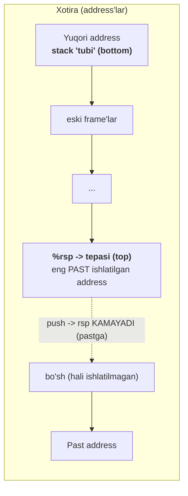
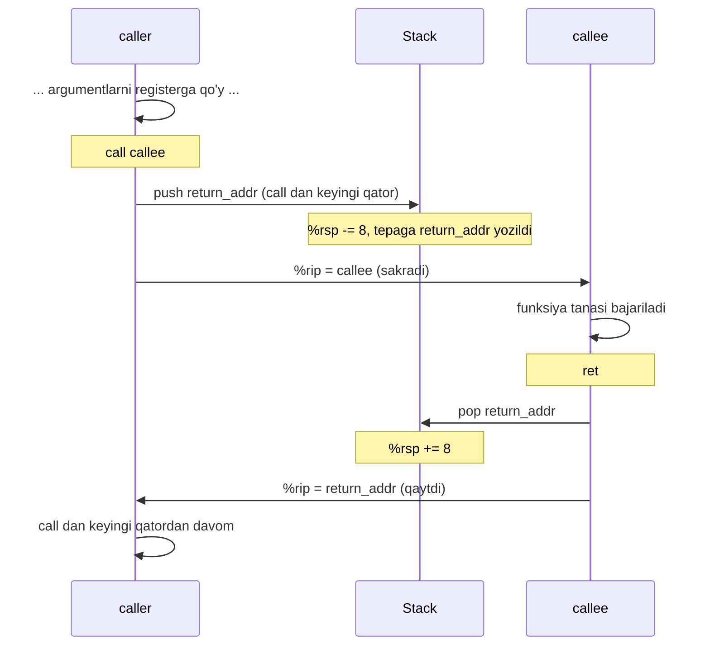
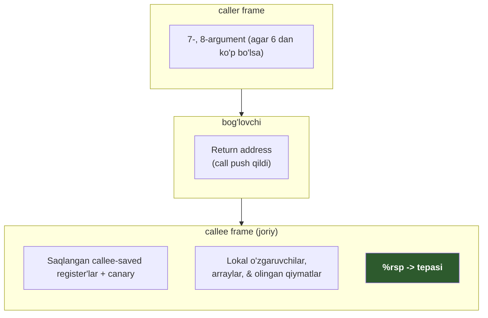
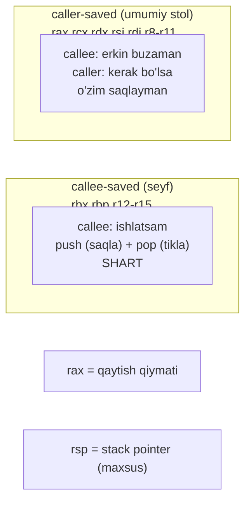
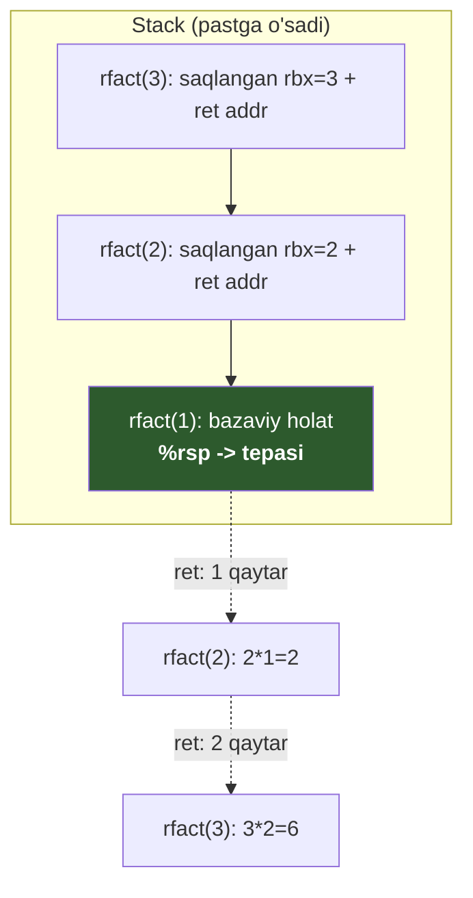
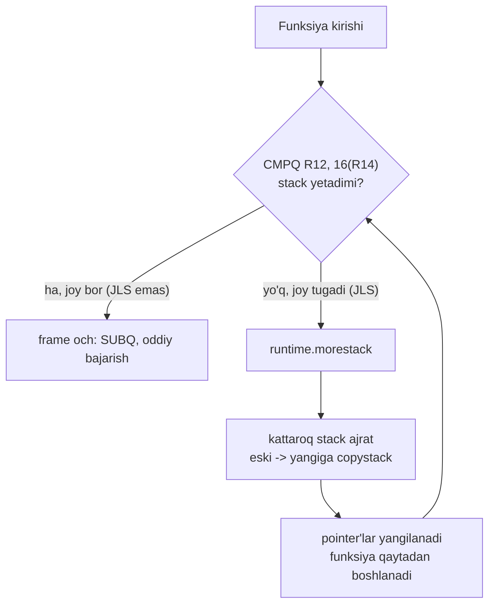

# 09. Procedures va Stack — call/ret, stack frame, calling convention

> Manba: CS:APP 2-nashr, 3.7, 3.13 · Muhit: Ubuntu 24.04 x86-64 (Docker), gcc 13.3.0, go 1.22.2 · [← Oldingi](08-machine-control-flow.md) · [Kurs xaritasi](00-README.md) · [Keyingi →](10-arrays-structs-pointers.md)

## Nima uchun kerak

Sen har kuni funksiya chaqirasan. Lekin `f(x)` apparatda "sehr" emas — bu **stack** ustidagi qat'iy protokol: argumentlar qayerga qo'yiladi, qaytish manzili qayerda saqlanadi, qaysi register'lar "meniki, tegma" deb belgilangan. Bu protokolni bilmasang, `panic` yoki `SIGSEGV` stack trace'ni o'qiy olmaysan — u shunchaki tushunarsiz manzillar ro'yxati bo'lib qoladi.

Ikkinchisi — **goroutine narxi**. Nega bitta OS thread ~8 MB stack yeydi, lekin million goroutine ishlata olasan? Chunki goroutine kichik stack bilan boshlanadi va kerak bo'lganda o'sadi. Bu o'sish (`morestack`, `copystack`) aynan shu darsdagi stack frame mexanikasi ustiga qurilgan. Buni bilsang, "goroutine leak" va stack overflow'larni tushunasan.

Uchinchisi — **debugging va security**. Stack overflow, recursion chuqurligi, buffer overflow (11-darsda), `defer` narxi — hammasi shu yerdan. Har bir `call` stack'ga qaytish manzili yozadi; shu manzilni buzsang — dastur boshqarilmay qoladi. Aynan shuning uchun kompilyator **stack canary** qo'yadi (buni ham ko'ramiz).

> Bu dars bitta g'oyaga tayanadi: funksiya chaqiruv = **stack ustidagi ijtimoiy shartnoma**. Kim argument qo'yadi, kim register saqlaydi, kim tozalaydi — hammasi oldindan kelishilgan. Shartnomani buzsang, kod ishlamaydi.

## Nazariya

### Stack — pastga o'sadigan idish (LIFO)

Avval eng oddiy modeldan boshlaymiz. **Stack** — bu xotiraning maxsus bo'lagi, u **LIFO** (Last In, First Out — oxirgi kirgan birinchi chiqadi) qoidasi bilan ishlaydi. Analogiya: ustma-ust taxlangan patnislar. Yangisini faqat **ustiga** qo'yasan, olganda ham faqat **ustidagisini** olasan.

Eng chalkash joyi shu: **stack pastga o'sadi**. Ya'ni yangi ma'lumot qo'shilganda address **kamayadi** (yuqori address -> past address). "Tepasi" (top) — bu eng **past** address. Bu intuitsiyaga zid, lekin apparatda shunday.

`%rsp` (stack pointer) register **doim stack'ning tepasini** (eng past ishlatilgan address'ni) ko'rsatadi. Bu — yagona haqiqat manbai: stack qayerda tugashini faqat `%rsp` biladi.



Diqqat: push qilsang `%rsp` **kamayadi** (pastga siljiydi), pop qilsang **ortadi** (yuqoriga qaytadi). Stack "o'sishi" = `%rsp` ning kamayishi.

### push va pop — notional machine

Endi apparat darajasiga tushamiz. `pushq` va `popq` aslida **ikki amalning qisqartmasi**. Bu ularning ichida ASLIDA nima sodir bo'lishi (notional machine):

| Instruksiya | Ma'nosi (2 qadam) |
|-------------|-------------------|
| `pushq S` | 1) `%rsp = %rsp - 8` &nbsp; 2) `M[%rsp] = S` |
| `popq D` | 1) `D = M[%rsp]` &nbsp; 2) `%rsp = %rsp + 8` |

Ya'ni `pushq %rbx`:
- avval `%rsp` ni 8 ga **kamaytiradi** (yangi joy ochadi, quad word = 8 bayt),
- keyin `%rbx` ning qiymatini o'sha yangi manzilga **yozadi**.

`popq %rbx` teskarisi: avval tepadagi qiymatni `%rbx` ga **o'qiydi**, keyin `%rsp` ni 8 ga **oshiradi** (joyni "ozod" qiladi — lekin qiymat xotirada qoladi, faqat endi u "stack tashqarisida").

> `push`/`pop` faqat qulaylik. Xuddi shu ishni `subq $8, %rsp; movq %rbx, (%rsp)` bilan qo'lda ham qilish mumkin. Kompilyator ko'pincha aynan shunday qiladi — bir marta katta joy ochib, keyin `mov` bilan to'ldiradi (buni `withframe` da ko'ramiz).

### call va ret — boshqaruvni uzatish mexanikasi

Bu darsning yuragi. `call` va `ret` — bu shunchaki "sakrash" emas. Ular stack'dan foydalanib **qaytish manzilini** saqlaydi va tiklaydi.

`call target` **ikki ish** qiladi (bu ham push!):
1. Keyingi instruksiyaning address'ini (return address) stack'ga **push** qiladi: `%rsp -= 8; M[%rsp] = return_addr`.
2. `%rip` ni `target` ga o'rnatadi (funksiya boshiga sakraydi).

`ret` teskarisini qiladi (bu ham pop!):
1. Stack tepasidan address'ni **pop** qiladi: `%rip = M[%rsp]; %rsp += 8`.
2. O'sha address'ga qaytadi — ya'ni `call` dan **keyingi** instruksiyaga.

Analogiya: kitob o'qiyotib telefon jiringladi. Sahifaga **xatcho'p** qo'yasan (return address'ni stack'ga push), telefonga javob berasan (funksiya bajariladi), keyin xatcho'p qo'ygan joyingdan davom etasan (ret). Xatcho'psiz — qayerda qolganingni unutasan.



Muhim: `ret` "qayerga qaytishni" **o'zi bilmaydi** — u shunchaki `%rsp` ko'rsatgan joydagi qiymatni oladi. Agar stack buzilgan bo'lsa (masalan buffer overflow return address'ni ustidan yozsa), `ret` xato joyga sakraydi. Butun exploit sinfi shundan chiqadi (11-darsda). Aynan shu xavf uchun kompilyator **stack canary** ixtiro qildi.

### Stack frame — bitta chaqiruvning shaxsiy ish stoli

Har bir aktiv funksiya chaqiruvi stack'da o'zining bo'lagini oladi — bu **stack frame** (chaqiruv kadri). Bu funksiyaning "shaxsiy ish stoli": uning qaytish manzili, saqlangan register'lari, lokal o'zgaruvchilari shu yerda.

Muhim tarixiy nuqta: kitob IA32 uchun `%ebp` (frame pointer) ni har frame'da ishlatadi. **x86-64 da bu eskirgan.** Zamonaviy gcc `%rbp` ni frame pointer sifatida ishlatmaydi (odatda) — hamma narsaga to'g'ridan-to'g'ri `%rsp` dan offset bilan murojaat qiladi. Frame o'lchami funksiya boshida **bir marta** `subq $N, %rsp` bilan ochiladi va oxirida `addq $N, %rsp` bilan yopiladi; orada `%rsp` **qimirlamaydi**. Bu — soddaroq va tezroq.



E'tibor ber: 7- va 8-argumentlar **caller** frame'ida (yuqorida), return address o'rtada, callee'ning ishlari pastda. Bu joylashuv butun System V shartnomasining asosi.

### Calling convention — 6 register, keyin stack

Endi eng amaliy qism: argumentlar **qayerga** qo'yiladi? IA32 da hamma argument stack'da edi (sekin — har biri xotiraga yozish). x86-64 da 16 ta register bor, shuning uchun **birinchi 6 ta butun/pointer argument register'da** uzatiladi. Bu — System V AMD64 ABI (Application Binary Interface — dasturlar orasidagi ikki tomonlama shartnoma).

| Argument # | 64-bit | 32-bit | Mnemonika |
|-----------|--------|--------|-----------|
| 1 | `%rdi` | `%edi` | **d**estination |
| 2 | `%rsi` | `%esi` | **s**ource |
| 3 | `%rdx` | `%edx` | **d**ata |
| 4 | `%rcx` | `%ecx` | **c**ounter |
| 5 | `%r8` | `%r8d` | 8 |
| 6 | `%r9` | `%r9d` | 9 |
| 7, 8, ... | **stack'da** | | `%rsp` dan offset bilan |
| **Qaytish qiymati** | `%rax` | `%eax` | **a**ccumulator |

Tartibni eslab qolish qiyin (`rdi, rsi, rdx, rcx, r8, r9`). Bir mnemonika: **"Diane's silk dress cost $89"** (Di-Si-D-C-8-9). 7-argumentdan boshlab stack'ga tushadi — chunki register tugadi.

> Oltin qoida: 1-6 argument register'da (tez), 7+ stack'da (sekin). Qaytish qiymati doim `%rax` da. Shuning uchun kam argumentli funksiya tez — hech narsa xotiraga tegmaydi.

### caller-saved vs callee-saved — register'lar kimniki?

Bitta muammo bor: register'lar — **umumiy resurs**, hammasi bo'lishib ishlatadi. `P` funksiya `Q` ni chaqirsa, `Q` register'larni o'zgartirishi mumkin. Agar `P` ga o'sha register'dagi qiymat `Q` dan **keyin** kerak bo'lsa-chi? Uni kim saqlaydi?

Yechim — register'larni ikki lagerga bo'lish, va shartnomada kim javobgarligini belgilash:

| Tur | Register'lar | Ma'nosi |
|-----|-------------|---------|
| **caller-saved** (chaqiruvchi saqlaydi) | `%rax`, `%rcx`, `%rdx`, `%rsi`, `%rdi`, `%r8`–`%r11` | callee bularni **erkin buzishi** mumkin. Kerak bo'lsa, **caller** o'zi chaqiruvdan oldin saqlaydi. |
| **callee-saved** (chaqiriladigan saqlaydi) | `%rbx`, `%rbp`, `%r12`–`%r15` | callee bularni ishlatsa, **avval stack'ga saqlab**, oxirida **tiklashi shart**. Caller uchun bular "buzilmaydi" deb kafolatlangan. |

Analogiya: mehmonxona xonasi. **caller-saved** = umumiy stol ustidagi narsalar — keyingi mehmon (callee) erkin ishlatadi, o'zingga kerak bo'lsa oldindan yig'ishtir. **callee-saved** = seyf — mehmon ishlatsa, ketishdan oldin xuddi topganidek qaytarib qo'yishi shart.



Amaliy natija: agar funksiya biror qiymatni **chaqiruvdan oshirib** eslab qolishi kerak bo'lsa (masalan recursion'da yoki call'dan keyin ishlatiladigan argument), kompilyator uni **callee-saved register'ga** (`%rbx` kabi) ko'chiradi va boshida `pushq %rbx`, oxirida `popq %rbx` qiladi. Buni `rfact` misolida ko'rasan.

### Red zone — leaf funksiya uchun 128 bayt

Yana bitta zamonaviy ABI qoidasi. `%rsp` ostidagi (undan **past** address'dagi) **128 bayt** maxsus himoyalangan hudud — bu **red zone**. **Leaf** funksiya (boshqa hech kimni chaqirmaydigan) bu joyni `%rsp` ni umuman qimirlatmasdan ishlatishi mumkin, chunki hech qanday `call` return address'ni bu yerga yozmaydi. Bu leaf funksiyalarda `subq`/`addq` prolog/epilogini tejaydi. Muhim: **Go bu ABI'ni ishlatmaydi va red zone yo'q** — buni Go bo'limida ko'ramiz.

## Kod va isbot

Quyidagi barcha listinglar konteynerda `gcc 13.3.0 -Og` bilan haqiqiy kompilyatsiya qilingan.

### 1-misol: call/ret va argument uzatish

Eng oddiy holat: bitta funksiya boshqasini chaqiradi.

```c
long callee(long a, long b)
{
    return a * b + 1;
}

long caller(void)
{
    return callee(3, 4);
}
```

`gcc -Og -S call.c`:

```asm
callee:
	endbr64
	imulq	%rsi, %rdi           ; rdi = a * b   (a=%rdi, b=%rsi)
	leaq	1(%rdi), %rax        ; rax = (a*b) + 1   (qaytish qiymati %rax da)
	ret
caller:
	endbr64
	movl	$4, %esi             ; 2-argument = 4  -> %esi
	movl	$3, %edi             ; 1-argument = 3  -> %edi
	call	callee               ; call: return addr'ni stack'ga push + callee'ga sakra
	ret                          ; callee'ning %rax natijasi to'g'ridan-to'g'ri qaytadi
```

Butun calling convention shu qisqa kodda. `caller` argumentlarni **register'ga** qo'yadi: `3 -> %edi` (1-argument), `4 -> %esi` (2-argument) — System V tartibi bo'yicha. `movl` (32-bit) ishlatiladi, chunki kichik konstanta uchun yetarli va yuqori 32 bitni nollaydi (06-darsdagi qoida).

`callee` — **leaf** funksiya: hech kimni chaqirmaydi, lokal o'zgaruvchisi yo'q. Shuning uchun **stack frame umuman kerak emas** — na `push`, na `subq %rsp`. Faqat register ishi: natija `%rax` da. `caller` esa natijani ushlab qolmaydi — `callee` ning `%rax` dagi qiymati `ret` orqali `caller` ning qaytish qiymati bo'lib o'tadi.

Eng muhim jihat — `call callee` ikki ish qiladi: return address'ni (ya'ni `caller` dagi `ret` ning address'i) stack'ga push qiladi VA `callee` ga sakraydi. `callee` dagi `ret` o'sha address'ni pop qilib qaytadi.

> Predict: agar `call callee` o'rniga `jmp callee` yozilsa nima bo'lardi?

<details>
<summary>Javob</summary>

`jmp` return address'ni push qilmaydi. `callee` dagi `ret` stack tepasidagi qiymatni olardi — lekin u endi `caller` ga tegishli emas (masalan `caller` ni chaqirgan funksiyaning return address'i). Natija: `callee` `caller` ga emas, xato joyga qaytardi. `call`/`ret` juftligi stack orqali bog'langan.
</details>

### 2-misol: 6 dan ko'p argument — 7-chi stack'da

Register'lar 6 ta. Argument ko'proq bo'lsa nima bo'ladi?

```c
long many(long a1, long a2, long a3, long a4,
          long a5, long a6, long a7, long a8)
{
    return a1 + a8;          /* birinchi va oxirgi */
}
```

`gcc -Og -S many.c`:

```asm
many:
	endbr64
	movq	%rdi, %rax           ; rax = a1  (1-argument register'da)
	addq	16(%rsp), %rax       ; rax += a8  (8-argument STACK'da!)
	ret
```

Mana chegara: `a1` register'da (`%rdi`), lekin `a8` **stack'da** — `16(%rsp)` da. Nega aynan 16?

`many` leaf funksiya, `%rsp` ni qimirlatmaydi. Stack tepasidan boshlab:
- `0(%rsp)` = **return address** (caller'ning `call` i qo'ygan),
- `8(%rsp)` = **a7** (7-argument),
- `16(%rsp)` = **a8** (8-argument).

Ya'ni 1-6 argument register'da (`%rdi %rsi %rdx %rcx %r8 %r9`), 7- va 8-argument **caller frame'ida** yashaydi, callee ularni offset bilan o'qiydi.

> Amaliy dars: **ko'p argumentli funksiya sekinroq** — 7-chidan har biri stack'ga yoziladi va o'qiladi (xotira murojaati). Shuning uchun issiq yo'ldagi funksiyalarni 6 argumentdan kam saqlash yoki struct pointer uzatish foydali.

### 3-misol: recursion va callee-saved register

Recursion stack'ning eng chiroyli namoyishi. Har rekursiv chaqiruv **o'z shaxsiy frame'ini** oladi.

```c
long rfact(long n)
{
    if (n <= 1)
        return 1;
    return n * rfact(n - 1);
}
```

`gcc -Og -S rfact.c`:

```asm
rfact:
	endbr64
	cmpq	$1, %rdi             ; n : 1
	jle	.L3                  ; n <= 1 bo'lsa -> bazaviy holat (tez yo'l)
	pushq	%rbx                 ; callee-saved %rbx ni SAQLA (faqat rekursiv shoxda!)
	movq	%rdi, %rbx           ; rbx = n   (rekursiv call'dan omon o'tsin)
	leaq	-1(%rdi), %rdi       ; rdi = n - 1  (keyingi chaqiruv argumenti)
	call	rfact                ; rfact(n-1)  -> natija %rax da
	imulq	%rbx, %rax           ; rax = n * rfact(n-1)
	popq	%rbx                 ; %rbx ni TIKLA
	ret
.L3:
	movl	$1, %eax             ; return 1  (%rbx ga tegmaydi -> leaf tez yo'l)
	ret
```

Mexanika: `n` `call rfact` dan **keyin** ham kerak (`n * rfact(n-1)`), lekin `call` natijasi `%rax` ni, argument `%rdi` ni buzadi. Yechim — `n` ni `%rbx` ga saqlash. `%rbx` **callee-saved**, ya'ni rekursiv chaqiruv uni buzmasligi **kafolatlangan**. Lekin `%rbx` ni ishlatish uchun `rfact` o'zi avval eski `%rbx` ni saqlashi kerak — shuning uchun `pushq %rbx` / `popq %rbx`.

Ikkita nozik detal:
- `pushq %rbx` **faqat rekursiv shoxda**. Bazaviy holat (`.L3`) `%rbx` ga tegmaydi — hech qanday push/pop yo'q, tez leaf yo'l.
- `pushq %rbx` ikki vazifani bajaradi: `%rbx` ni saqlaydi VA `%rsp` ni 8 ga siljitib stack'ni 16-baytga tekislaydi (`call` dan oldin talab qilinadi).

`rfact(3)` chaqirilganda stack shunday ochiladi (har rekursiv daraja `%rbx` + return address qo'shadi):



Har `ret` bitta frame'ni yopadi va natijani `%rax` da yuqoriga qaytaradi: `1 -> 2 -> 6`. **Stack chuqurligi = rekursiya chuqurligi.** 1000 daraja rekursiya = stack'da 1000 frame. Nazoratsiz recursion = stack tugaydi = overflow: C'da `SIGSEGV`, Go'da `goroutine stack exceeds` panic.

### 4-misol: stack frame + stack canary (himoya)

Endi lokal massiv kerak bo'lgan funksiya. Massiv register'ga sig'maydi — stack'da bo'lishi **shart**. Bu bizga haqiqiy stack frame VA zamonaviy himoya mexanizmini ko'rsatadi.

```c
long sum3(long *p);              /* tashqi funksiya */

long withframe(long x, long y, long z)
{
    long arr[3] = {x, y, z};     /* lokal massiv - stack'da bo'lishi SHART */
    return sum3(arr);
}
```

`gcc -Og -S frame.c`:

```asm
withframe:
	endbr64
	subq	$40, %rsp            ; STACK FRAME och: 40 bayt (massiv + canary + align)
	movq	%fs:40, %rax         ; STACK CANARY ni thread-local (%fs) dan o'qi
	movq	%rax, 24(%rsp)       ; canary'ni frame'ga yashir
	xorl	%eax, %eax           ; %rax ni tozala (canary sirini oqizmaslik)
	movq	%rdi, (%rsp)         ; arr[0] = x
	movq	%rsi, 8(%rsp)        ; arr[1] = y
	movq	%rdx, 16(%rsp)       ; arr[2] = z
	movq	%rsp, %rdi           ; &arr[0] -> sum3'ning 1-argumenti
	call	sum3@PLT             ; sum3(arr)
	movq	24(%rsp), %rdx       ; saqlangan canary'ni qaytadan o'qi
	subq	%fs:40, %rdx         ; original bilan solishtir
	jne	.L4                  ; agar FARQ bo'lsa -> stack buzilgan!
	addq	$40, %rsp            ; frame'ni yop (canary butun)
	ret
.L4:
	call	__stack_chk_fail@PLT ; canary buzilgan -> dasturni to'xtat
```

Bu misolda ikkita katta g'oya bor.

**Birinchi — haqiqiy stack frame.** `long arr[3]` register'ga sig'maydi (massiv, va uning address'i `sum3` ga uzatiladi). Shuning uchun `subq $40, %rsp` bilan stack'da joy ochiladi. Massiv elementlari `(%rsp)`, `8(%rsp)`, `16(%rsp)` ga yoziladi, `movq %rsp, %rdi` bilan massiv address'i `sum3` ga uzatiladi. Nega 40 bayt? 24 (massiv) + 8 (canary) = 32, lekin gcc 40 tanladi — `call` dan oldin `%rsp` ni 16-baytga tekislash uchun qo'shimcha 8 bayt (`withframe` kirishida `%rsp % 16 == 8`, `subq $40` uni `% 16 == 0` qiladi).

**Ikkinchi — stack canary (stack protector).** `movq %fs:40, %rax` — thread-local xotiradan (`%fs` segment) tasodifiy "qo'riqchi qiymat" olinadi va `24(%rsp)` ga qo'yiladi. Funksiya oxirida u qaytadan tekshiriladi (`subq %fs:40, %rdx; jne`). Agar biror buffer overflow (11-darsda) massivdan chiqib canary'ni bosgan bo'lsa — qiymat farq qiladi, `__stack_chk_fail` chaqiriladi va dastur **darhol to'xtaydi**. Bu — return address'ni himoya qilishning zamonaviy usuli: hujumchi return address'ga yetishdan oldin canary'ni buzishga majbur, bu esa aniqlanadi.

> Nega `%fs`? Bu — thread-local storage segment registeri (21-darsda batafsil). Har thread'ning o'z canary qiymati bor, shuning uchun uni oldindan bilib bo'lmaydi.

### 5-misol: GDB jonli sessiya — stack = return address'lar zanjiri

Endi eng kuchli isbot. Uch qavatli chaqiruv zanjirini jonli GDB'da to'xtatib, stack'ning ichiga qaraymiz.

```c
#include <stdio.h>

long leaf(long a, long b)
{
    return a + b * 2;
}

long middle(long x)
{
    return leaf(x, x + 1);
}

long top(long n)
{
    return middle(n) * 10;
}

int main(void)
{
    printf("%ld\n", top(5));
    return 0;
}
```

`csapp` konteyner (QEMU emulyatsiya) ichida gdb **jonli** debug qila olmaydi (ptrace yo'q). Shuning uchun alohida native arm64 konteyner + cross-compiler + qemu gdbserver ishlatiladi:

```
x86_64-linux-gnu-gcc -Og -g -static -o stack stack.c
qemu-x86_64 -g 1234 ./stack &
gdb-multiarch -q ./stack   # break leaf; continue; bt; info registers; x/3gx $rsp; disassemble leaf
```

Real GDB chiqishi (`leaf` da to'xtaganda):

```
Breakpoint 1, leaf (a=a@entry=5, b=b@entry=6) at stack.c:4

=== BACKTRACE (call zanjiri) ===
#0  leaf (a=a@entry=5, b=b@entry=6) at stack.c:4
#1  0x000000000040187b in middle (x=x@entry=5) at stack.c:10
#2  0x0000000000401885 in top (n=n@entry=5) at stack.c:15
#3  0x000000000040189f in main () at stack.c:20

=== ARGUMENT REGISTERLARI ===
rdi            0x5                 5
rsi            0x6                 6
rax            0x40188d            4200589
rsp            0x2aaaab2abc78      0x2aaaab2abc78

=== STACK TEPASI: return address'lar ===
0x2aaaab2abc78:	0x000000000040187b	0x0000000000401885
0x2aaaab2abc88:	0x000000000040189f

=== leaf DISASSEMBLY ===
Dump of assembler code for function leaf:
=> 0x0000000000401865 <+0>:	endbr64
   0x0000000000401869 <+4>:	lea    (%rdi,%rsi,2),%rax
   0x000000000040186d <+8>:	ret
End of assembler dump.
```

Bu chiqishni diqqat bilan solishtir. **STACK TEPASIDAGI uch qiymat** (`0x40187b`, `0x401885`, `0x40189f`) — bu **aynan** backtrace'dagi return address'lar:

| Stack address | Qiymat | = Kimning return address'i |
|---------------|--------|----------------------------|
| `0x...bc78` (`%rsp`) | `0x40187b` | `middle` ga qaytish (bt #1) |
| `0x...bc80` | `0x401885` | `top` ga qaytish (bt #2) |
| `0x...bc88` | `0x40189f` | `main` ga qaytish (bt #3) |

Ya'ni **stack — bu return address'lar zanjiri**, va backtrace shu zanjirni pastdan yuqoriga o'qiydi. Bu — har qanday panic/crash stack trace qanday hosil bo'lishining haqiqiy isboti. `runtime.Callers`, `pprof`, `panic` — hammasi shu return address zanjirini kuzatadi.

Yana e'tibor ber: `leaf` argumentlari register'da (`rdi=5`=a, `rsi=6`=b), va disassembly `leaf` uchun `lea (%rdi,%rsi,2),%rax` = `a + b*2` — bir instruksiya, stack'ga tegmaydi (leaf funksiya).

> Halol eslatma: `%rsp` bu yerda `0x2aaaab2abc78` — QEMU emulyatsiya artefakti. Native Linux'da stack address odatda `0x7fff...` bo'ladi. Address'ning aniq qiymati muhim emas — muhimi stack **tuzilishi** (return address zanjiri), u ikkala muhitda ham bir xil.

## Go dasturchiga ko'prik

### Go o'z ABI'sini ishlatadi — System V EMAS

Bu eng muhim tushuncha: Go **System V AMD64 ABI'ni ishlatmaydi**. Go 1.17 dan boshlab o'zining **register-based ABI** (ichki nomi `ABIInternal`) bor. Rasmiy Go ABI spetsifikatsiyasidan farqlar:

| Jihat | System V (C) | Go ABIInternal (amd64) |
|-------|--------------|------------------------|
| Integer arg register'lar | `rdi rsi rdx rcx r8 r9` (6 ta) | `rax rbx rcx rdi rsi r8 r9 r10 r11` (9 ta) |
| Qaytish qiymati | `%rax` | register'larda (bir nechta ham) |
| Goroutine pointer | — | **`%r14`** (doim joriy `g`) |
| Red zone | 128 bayt bor | **yo'q** |
| Stack alignment | 16 bayt | 8 bayt |
| Frame pointer | `%rbp` (odatda ishlatilmaydi) | `%rbp` (debug/profiling uchun saqlanadi) |

Shu sabab `go tool objdump` chiqishini System V C jadval bilan o'qisang chalkashasan — register tayinlashlar butunlay boshqa. Go `%r14` ni doim joriy goroutine (`g`) ga band qiladi, shuning uchun runtime har joyda (scheduler, GC, stack check) goroutine'ga tez murojaat qiladi.

### Go morestack prologi — stack check

Mana goroutine sirining javobi. Har bir Go funksiya (NOSPLIT'dan tashqari) prologida **stack check** bor. Buni haqiqiy misolda ko'ramiz — funksiya katta lokal massiv (1600 bayt) ochadi:

```go
package main

func big(x int64) int64 {
	var arr [200]int64
	arr[0] = x
	for i := 1; i < 200; i++ {
		arr[i] = arr[i-1] + 1
	}
	return arr[199]
}

func main() {
	println(big(1))
}
```

`go tool compile -S pro.go` (`main.big` qismi):

```
main.big STEXT size=110 args=0x8 locals=0x648
	TEXT	main.big(SB), ABIInternal, $1608-8
	CMPQ	R12, 16(R14)         ; kerakli stack chegarasi (R12) : g.stackguard0 (16(R14))
	JLS	93                   ; stack YETMASA -> morestack yo'liga sakra
	SUBQ	$1600, SP            ; frame och (200 * int64 = 1600 bayt)
	...
	RET
	CALL	runtime.morestack_noctxt(SB)   ; stack'ni o'stir, keyin big ni qaytadan boshla
```

Mexanizm (**contiguous stacks**, Go 1.4 dan):
1. Har funksiya kirishida kompilyator kerakli stack chegarasini (`R12`) `g.stackguard0` (`16(R14)`, `R14` = goroutine) bilan solishtiradi.
2. Stack yetmasa (`JLS`) -> `runtime.morestack_noctxt` chaqiriladi.
3. `morestack` **kattaroq** yangi stack ajratadi, eski stack'ni butunlay yangisiga **ko'chiradi** (`copystack`), pointer'larni yangilaydi.
4. Funksiya qayta boshlanadi — endi joy yetadi.



Shuning uchun goroutine **arzon**: kichik stack'dan boshlanib dinamik o'sadi. C thread'da esa stack **fiksatsiyalangan** (odatda 8 MB) — million thread = 8 TB, imkonsiz. Narxi — har funksiya kirishida kichik stack check (`CMPQ` + `JLS`), branch predictor uni 08-darsdagidek deyarli bepul bashorat qiladi.

### Goroutine stack o'sishini o'lchash

Endi o'sishni **haqiqatan ko'ramiz**. Chuqur rekursiya (har frame'da 256 bayt) goroutine stack'ini o'sishga majbur qiladi:

```go
package main

import (
	"fmt"
	"runtime"
)

func deep(n int, buf *[]uintptr) int {
	if n == 0 {
		var pc [1]uintptr
		runtime.Callers(1, pc[:])
		return 0
	}
	var pad [256]byte
	pad[0] = byte(n)
	return int(pad[0]) + deep(n-1, buf)
}

func main() {
	fmt.Printf("boshlang'ich goroutine stack: kichik (odatda 8 KB)\n")
	var buf []uintptr
	deep(1000, &buf)
	var m runtime.MemStats
	runtime.ReadMemStats(&m)
	fmt.Printf("StackInuse (barcha goroutine stack'lari) = %d KB\n", m.StackInuse/1024)
	fmt.Printf("StackSys   (OS'dan olingan)              = %d KB\n", m.StackSys/1024)
	fmt.Printf("goroutine soni = %d\n", runtime.NumGoroutine())
}
```

`go run gstack.go`:

```
boshlang'ich goroutine stack: kichik (odatda 8 KB)
StackInuse (barcha goroutine stack'lari) = 832 KB
StackSys   (OS'dan olingan)              = 832 KB
goroutine soni = 1
```

Faqat **bitta** goroutine bor (`main`), lekin uning stack'i 832 KB gacha o'sgan. `deep(1000)` har chaqiruvda 256 baytlik lokal (`pad[256]`) ochadi -> ~256 KB rekursiya chuqurligi kerak -> `morestack` bir necha marta ishga tushib stack'ni kichikdan ~832 KB gacha oshirgan. Bu — yuqoridagi `CMPQ R12, 16(R14); JLS` prologining amaldagi natijasi: goroutine stack **avtomatik va shaffof** o'sadi, sen hech narsa qilmaysan.

## Real-world scenariylar

**1. Panic/stack trace'ni o'qish.** Go'da panic bo'lganda ko'rasan: `main.leaf(...)` -> `main.middle(...)` -> `main.top(...)`. Bu aynan 5-misoldagi GDB backtrace — **stack'dagi return address'lar zanjiri**. Eng yuqoridagi qator (panic bo'lgan joy) — stack tepasiga eng yaqin, pastdagilar uni chaqirganlar. Bu darsdan keyin stack trace "sehr" emas: u `%rsp` dan yuqoriga qarab return address'lar ro'yxati. `runtime.Callers` (gstack.go da ishlatilgan) aynan shu zanjirni yig'adi.

**2. Cheksiz recursion vs infinite loop.** Xatoliq `for {}` (loop) va xatoliq recursion butunlay farq qiladi. Loop — nol xotira, abadiy aylanadi (CPU 100%). Recursion — **har chaqiruv stack yeydi** (3-misoldagi `pushq %rbx` + return address). Go'da avval stack o'sadi (gstack.go da ko'rganimizdek), keyin `maxstacksize` (odatda 1 GB) ga yetsa `runtime: goroutine stack exceeds 1000000000-byte limit` panic. Servisda "goroutine bir zumda o'ladi, RAM sakraydi" ko'rsang — ehtimol nazoratsiz recursion.

**3. Buffer overflow va stack canary.** 4-misoldagi `withframe` da ko'rgan `%fs:40` canary — buffer overflow himoyasining birinchi qatlami. Agar funksiya lokal massivga chegaradan tashqari yozsa (klassik `strcpy` bug), u return address'ga yetishdan oldin canary'ni bosadi. Funksiya qaytishda `__stack_chk_fail` bilan to'xtaydi — exploit o'rniga controlled crash. Bu 11-darsdagi buffer overflow mavzusining zamonaviy javobi; Go'da esa bounds check (08-darsdagi `s[i]`) bunday overflow'ni umuman oldini oladi.

## Zamonaviy yondashuv

Web tadqiqotidan sintez:

- **IA32 `%ebp`-frame o'lgan; x86-64 `%rsp`-relative default.** Kitobdagi "har frame'da `pushl %ebp; movl %esp, %ebp`" naqshi eskirgan — biror listingda ko'rmading. Zamonaviy gcc `%rbp` ni oddiy register sifatida bo'shatadi va hamma narsaga `%rsp` dan offset bilan murojaat qiladi. `%rbp` frame pointer'ni majburan qaytarish uchun `-fno-omit-frame-pointer` kerak (profiling'da foydali, lekin bitta register yo'qotadi).
- **Stack canary — default himoya.** Zamonaviy gcc/clang `-fstack-protector-strong` ni default yoqadi, shuning uchun massivli funksiyalarda `%fs:40` canary avtomatik chiqadi (4-misolda ko'rganingdek). Bu — 2011 kitobdan keyin standartlashgan; buffer overflow exploit'larni sezilarli qiyinlashtirdi.
- **Red zone signal-safe emas.** Red zone (128 bayt) faqat leaf funksiyalar uchun. Kernel kod va ba'zi signal handler'lar uni buzadi, shuning uchun kernel `-mno-red-zone` bilan kompilyatsiya qilinadi. Go umuman red zone ishlatmaydi (o'z signal/goroutine modeli).
- **Go register ABI (1.17+) real yutuq.** Argumentlarni stack o'rniga register'da uzatish Go funksiya chaqiruvlarini tezlashtirdi. `%r14` ni goroutine'ga band qilish GC va scheduler uchun tez `g` murojaati beradi.
- **QEMU emulyatsiya artefaktlari.** 5-misoldagi `0x2aaa...` stack address — Rosetta/QEMU ostida emulyatsiya natijasi (native x86-64 Linux'da `0x7fff...`). Address raqamlariga bog'lanma — stack tuzilishi (return address zanjiri) muhim, u har joyda bir xil.

## Keng tarqalgan xatolar

**1. "call shunchaki jump" deb o'ylash.** Yo'q. `call` = **push return address + jump**. `jmp` return address qoldirmaydi. Shuning uchun `jmp` bilan chaqirilgan funksiya `ret` qilsa — noto'g'ri (eski) address'ga qaytadi (1-misoldagi predict). `call`/`ret` juftligi stack orqali bog'langan.

**2. "ret qayerga qaytishni biladi" deb o'ylash.** `ret` hech narsani "bilmaydi" — u ko'r-ko'rona `%rsp` ko'rsatgan qiymatga sakraydi. Stack buzilsa (buffer overflow return address ustidan yozsa), `ret` hujumchi ko'rsatgan joyga sakraydi. Aynan shu xavf uchun stack canary (4-misol) ixtiro qilingan.

**3. caller-saved register'da qiymatni call'dan omon o'tkazmoqchi bo'lish.** `%rax`, `%rcx`, `%rsi`, ... call'dan keyin **buzilgan** deb hisobla. `rfact` `n` ni `%rdi` (caller-saved) da qoldirsa — rekursiv `call` uni buzardi. Shuning uchun u `n` ni callee-saved `%rbx` ga ko'chiradi va o'zi saqlaydi/tiklaydi.

**4. x86-64 da har funksiya `%rbp` frame pointer ochadi deb o'ylash (kitobdan).** Bu IA32 odat. x86-64 da gcc odatda `%rbp` ni ishlatmaydi — `%rsp`-relative ishlaydi (hamma listingda ko'rdik). Kitobdagi `pushl %ebp; movl %esp, %ebp` naqshini x86-64 ga ko'chirma.

**5. Go System V ABI ishlatadi deb o'ylash.** Yo'q. Go 1.17+ o'z register ABI'siga ega: integer argument'lar `rax rbx rcx rdi rsi r8-r11` da (System V `rdi rsi ...` emas), `%r14` = goroutine, red zone yo'q. `go tool objdump` chiqishini System V jadval bilan o'qisang chalkashasan.

**6. Ko'p argumentli funksiya "bepul" deb o'ylash.** 7-argumentdan har biri stack'ga yoziladi va o'qiladi (`16(%rsp)` — 2-misol). Millionlab chaqiruvda bu sezilarli xotira trafigi. 6 argumentdan kam saqlash yoki `struct` pointer uzatish tezroq.

## Amaliy mashqlar

**Mashq 1 (argument register'lari).** 1-misoldagi `caller` funksiyasi `callee(3, 4)` ni chaqiradi. `3` va `4` qaysi register'larga qo'yiladi va nega aynan shu tartibda?

<details>
<summary>Yechim</summary>

`3` -> `%edi` (1-argument), `4` -> `%esi` (2-argument). System V tartibi: 1-argument `%rdi`/`%edi`, 2-argument `%rsi`/`%esi`. Listingda `movl $4, %esi; movl $3, %edi`. `movl` (32-bit) yetarli, chunki kichik konstanta va yuqori 32 bit nollanadi.
</details>

**Mashq 2 (stack offset).** 2-misolda `a8` nega aynan `16(%rsp)` da? `a7` qayerda?

<details>
<summary>Yechim</summary>

`many` leaf funksiya, `%rsp` qimirlamaydi. Stack tepasidan: `0(%rsp)` = return address, `8(%rsp)` = a7, `16(%rsp)` = a8. Birinchi 6 argument register'da; 7- va 8-chi caller frame'ida, har biri 8 baytdan.
</details>

**Mashq 3 (callee-saved).** 3-misoldagi `rfact` nega `pushq %rbx` qiladi, va nega faqat rekursiv shoxda (bazaviy `.L3` da yo'q)?

<details>
<summary>Yechim</summary>

`n` `call rfact` dan keyin `n * ...` uchun kerak, lekin `call` `%rdi`/`%rax` ni buzadi. Shuning uchun `n` callee-saved `%rbx` ga saqlanadi; `%rbx` ni ishlatishdan oldin eskisini `pushq %rbx` bilan saqlash shart. Bazaviy holat (`.L3`) rekursiv chaqiruv qilmaydi va `%rbx` ga tegmaydi — shuning uchun push/pop kerak emas, tez leaf yo'l.
</details>

**Mashq 4 (stack canary).** 4-misolda `movq %fs:40, %rax` va oxiridagi `subq %fs:40, %rdx; jne .L4` nima vazifa bajaradi? Agar `jne` olinsa (farq bo'lsa) nima sodir bo'ladi?

<details>
<summary>Yechim</summary>

Bu — stack canary: boshida thread-local (`%fs`) tasodifiy qiymat frame'ga qo'yiladi, oxirida original bilan solishtiriladi. `jne` olinsa (canary o'zgargan = buffer overflow stack'ni buzgan), `__stack_chk_fail` chaqiriladi va dastur darhol to'xtaydi — exploit o'rniga controlled crash.
</details>

**Mashq 5 (stack = return address zanjiri).** 5-misolda stack tepasidagi `0x40187b` qiymati backtrace'ning qaysi frame'iga mos va u nimani anglatadi?

<details>
<summary>Yechim</summary>

`0x40187b` — backtrace #1 (`middle`) dagi address, ya'ni **`middle` ga qaytish manzili**. `leaf` `ret` qilganda shu address'ga qaytadi. Stack tepasidagi uch qiymat (`0x40187b`, `0x401885`, `0x40189f`) aynan bt'dagi return address'lar — stack return address'lar zanjiridan iborat.
</details>

**Mashq 6 (call/ret alignment).** `rfact` rekursiv shoxda `pushq %rbx` ikki vazifani bajaradi. Ikkinchisi (register saqlashdan tashqari) nima?

<details>
<summary>Yechim</summary>

Stack alignment. `rfact` kirishida `%rsp % 16 == 8`. `pushq %rbx` `%rsp` ni 8 ga kamaytiradi -> `% 16 == 0`, keyingi `call rfact` uchun 16-bayt tekislash talabi bajariladi. Ya'ni bitta `pushq` ham callee-saved'ni saqlaydi, ham stack'ni tekislaydi.
</details>

**Mashq 7 (Go stack).** gstack.go da faqat 1 goroutine bor, lekin `StackInuse = 832 KB`. Nega, va bu C thread'dan qanday farq qiladi?

<details>
<summary>Yechim</summary>

`deep(1000)` har chaqiruvda 256 baytlik lokal ochadi -> chuqur rekursiya goroutine stack'ini `morestack`/`copystack` orqali kichikdan ~832 KB gacha o'stirdi. Goroutine stack **dinamik** — kerak bo'lganda o'sadi. C thread stack'i **fiksatsiya** (odatda 8 MB, o'smaydi) — shuning uchun million goroutine mumkin, million thread esa imkonsiz.
</details>

## Cheat sheet

| Tushuncha | Nima | Eslab qolish |
|-----------|------|--------------|
| Stack yo'nalishi | pastga o'sadi (yuqori->past addr) | push = `%rsp` kamayadi |
| `%rsp` | doim stack tepasini (eng past addr) ko'rsatadi | yagona haqiqat manbai |
| `pushq S` | `%rsp -= 8; M[%rsp] = S` | joy och, yoz |
| `popq D` | `D = M[%rsp]; %rsp += 8` | o'qi, joy ozod qil |
| `call f` | return addr push + `%rip = f` | shunchaki jump EMAS |
| `ret` | return addr pop + qaytadi | `%rsp` ko'rsatgan joyga ko'r-ko'rona |
| Arg register'lar | `rdi rsi rdx rcx r8 r9` | 1-6, keyin stack |
| 7+ argument | stack'da (`8(%rsp)`, `16(%rsp)`...) | sekinroq |
| Qaytish qiymati | `%rax` | doim |
| caller-saved | `rax rcx rdx rsi rdi r8-r11` | callee erkin buzadi |
| callee-saved | `rbx rbp r12-r15` | ishlatsang saqla+tikla (push/pop) |
| Stack canary | `%fs:40` qo'yiladi, oxirida tekshiriladi | buffer overflow himoyasi |
| Stack alignment | `call` oldidan `%rsp % 16 == 0` | `subq $40` / `pushq` tekislaydi |
| Frame pointer | x86-64 da `%rbp` odatda YO'Q | `%rsp`-relative (kitob IA32 eskirgan) |
| Backtrace | stack'dagi return address zanjiri | panic trace shundan |
| **Go arg reg** | `rax bx cx di si r8-r11` | System V EMAS |
| **Go `%r14`** | joriy goroutine (g) | red zone yo'q, 8-byte align |
| **Go stack** | kichikdan `morestack`+`copystack` o'sadi | `CMPQ R12, 16(R14); JLS` |

## Qo'shimcha manbalar

- [System V AMD64 ABI (rasmiy PDF)](https://refspecs.linuxbase.org/elf/x86_64-abi-0.99.pdf) — argument register'lar, red zone, stack alignment, calling sequence rasmiy spetsifikatsiyasi.
- [Stack frame layout on x86-64 — Eli Bendersky](https://eli.thegreenplace.net/2011/09/06/stack-frame-layout-on-x86-64/) — x86-64 frame tuzilishi, red zone, `%rbp` ning zamonaviy roli, aniq misollar bilan.
- [Go internal ABI specification](https://go.dev/src/cmd/compile/abi-internal) — Go register ABI: integer arg register'lar, `%r14` = goroutine, alignment qoidalari (rasmiy).
- [How Stacks are Handled in Go — Cloudflare blog](https://blog.cloudflare.com/how-stacks-are-handled-in-go/) — goroutine stack o'sishi, segmented vs contiguous stacks, `morestack`/`copystack` ichki mexanizmi.
