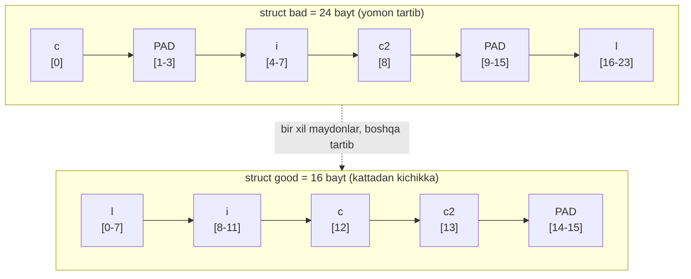
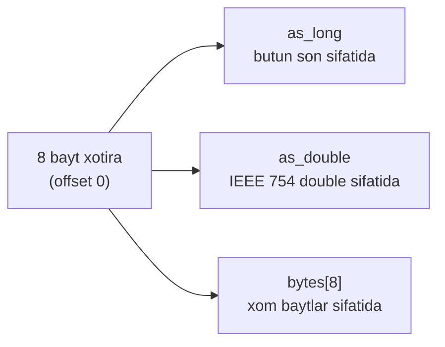
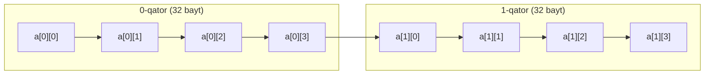

# 10. Arrays, Structs, Pointers — xotira layout mashina darajasida

> Manba: CS:APP 2-nashr, 3.8-3.10 · Muhit: Ubuntu 24.04 x86-64 (Docker), gcc 13.3.0, go 1.22.2 · [← Oldingi](09-procedures-stack.md) · [Kurs xaritasi](00-README.md) · [Keyingi →](11-gdb-buffer-overflow.md)

## Nima uchun kerak

Sen Go'da har kuni `struct` yozasan, lekin ikki bir xil struct 24 yoki 16 bayt yeyishi mumkinligini bilarmiding? Maydonlar tartibi — bu bir million elementli slice'da 8 MB farq. Bu darsda **nega slice qiymat sifatida uzatilsa ham "arzon"** (faqat header nusxasi), **nega ba'zi struct ikki goroutine'ni sekinlashtiradi** (false sharing) va **`fieldalignment` linter aslida nima topadi** degan savollarga mashina darajasida javob beramiz. Array indeksi, pointer arifmetika va struct maydon murojaati — barchasi bir xil narsaga: `base + offset` hisobiga aylanadi. Bir marta shu formulani ko'rsang, C, Go va Rust'dagi xotira layout'i seniki bo'ladi.

## Nazariya

### Array — ketma-ket bloklar

`T A[N]` deklaratsiyasi ikki ish qiladi: xotirada **ketma-ket** `L*N` bayt ajratadi (`L` — `T` tipining o'lchami) va `A` nomini massiv boshiga pointer sifatida beradi. Element `i` manzili oddiy formula bilan topiladi:

```
&A[i] = xA + L * i
```

Bu 06-darsdagi `Imm(rb,ri,s)` manzillash formulasining aynan o'zi: `base` registri `rb` = massiv boshi, `index` registri `ri` = `i`, `scale` `s` = element o'lchami. Shuning uchun `a[i]` uchun kompilyator alohida "massiv qidirish" kodi yozmaydi — bitta `mov` instruksiyasi manzilni ham hisoblaydi, ham o'qiydi. `char A[12]` uchun scale=1, `int E[]` uchun scale=4, `double C[6]` uchun scale=8. Ruxsat etilgan scale qiymatlari (1, 2, 4, 8) aynan keng tarqalgan primitiv tiplar o'lchamlariga to'g'ri keladi.

### `a[i]` bilan `*(a+i)` — bir xil narsa

C'da `A[i]` yozuvi `*(A+i)` bilan **aynan bir xil**. Ikkovi ham element manzilini hisoblab, keyin o'sha xotira joyiga murojaat qiladi. Demak array — bu shunchaki pointer arifmetika ustidagi qulay yozuv (syntactic sugar).

### Pointer arifmetika — `p+1` tip o'lchamiga qarab siljiydi

Bu yerda eng ko'p yangi o'rganuvchi qoqiladi. `p` pointer'i `T` tipga bo'lsa, `p+i` qiymati `xp + L*i` — ya'ni `i` element o'lchamiga **ko'paytiriladi**, baytga emas:

| Pointer tipi | `p+1` necha bayt siljiydi |
| ------------ | ------------------------- |
| `char *`     | +1 bayt                   |
| `short *`    | +2 bayt                   |
| `int *`      | +4 bayt                   |
| `long *`, `double *`, har qanday pointer | +8 bayt |

Mashina kodi esa **har doim baytlar bilan** ishlaydi. Shuning uchun kompilyator `p+1` ni ko'rganda, oshirishni tip o'lchamiga scale qiladi. Kitobdagi misolda ko'rsatilganidek, `Bptr += N` (N=16) C darajasida bitta element siljish, mashina darajasida esa `addl $64` (16*4=64 bayt) bo'ladi.

### `&a[i]` (leaq) vs `a[i]` (mov) — 07-darsdagi lea/mov, endi pointer uchun

Bu farqni 07-darsda `lea` bilan `mov` misolida ko'rgansan, endi u pointer kontekstida:

- `a[i]` — manzilni hisoblab, o'sha yerdan **o'qiydi**: `mov` (memory reference).
- `&a[i]` — faqat **manzilni hisoblaydi**, xotiraga tegmaydi: `lea` (address compute).

Ya'ni `&` operatori mashina kodida ko'pincha `leaq` ga aylanadi, chunki `lea` aynan manzil hisoblash uchun mo'ljallangan.

### 2D array — row-major layout

`T D[R][C]` — bu "massivlar massivi". Xotirada **row-major** tartibda joylashadi: avval 0-qatorning barcha elementlari, keyin 1-qator, va hokazo. Element manzili:

```
&D[i][j] = xD + L * (C*i + j)      (CS:APP 3.1-formula)
```

`C*i` — `i`-qatorgacha o'tilgan elementlar soni, `+j` — qator ichidagi ustun. Muhimi: `a[i][j]` va `a[i][j+1]` xotirada **yonma-yon** (cache uchun ideal), lekin `a[i][j]` va `a[i+1][j]` bir butun qator kenglikda uzoq. Bu 17-18-darsda cache uchun KRITIK bo'ladi.

### Struct — a'zolar ketma-ket, offset'larda

Struct ham array kabi **ketma-ket** xotira blokida saqlanadi, struct'ga pointer — uning birinchi baytining manzili. Kompilyator har struct tipi uchun har maydonning **byte offset**'ini biladi va maydon murojaatini shu offset displacement'i bilan hosil qiladi. Muhim tushuncha:

> Struct maydonini tanlash **to'liq compile-time**da hal bo'ladi. Mashina kodida maydon nomlari yoki deklaratsiya haqida hech qanday ma'lumot yo'q — faqat `base + offset`. Runtime'da "maydon qidirish" degan narsa umuman mavjud emas.

### Array struct ichida, struct struct ichida

Array struct ichiga **joylashtirilishi** mumkin, xuddi CS:APP'dagi `struct rec { int i; int j; int a[3]; int *p; }` kabi: `i`(0), `j`(4), `a[0..2]`(8, 12, 16), `p`(20) — jami 24 bayt. Bu yerda `&(r->a[i])` = `r + 8 + 4*i`: struct offset (8) ustiga array indeks (4*i) qo'shiladi. Struct struct ichiga ham joylashtirilishi mumkin — har holda hammasi bir chiziqli offset zanjiriga aylanadi. Muhimi: joylashtirilgan struct o'zining alignment talabini butun tashqi struct'ga "yuqtiradi".

### DATA ALIGNMENT — nega padding kerak

Ko'p apparat platformalari primitiv tip manzili ma'lum `K` ga (odatda 2, 4, 8) **karrali** bo'lishini talab qiladi. Sabab — protsessor-xotira interfeysini soddalashtirish. Masalan, protsessor har doim manzili 8 ga karrali 8 baytni bir marta o'qisa, `double` 8 ga align bo'lganida bitta xotira operatsiyasi yetadi. Aks holda qiymat ikki 8 baytli blok orasida bo'linib qolib, **ikki** o'qish kerak bo'ladi. Ba'zi SSE instruksiyalari esa align bo'lmagan ma'lumotda umuman ishlamaydi — exception bilan dastur tugaydi.

Shuning uchun kompilyator ikki qoidaga amal qiladi:

1. **Har a'zo o'z o'lchamiga align bo'ladi** — `int` offset'i 4 ga, `long`/pointer offset'i 8 ga karrali. Kerak bo'lsa oldiga **padding** (bo'sh baytlar) qo'yiladi.
2. **Struct butun holda eng katta a'zosiga align bo'ladi** — va oxiriga padding qo'shilishi mumkin, toki struct o'lchami shu align'ga karrali bo'lsin. Bu massivdagi har element bir xil align bo'lishi uchun shart.

Klassik misol — CS:APP'dagi `struct S1 { int i; char c; int j; }`: `i`(0-3), `c`(4), keyin `j` 4 ga align bo'lishi kerak, shuning uchun **3 bayt padding** (5-7), `j`(8-11). Jami 12 bayt, garchi ma'lumot atigi 9 bayt bo'lsa ham.

### Union — bir xotira, ko'p talqin

`union` sintaksisi struct'ga o'xshaydi, lekin semantikasi butunlay boshqa: barcha a'zolar **bir xil** xotira blokini ulashadi, hammasi offset 0 dan boshlanadi. Union o'lchami = eng katta a'zosining o'lchami. Union — C tip tizimini chetlab o'tib, bir xil baytlarni turli tip sifatida o'qish uchun. Bu 02-darsdagi "bits + context" g'oyasining rasmiy quroli: aynan bir xil 8 bayt `long` deb ham, `double` deb ham talqin qilinishi mumkin.

### Diagramma 1 — struct bad vs good xotira layout

Quyida darsning yuragi: bir xil 4 ta maydon, faqat TARTIB o'zgargan, natijada 24 vs 16 bayt.



`bad` da 10 bayt PADDING isrof (1-3 va 9-15), `good` da atigi 2 bayt (14-15). 33% farq — faqat maydonlarni qayta tartiblab.

## Kod va isbot

### 1-misol: array access va pointer arifmetika (arr.c)

```c
int get(int *a, long i)      { return a[i]; }
int *addr(int *a, long i)    { return &a[i]; }
long stride(long *a, long i) { return a[2*i + 1]; }
```

`gcc -Og -S arr.c`:

```asm
get:
	endbr64
	movl	(%rdi,%rsi,4), %eax
	ret
addr:
	endbr64
	leaq	(%rdi,%rsi,4), %rax
	ret
stride:
	endbr64
	salq	$4, %rsi
	movq	8(%rsi,%rdi), %rax
	ret
```

**Notional machine — satrlar ortida nima bo'ladi:**

- `get`: `a[i] = base + i*4` (int = 4 bayt). `(%rdi,%rsi,4)` — bu 06-darsdagi `Imm(rb,ri,s)` formulasi: `rb=%rdi` (massiv boshi), `ri=%rsi` (i), `s=4`. `movl` bilan manzilni hisoblaydi VA o'qiydi.
- `addr`: `&a[i]` — **aynan shu manzil**, lekin `leaq` bilan faqat HISOBLAYDI, o'qimaydi. Bu 07-darsdagi lea vs mov farqi, endi pointer kontekstida.
- `stride`: `a[2*i+1]`, long = 8 bayt. `salq $4` = `i*16` (2*i*8), keyin `8(%rsi,%rdi)` = `base + i*16 + 8` = `base + (2i+1)*8`. Kompilyator formulani soddalashtirdi — `2*i+1` ni alohida ko'paytirmadi.

### 2-misol: struct padding (st.c) — darsning yuragi

```c
#include <stdio.h>

struct bad {
    char  c;      /* 1 bayt */
    int   i;      /* 4 bayt */
    char  c2;     /* 1 bayt */
    long  l;      /* 8 bayt */
};

struct good {
    long  l;      /* 8 */
    int   i;      /* 4 */
    char  c;      /* 1 */
    char  c2;     /* 1 */
};

int main(void)
{
    printf("struct bad  = %zu bayt\n", sizeof(struct bad));
    printf("struct good = %zu bayt\n", sizeof(struct good));
    printf("offset bad.c=%zu i=%zu c2=%zu l=%zu\n",
           __builtin_offsetof(struct bad, c),
           __builtin_offsetof(struct bad, i),
           __builtin_offsetof(struct bad, c2),
           __builtin_offsetof(struct bad, l));
    return 0;
}
```

`gcc -Og -o st st.c && ./st`:

```
struct bad  = 24 bayt
struct good = 16 bayt
offset bad.c=0 i=4 c2=8 l=16
```

**Qadam-baqadam hisob (bad):**

| Maydon | Talab qilingan align | Offset | Izoh |
| ------ | -------------------- | ------ | ---- |
| `c`    | 1                    | 0      | boshidan |
| PADDING | —                   | 1-3    | `i` ni 4 ga align qilish uchun 3 bayt |
| `i`    | 4                    | 4-7    | 4 ga karrali |
| `c2`   | 1                    | 8      | keyingi bayt |
| PADDING | —                   | 9-15   | `l` ni 8 ga align qilish uchun 7 bayt |
| `l`    | 8                    | 16-23  | 8 ga karrali |

Jami 24 bayt. `good` da esa `l`(0-7), `i`(8-11), `c`(12), `c2`(13), keyin struct eng katta a'zoga (8) align bo'lishi uchun 14-15 padding = **16 bayt**. Bir xil 4 ta maydon, faqat tartib — 24 vs 16.

> Oltin qoida: har a'zo o'z o'lchamiga align, struct eng katta a'zoga align. Maydonlarni **kattadan kichikka** tartiblab padding'ni minimallashtir.

### 3-misol: struct maydoniga murojaat (field.c)

```c
struct point { long x; long y; };

long getx(struct point *p) { return p->x; }
long gety(struct point *p) { return p->y; }
void setxy(struct point *p, long a, long b) { p->x = a; p->y = b; }
```

`gcc -Og -S field.c`:

```asm
getx:
	endbr64
	movq	(%rdi), %rax
	ret
gety:
	endbr64
	movq	8(%rdi), %rax
	ret
setxy:
	endbr64
	movq	%rsi, (%rdi)
	movq	%rdx, 8(%rdi)
	ret
```

**Izoh:** `struct point` ikki `long`: `x` offset 0, `y` offset 8. `p->x` = `(%rdi)` (base+0), `p->y` = `8(%rdi)` (base+8). Struct maydoni — bu compile-time'da ma'lum bitta OFFSET, xolos. `setxy` da `%rsi` (a) `(%rdi)` ga, `%rdx` (b) `8(%rdi)` ga yoziladi — argumentlar 09-darsdagi calling convention bo'yicha `%rdi, %rsi, %rdx` da kelgani ko'rinib turibdi.

### 4-misol: 2D array row-major (mat.c)

```c
#define N 4
long get2d(long a[N][N], long i, long j)
{
    return a[i][j];
}
```

`gcc -Og -S mat.c`:

```asm
get2d:
	endbr64
	salq	$5, %rsi
	addq	%rsi, %rdi
	movq	(%rdi,%rdx,8), %rax
	ret
```

**Izoh:** `a[i][j] = base + (i*N + j)*8`, N=4.

- `salq $5, %rsi` = `i*32` — bitta qator = N*8 = 4*8 = 32 bayt, demak `i*32` = `i`-qator boshigacha bo'lgan siljish.
- `addq %rsi, %rdi` = `base + i*32` — `i`-qatorning boshi.
- `(%rdi,%rdx,8)` = `+ j*8` — qator ichida `j`-ustun.

Row-major bo'lgani uchun `a[i][j]` va `a[i][j+1]` xotirada 8 bayt yonma-yon, lekin `a[i][j]` va `a[i+1][j]` 32 bayt uzoq. Bu farq 18-darsda cache miss'lar sabab bo'ladi.

### 🤔 O'ylab ko'r

> Agar `mat.c` da `long` o'rniga `int` (4 bayt) ishlatsak, `salq $5` (i*32) qanday o'zgaradi?

<details>
<summary>💡 Javobni ko'rish</summary>

Bir qator endi `N*4` = `4*4` = 16 bayt, demak `i`-qator siljishi `i*16` bo'ladi — `salq $5` (i*32) o'rniga `salq $4` (i*16), va oxirgi indeks scale `8` o'rniga `4` bo'ladi. Formula bir xil (`base + (N*i+j)*size`), faqat `size` 8 dan 4 ga o'zgardi.
</details>

### 5-misol: union (un.c)

```c
#include <stdio.h>
union value {
    long   as_long;
    double as_double;
    char   bytes[8];
};
int main(void)
{
    union value v;
    v.as_long = 4614256650576692846L;  /* 3.14 ning bitlari */
    printf("as_long   = %ld\n", v.as_long);
    printf("as_double = %g\n", v.as_double);
    printf("sizeof(union) = %zu (eng katta a'zo)\n", sizeof(union value));
    return 0;
}
```

`gcc -Og -o un un.c && ./un`:

```
as_long   = 4614256650576692846
as_double = 3.14159
sizeof(union) = 8 (eng katta a'zo)
```

**Izoh:** union'da BARCHA a'zolar bir xil xotirani ulashadi (offset 0). O'lcham = eng katta a'zo (8 bayt). Aynan bir xil 8 bayt `as_long` deb ham, `as_double` deb ham o'qiladi — 05-darsdagi IEEE 754: `4614256650576692846` bit shabloni = `3.14159` double. Bu 02-darsdagi "bits + context" g'oyasining C tildagi rasmiy quroli.

### Diagramma 2 — union: bir xotira, uch talqin



### Diagramma 3 — 2D array row-major xotirada



Xotira chiziqli: qatorlar ketma-ket. `a[0][3]` dan keyin darhol `a[1][0]` keladi. Shuning uchun qator bo'ylab yurish tez, ustun bo'ylab sakrash sekin.

## Go dasturchiga ko'prik

### Go struct layout — C bilan AYNAN bir xil

Eng muhim tushuncha: Go struct layout C bilan bir xil alignment qoidasiga bo'ysunadi. (layout.go):

```go
type Bad struct {
	c  byte  // 1
	i  int32 // 4
	c2 byte  // 1
	l  int64 // 8
}

type Good struct {
	l  int64 // 8
	i  int32 // 4
	c  byte  // 1
	c2 byte  // 1
}
```

`go run layout.go`:

```
Bad  = 24 bayt
Good = 16 bayt
Bad offsetlar:  c=0 i=4 c2=8 l=16
Good offsetlar: l=0 i=8 c=12 c2=13
```

Bu C'dagi `st.c` bilan **aynan bir xil raqamlar** — Bad=24, Good=16, offsetlar bir xil. Demak Go'da ham maydonlarni kattadan kichikka tartiblab RAM tejash mumkin. Buni qo'lda emas, `fieldalignment` linter avtomatik topadi:

```
go install golang.org/x/tools/go/analysis/passes/fieldalignment/cmd/fieldalignment@latest
fieldalignment -fix ./...
```

Linter ikki narsani optimallashtiradi: struct o'lchamini (padding kamaytirish) va garbage collector uchun pointer maydonlarni oldinga surish.

### 🤔 O'ylab ko'r

> Go'da `struct { a bool; b int64; c bool }` necha bayt bo'ladi va uni qanday qayta tartiblab kichraytirasan?

<details>
<summary>💡 Javobni ko'rish</summary>

Original: `a`(0), keyin `b` 8 ga align uchun pad 1-7, `b`(8-15), `c`(16), struct 8 ga align uchun pad 17-23 = **24 bayt**.

Qayta tartiblangan `struct { b int64; a bool; c bool }`: `b`(0-7), `a`(8), `c`(9), pad 10-15 = **16 bayt**. Kattadan kichikka — 24 dan 16 ga.
</details>

### Slice va string header — nega "arzon" uzatiladi

Go slice qiymat sifatida uzatilsa ham nima uchun tez? Chunki slice — bu kichik header struct (slice.go):

```
slice header hajmi = 24 bayt (ptr+len+cap)
len=3 cap=10 ptr!=0: true
string header hajmi = 16 bayt (ptr+len)
```

Go slice = 3 word `struct {ptr, len, cap}` = 24 bayt. String = 2 word `struct {ptr, len}` = 16 bayt. Slice yoki string'ni funksiyaga qiymat sifatida uzatganda faqat shu 24/16 baytli header nusxalanadi — ostidagi million elementli massiv EMAS. Bu 09-darsdagi calling convention bilan bog'liq: katta struct'ni qiymat sifatida uzatma, header yoki pointer uzat. `append` cap'dan oshganda esa yangi massiv ajratib, ptr'ni yangi joyga ko'chiradi.

| Tip | Header o'lchami | Ichi |
| --- | --------------- | ---- |
| slice | 24 bayt | ptr + len + cap |
| string | 16 bayt | ptr + len (immutable) |
| interface | 16 bayt | type + data pointer |

### Go'da bo'sh struct 0 bayt

`struct{}` bo'sh tip Go'da **0 bayt** egallaydi. Shuning uchun `map[string]struct{}` — bu set'ni tuzishning eng arzon usuli (qiymat xotira olmaydi) va `chan struct{}` — signal channel'i uchun ideal.

### False sharing teaser (18-darsda chuqurroq)

Cache line odatda **64 bayt**. Agar ikki goroutine bir struct'ning yonma-yon ikki maydonini yozsa va ular bir cache line'ga tushsa, protsessorlar cache coherence protokoli tufayli bir-birining cache'ini doim invalidatsiya qiladi — bu **false sharing**. Yechim: maydonlar orasiga padding qo'yib, ularni alohida cache line'ga surish. Bu 18-darsda cache mavzusida to'liq ochiladi.

## Real-world scenariylar

**1. Million elementli struct slice — 33% RAM.** Aytaylik, DB satrini ifodalovchi struct'ing bor va uni `[]Row` da 10 million saqlayapsan. Yomon tartibda 24 bayt/element = 240 MB, yaxshi tartibda 16 bayt/element = 160 MB. Bir marta `fieldalignment -fix` — 80 MB tejaldi, cache miss'lar kamaydi, iteratsiya tezlashdi. Bu shunchaki "chiroyli kod" emas, o'lchanadigan tejamkorlik.

**2. False sharing — ikki hisoblagich.** Ikki goroutine `struct { a int64; b int64 }` ning `a` va `b` maydonlarini alohida yozadi. Ular bir 64 baytli cache line'da bo'lgani uchun har yozuv boshqa yadroning cache'ini invalidatsiya qiladi — kod parallel bo'lsa ham ketma-ketdan sekin. Yechim: maydonlar orasiga `_ [56]byte` padding qo'yib, ularni alohida cache line'ga ajratish (18-darsda o'lchaymiz).

**3. Binary protocol / mmap fayl.** Tarmoq paketi yoki disk formatini struct'ga to'g'ridan-to'g'ri map qilmoqchisan (`(*Header)(unsafe.Pointer(&buf[0]))`). Bu yerda padding — jiddiy tuzoq: kompilyator qo'ygan yashirin padding baytlar tashqi formatdagi joylashuvni buzadi. Shuning uchun bunday struct'larda maydonlarni qo'lda align qilib, yoki aniq o'lchamli tiplar (`uint32`, `uint8`) bilan padding'ni o'zing boshqarishing kerak. Endianness ham bu yerda muhim (02-darsda ko'rgan `show_bytes`).

## Zamonaviy yondashuv

`fieldalignment` linter (`golang.org/x/tools`) `go vet -fieldalignment ./...` orqali ham ishlaydi va struct'ni kichraytirish yo'lini avtomatik ko'rsatadi hamda `-fix` bilan tuzatadi. Best practice: maydonlarni **kattadan kichikka** tartibla, pointerlarni oldinga qo'y (GC scan'ni tezlashtiradi).

Rust bu muammoni boshqacha yechadi: default'da kompilyator maydonlarni **avtomatik** qayta tartiblab padding'ni minimallashtiradi. Faqat `#[repr(C)]` yozsang, C bilan bir xil (deklaratsiya tartibida) layout kafolatlanadi — bu FFI va binary format uchun kerak.

Yuqori unumdorlikda cache line (64 bayt) markaziy: false sharing'ni bartaraf qilish uchun issiq maydonlar orasiga padding qo'yiladi. C'da bu `#pragma pack` bilan aralashtirilmasligi kerak — `#pragma pack(1)` padding'ni umuman o'chiradi, bu binary format uchun foydali, lekin align bo'lmagan murojaat ba'zi platformalarda sekin yoki xato.

Data-oriented design'da esa **array-of-structs (AoS)** o'rniga **struct-of-arrays (SoA)** ishlatiladi: `[]Point{x,y,z}` o'rniga `Xs []float, Ys []float, Zs []float`. Faqat `x` bo'ylab yurganda hamma cache line to'la kerakli ma'lumot bilan to'ladi — bu 18-darsdagi cache tamoyillarining amaliy natijasi.

## Keng tarqalgan xatolar

**1. "Struct hajmi = a'zolar yig'indisi."** Yo'q — padding bor. `struct bad` 4 ta maydon (1+4+1+8=14 bayt ma'lumot) lekin **24 bayt** egallaydi. Har doim `sizeof`/`unsafe.Sizeof` bilan tekshir.

**2. Maydon tartibi ahamiyatsiz deb o'ylash.** Aynan bir xil maydonlar 24 yoki 16 bayt bo'lishi mumkin — faqat tartib. Katta slice'larda bu jiddiy farq.

**3. `pointer + 1 = +1 bayt` deb o'ylash.** Yo'q — `p+1` tip o'lchamiga scale qilinadi. `int *p; p+1` = +4 bayt, `long *q; q+1` = +8 bayt. Mashina kodi buni avtomatik ko'paytiradi.

**4. Union'da bir a'zo yozib boshqasini o'qish portativ deb o'ylash.** Bu endianness (little vs big) va padding'ga bog'liq. `un.c` da `long`→`double` bir mashinada ishlaydi, lekin ikki `unsigned` dan `double` yasashda qaysi yarim yuqori bit bo'lishi endianness'ga qarab o'zgaradi (02-darsdagi bayt tartibi).

**5. 2D array ustun bo'ylab yurish.** `for j { for i { a[i][j] } }` — har qadamda C*size bayt sakraysan, har element yangi cache line. Row-major'da doim tashqi indeks (qator) ustidan yur. Bu 18-darsda o'lchanadigan sekinlashuv.

## Amaliy mashqlar

**1. (Oson — Modify) Struct hajmini qo'lda hisobla.** `struct { char a; long b; int c; }` uchun har maydon offset'i va jami o'lchamni hisobla.

<details>
<summary>💡 Yechim</summary>

`a`(0), `b` 8 ga align uchun pad 1-7, `b`(8-15), `c`(16-19), struct 8 ga align uchun pad 20-23. **Jami 24 bayt**, alignment 8. (`st.c` dagi `bad` bilan bir xil tuzilma.)
</details>

**2. (Oson — Modify) Uni qayta tartibla.** Yuqoridagi struct'ni padding minimal bo'ladigan tartibda qayta yoz va yangi o'lchamni ayt.

<details>
<summary>💡 Yechim</summary>

`struct { long b; int c; char a; }`: `b`(0-7), `c`(8-11), `a`(12), struct 8 ga align uchun pad 13-15. **Jami 16 bayt**. Kattadan kichikka — 24 dan 16 ga tushdi.
</details>

**3. (O'rta — hisob) Aralash struct.** `struct { char a; double b; char c; short d; char e; }` — offset'lar va o'lchamni topib, keyin minimallashtir.

<details>
<summary>💡 Yechim</summary>

Original: `a`(0), pad 1-7, `b`(8-15), `c`(16), pad 17, `d`(18-19), `e`(20), pad 21-23 = **24 bayt**.
Minimal: `double b`(0-7), `short d`(8-9), `char a`(10), `char c`(11), `char e`(12), pad 13-15 = **16 bayt**.
</details>

**4. (O'rta — address hisob) 2D array.** `long a[3][4]` boshi `xA`. `&a[2][3]` manzilini formula bilan hisobla.

<details>
<summary>💡 Yechim</summary>

`&a[i][j] = xA + 8*(4*i + j)` = `xA + 8*(4*2 + 3)` = `xA + 8*11` = **`xA + 88`**.
</details>

**5. (O'rta — pointer arifmetika) Faded example, to'ldir.** `int *p` manzili `0x1000`, `long *q` manzili `0x2000`.

```
p + 3  = 0x1000 + ___ = ___     // TODO: int scale
q + 3  = 0x2000 + ___ = ___     // TODO: long scale
```

<details>
<summary>💡 Yechim</summary>

`p+3` = `0x1000 + 3*4` = `0x1000 + 12` = **`0x100C`**.
`q+3` = `0x2000 + 3*8` = `0x2000 + 24` = **`0x2018`**.
Pointer arifmetika har doim tip o'lchamiga scale qilinadi.
</details>

**6. (O'rta — union) O'lchamni topib.** `union { int i; char b[8]; double d; }` necha bayt?

<details>
<summary>💡 Yechim</summary>

O'lcham = eng katta a'zo = `max(4, 8, 8)` = **8 bayt**, alignment 8. Barcha a'zolar offset 0 dan boshlanadi (`un.c` bilan mos).
</details>

**7. (Qiyin — Make) Go'da o'zing yoz.** `unsafe.Sizeof` va `unsafe.Offsetof` ishlatib, o'zingning `struct { flag bool; id int64; kind byte; count int32 }` uchun o'lcham va offsetlarni chop etuvchi dastur yoz, keyin `fieldalignment -fix` bilan taqqosla.

<details>
<summary>💡 Hint</summary>

Yomon tartibda: `flag`(0), pad 1-7, `id`(8-15), `kind`(16), `count` 4 ga align uchun pad 17-19, `count`(20-23), pad 24-... aslida struct 8 ga align uchun 24-31 = **32 bayt**. Kattadan kichikka (`id int64`, `count int32`, `flag bool`, `kind byte`) qilsang **16 bayt**. `layout.go` shablonidan foydalanib chop et va linter tavsiyasi bilan solishtir.
</details>

## Cheat sheet

| Tushuncha | Nima | Eslab qolish |
| --------- | ---- | ------------ |
| Array access | `&a[i] = base + i*size` | 06-darsdagi `Imm(rb,ri,s)` |
| `a[i]` vs `*(a+i)` | Aynan bir xil | Array = pointer sugar |
| Pointer `p+1` | `+size` bayt, `+1` emas | `int*`→+4, `long*`→+8 |
| `&a[i]` vs `a[i]` | `leaq` (hisob) vs `mov` (o'qish) | 07-darsdagi lea/mov |
| 2D row-major | `&D[i][j] = base + size*(C*i+j)` | Qatorlar ketma-ket |
| Struct maydon | compile-time `base + offset` | Runtime'da qidiruv yo'q |
| Alignment (a'zo) | Har a'zo o'z o'lchamiga | `int`→4, `long`→8 |
| Alignment (struct) | Eng katta a'zoga, oxirida padding | Massiv elementlari uchun |
| Padding kamaytirish | Maydonlarni kattadan kichikka | `fieldalignment -fix` |
| Union | Bir xotira, o'lcham = eng katta | Offset hammasi 0 |
| Go slice / string | 24 bayt / 16 bayt header | ptr+len+cap / ptr+len |
| Bo'sh `struct{}` | 0 bayt | `map[K]struct{}` = set |
| Cache line | 64 bayt | False sharing = padding (18-dars) |

## Qo'shimcha manbalar

- [Go Optimization Guide — Struct Field Alignment](https://goperf.dev/01-common-patterns/fields-alignment/) — Go'da padding/alignment va `fieldalignment` bo'yicha amaliy qo'llanma.
- [fieldalignment package — pkg.go.dev](https://pkg.go.dev/golang.org/x/tools/go/analysis/passes/fieldalignment) — rasmiy linter hujjati, o'rnatish va `-fix` ishlatish.
- [A Guide to False Sharing — Baeldung](https://www.baeldung.com/java-false-sharing-contended) — false sharing va cache line padding tushunchasi (18-darsga tayyorlik).
