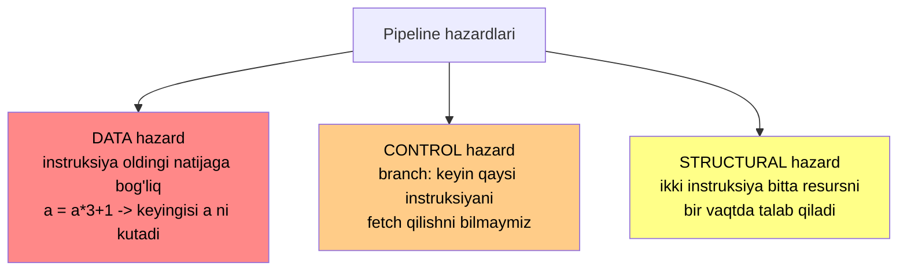
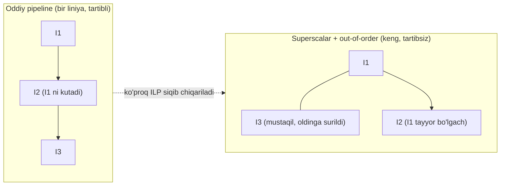

# 12. CPU Pipeline — konveyer, hazardlar, branch prediction

> Manba: CS:APP 2-nashr, 4-bob (pipelining printsiplari) · Muhit: assembly x86-64 (gcc 13.3.0); performance o'lchovlari native arm64 (QEMU pipeline'ni ko'rsatmaydi) · [← Oldingi](11-gdb-buffer-overflow.md) · [Kurs xaritasi](00-README.md) · [Keyingi →](13-compiler-optimization.md)

## Nima uchun kerak

Ikkita kod **bir xil** ishni bajaradi — bir xil sonlar, bir xil amallar soni — lekin biri 2 barobar tez ishlaydi. Nega? Chunki CPU instruksiyalarni konveyerda bajaradi va **branch**ni oldindan bashorat qiladi; bashorat adashsa, boshlangan ishning hammasi axlatga chiqadi. Xuddi shu sabab: **saralangan** massiv ustidagi sikl saralanmaganidan tezroq — CPU bashoratni osonroq qiladi. Profilerda `branch-misses` yoki `stalled-cycles` ko'rsang, sabab shu yerda: pipeline to'lmay ishlayapti.

Bu bilim yana bir tarixiy voqeani tushuntiradi: 2018-yilda **Spectre/Meltdown** butun sanoatni larzaga soldi — CPU'ning speculative execution mexanizmi (branch'ni oldindan bajarish) ma'lumot sizdirar ekan. Buni bilmasang, nega Linux/Windows patch'lari ba'zi serverlarni sekinlashtirganini ham tushunolmaysan.

> **Qisqartirilgan dars.** Bu kitobning 4-bobidan faqat **mental model**ni oladi: Y86 ISA va HCL apparat tili detallari backend dev'ga kerak emas. Maqsad — pipeline, hazard va branch prediction'ni **his qilish**, keyin 13-14-darslardagi optimizatsiyaning nega ishlashini tushunish.

## Nazariya

### 1. Nega pipeline — zavod konveyeri

Tasavvur qil: bitta mashina yasashda 5 bosqich bor — kuzov, dvigatel, g'ildirak, bo'yoq, tekshiruv. **Konveyersiz** zavod bitta mashinani boshdan-oxir tugatib, keyingisini boshlaydi. Har bosqich stansiyasi ishlagan paytda qolgan 4 stansiya **bo'sh turadi** — isrof.

**Konveyer** g'oyasi: har stansiya to'xtovsiz ishlasin. 1-mashina bo'yoqqa o'tganda, 2-mashina g'ildirakda, 3-mashina dvigatelda bo'ladi — hammasi **parallel**. Bitta mashina baribir 5 bosqichni bosib o'tadi, lekin zavoddan **har bosqichda bitta tayyor mashina** chiqadi.

CPU aynan shunday. Bitta instruksiyani 5 bosqichga bo'ladi:

| Bosqich | Qisqa | Nima qiladi |
| ------- | ----- | ----------- |
| **Fetch** | F | instruksiyani xotiradan o'qiydi |
| **Decode** | D | nima amal ekanini aniqlaydi, registerlarni o'qiydi |
| **Execute** | E | ALU hisobi (qo'shish, taqqoslash, address hisobi) |
| **Memory** | M | agar kerak bo'lsa xotiraga yozadi/o'qiydi |
| **Writeback** | W | natijani registerga qaytaradi |

Har bosqich alohida apparat bloki. Bir vaqtning o'zida 5 xil instruksiya 5 xil bosqichda ishlaydi:

```mermaid
gantt
    title 5-bosqichli pipeline - har katak = 1 sikl, o'ngga = vaqt
    dateFormat X
    axisFormat %s
    section I1
    Fetch     :0, 1
    Decode    :1, 1
    Execute   :2, 1
    Memory    :3, 1
    Writeback :4, 1
    section I2
    Fetch     :1, 1
    Decode    :2, 1
    Execute   :3, 1
    Memory    :4, 1
    Writeback :5, 1
    section I3
    Fetch     :2, 1
    Decode    :3, 1
    Execute   :4, 1
    Memory    :5, 1
    Writeback :6, 1
```



Diagrammada ko'rinib turibdi: 3-siklda I1 Execute'da, I2 Decode'da, I3 Fetch'da — **uchtasi bir vaqtda**. Ideal holatda har siklda bitta instruksiya **tugaydi**. Uch nuqtani yodda tut:

- **Boshlanish (warm-up)** — birinchi natija baribir 5 sikldan keyin chiqadi (pipeline to'lguncha). Uzun oqimda bu bir martalik narx e'tiborsiz.
- **Barqaror holat** — pipeline to'lgach, har siklda bitta tayyor instruksiya — bu yerda ~5x throughput yutuq.
- **Bosqich soni haqiqiy CPU'da 5 emas** — Fetch/Decode har biri bir necha bosqichga bo'linadi; zamonaviy CPU'da 14-20+ bosqich (buni pastda ko'ramiz).

### 2. Latency vs throughput — eng muhim farq

Bu ikki tushunchani chalkashtirish — eng katta xato. Konveyer misolida:

- **Latency** — bitta mashina zavodga kirib, chiqquncha ketgan vaqt (5 bosqich). Konveyer buni **kamaytirmaydi** — mashina baribir 5 bosqichdan o'tadi.
- **Throughput** — vaqt birligida chiqadigan mashinalar soni. Konveyer buni **oshiradi** — chiqishda har bosqichda bitta mashina.

| | Latency (bitta instruksiya) | Throughput (birlikda soni) |
| --- | --- | --- |
| Pipeline'siz | 5 sikl | 1 instruksiya / 5 sikl |
| 5-bosqichli pipeline | 5 sikl (o'zgarmadi!) | ~1 instruksiya / 1 sikl |

> **Oltin qoida.** Pipeline bitta instruksiyani **tezlashtirmaydi** (latency o'zgarmaydi). U **throughput**ni oshiradi — ko'p instruksiyani parallel bosqichlarda ishlatib, vaqt birligida ko'proq ish bajaradi.

Backend dev'ga bu tanish farq: **request latency** (bitta so'rovga javob vaqti) va **QPS** (soniyada nechta so'rov). Ko'p worker qo'shsang QPS (throughput) oshadi, lekin bitta so'rovning o'z latency'si o'zgarmaydi. CPU pipeline ham xuddi shu — bosqichlar (worker'lar) parallel ishlaydi, throughput oshadi, bitta instruksiya latency'si o'sha. Shuning uchun "pipeline mening kodimni tezlashtiradimi?" degan savol noto'g'ri qo'yilgan: u **umumiy** ish oqimini tezlashtiradi, alohida instruksiyani emas.

### 3. Konveyer ideal emas — hazardlar

Zavod konveyeri faqat mashinalar **bir-biriga bog'liq bo'lmaganda** silliq ishlaydi. Agar 2-mashinaning dvigateli 1-mashinaning bo'yoq natijasini kutsa — konveyer to'xtaydi. CPU'da bunday to'siqlar **hazard** deyiladi. Uch turi bor:



- **DATA hazard** — instruksiya oldingisining natijasini kutadi. `a = a * 3 + 1` da keyingi iteratsiya oldingi `a` tayyor bo'lishini kutishga majbur. Zanjir uzilmaydi — parallel bajarib bo'lmaydi.
- **CONTROL hazard** — `if`, sikl sharti, funksiya chaqiruvi (`ret`) branch hosil qiladi. CPU Fetch bosqichida turgan paytda **keyin qaysi instruksiyani o'qishni bilmaydi** — shart Execute'da hal bo'ladi, lekin Fetch undan oldinda. Bu 08-darsdagi `CMPQ; JCC` (taqqoslash + shartli sakrash) naqshining apparatdagi narxi.
- **STRUCTURAL hazard** — ikki instruksiya bir vaqtda bitta apparat blokini (masalan xotira porti) talab qiladi. Zamonaviy CPU'da resurslar ko'paytirilib ko'p hollarda bartaraf etilgan.

### 4. Yechimlar — forwarding va stall

**Forwarding (bypassing)** — data hazard'ni yumshatadi. Instruksiya natijasi hisoblanib bo'lgan (Execute chiqishida), lekin hali registerga yozilmagan (Writeback kutyapti) bo'lsa ham, CPU o'sha natijani keyingi instruksiyaga **to'g'ridan-to'g'ri uzatadi** — Writeback'ni kutmaydi. Konveyer analogiyasida: ustaxona detalni omborga qo'ymay, to'g'ridan-to'g'ri keyingi stansiyaga uzatadi.

**Stall (pipeline bubble)** — forwarding yetmasa, CPU **kutishga majbur**. Pipeline'ga "bo'sh" instruksiya (bubble, hech narsa qilmaydigan NOP) kiritiladi, kerakli natija tayyor bo'lguncha. Bu — konveyerda bo'sh stansiya: ish bor, lekin material yetib kelmagan. Har bubble — behuda sikl.

Buni vaqt jadvalida ko'raylik. `I2` ning kirishi `I1` ning natijasiga bog'liq (data hazard). Forwarding'siz `I2` `I1` ning Writeback'ini kutishga majbur — o'rtaga bubble tushadi:

| Sikl | 1 | 2 | 3 | 4 | 5 | 6 |
| ---- | - | - | - | - | - | - |
| I1 | F | D | E | M | W | |
| I2 (bog'liq) | | F | D | **bubble** | E | M |

`I2` 3-siklda Decode'da `I1` natijasini kutdi, ammo u hali W bosqichida emas — shuning uchun 4-siklda bubble, `I2` faqat 5-siklda Execute'ga kirdi. Forwarding esa `I1` ning Execute chiqishini (3-sikl) to'g'ridan-to'g'ri `I2` ga uzatib, aynan shu bubble'ni **yo'q qiladi**. Ana shuning uchun 2-demoda mustaqil zanjirlar (bog'liqlik yo'q → bubble yo'q) tezroq.

**Notional machine — bir siklda apparatda ASLIDA nima bor.** Har sikl chekkasida pipeline'ning har bosqichida bittadan instruksiya "yashaydi", va ular orasida **pipeline registerlari** (bosqichlararo bufer) natijalarni ushlab turadi. Fetch bloki keyingi instruksiya address'ini (bir hisoblagich) ushlaydi; branch'da bu address **hali noma'lum**, shuning uchun predictor uni **taxminan** to'ldiradi. Misprediction sodir bo'lganda CPU shu bosqichlararo registerlarni **tozalaydi** (flush) va to'g'ri address'dan qaytadan boshlaydi — mana shu tozalash ~15-20 siklga tushadi, chunki chuqur pipeline'da behuda to'lgan bosqichlar ko'p.

### 5. Branch prediction — control hazard'ni yashirish

Control hazard eng qimmati: har branch'da CPU "keyin qaysi yo'l?" degan savolga javob bilmaydi. Agar har safar kutsa — pipeline muttasil to'xtaydi. Yechim **jasoratli**: CPU **taxmin qiladi** (bashorat) va o'sha yo'lni **speculative** (chamalab, oldindan) bajara boshlaydi.

```mermaid
graph TD
    B["Branch'ga yetdik<br/>(if / sikl sharti / ret)"] --> P{Branch predictor<br/>bashorat qiladi}
    P -->|"'taken' deb bashorat"| Spec["Speculative:<br/>bashorat qilingan yo'lni<br/>fetch + execute qila boshlaydi"]
    Spec --> R{Branch haqiqatda<br/>hal bo'ldi (Execute)}
    R -->|"Bashorat TO'G'RI"| Win["Ish allaqachon bajarilgan!<br/>0 sikl behuda - BEPUL"]
    R -->|"Bashorat XATO (misprediction)"| Flush["PIPELINE FLUSH:<br/>boshlangan speculative ish TASHLANADI<br/>~15-20 sikl behuda, qaytadan to'ldiriladi"]
    style Win fill:#8f8,color:#000
    style Flush fill:#f88,color:#000
```

Mexanika ikki natijali:

- **Bashorat to'g'ri** — speculative bajarilgan ish yaroqli, natija saqlanadi. Branch amalda **bepul** o'tdi, pipeline to'lib ishladi.
- **Bashorat xato (misprediction)** — CPU noto'g'ri yo'lni bajargan. Boshlangan barcha speculative instruksiyalar **flush** qilinadi (tashlanadi), pipeline to'g'ri yo'ldan qaytadan to'ldiriladi. Zamonaviy chuqur (14-20+ bosqich) pipeline'da bu **~15-20 sikl** behuda — bu darsning eng muhim raqami.

Predictor qanday bashorat qiladi? Oddiy g'oya: **tarixga qarab**. Agar sikl sharti 1000 marta rost bo'lgan bo'lsa, 1001-martasi ham rost bo'lishi ehtimoli katta. Shuning uchun **bir xil naqshli** (predictable) branch deyarli tekin, **tasodifiy** branch qimmat — buni pastdagi 1-demo tirik isbotlaydi.

### 6. Zamonaviy CPU — superscalar va out-of-order

Yuqoridagi model soddalashtirilgan (bitta konveyer, bir siklda bitta instruksiya). Haqiqiy CPU bundan kuchliroq — bu 14-darsga ko'prik:

- **Superscalar** — bir siklda **bir nechta** instruksiya bajaradi. Zavodda parallel bir nechta konveyer liniyasi bor deb tasavvur qil. Apple Silicon 8+ instruksiyani parallel ishga tushira oladi.
- **Out-of-order (OoO)** — CPU instruksiyalarni **kod tartibida emas**, tayyor bo'lganini oldin bajaradi. Biri xotiradan ma'lumot kutayotganda, keyingi mustaqil instruksiyani oldinga surib bajaradi — bu **instruction-level parallelism (ILP)**. Pastdagi 2-demo aynan shuni ko'rsatadi: mustaqil zanjirlar parallel bajarilib tezlashadi.



Diagrammaning o'ng tomonida `I3` `I1` ga bog'liq emas, shuning uchun CPU uni `I2` dan **oldinroq**, `I1` bilan **parallel** bajaradi — bir xil kod, ko'proq ish bir siklda. 14-darsda bu mexanizmni loop unrolling va multiple accumulators bilan **ataylab** yem qilishni o'rganamiz.

## Kod va isbot

> **Muhit izohi (muhim).** Pipeline effektlarini QEMU emulyatsiya **KO'RSATMAYDI** — QEMU pipeline'ni modellamaydi. Shuning uchun bu darsdagi performance o'lchovlari **native arm64** apparatda (Apple Silicon) o'tkazilgan. Pipeline hodisalari (branch misprediction, data hazard) **arxitekturadan mustaqil** — arm64 o'lchovi x86-64 g'oyasini to'g'ri isbotlaydi. Assembly listinglar esa x86-64 (biz shu bilan ishlaymiz).

### 1-demo: branch prediction tirik isboti — saralangan vs saralanmagan

Bu darsning **markaziy** empirik dalili. 32768 ta tasodifiy son (0-255) ustida bir xil siklni ikki marta bajaramiz — bir marta **saralanmagan** (tasodifiy), bir marta **saralangan** massivda. Shart tanasida side effect bor (`a ^= (a << 1)`), shuning uchun kompilyator uni cmov'ga aylantira **olmaydi** — bu **haqiqiy** branch:

```c
static long process(int *data)
{
    long a = 0, b = 0;
    for (int r = 0; r < REP; r++)
        for (int i = 0; i < N; i++) {
            if (data[i] >= 128) {        /* HAQIQIY branch - cmov emas */
                a += data[i] * 3;
                a ^= (a << 1);
            } else {
                b += data[i] + 7;
                b ^= (b >> 1);
            }
        }
    return a - b;
}
```

Real output (`gcc -O2`, **native arm64**, ikki marta o'lchov barqaror):

```
Saralanmagan (bashoratsiz): 0.183 s
Saralangan   (bashoratli):  0.082 s
Tezlashuv: 2.21x
```

Nima bo'ldi? **Bir xil** ma'lumot, **bir xil** amallar soni — faqat tartib boshqa:

- **Saralangan** massivda shart **bashoratli**: avval hamma element `< 128` (shart yolg'on), keyin bir joydan boshlab hamma `>= 128` (shart rost). Branch predictor deyarli 100% to'g'ri bashoratlaydi — pipeline to'lib ishlaydi, flush yo'q.
- **Saralanmagan** (tasodifiy) massivda predictor har `if` da tanga tashlagandek ~50% adashadi. Har mispredictionda pipeline **flush** — boshlangan speculative instruksiyalar tashlanadi, ~15-20 sikl behuda.

Natija: bir xil ish, **2.21x** farq — **faqat** branch bashoratliligidan. `objdump` tasdiqladi: cmov yo'q, haqiqiy branch. Bu **control hazard**ning ko'z bilan ko'riladigan narxi.

> 🤔 **O'ylab ko'r:** Massiv bir xil, elementlar bir xil, amallar soni bir xil. Unda 2.21x tezlik farqi **qayerdan** keldi?

<details>
<summary>💡 Javobni ko'rish</summary>

Farq apparatning **behuda ishidan** — bajarilgan foydali amallar soni bir xil, lekin saralanmagan holatda CPU har mispredictionda pipeline'ni flush qilib, boshlangan speculative ishni tashlaydi va qaytadan to'ldiradi. ~50% branch xato bashoratlanadi, har biri ~15-20 sikl. Saralangan massivda esa branch bashoratli — flush deyarli yo'q. Foydali ish teng, lekin **isrof qilingan** sikllar farq qiladi.
</details>

### 2-demo: data dependency vs ILP — mustaqil zanjirlar parallel

Endi **data hazard** va uni yenguvchi ILP. Ikki funksiya bir xil miqdorda ko'paytirish-qo'shish qiladi, farq faqat **bog'liqlikda**:

```c
/* Bog'liq zanjir: har amal oldingisini kutadi (DATA hazard) */
long a = 1;
for (long i = 0; i < N; i++)
    a = a * 3 + 1;          /* har iteratsiya a ga bog'liq */

/* Mustaqil ikki zanjir: parallel bajarilishi mumkin (ILP) */
long x = 1, y = 1;
for (long i = 0; i < N; i += 2) {
    x = x * 3 + 1;
    y = y * 3 + 1;          /* x va y bir-biriga bog'liq emas */
}
```

Real output (N=100000000, `gcc -O1`, **native arm64**):

```
Bog'liq zanjir (1 akkumulyator):   0.095 s
Mustaqil zanjir (2 akkumulyator):  0.052 s
Tezlashuv (ILP tufayli):           1.83x
```

Izoh: bog'liq zanjirda har `a = a*3+1` **oldingi** `a` ni kutishga majbur — bu data hazard. CPU'ning parallel execution unitlari bo'sh turadi, chunki keyingi amal boshlanolmaydi. Mustaqil `x` va `y` zanjirlari bir-birini kutmaydi — out-of-order CPU ularni **parallel** bajaradi (instruction-level parallelism). Bir xil miqdordagi amal, **1.83x** farq. Bu 14-darsdagi loop unrolling va multiple accumulators optimizatsiyasining butun asosi.

> 🤔 **O'ylab ko'r:** Agar 2 emas, 4 ta mustaqil akkumulyator ishlatsak, tezlik yana ikki barobar (jami 4x) oshadimi?

<details>
<summary>💡 Javobni ko'rish</summary>

Yo'q, cheksiz emas. Har qo'shilgan mustaqil zanjir ILP'ni oshiradi, **lekin** CPU'da execution unitlari va register soni cheklangan. Bir nuqtada apparat to'yinadi — 4 akkumulyator 2 dan tezroq bo'lishi mumkin, ammo 8x emas. Optimal akkumulyator soni CPU'ning parallel imkoniyatiga bog'liq; 14-darsda buni chuqurroq ochamiz. Muhimi: bog'liqlikni uzish tezlashtiradi, lekin apparat chegarasigacha.
</details>

### 3-demo: cmov — kompilyator branch'ni yo'q qiladi (x86-64)

08-darsda ko'rgan `cmov` (conditional move) instruksiyasini endi pipeline kontekstida ko'ramiz. Kompilyator **oddiy, side-effect'siz** `if`ni branch'siz koddga aylantiradi:

```c
long max_branch(long a, long b) { if (a > b) return a; return b; }
long absval(long x) { return x < 0 ? -x : x; }
```

`gcc -O2 -S` (x86-64, gcc 13.3.0):

```asm
max_branch:
	cmpq	%rsi, %rdi
	cmovge	%rdi, %rax      # branch YO'Q - flag'ga qarab tanlaydi
	ret
absval:
	negq	%rax
	cmovs	%rdi, %rax      # x<0 bo'lsa -x, aks holda x
	ret
```

`if (a > b)` uchun **branch yo'q**: `cmovge` ikkala natijani ham hisoblab, flag'ga qarab birini tanlaydi. Branch yo'q → misprediction yo'q → pipeline flush yo'q. Shuning uchun bunday kodda 1-demodagi sorted/unsorted farqi **umuman paydo bo'lmaydi**.

Aynan shu sabab 1-demoda side effect bor edi: kompilyator uni cmov qila **olmadi**, haqiqiy branch qoldi va tezlik ma'lumot tartibiga bog'lanib qoldi. Kompilyator bashoratli branch'ni cmov'ga aylantirib misprediction xavfini yo'qotadi — **lekin har doim emas**: faqat sodda, side-effect'siz shartlarni.

> 🤔 **O'ylab ko'r:** Agar cmov branch'siz va misprediction'siz bo'lsa, nega kompilyator **har** branch'ni cmov qilmaydi?

<details>
<summary>💡 Javobni ko'rish</summary>

Ikki sabab. (1) `cmov` **ikkala** tarmoqni ham hisoblaydi (natijalarni tayyorlaydi), keyin birini tanlaydi. Agar bir tarmoq qimmat bo'lsa (masalan xotira o'qish, uzoq hisob) yoki side effect'i bo'lsa (o'zgaruvchini o'zgartirsa) — ikkalasini bajarish noto'g'ri yoki isrof. (2) Agar branch **juda bashoratli** bo'lsa (deyarli har doim bir yo'l), predictor ~100% to'g'ri chiqadi va branch cmov'dan **tezroq** bo'ladi — chunki cmov qo'shimcha bog'liqlik (data hazard) kiritadi. Shuning uchun kompilyator tanlaydi, majburan qilmaydi.
</details>

## Go dasturchiga ko'prik

Go kodi branch'larga **to'la** — ko'pchiligini o'zing yozmaysan ham, runtime va kompilyator qo'shadi. Har biri predictable bo'lsa arzon, tasodifiy bo'lsa qimmat:

| Go'dagi manba | Branch qayerdan | Izoh |
| ------------- | --------------- | ---- |
| **Bounds check** | `s[i]` har murojaat (08-dars `CMPQ; JCC`) | odatda bashoratli (indeks chegarada), arzon |
| **nil check** | pointer/interface ishlatishdan oldin | deyarli har doim "nil emas" — bashoratli |
| **Interface / type switch** | `i.(T)`, `switch x.(type)` | **indirect** branch — predictor uchun qiyin |
| **GC write barrier** | pointerga yozishda (GC faol paytda) | qisqa shartli branch |

Amaliy xulosalar:

- **Saralangan ma'lumot** ustidagi hot loop tezroq — 1-demo Go'da ham amal qiladi. Agar hot loop ichida ma'lumotga qarab tarmoqlanuvchi `if` bo'lsa, ma'lumotni oldindan saralash yoki guruhlash mispredictionni kamaytiradi.
- **Interface dispatch** (virtual call) — indirect branch. Agar bir joyda doim **bir xil** konkret tip kelsa (monomorphic), predictor targetni yodda tutadi va arzon. Turli tiplar aralashsa (polymorphic), predictor adashadi — sekinroq.
- **PGO (Profile-Guided Optimization, Go 1.21+)** — profilga qarab kompilyator "issiq" yo'lni branch layout'ida oldinga qo'yadi, tez-tez chaqiriladigan funksiyalarni inline qiladi. Bu bevosita branch bashoratliligini yaxshilaydi.
- `//go:nosplit` — funksiya prologidagi stack-o'sish tekshiruvi (bir branch) ni olib tashlaydi; faqat runtime'ning nozik joylarida ishlatiladi.
- **Goroutine context switch** — scheduler bir goroutine'dan boshqasiga o'tkazganda CPU boshqa kod oqimiga sakraydi; pipeline va predictor holati "isiganini" yo'qotadi (buni cache bilan birga 17-18-darslarda ko'ramiz).

Konseptual misol — bir xil ishni bajaruvchi ikki Go tsikli, faqat branch bashoratliligi bilan farq qiladi:

```go
// --- Bashoratli: shart doim bir yo'lda (predictor to'g'ri) ---
for _, v := range data {
    if v < threshold {   // deyarli har doim rost bo'lsa - arzon
        lo += v
    }
}

// --- Bashoratsiz: shart tasodifiy tebranadi (predictor adashadi) ---
for _, v := range randomData {
    if v < threshold {   // ~50% rost/yolg'on - qimmat, flush
        lo += v
    }
}
```

> Eslatma: yuqoridagi Go kodi kontseptual (fikrni ko'rsatish uchun). Aniq sonli tezlik farqi 1-demodagi verify qilingan C o'lchoviga tayanadi — Go'da ham xuddi shu apparat effekti ishlaydi.

### Bounds check elimination — kam branch, tez pipeline

Go kompilyatori har `s[i]` uchun bounds check (bir branch) qo'yadi, lekin u yetarli dalil ko'rsa buni **olib tashlaydi** (bounds check elimination, BCE). Masalan `for i := range s { _ = s[i] }` da kompilyator `i` doim chegarada ekanini biladi va tekshiruvni o'chiradi. Har o'chirilgan branch — pipeline'da bitta kamroq control hazard manbai. Aynan shuning uchun sikl indeksini "kompilyator tushunadigan" shaklda yozish (masalan slice'ni bir marta lokal o'zgaruvchiga olish) BCE'ni yoqadi va kodni tezlashtiradi. Bu kompilyator optimizatsiyasining bir qismi — 13-darsda uni chuqurroq ochamiz.

## Real-world scenariylar

### 1. Hot loop'da tasodifiy branch — saralash yoki branchless

Backend'da eng ko'p uchraydigan holat: katta massiv/slice ustida sikl, ichida ma'lumotga bog'liq `if` (filtrlash, threshold). Agar ma'lumot tasodifiy bo'lsa, predictor ~50% adashadi — 1-demodagi kabi 2x sekinlik. Ikki yechim: (1) ma'lumotni oldindan **saralash** yoki guruhlash (bashoratni oson qilish), (2) branch'ni **branchless** ko'rinishga keltirish (cmov yoki bitmask). Qaysi biri yaxshiroq — o'lchov ko'rsatadi.

### 2. Interface / virtual dispatch — indirect branch

Go'da `[]Shape` ustida `for _, s := range shapes { s.Area() }` — har chaqiruv **indirect** branch (target runtime'da aniqlanadi). Agar slice'da faqat bitta tip bo'lsa (`*Circle`), predictor targetni yodda tutadi — arzon. Turli tiplar aralashsa, predictor har chaqiruvda adashishi mumkin. Xuddi shu C++'dagi virtual funksiyalarga tegishli. Monomorphic (bir tipli) naqsh tezroq — shuning uchun performance-kritik joyda ba'zan interface o'rniga konkret tip ishlatiladi.

### 3. Spectre / Meltdown — speculative execution xavfsizlik teshigi

2018-yilda kashf etilgan bu ikki zaiflik **butun sanoatni** larzaga soldi. Muammo aynan bu darsdagi mexanizmda: CPU speculative execution paytida branch'ni bashorat qilib, **xavfsizlik chegarasini tekshirishdan oldin** ma'lumotni o'qib qo'yadi. Speculative natija keyin bekor qilinadi, **lekin** u cache holatini o'zgartirib ulguradi. Hujumchi cache'dagi bu izni **vaqt o'lchash** orqali o'qib, boshqa jarayonning maxfiy ma'lumotini (parol, kalit) sizdirib olishi mumkin — bu **side-channel attack**. Meltdown exception kechikishini, Spectre esa branch predictor'ni aldashni ishlatadi. Mitigatsiyalar (microcode yangilanishi, kernel'da `retpoline`) qo'shildi — lekin ular **performance narxi** bilan keldi, ba'zi serverlarda 5-30% sekinlik. Bu — pipeline optimizatsiyasi va xavfsizlik o'rtasidagi mash'um kelishuv.

### 4. Profilerda "branch-misses" ko'rsang

Amaliy tergov: servising sekinlashdi, sen `perf stat ./server` (yoki Go'da `perf record`) qilding va `branch-misses` yuqori (masalan har 1000 branch'da 50+ miss) ekanini ko'rding. Bu — pipeline'ning misprediction'ga botganidan darak. Keyingi qadam: qaysi hot loop'da tasodifiy, ma'lumotga bog'liq branch borligini top; uni saralash, guruhlash yoki branchless shaklga keltirib misprediction'ni kamaytir. Xuddi shu `perf` metrikalari (`stalled-cycles`, `branch-misses`) 15-darsdagi profiling mavzusining asosiy vositasi — pipeline holatini "tashqaridan" o'lchashning yagona to'g'ri yo'li (o'z ko'zing bilan taxmin qilib emas).

## Zamonaviy yondashuv

Web sintezi (2024-2026) 4-bobdan keyin nima o'zgarganini ko'rsatadi:

- **Predictorlar juda aniq** — zamonaviy TAGE va neural-network asosidagi predictorlar **95-99%** to'g'ri bashoratlaydi. Shuning uchun bashoratli branch amalda tekin. Lekin qolgan 1-5% ham katta narx: chuqur pipeline'da har misprediction qimmat.
- **Pipeline chuqur** — zamonaviy CPU'da 14-20+ bosqich (Intel, Apple Silicon). Chuqurroq pipeline yuqoriroq soat chastotasi beradi, **lekin** misprediction narxini oshiradi (flush qilinadigan bosqichlar ko'p). O'lchovlar: Skylake ~16-17 sikl, Ice Lake ~17-21 sikl, AMD Zen ~19 sikl — hammasi "~15-20 sikl" oralig'ida.
- **Keng out-of-order** — Apple Silicon 600+ instruksiyalik "window" bilan ishlaydi: shuncha instruksiyani bir vaqtda "uchishda" ushlab, tayyor bo'lganini bajaradi. Bu ILP'ni maksimal siqib chiqaradi (2-demodagi effekt zamonaviy CPU'da kuchliroq).
- **Spectre/Meltdown merosi** — 2018'dan beri speculative execution xavfsizlik nuqtai nazaridan qayta ko'rib chiqildi. Retpoline, microcode patch, kernel page-table isolation joriy etildi; yangi CPU'lar apparat darajasida mitigatsiya qiladi.
- **ARM64 vs x86-64** — pipeline g'oyasi ikkalasida bir xil. ARM64 (fixed-length instruksiyalar) Fetch/Decode'ni soddalashtiradi; x86-64 (variable-length) oldinroq micro-op'larga bo'ladi. Shuning uchun bu darsdagi arm64 o'lchovi x86-64 uchun ham to'g'ri xulosa beradi — hodisalar universal.

## Keng tarqalgan xatolar

**1. "Pipeline bitta instruksiyani tezlashtiradi."** Yo'q — pipeline **throughput**ni oshiradi, **latency**ni emas. Bitta instruksiya baribir barcha bosqichlardan o'tadi (5 sikl). Tezlik ko'p instruksiyani parallel bosqichlarda ishlatishdan keladi. Latency va throughput'ni chalkashtirish — bu mavzudagi 1-raqamli xato.

**2. "Branch har doim qimmat."** Yo'q — **bashoratli** branch amalda bepul (predictor 95-99% to'g'ri). Faqat **tasodifiy/bashoratsiz** branch qimmat (misprediction → flush). "Branch'dan qochish kerak" degan umumiy qoida noto'g'ri: bashoratli branch muammo emas.

**3. "Kompilyator hamma branch'ni cmov qiladi."** Yo'q — faqat **sodda, side-effect'siz** shartlarni. Agar tarmoqda side effect bo'lsa (o'zgaruvchini o'zgartirsa) yoki bir tarmoq qimmat bo'lsa, kompilyator branch qoldiradi. 1-demoda aynan shu sabab haqiqiy branch qoldi.

**4. "O'lchov QEMU'da haqiqiy."** Yo'q — QEMU pipeline'ni **emulyatsiya qilmaydi**, shuning uchun sorted/unsorted va ILP effektlari QEMU'da **ko'rinmaydi**. Bu darsdagi barcha o'lchovlar native arm64 apparatda o'tkazilgan. Pipeline hodisasini o'lchash uchun **haqiqiy apparat** kerak.

**5. "Branchless har doim tezroq."** Yo'q — agar branch juda bashoratli bo'lsa, u cmov'dan **tezroq** bo'lishi mumkin: cmov ikkala tarmoqni ham hisoblaydi va qo'shimcha data-bog'liqlik kiritadi. Branchless faqat branch **bashoratsiz** bo'lganda yutadi. Har doim o'lchab tekshir.

## Amaliy mashqlar

**1. (Oson — tushuntir) Nega saralangan 2.21x tez?** 1-demoda massiv bir xil, elementlar bir xil, amallar soni bir xil. Qadam-baqadam tushuntir: farq qayerdan?

<details>
<summary>💡 Yechim</summary>

Foydali ish teng, farq **isrof qilingan sikllarda**. Saralanmagan (tasodifiy) massivda `if (data[i] >= 128)` sharti ~50% rost/yolg'on tebranadi — branch predictor bashorat qilolmaydi, ~50% adashadi. Har misprediction pipeline'ni flush qiladi (~15-20 sikl behuda). Saralangan massivda shart avval doim yolg'on, keyin doim rost — predictor deyarli 100% to'g'ri, flush yo'q, pipeline to'lib ishlaydi. Bir xil foydali ish, lekin isrof farqi = 2.21x.
</details>

**2. (Oson — hisob) Misprediction narxini hisobla.** Massivda N=32768 element, har elementda branch ~50% mispredict qiladi, har misprediction 15 sikl. Bitta o'tishda (REP=1) qancha sikl **behuda** ketadi?

<details>
<summary>💡 Yechim</summary>

Misprediction soni = 32768 × 0.5 = **16384**. Har biri 15 sikl → 16384 × 15 = **245760 sikl** behuda (bir o'tishda). ~3 GHz CPU'da bu ~82 mikrosekund faqat misprediction'ga. Agar sikl REP marta takrorlansa (1-demodagi kabi), narx REP'ga ko'payadi. Saralangan holatda misprediction ~0 → bu 245760 sikl deyarli butunlay tejaladi. Aynan shu 1-demodagi 2.21x ning manbai.
</details>

**3. (O'rta — tanla) Qaysi kod cmov, qaysi branch bo'ladi?** Quyidagilardan qaysi biri kompilyator tomonidan (odatda) branch'siz cmov'ga aylanadi, qaysi biri haqiqiy branch qoladi: (a) `max(a, b)`; (b) `if (x > 0) log(x); else counter++;`; (c) `y = (flag) ? 5 : 9;`

<details>
<summary>💡 Yechim</summary>

(a) `max(a, b)` — sodda, side-effect'siz → **cmov** (3-demodagi `cmovge`). (c) `y = flag ? 5 : 9` — ikki oddiy konstanta, side effect yo'q → **cmov**. (b) tarmoqlarda **side effect** bor (`log()` chaqiruvi qimmat, `counter++` o'zgartiradi) → kompilyator **haqiqiy branch** qoldiradi (ikkalasini ham bajarib bo'lmaydi). Xuddi 1-demodagi holat.
</details>

**4. (O'rta — bashorat) 1 vs 4 akkumulyator.** 2-demoda 2 akkumulyator 1.83x berdi. 4 akkumulyator kutilgan natijasi nima — aniq 4x bo'ladimi? Nega?

<details>
<summary>💡 Yechim</summary>

Aniq 4x **bo'lmaydi**. Ko'proq mustaqil zanjir ILP'ni oshiradi, lekin CPU'ning execution unitlari va register soni cheklangan — apparat bir nuqtada to'yinadi. 4 akkumulyator 2 dan tezroq bo'lishi mumkin (masalan ~3x), lekin 4x emas. Optimal son CPU'ning parallel imkoniyatiga bog'liq. Data hazard'ni uzish tezlashtiradi — apparat chegarasigacha. 14-darsda bu chuqurroq.
</details>

**5. (O'rta — aniqla) Hazard turini top.** Har holat qaysi hazard: (a) `b = a + 1; c = b * 2;` (b) `for` sikl sharti `i < n`; (c) ikki instruksiya bir vaqtda xotira portini talab qiladi.

<details>
<summary>💡 Yechim</summary>

(a) **DATA hazard** — `c` `b` natijasini kutadi (forwarding yumshatadi). (b) **CONTROL hazard** — sikl sharti branch, CPU keyin qaysi instruksiyani fetch qilishni bilmaydi (branch prediction yashiradi). (c) **STRUCTURAL hazard** — bir resurs (xotira porti) ikki instruksiya tomonidan bir vaqtda talab qilinadi (resurs ko'paytirilib bartaraf etiladi).
</details>

**6. (O'rta — Go) Interface dispatch narxi.** Go'da `[]Shape` ustida `s.Area()` chaqirilyapti. Nega slice'da faqat `*Circle` bo'lsa tezroq, `*Circle` va `*Square` aralash bo'lsa sekinroq?

<details>
<summary>💡 Yechim</summary>

`s.Area()` — **indirect** branch: target (qaysi konkret metod) runtime'da aniqlanadi. Faqat `*Circle` bo'lsa (monomorphic), target har chaqiruvda bir xil — predictor uni yodda tutadi, arzon. `*Circle` va `*Square` aralashsa (polymorphic), target o'zgarib turadi — indirect branch predictor adashadi, har mispredictionda flush (~15-20 sikl). Shuning uchun performance-kritik joyda bir tipli (monomorphic) naqsh tezroq.
</details>

**7. (Qiyin — o'yla) Chuqurroq pipeline har doim yaxshimi?** CPU dizayneri pipeline'ni 5 bosqichdan 20 bosqichga chuqurlashtirmoqchi. Bu qanday afzallik beradi va qanday narxni oshiradi?

<details>
<summary>💡 Yechim</summary>

**Afzallik:** har bosqich soddaroq → yuqoriroq soat chastotasi (GHz) → ko'proq throughput ideal holatda. **Narx:** (1) misprediction **qimmatlashadi** — flush qilinadigan bosqichlar ko'p (~5 emas ~15-20 sikl). (2) data hazard'da stall uzunroq. Shuning uchun chuqur pipeline faqat **yaxshi branch predictor** bilan foydali (95-99% aniqlik). Kelishuv: chuqurlik chastotani oshiradi, lekin bashoratga bog'liqlikni kuchaytiradi. Zamonaviy CPU'lar (14-20 bosqich) shu muvozanatni topgan.
</details>

## Cheat sheet

| Tushuncha | Nima | Eslab qolish |
| --------- | ---- | ------------ |
| Pipeline bosqichlari | Fetch, Decode, Execute, Memory, Writeback | zavod konveyeri, 5 stansiya |
| **Latency** | bitta instruksiya to'liq vaqti | pipeline **o'zgartirmaydi** |
| **Throughput** | birlikda tugagan instruksiya soni | pipeline **oshiradi** (~5x) |
| **DATA hazard** | oldingi natijaga bog'liq | `a=a*3+1` zanjir kutadi |
| **CONTROL hazard** | branch — keyin qaysi yo'l noma'lum | `if`, sikl, `ret` |
| **STRUCTURAL hazard** | resurs to'qnashuvi | bitta port, ikki talab |
| **Forwarding** | natijani Writeback'ni kutmay uzatish | data hazard'ni yumshatadi |
| **Stall / bubble** | pipeline'ga bo'sh NOP kiritish | kutish = behuda sikl |
| **Branch prediction** | branch natijasini bashorat | tarixga qarab taxmin |
| **Speculative execution** | bashorat yo'lini oldindan bajarish | to'g'ri bo'lsa bepul |
| **Misprediction** | bashorat xato → flush | **~15-20 sikl** behuda |
| **Flush** | speculative ishni tashlash | pipeline qaytadan to'ladi |
| **Superscalar** | bir siklda ko'p instruksiya | parallel konveyer liniyalari |
| **Out-of-order (ILP)** | tayyor instruksiyani oldin | mustaqil zanjir parallel (1.83x) |
| **cmov** | branch'siz shartli tanlash | misprediction yo'q, faqat sodda if |
| **Indirect branch** | target runtime'da (interface/virtual) | monomorphic tez, polymorphic sekin |
| **BCE** | bounds check elimination (Go) | kam branch = kam hazard (13-dars) |
| **PGO** | profil asosida branch layout (Go 1.21+) | issiq yo'lni oldinga qo'yadi |
| **perf branch-misses** | misprediction metrikasi | pipeline sog'ligini o'lchash (15-dars) |

## Qo'shimcha manbalar

- [The Cost of Branching — Algorithmica (HPC guide)](https://en.algorithmica.org/hpc/pipelining/branching/) — branch misprediction narxini o'lchovlar va assembly bilan bosqichma-bosqich ko'rsatadi; bu darsdagi 1-demoga eng yaqin amaliy manba.
- [What is Meltdown/Spectre? — Cloudflare Learning](https://www.cloudflare.com/learning/security/threats/meltdown-spectre/) — speculative execution nega xavfsizlik teshigiga aylanganini sodda tilda tushuntiradi.
- [CPU Pipelines and Branch Prediction — Abhik Sarkar](https://www.abhik.xyz/concepts/performance/cpu-pipelines) — zamonaviy pipeline, hazard va predictor mental modeli, diagrammalar bilan.
</content>
</invoke>
