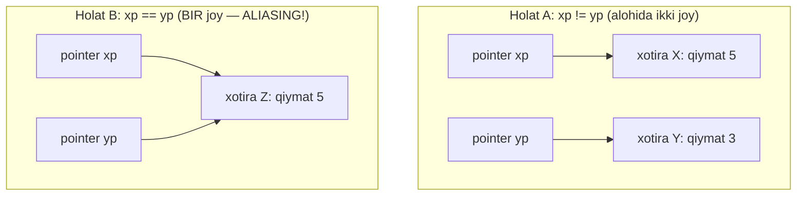
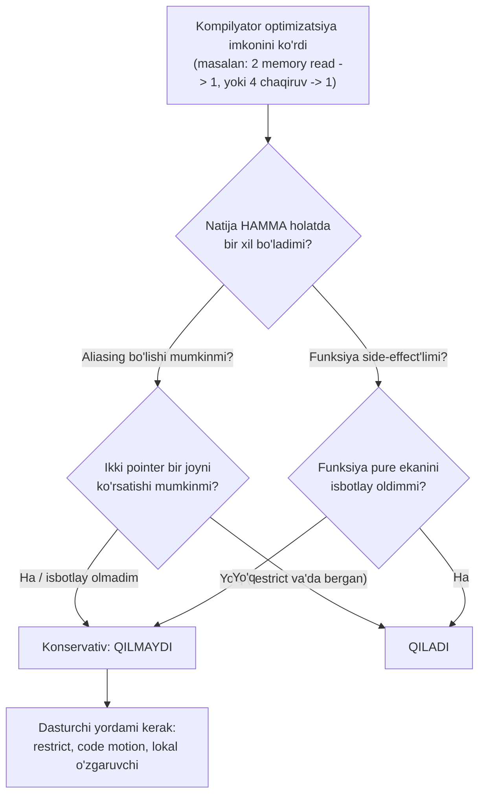
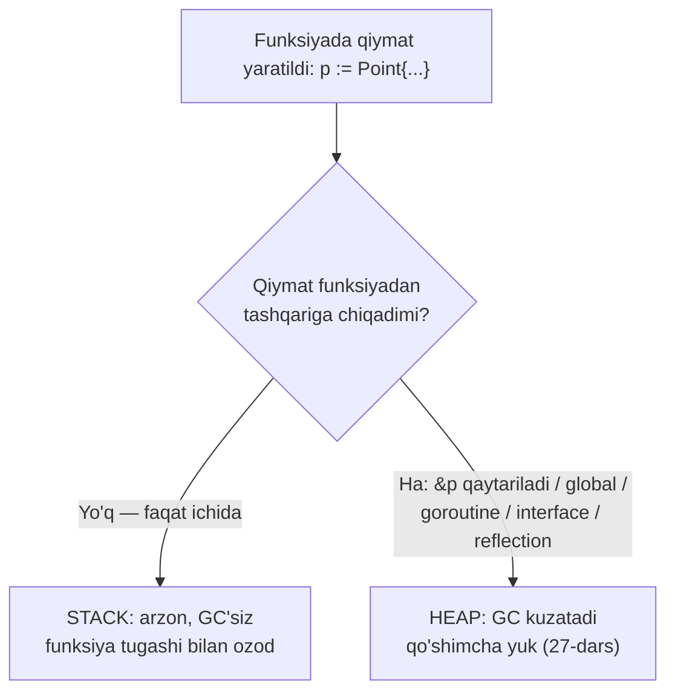

# 13. Kompilyator Optimizatsiyasi Chegaralari — nega kompilyator hamma narsani qilolmaydi

> Manba: CS:APP 2-nashr, 5.1-5.6 · Muhit: assembly x86-64 (gcc 13.3.0 -O2); performance o'lchovlari native arm64 · [← Oldingi](12-cpu-pipeline.md) · [Kurs xaritasi](00-README.md) · [Keyingi →](14-instruction-level-parallelism.md)

## Nima uchun kerak

"`-O2` qo'ydim, endi kodim tez" — bu xayol. Kompilyator kuchli, lekin u faqat **xavfsiz** optimizatsiyani qiladi: agar natija bironta holatda o'zgarib qolishi mumkin bo'lsa, u optimizatsiyani **umuman qilmaydi**. Shuning uchun matematik jihatdan bir xil ikkita funksiya bir xil tezlikda ishlamaydi.

Bu darsda sen 4 ta verify qilingan misolni ko'rasan. Ulardan biri — bir xil ishni qiladigan ikkita string funksiyasi, biri ikkinchisidan **~50000 marta** sekin (10.9 soniya vs 0.0002 soniya). Kompilyator nega birinchisini avtomatik tuzatmaydi? Chunki qilolmaydi — bu uning chegarasi, dasturchi yordami kerak bo'lgan joy.

Uch narsani o'rganasan: (1) nega **memory aliasing** kompilyatorning eng katta to'sig'i; (2) qanday qilib `restrict` va **code motion** bilan kompilyatorga yordam berish; (3) Go'da **escape analysis** — struct nega ba'zan heap'ga qochib, ustingga GC yuki qo'shadi. Xulosa oddiy: kompilyator senga qanchalik yordam bera olishini bilsang, qolganini o'zing to'g'irlaysan.

Bu bilim 12-darsdagi pipeline'ni to'ldiradi: u yerda apparat kodni qanday tez bajarishini ko'rgan eding, bu yerda **kompilyator** kodni apparatga qanday yetkazishini ko'rasan. Ikkalasi birga — 14-15-darslardagi chuqur performance ishining poydevori. Muhandis sifatida ikki savolni farqlashni o'rganasan: "kod nima qilyapti" (to'g'rilik) va "kompilyator undan nima chiqara oladi" (tezlik).

## Nazariya

### 1. Asosiy qoida — faqat "xavfsiz" optimizatsiya

Kompilyator dasturni tezlashtirganda bitta qat'iy shartga bo'ysunadi: optimizatsiyalangan kod **barcha mumkin bo'lgan holatlarda** optimizatsiyalanmagan kod bilan aynan bir xil natija berishi kerak. Bu **safe optimization** (xavfsiz optimizatsiya) tamoyili.

> **Oltin qoida.** Kompilyator "ehtimol tezroq bo'ladi" degani uchun optimizatsiya qilmaydi. U faqat "hamma holatda natija bir xil bo'lishini ISBOTLAY olsam" qiladi. Shubha bo'lsa — konservativ, ya'ni sekin, lekin to'g'ri yo'lni tanlaydi.

Shuning uchun kompilyator senga dushman emas — u ehtiyotkor. Uning ishi kodni tez qilish emas, avvalo **to'g'ri** qilish. Tezlik ikkinchi o'rinda.

### 2. Memory aliasing — birinchi va eng katta to'siq

Endi eng muhim tushuncha. **Memory aliasing** (xotira taxallusi) — ikki pointer bir xil xotira manzilini ko'rsatishi mumkin bo'lgan holat. Bu shunchaki nazariy emas: `f(p, q)` funksiyasini kimdir `f(x, x)` deb chaqirishi mumkin, kompilyator buni **taqiqlay olmaydi**.

Analogiya: ikkita pochta manzili senga berilgan — "Ko'cha 5, uy 10" va "Ko'cha 5, uy 10-kvartira". Bular boshqa-boshqa yozuv, lekin **bir xil eshikni** ko'rsatishi mumkin. Agar sen birinchi manzilga xat tashlab, ikkinchisidan xat o'qisang — o'sha xatni o'qiysan. Kompilyator ikki pointer haqida aynan shu shubhada: "ular boshqa-boshqami yoki bir eshikmi?" Isbotlay olmasa — ikkalasini bir eshik deb hisoblaydi (10-darsdagi pointerlar va massivlar bilan bevosita bog'liq).



Diagramma fikrni takrorlaydi: Holat A'da `*xp` ni o'zgartirsang `*yp` ga tegmaydi. Holat B'da esa `*xp` ni o'zgartirsang `*yp` ham o'zgaradi — chunki ular bir joy. Kompilyator **B holatini istisno qilolmagani** uchun konservativ bo'ladi.

Kitobning yana bir aniq misoli buni ochib beradi:

```c
x = 1000; y = 3000;
*q = y;      /* *q = 3000 */
*p = x;      /* *p = 1000 */
t1 = *q;     /* aliasingsiz: 3000, aliasing bo'lsa: 1000 */
```

Agar `p` va `q` bir joyni ko'rsatmasa, `*p = x` `*q` ga tegmaydi va `t1 = 3000`. Agar bir joyni ko'rsatsa, `*p = x` `*q` ni ham 1000 qiladi va `t1 = 1000`. Kompilyator `t1` qiymatini oldindan **hisoblab qo'yolmaydi** — chaqiruvchi qanday pointerlar berishini bilmaydi. Bu **optimization blocker** (optimizatsiya to'sig'i) deb ataladi.

### 3. Function call — ikkinchi optimization blocker

Ikkinchi katta to'siq — **function call**. Kompilyator siklda uch marta chaqirilgan funksiyani bir marta chaqirishga soddalashtira olmaydi, chunki funksiyaning **side effect**i (nojo'ya ta'siri — global holatni, faylni, tarmoqni o'zgartirishi) bo'lishi mumkin.

```c
int func1() { return f() + f() + f() + f(); }   /* f() 4 marta */
int func2() { return 4 * f(); }                  /* f() 1 marta */
```

Bir qarashda ikkalasi bir xil. Lekin agar `f()` ichida `return counter++;` bo'lsa (global counter'ni oshiradi), `func1` 0+1+2+3 = 6 qaytaradi, `func2` esa 4*0 = 0. **Butunlay boshqa natija.** Shuning uchun kompilyator funksiyani **pure** (toza — side-effect'siz va faqat argumentlariga bog'liq) deb isbotlay olmasa, chaqiruvni "eng yomon holat" deb qabul qiladi va **tegmasdan qoldiradi**.

**Inline — chaqiruv to'sig'ini ochadigan yechim.** Agar funksiyaning tanasi kompilyatorga ko'rinsa, u chaqiruvni **inline substitution** bilan almashtiradi: `f()` chaqiruvi o'rniga uning kodi joyiga ko'chiriladi. Endi kompilyator to'liq kodni ko'radi va yanada optimizatsiya qila oladi. Masalan `func1` inline'dan keyin:

```c
/* f() inline qilingach, kompilyator ko'radi va soddalashtiradi */
int func1_opt() {
    int t = 4 * counter + 6;   /* 0+1+2+3 birga hisoblandi */
    counter = t + 4;
    return t;
}
```

Diqqat: inline **faqat** funksiya tanasi ko'ringanda ishlaydi (bir faylda yoki LTO bilan). Boshqa `.o` fayldagi funksiya ko'rinmaydi — shuning uchun inline optimizatsiya to'sig'ini butunlay yechmaydi, faqat kompilyatorga ko'rinadigan qismda. gcc `-O2` dan boshlab inline qiladi, Go kompilyatori kichik funksiyalarni avtomatik inline qiladi (4-misoldagi `can inline onStack`).

Bu ikki blocker'ni bitta qaror daraxti sifatida ko'r:



### 4. restrict — dasturchining va'dasi

Agar sen kompilyatorga "ishonaver, bu ikki pointer hech qachon bir joyni ko'rsatmaydi" deb **va'da** bera olsang, u ozod bo'ladi va tez kod chiqaradi. Bu va'da — C99'dagi `restrict` kalit so'zi.

`restrict` — dasturchidan kompilyatorga kafolat: "bu pointer ko'rsatgan xotiraga umrida faqat shu pointer orqali murojaat qilinadi, boshqa pointer bilan aliasing yo'q." Kompilyator bu va'daga ishonib optimizatsiya qiladi.

> **Ogohlantirish.** `restrict` — javobgarlikni dasturchi zimmasiga oladi. Agar sen va'da berib, aslida pointerlar aliasing qilsa, kompilyator seni **ogohlantirmaydi** — kod jimgina noto'g'ri natija beradi. `restrict` = "men javobgarman" degan imzo.

### 5. Code motion — loop-invariant hisobni tashqariga chiqarish

**Code motion** (kod ko'chirish) — siklda har iteratsiyada bir xil natija beradigan hisobni sikldan **tashqariga**, bir martalik joyga ko'chirish. Siklda o'zgarmaydigan qiymat **loop-invariant** deyiladi.

Kitobning `combine1` misolida sikl sharti `i < vec_length(v)` — `vec_length` har iteratsiyada chaqiriladi, garchi vector uzunligi sikl davomida o'zgarmasa ham. Yechim: `long length = vec_length(v);` bir marta hisoblab, sikl sharti `i < length` bo'ladi. Bu — qo'lda code motion.

Kompilyator ba'zan code motion'ni **o'zi qiladi**, lekin ko'pincha qilolmaydi: agar `vec_length` side-effect'li bo'lishi mumkin bo'lsa (yoki `strlen` kabi sikl ichida o'zgaradigan ma'lumotni sanasa), u xavfsizlik uchun har safar qayta chaqiradi. Eng dramatik holat — sikl sharti ichidagi `strlen` (pastda 3-misolda ko'rasan).

### 6. Keraksiz memory reference — lokal o'zgaruvchida to'plash

Oxirgi tamoyil (5.6): agar sikl har iteratsiyada natijani **pointer orqali** xotiraga yozib, keyingi iteratsiyada **qayta o'qisa** — bu isrof. Chunki xotira registerdan ~100 marta sekin (16-17-darslardagi cache mavzusi).

Yechim: natijani **lokal o'zgaruvchida** (register'da) to'plab, sikl tugagach **bir marta** xotiraga yozish. Kitobda `combine3` har iteratsiyada `*dest` ni o'qib-yozadi, `combine4` esa `acc` lokal o'zgaruvchida to'playdi va oxirida `*dest = acc` qiladi. Natija: iteratsiyaga 2 read + 1 write o'rniga faqat 1 read.

Nega kompilyator buni o'zi qilmaydi? Yana **aliasing**: `dest` vector ichidagi elementni ko'rsatishi mumkin. U holda har yozuv keyingi o'qishni o'zgartiradi — natija farq qiladi. Kompilyator buni istisno qilolmasa, konservativ ravishda har safar xotiraga tegadi. (Ushbu tamoyilning verify qilingan isbotini pastda `restrict.c` da ko'rasan — u aynan registerda to'plashni namoyish qiladi.)

Kitob buni aniq raqamlar bilan ko'rsatadi. Vector `v = [2, 3, 5]`, amal ko'paytirish, va `dest` **oxirgi elementni** ko'rsatadi (aliasing atay yaratilgan: `combine(v, get_vec_start(v) + 2)`):

| Funksiya | Boshlang'ich | i=0 | i=1 | i=2 | Yakuniy |
| -------- | ------------ | --- | --- | --- | ------- |
| `combine3` (dest'da to'playdi) | [2, 3, 5] | [2, 3, 2] | [2, 3, 6] | [2, 3, 36] | **[2, 3, 36]** |
| `combine4` (acc'da to'playdi) | [2, 3, 5] | [2, 3, 5] | [2, 3, 5] | [2, 3, 5] | **[2, 3, 30]** |

`combine3` natijani to'g'ridan-to'g'ri oxirgi elementga yozgani uchun, u qiymat keyingi iteratsiyada `data[i]` sifatida **qayta o'qiladi** — natija buziladi (36). `combine4` esa `acc` da chetda to'playdi, oxirida yozadi — vector 1·2·3·5 = 30. **36 vs 30.** Kompilyator dasturchining niyatini bilmaydi, shuning uchun `combine3` ni `combine4` ga soddalashtira olmaydi — konservativ ravishda har iteratsiya xotiraga tegadi.

**`-O2` bir qadam oldinga.** Qiziq detal: `combine3` ni `-O2` bilan kompilyatsiya qilsang, kompilyator sikl ichidagi **o'qishni** (`movss (%rbp), %xmm0`) olib tashlaydi (chunki oldingi iteratsiyada yozilgan qiymat registerda turibdi), lekin **yozuvni** sikl ichida qoldiradi. Ya'ni u aliasing bo'lsa ham to'g'ri ishlaydigan qisman optimizatsiyani topadi. Bu shuni ko'rsatadi: kompilyator "xavfsizlik chegarasi"gacha optimizatsiya qiladi, undan nariga — dasturchi kerak.

### 7. Optimization level'lar — -O0 dan -O3 gacha

Kompilyatorga qancha "harakat qilishini" `-O` bayrog'i bilan aytasan:

| Daraja | Nima qiladi | Qachon |
| ------ | ----------- | ------ |
| `-O0` | optimizatsiya yo'q, to'g'ridan-to'g'ri tarjima | debug, kod bilan asm 1:1 |
| `-O1` | asosiy optimizatsiyalar, tez kompilyatsiya | tez debug build |
| `-O2` | deyarli barcha xavfsiz optimizatsiya (inline, loop) | **production standarti** |
| `-O3` | `-O2` + agressiv (vectorize, ko'proq inline) | numerik/hot kod, o'lchab tekshir |
| `-Os` | `-O2` ga o'xshash, lekin kod hajmini kichraytiradi | embedded, kod hajmi muhim |

`-O3` **har doim tezroq emas**: u kodni kattalashtiradi (code bloat), bu instruction cache'ni buzib, ba'zan `-O2` dan **sekinroq** bo'ladi. Shuning uchun ko'p loyihalar (masalan OpenCV) atayin `-O2` ishlatadi.

### 8. Xulosa — kompilyator nima qila oladi, nima qilolmaydi

Butun darsni bitta jadval ichiga jamlaymiz. Chap ustun — kompilyator **o'zi** qiladigan ishlar (bepul); o'ng ustun — **dasturchi** yordami kerak bo'lgan chegaralar:

| Kompilyator o'zi qiladi (xavfsiz) | Kompilyator qilolmaydi (chegara) |
| --------------------------------- | -------------------------------- |
| Registerlarni oqilona taqsimlash | Aliasing bo'lishi mumkin bo'lsa memory read'ni birlashtirish |
| Sodda if'ni cmov'ga aylantirish (12-dars) | Side-effect'li funksiya chaqiruvini soddalashtirish |
| Bir faylda ko'ringan kichik funksiyani inline | Boshqa `.o` fayldagi funksiyani inline (LTO'siz) |
| Aniq loop-invariant (masalan `a*b` konstanta) hoist | `strlen`/`len` kabi "balki o'zgaradi" chaqiruvni hoist |
| Dead code (ishlatilmagan) o'chirish | Dasturchi niyatini taxmin qilish (combine3 vs combine4) |
| BCE (isbotlansa bounds check o'chirish) | Qiymat funksiyadan chiqsa stack'da qoldirish (Go escape) |

> **Asosiy fikr.** Kompilyator "isbotlay olsam qilaman" tamoyili bilan ishlaydi. Sening ishing — kodni shunday yozishki, isbotlash **oson** bo'lsin: aliasing'ni `restrict` bilan yopish, loop-invariant'ni qo'lda hoist qilish, natijani lokal o'zgaruvchida to'plash. Shunda kompilyator qolganini o'zi qiladi.

## Kod va isbot

### Misol 1 — memory aliasing kompilyatorni to'xtatadi (x86-64, gcc -O2)

Ikki funksiya, matematik jihatdan bir xil: ikkalasi `*xp` ga `2 * *yp` qo'shadi.

```c
/* xp va yp bir joyni ko'rsatishi mumkin - kompilyator ehtiyot bo'ladi */
void twiddle1(long *xp, long *yp) { *xp += *yp; *xp += *yp; }
void twiddle2(long *xp, long *yp) { *xp += 2 * *yp; }
```

`gcc -O2 -S alias.c` natijasi:

```asm
twiddle1:
	movq	(%rsi), %rax        # *yp o'qish
	addq	(%rdi), %rax        # + *xp
	movq	%rax, (%rdi)        # *xp = natija
	addq	(%rsi), %rax        # *yp ni QAYTA o'qiydi!
	movq	%rax, (%rdi)        # *xp = natija
	ret
twiddle2:
	movq	(%rsi), %rax        # *yp o'qish (BIR MARTA)
	addq	%rax, %rax          # 2 * *yp
	addq	%rax, (%rdi)        # *xp += 2*yp
	ret
```

`twiddle2` yaxshiroq — u `*yp` ni **bir marta** o'qiydi (1 memory read). `twiddle1` esa **ikki marta** o'qiydi. Nega kompilyator `twiddle1` ni `twiddle2` ga aylantirmaydi?

**Aliasing hisobini bajaramiz.** Faraz qil: `xp == yp` va boshlang'ich qiymat `*xp = *yp = 1`.

- `twiddle1`: birinchi `*xp += *yp` → `*xp = 1 + 1 = 2` (bir joy bo'lgani uchun `*yp` ham 2 bo'ldi). Ikkinchi `*xp += *yp` → `*xp = 2 + 2 = 4`. **Natija: 4** (qiymat 4 barobar oshdi).
- `twiddle2`: `*xp += 2 * *yp` → `*xp = 1 + 2*1 = 3`. **Natija: 3** (qiymat 3 barobar oshdi).

**4 vs 3 — farqli natija!** Aynan shu sabab kompilyator `twiddle1` ning ikkita `*yp` o'qishini birga qo'sha olmaydi: `xp == yp` bo'lsa, birinchi `*xp += *yp` `*yp` ni ham o'zgartiradi, shuning uchun ikkinchi o'qish yangi qiymatni ko'rishi shart. Aliasingni istisno qilolmagani uchun optimizatsiya **bloklanadi**.

**Notional machine — assembly ostida aslida nima bo'ladi.** Registerlarni eslaymiz (06-09-darslar): birinchi pointer argument `%rdi` da, ikkinchisi `%rsi` da (System V calling convention). `(%rdi)` — "`%rdi` ichidagi manzildagi xotira qiymati", ya'ni `*xp`. `(%rsi)` — `*yp`. Endi `twiddle1` ning asm'ini o'qi: `movq (%rsi), %rax` — `*yp` ni CPU registeri `%rax` ga o'qiydi. Uchinchi qatorda `movq %rax, (%rdi)` — `%rax` ni `*xp` ga yozadi. To'rtinchi qatordagi `addq (%rsi), %rax` — bu **xotiraga qayta boradi** va `*yp` ni **yangidan** o'qiydi. Agar `xp == yp` bo'lsa, `%rdi` va `%rsi` bir xil manzil — uchinchi qatordagi yozuv to'rtinchi qatordagi o'qishni o'zgartirib qo'yadi. CPU uchun bu ikki alohida xotira murojaati; kompilyator ularni "bir xil" deb kafolatlay olmagani uchun ikkalasini ham qoldiradi. `twiddle2` da esa `%rax` bir marta yuklanib, `addq %rax, %rax` bilan registerda ikkilanadi — xotiraga qayta bormaydi. Farq shu: kompilyator qayerda xotiradan qutulib registerda ishlashga **jur'at eta oladi**.

### Misol 2 — restrict optimizatsiyani ochadi (x86-64, gcc -O2)

Endi dasturchi `restrict` bilan va'da beradi: `dst` va `a` aliasing qilmaydi.

```c
void sum_restrict(long * restrict dst, const long * restrict a, long n)
{
    for (long i = 0; i < n; i++)
        *dst += a[i];      /* restrict: dst a bilan aliasing qilmaydi */
}
```

`gcc -O2 -S restrict.c` natijasi:

```asm
sum_restrict:
	testq	%rdx, %rdx
	jle	.L1
	movq	(%rdi), %rax        # *dst ni BIR marta registerga o'qi
	leaq	(%rsi,%rdx,8), %rdx
.L3:
	addq	(%rsi), %rax        # register'da to'pla (memory'ga tegmaydi!)
	addq	$8, %rsi
	cmpq	%rdx, %rsi
	jne	.L3
	movq	%rax, (%rdi)        # natijani BIR marta yoz
.L1:
	ret
```

`restrict` va'dasi tufayli kompilyator ozod bo'ldi: `*dst` sikl boshida **bir marta** `%rax` registerga o'qiladi, sikl ichida hisob **registerda** to'planadi (`addq (%rsi), %rax` — xotiraga tegmaydi!), oxirida **bir marta** `%rax` xotiraga yoziladi.

`restrict`'siz bo'lsa, har iteratsiyada `*dst` qayta o'qib-yozilardi — chunki kompilyator "`a[i]` ni o'qish balki `dst` ni ham o'zgartirib qo'yar" degan xavfda bo'ladi. Bu — 6-tamoyilning (keraksiz memory reference) aniq isboti: `restrict` = dasturchi javobgarlik oladi, kompilyator xotira o'qish-yozishdan xalos bo'ladi.

### Misol 3 — sikl ichidagi funksiya chaqiruvi O(n^2) FALOKAT (native arm64)

Bu darsning eng muhim amaliy saboqi. Ikki funksiya bir xil ishni qiladi — stringni kichik harfga o'giradi. Farq: `strlen` qayerda chaqiriladi.

```c
/* SEKIN: strlen har iteratsiyada chaqiriladi -> O(n^2) */
void lower_slow(char *s)
{
    for (size_t i = 0; i < strlen(s); i++)
        if (s[i] >= 'A' && s[i] <= 'Z')
            s[i] += 32;
}
/* TEZ: strlen bir marta (code motion) -> O(n) */
void lower_fast(char *s)
{
    size_t len = strlen(s);
    for (size_t i = 0; i < len; i++)
        if (s[i] >= 'A' && s[i] <= 'Z')
            s[i] += 32;
}
```

Real o'lchov (native arm64, string uzunligi 200000):

```
String uzunligi: 200000
lower_slow (strlen har sikl, O(n^2)): 10.939 s
lower_fast (strlen bir marta, O(n)):  0.0002 s
```

**10.9 SONIYA vs 0.0002 soniya — ~50000 barobar farq.** (Bu native arm64 apparatdagi haqiqiy vaqt o'lchovi.) Sabab arifmetikada:

- `strlen`ning o'zi O(n) — C stringi null bilan tugagani uchun butun stringni sanaydi.
- `lower_slow` da `strlen(s)` **har** iteratsiyada chaqiriladi, sikl n marta aylanadi → O(n) × n = **O(n^2)**. 200000^2 = 40 milliard amal.
- `lower_fast` `strlen`ni **bir marta** chaqirib `len` ga saqlaydi (code motion) → O(n).

Nega kompilyator `strlen`ni avtomatik tashqariga chiqarmaydi? Ikki sabab: (a) `strlen` **pure** ekanini isbotlay olmaydi; (b) sikl ichida `s[i] += 32` string mazmunini o'zgartiradi — kompilyator "uzunlik o'zgarmaydi" degan murakkab dalilni chiqara olmaydi (harflar o'zgaryapti, balki null terminator siljigandir?). Xavfsizlik uchun har safar chaqiradi. **Code motion'ni dasturchi qo'lda qilishi SHART.**

**Nega bu eng qimmat saboq.** `lower_slow` xavfli tomoni — u **kichik** input'da normal ishlaydi. 100 belgili stringda 100^2 = 10000 amal, ko'z ochib yumguncha tugaydi. Test va CI yashil. Keyin production'da kimdir 1 million belgili matn (log fayl, JSON, foydalanuvchi input) uzatadi — birdan funksiya **daqiqalar** oladi va servis muzlaydi. Bu **yashirin asimptotik samarasizlik**: kod to'g'ri, faqat murakkabligi kutilmaganda O(n^2). Senior dasturchining vazifasi — har hot loop'da sikl **sharti** va **ichini** ko'zdan kechirib, "bu ifoda har iteratsiyada qayta hisoblanmoqdami va o'zgarmaydimi?" deb so'rash. Javob "ha" bo'lsa — hoist qil.

> **Oltin qoida.** Sikl sharti va tanasidagi har bir loop-invariant hisobni (funksiya chaqiruvi, `len`, `strlen`, murakkab ifoda) qo'lda sikldan tashqariga chiqar. Kompilyator buni ishonch bilan qilolmaydi — sen qilasan. Bu bitta odat ba'zan minglab barobar tezlik beradi.

### Misol 4 — Go escape analysis (go build -gcflags=-m)

Go kompilyatori ham "xavfsiz" optimizatsiya qiladi, lekin uning muhim qarori — qiymatni **stack**da qoldirish yoki **heap**ga ko'chirish.

```go
package main

type Point struct{ X, Y int }

func onStack() int {          // stack'da qoladi
	p := Point{1, 2}
	return p.X + p.Y
}
func onHeap() *Point {        // heap'ga qochadi (&p qaytariladi)
	p := Point{3, 4}
	return &p
}
func sliceEscape() []int {    // slice heap'ga qochadi
	s := make([]int, 0)
	for i := 0; i < 100; i++ {
		s = append(s, i)
	}
	return s
}
func main() {
	_ = onStack()
	_ = onHeap()
	_ = sliceEscape()
}
```

`go build -gcflags='-m' escape.go` (muhim qatorlar):

```
./escape.go:6:6: can inline onStack
./escape.go:13:2: moved to heap: p
./escape.go:19:11: make([]int, 0) escapes to heap
```

Go kompilyatori **escape analysis** qiladi: qiymat funksiyadan tashqariga "qochadimi". `onStack`: `p` faqat funksiya ichida ishlatiladi → **STACK** (arzon, GC'siz, funksiya tugashi bilan ozod). `onHeap`: `&p` qaytariladi → `p` **HEAP**ga ko'chadi (`moved to heap`) → GC yuki. `sliceEscape`: slice qaytariladi → heap.

## Go dasturchiga ko'prik

Yuqoridagi C tamoyillari Go'da ham to'liq ishlaydi — Go kompilyatori ham faqat **xavfsiz** optimizatsiya qiladi. Farqi: Go'da eng muhim optimizatsiya qarori **stack vs heap**.



**Nega bu muhim.** Stack allocation deyarli tekin — funksiya qaytishi bilan xotira o'zi ozod bo'ladi (09-darsdagi stack frame). Heap allocation esa **GC** (garbage collector, 27-dars) tomonidan kuzatiladi va tozalanadi — bu CPU vaqti va latency spike'lari. Hot path'da ortiqcha heap allocation = ortiqcha GC bosimi.

**Escape'ni majbur qiladigan holatlar:** (1) pointer qaytarish (`return &p`); (2) qiymatni global o'zgaruvchiga saqlash; (3) goroutine'ga uzatish; (4) `interface{}` ga solish — `fmt.Println(x)` argumenti doim escape qiladi, chunki `interface{}` orqali reflection mumkin, kompilyator "eng yomon holat"ni oladi (aynan C'dagi function call blocker mantiqi); (5) slice/map compile-time'da noma'lum o'lchamda o'sishi.

**Amaliy kamaytirish usullari.** (1) `-gcflags='-m'` bilan qaysi allocation heap'ga qochishini ko'r; (2) pointer o'rniga qiymat qaytar (kichik struct uchun); (3) slice'ni oldindan to'g'ri `cap` bilan `make` qil — o'sish paytida qayta allocation'ni oldini olasan; (4) qayta ishlatiladigan bufer uchun `sync.Pool`; (5) hot loop'da `interface{}` va reflection'dan qoch.

**Go'dagi boshqa optimizatsiyalar.** Kompilyator kichik funksiyalarni **inline** qiladi (`can inline onStack`) — chaqiruv overhead'ini yo'qotadi; `//go:noinline` bilan buni to'xtatib, benchmark'ni toza o'lchash mumkin. Yana **bounds check elimination** (BCE) — kompilyator `s[i]` indeks doim chegarada ekanini isbotlay olsa, tekshiruvni olib tashlaydi (12-darsda ko'rgan pipeline foydasi). Interface va reflection — Go'da ham escape va optimizatsiya to'sig'ining asosiy manbai.

**01-darsdagi savollarga javob.** Kursning boshida uchta savol qo'ygan eding, endi javobi aniq. (1) "Function call overhead qimmatmi?" — chaqiruvning o'zi arzon, lekin u **optimization blocker**: kompilyator uni pure deb bilmasa, atrofidagi optimizatsiyalarni to'xtatadi (inline buni yumshatadi). (2) "Pointer vs array — qaysi tez?" — pointer aliasing xavfi tug'diradi, kompilyator konservativ bo'ladi; lokal array/o'zgaruvchida ishlash ko'pincha registerni ochadi (2-misol). (3) "switch tezmi?" — sodda switch kompilyator tomonidan jump table'ga aylanadi (08-dars control flow), lekin har case'da funksiya chaqiruvi bo'lsa, yana blocker paydo bo'ladi. Uch savolning ildizi bitta: kompilyatorga isbotlash oson bo'lgan kod tez chiqadi.

## Real-world scenariylar

### 1. Hot loop'dagi len/funksiya chaqiruvini qo'lda hoist qilish

Eng ko'p uchraydigan real muammo — 3-misoldagi `strlen` naqshi. Kimdir siklda `for i := 0; i < len(compute()); i++` yozadi yoki har iteratsiyada bir xil natija beradigan funksiyani chaqiradi. Kichik test ma'lumotida sezilmaydi, production'da million elementli input kelganda servis **muzlaydi**. Yechim: loop-invariant chaqiruvni sikldan tashqariga bir martalik o'zgaruvchiga ol — bu N barobar tezlashtiradi. Har hot loop'ni ko'zdan kechir: sikl sharti va ichida o'zgarmaydigan hisob bormi?

### 2. Go servisida escape'larni topib GC bosimini kamaytirish

Servis latency'sida davriy spike'lar (GC pauzalari) ko'rinsa, `go build -gcflags='-m'` bilan hot path'dagi allocation'larni tekshir. Ko'p `moved to heap` va `escapes to heap` topilsa — pointer qaytarish, `interface{}` ishlatish yoki cap'siz `make` sabab bo'lishi mumkin. Ularni qiymat qaytarish, oldindan cap berish yoki `sync.Pool` bilan almashtirish heap allocation'ni, demak GC ishini keskin kamaytiradi. Aniq foydani `-benchmem` bilan `allocs/op` metrikasida o'lchaysan (15-dars).

### 3. restrict/aliasing tufayli sekin numerik kod

Matritsa/signal ishlov beruvchi C/C++ kutubxonasida ichki sikl kutilganidan sekin ishlayapti. Assembly'ni ko'rsang, har iteratsiyada bir xil pointer'dan qayta-qayta o'qish borligini ko'rasan — kompilyator aliasing xavfida registerda to'play olmayapti. Pointerlar haqiqatda alohida ekanini bilsang, `restrict` (yoki C++'da `__restrict__`) qo'shib, kompilyatorga registerda to'plash va vectorize qilish imkonini berasan — ko'pincha 2-3 barobar tezlik. Faqat va'dang haqiqat ekaniga qat'iy ishonch hosil qil.

### 4. "Kompilyator nima qildi?" — assembly'ni tekshirish odati

Optimizatsiyani "sezish" o'rniga **ko'rish** kerak. Ikki funksiyani yozib, `gcc -O2 -S` (yoki Compiler Explorer / godbolt) bilan generatsiya qilingan assembly'ni yonma-yon qo'y. 1-misolda aynan shu bilan aniqladik: `twiddle1` ikkita memory read qilarkan, `twiddle2` bitta. Go'da esa `go build -gcflags='-m'` escape'ni, `go build -gcflags='-S'` assembly'ni ko'rsatadi. Bu odat — "optimizatsiyalar ishlaganmi?" degan savolga taxmin emas, dalil beradi. Ayniqsa `restrict`, inline yoki BCE qo'shganingda, u haqiqatan ta'sir qildimi — faqat assembly'da ko'rinadi. Bu 15-darsdagi profiling bilan birga senior dasturchining ikki asosiy tergov quroli.

## Zamonaviy yondashuv

Web sintezi (2024-2026) shuni ko'rsatadi:

- **`-O2` production standarti.** U barcha "space-speed tradeoff'siz" optimizatsiyani qiladi va barqaror. `-O3` `-O2` ustiga vectorize, ko'proq inline qo'shadi, lekin kod hajmini kattalashtirib (code bloat) instruction cache'ni buzadi — ba'zan `-O2` dan **sekinroq**. Qoida: `-O3` ni default deb olma, hot kodda o'lchab tanla.
- **LTO (link-time optimization).** Kompilyator odatda faqat bitta fayl ichida optimizatsiya qiladi. LTO butun dasturni birga ko'rib, fayllar orasidagi inline va o'lik kodni tozalashni ochadi.
- **PGO (profile-guided optimization).** Avval dasturni profil bilan ishlatib, keyin "issiq" yo'llarni bilgan holda qayta kompilyatsiya. Go 1.21+ PGO'ni qo'llab-quvvatlaydi (issiq funksiyalarni agressivroq inline qiladi).
- **Zamonaviy kompilyatorlar kuchli, lekin chegara o'sha.** gcc 13/clang 17 juda aqlli, biroq **aliasing** va **pure** isboti hali ham asosiy to'siq — bu C tilining semantikasidan kelib chiqadi, kompilyator "aqlliligi" bilan hal bo'lmaydi.
- **Rust boshqacha yo'l tanladi.** Rust'ning **borrow checker**i aliasing'ni til darajasida taqiqlaydi (bir vaqtda faqat bitta mutable reference). Shuning uchun Rust kompilyatori C'dagi `restrict`ni har joyda **avtomatik** qo'llay oladi — ko'proq optimizatsiya, dasturchi va'dasisiz. Aliasing muammosini "hujjat"da emas, "tip tizimi"da hal qilish.
- **Atributlar.** `restrict`/`__restrict__`, `const`, `__attribute__((pure))` va `noalias` — bularning barchasi dasturchidan kompilyatorga beriladigan va'dalar. Ular optimizatsiya to'sig'ini ochadigan "kalit"lar.
- **Auto-vectorization va SIMD.** `-O3`/`-ftree-vectorize` sikllarni SIMD (bir instruksiyada bir necha element) ga aylantiradi — lekin faqat aliasing yo'q deb isbotlansa. Aynan shuning uchun `restrict` numerik kodda vectorization'ni ochadi. Bu 14-darsdagi instruction-level parallelism mavzusiga to'g'ridan-to'g'ri ulanadi: kompilyator optimizatsiyasi va apparat parallelizmi birga ishlaydi.
- **Keyingi qadam.** Bu dars kompilyator **chegaralari**ni ko'rsatdi. 14-darsda esa apparatning o'zi bir siklda ko'p instruksiya bajarishini (superscalar, loop unrolling, ko'p akkumulyator) o'rganamiz — ya'ni dasturchi kodni qanday yozib apparat parallelizmini maksimal siqib chiqarishi mumkinligini.

## Keng tarqalgan xatolar

**1. "`-O3` har doim `-O2` dan tezroq."** Yo'q. `-O3` kodni kattalashtirib (agressiv inline, unroll) instruction cache'ni buzishi va **sekinroq** bo'lishi mumkin. Har doim o'lchab tekshir; ko'p production build `-O2` da qoladi.

**2. "Kompilyator hamma narsani optimizatsiya qiladi."** Yo'q. Memory aliasing va side effect kompilyatorni to'xtatadi. Matematik jihatdan bir xil ikki kod bir xil tez ishlamaydi (1-misol: `twiddle1` vs `twiddle2`).

**3. Sikl sharti/ichida `strlen`, `len(...)` yoki funksiya chaqiruvini qoldirish.** Bu darsning eng qimmat xatosi — 3-misoldagi ~50000 barobar sekinlik. Loop-invariant hisobni har doim sikldan tashqariga chiqar (code motion).

**4. "`restrict` bekorga, farqi yo'q."** Yo'q. 2-misolda `restrict` sikl ichidagi memory read-write'ni yo'qotib, registerda to'plashni ochdi — numerik kodda 2-3 barobar farq bo'lishi mumkin. Faqat va'dang haqiqat bo'lsin, aks holda jimgina noto'g'ri natija.

**5. Go'da "har pointer heap'ga qochadi" yoki escape'ni umuman o'ylamaslik.** Ikkalasi ham xato. Pointer olsang ham qiymat funksiyadan chiqmasa stack'da qoladi. Aksincha, escape'ni e'tiborsiz qoldirsang, hot path'da bilmasdan GC bosimini oshirasan. `-gcflags='-m'` bilan aniq ko'r.

**6. "Optimizatsiyani sezgan bilan bilaman."** Yo'q. Kompilyator nima qilganini faqat generatsiya qilingan assembly (`gcc -S`, godbolt) yoki `-gcflags='-m'`/`-benchmem` ko'rsatadi. `restrict` yoki qo'lda hoist qildim deb, u haqiqatan ta'sir qildimi — o'lchamasdan bilib bo'lmaydi. Har optimizatsiyani dalil bilan tasdiqla (15-dars).

## Amaliy mashqlar

**1. (Oson — hisob) twiddle xp==yp da natija.** `*xp = *yp = 5` va `xp == yp` bo'lsa, `twiddle1` va `twiddle2` qanday natija beradi? Qadam-baqadam hisobla.

<details>
<summary>Yechim</summary>

`twiddle1`: `*xp += *yp` → 5+5 = 10 (bir joy, `*yp` ham 10). Yana `*xp += *yp` → 10+10 = 20. **Natija: 20** (4 barobar). `twiddle2`: `*xp += 2 * *yp` → 5 + 2*5 = 15. **Natija: 15** (3 barobar). 20 vs 15 — farqli. Aynan shu sabab kompilyator `twiddle1` ni `twiddle2` ga aylantirolmaydi.
</details>

**2. (Oson — tushuntir) Nega strlen loop O(n^2)?** 3-misolda `lower_slow` nega 200000 uzunlikda 10.9 soniya, `lower_fast` esa 0.0002 soniya? Murakkablik nuqtai nazaridan tushuntir.

<details>
<summary>Yechim</summary>

`strlen`ning o'zi O(n) — butun stringni sanaydi. `lower_slow` da `strlen(s)` sikl sharti sifatida **har** iteratsiyada chaqiriladi, sikl n marta aylanadi → O(n) × n = O(n^2) = 200000^2 = 40 mlrd amal. `lower_fast` `strlen`ni bir marta chaqirib `len` ga saqlaydi (code motion) → O(n) = 200000 amal. Nisbat ~n barobar, shuning uchun ~50000 barobar farq.
</details>

**3. (Oson — bashorat) restrict bo'lmasa nima o'zgaradi?** 2-misoldagi `sum_restrict` dan `restrict` kalit so'zlarini olib tashlasak, assembly qanday o'zgaradi?

<details>
<summary>Yechim</summary>

`restrict`'siz kompilyator `dst` va `a` aliasing qilishi mumkin deb hisoblaydi. Sikl ichida `*dst` ni registerda to'play olmaydi — har iteratsiyada `*dst` ni xotiradan **o'qib**, yangilab, **qayta yozadi** (chunki `a[i]` o'qish balki `dst` ni o'zgartirar). Ya'ni sikl boshidagi bir martalik `movq (%rdi), %rax` va oxiridagi `movq %rax, (%rdi)` o'rniga, har iteratsiyada memory read-write bo'ladi — sekinroq.
</details>

**4. (O'rta — aniqla) Qaysi Go funksiya heap'ga qochadi?** Quyidagilardan qaysi biri escape qiladi: (a) `func a() int { x := 5; return x }`; (b) `func b() *int { x := 5; return &x }`; (c) `func c() { x := 5; fmt.Println(x) }`?

<details>
<summary>Yechim</summary>

(a) **stack** — `x` qiymat sifatida qaytariladi, funksiyadan pointer chiqmaydi. (b) **heap** — `&x` qaytariladi, `x` funksiyadan tashqarida yashashi kerak (`moved to heap`, xuddi 4-misoldagi `onHeap`). (c) **heap** — `fmt.Println(x)` argumenti `interface{}`, reflection mumkin, kompilyator "eng yomon holat"ni oladi va `x` escape qiladi. `-gcflags='-m'` bilan tasdiqla.
</details>

**5. (O'rta — to'g'irla) Bu kodni code motion bilan tezlashtir.** Quyidagi Go kodini tezlashtir: `for i := 0; i < len(items)*factor(cfg); i++ { process(items[i]) }` (bu yerda `factor(cfg)` har chaqiruvda bir xil qaytaradi).

<details>
<summary>Yechim</summary>

Sikl sharti `len(items)*factor(cfg)` har iteratsiyada qayta hisoblanadi — `factor(cfg)` loop-invariant, lekin kompilyator uni pure deb isbotlay olmaydi. Qo'lda hoist qil:

```go
limit := len(items) * factor(cfg)  // bir marta
for i := 0; i < limit; i++ {
    process(items[i])
}
```

Endi `factor(cfg)` har iteratsiya emas, bir marta chaqiriladi (code motion).
</details>

**6. (O'rta — bashorat) Aliasing haqiqiy zarar.** Kitobning `swap` misolini ko'r: `void swap(long *xp, long *yp) { *xp = *xp + *yp; *yp = *xp - *yp; *xp = *xp - *yp; }`. Agar `xp == yp` bo'lsa (bir joy, qiymat 7), natija nima?

<details>
<summary>Yechim</summary>

`xp == yp`, qiymat 7. (1) `*xp = *xp + *yp` → 7+7 = 14 (ikkalasi 14). (2) `*yp = *xp - *yp` → 14-14 = 0 (ikkalasi 0). (3) `*xp = *xp - *yp` → 0-0 = 0. **Natija: 0.** Aliasing swap'ni buzdi — qiymatni almashtirish o'rniga nolga aylantirdi. Bu kompilyator nega aliasing'da konservativ bo'lishini ko'rsatadi: aliasing haqiqatan boshqa natija beradi.
</details>

**7. (Qiyin — loyihalash) Kompilyatorga yordam ber.** Senda hot loop bor: massiv ustida sikl, ichida bir xil natijali funksiya chaqiruvi va natijani pointer orqali yozish. Uch xil optimizatsiyani (code motion, keraksiz memory reference yo'qotish, aliasing va'dasi) qanday qo'llaysan?

<details>
<summary>Yechim</summary>

(1) **Code motion**: loop-invariant funksiya chaqiruvini sikldan tashqariga lokal o'zgaruvchiga ol (3-misol saboqi). (2) **Keraksiz memory reference**: natijani `*dest` ga har iteratsiya yozish o'rniga lokal `acc` o'zgaruvchida to'plab, sikl tugagach bir marta `*dest = acc` yoz (6-tamoyil, kitobning `combine4`). (3) **Aliasing va'dasi**: agar pointerlar alohida ekaniga ishonch bo'lsa, `restrict` qo'shib kompilyatorga registerda to'plash imkonini ber (2-misol). Uchalasi birga N barobar tezlik berishi mumkin — lekin har qadamni o'lchab tekshir (15-dars).
</details>

**8. (O'rta — bashorat) combine3 aliasing.** Vector `v = [1, 4]`, amal ko'paytirish (`*`), va `dest` **oxirgi** elementni ko'rsatadi. `combine3` (natijani dest'da to'playdi, IDENT=1) yakuniy vectorni qanday qoldiradi? `combine4` (acc'da to'playdi) esa qanday?

<details>
<summary>Yechim</summary>

`combine3`: dest = oxirgi element (boshda 4). Sikl: acc dest'da. i=0 → dest = 1·`data[0]` = 1·1 = 1, vector [1, 1]. i=1 → dest = dest·`data[1]` = 1·(hozir 1) = 1 (chunki `data[1]` = dest'ning o'zi, endi 1). Yakuniy **[1, 1]**. `combine4`: acc chetda: 1·1·4 = 4, oxirida yozadi → **[1, 4]**. Farqli natija — aynan shu sabab kompilyator combine3 ni combine4 ga soddalashtira olmaydi.
</details>

**9. (Qiyin — o'yla) Nega Rust restrict'siz tezroq bo'lishi mumkin?** Bir xil numerik siklni C va Rust'da yozding. C'da `restrict` qo'ymading. Nega Rust versiyasi ko'proq optimizatsiya olishi mumkin?

<details>
<summary>Yechim</summary>

Rust'ning **borrow checker**i til darajasida kafolatlaydi: bir vaqtda bir xil ma'lumotga faqat bitta mutable reference bo'lishi mumkin — ya'ni aliasing **imkonsiz**. Kompilyator bu kafolatni biladi va `&mut` pointerlarga avtomatik `noalias` (C'dagi `restrict` ekvivalenti) qo'yadi. Natijada Rust registerda to'plash va vectorize'ni dasturchi va'dasisiz qo'llaydi. C'da esa `restrict` yozmasang, kompilyator aliasingdan qo'rqib konservativ qoladi. Aliasing muammosini "hujjat"da emas, "tip tizimi"da hal qilishning foydasi.
</details>

## Cheat sheet

| Tushuncha | Nima | Eslab qolish |
| --------- | ---- | ------------ |
| **Safe optimization** | natija barcha holatda bir xil bo'lsagina qiladi | shubha bo'lsa — qilmaydi |
| **Memory aliasing** | ikki pointer bir joyni ko'rsatishi mumkin | eng katta to'siq (`twiddle1`) |
| **Optimization blocker** | optimizatsiyani to'sadigan holat | aliasing + function call |
| **restrict** | "bu pointerlar aliasing qilmaydi" va'dasi | javobgarlik dasturchida |
| **pure function** | side-effect'siz, faqat argumentga bog'liq | pure bo'lmasa chaqiruv qoladi |
| **side effect** | global holat/fayl/tarmoqni o'zgartirish | `counter++` = optimizatsiya to'sig'i |
| **Code motion** | loop-invariant hisobni sikldan tashqariga | `strlen` ni bir marta chaqir |
| **loop-invariant** | siklda o'zgarmaydigan qiymat | tashqariga ko'chirishga arziydi |
| **Keraksiz memory ref** | har iteratsiya `*dest` o'qib-yozish | lokal `acc` da to'pla |
| **-O0 / -O1** | optimizatsiya yo'q / asosiy | debug build |
| **-O2** | barcha xavfsiz optimizatsiya | production standarti |
| **-O3** | -O2 + agressiv (vectorize) | ba'zan sekinroq (code bloat) |
| **inline** | chaqiruvni funksiya tanasi bilan almashtirish | overhead'ni yo'qotadi |
| **Escape analysis (Go)** | qiymat stack yoki heap'ga | funksiyadan chiqsa — heap |
| **stack allocation** | arzon, funksiya tugashi bilan ozod | GC'siz |
| **heap allocation** | GC kuzatadi | qo'shimcha yuk (27-dars) |
| **-gcflags='-m'** | Go escape analysis natijasini ko'rsatadi | `moved to heap` = escape |
| **BCE** | bounds check elimination (Go) | isbotlansa `s[i]` tekshiruvi o'chadi |
| **sync.Pool** | qayta ishlatiladigan bufer havzasi | heap allocation'ni kamaytiradi |
| **LTO / PGO** | link-time / profil asosida optimizatsiya | Go 1.21+ PGO'ni qo'llaydi |
| **borrow checker (Rust)** | aliasing'ni til darajasida taqiqlaydi | `restrict`ni avtomatik beradi |

## Feynman testi

Bu darsni kod so'zlarisiz, uch jumlada bir do'stingga tushuntira olasanmi? Sinab ko'r: (1) Kompilyator kodni faqat natija barcha holatda bir xil bo'lsagina tezlashtiradi. (2) Uning eng katta to'sig'i — ikki pointer bir joyni ko'rsatishi mumkinligi (aliasing), shuning uchun har xotira murojaatida ehtiyot bo'ladi. (3) Dasturchi `restrict` va'dasi, loop-invariant'ni qo'lda tashqariga chiqarish va natijani lokal o'zgaruvchida to'plash bilan kompilyatorga yordam beradi. Aytolmayotgan qismni yuqoridan qayta o'qi.

Bir jumlalik mahk: **kompilyator "isbotlay olsam tezlashtiraman" tamoyili bilan ishlaydi — sening ishing kodni shunday yozishki, isbotlash oson bo'lsin.**

## Qo'shimcha manbalar

- [GCC Optimize Options — rasmiy hujjat](https://gcc.gnu.org/onlinedocs/gcc/Optimize-Options.html) — `-O0`..`-O3`, `-Os` va har bir bayroq nima qilishining aniq ro'yxati; `-O3` nega har doim tez emasligini o'zing ko'rasan.
- [Stack Allocations and Escape Analysis — Go Optimization Guide](https://goperf.dev/01-common-patterns/stack-alloc/) — Go'da stack vs heap qarori, `-gcflags='-m'` bilan escape'ni topish va hot path'da allocation'ni kamaytirish amaliy misollar bilan.
- [Understanding Pointer Aliasing and the restrict Keyword](https://hasanisaeed.medium.com/understanding-pointer-aliasing-in-c-and-the-restrict-keyword-7da125967a90) — aliasing muammosi va `restrict` yechimini assembly bilan bosqichma-bosqich.
- [Compiler Explorer (godbolt.org)](https://godbolt.org/) — C/C++/Go/Rust kodini yozib, generatsiya qilingan assembly'ni jonli ko'rish; `restrict`, `-O2` vs `-O3` va inline effektini o'z ko'zing bilan tekshirish uchun eng yaxshi vosita.
