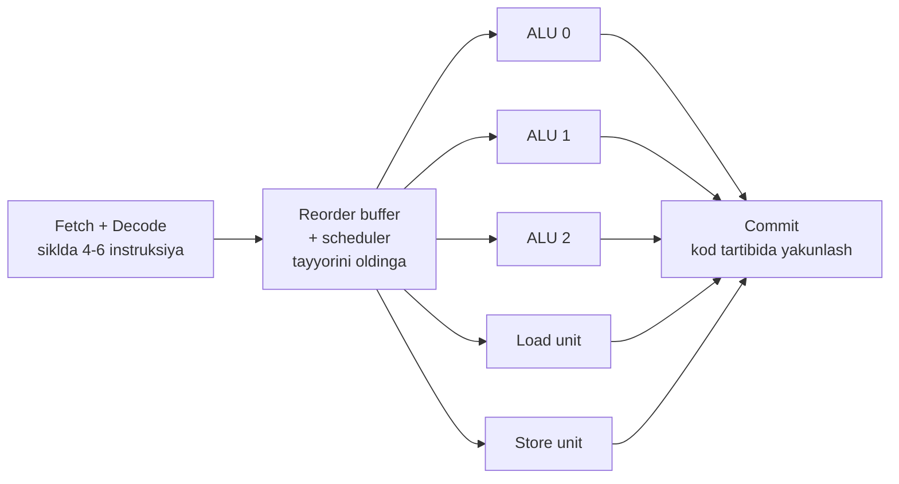
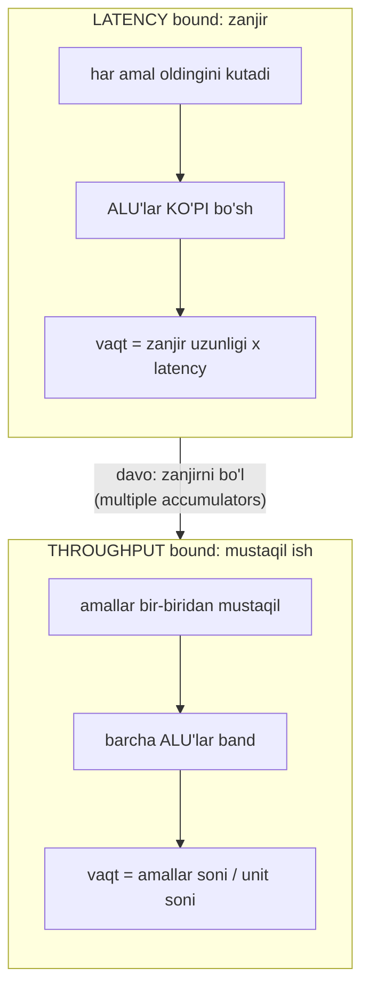
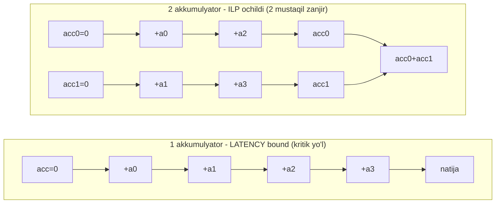

# 14. Instruction-Level Parallelism — superscalar, loop unrolling, multiple accumulators

> Manba: CS:APP 2-nashr, 5.7-5.10 · Muhit: assembly x86-64 (gcc 13.3.0); performance o'lchovlari native arm64 Apple Silicon · [← Oldingi](13-compiler-optimization.md) · [Kurs xaritasi](00-README.md) · [Keyingi →](15-profiling-bottlenecks.md)

## Nima uchun kerak

Ikkita funksiya bir xil massivning yig'indisini hisoblaydi — bir xil sonlar, bir xil `add` amallari soni — lekin biri **3 barobar** tez. Farq — kodning matematikasida emas, uni **kim va qanday** bajaradida: zamonaviy CPU "bir siklda bir instruksiya" degan qoidaga bo'ysunmaydi, u bir siklda **4-6 instruksiyani** parallel bajara oladi (superscalar).

12-darsda pipeline'ni ko'rgan eding — bir instruksiya 5 bosqichga bo'linadi va bosqichlar parallel ishlaydi. Bu dars uni **kengaytiradi**: apparat nafaqat bosqichlarni, balki **to'liq instruksiyalarni** parallel bajaradi. Muammo shundaki, kodingdagi **dependency chain** (bir amal ikkinchisining natijasini kutishi) bu parallelizmni bo'g'ib qo'yadi.

Sen ikkita muhim savolni farqlashni o'rganasan: kodim **latency bound**mi (bitta uzun zanjir CPU'ni kutishga majbur qilyaptimi) yoki **throughput bound**mi (apparat allaqachon to'lgan). Bu farq — hot numerik loop'ni tezlashtirishning kaliti. Multiple accumulators, loop unrolling va SIMD — hammasi shu bitta g'oyaga: apparatga parallel qiladigan mustaqil ish berish.

Bir jumlaga jamlaganda: bu dars kodni "matematik jihatdan bir xil, lekin apparat uchun boshqacha" ko'rish nigohini beradi. Xuddi shu nigoh 15-darsdagi profiling va 16-darsdagi cache ishining ham asosi.

## Nazariya

### 1. Zamonaviy CPU ichida — superscalar va out-of-order

12-darsda CPU'ni bir yo'lakli konveyer sifatida ko'rgan eding: instruksiya F -> D -> E -> M -> W bosqichlaridan o'tadi. Endi haqiqatni qo'shamiz: **Execute** bosqichi bitta blok emas — u bir nechta **functional unit** (funksional birlik: alohida hisoblash bloki) dan iborat. Zamonaviy CPU'da 2-4 ta integer ALU, 2 ta floating-point unit, bir nechta load/store unit bor.

**Superscalar** (bir siklda ko'p instruksiya) — CPU har siklda bitta emas, 2-6 ta instruksiyani bir vaqtda **ishga tushira** oladi, chunki ularni turli functional unit'larga tarqatadi. Bu — zavodda bitta konveyer o'rniga **bir nechta parallel konveyer** o'rnatishga o'xshaydi.

**Out-of-order** (tartibsiz bajarish) — CPU instruksiyalarni kod tartibida emas, **ma'lumot tayyor bo'lishi tartibida** bajaradi. Agar 5-instruksiyaning kirishlari tayyor, 3-niki esa xotiradan kelayotgan bo'lsa, CPU 5-ni oldinga o'tkazadi. Buning uchun ichida katta **reorder buffer** (tartibga soluvchi bufer) bor — Apple Silicon'da 600+ instruksiyani "havoda" ushlab tura oladi.

Analogiya: oshxonada bitta oshpaz taomlarni retsept tartibida ketma-ket tayyorlaydi (eski CPU). Superscalar/out-of-order oshxona — 4 oshpaz, va ular retsept raqamiga qaramay, **hozir mahsuloti tayyor** taomni oladi. Cheklovi: agar 3-taom 2-taomning sousiga bog'liq bo'lsa (dependency), 3-ni baribir kutishga majbur.

12-dars bilan bog'lanish muhim: u yerda pipeline bitta instruksiyani **bosqichlarga** (F-D-E-M-W) bo'lib, bosqichlarni parallel yuritadi — ya'ni parallelizm bitta instruksiya **ichida**. Bu dars uni bir daraja yuqoriga ko'taradi: superscalar/out-of-order **butun instruksiyalarni** parallel yuritadi — parallelizm instruksiyalar **orasida**. Ikkalasi birga ishlaydi: 12-darsdagi pipeline har functional unit ichida davom etadi, bu darsdagi superscalar esa bir nechta shunday pipeline'ni yonma-yon qo'yadi. Shuning uchun 12-darsdagi branch misprediction (noto'g'ri bashorat) bu yerda yanada qimmat — noto'g'ri yo'ldagi **o'nlab** instruksiya tashlab yuboriladi, bittasi emas.



Diagramma fikrni takrorlaydi: front-end (fetch/decode) siklda bir nechta instruksiyani oladi, scheduler ularni **bo'sh** functional unit'larga tarqatadi, oxirida commit ularni yana kod tartibida "rasmiylashtiradi" (natija to'g'ri chiqishi uchun). Muhim xulosa: agar kodingda parallel bajariladigan **mustaqil** ish bo'lsa, bu apparat uni o'zi topib parallel qiladi. Bo'lmasa — ALU'lar bo'sh turadi.

### 2. Latency va throughput — ikki xil o'lchov

Bu darsning eng muhim ikki tushunchasi. Ular bir amalni ikki tomondan o'lchaydi:

| O'lchov | Savol | Misol (integer add) |
| ------- | ----- | ------------------- |
| **Latency** | bitta amal boshidan oxirigacha necha sikl? | ~1 sikl |
| **Throughput** | har siklda nechta yangi amalni **boshlash** mumkin? | 4 (agar 4 ALU bo'lsa) |

Farqni his qilish uchun konveyer analogiyasi: mashina zavoddan chiqishi 5 soat (latency), lekin zavod **har soat** bitta tayyor mashina chiqaradi (throughput). Bu ikki son **boshqa** narsani o'lchaydi va odatda bir-biriga teng emas.

Multiply (imul) uchun 07-darsda ko'rganingdek latency ~3 sikl, lekin throughput ~1/sikl — ya'ni CPU yangi ko'paytirishni har siklda boshlay oladi, garchi natija 3 sikldan keyin chiqsa ham. Bu **pipelined functional unit**: ichida konveyer, shuning uchun ketma-ket 3 ta mustaqil ko'paytirish 3+2 = 5 sikl, 9 emas.

Nega bu farq muhim? Chunki dependency chain **latency**ni his qiladi, mustaqil ish esa **throughput**dan foydalanadi. Uch mustaqil ko'paytirishni ko'rib chiqamiz — pipelined unit ularni sikl bo'yicha shunday joylashtiradi:

| Sikl | 1 | 2 | 3 | 4 | 5 |
| ---- | - | - | - | - | - |
| **mul A** | start | ish | done | | |
| **mul B** | | start | ish | done | |
| **mul C** | | | start | ish | done |

Uchala ko'paytirish **mustaqil** bo'lgani uchun unit har siklda yangisini boshlaydi (throughput 1/sikl), garchi har birining o'zi 3 sikl olsa ham. Umumiy vaqt 5 sikl. Endi ular **bir zanjir** bo'lsa (`x = x * a`, keyin `x = x * b`) — B A tugashini kutadi, C B ni: 3 + 3 + 3 = 9 sikl. Bir xil uch amal, lekin dependency chain vaqtni deyarli ikki barobar oshirdi. Mana latency va throughput orasidagi farqning butun ma'nosi.



Bu uchinchi diagramma ikki holatni yonma-yon qo'yadi: chapda dependency chain CPU'ni bo'g'adi (ko'p ALU bo'sh, vaqt zanjirga bog'liq), o'ngda esa mustaqil ish barcha unit'ni to'ldiradi (vaqt endi apparat sig'imiga bog'liq). O'q ustidagi yozuv — bu darsning butun retsepti: latency bound holatda zanjirni bo'lib, kodni o'ngga, throughput tomonga suraman.

> **Oltin qoida.** Kodni tezlashtirishdan oldin bir savolga javob ber: men **latency**ga qamalganmanmi (bitta uzun zanjir, ALU'lar bo'sh) yoki **throughput**ga (apparat to'lgan)? Ikki holat ikki xil davo talab qiladi. Latency bound — zanjirni bo'l; throughput bound — bo'lib bo'lmaydi, ship'ga urilding.

### 3. Critical path — dependency chain kodni bo'g'adi

Endi bosh muammoni ko'ramiz. **Critical path** (kritik yo'l) — kodning bir-biriga bog'liq amallar zanjiri; eng uzun bunday zanjir kodning minimal vaqtini belgilaydi. Agar har amal **oldingisining natijasini** ishlatsa, CPU ularni parallel qila olmaydi — 3 ta ALU bo'lsa ham, 2 tasi bo'sh turadi.

Klassik misol — bitta akkumulyator bilan yig'indi:

```c
long acc = 0;
for (long i = 0; i < n; i++) acc += a[i];   /* har add oldingi acc ni kutadi */
```

Bu yerda `acc += a[0]`, keyin `acc += a[1]` uchun avvalgi `acc` **tayyor** bo'lishi shart. Zanjir uzilmaydi: add -> add -> add -> ... `n` ta bo'g'in. Har add latency'si ~1 sikl bo'lsa ham, ular **ketma-ket** — CPU'ning boshqa ALU'lari faqat qarab turadi. Bu **latency bound**: vaqt add'lar SONIga emas, ularning **zanjir uzunligiga** bog'liq.



Diagramma yuqoridagi matnni takrorlaydi: chapdagi bitta uzun zanjir — har bo'g'in oldingisini kutadi, CPU parallel qila olmaydi. O'ngda zanjir **ikkiga bo'lindi** — `acc0` va `acc1` bir-biridan **mustaqil**, CPU ularni ikki ALU'da parallel ishlaydi. Zanjir uzunligi **ikki barobar qisqardi**. Bu — keyingi ikki bo'limning butun mohiyati.

### 4. Loop unrolling — sikl overhead'ini kamaytirish

**Loop unrolling** (siklni ochish) — sikl tanasini bir necha marta takrorlab, iteratsiyalar sonini kamaytirish. Har iteratsiyada "foydali ish"dan tashqari **overhead** bor: `i++`, `i < n` taqqoslash, `jne` sakrash. `4x` unroll qilsang, bu overhead 4 iteratsiyaga bir marta to'g'ri keladi.

8 element ustidagi ishni taqqoslasak, overhead ulushi ko'rinadi:

| Variant | Foydali `add` | Overhead amallari | Overhead ulushi |
| ------- | ------------- | ----------------- | --------------- |
| unroll yo'q | 8 | 8 x (inc+cmp+jmp) = 24 | ~75% |
| 4x unroll | 8 | 2 x (inc+cmp+jmp) = 6 | ~43% |

Ko'ryapsanmi: foydali `add`lar soni bir xil (8), lekin unroll overhead'ni 24 dan 6 ga tushirdi. Kichik sikllarda bu sezilarli — CPU vaqtining katta qismi hisobga emas, sikl boshqaruviga ketardi.

```c
for (i = 0; i + 3 < n; i += 4) {       /* bitta iteratsiyada 4 element */
    acc += a[i]; acc += a[i+1]; acc += a[i+2]; acc += a[i+3];
}
for (; i < n; i++) acc += a[i];         /* qoldiq: n 4 ga bo'linmasa */
```

Muhim ogohlantirish: **sof unrolling** (bitta acc bilan) faqat overhead'ni kamaytiradi, lekin **critical path'ni qisqartirmaydi** — `acc` zanjiri baribir uzluksiz. Shuning uchun latency bound loop'da sof unrolling foyda kam beradi. Uning haqiqiy kuchi keyingi bo'limda: unrolling **multiple accumulators uchun joy ochadi**.

### 5. Multiple accumulators — ILP ochish (asosiy g'oya)

Yechim: bitta akkumulyator o'rniga bir nechta ishlatib, dependency chain'ni **mustaqil zanjirlarga bo'lish**. Bu darsning markaziy texnikasi.

```c
long acc0 = 0, acc1 = 0;
for (i = 0; i + 1 < n; i += 2) {
    acc0 += a[i];      /* zanjir A */
    acc1 += a[i+1];    /* zanjir B - acc0 dan MUSTAQIL */
}
return acc0 + acc1;    /* oxirida birlashtirish */
```

Endi `acc0` va `acc1` bir-biriga tegmaydi — CPU ularni ikki ALU'da parallel yuritadi. Har zanjir uzunligi `n/2`, ya'ni kritik yo'l ikki barobar qisqa. Latency bound kod **throughput bound**ga yaqinlashadi: endi vaqt zanjir uzunligiga emas, apparatning necha add/sikl bajara olishiga bog'liq.

Lekin bu yerda kitobning eng nozik nuqtasi: **diminishing returns** (kamayuvchi foyda). Akkumulyatorni 2 dan 4 ga oshirsang, tezlik 2x dan 4x ga **chiqmaydi**. Chunki apparatda add unit'lari soni cheklangan — 4 mustaqil zanjir bo'lsa ham, CPU'da atigi 2-4 ALU bor. Bir payt kelib sen throughput ship'iga urilasan va yangi akkumulyator qo'shish foydasiz bo'ladi. Buni kod bilan isbotlaymiz.

Yana bir chegara — **register pressure** (register bosimi). Har akkumulyator bitta registerni band qiladi. CPU'da registerlar soni cheklangan (x86-64'da 16 ta umumiy maqsadli); agar juda ko'p akkumulyator qo'ysang, kompilyator ularni registerga sig'dira olmay, ba'zilarini **stack**ka tushiradi (register spilling). Stack esa xotira — sekin. Natijada haddan ziyod akkumulyator kodni **sekinlashtiradi**. Ya'ni ikki chegara birlashadi: yuqoridan throughput ship'i, pastdan register bosimi. Optimal akkumulyator soni shu ikki chegara orasida — odatda 4-8, va uni har doim **o'lchab** aniqlaysan, taxmin qilib emas.

### 6. Reassociation — qavslarni qayta joylashtirish

Multiple accumulators'ning yaqin qarindoshi — **reassociation** (qayta guruhlash). Bitta akkumulyator bilan ham, amallarni **qayta qavslash** orqali zanjirni qisqartirish mumkin:

```c
/* ketma-ket zanjir: ((((acc + a0) + a1) + a2) + a3) */
acc = acc + a[i] + a[i+1];
/* reassociatsiya: acc + (a[i] + a[i+1]) - ichki qo'shuv MUSTAQIL */
acc = acc + (a[i] + a[i+1]);
```

Ikkinchi shaklda `a[i] + a[i+1]` `acc`dan mustaqil hisoblanadi, keyin bitta qadam bilan `acc`ga qo'shiladi. Kritik yo'l qisqaradi. **Diqqat**: floating-point'da bu natijani **o'zgartirishi** mumkin (05-darsdagi yaxlitlash), shuning uchun kompilyator uni `-ffast-math`siz o'zi qilmaydi — bu 13-darsdagi "faqat xavfsiz optimizatsiya" qoidasining aynan o'zi.

### 7. SIMD — bitta instruksiya, ko'p ma'lumot

Oxirgi daraja — **SIMD** (Single Instruction, Multiple Data: bir instruksiya bir nechta ma'lumot ustida). Oddiy `addq` ikkita 64-bitli sonni qo'shadi; SIMD `addpd` bitta instruksiyada **to'rtta yoki sakkizta** sonni qo'shadi, chunki keng vektor registerlar (x86 AVX, arm64 NEON/SVE) ishlatadi.

SIMD — multiple accumulators'ning apparat darajasidagi shakli: bitta vektor register ichida bir nechta mustaqil akkumulyator. Kompilyator `-O3`da buni avtomatik qilishga urinadi (**auto-vectorization**), lekin ishonchsiz — aliasing (13-dars) yoki murakkab kod uni to'sadi. Shuning uchun bu darsning demolarida SIMD'ni **ataylab o'chirib** (`-fno-tree-vectorize`) sof ILP ni ko'rsatamiz.

## Kod va isbot

Endi verify qilingan o'lchovlar. Performance raqamlari **native arm64 Apple Silicon**da olingan (QEMU pipeline'ni to'g'ri ko'rsatmaydi, shuning uchun native), assembly esa x86-64. Barcha timing `gcc -O2 -fno-tree-vectorize` bilan — ya'ni SIMD **o'chirilgan**, biz faqat sof instruction-level parallelism'ni ko'ramiz.

### Misol 1: uch xil akkumulyator soni

```c
/* 1 akkumulyator: latency bound - har amal oldingiga bog'liq (kritik yo'l) */
long sum1(long *a, long n) {
    long acc = 0;
    for (long i = 0; i < n; i++) acc += a[i];
    return acc;
}
/* 2 akkumulyator: 2 mustaqil zanjir - parallel */
long sum2(long *a, long n) {
    long acc0 = 0, acc1 = 0;
    long i;
    for (i = 0; i < n-1; i += 2) { acc0 += a[i]; acc1 += a[i+1]; }
    for (; i < n; i++) acc0 += a[i];
    return acc0 + acc1;
}
/* 4 akkumulyator: 4 mustaqil zanjir */
long sum4(long *a, long n) {
    long acc0=0,acc1=0,acc2=0,acc3=0;
    long i;
    for (i = 0; i < n-3; i += 4) {
        acc0 += a[i]; acc1 += a[i+1]; acc2 += a[i+2]; acc3 += a[i+3];
    }
    for (; i < n; i++) acc0 += a[i];
    return acc0+acc1+acc2+acc3;
}
```

Uchala funksiya **matematik jihatdan bir xil** natija qaytaradi va **bir xil sonda** `add` bajaradi. Farq faqat: nechta **mustaqil dependency chain** ochilgan.

Real output (native arm64, N = 200000000, `-O2 -fno-tree-vectorize`):

```
1 akkumulyator (latency bound):    0.088 s
2 akkumulyator (2x parallel):      0.048 s  (1.84x)
4 akkumulyator (4x parallel):      0.030 s  (2.90x)
```

Uch qatorni bir-bir o'qiymiz:

- **sum1 — 0.088 s (latency bound).** Har `acc += a[i]` oldingi `acc` ni kutadi. Bitta uzun kritik yo'l, `n` ta bo'g'in. CPU'ning qolgan ALU'lari bo'sh turadi — apparat parallelizmi umuman ishlatilmaydi. Vaqt add'lar soniga emas, zanjir uzunligiga bog'liq.

- **sum2 — 0.048 s (1.84x).** Ikki mustaqil zanjir. CPU `acc0` va `acc1` add'larini ikki ALU'da bir vaqtda bajaradi. Kritik yo'l ikki barobar qisqardi -> deyarli 2x tezlanish. "Deyarli", chunki oxirgi birlashtirish va sikl overhead'i biroz yo'qotadi.

- **sum4 — 0.030 s (2.90x).** To'rt mustaqil zanjir. Lekin diqqat: **4x emas, atigi 2.90x!**

### Diminishing returns — bu darsning eng muhim xulosasi

2 akkumulyator 1.84x berdi (~2x, kutilgan). Lekin 4 akkumulyator 4x emas, faqat **2.90x** berdi. Nega yarim yo'lda to'xtadi?

Chunki biz endi **throughput bound**ga yaqinlashdik. 2 akkumulyator bilan zanjirni qisqartirib CPU'ning bo'sh ALU'larini to'ldirdik. Lekin CPU'da add unit'lari **cheklangan soni** bor — 4 mustaqil zanjir bersang ham, apparat ularni 4 tomon bo'lib bera olmaydi, chunki jismonan atigi 2-4 ALU bor va ular allaqachon band. Yangi akkumulyator qo'shish endi bo'sh unit topmaydi.

Ideal (chiziqli) va real tezlanishni yonma-yon qo'ysak, farq ko'zga tashlanadi:

| Akkumulyator | Ideal (chiziqli) | Real (o'lchangan) | Ideal foizi |
| ------------ | ---------------- | ----------------- | ----------- |
| 1 | 1.00x | 1.00x | 100% |
| 2 | 2.00x | 1.84x | 92% |
| 4 | 4.00x | 2.90x | 72% |

1 dan 2 ga o'tishda idealning 92% ni oldik — CPU'da bo'sh ALU ko'p edi, zanjirni bo'lish deyarli to'liq ishladi. 2 dan 4 ga o'tishda esa idealning atigi 72% — ship ko'rinib qoldi. Egri chiziq tekislanmoqda: agar 8 akkumulyatorgacha davom etsak, foiz yanada pastga tushadi va bir joyda **umuman o'smaydi**. Bu tekislanish nuqtasi — apparatning haqiqiy ILP kengligi.

> **Oltin qoida.** ILP cheksiz emas. Latency bound holatda akkumulyator qo'shish kuchli yordam beradi; lekin throughput ship'iga yaqinlashgach har yangi akkumulyator kamroq foyda beradi va oxiri **umuman foyda bermaydi** (faqat kod murakkablashadi). Bu — apparat chegarasi, kod ayb emas.

Bu kitobning bosh saboqlaridan biri: optimizatsiya "ko'proq har doim yaxshi" degani emas. Sen apparatning **necha wide** ekanini bilib, o'sha nuqtada to'xtaysan. Aksariyat CPU uchun 4-6 akkumulyator amaliy chegara.

### Misol 2: assembly — dependency chain o'z ko'zi bilan

x86-64 assembly (`gcc -O2 -fno-tree-vectorize`) farqni ochib beradi. sum1 ichki sikli — **bitta zanjir**:

```asm
.L3:
	addq	(%rdi), %rax        # acc (%rax) += a[i] - HAR safar %rax ni kutadi
	addq	$8, %rdi
	cmpq	%rdx, %rdi
	jne	.L3
```

Bu yerda har `addq (%rdi), %rax` oldingi `%rax` qiymatini ishlatadi. CPU keyingi `addq`ni boshlashdan oldin bu tugashini kutishga majbur — `%rax` bitta, u ustidagi zanjir uzluksiz. Bu **latency bound**: taxminan 1 add/sikl, qolgan ALU'lar bo'sh.

sum2 ichki sikli — **ikki mustaqil zanjir**:

```asm
.L9:
	addq	(%rdx), %rax        # acc0 (%rax) += a[i]
	addq	8(%rdx), %rcx        # acc1 (%rcx) += a[i+1] - %rax'dan MUSTAQIL!
	addq	$16, %rdx
	cmpq	%r8, %rdx
	jne	.L9
```

Mana ILP assembly darajasida. `%rax` va `%rcx` — **boshqa-boshqa register**, ular ustidagi ikki `addq` bir-biridan mustaqil. CPU ularni **bir siklda ikki execution unit**da parallel bajaradi (superscalar). Instruksiyalar soni deyarli bir xil, lekin sum2 bir siklda ikki ALU'ni band qiladi, sum1 esa bittasini. Register nomlaridagi bu kichik farq — 1.84x tezlanishning butun sababi.

Diqqat qil: ikkala loop'da ham **bir xil sondagi** `addq` foydali ish bor. Farq faqat — natija bir registerga to'planyaptimi (zanjir) yoki ikkitasiga (parallel). ILP haqidagi butun dars shu kuzatuvga sig'adi.

Buni sikl bo'yicha ko'rsak, ikki loop'ning to'rt element ustidagi ishi shunday joylashadi (soddalashtirilgan, add latency ~1 sikl deb):

| Sikl | sum1 (1 zanjir) | sum2 (2 zanjir) |
| ---- | --------------- | --------------- |
| 1 | `acc += a0` | `acc0 += a0` **va** `acc1 += a1` |
| 2 | `acc += a1` | `acc0 += a2` **va** `acc1 += a3` |
| 3 | `acc += a2` | (tugadi) |
| 4 | `acc += a3` | |

sum1 to'rt elementga 4 sikl sarflaydi — har add avvalgisini kutgani uchun. sum2 esa har siklda ikki add'ni parallel bajarib, xuddi shu ishni 2 siklda tugatadi. Ikki ALU band bo'lgani uchun ish ikki barobar tez. Real o'lchov (1.84x) nazariy 2x'dan biroz past — sikl overhead'i va oxirgi `acc0+acc1` birlashtirishi tufayli. Bu jadval `addq` assembly'sining aynan sikl-timeline'i.

### Misol 3: SIMD tasdig'i

Xuddi shu `sum4` ni `gcc -O3` bilan (auto-vectorization **yoqilgan**) kompilyatsiya qilsak, arm64 assembly'da **NEON vektor instruksiyalar** paydo bo'ladi. `objdump -d` sum4 tanasida `v0.2d` kabi vektor registerli **11 ta NEON instruksiya** topdi — ya'ni kompilyator 4 akkumulyatorni SIMD'ga aylantirdi: bitta vektor instruksiya bir nechta `long`ni parallel qo'shadi.

Nega aniq timing ko'rsatmaymiz? Chunki `-O3`da bu loop **memory bandwidth bound** bo'lib qoladi (xotiradan 200 million element o'qish CPU'dan tezroq to'siq bo'ladi — 16-darsdagi cache mavzusi) va o'lchov shovqinli chiqadi. Shuning uchun sof ILP ni ko'rsatishga 1-demoda `-fno-tree-vectorize` ishlatdik. SIMD haqida bu yerda **kontseptual** gapiramiz: kompilyator multiple accumulators'ni ko'rsa, uni yana bir pog'ona yuqoriga — vektorga ko'tarishga urinadi.

## Go dasturchiga ko'prik

Go kontekstida ikkita muhim haqiqat bor.

**1. Go kompilyatori auto-vectorization'da juda zaif.** gcc/clang `-O3`da loop'larni SIMD'ga aylantiradi (garchi ishonchsiz bo'lsa ham). Go kompilyatori esa deyarli hech qachon avtomatik vektorizatsiya qilmaydi — bu ataylab qilingan dizayn qarori (tez kompilyatsiya, sodda kod naslida). Amaliy natija: hot numerik Go loop'da **qo'lda** multiple accumulators va unrolling yozish gcc'dagidan **ko'proq** foyda beradi, chunki kompilyator senga yordamga kelmaydi.

```go
// latency bound: bitta akkumulyator
func sum1(a []int64) int64 {
    var acc int64
    for _, v := range a {
        acc += v // har add oldingi acc ni kutadi
    }
    return acc
}

// ILP ochilgan: 4 mustaqil zanjir - Go'da ham xuddi C'dagidek ishlaydi
func sum4(a []int64) int64 {
    var a0, a1, a2, a3 int64
    i := 0
    for ; i+3 < len(a); i += 4 {
        a0 += a[i]     // zanjir 0
        a1 += a[i+1]   // zanjir 1 - mustaqil
        a2 += a[i+2]   // zanjir 2 - mustaqil
        a3 += a[i+3]   // zanjir 3 - mustaqil
    }
    for ; i < len(a); i++ {
        a0 += a[i] // qoldiq
    }
    return a0 + a1 + a2 + a3
}
```

Bu qo'lda unrolling'ni Go apparatga o'zi yetkazadi — CPU 4 mustaqil `int64` zanjirini ko'radi va C'dagi kabi parallel qiladi. (Kod kontseptual; aniq timing profil bilan o'lchanadi — 15-dars.)

Go'da bunday farqni o'zing o'lchashning eng to'g'ri yo'li — `testing.B` benchmark. Ikki funksiyani yonma-yon qo'yasan:

```go
func BenchmarkSum1(b *testing.B) {
    for i := 0; i < b.N; i++ { _ = sum1(data) }
}
func BenchmarkSum4(b *testing.B) {
    for i := 0; i < b.N; i++ { _ = sum4(data) }
}
```

`go test -bench=.` ns/op ustunini beradi. Native arm64'da real o'lchov (10000 elementli slice) buni tasdiqlaydi:

```
BenchmarkSum1-10    	  375626	      3159 ns/op
BenchmarkSum4-10    	  554328	      2183 ns/op
```

sum4 (2183 ns/op) sum1'dan (3159 ns/op) ~1.45x tez — Go'da ham qo'lda multiple accumulators ILP ochadi (C'dagi 2.90x kabi kuchli emas, chunki Go bounds check va boshqa overhead qo'shadi). Muhim tafsilot: natijani `_ =` ga saqla yoki paketdagi global'ga yoz, aks holda Go kompilyatori "natija ishlatilmayapti" deb butun chaqiruvni **o'chirib** tashlashi mumkin (dead code elimination) — 13-darsdagi optimizatsiya to'sig'ining teskarisi. O'lchov shovqinini kamaytirish uchun `-count=10` bilan bir necha marta chopib, medianani ol.

**2. Go'da SIMD — assembly yoki intrinsics.** To'liq SIMD kerak bo'lsa uch yo'l bor: (a) qo'lda `.s` assembly fayli yozish (murakkab, inline va async preemption'ni to'sadi); (b) `minio/simd` kabi kutubxonalar; (c) yaqin kelajakda tilga qo'shilayotgan portativ `simd` package (Go 1.27 RC'da experimental archsimd amd64/arm64/wasm uchun). Ko'p standart kutubxona funksiyalari (masalan `crypto`, `bytes`) allaqachon qo'lda yozilgan SIMD assembly ishlatadi.

**Muhim farqni chalkashtirma.** Bu darsdagi ILP — **instruction-level** parallelism: bitta goroutine, bitta yadro ichida instruksiyalar parallel. Goroutine'lar esa **task-level** parallelism (34-dars) — ko'p yadro. Bular ikki **boshqa** daraja: 4 akkumulyator bir yadroda ishlaydi, goroutine'lar yadrolarni bo'lishadi. Ikkalasini birga ishlatib — har goroutine ichida multiple accumulators — eng yuqori tezlikka chiqasan.

## Real-world scenariylar

**1. Numerik hot loop — multiple accumulators 2-3x.** Yig'indi, dot product (ikki vektor skalyar ko'paytmasi), hash hisoblash, checksum, moliyaviy agregatsiya. Bularning hammasi "ketma-ket bitta akkumulyatorga qo'shish" naqshiga tushadi — ya'ni latency bound. Multiple accumulators bilan 2-3x oling. Bu — CS:APP demosining aynan real hayotdagi ko'rinishi. Masalan floating-point ko'paytmali yig'indi (dot product) bunda ayniqsa sezgir: `fma` (fused multiply-add) latency'si ~4-5 sikl, shuning uchun bitta akkumulyator zanjiri juda uzun bo'ladi va CPU'ni uzoq kutishga majbur qiladi. Bu yerda 4-8 akkumulyator ba'zan integer holatdan **ko'proq** foyda beradi, chunki yashiriladigan latency katta.

**2. Latency bound linked-list traversal — unrolling YORDAM BERMAYDI.** `node = node->next` bilan ro'yxatni aylanish: keyingi element manzili **oldingi elementdan** o'qiladi. Bu tuzatib bo'lmaydigan dependency chain — sen `node->next` ni bilmasang, keyingi `load`ni **boshlay olmaysan**. Unrolling ham, multiple accumulators ham bu zanjirni uzolmaydi. Ustiga har `load` cache miss bo'lsa (16-dars), latency yanada yomon. Bu — "hamma latency bound kodni tezlashtirib bo'lmaydi" degan muhim saboq: ba'zi zanjirlar tabiatan uzilmas (**pointer chasing**).

**3. SIMD kutubxonalar — 4-8x.** Image processing (piksellar ustida bir xil amal), kriptografiya (AES, SHA), ML inference (matritsa ko'paytmasi), video kodeklar. Bularda ma'lumot mustaqil va bir xil amal ko'p elementga tushadi — SIMD'ning ideal maydoni. Shuning uchun bu kutubxonalar deyarli hamma joyda qo'lda yozilgan vektor assembly ishlatadi va 4-8x tezlanish beradi.

## Zamonaviy yondashuv

Web sintezi ko'rsatadiki, kitob yozilgandan beri apparat yanada kengaydi:

- **Wide superscalar.** Zamonaviy CPU 4-8 wide (siklda 4-8 instruksiya ishga tushiradi). Apple Silicon front-end 8 wide, reorder window 600+ instruksiya — ya'ni CPU 600 ta instruksiyani "havoda" ushlab, ular orasidan tayyorlarini topib bajaradi. Bu — CS:APP davridagidan ancha ko'p ILP izlaydi, lekin dependency chain baribir bosh to'siq bo'lib qoladi.

- **Kengaygan SIMD.** x86 AVX-512 (512-bitli register, 8 ta `double` parallel), arm64 NEON (128-bit) va SVE (o'zgaruvchan uzunlik). Auto-vectorization gcc/clang `-O3`da ishlaydi, lekin **ishonchsiz** — aliasing (13-dars), murakkab control flow yoki funksiya chaqiruvi uni to'sadi. Ishonchli natija uchun kompilyator **intrinsics** (til ichiga qurilgan vektor funksiyalari) yoki qo'lda assembly ishlatiladi.

- **ILP ning yuqori chegarasi.** Ikki tomondan cheklanadi: (a) **Amdahl qonuni** — ketma-ket qism parallelizmni bo'g'adi (15-dars); (b) **memory bandwidth** — xotiradan ma'lumot yetib kelmasa, ALU'lar qancha ko'p bo'lsa ham bo'sh turadi (16-18-dars, cache). Shuning uchun real optimizatsiya har doim **profil** bilan boshlanadi: avval bottleneck qayerda ekanini o'lchaysan (15-dars), keyin to'g'ri davoni tanlaysan.

- **Go va SIMD.** Go SIMD'ni tilga sekin qo'shmoqda; hozircha eng ishonchli yo'l — hot yo'lda qo'lda multiple accumulators/unrolling (kompilyator zaifligini qoplaydi) va zarurat bo'lsa assembly yoki tayyor SIMD kutubxona.

Amaliy jamlanma — qaysi holatda qaysi texnika ishlaydi (avval **o'lch**, keyin tanla):

| Holat (profildan) | Belgi | To'g'ri davo | Nima ishlamaydi |
| ----------------- | ----- | ------------ | --------------- |
| Latency bound | bir uzun dependency chain, ALU bo'sh | multiple accumulators, reassociation | sof unrolling (zanjir qoladi) |
| Throughput bound | ALU'lar to'lgan, ILP ship'ida | SIMD, algoritmni o'zgartirish | ko'proq akkumulyator |
| Register spilling | juda ko'p akkumulyator, stack'ga tushish | akkumulyator sonini kamaytirish | yana akkumulyator qo'shish |
| Memory bound | xotira kutuvi, cache miss (16-dars) | ma'lumot joylashuvi, blocking | ILP/SIMD (ALU baribir kutadi) |
| Branch bound | branch-misses ko'p (12-dars) | branchsiz kod, sorting | akkumulyator/SIMD |

Bu jadval butun performance ishining kartasi: profilerdan (15-dars) belgini o'qiysan, keyin mos qatordagi davoni qo'llaysan. Eng ko'p uchraydigan xato — belgini o'qimay, "to'g'ri kelgan" davoni qo'llash (masalan memory bound kodga SIMD qo'shish).

## Keng tarqalgan xatolar

**1. "CPU instruksiyalarni ketma-ket bajaradi."** Yo'q. Zamonaviy CPU superscalar va out-of-order: bir siklda 4-8 instruksiya, kod tartibida emas ma'lumot tayyor tartibida. Kod ketma-ket **ko'rinadi**, lekin apparat undagi mustaqil ishni topib parallel qiladi. Buni tushunmasang, nega sum2 sum1'dan tez ekanini hech tushuntirib bilmaysan.

**2. "N akkumulyator N barobar tez."** Yo'q — **diminishing returns**. 2 akkumulyator 1.84x berdi (~2x), lekin 4 akkumulyator 4x emas, atigi 2.90x. Chunki apparatda ALU soni cheklangan; bir payt throughput ship'iga urilasan va yangi akkumulyator foyda bermaydi. Har doim eng yaxshi akkumulyator sonini **o'lchab** top, ko'r-ko'rona oshirma.

**3. Latency bound kodni unrolling bilan tezlashtirmoqchi bo'lish.** Sof unrolling (bitta akkumulyator bilan) faqat sikl overhead'ini kamaytiradi — dependency chain o'z joyida qoladi, kritik yo'l qisqarmaydi. Latency bound loop'da haqiqiy davo — **multiple accumulators** yoki reassociation (zanjirni bo'lish), sof unrolling emas.

**4. "Kompilyator hammasini vektorizatsiya qiladi."** `-O3`da ham ishonchsiz. Aliasing (13-dars) kompilyatorga ikki pointer ustma-ust tushmasligini isbotlashga imkon bermasa, u vektorizatsiyani **umuman qilmaydi** — 13-darsdagi "faqat xavfsiz optimizatsiya" qoidasi. Vektorizatsiya bo'ldi deb taxmin qilma, `objdump` bilan **tekshir** yoki kompilyator hisobotini o'qi.

**5. SIMD'ni har joyda kutish.** Agar loop **memory bound** bo'lsa (xotiradan ma'lumot yetib kelmasa), SIMD ham, ko'p akkumulyator ham foyda bermaydi — ALU'lar baribir ma'lumot kutib bo'sh turadi. Optimizatsiyadan oldin bottleneck compute'mi yoki memory'mi ekanini aniqla (15-16-dars).

**6. Float'da reassociation'ni beparvo qo'llash.** Multiple accumulators va reassociation zanjirni qisqartiradi, lekin **float** natijani o'zgartiradi:

```c
/* bu ikki shakl integer'da bir xil, float'da BOSHQA natija berishi mumkin */
acc = ((acc + a[0]) + a[1]) + a[2];   /* ketma-ket yaxlitlash */
acc = acc + ((a[0] + a[1]) + a[2]);   /* boshqa yaxlitlash tartibi */
```

Sabab 05-darsda: float qo'shuv assotsiativ emas, yaxlitlash tartibi natijaga ta'sir qiladi. Shuning uchun kompilyator buni `-ffast-math`siz **o'zi qilmaydi**. Agar sen qo'lda qilsang, moliyaviy yoki ilmiy hisobda bu **noto'g'ri javob** berishi mumkin — tezlik uchun aniqlikni qurbon qilyapsanmi, ongli qaror qil.

## Amaliy mashqlar

**1.** sum2 1.84x, sum4 2.90x berdi. Nega sum4 to'liq 4x emas? Bir jumlada tushuntir.

<details>
<summary>Yechim</summary>

Chunki throughput bound'ga yaqinlashdik: apparatdagi add/ALU unit'lari soni cheklangan, 4 mustaqil zanjir bo'lsa ham CPU'da ularni bir vaqtda yuritadigan 4 ta bo'sh unit yo'q — diminishing returns. sum2 da bo'sh ALU'larni to'ldirdik, sum4 da esa ular allaqachon band.
</details>

**2.** Quyidagi loop latency bound'mi yoki throughput bound? Nega?
```c
long acc = 1;
for (int i = 0; i < n; i++) acc *= a[i];
```

<details>
<summary>Yechim</summary>

Latency bound. Har `acc *= a[i]` oldingi `acc` ni kutadi — bitta uzluksiz dependency chain. Ustiga ko'paytirish (imul) latency'si qo'shishdan katta (~3 sikl, 07-dars), shuning uchun zanjir yanada uzun. Davo: multiple accumulators (`acc0 *= ...; acc1 *= ...`).
</details>

**3.** Bu ikki assembly loop'dan qaysi biri ILP ochadi va nimadan bilding?
```asm
# A
.L: addq (%rdi), %rax
    addq $8, %rdi
    jne .L
# B
.L: addq (%rdx), %rax
    addq 8(%rdx), %rcx
    addq $16, %rdx
    jne .L
```

<details>
<summary>Yechim</summary>

B ILP ochadi. A da barcha foydali add bitta `%rax` registeriga to'planadi — uzluksiz zanjir (latency bound). B da esa `%rax` va `%rcx` **boshqa-boshqa register**, ular ustidagi add'lar mustaqil — CPU ikkalasini parallel bajaradi (superscalar). Register nomlarining farqi mustaqillik belgisi.
</details>

**4.** Linked-list ni aylanayotgan `node = node->next` loop'ida multiple accumulators yordam beradimi? Nega?

<details>
<summary>Yechim</summary>

Yo'q. Keyingi `node` manzili joriy `node`dan o'qiladi — bu uzilmas dependency chain (pointer chasing). Sen `node->next` ni bilmasang keyingi qadamni **boshlay olmaysan**, shuning uchun mustaqil zanjir ochib bo'lmaydi. Bu tabiatan latency bound; ustiga har load cache miss bo'lishi mumkin (16-dars).
</details>

**5.** Do'sting aytdi: "Loop'imni 8 akkumulyatorga o'tkazdim, endi 8x tez bo'ladi." Uni qanday to'g'irlaysan?

<details>
<summary>Yechim</summary>

8x bo'lmaydi — diminishing returns. Apparat 4-6 wide bo'lsa, 4-6 akkumulyatordan keyin qo'shimchasi foyda bermaydi (throughput ship'i). Ba'zan ko'p akkumulyator register bosimi (register spilling) tufayli **sekinlashtiradi**. To'g'ri yo'l: 1, 2, 4, 8 akkumulyatorni o'lchab, foyda to'xtagan nuqtada qolish.
</details>

**6.** Nega bu darsning barcha timing'lari `-fno-tree-vectorize` bilan olingan? Bu flagni olib tashlasak (`-O3`) nima o'zgaradi?

<details>
<summary>Yechim</summary>

`-fno-tree-vectorize` SIMD'ni o'chiradi, shuning uchun biz **sof** ILP ni (register-darajasidagi parallelizm) ko'ramiz. `-O3`da kompilyator loop'ni SIMD'ga aylantiradi (arm64'da NEON) va o'lcham memory bandwidth bound bo'lib shovqinli chiqadi — sof ILP effekti aralashib ketadi. O'quv maqsadida ikki effektni ajratdik.
</details>

**7.** `acc = acc + a[i] + a[i+1]` ni reassociation bilan qanday yozasan va nega bu yordam beradi? Integer va float uchun farqi bormi?

<details>
<summary>Yechim</summary>

`acc = acc + (a[i] + a[i+1])`. Endi `a[i] + a[i+1]` `acc`dan mustaqil hisoblanadi (parallel), keyin bitta qadamda `acc`ga qo'shiladi — kritik yo'l qisqaradi. Integer'da natija bir xil (assotsiativ). Float'da esa yaxlitlash tufayli natija **o'zgarishi** mumkin (05-dars), shuning uchun kompilyator uni `-ffast-math`siz o'zi qilmaydi (13-dars, xavfsiz optimizatsiya).
</details>

## Cheat sheet

| Tushuncha | Nima | Eslab qolish |
| --------- | ---- | ------------ |
| **superscalar** | siklda bir nechta instruksiya ishga tushirish | bir emas, ko'p konveyer |
| **out-of-order** | kod tartibida emas, ma'lumot tayyor tartibida bajarish | tayyorini oldinga o'tkaz |
| **functional unit** | alohida hisoblash bloki (ALU, load/store) | 2-4 ALU parallel |
| **latency** | bitta amal boshidan oxirigacha necha sikl | mashina zavoddan chiqish vaqti |
| **throughput** | har siklda nechta yangi amal boshlash mumkin | zavod har soat mashina chiqaradi |
| **critical path** | eng uzun dependency chain, minimal vaqtni belgilaydi | uzun zanjir = sekin |
| **dependency chain** | har amal oldingining natijasini kutadi | zanjir uzilmasa parallel yo'q |
| **latency bound** | vaqt zanjir uzunligiga bog'liq, ALU bo'sh | davo: zanjirni bo'l |
| **throughput bound** | apparat unit'lari to'lgan | davo yo'q, ship'ga urilding |
| **loop unrolling** | sikl tanasini takrorlab overhead kamaytirish | multiple acc uchun joy ochadi |
| **multiple accumulators** | zanjirni mustaqil zanjirlarga bo'lish -> ILP | sum2 1.84x, sum4 2.90x |
| **diminishing returns** | N akkumulyator N x EMAS, throughput chegarasi | 4 acc = 2.9x, 4x emas |
| **reassociation** | qavslarni qayta joylash, zanjir qisqartirish | float'da natija o'zgaradi |
| **reorder buffer** | tayyor instruksiyani topib oldinga o'tkazuvchi bufer | Apple Silicon 600+ |
| **pipelined unit** | ichida konveyer bo'lgan functional unit | latency > 1, throughput 1/sikl |
| **register pressure** | akkumulyator ko'p bo'lsa register yetmaydi | spilling -> stack -> sekin |
| **memory bound** | xotira kutuvi bottleneck, ALU bo'sh (16-dars) | ILP/SIMD foyda bermaydi |
| **SIMD** | bitta instruksiya, ko'p ma'lumot (vektor) | multiple acc ning apparat shakli |

## Qo'shimcha manbalar

- [Superscalar, pipelining va out-of-order execution — vizual tushuntirish (Vectree)](https://vectree.io/c/superscalar-execution-pipelining-and-out-of-order-execution-in-modern-cpus)
- [Understanding Out-of-Order Execution (The Coding Gopher)](https://thecodinggopher.substack.com/p/understanding-out-of-order-execution)
- [Go SIMD intrinsics taklifi va holati (golang/go issue 73787)](https://github.com/golang/go/issues/73787)
</content>
</invoke>
