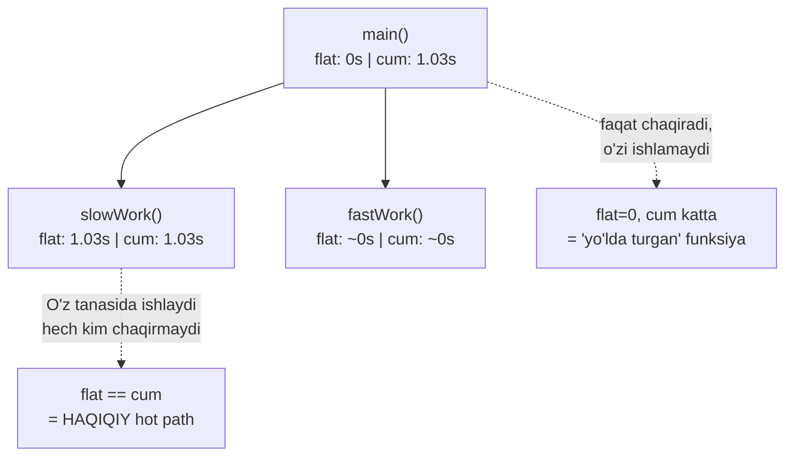
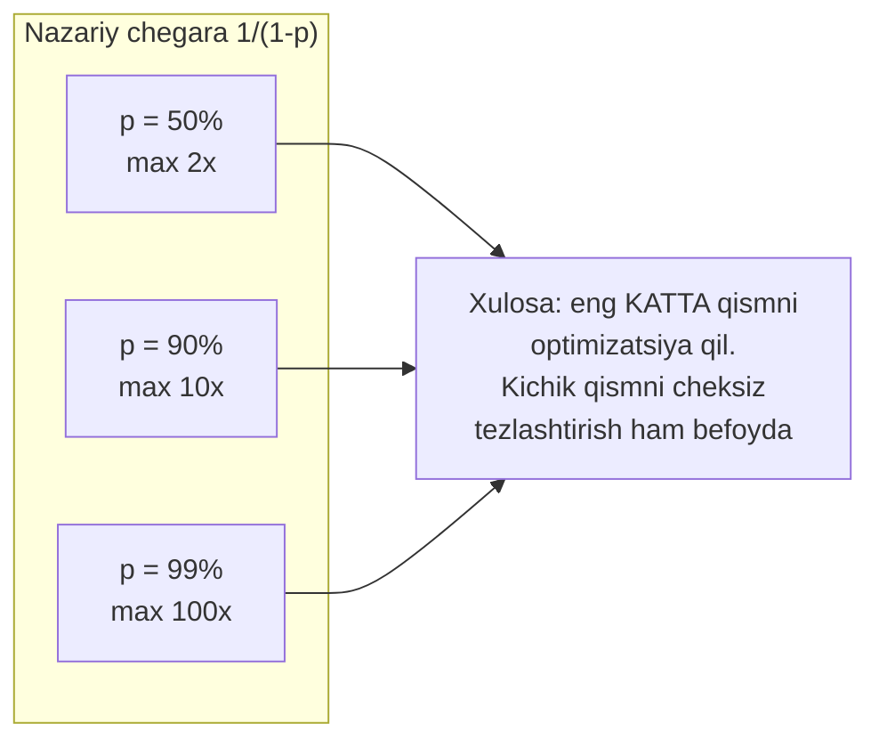
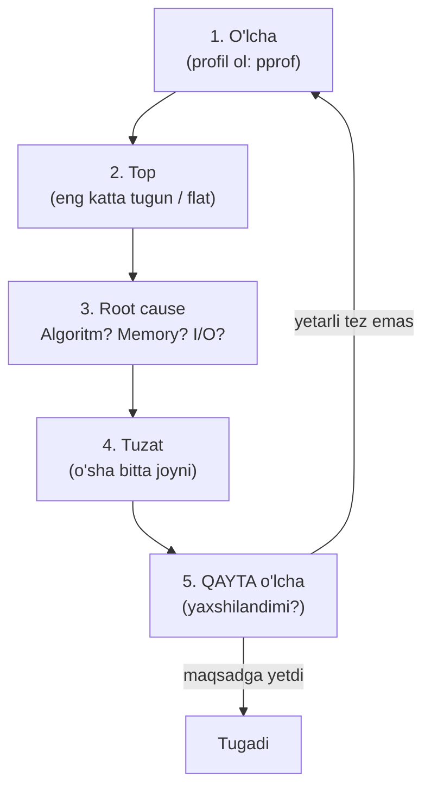

# 15. Profiling va Bottleneck'lar — o'lcha, taxmin qilma

> Manba: CS:APP 2-nashr, 5.11-5.14 · Muhit: Go pprof (Docker csapp); Amdahl o'lchovlari native arm64 · [← Oldingi](14-instruction-level-parallelism.md) · [Kurs xaritasi](00-README.md) · [Keyingi →](16-storage-locality.md)

## Nima uchun kerak

Dasturchilar optimizatsiya vaqtining 90% ini NOTO'G'RI joyga sarflaydi. "Menimcha bu funksiya sekin" degan taxmin deyarli har doim xato bo'lib chiqadi — inson intuitsiyasi bottleneck'ni topa olmaydi. **Profiling** (dasturni ishlatib, vaqt qayerga ketayotganini o'lchash) bir daqiqada haqiqiy issiq nuqtani ko'rsatadi. **Amdahl's law** esa nega 1% qismni 100 marta tezlashtirish umuman befoyda ekanini matematik isbotlaydi. Bu 5-bobning butun amaliy yakuni: 12-14-darslarda mikro-optimizatsiyalarni o'rgandik, endi QAYSI kodni optimizatsiya qilishni tanlashni o'rganamiz.

## Nazariya

### 1. Performance engineering falsafasi — "measure, don't guess"

Butun bob bitta jumlaga sig'adi:

> **O'lcha, taxmin qilma.** Optimizatsiyani boshlashdan oldin profil ol; profildan keyin ham qayta o'lcha.

Donald Knuth 1974-yilda mashhur qoidani aytgan: *"We should forget about small efficiencies, say about 97% of the time: **premature optimization is the root of all evil**. Yet we should not pass up our opportunities in that critical 3%."*

Bu jumla ko'p noto'g'ri tushuniladi. Knuth "hech qachon optimizatsiya qilma" demagan. U aytgan: **avval o'lcha**, "critical 3%" ni top, faqat o'sha yerni optimizatsiya qil, qolgan 97% da kodni toza va tushunarli qoldir. **Premature optimization** (vaqtidan oldin optimizatsiya) — bu o'lchamasdan, taxminga tayanib, hali bottleneck ekani isbotlanmagan kodni murakkablashtirishdir.

Nega intuitsiya ishlamaydi? Sabablari:

- Zamonaviy CPU murakkab: pipeline (12-dars), superscalar/ILP (14-dars), cache (16-dars). "Ko'p qatorli kod = sekin" degan sodda mantiq ishlamaydi.
- Compiler kodni o'zgartiradi (13-dars): inline, dead code elimination. Sen ko'rgan manba kod bilan bajarilgan mashina kodi boshqa.
- Vaqt ko'pincha kutilmagan joyda o'tadi: log yozish, memory allokatsiya, GC (27-dars), tarmoq I/O.

### 2. Profiling qanday ishlaydi — sampling vs instrumentation

Ikki xil profiling usuli bor:

| Usul | Qanday ishlaydi | Yaxshi tomoni | Yomon tomoni |
| --- | --- | --- | --- |
| **Sampling** (statistik) | Timer har ~10 ms da dasturni to'xtatib "hozir qaysi funksiyadasan?" deb so'raydi | Overhead kichik, production'da ishlaydi | Statistik — kam bajarilgan kodni o'tkazib yuborishi mumkin |
| **Instrumentation** | Compiler har funksiya kirish/chiqishiga hisoblagich qo'yadi | Aniq chaqiriq soni | Overhead katta, dasturni sekinlashtiradi, natijani buzadi |

Go pprof va Linux `perf` — **sampling** profiler. `gprof` (kitobda ishlatilgan klassik vosita) instrumentation + sampling aralashi. Sampling asosiy g'oyasi oddiy: agar dastur vaqtining 99% ini `slowWork` da o'tkazsa, tasodifiy olingan namunalarning ~99% i `slowWork` ustiga tushadi. Ko'p namuna = ishonchli statistika.

Sampling natijasini o'qishda ikki muhim ustun bor:

- **flat** — FAQAT shu funksiyaning O'Z tanasida o'tgan vaqt (u chaqirgan boshqa funksiyalar hisobga olinmaydi).
- **cumulative (cum)** — shu funksiya + u chaqirgan barcha funksiyalarda o'tgan JAMI vaqt.



Qoida: **cum katta, flat kichik** bo'lsa — bu funksiya faqat boshqalarni chaqiradi (masalan `main`), uni optimizatsiya qilib bo'lmaydi. **flat katta** bo'lsa — mana shu funksiyaning O'Z kodi vaqt yeydi, optimizatsiya shu yerda.

### 3. Amdahl's law — optimizatsiyaning matematik chegarasi

Faraz qil: dasturing 10 soniya ishlaydi. Uning **p** ulushini (masalan p=0.95, ya'ni 95%) **k** marta tezlashtirsang, UMUMIY tezlashuv qancha bo'ladi?

Amdahl's law javob beradi:

> **Speedup = 1 / ( (1 − p) + p/k )**

Bu yerda:
- **p** — optimizatsiya qilinadigan qism ulushi (0..1)
- **(1 − p)** — o'zgarmaydigan (optimizatsiya qilinmagan) qism
- **k** — o'sha qismni necha marta tezlashtirdik

Ichki mantiq juda sodda: yangi vaqt = o'zgarmagan qism `(1-p)` + tezlashgan qism `p/k`. Umumiy tezlashuv = eski vaqt (1) bo'lingan yangi vaqtga.

Konkret raqamda tushunamiz. Dastur 100 soniya ishlaydi: 80 soniya "og'ir" qismda (p=0.8), 20 soniya qolgan hamma narsada. Og'ir qismni 4 marta (k=4) tezlashtirsak, u 80s dan 20s ga tushadi. Yangi umumiy vaqt = 20s (o'zgarmagan) + 20s (tezlashgan) = 40s. Umumiy tezlashuv = 100/40 = **2.5x**. Formula ham shuni beradi: `1/((1-0.8)+0.8/4) = 1/0.4 = 2.5x`. Diqqat qil: og'ir qismni 4x qildik, lekin butun dastur atigi 2.5x tezlashdi — qolgan 20 soniya "og'ir tosh" bo'lib qoldi.

Eng muhim natija — **k ni cheksizga oshirsang** (`p/k → 0`):

> **Nazariy chegara = 1 / (1 − p)**

Ya'ni p qismni CHEKSIZ tezlashtirsang ham, umumiy tezlashuv `1/(1-p)` da TO'XTAYDI, chunki qolgan `(1-p)` qism o'zgarmaydi. Bu backend dev uchun eng qimmatli saboq:

| Optimizatsiya qilingan qism (p) | Maksimal umumiy tezlashuv (k=∞) |
| --- | --- |
| 50% | 1/(1−0.5) = **2x** |
| 90% | 1/(1−0.9) = **10x** |
| 95% | 1/(1−0.95) = **20x** |
| 99% | 1/(1−0.99) = **100x** |
| 99.9% | 1/(1−0.999) = **1000x** |



Amdahl'ning amaliy talqini: agar bir funksiya butun vaqtning atigi 5% ini yesa, uni butunlay yo'q qilsang ham (cheksiz tezlashtirsang), maksimal 1/(1-0.05) = 1.05x, ya'ni bor-yo'g'i 5% yutasan. Shuning uchun profil ol, eng KATTA qismni topib, o'shani optimizatsiya qil.

### 4. Bottleneck aniqlash metodikasi — 5 qadamli tsikl

**Bottleneck** (torlik joyi) — dastur vaqtining eng katta qismini yeydigan kod. Uni topish va tuzatish tsiklik jarayon:



Muhim: **root cause** (asosiy sabab) topish — bu darsning kaliti. Profil "qayerda" sekinligini ko'rsatadi, lekin "NEGA" sekinligini sen aniqlaysan:

- **Algoritm muammosi?** — O(n²) sikl (13-darsdagi strlen kabi). Bu eng katta sabab.
- **Memory muammosi?** — cache miss ko'p (16-18-darslarda), allokatsiya/GC (27-dars).
- **I/O muammosi?** — disk, tarmoq, DB so'rovi kutilyapti.

### 5. Algoritm vs mikro-optimizatsiya — qaysi biri kuchli?

Bu eng katta noto'g'ri tushuncha. Ko'p dasturchi `i++` ni `++i` ga o'zgartirish yoki sikl tanasini "qo'lda" ochish bilan tezlik qidiradi. Ammo:

> Algoritmni O(n²) dan O(n log n) ga o'zgartirish HAR QANDAY mikro-optimizatsiyadan kuchliroq.

Raqamlarda: n=1,000,000 uchun O(n²) = 10¹² operatsiya, O(n log n) ≈ 2×10⁷ operatsiya — 50,000 marta farq. Hech qanday multiple accumulators (14-dars) yoki loop unrolling bu farqni yopa olmaydi. 13-darsda ko'rgan `strlen` ni sikl ichida chaqirish O(n²) bergani — aynan shu. Shuning uchun profildan keyin birinchi savol: **"bu yerda algoritm to'g'rimi?"**, va faqat undan keyin mikro-optimizatsiya.

## Kod va isbot

### Misol 1: Go pprof — bottleneck'ni bir daqiqada aniqlash

Bu dastur (csapp Docker konteyner, go 1.22.2) qasddan bitta SEKIN (`slowWork`, O(n²)) va bitta TEZ (`fastWork`, sort+join) funksiyaga ega. Ko'z bilan qarab "qaysi biri bottleneck?" deb taxmin qilib bo'lmaydi — o'lchaymiz.

```go
package main

import (
	"fmt"
	"os"
	"runtime/pprof"
	"sort"
	"strings"
)

// SEKIN funksiya - butun vaqtning katta qismini yeydi
func slowWork(data []int) int {
	sum := 0
	for i := 0; i < len(data); i++ {
		for j := 0; j < len(data); j++ {  // O(n^2) - bottleneck
			sum += data[i] ^ data[j]
		}
	}
	return sum
}

// TEZ funksiya - kichik hissa
func fastWork(s []string) string {
	sort.Strings(s)
	return strings.Join(s, ",")
}
```

`main` da profilingni yoqamiz va ishni bajaramiz:

```go
func main() {
	// --- 1-qadam: CPU profil yozishni boshlaymiz ---
	f, _ := os.Create("cpu.prof")
	pprof.StartCPUProfile(f)
	defer pprof.StopCPUProfile()

	// --- 2-qadam: ish yuki ---
	data := make([]int, 3000)
	for i := range data {
		data[i] = i * 7
	}
	strs := []string{"gamma", "alpha", "beta", "delta"}

	// --- 3-qadam: ikkala funksiyani 200 marta chaqiramiz ---
	total := 0
	for r := 0; r < 200; r++ {
		total += slowWork(data)
		_ = fastWork(strs)
	}
	fmt.Println("natija:", total)
}
```

`pprof.StartCPUProfile(f)` — dasturni ishga tushirib, sampling profiler'ni yoqadi: u har ~10 ms da "hozir qaysi funksiyadasan?" deb namuna oladi va `cpu.prof` fayliga yozadi. `defer StopCPUProfile()` — dastur tugaganda profilni yopadi.

**Ishga tushirish:**

```
go build -o prof prof.go && ./prof
```

**Bottleneck'ni topamiz** — funksiya darajasidagi profil:

```
go tool pprof -top -nodecount=6 cpu.prof
```

Output:

```
Duration: 1.23s, Total samples = 1.04s (84.51%)
Showing nodes accounting for 1.04s, 100% of 1.04s total
      flat  flat%   sum%        cum   cum%
     1.03s 99.04% 99.04%      1.03s 99.04%  main.slowWork (inline)
     0.01s  0.96%   100%      0.01s  0.96%  os.(*file).close
         0     0%   100%      1.03s 99.04%  main.main
```

Natijani o'qiymiz — bu darsning eng muhim jadvali:

- **`main.slowWork` — flat 1.03s (99.04%)**. Butun CPU vaqtining deyarli hammasi shu funksiyada. Mana bu HAQIQIY bottleneck.
- **`fastWork` (sort/join) ro'yxatda YO'Q** — u 1% ham emas, top-6 ga tushmadi. Agar biz "sort sekin bo'lsa kerak" deb `fastWork` ni optimizatsiya qilsak — mutlaqo BEFOYDA (Amdahl: p≈0.01, max 1.01x).
- **`main.main` — flat 0, cum 1.03s**. `main` o'zi hech narsa ishlamaydi, faqat `slowWork` ni chaqiradi. flat=0 uni optimizatsiya qilishning ma'nosi yo'qligini aytadi.
- `(inline)` belgisi — compiler `slowWork` ni chaqiruvchi joyga inline qilgan (13-dars: compiler optimizatsiyasi).

**Root cause'ni topamiz** — qator darajasidagi profil:

```
go tool pprof -list=slowWork cpu.prof
```

Output:

```
ROUTINE ======================== main.slowWork
     1.03s      1.03s (flat, cum) 99.04% of Total
         .          .     14:	for i := 0; i < len(data); i++ {
      60ms       60ms     15:		for j := 0; j < len(data); j++ {  // O(n^2)
     970ms      970ms     16:			sum += data[i] ^ data[j]
```

Mana root cause: **16-qator (ichki sikl tanasi) 970ms** yeydi. Bu O(n²) siklning ichki tanasi — 3000×3000 = 9 million marta bajariladi. Xulosa aniq: bu yerda mikro-optimizatsiya emas, ALGORITM kerak. Agar `data` ni oldindan qayta ishlab (masalan prefix-XOR bilan) O(n) ga tushirsak — millionlab tezlashuv. Taxmin qilmadik — o'lchov aniq ko'rsatdi qayerni tuzatish kerak.

**Output'ni statistik o'qish.** Birinchi qatorga qara: `Duration: 1.23s, Total samples = 1.04s (84.51%)`. Dastur 1.23 soniya ishladi, lekin profiler faqat 1.04 soniyaga teng namuna to'pladi (84.51%). Nega 100% emas? Chunki sampling **statistik**: profiler har ~10 ms da (Go'da standart 100 Hz) bir namuna oladi, GC yoki OS scheduler'ga o'tgan lahzalar namunaga tushmasligi mumkin. Muhim jihat: namuna qancha ko'p bo'lsa, natija shuncha ishonchli. Shu sababli 1-misolda `slowWork` ni 200 marta chaqirdik — bitta qisqa run'da namuna kam bo'lib, statistika shovqinli chiqar edi. Qoida: profil olayotganda dastur yetarlicha uzoq ishlasin (kamida bir necha soniya), aks holda "flat 0%" ko'rgan funksiyaning aslida ishlayotganini o'tkazib yuborishing mumkin.

**Butun workflow bir joyda** — bu ketma-ketlikni yodda tut, kundalik ish uchun shu yetadi:

```
go build -o prof prof.go && ./prof          # 1. profil yozib run qil (cpu.prof hosil bo'ladi)
go tool pprof -top -nodecount=6 cpu.prof    # 2. TOP: eng katta flat tugunni top (slowWork 99%)
go tool pprof -list=slowWork cpu.prof       # 3. LIST: root cause qatorni top (16-qator 970ms)
go tool pprof -http=:8080 cpu.prof          # 4. HTTP: flamegraph bilan vizual tekshir
```

Metodikaning o'zi: **o'lcha (1) -> top (2) -> root cause (3) -> tuzat -> qayta o'lcha**. Har tuzatishdan keyin 1-qadamga qayt — profil o'zgargan bo'lishi mumkin, yangi bottleneck chiqadi (5 qadamli tsikl).

### Misol 2: Amdahl's law — empirik tasdiq (native arm64)

Bu tajriba (native arm64 mashinada) Amdahl formulasini real o'lchov bilan solishtiradi. Dastur 95% "og'ir" qism (uzun sikl) + 5% "yengil" qismdan iborat. Og'ir qismni turli faktorga tezlashtirib, umumiy tezlashuvni o'lchadik:

```
Baza (optimizatsiyasiz):           0.317 s
Og'ir qism 10x tez:                0.046 s  (umumiy 6.92x)
Og'ir qism ~cheksiz tez:           0.016 s  (umumiy 20.21x)

Amdahl bashorati (p=0.95):
  10x tezlashuv -> 1/((1-0.95)+0.95/10) = 6.90x
  cheksiz       -> 1/(1-0.95) = 20.00x (nazariy chegara)
```

Formulani qo'lda tekshiramiz (p=0.95, k=10):

```
Speedup = 1 / ( (1 - 0.95) + 0.95/10 )
        = 1 / ( 0.05 + 0.095 )
        = 1 / 0.145
        = 6.90x
```

O'lchov 6.92x, formula 6.90x — deyarli AYNAN mos. Va cheksiz holatda:

```
Nazariy chegara = 1 / (1 - 0.95) = 1 / 0.05 = 20.00x
```

O'lchov 20.21x. Eng muhim saboq shu yerda: og'ir 95% qismni CHEKSIZ tezlashtirsak ham, umumiy tezlashuv **20x da to'xtadi**. Chunki qolgan 5% (yengil qism) o'zgarmaydi va u yangi bottleneck bo'lib qoladi. Agar bizga 30x kerak bo'lsa — bu 95% qismni optimizatsiya qilib erishib bo'lmaydi, qolgan 5% ga ham qo'l urish kerak.

## Go dasturchiga ko'prik

Bu dars allaqachon Go-markazli. Endi pprof'ning butun arsenalini ko'ramiz — production backend uchun kundalik vosita.

### pprof profil turlari

Go bir necha xil profil beradi, har biri boshqa savolga javob:

| Profil turi | Nimani o'lchaydi | Qachon ishlatasan |
| --- | --- | --- |
| **CPU** | Vaqt qayerda o'tadi (hot path) | Servis CPU'ga bog'liq sekin |
| **heap** (memory) | Xotira qayerda allokatsiya qilinadi | Memory o'sib boryapti, leak/escape (13-dars) |
| **goroutine** | Barcha goroutine'lar stack'i | Goroutine leak, deadlock tekshirish |
| **mutex** | Lock'da kutish vaqti | Concurrency contention (34-dars) |
| **block** | Channel/sync'da bloklanish | Goroutine'lar bir-birini kutmoqda |

CPU profil standart yoqiq, ammo **block** va **mutex** profillarni qo'lda yoqish kerak: `runtime.SetBlockProfileRate(1)` va `runtime.SetMutexProfileFraction(1)`. Concurrency muammosini (34-dars) qidirayotganda shularsiz profil bo'sh chiqadi — ko'p dev shu sababli "goroutine'lar kutmayapti" deb xato xulosa qiladi.

### net/http/pprof — production endpoint

Production servisda profil olishning eng oson yo'li — HTTP endpoint ochish:

```go
import _ "net/http/pprof"   // side-effect: /debug/pprof handler'larini ro'yxatga oladi

func main() {
	go func() {
		http.ListenAndServe("localhost:6060", nil)
	}()
	// ... asosiy servis kodi
}
```

Endi ishlayotgan servisdan profil olasan:

```
go tool pprof http://localhost:6060/debug/pprof/profile?seconds=30   # 30s CPU
go tool pprof http://localhost:6060/debug/pprof/heap                 # heap snapshot
```

Bu 1-misoldagi `StartCPUProfile` ni qo'lda yozishdan farqi: servis ishlab turganda, jonli trafik ostida profil olasan — sun'iy yukda emas, HAQIQIY yukda.

### go test -bench va -cpuprofile

Benchmark yozib, o'sha benchmark'ni profil qilish — TDD uslubidagi performance ishi:

```
go test -bench=. -cpuprofile=cpu.prof -benchmem
```

`-benchmem` allokatsiya statistikasini (bytes/op, allocs/op) qo'shadi. Natijani `benchstat` bilan solishtirasan: eski va yangi benchmark natijalarini statistik taqqoslab, o'zgarish shovqinmi yoki haqiqiymi aytadi.

### Flamegraph — issiq nuqtaning vizualizatsiyasi

Matnli `-top` o'rniga vizual ko'rinish:

```
go tool pprof -http=:8080 cpu.prof
```

Bu brauzerda web UI ochadi. **Flamegraph** — stacked bar chart: har bar bitta funksiya chaqiruvi, bar KENGLIGI — o'sha funksiyada o'tgan vaqt (qancha keng = shuncha ko'p CPU), balandligi — call stack chuqurligi. 1-misolimizda flamegraph'da `slowWork` deyarli butun ekranni egallaydi — bir qarashda bottleneck ko'rinadi. Ko'z bilan skanerlash matnli jadvaldan tezroq.

### Amdahl va parallelizm

Amdahl's law dastlab PARALLEL hisoblash uchun ixtiro qilingan (k = protsessorlar soni). Go'da bu goroutine'lar bilan parallellashtirish (34-dars): agar dasturning faqat 80% i parallellashadi, 100 ta yadro bersang ham maksimal 1/(1-0.8) = 5x. Serial qism (mutex ostidagi kod, tartiblangan I/O) parallelizm chegarasini belgilaydi. GC (27-dars) ham global pauza sifatida serial qism bo'lib, o'sha 5% ga hissa qo'shadi.

## Real-world scenariylar

### Scenariy 1: Production servis to'satdan sekinlashdi

API p99 latency 50ms dan 400ms ga sakradi. Taxmin qilish o'rniga `net/http/pprof` orqali 30 soniyalik CPU profil olasan. `-top` ko'rsatadi: `regexp.MustCompile` flat 70% — kimdir har so'rovda regex'ni qayta kompilyatsiya qilyapti (bir marta kompilyatsiya qilib, qayta ishlatish kerak edi). Bitta o'zgarish, 5x tezlashuv. Profilsiz bu kunlar davom etadigan qidiruv edi.

### Scenariy 2: Memory doim o'sib boryapti (OOM)

Pod har 2 soatda OOM (Out Of Memory) bilan qayta ishga tushyapti. `heap` profil olasan: `-top` da bitta funksiya barcha allokatsiyaning 80% ini beryapti. `-list` bilan qatorini ko'rasan — sikl ichida katta slice yaratilyapti va u escape qilyapti heap'ga (13-dars: escape analysis). `sync.Pool` yoki bufer qayta ishlatish bilan allokatsiyani kamaytirasan, GC yuki tushadi (27-dars).

### Scenariy 3: "Optimizatsiya qildim, lekin tez bo'lmadi"

Junior dev bir hafta JSON serializatsiyani qo'lda optimizatsiya qildi, kod murakkablashdi, lekin servis 2% ham tezlashmadi. Nega? Profil ko'rsatadiki JSON butun vaqtning atigi 3% i edi — Amdahl: p=0.03, max 1.03x. Haqiqiy bottleneck 60% ni yeydigan DB so'rovi (N+1 query) edi. Saboq: **avval o'lcha, keyin optimizatsiya qil** — noto'g'ri qismni optimizatsiya qilish vaqt isrofi.

## Zamonaviy yondashuv

**Continuous profiling** — bugungi standart. Bir marta profil olish o'rniga, production'da DOIMIY, past overhead'li profil yig'iladi. Vositalar: **Pyroscope**, **Parca**, Google'ning ichki "Google-Wide Profiling" tizimi. Ular vaqt bo'yicha flamegraph tarixini saqlaydi — "o'tgan hafta bu funksiya 5% edi, bugun 40% — nima o'zgardi?" degan savolga javob beradi.

**Flamegraph** (Brendan Gregg ixtiro qilgan) — sanoat standarti vizualizatsiya. **eBPF-based profiling** (`perf`, `bpftrace`) — kernel darajasida, dasturga tegmasdan (til-agnostik) profil oladi. Go pprof esa Go ekotizimida de-fakto standart — har bir jiddiy Go servisi `net/http/pprof` bilan keladi.

Amdahl'ning zamonaviy davomi — **Gustafson's law**. Amdahl "masala hajmi o'zgarmas" deb faraz qiladi. Gustafson esa aytadi: amalda ko'proq protsessor bo'lsa, biz KATTAROQ masalani yechamiz (kattaroq dataset, aniqroq simulyatsiya). Shu nuqtai nazardan scaling Amdahl bashorat qilganidan yaxshiroq bo'lishi mumkin. Ammo bitta so'rovni tezlashtirish (fixed workload) uchun Amdahl haligacha to'g'ri chegara. Va Knuth'ning "premature optimization is the root of all evil" jumlasi — bu falsafaning o'zagi bo'lib qolmoqda.

Ikki qonunni qisqa taqqoslash:

| Jihat | Amdahl's law | Gustafson's law |
| --- | --- | --- |
| Nima o'zgarmas | Masala HAJMI (fixed workload) | VAQT (fixed time) |
| Savol | "Shu masalani qancha tez yechaman?" | "Shu vaqtda qancha KATTA masala yechaman?" |
| Xulosa | Serial qism qattiq chegara qo'yadi | Ko'proq resurs -> kattaroq masala, yaxshi scaling |
| Qachon to'g'ri | Bitta so'rov latency'sini kamaytirish | Katta ma'lumot ustida batch/analitika |

Backend'da odatda IKKALASI kerak: bitta so'rov latency'si uchun Amdahl (serial qismni kamaytir), umumiy throughput uchun Gustafson (ko'proq node bilan kattaroq yukni ko'tar).

## Keng tarqalgan xatolar

1. **O'lchamasdan optimizatsiya (taxmin).** "Bu sekin bo'lsa kerak" deb kod murakkablashtirish. To'g'risi: avval profil ol, isbotla, keyin tegin.

2. **1% qismni optimizatsiya qilish (Amdahl'ni bilmaslik).** Butun vaqtning 3% ini yeydigan kodni bir hafta optimizatsiya qilish — max 1.03x. To'g'risi: profildan eng KATTA tugunni tanla.

3. **Mikro-optimizatsiya, algoritm O(n²) qolganda.** `++i` yoki loop unrolling bilan ovora bo'lish, ichki sikl O(n²) qolganda (1-misol, 16-qator). To'g'risi: root cause algoritm bo'lsa — algoritmni tuzat.

4. **Profilni noto'g'ri o'qish (flat vs cum, inline).** `main` ni cum=99% ko'rib "main'ni optimizatsiya qilaman" deyish. Aslida main flat=0. To'g'risi: flat katta bo'lgan funksiyani izla; `(inline)` belgisiga e'tibor ber.

5. **Benchmark shovqinini e'tiborsiz qoldirish.** Bir marta o'lchab "tezlashdi" deb xulosa. CPU frequency scaling, warm-up, GC pauzalari natijani buzadi. To'g'risi: ko'p marta o'lcha, `benchstat` bilan statistik taqqosla.

6. **Sun'iy yukda profiling.** Sintetik test ma'lumotida profil olib, production'da boshqacha bo'lishi. To'g'risi: iloji bo'lsa `net/http/pprof` bilan HAQIQIY yuk ostida profil ol.

## Amaliy mashqlar

**1-mashq.** Dasturning 80% qismini 4 marta (k=4) tezlashtirsang, umumiy tezlashuv qancha?

<details>
<summary>Yechim</summary>

```
Speedup = 1 / ( (1-0.8) + 0.8/4 ) = 1 / ( 0.2 + 0.2 ) = 1 / 0.4 = 2.5x
```

80% ni 4x qilsang ham umumiy atigi **2.5x** — chunki qolgan 20% o'zgarmaydi.
</details>

**2-mashq.** O'sha 80% qismni CHEKSIZ tezlashtirsang, nazariy chegara qancha? 4x holat (2.5x) unga qanchalik yaqin?

<details>
<summary>Yechim</summary>

```
Chegara = 1 / (1 - 0.8) = 1 / 0.2 = 5x
```

Cheksiz tezlashtirib maksimal **5x**. 4x tezlashuv allaqachon 2.5x bergan — ya'ni chegaraning yarmiga yetdik. Bundan keyingi har qanday tezlashuv kamayib boruvchi foyda (diminishing returns) beradi. Xulosa: 80% qism 5x dan nariga olib chiqa olmaydi.
</details>

**3-mashq.** Ikki dastur: A'da hot qism 99%, B'da 90%. Har birining nazariy tezlashuv chegarasi qancha? Qaysi biriga optimizatsiya sarmoyasi ko'proq foyda beradi?

<details>
<summary>Yechim</summary>

```
A: 1/(1-0.99) = 100x
B: 1/(1-0.90) = 10x
```

A'da (p=99%) maksimal 100x, B'da (p=90%) maksimal 10x. Qanchalik hot qism katta bo'lsa, optimizatsiya sarmoyasi shuncha ko'p foyda beradi. A dasturiga sarmoyalash 10 barobar samaraliroq.
</details>

**4-mashq.** 1-misoldagi `go tool pprof -top` da `slowWork` flat 99.04%, `fastWork` esa ro'yxatda yo'q. Sen `fastWork` (sort+join) ni 100x tezlashtirsang, butun dastur qancha tezlashadi?

<details>
<summary>Yechim</summary>

`fastWork` ulushi p ≈ 0.01 (1% ga ham yetmaydi). Uni 100x tezlashtirsang:

```
Speedup = 1 / ( (1-0.01) + 0.01/100 ) = 1 / ( 0.99 + 0.0001 ) ≈ 1.01x
```

Butun dastur atigi ~1% tezlashadi — deyarli befoyda. Vaqtni `slowWork` (99%) ga sarflash kerak edi. Bu Amdahl'ning eng amaliy darsi: profil ro'yxatda yo'q funksiyani optimizatsiya qilma.
</details>

**5-mashq.** `go tool pprof -top` da bir funksiyaning **flat = 0, cum = 1.03s** ekanini ko'rding. Bu nimani anglatadi va uni optimizatsiya qilish mantiqlimi?

<details>
<summary>Yechim</summary>

flat=0 — funksiya O'Z tanasida hech qanday vaqt sarflamaydi. cum katta — u chaqirgan BOSHQA funksiyalar ko'p vaqt yeydi. Bu odatda `main` yoki bir "wrapper" funksiya. Uni optimizatsiya qilishning ma'nosi yo'q — vaqt uning ichida emas, u chaqirgan funksiyalarda. cum grafigi bo'yicha pastga tushib, flat katta bo'lgan haqiqiy hot funksiyani topish kerak.
</details>

**6-mashq.** Profil `main.slowWork` ni bottleneck deb ko'rsatdi, `-list` esa ichki sikl O(n²) ekanini ko'rsatdi. Ikki yo'l bor: (a) sikl tanasidagi XOR'ni mikro-optimizatsiya qilish, (b) algoritmni O(n) ga qayta yozish. Qaysi birini tanlaysan va nega?

<details>
<summary>Yechim</summary>

(b) — algoritmni O(n) ga. n=3000 uchun O(n²) = 9,000,000 iteratsiya, O(n) = 3,000 iteratsiya — ~3000 marta kamroq ish. Sikl tanasidagi XOR'ni har qancha mikro-optimizatsiya qilsang (14-dars: multiple accumulators, ILP), ichki sikl 9 million marta bajarilaveradi. Root cause — algoritm murakkabligi (13-darsdagi strlen O(n²) kabi). Mikro-optimizatsiya bu yerda kichik konstanta faktor beradi, algoritm o'zgarishi esa katta kattalik tartibi (order of magnitude) beradi.
</details>

**7-mashq.** Dasturing 95% hot qismdan iborat. Sen unga 30x umumiy tezlashuv kerak deb hisoblayapsan. Faqat hot qismni optimizatsiya qilib bunga erisha olasanmi? (2-misolga tayan.)

<details>
<summary>Yechim</summary>

Yo'q. 95% qismning nazariy chegarasi:

```
1 / (1 - 0.95) = 20x
```

Hot qismni CHEKSIZ tezlashtirsang ham maksimal 20x (2-misolda o'lchov 20.21x tasdiqladi). 30x uchun qolgan 5% "yengil" qismga ham qo'l urish shart — u yangi bottleneck bo'ladi. Amdahl: bitta qismni optimizatsiya qilish chegarasi bor, keyingi bosqichda qayta profil olib, yangi eng katta tugunni izlaysan.
</details>

## Cheat sheet

| Tushuncha / Buyruq | Nima | Eslab qolish |
| --- | --- | --- |
| **measure, don't guess** | Optimizatsiyadan oldin profil ol | Intuitsiya deyarli har doim xato |
| **premature optimization** | Vaqtidan oldin, o'lchamasdan optimizatsiya | Knuth: "root of all evil" (critical 3% dan tashqari) |
| **Amdahl's law** | `1/((1-p) + p/k)` | Umumiy tezlashuv formulasi |
| **Nazariy chegara** | `1/(1-p)` | k=∞ da to'xtaydi; 99% -> 100x, 90% -> 10x |
| **flat** | Funksiyaning O'Z tanasidagi vaqt | flat katta = shu yerni optimizatsiya qil |
| **cumulative (cum)** | Funksiya + u chaqirganlar jami | cum katta/flat=0 = faqat chaqiruvchi (main) |
| **sampling** | Har ~10ms "qayerdasan?" so'rash | Past overhead, production'ga mos |
| `pprof.StartCPUProfile(f)` | Kodda CPU profil yozishni boshlash | `defer StopCPUProfile()` bilan yop |
| `go tool pprof -top` | Funksiya darajasidagi ro'yxat | Bottleneck'ni topish |
| `go tool pprof -list=Fn` | Qator darajasidagi profil | Root cause (qaysi qator) |
| `go tool pprof -http=:8080` | Web UI + flamegraph | Vizual hot path |
| `net/http/pprof` | `/debug/pprof` endpoint | Production'da jonli profil |
| `go test -bench -cpuprofile` | Benchmark + profil | benchstat bilan taqqosla |
| **heap / goroutine / mutex profil** | Memory / goroutine / lock analizi | CPU'dan tashqari savollar |

## Qo'shimcha manbalar

- [The Go Blog: Profiling Go Programs](https://go.dev/blog/pprof) — pprof'ning rasmiy qo'llanmasi, flamegraph va real misollar.
- [What is Amdahl's Law? (Built In)](https://builtin.com/articles/amdahls-law) — formula va misollar bilan tushuntirish.
- [Revisiting Knuth's "Premature Optimization" Paper (Probably Dance)](https://probablydance.com/2025/06/19/revisiting-knuths-premature-optimization-paper/) — mashhur jumlaning asl konteksti.