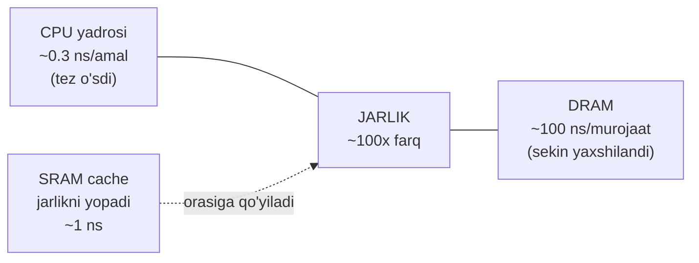
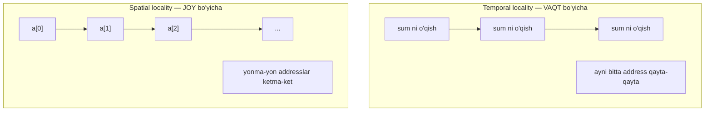
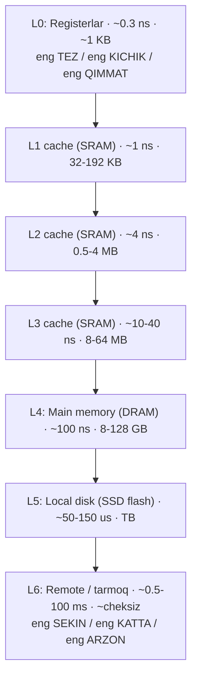
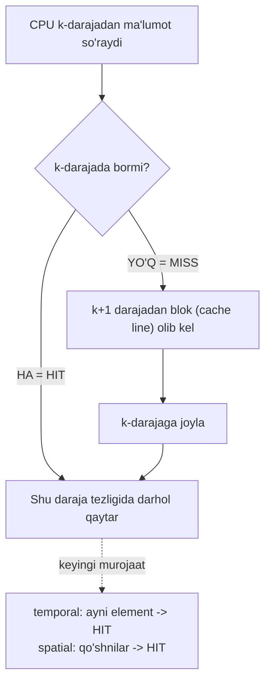

# 16. Storage Texnologiyalari va Locality — memory hierarchy nega bor

> Manba: CS:APP 2-nashr, 6.1-6.3 · Muhit: performance o'lchovlari native arm64 Apple Silicon (QEMU cache'ni ko'rsatmaydi) · [← Oldingi](15-profiling-bottlenecks.md) · [Kurs xaritasi](00-README.md) · [Keyingi →](17-cache-memories.md)

## Nima uchun kerak

Bir xil algoritm, bir xil sondagi ma'lumot — lekin faqat murojaat TARTIBI o'zgargani uchun dastur 10 barobar sekinlashadi. Bu dastur matnida ko'rinmaydi, `O(n)` tahlilida ham chiqmaydi: "har bir memory access = 1 amal" degan universitet yolg'oni shu yerda buziladi. Aslida bitta memory murojaati L1 cache'dan olinsa ~1 ns, RAM'dan olinsa ~100 ns — orasida 100 barobar farq bor. DB indeksni nega ma'qullaymiz, slice'ni nega array'da ketma-ket iteratsiya qilamiz, struct'ni nega ixcham joylaymiz (10-darsdagi layout), Redis'ni nega RAM'da ushlaymiz — bularning HAMMASI shu bir darsdagi ikki tushunchadan kelib chiqadi: **locality** va **memory hierarchy**. 01-darsda "caches matter" degan edik; bu darsda uni O'LCHOV bilan isbotlaymiz.

## Nazariya

Bob uch ustunga tayanadi: (1) qanaqa STORAGE texnologiyalari bor va ular qanchalik farq qiladi; (2) dasturlar nega **locality** ko'rsatadi; (3) shu ikkisi qanday qilib **memory hierarchy** ni yaratadi. Ketma-ket ko'ramiz.

### 1. Storage texnologiyalari — tez/qimmat dan sekin/arzon gacha

Butun kompyuter xotirasi bitta muammoning yechimi ustiga qurilgan: **tez xotira qimmat va kichik, arzon xotira sekin va katta**. Yagona "ideal" xotira yo'q, shuning uchun bir necha xil texnologiya birga ishlatiladi.

**SRAM (Static RAM)** — cache uchun ishlatiladigan eng tez xotira. Har bit ~6 tranzistordan iborat kichik zanjir (latch) bilan saqlanadi. Elektr toki bo'lguncha holatini o'zi ushlaydi — "static" nomi shundan. Juda tez (~1 ns), lekin bitta bit ko'p tranzistor talab qilgani uchun **qimmat va kichik**. Shuning uchun SRAM faqat CPU ichidagi L1/L2/L3 cache'da, bir necha megabaytgacha ishlatiladi.

**DRAM (Dynamic RAM)** — asosiy xotira (main memory, ya'ni "RAM"). Har bit atigi **1 ta kondensator + 1 tranzistor** bilan saqlanadi. Kondensator zaryadi bor/yo'qligi 1/0 ni bildiradi. Bu juda ixcham — shuning uchun DRAM **arzon va katta** (gigabaytlar). Ammo kondensator zaryadi sekin oqib ketadi, shuning uchun DRAM'ni har ~64 ms da **refresh** qilish (qayta o'qib, qayta yozish) kerak — "dynamic" nomi shundan. DRAM SRAM'dan ~10 baravar sekin (~100 ns).

**HDD (Hard Disk Drive)** — mexanik disk. Ma'lumot aylanuvchi magnit **platta**larga (plates) yoziladi, **head** (o'qish boshi) kerakli trekka mexanik ravishda suriladi. Bu jismoniy harakat — **seek time** deyiladi — millisekundlarda o'lchanadi (~5-10 ms). Bu DRAM'dan ~100 000 baravar sekin. HDD arzon va ulkan (terabaytlar), lekin uning **mexanik qismi** butun tizimning eng sekin joyi.

**SSD (Solid State Drive)** — flash xotira asosidagi disk. **Hech qanday mexanik qism yo'q** — na aylanuvchi platta, na harakatlanuvchi head. Ma'lumot flash yacheykalarda elektron holatida saqlanadi. Seek time deyarli nol; tasodifiy o'qish HDD'dan ~100 baravar tez. Shuning uchun SSD zamonaviy kompyuterlarda **HDD o'rnini deyarli butunlay bosdi**. HDD endi asosan arxiv va ulkan arzon saqlash uchun qoladi.

Bu texnologiyalar tezligini bir jadvalda ko'raylik (taxminiy zamonaviy raqamlar):

| Texnologiya | Bit qanday saqlanadi | Tezlik (latency) | Hajm | Narx/bayt | Ishlatilishi |
| --- | --- | --- | --- | --- | --- |
| **SRAM** | ~6 tranzistor (latch) | ~1-10 ns | KB-MB | juda qimmat | L1/L2/L3 cache |
| **DRAM** | 1 kondensator + 1 tranzistor | ~50-100 ns | GB | o'rta | main memory (RAM) |
| **SSD (flash)** | flash yacheyka (elektron) | ~50-150 us | GB-TB | arzon | asosiy disk |
| **HDD** | magnit platta (mexanik) | ~5-10 ms | TB | juda arzon | arxiv / bulk |

Pastga tushgan sari: sekinroq, kattaroq, arzonroq. Yuqoriga chiqqan sari: tezroq, kichikroq, qimmatroq. Bu qonuniyat butun bo'limning o'zagi.

### 2. CPU-memory gap — nega cache umuman ixtiro qilingan

Tarixiy muammo shunday: 1980-yillardan beri CPU tezligi deyarli har yili eksponensial o'sdi (Moore qonuni), ammo **DRAM latency**si juda sekin yaxshilandi. DRAM'ning o'tkazuvchanligi (bandwidth) o'sdi, lekin bitta murojaatga ketadigan VAQT (latency) deyarli qotib qoldi.

Natijada **gap** (jarlik) paydo bo'ldi: CPU bir sikida bir necha amal bajaradi, lekin DRAM'dan bitta sonni kutish yuzlab CPU siklini yeydi. Agar CPU har murojaatda RAM'ni to'g'ridan-to'g'ri kutsa, uning tez yadrosi vaqtining 90%+ ini shunchaki KUTIB o'tkazadi. Cache aynan shu jarlikni yopish uchun ixtiro qilingan: tez SRAM'ni CPU va sekin DRAM orasiga qo'yib, ko'p murojaatni RAM'ga bormasdan hal qilish.



> Cache — bu CPU va RAM orasidagi tezlik jarligini yopish uchun qo'yilgan tez, kichik SRAM bufer. U bo'lmasa zamonaviy CPU vaqtining ko'p qismini RAM'ni kutib o'tkazar edi.

Jarlik qanchalik katta ekanini bir raqamda ko'raylik. Zamonaviy CPU ~3-4 GHz da ishlaydi — bir sikl ~0.3 ns. RAM murojaati ~100 ns:

- 100 ns / 0.3 ns ≈ **300 sikl** — CPU bitta RAM murojaatini kutar ekan, ~300 ta amal bajarishi mumkin edi.
- Agar dastur har amalda RAM'ni kutsa, CPU vaqtining ~99% i behuda "stall" (to'xtab kutish) bo'lardi.
- Cache hit (~1 ns ≈ 3 sikl) bu narxni ~100 baravar tushiradi — 300 sikl o'rniga 3 sikl.

Mana shu 300 siklli jarlik butun memory hierarchy'ning mavjudlik sababi. Savol "cache kerakmi?" emas — "cache'ni qanchalik yaxshi ishlata olaman?" (ya'ni locality kod yozaman).

Nima uchun butun xotira SRAM (cache) dan qilinmaydi? Chunki SRAM juda qimmat va katta joy egallaydi: 128 GB SRAM real kompyuterga sig'maydi va narxi astronomik bo'lardi. Shuning uchun oz miqdorda tez SRAM + ko'p miqdorda arzon DRAM birga ishlatiladi — bu iqtisodiy majburiyat, injenerlik tanlovi emas.

### 3. Locality — dasturlarning tabiiy odati

Nega cache umuman ISHLAYDI? Chunki real dasturlar xotiraga tasodifiy emas, **naqshli** murojaat qiladi. Bu naqsh **locality** (mahalliylik) deyiladi va ikki turi bor.

**Temporal locality (vaqt bo'yicha mahalliylik):** yaqinda ishlatilgan element yaqin kelajakda YANA ishlatiladi. Misol — sikl hisoblagichi `i`, akkumulyator `sum`: ular har iteratsiyada qayta o'qiladi. Bir marta cache'ga tushgach, keyingi murojaatlarning hammasi cache'dan (tez) keladi.

**Spatial locality (joy bo'yicha mahalliylik):** ishlatilgan address'ga YAQIN address'lar ham tez orada ishlatiladi. Misol — massivni ketma-ket kezish: `a[0]`, `a[1]`, `a[2]`... yonma-yon joylashgan. Cache ma'lumotni bitta son emas, **cache line** (odatda 64 bayt) blok bilan yuklaydi — shuning uchun `a[0]` ni so'raganda `a[1]..a[15]` ham (64 bayt / 4 bayt = 16 ta int) tekinga cache'ga keladi.



Yaxshi va yomon locality kodni farqlash — bu darsning amaliy mahorati. Ikki misol:

```c
/* YAXSHI locality: ketma-ket, stride-1 murojaat */
int sum = 0;
for (int i = 0; i < N; i++)
    sum += a[i];        /* a[i] va a[i+1] yonma-yon -> spatial locality */
                        /* sum har iteratsiyada -> temporal locality */
```

```c
/* YOMON locality: katta stride bilan sakrab murojaat */
int sum = 0;
for (int j = 0; j < M; j++)
    for (int i = 0; i < N; i++)
        sum += a[i][j];  /* ustun bo'yicha o'qiydi -> har murojaat uzoq address */
```

Ikkinchi misol 2D massivni **ustun bo'yicha** kezadi. Lekin C va Go massivni **row-major** (qatorlab) saqlaydi (10-darsda ko'rganmiz) — ya'ni `a[i][0]`, `a[i][1]`... yonma-yon. Ustun bo'yicha yurish har qadamda bir qator uzoqlikka sakraydi, cache line behuda ketadi. Bu naqsh matritsa masalalarida (18-darsda chuqur) sekinlikning asosiy manbai.

### 4. Memory hierarchy — piramida

Endi ikki g'oyani birlashtiramiz. Storage texnologiyalari tez/qimmat dan sekin/arzon gacha spektr beradi; locality esa dasturlar ma'lumotning kichik qismini takror ishlatishini kafolatlaydi. Shu ikkisi tabiiy ravishda **memory hierarchy** — daraja-daraja xotira piramidasini yaratadi.



Piramidaning kaliti bitta g'oyada: **har bir daraja o'zidan pastdagi darajaning cache'i**. L1 — L2'ning cache'i; L2 — L3'niki; L3 — RAM'niki; RAM esa disk'ning cache'i (buni 24-25-darslarda virtual memory sifatida ko'ramiz). Ma'lumot doim pastda to'liq turadi, tez darajalarda esa faqat "hozir kerakli" qismi nusxalanadi.

**Caching printsipi — hit va miss.** CPU biror ma'lumotni so'raganda tizim yuqoridan pastga qaraydi:

- **Hit** (topildi): ma'lumot k-darajada bor — o'sha darajaning tezligida darhol qaytariladi.
- **Miss** (yo'q): k-darajada yo'q — k+1 darajadan **blok** (cache line) olib kelinadi, k-darajaga joylanadi, keyin qaytariladi. Endi keyingi safar shu ma'lumot (temporal) va uning qo'shnilari (spatial) HIT bo'ladi.



Miss qimmat: pastdagi daraja sekinroq, demak miss'da o'sha sekin darajaning latency'sini to'laysan. Butun optimizatsiya sirining o'zagi shu: **miss'lar sonini kamaytir** = ma'lumotni cache'da ushlab qol = yaxshi locality kod yoz.

**Notional machine — bitta `sum += a[i]` ortida nima sodir bo'ladi.** Kod bitta qatorday ko'rinsa ham, temir darajasida bir zanjir hodisa yuz beradi. Faraz qilaylik `a[100]` cache'da yo'q (miss):

1. CPU `a[100]` address'ini hisoblaydi va L1 cache'dan so'raydi.
2. L1'da yo'q (**miss**) — so'rov L2'ga, u yerda ham yo'q bo'lsa L3'ga, oxiri RAM'ga tushadi (~100 ns kutish).
3. RAM `a[100]` ni emas, uni o'z ichiga olgan butun **cache line'ni** (64 bayt: `a[96]..a[111]`, agar 4-baytli int bo'lsa 16 ta element) qaytaradi.
4. Bu line L3 → L2 → L1 ga nusxalanadi (barcha darajalarda saqlanadi).
5. Endi `a[100]` registrga o'qiladi, `sum` ga qo'shiladi.
6. Keyingi iteratsiya `a[101]` ni so'raydi — u allaqachon L1'dagi line'da (**hit**, ~1 ns). `a[102]..a[111]` ham shunday. Prefetcher esa keyingi line'ni (`a[112]..`) fon'da oldindan yuklab qo'yadi.

Mana shu sabab ketma-ket kezish tez: bitta qimmat miss (100 ns) 16 ta arzon hit (har biri 1 ns) ustiga "amortizatsiya" qilinadi. Tasodifiy kezishda esa 3-6 qadamlar har murojaatda takrorlanadi — arzon hit'lar yo'q.

### 5. Cache metrikalari — hit rate, miss penalty, AMAT

Caching qanchalik yaxshi ishlayotganini uch son o'lchaydi. Ular 17-darsdagi chuqur tahlilning tili, shuning uchun hoziroq tanishtiramiz:

- **Hit rate** — murojaatlarning necha ulushi HIT bo'ldi (masalan 0.95 = 95%).
- **Miss rate** — HIT bo'lmaganlar ulushi = `1 − hit_rate`.
- **Hit time** — HIT bo'lganda ma'lumotni olish vaqti (masalan L1 uchun ~1 ns).
- **Miss penalty** — MISS bo'lganda pastki darajadan olib kelishning QO'SHIMCHA narxi (masalan RAM uchun ~100 ns).

Ularni bitta formulaga birlashtiruvchi tushuncha — **AMAT (Average Memory Access Time)**, o'rtacha xotira murojaat vaqti:

> **AMAT = hit_time + miss_rate × miss_penalty**

Bu formula nega hatto KICHIK miss rate ham qimmat ekanini ko'rsatadi, chunki miss_penalty juda katta. Demo 2 raqamlari bilan hisoblaymiz: hit_time = 1.3 ns (L1), miss_penalty = 127 ns (RAM):

| Miss rate | AMAT hisobi | AMAT | Izoh |
| --- | --- | --- | --- |
| 0% (mukammal) | 1.3 + 0 × 127 | 1.3 ns | hamma HIT |
| 1% | 1.3 + 0.01 × 127 | 2.6 ns | atigi 1% miss — 2x sekin! |
| 5% | 1.3 + 0.05 × 127 | 7.7 ns | ~6x sekin |
| 10% | 1.3 + 0.10 × 127 | 14.0 ns | ~11x sekin |

Diqqat: **1% miss rate murojaatni 2 baravar sekinlashtiradi**. Sabab — miss_penalty (127 ns) hit_time (1.3 ns) dan ~100x katta. Shuning uchun cache optimizatsiyasida gap "biroz tezroq" haqida emas — bir necha foizli miss rate farqi butun dasturni ikki barobar sekinlashtiradi.

### 6. Cache miss turlari — nega miss bo'ldi

Har miss bir xil emas; sababiga qarab uch turga bo'linadi. Bu 17-18-darslarda kodni tuzatish uchun tildir:

| Miss turi | Sabab | Yechim |
| --- | --- | --- |
| **Cold (compulsory)** | Ma'lumotga BIRINCHI marta murojaat — cache'da bo'lishi mumkin emas edi | Qochib bo'lmaydi; prefetch yumshatadi |
| **Capacity** | Working set butun cache'dan katta — sig'magani chiqib ketdi | Working set'ni kichiklashtir (bloklash, 18-dars) |
| **Conflict** | Cache'da joy bor, lekin tuzilma tufayli to'qnashuv | Cache tashkiloti bilan bog'liq (17-dars, set/way) |

Demo 2'dagi 32-128 MB holati aynan **capacity miss**: working set L3'dan katta, shuning uchun har element chiqib ketgan qo'shnisining o'rniga keladi va qayta murojaatda yo'q bo'ladi. Cold va capacity'ni bu darsda tushunish yetarli; **conflict miss** cache'ning ichki associativity tuzilishiga bog'liq, uni 17-darsda ochamiz.

Xulosa: butun optimizatsiya piramidasi shu uch metrikaga tayanadi — locality yaxshi kod hit rate'ni oshiradi, working set'ni kichik ushlash capacity miss'ni kamaytiradi. 17-darsda cache'ning IShKI tuzilishini (set, line, way), 18-darsda esa cache-friendly kod yozishni chuqur ko'ramiz. Bu dars — ularning poydevori.

## Kod va isbot

Nazariya go'zal, lekin bu dars 01-darsdagi "caches matter" ni endi O'LCHOV bilan isbotlaydi. Quyidagi ikki demo **native arm64 (Apple Silicon)** mashinada, `gcc -O2` bilan yig'ildi. Muhim eslatma: QEMU emulyatsiyasi cache ierarxiyasini ko'rsatmaydi, shuning uchun bu o'lchovlar to'g'ridan-to'g'ri temir ustida (native) olindi.

### Demo 1: Spatial locality — ketma-ket vs tasodifiy murojaat (10.6x)

Fikr eng toza ko'rinishda: **AYNAN bir xil** sondagi element (16 777 216 ta = 16M) va **aynan bir xil** 64 MB massiv o'qiladi. Yagona farq — murojaat TARTIBI. Bir holatda indekslar ketma-ket (`0, 1, 2, ...`), boshqasida aralashtirilgan (tasodifiy).

```c
/* --- Holat A: ketma-ket -> spatial locality yaxshi, prefetch ishlaydi --- */
for (int i = 0; i < N; i++)
    sum += a[idx_seq[i]];      /* idx_seq[i] = i (0,1,2,...) */

/* --- Holat B: tasodifiy -> spatial locality yo'q, har murojaat cache miss --- */
for (int i = 0; i < N; i++)
    sum += a[idx_rnd[i]];      /* idx_rnd aralashtirilgan (permutatsiya) */
```

Real output (native arm64):

```
Bir xil 16777216 element o'qiladi:
  Ketma-ket (yaxshi locality): 0.006 s
  Tasodifiy (yomon locality):  0.060 s
  Sekinlashuv: 10.6x
```

**Nima uchun 10.6x?** Massiv (64 MB) cache'dan ancha katta, shuning uchun ikkala holatda ham ma'lumot RAM'da yotadi. Farq — RAM'dan qanday olib kelinishida:

- **Ketma-ket.** `a[i]` ni so'raganda CPU butun **cache line** (64 bayt = 16 ta int) ni yuklaydi. Keyingi 15 murojaat shu line'dan HIT bo'ladi — bittasi miss, o'n oltitasi tekin. Ustiga CPU naqshni sezib keyingi line'ni **prefetch** (oldindan yuklab) qo'yadi, shuning uchun kutish deyarli yo'q. Cache line'ning har baytidan foydalaniladi.
- **Tasodifiy.** Har murojaat butunlay boshqa joyga tushadi. Cache line yuklanadi, undan **faqat 1 ta int** ishlatiladi, qolgan 15 tasi behuda. Prefetch ishlamaydi, chunki keyingi address bashorat qilib bo'lmaydi. Har murojaat deyarli to'liq RAM latency'sini to'laydi.

Bu **spatial locality'ning tirik isboti**: algoritm bir xil, `O(n)` bir xil, element soni bir xil — 10.6x farq faqat ma'lumotdan cache line'ni qanchalik to'la ishlatganingdan keladi. Cache line tushunchasini 17-darsda mikroskop ostiga qo'yamiz.

**Per-element narxni hisoblaymiz** — bu 5-bo'limdagi AMAT g'oyasini o'lchov bilan tasdiqlaydi. Umumiy vaqtni murojaatlar soniga bo'lamiz:

```
Ketma-ket:  0.006 s / 16 777 216 = 0.36 ns / murojaat  (miss amortizatsiya + prefetch)
Tasodifiy:  0.060 s / 16 777 216 = 3.6 ns / murojaat   (deyarli har biri miss)
```

Ketma-ketda o'rtacha murojaat atigi **0.36 ns** — bu bitta RAM latency'sidan (~100 ns) yuzlab marta kam, chunki cache line ulushi (16 dan 1 miss) va prefetch narxni "yashiradi". Tasodifiyda esa har murojaat mustaqil miss'ga yaqin. Bu AMAT formulasining tirik ko'rinishi: **miss rate'ni pasaytirish (yaxshi locality) o'rtacha murojaat narxini o'nlab marta tushiradi**.

### Demo 2: Memory hierarchy tier'lari — pointer chasing latency (1.3 → 127 ns)

Ikkinchi demo butun **memory hierarchy'ni tirik ko'rsatadi**. Texnika — **pointer chasing** (pointer quvish): har element keyingi (tasodifiy) indeksni saqlaydi, va biz `p = next[p]` zanjirini yuramiz. Har qadam oldingisining natijasiga bog'liq, shuning uchun CPU keyingi address'ni oldindan bila olmaydi — **prefetch yengiladi** va HAQIQIY latency o'lchanadi (ketma-ket bo'lganda prefetch latency'ni yashirib qo'yardi).

```c
/* next[] tasodifiy permutatsiya tsikli; p = next[p] zanjiri */
for (long s = 0; s < steps; s++)
    p = next[p];        /* har qadam oldingisiga bog'liq -> prefetch ishlamaydi */
```

Working set (ishlatilayotgan xotira hajmi) ni oshirib borib, murojaat qancha turishini o'lchaymiz. Real output (100M qadam, ns/murojaat, native arm64):

```
Working set | latency (ns/murojaat, pointer chasing)
        8 KB |   1.3 ns
       32 KB |   1.3 ns
      128 KB |   1.3 ns
      512 KB |   4.7 ns
     2048 KB |   6.9 ns
     8192 KB |   9.2 ns
    32768 KB |  60.0 ns
   131072 KB | 126.6 ns
```

Bu jadval — butun bobning eng muhim empirik natijasi. Uni o'qiymiz:

- **8-128 KB (1.3 ns).** Working set kichik, L1/L2 cache'ga to'liq sig'adi. Deyarli har murojaat HIT — cache tezligi.
- **512 KB - 8 MB (4.7-9.2 ns).** Working set L1'dan oshdi, L2/L3'ga tushdi. Sekinroq, lekin hali cache.
- **32-128 MB (60-127 ns).** Working set butun cache'dan katta — endi har murojaat RAM'ga tushadi. To'liq DRAM latency.

Diqqat: L1 (1.3 ns) va RAM (127 ns) orasida ~**100x** farq bor. Va har bir "cliff" (keskin sakrash) — working set navbatdagi cache darajasidan oshib ketgan nuqta. Jadvaldagi zinapoyalar aslida sizning CPU'ngizning L1 → L2 → L3 → RAM chegaralarini chizib beradi.

Har bir tier'ni cache darajasiga bog'lab o'qish — bu jadvalning eng foydali ko'nikmasi:

| Working set | latency | Qaysi darajada yashaydi |
| --- | --- | --- |
| 8-128 KB | 1.3 ns | L1 / L2 cache — deyarli hamma HIT |
| 512 KB - 8 MB | 4.7-9.2 ns | L2 / L3 cache |
| 32-128 MB | 60-127 ns | Cache'dan katta — RAM (capacity miss) |

Bu 01-darsdagi "caches matter" ning O'LCHOV bilan isboti: ma'lumot qancha "sig'imli" bo'lsa (working set kichik), shuncha tez darajada yashaydi. Raqamlar Apple Silicon (arm64) ga xos; x86-64 da aniq qiymatlar boshqacha, ammo **printsip — zinapoyali latency o'sishi — bir xil**.

## Go dasturchiga ko'prik

Bu C demolari nazariy emas — Go backend kodingizda har kuni ta'sir qiladi. Locality tilga bog'liq emas, ma'lumot xotirada qanday yotishiga bog'liq.

### []Struct vs []\*Struct — eng ko'p uchraydigan locality tuzog'i

10-darsda struct layout'ni ko'rgan edik. Endi ikki slice'ni solishtiraylik:

```go
type Point struct{ X, Y, Z float64 }

var a []Point    // qiymatlar slice: struct'lar YONMA-YON, bir uzluksiz blok
var b []*Point   // pointer slice: slice'da faqat address'lar, struct'lar RAM'da tarqoq
```

- `[]Point` (**struct slice**): barcha `Point` lar xotirada ketma-ket yotadi. Ustidan iteratsiya — bu Demo 1'dagi **ketma-ket** holat: har cache line bir necha `Point` ni olib keladi, prefetch ishlaydi. Cache-friendly.
- `[]*Point` (**pointer slice**): slice'da faqat 8 baytlik pointer'lar bor; haqiqiy `Point` lar heap'da qayerda popadi. Ustidan iteratsiya — bu Demo 2'dagi **pointer chasing**: har element uchun pointer'ni kuzatib RAM'ga sakraysan. Yomon locality.

Hot loop'da (ichki, ko'p bajariladigan sikl) `[]Point` `[]*Point` dan 5-10x tez bo'lishi mumkin — Demo 1 va 2 aynan shu farqni o'lchadi. Amaliy qoida: **hot path'dagi katta kolleksiyalarni pointer emas, qiymat sifatida ushla**.

### Linked list Go'da nega sekin

Linked list (bog'langan ro'yxat) har node'ni alohida `new` bilan allokatsiya qiladi — node'lar heap bo'ylab tarqalgan. Ro'yxatni kezish = sof pointer chasing = Demo 2'dagi eng sekin holat. Shuning uchun amalda ko'p hollarda `[]T` slice linked list'dan tez, garchi "kitobiy" murakkabligi bir xil bo'lsa ham. Bu Amdahl (15-dars) emas — bu constant factor, lekin cache'da u 10x bo'lishi mumkin.

### AoS vs SoA — layout tanlovi

**Array-of-Structs (AoS)** — `[]Point{X,Y,Z}`. Agar loop'da faqat `X` kerak bo'lsa, har cache line'ga `Y` va `Z` ham keladi (spatial locality qisman behuda). **Struct-of-Arrays (SoA)** — alohida `Xs []float64`, `Ys []float64`, `Zs []float64`. Faqat `X` ustida ishlayotganda `Xs` slice zich, har bayt foydali. Yuqori unum talab qiladigan sonli kodda (ML, grafika) SoA ko'p qo'llanadi. AoS esa o'qishga qulayroq — tanlov ish naqshiga bog'liq.

### Struct hajmi va cache line — 10-darsdagi layout endi tezlik masalasi

10-darsda struct maydonlari tartibi va padding (bo'sh to'ldiruvchi baytlar) hajmni o'zgartirishini ko'rgan edik. Endi bu tezlik masalasi: struct qancha kichik bo'lsa, bitta cache line'ga (64 bayt) shuncha ko'p element sig'adi, spatial locality shuncha yaxshi.

```go
// Yomon tartib: padding tufayli 24 bayt (bool -> 7 bayt bo'sh -> int64 -> ...)
type BadUser struct {
    Active  bool    // 1 bayt + 7 bayt padding
    ID      int64   // 8 bayt
    Flag    bool    // 1 bayt + 7 bayt padding
}                   // jami 24 bayt

// Yaxshi tartib: maydonlar kattadan kichikka -> 16 bayt
type GoodUser struct {
    ID      int64   // 8 bayt
    Active  bool    // 1 bayt
    Flag    bool    // 1 bayt + 6 bayt padding
}                   // jami 16 bayt
```

Bir cache line'ga (64 bayt) `BadUser` dan 2 ta, `GoodUser` dan 4 ta sig'adi. Million element ustida iteratsiya qilganda `GoodUser` slice cache line'ni ikki barobar samarali ishlatadi — kamroq miss, tezroq loop. Maydonlarni **kattadan kichikka** tartiblash — tekin locality optimizatsiyasi (10-darsdagi qoida endi cache tili bilan).

### map va pointer chasing

Go'ning `map` i hash jadval — kalitlar hash bucket'lariga tarqaladi, va bucket'lar bo'ylab yurish tabiatan tasodifiy (Demo 2'ga yaqin). Shuning uchun katta `map` ustida iteratsiya bir xil o'lchamdagi slice'dan sekinroq. Amaliy qoida: agar ma'lumot ustida tez-tez ketma-ket yursang va kalit bo'yicha izlash kam bo'lsa — slice cache uchun ma'qulroq; tez lookup kerak bo'lsagina `map`.

Bir eslatma: Go'da **GC** (garbage collector, 27-darsda) ham locality'ga bog'liq — tarqoq pointer graf GC'ni sekinlashtiradi, zich qiymat slice'lar esa GC yuki va cache miss'ni birga kamaytiradi.

## Real-world scenariylar

### Scenariy 1: hot loop'da []\*Struct — 5-10x tekin tezlashuv

Servisda har so'rovda million obyektni aylanib chiqadigan tsikl `[]*Order` ustida ishlar edi. Profil (15-dars) ko'rsatadiki vaqtning katta qismi memory kutishda o'tadi (cache miss). Yechim: layout'ni `[]Order` (qiymat slice) ga o'zgartirish. Algoritm o'zgarmadi, kod deyarli o'zgarmadi, lekin pointer chasing yo'qoldi va tsikl 5-10x tezlashdi — Demo 1/2 dagi farq real production'da. Buni faqat "measure, don't guess" bilan topasan.

### Scenariy 2: DB va KV store — row-store vs column-store

Ma'lumotlar bazasi diskda/xotirada ma'lumotni qanday joylashi locality masalasi. **Row-store** bir qatorning barcha ustunlarini birga saqlaydi — bitta yozuvni to'liq o'qish (OLTP, "shu userni ber") tez. **Column-store** har ustunni alohida zich saqlaydi — bitta ustunni million qatordan agregatlash (OLAP, "o'rtacha narx") tez, chunki faqat kerakli ustun cache line'larini o'qiydi, keraksiz ustunlar aralashmaydi. Ikkalasi ham bitta g'oyaning ikki qutbi: **birga ishlatiladigan ma'lumotni birga sakla** = spatial locality.

### Scenariy 3: latency raqamlarini bilib arxitektura qaror

Latency piramidasi arxitektura qarorining kalkulyatori. So'rov RAM cache'dan (Redis, ~100 ns + tarmoq) keladimi yoki diskdan (SSD ~100 us, HDD ~10 ms)? Bir tarmoq chaqiruvi (~0.5 ms datacenter ichida) ~5000 ta RAM murojaatiga teng. Shuning uchun N+1 query (har element uchun alohida DB chaqiruvi) falokat — yuzlab tarmoq round-trip. Qoida: **piramidada qancha past tushsang, murojaat shuncha qimmat** — dizaynda ma'lumotni yuqoriroq darajada (cache, RAM) ushlashga intil.

### Scenariy 4: batch processing — working set'ni cache'ga sig'dirish

Katta datasetni qayta ishlaydigan servis butun ma'lumotni bir marta boshdan-oxir kezib chiqar edi — har element bir marta ishlatiladi, cache foydasi yo'q (cold miss'lar zanjiri). Demo 2 ko'rsatadiki working set L2/L3'dan katta bo'lganda latency 10-100x oshadi. Yechim — **bloklash (blocking/tiling)**: ma'lumotni cache'ga sig'adigan bo'laklarga bo'lib, har bo'lak ustida barcha ishni tugatib, keyin keyingisiga o'tish. Shunda working set kichik qolib, capacity miss keskin kamayadi. Bu texnika 18-darsda matritsa ko'paytmasida aniq o'lchov bilan ko'riladi — bir xil algoritm, bloklangani bir necha barobar tez.

## Zamonaviy yondashuv

Zamonaviy taxminiy latency raqamlari (web sintezi, 2024-2025):

| Daraja | Latency | Nisbatan |
| --- | --- | --- |
| L1 cache | ~0.5-1 ns | asos |
| L2 cache | ~4 ns | ~4x L1 |
| L3 cache | ~10-40 ns | ~20x L1 |
| Main memory (DRAM) | ~100 ns | ~100x L1 |
| NVMe SSD (tasodifiy 4K) | ~10-150 us | ~100 000x L1 |
| Datacenter ichida tarmoq | ~0.5 ms | ~10^6x L1 |
| Kontinentlararo tarmoq | ~50-150 ms | ~10^8x L1 |

Bu jadval **"Latency Numbers Every Programmer Should Know"** (Peter Norvig va Jeff Dean ommalashtirgan) ning zamonaviy varianti. Klassik xotirlash usuli: barcha raqamni **1 milliardga** ko'paytiring, shunda inson miqyosiga o'tadi — L1 murojaati 0.5 soniya (bir yurak urishi), RAM 100 soniya, SSD murojaati bir necha kun, kontinentlararo tarmoq bir necha yil. Bu nisbatlarni yodda tutish arxitektura intuitsiyasini beradi.

Zamonaviy nuanslar:

- **Apple Silicon unified memory** — CPU va GPU bitta DRAM pool'ni bo'lishadi, nusxalash yo'qoladi; bu darsning o'lchovlari aynan shu arxitekturada olindi.
- **HBM (High Bandwidth Memory)** — CPU/GPU yoniga stacklangan ultra-keng DRAM; AI acceleratorlarda bandwidth jarligini yopadi.
- **NUMA (Non-Uniform Memory Access)** — ko'p-socketli serverda har CPU'ning "yaqin" va "uzoq" RAM'i bor, latency socketga bog'liq.
- **Persistent memory / CXL** — RAM va SSD orasidagi yangi darajalar; piramida qalinlashib bormoqda.
- **Disk endi asosan SSD** — HDD faqat arzon bulk/arxivda qoldi; "disk seek" ko'p hollarda tarixiy tushuncha.

**Latency va throughput — ikki xil o'lchov.** Piramidadagi barcha raqamlar **latency** (bitta murojaatning kutish vaqti). Undan farqli **throughput** (bandwidth) — vaqt birligida qancha ma'lumot oqadi (GB/s). Bu ikkisi bir narsa emas: zamonaviy DRAM latency'si ~100 ns bo'lsa-da, ketma-ket o'qishda bandwidth o'nlab GB/s bo'ladi, chunki bir vaqtda ko'p murojaat "quvurda" (pipeline) parallel ketadi va prefetch latency'ni yashiradi. Demo 1'dagi ketma-ket holat aynan bandwidth'ga bog'liq (yuqori), tasodifiy holat esa latency'ga bog'liq (past). Amaliy xulosa: **ketma-ket ish bandwidth bilan chegaralanadi (tez), tasodifiy ish latency bilan (sekin)** — shuning uchun ma'lumotni ketma-ket o'qiladigan qilib joylash muhim.

Bandwidth uchun ham "napkin math" (qo'lda taxminiy hisob) foydali: masalan RAM ~20 GB/s bo'lsa, 1 GB slice'ni bir marta kezish ~50 ms oladi — bu raqamni bilib, "bu operatsiya qancha vaqt olishi kerak?" degan savolga profil olmasdan taxmin qila olasan (15-dars: measure, don't guess — lekin oldin tartiblik uchun taxmin).

Xulosa: raqamlar texnologiya bilan o'zgaradi, lekin **zinapoyali ierarxiya va locality printsipi** o'zgarmaydi — shu sababli bu bob abadiy amaliy.

## Keng tarqalgan xatolar

1. **"RAM tez, cache ahamiyatsiz".** RAM L1'dan ~100x sekin (Demo 2: 1.3 ns vs 127 ns). Cache CPU vaqtining katta qismini tejaydi; usiz zamonaviy CPU RAM'ni kutib turadi. To'g'risi: locality kod cache miss'ni kamaytiradi va bu 10x farq beradi.

2. **"`O(n)` hamma joyda bir xil".** Bir xil `O(n)`, bir xil element soni — lekin locality yomon bo'lsa 10.6x sekin (Demo 1). Algoritm murakkabligi constant factor'ni yashiradi; cache o'sha faktorni 10x qiladi. To'g'risi: `O(n)` yoniga "qanday tartibda?" savolini qo'y.

3. **"Bitta memory access = 1 amal".** Murojaat 1.3 ns (L1) dan 127 ns (RAM) gacha, SSD'da esa 100 000 ns. "Bir amal" degan model universitet soddalashtirishi — real narx qayerdan kelishiga bog'liq. To'g'risi: hot path'da har murojaat qaysi darajadan kelishini o'yla.

4. **Hot path'da `[]*Struct` ishlatish.** Pointer slice = pointer chasing = Demo 2'dagi eng sekin holat. To'g'risi: hot loop'dagi katta kolleksiyalar uchun qiymat slice (`[]Struct`) — struct'lar yonma-yon yotadi.

5. **Locality'ni algoritm murakkabligidan ajrata olmaslik.** "Kod tez ishlamayapti, demak algoritm yomon" degan xato. Ba'zan algoritm optimal, lekin layout (locality) yomon. To'g'risi: profil (15-dars) memory kutish ko'rsatsa — algoritm emas, locality masalasi.

6. **Latency va throughput'ni chalkashtirish.** "RAM latency 100 ns, demak 1 GB'ni o'qish sekin" degan xato. Ketma-ket o'qishda bandwidth (o'nlab GB/s) ishlaydi, latency yashiriladi. To'g'risi: tasodifiy murojaat latency bilan, ketma-ket murojaat bandwidth bilan chegaralanadi — ikkisi boshqa raqam.

7. **"Disk = HDD, disk sekin" deb faraz qilish.** Zamonaviy disk asosan NVMe SSD (~100 us) — HDD'dan (~10 ms) ~100x tez, mexanik seek yo'q. To'g'risi: latency byudjetida SSD va HDD'ni aralashtirmaslik; "disk seek" ko'p tizimda endi tarixiy.

## Amaliy mashqlar

**1-mashq.** Demo 1'da algoritm bir xil, element soni bir xil (16M), massiv bir xil. Nega ketma-ket 10.6x tez? Bir jumlada asosiy sababni ayt.

<details>
<summary>Yechim</summary>

Cache line (64 bayt) sababi. Ketma-ket holatda har yuklangan cache line' dagi 16 ta int'ning HAMMASI ishlatiladi (1 miss, 15 hit) va prefetch keyingi line'ni oldindan tayyorlaydi; tasodifiy holatda har line'dan atigi 1 int ishlatiladi, qolgan 15 tasi behuda va prefetch ishlamaydi. Farq — cache line'ni qanchalik to'la ishlatganingda.
</details>

**2-mashq.** Demo 2'da 128 KB working set uchun latency 1.3 ns, 32 MB uchun 60 ns. Nega bu keskin sakrash (cliff) sodir bo'ladi?

<details>
<summary>Yechim</summary>

128 KB CPU cache'iga (L1/L2) sig'adi — deyarli har murojaat HIT, cache tezligi (1.3 ns). 32 MB butun cache'dan katta — endi har murojaat RAM'ga tushadi, to'liq DRAM latency (60 ns). "Cliff" — working set navbatdagi cache darajasidan oshgan nuqta; jadvaldagi zinapoyalar CPU'ning L1/L2/L3/RAM chegaralarini chizib beradi.
</details>

**3-mashq.** Cache line 64 bayt. `int` (4 bayt) massivini ketma-ket o'qiyapsan. Har nechta murojaatga nechta cache miss to'g'ri keladi (ideal holatda)?

<details>
<summary>Yechim</summary>

64 bayt / 4 bayt = 16 ta int bitta cache line'ga sig'adi. Ketma-ket o'qishda har 16 murojaatdan **1 tasi miss** (yangi line yuklanadi), qolgan **15 tasi hit** (o'sha line'dan). Miss darajasi ~1/16 ≈ 6.25%. Aynan shu sabab ketma-ket murojaat tasodifiydan (har biri miss) ~10x tez.
</details>

**4-mashq.** Go'da `[]Point` va `[]*Point` bor. Hot loop'da har `Point`'ning `X` maydonini yig'yapsan. Qaysi biri tez va nega? Demo raqamiga tayan.

<details>
<summary>Yechim</summary>

`[]Point` tez. Struct'lar xotirada yonma-yon yotadi — bu Demo 1'dagi ketma-ket holat: cache line bir necha `Point` ni birga olib keladi, prefetch ishlaydi. `[]*Point` da slice faqat pointer'lardan iborat, `Point` lar heap bo'ylab tarqoq — bu Demo 2'dagi pointer chasing, har element uchun RAM'ga sakraysan. Hot path'da farq 5-10x bo'lishi mumkin.
</details>

**5-mashq.** Latency piramidasidan foydalanib: bitta datacenter-ichi tarmoq chaqiruvi (~0.5 ms) taxminan nechta RAM murojaatiga (~100 ns) teng? Bu nima uchun N+1 query yomon ekanini tushuntiradi?

<details>
<summary>Yechim</summary>

0.5 ms = 500 000 ns; 500 000 / 100 = **~5000 ta RAM murojaati**. Ya'ni bitta tarmoq chaqiruvi minglab RAM murojaati narxida. N+1 query har element uchun alohida DB (tarmoq) chaqiruvi qiladi — 1000 element = 1000 round-trip = millionlab RAM murojaatiga teng vaqt. Yechim: bitta batch so'rov bilan hammasini olish (piramidada past darajaga kamroq tush).
</details>

**6-mashq.** Do'sting: "Massivni ustun bo'yicha yoki qator bo'yicha kezish farqi yo'q, ikkalasi ham `O(n^2)`". Nega u xato? (10-darsdagi row-major'ga tayan.)

<details>
<summary>Yechim</summary>

C/Go massivni row-major (qatorlab) saqlaydi — `a[i][0]`, `a[i][1]`... yonma-yon. Qator bo'yicha kezish spatial locality'ga mos (Demo 1'dagi ketma-ket, tez). Ustun bo'yicha kezish har qadamda bir qator uzoqlikka sakraydi (katta stride) — har murojaat yangi cache line, ko'pi behuda (Demo 1'dagi tasodifiyga yaqin, sekin). `O(n^2)` bir xil, lekin constant factor cache tufayli bir necha barobar farq qiladi. 18-darsda matritsada aniq o'lchaymiz.
</details>

**7-mashq.** Piramidada latency tartibini yozing: register, L1, L2, L3, RAM, SSD, tarmoq. Har qo'shni daraja orasida taxminan necha baravar farq bor?

<details>
<summary>Yechim</summary>

Taxminan: register ~0.3 ns → L1 ~1 ns → L2 ~4 ns → L3 ~10-40 ns → RAM ~100 ns → SSD ~50-150 us → tarmoq ~0.5 ms+. Har cache darajasi orasida ~2-10x; RAM'dan SSD'ga sakrashda ~1000x (ns → us); SSD'dan tarmoqqa yana ~10x+ (us → ms). Eng katta jarliklar RAM/SSD va SSD/tarmoq chegaralarida — shuning uchun disk va tarmoqqa tushishdan iloji boricha qochiladi.
</details>

**8-mashq.** AMAT formulasidan foydalan: hit_time = 1.3 ns, miss_penalty = 127 ns. Miss rate 2% bo'lsa o'rtacha murojaat vaqti qancha? Bu mukammal (0% miss) holatga nisbatan necha marta sekin?

<details>
<summary>Yechim</summary>

```
AMAT = 1.3 + 0.02 × 127 = 1.3 + 2.54 = 3.84 ns
```

Mukammal holat 1.3 ns; 3.84 / 1.3 ≈ **3x sekin**. Atigi 2% miss murojaatni uch barobar sekinlashtiradi — chunki miss_penalty (127 ns) hit_time'dan ~100x katta. Xulosa: cache optimizatsiyasida bir necha foizli miss rate farqi katta ahamiyatga ega.
</details>

**9-mashq.** Demo 2'da 32-128 MB working set uchun latency 60-127 ns. Bu qaysi turdagi miss (cold/capacity/conflict) va nega? Kodni o'zgartirmasdan buni yumshatish mumkinmi?

<details>
<summary>Yechim</summary>

Bu **capacity miss**: working set (32-128 MB) butun cache'dan (bir necha MB L3) katta, shuning uchun oldin yuklangan qo'shnilar qayta kerak bo'lishidan avval chiqib ketadi. Kodni o'zgartirmasdan (algoritm bir xil) buni yo'qotib bo'lmaydi — cache jismonan sig'dira olmaydi. Yagona yechim — working set'ni kichiklashtirish: ma'lumotni cache'ga sig'adigan bloklarga bo'lib ishlash (blocking/tiling, 18-dars). Cold miss'dan farqi: cold birinchi murojaatda muqarrar, capacity esa sig'im yetmagani uchun.
</details>

**10-mashq.** `BadUser` (24 bayt) va `GoodUser` (16 bayt) — faqat maydon tartibida farq. Million element ustida iteratsiya qilganda qaysi biri tez va nega? Cache line 64 bayt.

<details>
<summary>Yechim</summary>

`GoodUser` tez. 64 bayt cache line'ga `GoodUser` dan 4 ta (64/16), `BadUser` dan atigi 2 ta (64/24, aslida 2 ta to'liq) sig'adi. Ya'ni million element uchun `GoodUser` ~2x kam cache line yuklaydi — kamroq miss, tezroq loop. Faqat maydonlarni kattadan kichikka tartiblab (padding'ni kamaytirib) tekin locality yutug'i olinadi (10-dars: struct layout).
</details>

## Cheat sheet

| Tushuncha | Nima | Eslab qolish |
| --- | --- | --- |
| **SRAM** | ~6 tranzistor/bit, cache | Tez, qimmat, kichik (L1/L2/L3) |
| **DRAM** | 1 kondensator/bit, main memory | Arzon, katta, refresh kerak (~100 ns) |
| **HDD** | mexanik platta, seek time | Juda sekin (~ms), arxiv |
| **SSD** | flash, mexanik qism yo'q | HDD o'rnini bosdi (~100 us) |
| **CPU-memory gap** | CPU tez o'sdi, DRAM latency sekin | Cache shu jarlikni yopadi |
| **Temporal locality** | Yaqinda ishlatilgan yana ishlatiladi | sikl `i`, `sum` — qayta-qayta |
| **Spatial locality** | Yaqin address ham ishlatiladi | massiv ketma-ket, cache line |
| **Memory hierarchy** | Register→L1→L2→L3→RAM→SSD→tarmoq | Har daraja pastdagining cache'i |
| **Hit / Miss** | Topildi (tez) / yo'q (pastdan olib kel) | Miss = pastdagi darajaning latency'si |
| **Cache line** | Yuklanadigan blok, odatda 64 bayt | 64/4 = 16 int; miss'da qo'shnilar tekin |
| **Prefetch** | Keyingi line'ni oldindan yuklash | Ketma-ket'da ishlaydi, tasodifiyda yo'q |
| **Working set** | Faol ishlatilayotgan xotira hajmi | Cache'ga sig'sa tez, oshsa cliff |
| **Latency raqamlari** | L1 ~1ns, RAM ~100ns, SSD ~100us, tarmoq ~ms | 1 milliardga ko'paytir = inson miqyosi |
| **`[]Struct` vs `[]*Struct`** | Qiymat zich / pointer tarqoq | Hot path'da `[]Struct` (5-10x) |

## Qo'shimcha manbalar

- [Latency Numbers Every Programmer Should Know (Jeff Dean / jboner gist)](https://gist.github.com/jboner/2841832) — klassik latency jadvali, inson-miqyosi analogiyalari bilan.
- [Spatial and Temporal Locality — Algorithmica (HPC)](https://en.algorithmica.org/hpc/external-memory/locality/) — locality va memory hierarchy'ning zamonaviy, o'lchovli tushuntirishi.
- [Latency Numbers You Should Know — A Guide for Software Engineers](https://devcookies.medium.com/latency-numbers-you-should-know-a-guide-for-software-engineers-35908fd94f5e) — 2024 uchun yangilangan raqamlar va arxitektura talqini.
