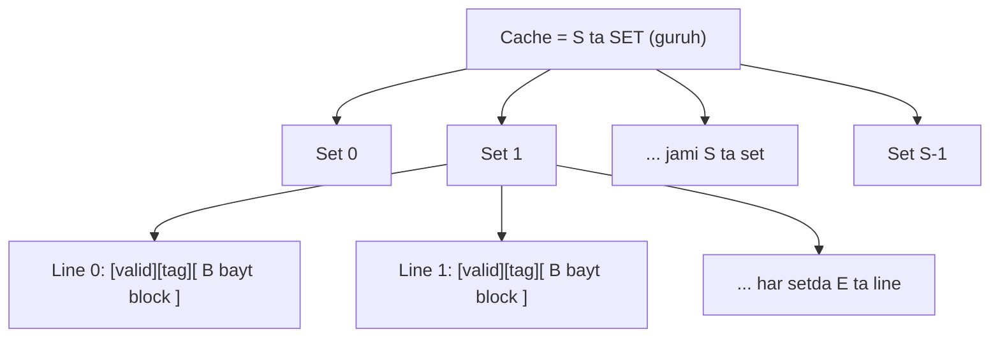
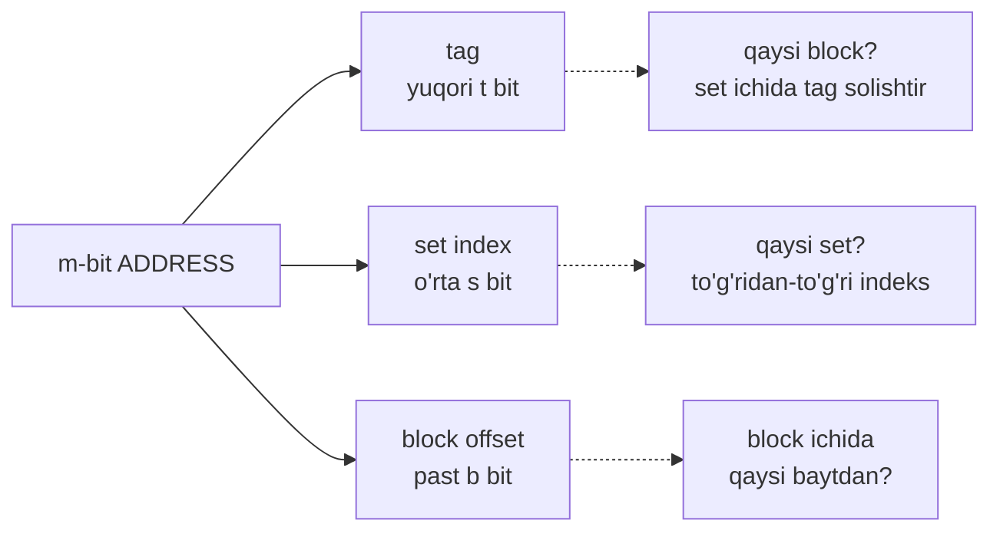
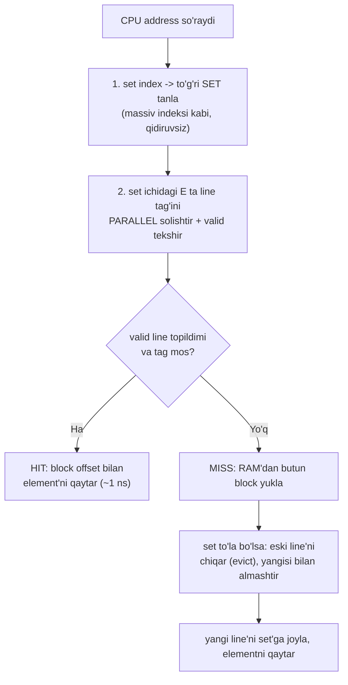
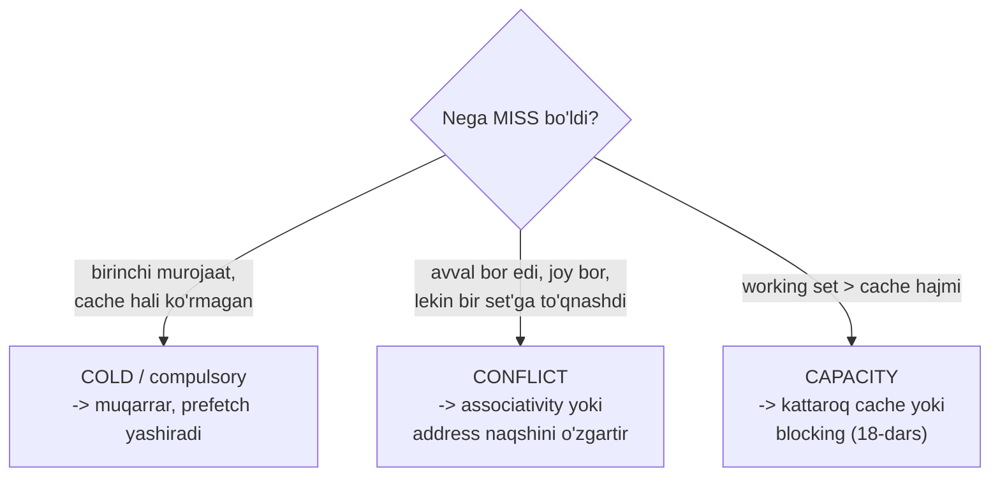
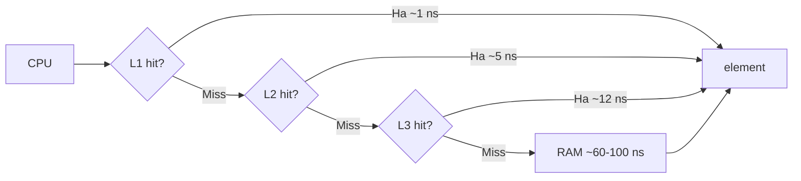
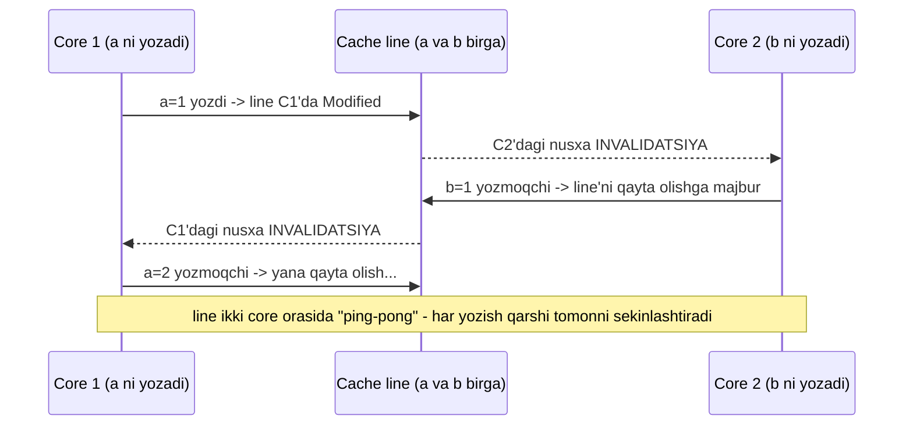

# 17. Cache Memories — set, line, associativity, miss turlari

> Manba: CS:APP 2-nashr, 6.4 · Muhit: performance o'lchovlari native arm64 Apple Silicon (QEMU cache'ni ko'rsatmaydi) · [← Oldingi](16-storage-locality.md) · [Kurs xaritasi](00-README.md) · [Keyingi →](18-cache-friendly-code.md)

## Nima uchun kerak

16-darsda cache'ni "qora quti" sifatida ko'rdik: tez SRAM RAM oldida turadi, locality bo'lsa ishlaydi. Bu darsda quti ichini ochamiz — cache ma'lumotni **qanday izlaydi**. Bu bilim uch amaliy natija beradi. Birinchi: cache line nega aynan 64 bayt ekanini o'lchov bilan aniqlaymiz — bu son to'g'ridan-to'g'ri struct/slice dizayniga ta'sir qiladi (10-darsdagi layout endi tezlik masalasi). Ikkinchi: ikki goroutine bir cache line'dagi turli maydonlarni yozsa nega bir-birini sekinlashtiradi (**false sharing**) — bu kodda ko'rinmaydigan, faqat cache mexanikasidan kelib chiqadigan sekinlashuv. Uchinchi: nega ba'zi power-of-2 o'lchamli massivlar kutilmaganda sekin ishlaydi (**conflict miss**) — bu ham cache tuzilishidan. Cache "qanday izlashini" bilib olsak, keyingi darsda (18-dars) cache-friendly kodni ongli yozamiz.

## Nazariya

Cache — sehr emas, aniq geometriyaga ega apparat jadval. Uni tushunish uchun ketma-ket yig'amiz: (1) tuzilishi, (2) address'ni qanday bo'laklarga bo'ladi, (3) qanday izlaydi, (4) associativity, (5) miss turlari, (6) write policy, (7) cache line ma'nosi.

### 1. Cache organizatsiyasi — S ta set, E ta line, B bayt

Ko'p odam cache'ni "bitta katta xotira bloki" deb tasavvur qiladi. Aslida u tartibli jadval. Uch o'lchamli parametr bilan to'liq tavsiflanadi:

- **S** — cache nechta **set** (guruh) ga bo'lingan. Set — bir nechta line'ni ushlab turadigan "javon".
- **E** — har set nechta **line** (block) ni ushlaydi. Bu son **associativity** deyiladi.
- **B** — har line nechta **bayt** ma'lumot saqlaydi. Bu **cache line** (block) o'lchami — odatda 64 bayt.

Har bir **line** uchta qismdan iborat: **valid bit** (bu line'da haqiqiy ma'lumot bormi yoki bo'sh/eskimi), **tag** (bu line qaysi RAM blokini ushlab turibdi — kimlik belgisi) va **B bayt ma'lumot** (aslda RAM'dan olingan blok nusxasi).

Cache'ning umumiy ma'lumot hajmi oddiy ko'paytma:

> **C = S × E × B** — set soni × har setdagi line soni × har linedagi bayt.



**Valid bit nega kerak.** Dastur endi ishga tushganda cache "sovuq" — hamma line'ning `valid == 0`. Bu shuni bildiradi: line'da haqiqiy ma'lumot yo'q, tag'i ham ma'nosiz (axlat). Izlashda apparat avval valid bitni tekshiradi: `valid == 0` bo'lsa tag mos kelsa ham HIT deb hisoblamaydi. Aynan shuning uchun dastur boshidagi har murojaat cold miss — cache hali hech qanday block'ni ko'rmagan. Valid bit "bu uyada kimdir yashaydimi?" degan bayroq.

**Konkret misol (bu darsda qayta ishlatamiz).** Odatiy L1 data cache: **C = 32 KB, E = 8-way, B = 64 bayt**. Set soni:

```
S = C / (E * B) = 32768 / (8 * 64) = 32768 / 512 = 64 set
```

Ya'ni 32 KB L1 cache = 64 ta set, har setda 8 ta line, har line 64 bayt. Bu raqamlarni yodda tuting — pastda address parselashda ishlatamiz.

### 2. Address parselash — bitta manzil, uch maydon

Cache ma'lumotni address bo'yicha izlaydi. Sirning yuragi shu: **m-bit address uch maydonga bo'linadi** (bu 02-darsdagi bit maydonlari g'oyasi, endi cache uchun):

| Maydon | Joyi | Vazifasi | Kengligi |
| --- | --- | --- | --- |
| **tag** | yuqori bitlar | bu set'dagi qaysi block ekanini aniqlaydi | t = m − (s + b) |
| **set index** | o'rta bitlar | qaysi SET'ga qarash kerakligini beradi | s = log2(S) |
| **block offset** | past bitlar | block ICHIDA qaysi baytdan boshlash | b = log2(B) |

Nega aynan shunday? Chunki qo'shni address'lar past bitlari bilan farq qiladi. Block offset past bitlarni oladi — shuning uchun ketma-ket 64 bayt (bir block) bir line'ga tushadi (spatial locality). Set index o'rtadan — shuning uchun qo'shni bloklar turli setlarga tarqaladi (bir joyga to'planib qolmaydi).



**Yuqoridagi 32 KB cache uchun hisob (m = 64 bit address deb olamiz):**

```
b = log2(B) = log2(64) = 6 bit   -> block offset = past 6 bit (0..5)
s = log2(S) = log2(64) = 6 bit   -> set index    = keyingi 6 bit (6..11)
t = 64 - (6 + 6) = 52 bit         -> tag          = qolgan yuqori 52 bit
```

Demak address bit 0-5 = block offset, bit 6-11 = set index, bit 12-63 = tag. Bu shunchaki bo'lish — apparat hech qanday hisob qilmaydi, faqat bitlarni "kesib oladi" (juda tez).

**Konkret address'ni parselaymiz.** Aytaylik CPU `0x1A3C` (= 6716 o'nlik) address'ini so'radi (o'sha 32 KB cache). Uch maydonni ajratamiz:

```
0x1A3C = 6716
block offset = 6716 mod 64      = 60   (past 6 bit)
set index    = (6716 / 64) mod 64 = 40   (keyingi 6 bit)
tag          = 6716 / 4096       = 1    (yuqori bitlar)
tekshirish: 1*4096 + 40*64 + 60 = 4096 + 2560 + 60 = 6716  ✓
```

Ya'ni cache "40-set'ga qara, u yerdagi 8 line ichida tag=1 li line bormi, bo'lsa 60-baytdan boshlab ol" deydi. Butun murojaat shu uch songa aylanadi.

### 3. Cache qanday IZLAYDI — uch qadam mexanikasi (notional machine)

Bu darsning yuragi. CPU bitta address bergach, cache aynan uch qadam bajaradi:

1. **Set index bilan to'g'ri set'ni topadi.** Set index — bu jadvalga indeks, xuddi `sets[set_index]` massiv murojaati kabi. Hech qanday qidiruv yo'q, to'g'ridan-to'g'ri sakrash. Endi faqat SHU bitta set'ga qaraladi, qolgan S−1 ta set butunlay e'tiborsiz.

2. **Set ichidagi E ta line'ning tag'ini solishtiradi.** Apparat o'sha setdagi barcha E ta line'ning tag'ini address tag'i bilan **bir vaqtda (parallel)** taqqoslaydi va valid bitini tekshiradi. Agar birorta line'da `valid == 1` VA `tag mos kelsa` — bu **HIT**. Aks holda **MISS**.

3. **Block offset bilan aniq baytni oladi.** Hit bo'lgan line ichida block offset qaysi baytdan boshlashni ko'rsatadi. Masalan 4-baytli `int` kerak bo'lsa, offset = 8 bo'lsa, block'ning 8-11 baytlari qaytariladi.



MISS bo'lganda cache RAM'dan **butun B baytli block**ni oladi (bitta baytni emas!) va setdagi bir line'ga joylaydi. Agar set to'la bo'lsa, bir line **evict** (chiqarib tashlanadi) qilinadi — odatda eng kam ishlatilgan (LRU-ga yaqin) line. Mana shu "butun block yuklash" spatial locality'ni tekinga beradi: `a[i]` uchun MISS bo'lsa, `a[i+1]..a[i+15]` (64 bayt / 4 bayt) ham cache'ga keladi.

### 4. Associativity — E qiymati hammasini hal qiladi

E (har setdagi line soni) cache'ning xarakterini belgilaydi. Uch chegaraviy holat bor:

| Tur | E qiymati | Set soni | Xulq | Savdo |
| --- | --- | --- | --- | --- |
| **Direct-mapped** | E = 1 | S = C/B (ko'p) | har address AYNAN bitta line'ga | tez, arzon; conflict miss ko'p |
| **Set-associative** | E = 2, 4, 8... | o'rtacha | har address bitta set'ga, set ichida ixtiyoriy line | muvozanat (real CPU shu) |
| **Fully-associative** | E = hammasi | S = 1 | har address ISTALGAN line'ga | conflict yo'q; qidiruv qimmat, faqat kichik cache (TLB) |

**Direct-mapped (E=1):** har RAM blokining cache'da faqat BITTA uyi bor. Izlash oson (bitta tag solishtirish), lekin muammo: agar ikki tez-tez ishlatiladigan address bir set'ga to'g'ri kelsa, ular navbat bilan bir-birini surib chiqaradi — cache'da bo'sh joy bo'lsa ham. Bu **conflict miss**.

**Fully-associative (E=hammasi, S=1):** block istalgan line'ga tusha oladi, shuning uchun conflict miss yo'q. Lekin izlash uchun HAMMA line tag'ini solishtirish kerak — bu apparatda juda qimmat, faqat kichik cache'lar (masalan TLB, 24-darsda) shunday qilinadi.

**Set-associative (E=2..8):** ikkalasi orasidagi murosa. Real L1 odatda 8-way. "8-way" degani: har block bitta set'ga tushadi, lekin o'sha set ichida 8 ta joydan biriga — demak 8 ta to'qnashuvchi address birga sig'adi.

> Direct-mapped = har mehmonga aynan bitta ajratilgan stul. Fully-associative = istalgan bo'sh stul. Set-associative = "sizning stolingiz N-stol, u yerda 8 ta stul bor, xohlaganiga o'tiring".

**Izlash izini kuzatamiz — trace jadvali.** Direct-mapped (E=1) cache'da conflict miss qanday tug'ilishini konkret ko'raylik. Kichik cache olamiz: **S = 4 set, E = 1, B = 8 bayt**. Block raqami = address / 8, set = block mod 4, tag = block / 4. Endi block raqamlari ketma-ketligiga murojaat qilamiz: `0, 1, 2, 3, 4, 0, 4`:

| # | Block | Set (blk mod 4) | Tag (blk / 4) | Natija | Sabab |
| --- | --- | --- | --- | --- | --- |
| 1 | 0 | 0 | 0 | MISS | cold — set 0 bo'sh edi |
| 2 | 1 | 1 | 0 | MISS | cold — set 1 bo'sh |
| 3 | 2 | 2 | 0 | MISS | cold — set 2 bo'sh |
| 4 | 3 | 3 | 0 | MISS | cold — set 3 bo'sh |
| 5 | 4 | 0 | 1 | MISS | cold — set 0'dagi block 0 ni evict qildi |
| 6 | 0 | 0 | 0 | MISS | **conflict** — set 0'da endi block 4, block 0 chiqib ketgan |
| 7 | 4 | 0 | 1 | MISS | **conflict** — yana almashinuv, ping-pong |

E'tibor bering: cache'da 4 ta line bor, lekin set 1, 2, 3 bekor turibdi — muammo faqat set 0'da. Block 0 va block 4 ikkalasi ham `blk mod 4 == 0` bo'lgani uchun bir set uchun kurashadi va bir-birini surib chiqaradi. Bu **conflict miss**: bo'sh joy bor, lekin geometriya to'qnashtiradi.

Agar shu cache'ni **2-way set-associative** qilsak (E=2, S=2), block 0 va block 4 bir set'ga tushsa ham, set ichida 2 ta line bo'lgani uchun IKKALASI ham sig'adi — 6- va 7-murojaatlar HIT bo'lardi. Associativity'ni oshirish conflict miss'ni aynan shunday davolaydi.

**Replacement policy — kimni chiqarish?** Set-associative cache'da set to'lganda va yangi block kerak bo'lganda, E ta line'dan qay birini evict qilish savol tug'iladi (direct-mapped'da tanlov yo'q — bitta line bor). Ideal tanlov — kelajakda eng uzoq ishlatilmaydiganini chiqarish, lekin kelajakni bilib bo'lmaydi. Amalda **LRU (Least Recently Used)** ga yaqin siyosat ishlatiladi: eng uzoq vaqt tegilmagan line chiqariladi (temporal locality'ga tayanadi — yaqinda ishlatilgani yana ishlatilishi mumkin). To'liq LRU'ni ko'p line'da apparatda saqlash qimmat, shuning uchun real CPU pseudo-LRU (taxminiy) variantlarni ishlatadi.

### 5. Miss turlari — 3 C (three C's)

MISS bo'lishining uch sababi bor. Har birini ajrata bilish optimizatsiya yo'nalishini ko'rsatadi (nimani tuzatish kerak):

- **Cold miss (compulsory / majburiy):** ma'lumotga BIRINCHI marta murojaat. Cache hali bu blockni ko'rmagan — muqarrar. Dastur boshida cache "sovuq" (bo'sh), shuning uchun boshlang'ich murojaatlar cold miss. Uni yo'qotib bo'lmaydi, faqat prefetch bilan yashirish mumkin.

- **Conflict miss (to'qnashuv):** ma'lumot avval cache'da bor edi, cache'da bo'sh joy ham bor — LEKIN bir nechta address bir SET'ga tushib, bir-birini surib chiqargani uchun miss. Bu cache tuzilishidan kelib chiqadi. Associativity oshirilsa (E kattaroq) yoki address naqshini o'zgartirsa kamayadi. Power-of-2 stride'lar ko'pincha shu muammoni keltiradi.

- **Capacity miss (sig'im):** **working set** (dastur bir vaqtda faol ishlatadigan ma'lumot) cache'dan KATTA. Hamma ma'lumot cache'ga sig'maydi, shuning uchun eski bloklar chiqib ketadi va qayta so'ralganda RAM'dan olinadi. Bu associativity bilan hal bo'lmaydi — faqat cache kattaroq bo'lsa yoki working set kichraysa (18-darsdagi blocking) kamayadi.



Farqni sinash uchun aqliy tajriba: agar cache'ni **fully-associative** qilsak va miss yo'qolsa — u **conflict** miss edi. Agar cache'ni **cheksiz katta** qilsak va miss yo'qolsa — u **capacity**. Agar cheksiz cache'da ham qolsa — u **cold**.

### 6. Write policy — yozganda nima bo'ladi

Hozirgacha o'qishni ko'rdik. Yozish murakkabroq, chunki cache'dagi nusxa RAM'dagidan farq qilib qolishi mumkin. Ikki savol bor.

**1-savol: write hit'da (yoziladigan block cache'da bor) qachon RAM'ga yozamiz?**

| Policy | Xulq | Savdo |
| --- | --- | --- |
| **Write-through** | har yozishda cache VA RAM'ga darhol | sodda, lekin har yozish RAM trafigi |
| **Write-back** | faqat cache'ga yoz, line'ni "dirty" belgila; RAM'ga faqat evict'da yoz | RAM trafigi kam, lekin **dirty bit** kerak |

**2-savol: write miss'da (yoziladigan block cache'da yo'q) blockni yuklaymizmi?**

- **Write-allocate:** avval blockni RAM'dan cache'ga yukla, keyin yoz. Keyingi yozishlar cache'da tez bo'ladi. Odatda write-back bilan juftlashadi.
- **No-write-allocate:** blockni yuklamay, to'g'ridan-to'g'ri RAM'ga yoz. Odatda write-through bilan.

Zamonaviy CPU'lar deyarli har doim **write-back + write-allocate** ishlatadi (RAM trafigini minimallashtiradi). Amaliy natija: yozish ham locality'dan foyda ko'radi — ketma-ket yozish bir block'ni bir marta yuklab, ko'p marta yozadi.

**Write-back izini kuzatamiz.** Dirty bit qanday ishlashini bir ketma-ketlikda ko'raylik (write-back + write-allocate cache). Bitta block'ga murojaatlar: `read`, `write`, `write`, keyin o'sha line evict qilinadi:

| # | Amal | Cache holati | RAM'ga yoziladimi? |
| --- | --- | --- | --- |
| 1 | read block X | miss -> X yuklanadi, clean | yo'q (faqat o'qildi) |
| 2 | write X | hit -> cache'da o'zgartiriladi, **dirty=1** | YO'Q — RAM eskicha qoladi |
| 3 | write X | hit -> yana cache'da, dirty=1 | YO'Q — hali RAM'ga tegilmadi |
| 4 | X evict bo'ladi | line chiqadi | HA — dirty bo'lgani uchun RAM'ga yozib chiqiladi |

Ikki yozish RAM'ga faqat BIR marta (evict'da) yetdi — write-through bo'lganda 2 marta yozardi. Dirty bit "bu line RAM'dan farq qiladi, chiqishdan oldin saqlash kerak" degan belgi. Agar line clean bo'lsa (hech yozilmagan), evict'da hech narsa yozilmaydi — shunchaki tashlanadi.

### 7. Cache line — spatial locality granularligi

Yakuniy g'oya: cache HECH QACHON bitta bayt yoki bitta `int` bilan ishlamaydi. Eng kichik birlik — **cache line** (B bayt, odatda 64). Bir baytga tegsangiz ham butun 64 bayt yuklanadi. Bu spatial locality'ning apparatdagi ta'rifi: "yaqin bayt tez keladi" degani aslda "bir cache line'dagi bayt tekin keladi" degani. Struct dizayni, slice iteratsiya tartibi, false sharing — hammasi shu 64 baytli birlikdan kelib chiqadi.

### 8. Ko'p darajali cache — miss pastga KASKAD qiladi

Real CPU'da bitta cache emas, uch daraja bor (16-dars ierarxiyasi): L1, L2, L3. Har biri yuqoridagi bir xil S/E/B geometriyaga ega — faqat kattaligi va tezligi farqli. Izlash mexanikasi darajalar bo'ylab **kaskad** qiladi:

1. CPU avval **L1**'dan so'raydi (uch qadam: set -> tag -> offset). Hit bo'lsa ~1 ns, tamom.
2. L1 miss bo'lsa, so'rov **L2**'ga tushadi (kattaroq, ~4-5 ns). L2 hit bo'lsa, block L2'dan L1'ga ko'chiriladi.
3. L2 ham miss bo'lsa, **L3**'ga (~10-15 ns). Keyin RAM'ga (~60-100 ns).



Muhim natija: 16-darsdagi latency tier'lar (1.3 ns -> 4.7 ns -> 9.2 ns -> 60 ns) aynan shu kaskad — working set qaysi darajaga sig'sa, o'sha darajaning tezligini olasiz. Kod cache-friendly bo'lsa ko'p murojaat L1'da to'xtaydi; bo'lmasa har murojaat RAM'gacha tushib ketadi. 18-dars aynan shu "L1'da to'xtatish" san'ati.

## Kod va isbot

Endi nazariyani O'LCHOV bilan isbotlaymiz. Ikki demo native arm64 Apple Silicon'da o'lchangan (QEMU cache effektlarini ko'rsatmaydi, shuning uchun haqiqiy apparatda o'lchandi; effekt arxitekturadan mustaqil, x86-64 da ham 64 baytli cache line).

### Demo 1 — Cache line o'lchamini O'LCHOV bilan aniqlash (stride cliff)

32 MB massivni turli **stride** (qadam) bilan kezamiz va har element uchun narxni o'lchaymiz. Agar cache line B bayt bo'lsa, stride B baytga yetganda har murojaat yangi line'ga tushadi — narx keskin sakraydi ("cliff").

```c
/* --- 32 MB massivni stride bilan kezish, har element narxi o'lchanadi --- */
for (int rep = 0; rep < 16; rep++)
    for (int i = 0; i < N; i += stride)   /* stride qadami bilan */
        sum += a[i];
```

Real output (native arm64, gcc -O1). Har qatorda bir xil sondagi element'ga tegiladi, faqat stride farqli:

```
Stride (int) |  jami vaqt  |  ns/element (bir tegishning narxi)
   1 int (  4 bayt) |  0.059 s  |  0.44 ns
   2 int (  8 bayt) |  0.029 s  |  0.43 ns
   4 int ( 16 bayt) |  0.014 s  |  0.43 ns
   8 int ( 32 bayt) |  0.009 s  |  0.54 ns
  16 int ( 64 bayt) |  0.009 s  |  1.09 ns   <-- CLIFF
  32 int (128 bayt) |  0.011 s  |  2.56 ns
```

Naqshni "izlash mexanikasi" bilan o'qing:

- **Stride 1-4 (4-16 bayt): ~0.43 ns/element — arzon.** Cache line 64 bayt = 16 int. Bir line yuklanganda undagi 16 ta int'ning HAMMASI ishlatiladi: bitta cold miss + 15 ta hit. Prefetcher ham ketma-ket naqshni ko'rib oldindan yuklaydi. Amortizatsiya qilingan narx past.
- **Stride 16 (=64 bayt = aynan bitta cache line): 1.09 ns — CLIFF!** Endi har element ALOHIDA line'da. Har murojaat yangi line yuklaydi, undan faqat 1 int ishlatiladi, qolgan 15 int (60 bayt) tekinga kelib behuda ketadi. Narx ~2.5 baravar sakradi.
- **Stride 32 (128 bayt): 2.56 ns.** Har murojaat yangi line, prefetcher ham qiyinlashadi, sakrash davom etadi.

> Cliff aynan **64 baytda** paydo bo'ldi. Bu tasodif emas — biz cache line o'lchamini apparat spetsifikatsiyasidan emas, O'LCHOV bilan aniqladik. Stride < 64 bayt bo'lganda bir line ko'p marta ishlatiladi (arzon); stride ≥ 64 bayt bo'lganda har element yangi line (qimmat).

Amaliy xulosa: ma'lumotni cache line'ga jipslashtirsangiz (spatial locality), har yuklangan 64 bayt to'liq ishlatiladi. Tarqoq murojaat qilsangiz, har 64 baytdan faqat 4 baytni ishlatib, cache'ning 15/16 qismini isrof qilasiz.

### Demo 2 — Capacity miss'ning tirik ko'rinishi (latency tier'lar)

16-darsdagi o'lchovni endi cache tuzilishi tilida qayta o'qiymiz. Turli hajmli working set'ni pointer-chasing bilan kezib, bir murojaat narxini o'lchaymiz (native arm64):

```
Working set |  latency/murojaat  |  qayerdan keladi
        8 KB |   1.3 ns  |  L1/L2 cache (sig'adi)
      128 KB |   1.3 ns  |  L1/L2 (hali sig'adi)
      512 KB |   4.7 ns  |  L2 (L1 dan oshdi)
     8192 KB |   9.2 ns  |  L3
    32768 KB |  60.0 ns  |  RAM  <-- CAPACITY miss
   131072 KB | 126.6 ns  |  RAM
```

Har "cliff" — navbatdagi cache darajasi **sig'imidan** oshgan payt. Working set L1/L2 ga sig'sa (128 KB gacha) ~1.3 ns. Oshsa — ma'lumot cache'da qololmay chiqib ketadi (evict), qayta so'ralganda RAM'dan olinadi: **capacity miss**, 60 ns. 8 KB dan 32 MB gacha bir xil kod, bir xil algoritm — faqat working set hajmi o'zgardi, natijada ~46 baravar sekinlashuv. Bu conflict emas (naqsh tasodifiy pointer-chasing) — sof capacity miss.

## Go dasturchiga ko'prik

Cache mexanikasi Go kodiga to'g'ridan-to'g'ri tegadi — Go runtime ham 64 baytli cache line ustida ishlaydi.

**1. Struct layout va cache line (10-dars davomi).** 10-darsda struct padding'ni ko'rgan edik. Endi sababi tezlik: agar struct 64 baytdan kichik bo'lsa va tez-tez ishlatilsa, u bir cache line'ga sig'adi — bir miss'da butun struct keladi. Katta struct bir necha line'ga cho'zilsa, uni o'qish bir necha miss talab qiladi. Ketma-ket ishlatiladigan maydonlarni yonma-yon joylang.

**2. False sharing — cache mexanikasidan tug'ilgan sekinlashuv.** Bu Go concurrency'da eng ko'p uchraydigan yashirin muammo. Tasavvur qiling, ikki goroutine ikki alohida hisoblagichni yangilaydi:

```go
// --- YOMON: ikki counter bir cache line'da (64 baytga sig'adi) ---
type Counters struct {
    a int64   // goroutine 1 shuni yozadi
    b int64   // goroutine 2 shuni yozadi (a ga yonma-yon, bir line'da)
}
```

`a` va `b` mantiqan bog'liq emas — turli goroutine, turli o'zgaruvchi. LEKIN ular bir 64 baytli cache line'da. Cache coherence protokoli (MESI, pastda) shuni majbur qiladi: goroutine 1 `a` ni yozganda, o'sha line'ning boshqa core'dagi nusxasi **invalidatsiya** qilinadi — garchi goroutine 2 faqat `b` ni ishlatsa ham. Endi goroutine 2 `b` ga tegsa, line'ni qayta olishga majbur. Line ikki core orasida "ping-pong" qiladi — har yozish qarshi tomonni sekinlashtiradi. Kod to'g'ri, natija to'g'ri, faqat sekin.

Yechim — maydonlarni **alohida cache line'ga surish** (padding):

```go
// --- YAXSHI: har counter o'z cache line'ida (padding bilan) ---
type Counters struct {
    a   int64
    _   [56]byte  // 8 (int64) + 56 = 64 bayt -> b keyingi line'ga tushadi
    b   int64
    _   [56]byte
}
```

Endi `a` va `b` turli cache line'da — bir-birini invalidatsiya qilmaydi, ping-pong yo'qoladi. (Bu kontseptual namuna; aniq sekinlashuv koeffitsiyenti apparatga bog'liq, o'lchash kerak.)

Ping-pong'ni vaqt bo'yicha ko'rish uchun ikki core bir line'ni yozganda nima bo'lishini kuzatamiz:



**Amaliy naqsh — padding qilingan counter massivi.** N core parallel sanashda tez-tez ishlatiladigan struktura:

```go
// --- YAXSHI: har counter alohida cache line'da ---
const cacheLine = 64
type Padded struct {
    v   int64
    _   [cacheLine - 8]byte // int64 = 8 bayt; qolgan 56 bayt to'ldiruvchi
}
counts := make([]Padded, numCPU) // har core faqat counts[i].v ga tegadi
```

Endi `counts[i]` va `counts[j]` turli cache line'da bo'lgani uchun har core mustaqil yozadi, ping-pong yo'q. `cacheLine`'ni konstanta qilib qo'yish uni bir joyda o'zgartirish imkonini beradi (arm64'da ba'zan 128).

**3. Go runtime allaqachon cache-aware.** Standart kutubxona bu bilimni ishlatadi: scheduler har **P** (processor) uchun alohida run queue ushlaydi (umumiy queue'ga false sharing bo'lmasin), `sync.Pool` per-P local pool bilan ishlaydi, ba'zi hot strukturalar `//go:notinheap` yoki maxsus alignment bilan joylanadi. Yuqori yuklamali counter/metrics kodini yozganda per-CPU (per-P) strukturalar + padding standart naqsh.

## Real-world scenariylar

**1. Counter massivi va false sharing.** N core sanashni tezlashtirish uchun `counts[N]int64` massiv ochib, har core `counts[i]` ni oshiradi degan tabiiy g'oya bor. Muammo: `int64` = 8 bayt, 8 ta counter = 64 bayt = bitta cache line. Sakkiz core bir line'ni yozganda line doim ping-pong qiladi — natijada parallel kod ketma-ketdan sekin bo'lishi mumkin (real loyihalarda ~10x kuzatilgan). Yechim: har counter'ni o'z cache line'iga padding qilish (`type Padded struct { v int64; _ [56]byte }`), keyin `[]Padded`. Sekinlashuv yo'qoladi.

**2. Hash table / DB index'ni cache line'ga moslash.** Yuqori tezlikli hash table va B-tree tugunlari ko'pincha 64 baytli (yoki uning karrali) bloklar bilan dizayn qilinadi: bir tugunni o'qish bitta cache miss'da tugasin. PostgreSQL sahifasi, Redis'ning ba'zi ichki strukturalari, Go `map`'ning bucket'i (8 ta kalit birga) — hammasi shu tamoyilda. Tugunni cache line chegarasiga tekislash bir tugun o'qishni bir miss'ga kamaytiradi. Aksincha, agar kalit-qiymat juftlari xotirada tarqoq (pointer bilan bog'langan) bo'lsa, har juftni o'qish alohida cache miss keltiradi — shuning uchun zamonaviy tez lug'atlar kalitlarni yonma-yon (contiguous) massivda saqlaydi (Demo 1'dagi arzon stride holati).

**3. Conflict miss va power-of-2 o'lchamlar.** Matritsani `2^k × 2^k` (masalan 1024×1024) o'lchamda saqlasangiz, ustunlar bo'yicha yurish (`m[i][j]` da `i` ni o'zgartirish) barcha element'ni bir SET'ga tushiradi: har qatorning bir ustuni aynan bir stride bilan, set index bir xil chiqadi. Set to'ladi, associativity yetmaydi — conflict miss ko'payadi. Klassik yechim: qatorni bir oz kengaytirish (**padding**, masalan 1024 o'rniga 1025 ustun) — stride buziladi, murojaatlar turli setlarga tarqaladi, conflict yo'qoladi. Bu 18-darsda blocking bilan chuqurroq ko'riladi.

**4. Lock-free queue va per-P strukturalar.** Yuqori tezlikli navbat (queue) va hisoblagichlarda eng ko'p uchraydigan false sharing manbai — `head` va `tail` indekslarini bir strukturaga yonma-yon qo'yish. Producer `tail`'ni, consumer `head`'ni yozadi; ular bir cache line'da bo'lsa, ikki goroutine bir-birini invalidatsiya qiladi. Yechim: `head` va `tail`'ni padding bilan ajratish. Xuddi shu tamoyilda Go runtime har **P** uchun alohida run queue ushlaydi va yuqori yuklamali kutubxonalar (masalan metrics agregatorlari) per-CPU counter'larni cache line chegarasiga tekislaydi — global bitta counter'ga hamma core yozsa u ping-pong'ga aylanadi.

## Zamonaviy yondashuv

Web manbalarini sintez qilib, real apparat manzarasi (2020-yillar):

- **Cache ierarxiyasi:** L1 odatda 32-48 KB, 8-way, har core'da alohida (data + instruction ajratilgan). L2 256 KB - 2 MB (per-core yoki juft core). L3 (LLC) 8-32 MB, barcha core'lar uchun umumiy. Yuqoriga qarab tezroq/kichikroq (16-dars ierarxiyasi).
- **Cache line:** deyarli hamma yerda 64 bayt (x86-64, ko'p arm64). Apple Silicon'ning ba'zi darajalarida 128 bayt uchraydi — shuning uchun cache line o'lchamini kod'da qat'iy 64 deb yozmang, `unsafe.Sizeof` yoki konstanta bilan boshqaring.
- **Cache coherence (MESI):** ko'p core bir RAM'ni bo'lishganda, har cache line holati Modified/Exclusive/Shared/Invalid dan biri bo'ladi. Bir core yozsa, boshqalardagi nusxa Invalid'ga o'tadi. **False sharing aynan shu protokoldan tug'iladi** — muammo mantiqiy bog'liqlikda emas, bir line'da bo'lishda.
- **Inclusive vs exclusive:** ba'zi dizaynlarda L3 pastki darajalar (L1/L2) ma'lumotini o'z ichiga oladi (inclusive), boshqalarida yo'q (exclusive) — bu evict siyosatiga ta'sir qiladi.
- **Prefetcher:** apparat ketma-ket yoki stride'li naqshni sezib, kerak bo'lishidan oldin cache line yuklaydi. Demo 1'da stride 1-4 arzon bo'lishining bir sababi shu.
- **Kengroq kontekst:** Intel CAT (Cache Allocation Technology) — L3'ni ilovalar orasida bo'lish; NUMA — ko'p soketli serverda RAM ham "yaqin/uzoq" bo'ladi.
- **O'lchash:** real cache miss'larni taxmin qilib emas, o'lchab bilish kerak. Linux'da:

```
perf stat -e cache-references,cache-misses,L1-dcache-load-misses ./prog
perf c2c record ./prog   # false sharing'ni (cache line contention) aniqlaydi
perf mem record ./prog   # qaysi murojaat qaysi darajadan kelganini ko'rsatadi
```

`cache-misses / cache-references` nisbati miss rate'ni beradi — cache-friendly kodda u past bo'lishi kerak. `perf c2c` esa aynan qaysi cache line ikki core orasida ping-pong qilayotganini ko'rsatib false sharing'ni fosh qiladi. Go'da `go test -bench=. -cpu=1,2,4,8` bilan scaling'ni o'lchab, agar core qo'shilganda tezlashuv yo'q bo'lsa, false sharing gumon qilinadi. (Bu darsdagi o'lchovlar native arm64 Apple Silicon'da olingan; `perf` Linux vositasi, arm64 Linux hostda ham ishlaydi.)

## Keng tarqalgan xatolar

1. **"Cache bitta katta xotira bloki."** Yo'q — cache **S ta set × E ta line × B bayt** strukturasi. Address ham shu geometriyaga qarab tag/set index/block offset ga bo'linadi. Bu struktura conflict miss va false sharing'ni tushuntiradi.

2. **False sharing'ni e'tiborsiz qoldirish.** "Ikki goroutine turli o'zgaruvchini yozadi, muammo yo'q" — noto'g'ri agar ular bir cache line'da bo'lsa. Kod to'g'ri ishlaydi, faqat yashirincha sekin. Bu race detector bilan ham chiqmaydi — faqat profiling (`perf c2c`) ko'rsatadi.

3. **"Hajm sig'sa, cache'da qoladi."** Working set cache hajmidan kichik bo'lsa ham conflict miss bo'lishi mumkin: agar ko'p faol address bir SET'ga tushsa, ular bir-birini surib chiqaradi — bo'sh joy bor bo'lsa ham. Hajm yetarli emas, tarqalish (associativity + address naqshi) ham muhim.

4. **Power-of-2 stride/o'lchamni "toza" deb o'ylash.** `2^k` o'lchamli massivda `2^k` stride bilan yurish ko'pincha barcha murojaatni bir set'ga tushiradi (set index bir xil chiqadi) — conflict miss portlaydi. Ba'zan massivni bir element kengaytirish (padding) kutilmaganda tezlashtiradi.

5. **Cache line'ni ko'r-ko'rona 64 bayt deb taxmin qilish.** Ko'p arxitekturada 64, lekin ba'zilarida (masalan Apple Silicon ba'zi darajalari) 128. Cache line'ga bog'liq optimizatsiyani qat'iy 64 ga yozmang — konstanta orqali boshqaring va o'lchov bilan tekshiring (Demo 1 kabi).

## Amaliy mashqlar

**1 (oson).** Demo 1'da cliff nega aynan 64 baytli stride'da paydo bo'ldi, nega 32 yoki 128 baytda emas?

<details>
<summary>Yechim</summary>

Cache line 64 bayt. Stride < 64 bayt bo'lganda bitta line'da bir necha element bor — bir miss ko'p hit'ni "sug'oradi" (amortizatsiya), narx past. Stride aynan 64 baytga yetganda har element ALOHIDA line'da bo'ladi: har murojaat yangi line yuklaydi, undan faqat 1 int ishlatiladi. Shu nuqtada amortizatsiya yo'qoladi va narx sakraydi. Ya'ni cliff cache line o'lchamini bevosita ko'rsatadi — 64 bayt.
</details>

**2 (oson).** 32 KB, 8-way, B = 64 bayt cache. Nechta set bor?

<details>
<summary>Yechim</summary>

`S = C / (E * B) = 32768 / (8 * 64) = 32768 / 512 = 64 set`. Har setda 8 ta line, har line 64 bayt.
</details>

**3 (o'rta).** Yuqoridagi cache (S=64, B=64, m=64 bit address) uchun address'ning qaysi bitlari block offset, qaysilari set index, qaysilari tag?

<details>
<summary>Yechim</summary>

`b = log2(B) = log2(64) = 6` -> block offset = bit 0-5.
`s = log2(S) = log2(64) = 6` -> set index = bit 6-11.
`t = 64 - (6+6) = 52` -> tag = bit 12-63.
Yani past 6 bit — block ichidagi bayt, keyingi 6 bit — qaysi set, qolgan 52 bit — tag.
</details>

**4 (o'rta).** False sharing nega sekin? Ikki goroutine bir-biriga tegmaydigan ikki o'zgaruvchini yozsa ham qanday qilib bir-birini kutadi?

<details>
<summary>Yechim</summary>

Ular turli o'zgaruvchi bo'lsa ham bir cache line'da (64 bayt). Cache coherence (MESI) protokoli line'ni butunligicha kuzatadi: bir core line'ni yozsa, boshqa core'dagi nusxa **invalidatsiya** qilinadi — garchi u boshqa maydonni ishlatsa ham. Endi ikkinchi core o'z maydoniga tegsa, line'ni qayta yuklashga majbur. Line ikki core orasida ping-pong qiladi, har yozish qarshi tomonni sekinlashtiradi. Yechim: maydonlarni padding bilan alohida line'ga surish.
</details>

**5 (o'rta).** Conflict miss va capacity miss farqi nima? Qanday qilib qaysi turdaligini aniqlaysiz?

<details>
<summary>Yechim</summary>

Capacity: working set cache hajmidan katta — hamma ma'lumot sig'maydi, associativity oshirsa ham qolmaydi. Conflict: ma'lumot sig'adi (bo'sh joy bor), lekin ko'p address bir SET'ga to'qnashib bir-birini surib chiqargani uchun miss. Aniqlash: cache'ni fully-associative qilib tasavvur qiling — miss yo'qolsa, u conflict edi. Cache'ni cheksiz katta qiling — miss yo'qolsa, u capacity. Cheksiz cache'da ham qolsa — cold.
</details>

**6 (qiyin).** Direct-mapped (E=1) cache'da nega conflict miss ko'p bo'ladi, fully-associative'da esa umuman yo'q?

<details>
<summary>Yechim</summary>

Direct-mapped'da har RAM blokining cache'da AYNAN bitta uyi bor (set index bilan qat'iy belgilanadi). Ikki tez-tez ishlatiladigan address bir set index'ga tushsa, ular bir line uchun kurashadi va navbat bilan bir-birini surib chiqaradi — cache'da boshqa bo'sh joy bo'lsa ham foydalana olmaydi. Fully-associative'da (S=1, E=hammasi) block ISTALGAN line'ga tushadi, shuning uchun to'qnashuv yo'q: joy bo'lsa ishlatiladi. Buning narxi — izlashda hamma line tag'ini solishtirish kerak, bu apparatda qimmat, shuning uchun faqat kichik cache'lar (TLB) fully-associative.
</details>

**7 (qiyin).** `2^k × 2^k` matritsani ustun bo'yicha kezish nega conflict miss keltiradi, va nega qatorni 1 element kengaytirish (padding) tuzatadi?

<details>
<summary>Yechim</summary>

Ustun bo'yicha yurishda ketma-ket murojaatlar bir qator kenglik (`2^k` element) stride bilan farq qiladi. Bu stride power-of-2 bo'lgani uchun barcha murojaatning set index bitlari bir xil chiqadi — hammasi bir SET'ga tushadi. Set associativity'si tez to'ladi (masalan 8-way'da faqat 8 ta element), qolganlar bir-birini surib chiqaradi: conflict miss portlaydi. Qatorni `2^k + 1` ga kengaytirsak, stride endi power-of-2 emas — set index bitlari har murojaatda o'zgaradi, murojaatlar turli setlarga tarqaladi, conflict yo'qoladi. Ozgina xotira isrofi katta tezlik beradi (18-darsda batafsil).
</details>

**8 (o'rta).** Write-back cache'da bitta line'ga 5 marta ketma-ket yozdik, keyin u evict bo'ldi. RAM'ga necha marta yoziladi? Write-through bo'lsa-chi?

<details>
<summary>Yechim</summary>

Write-back: RAM'ga faqat BIR marta — evict paytida, chunki line dirty. Beshta yozishning hammasi cache'da to'plandi. Write-through: har yozishda RAM'ga borgani uchun BESH marta. Shuning uchun zamonaviy CPU write-back ishlatadi — RAM trafigi 5 barobar kam.
</details>

**9 (o'rta).** L1 miss bo'lgan har bir murojaat darhol RAM'ga bormaydi. Nega, va bu 16-darsdagi latency tier'larga qanday bog'lanadi?

<details>
<summary>Yechim</summary>

Miss darajalar bo'ylab kaskad qiladi: L1 miss -> L2 (agar hit ~5 ns) -> L3 (~12 ns) -> RAM (~60 ns). Ko'p L1 miss aslida L2/L3'da to'xtaydi, RAM'gacha yetmaydi. 16-darsdagi tier'lar (1.3/4.7/9.2/60 ns) aynan shu kaskadning har bosqichi — working set qaysi darajaga sig'sa, o'sha darajaning narxini to'laysiz.
</details>

**10 (qiyin).** Nega L1 cache 8-way set-associative, TLB esa (24-darsda) ko'pincha fully-associative qilinadi? Ikkalasi ham cache-ku?

<details>
<summary>Yechim</summary>

Fully-associative izlash har line tag'ini parallel solishtirishni talab qiladi — bu apparat juda qimmat va faqat KICHIK cache uchun amaliy. TLB kichik (o'nlab-yuzlab yozuv), shuning uchun fully-associative'ni ko'tara oladi va conflict miss'ni butunlay yo'qotadi (har entry qimmatli). L1 esa nisbatan katta (minglab line) — uni fully-associative qilish qimmat va sekin bo'lardi, shuning uchun 8-way murosaga boradi: conflict miss'ni yetarlicha kamaytiradi, lekin izlash tez qoladi. Ya'ni associativity tanlovi hajm bilan bog'liq muhandislik murosasi.
</details>

## Cheat sheet

| Tushuncha | Nima | Eslab qolish |
| --- | --- | --- |
| **S / E / B** | set soni / har setdagi line / har line bayt | cache geometriyasi uch son bilan to'liq |
| **C = S × E × B** | umumiy ma'lumot hajmi | 32KB, 8-way, B=64 -> S=64 |
| **tag / set index / block offset** | address'ning yuqori / o'rta / past bitlari | offset=log2(B), index=log2(S), qolgan=tag |
| **Izlash 3 qadam** | set tanla -> tag solishtir -> offset bilan ol | index=qidiruvsiz sakrash, tag=parallel solishtirish |
| **Direct-mapped (E=1)** | har address bitta line'ga | tez, arzon, conflict ko'p |
| **Set-associative (E=2..8)** | bir set'ga, set ichida ixtiyoriy | real CPU shu (L1 odatda 8-way) |
| **Fully-associative** | istalgan line'ga (S=1) | conflict yo'q, qidiruv qimmat (TLB) |
| **Cold miss** | birinchi murojaat | muqarrar, prefetch yashiradi |
| **Conflict miss** | joy bor, bir set'ga to'qnashuv | associativity yoki naqsh o'zgartir |
| **Capacity miss** | working set > cache | blocking (18-dars) |
| **Write-through / write-back** | RAM'ga darhol / evict'da (dirty bit) | zamonaviy = write-back + write-allocate |
| **Cache line 64 bayt** | eng kichik yuklash birligi | Demo 1 cliff shuni o'lchadi (ba'zan 128) |
| **False sharing** | turli maydon bir line'da, MESI ping-pong | padding bilan alohida line'ga sur |
| **LRU eviction** | set to'lganda eng eski line chiqadi | temporal locality'ga tayanadi (pseudo-LRU) |
| **Ko'p daraja (L1/L2/L3)** | miss pastga kaskad qiladi | working set qaysi darajaga sig'sa, o'sha narx |
| **Valid bit** | line'da haqiqiy ma'lumot bormi | 0 bo'lsa tag mos kelsa ham HIT emas -> cold |

## Qo'shimcha manbalar

- [Types of Cache Misses — GeeksforGeeks](https://www.geeksforgeeks.org/computer-organization-architecture/types-of-cache-misses/) — 3 C (cold/conflict/capacity) ta'rifi va misollari.
- [CPU Cache False Sharing — Lei Mao](https://leimao.github.io/blog/CPU-Cache-False-Sharing/) — false sharing mexanikasi, MESI va padding yechimi kod bilan.
- CS:APP 2-nashr, 6.4 (Cache Memories) va 6.5 (Writing Cache-Friendly Code) — asosiy manba; 18-darsda 6.5 davom etadi.
